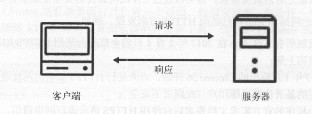
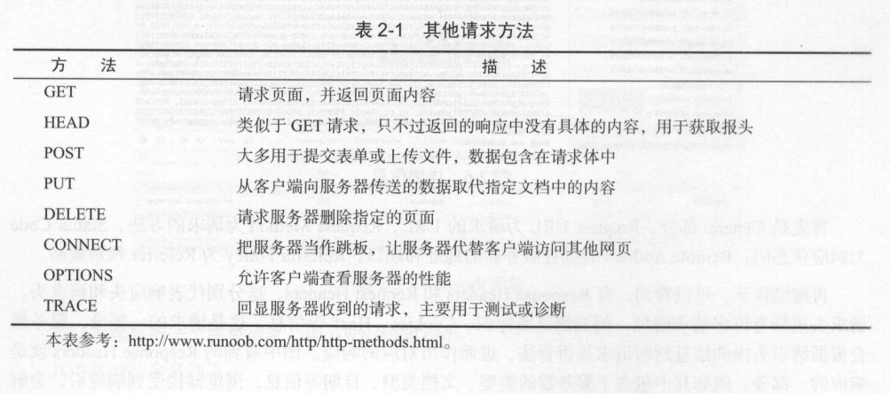
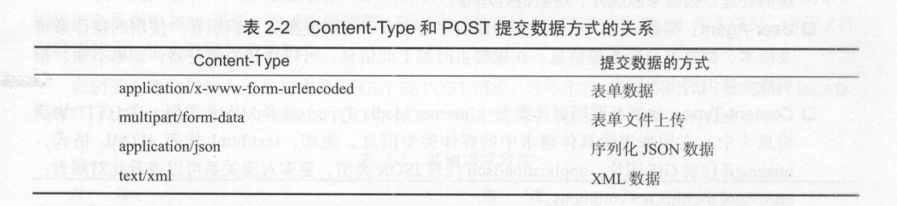
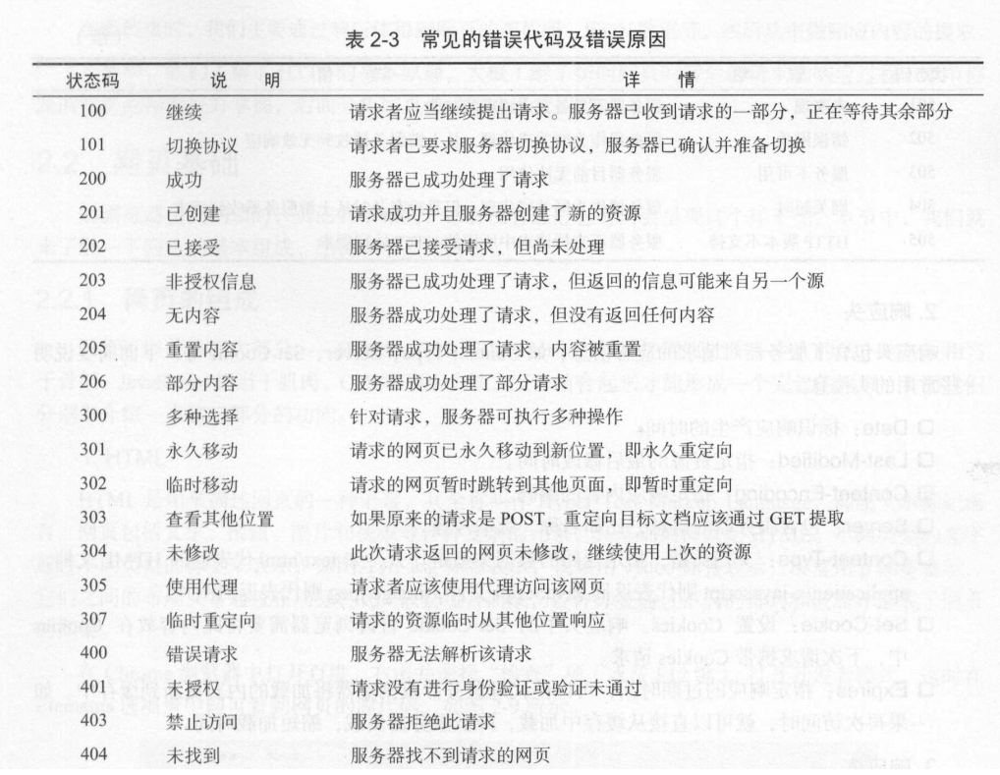
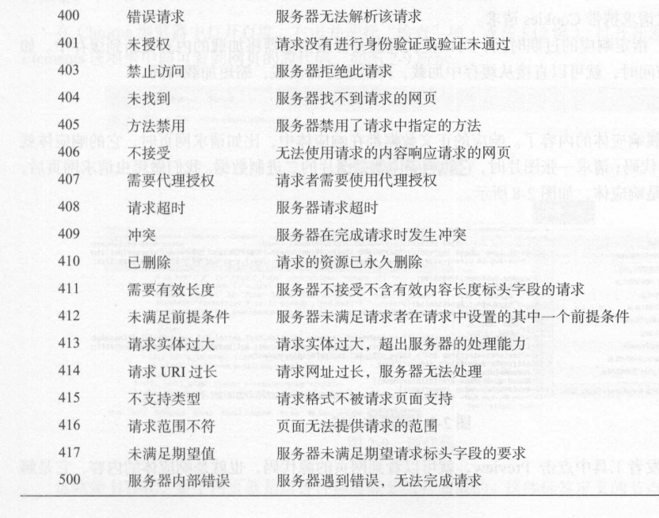
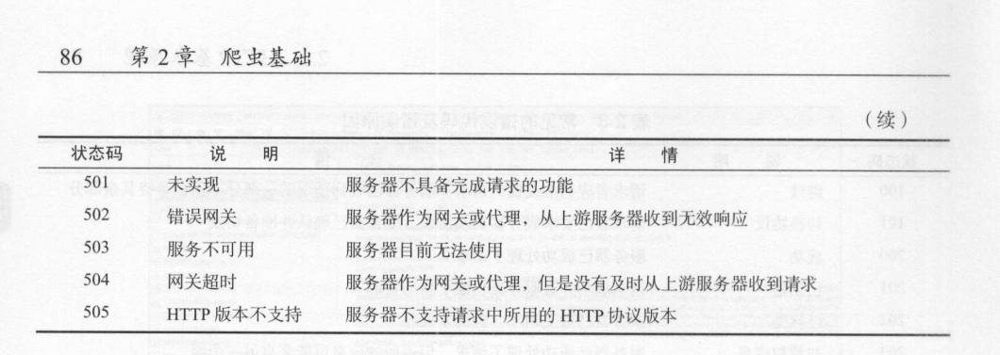
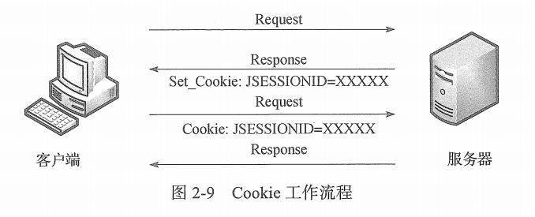

[toc]

# 计算机网络笔记01

## HTTP的基本原理

### 超文本

超文本（Hyper Text），我们在浏览器中看到的网页就是超文本解析而成的。

因此超文本就是HTML网页。

### HTTP 和 HTTPS

HTTP全称是超文本传输协议( Hyper Text Transfer Protocol )。HTTP协议是用于从网络中把超文本（HTML网页）传输到浏览器的协议。

HTTPS全称是超文本安全传输协议( Hyper Text Transfer Protocol over Secure Socket Layer )。HTTPS协议是HTTP协议的安全版，即在HTTP下加入了SSL层，简称为HTTPS协议。

HTTPS的安全基础是SSL，因此通过HTTPS协议传输的数据都是经过SSL加密的。它的主要作用分为两种：
- 建立一个信息安全通道，来保证数据传输的安全。
- 确认网站的真实性，凡是使用了HTTPS的网站。都可以通过点击浏览器地址栏的锁头标志，来查询网站的认证信息，从而确定网站的真实性。

### HTTP的请求过程

请求过程大致如下：
1. 浏览器输入网站地址（URL），此时相当于浏览器向网站所在的服务器发送一个请求。
2. 网站服务器接受到这个请求后，进行处理和解析。
3. 当网站处理完请求后，返回一个响应给浏览器。这个响应包含网页或数据。
4. 浏览器接受到响应后，对响应进行解析和处理。最终将网页或数据呈现在浏览器上。

### HTTP请求

通常情况下，客户端向服务器发出一个请求。这个请求是一串数据文本。

通常一个HTTP请求可以分为4部分：请求方式（Request Method），请求链接（Request URL），请求头（Request Headers），请求体（Request Body）。

#### 请求方式（Request Method）

常见的请求方式主要分为两种：GET请求 和 POST请求。

> GET请求 和 POST请求的区别
- GET请求中的请求参数是写在请求链接（Request URL）中的，请求参数是可以在URL中看到的。而POST请求的请求参数是写在请求体中的。
- 由于请求链接（Request URL）是有长度限制，请求体（Request Body）没有长度限制。因此GET请求的请求参数最多只有1024字节。而POST请求的请求参数长度没有限制。

绝大部分请求都是GET请求 和 POST请求。除此之外还有其他请求。如图所示。

#### 请求链接（Request URL）

请求链接就是我们想要获取的数据资源的位置。

#### 请求头（Request Headers）

由于请求本质上是一串数据文本。而请求头用来设置请求中的各种附加信息。

下面是常见的请求头：
- Accept: 请求报头域，用来指定发送请求的客户端可以接受那种类型的数据。
- Accept-Language: 指定客户端可接受的语言。
- Accept-Encoding: 指定客户端可接受的数据编码格式。
- Host: 指定客户端的IP和端口号。
- Cookie: 主要功能是维持当前访问会话。用户登录网站成功后，Cookie会存储服务器发送过来的会话消息。之后每次向该网站发送请求的时候，会携带这个Cookie。此时服务器会识别用户，并且查询出当前用户是已登录状态。
- Referer: 用来标识请求的来源。服务器可以拿到这个信息并进行处理。例如来源统计，图片防盗链处理。
- User-Agent: 简称UA，用来设置客户端的设备信息。例如客户端使用的操作系统，浏览器信息。
- Content-Type: 用来标识请求体中的数据类型。例如 `text/html`代表请求体中的数据是html格式的。`image/gif`代表GIF图片。`application/json`代表json类型数据。

#### 请求体（Request Body）

请求体一般承载的内容是POST请求中的请求参数。GET请求没有请求体。

通常情况下，请求体中的数据可以有多种格式。我们主要是通过请求头中的`Content-Type`属性来标识请求体中的数据是什么格式。

> 请求头中的`Content-Type`属性与请求体数据的关系

例如当请求体中的数据是json格式的时候，我们需要在请求头的`Content-Type`属性设置为`application/json`。表示请求体中的数据是json格式。

当服务器接受到这个请求的时候，它会先读取请求头的`Content-Type`属性，然后根据属性值，来解析并处理请求体中的数据。

### HTTP响应

通常情况下，响应是指服务器给客户端发送的请求。响应分为三个部分：响应状态码（Response Status Code）、响应头（Response Headers）和 响应体（Response Body）。

#### 响应状态码（Response Status Code）

响应状态码表示服务器的响应状态。

我们可以根据服务器的响应状态码，来判断请求是否成功。如图是常见的响应状态码。

#### 响应头（Response Headers）

由于响应本质上是一串数据文本。而响应头用来设置响应中的各种附加信息。其中包含了服务器对请求的应答信息。

下面是常见的请求头：
- Date: 响应产生的时间。
- Last-Modified: 指定资源的最后修改时间。
- Content-Encoding: 指定响应中数据的编码格式。
- Server：包含服务器的信息，例如名称，版本号等。
- Content-Type: 指定响应体中的数据类型。例如 `text/html`代表响应体中的数据是html格式的。`image/gif`代表GIF图片。`application/json`代表json类型数据。
- Set-Cookie: 设置Cookile。告诉客户端需要把此内容放到Cookie中。
- Expires: 指定响应的过期时间。可以让代理服务器或浏览器将响应内容更新到缓存中。如果再次访问的时候，就可以直接在缓存中加载，直到过期时间为止。

#### 响应体（Response Body）

通常情况下，响应体中的数据可以有多种格式。我们主要是通过响应头中的`Content-Type`属性来标识响应体中的数据是什么格式。

响应体与请求体同理。不再赘述。

### HTTP的无状态性

HTTP有一个特性，叫作无状态性。

HTTP的无状态性是指 HTTP协议 对事务处理是没有记忆能力。即服务器不知道客户端的状态是什么。

当客户端向服务器发送多个请求后，服务器解析这多个请求，然后返回响应。在这个过程中，服务器不会记录多个请求的关联性，服务器只负责接受请求，并且分析处理，响应即可。

也就是说服务器缺少状态记录。这意味着如果后续需要服务器再次处理之前的请求，则必须要客户端重新发送之前的请求。

为了能够让HTTP保持状态，会话和Cookie 技术便出现了。

#### 会话Session 和 Cookie

会话 本义是指有始有终的一系列动作或消息。例如打电话时，从拿起电话-> 互相交流 -> 挂断电话。这一系列过程都可以称为一个会话。 

在WEB中，会话是指保存在服务器上的用户状态信息。当用户发送多个请求给服务器的时候，服务器会一直保存该用户的会话信息。

在WEB中，Cookie是指保存在客户端（浏览器）中的用户状态信息。主要是为了辨别用户身份，并进行会话跟踪。

> 如何通过会话Session 和 Cookie，从而让HTTP请求保持状态？

1. 当客户端第一次向服务器发送请求的时候，服务器会返回一个响应。响应头中包含`Set-Cookie`属性。
2. 客户端读取响应中的`Set-Cookie`属性，其中包含会话信息。之后把属性值作为Cookie保存起来。
3. 当客户端再一次请求该服务器的时候，客户端会把Cookie 放到请求头，并一起发送给服务器。
4. Cookies 携带了会话 ID 信息，服务器解析该 Cookies 即可找到对应的会话是什么，然后再判断会话是属于哪个用户的。
5. 若服务器发现该会话信息是有效的，则证明该用户是属于登录状态，那么服务器就响应数据。否则响应失败，或者让用户重新登录。

因此 会话 和 Cookie需要互相配合，一个保存在服务器上，一个保存在客户端上，二者共同协作，就实现了
登录会话控制。从而让HTTP请求保持状态。

#### Cookie 状态管理

Cookie和Session 都是用来保存状态信息的。Cookie是状态信息保存在客户端（浏览器）上，而Session是将状态信息保存在服务端上。它们都是用来解决 HTTP 无状态的问题而出现的概念。

Cookie是客户端上存储的一小段文本，并且Cookie会随着每一个请求发送给服务端上。

Cookie的工作方式：服务端给每个会话Session分配一个唯一的JSESSEIONID，并作为cookie将其发送给客户端。当客户端对该服务器发送请求的时候，客户端会携带上这个cookie。这样服务端会接受到cookie，解析出JSESSEIONID，从而知道这个请求是哪个客户端发送的。

## 代理的基本原理

一般情况下，网站会采取一些反爬虫措施。

比如，服务器会检测某个 IP 在单位时间内的请求次数，如果超过了这个阔值，就会直接拒绝服务，返问一些错误信息，这种情况可以称为封 IP。

针对封IP，一种有效的应对措施，就是使用代理服务器。通过代理服务器来伪装客户端的真实IP，当代理服务器的IP被封的时候，直接更换代理服务器即可。

### 什么是代理服务器？

代理服务器相当于网络的中转站。

在我们正常请求一个网站时， 是发送了请求给目标服务器，然后目标服务器把响应传回给我们。如果设置了代理服务器相当于在本机和目标服务器之间搭建了一个中转站。 此时本机不是直接向目标服务器发起请求，而是把请求发送给代理服务器，然后由代理服务器再发送给目标服务器，接着由代理服务器再把目标服务器返回的响应转发给本机。

在这个过程中目标服务器识别的真实IP地址，不是本地的IP地址，而是目标服务器的IP地址。这就是代理的基本原理。

### 代理的作用

- 突破 IP 访问限制，访问一些平时不能访问的站点。
- 访问一些单位或组织机构的内网。
- 提高访问速度。
- 隐藏真实IP。对于爬虫来说，用代理就是为了隐藏自身IP。防止自身的IP被封锁，被攻击。

### 代理的分类

代理分类时，既可以根据协议区分，也可以根据其匿名程度区分。

①根据协议区分：

- FTP 代理服务器： 用于访问FTP服务器，有上传，下载功能。端口一般为21，2121等。
- HTTP 代理服务器：用于访问网页。端口一般为80，8080，3128等功能。
- SSL/TLS 代理服务器：用于访问加密网站，有SSL或TLS加密功能，端口一般为443。
- RTSP 代理服务器：用于访问流媒体服务器。端口为554。
- Telnet 代理服务器：用于telnet远程控制，端口为23。
- POP3/STMP 代理服务器： 主要用于POP3/SMTP 方式收发邮件， 具有缓存功能，端口一般为110,25等
- SOCKS 代理服务器：主要用于收发数据包，端口一般为1080。

②根据匿名程序分类：

- 透明代理服务器：透明代理服务器会改动数据包，还会告诉目标服务器，客户端的真实IP。这种代理服务器一般用于缓存和内容过滤。除此之外，并无其他显著作用。
- 普通匿名代理服务器：普通匿名代理服务器会改动数据包。目标服务器可能会发现这是一个代理服务器，也有一定几率追查到客户端的真实IP。代理服务器通常会加入的HTTP请求头有`HTTP_VIA`和`HTTP_X_FORWARDED_FOR`。
- 高度匿名代理服务器：高度匿名代理服务器不会改动数据包，只会将数据包进行转发。在目标服务器看这就是一个普通客户端在访问，并且查询的真实IP也是高度匿名代理服务器的IP。
- 间谍代理服务器：是指组织或机构创建的用于记录用户输入数据，并进行分析研究的代理服务器。
