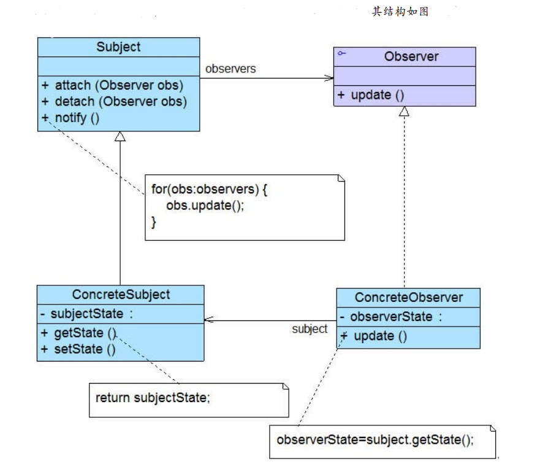
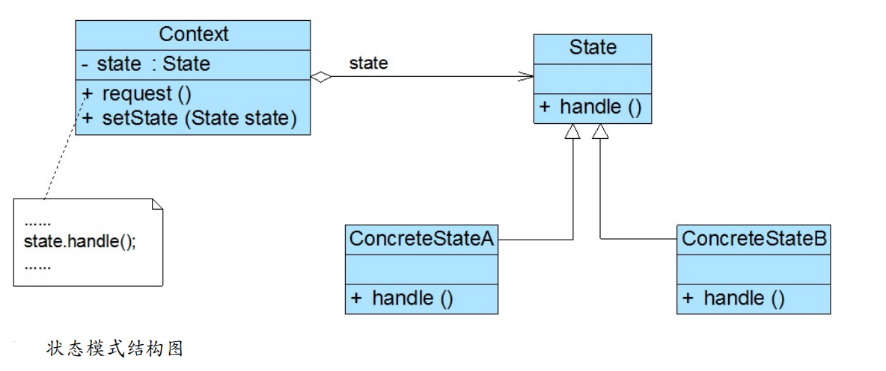

[toc]

# 设计模式笔记1

> 什么是设计模式？

Java、C#、C++是编程语言，JSP、ASP.net是开发技术，Struts、Hibernate、Mybatis是框架，都可以认为是招式；而数据结构、算法、设计模式、重构、软件工程等则为内功。

设计模式（Design pattern）是一套被反复使用、多数人知晓的、经过分类编目的、代码设计经验的总结。

使用设计模式的目的：通过设计模式可以帮助我们增强代码的可重用性、可扩充性、可维护性，让代码更容易被他人理解并且保证代码可靠性。最终实现代码的高内聚和低耦合。

> 什么是高内聚和底耦合？

在软件代码中 一个功能模块只是关注一个功能，一个模块最好只实现一个功能，这个是所谓的内聚。即各个代码模块各司其职，互补干扰。

然而模块与模块之间、系统与系统之间的交互，是不可避免的，为了尽量减少由于交互引起的单个模块无法独立使用或者无法移植的情况发生。各个模块都要尽可能多的提供接口用于对外操作， 这个就是所谓的低耦合。

> 设计模式的6大原则

① 开闭原则

对软件代码的改动，最好用扩展而非修改的方式。如果要修改代码，尽量用继承或组合的方式来扩展类的功能，而不是直接修改类的代码。

② 里氏代换原则

尽量把父类设计为抽象类或者接口，让子类继承父类或实现父接口，子类可以扩展父类的功能，但不能改变父类原有的功能。

里氏代换原则是开闭原则的具体实现手段之一。

③ 单一职责原则

一个类只承担一个职责，千万不要让一个类干的事情太多。

④ 接口隔离原则

接口最小化。接口中的方法应该尽量少。和单一职责原则类似。

- 单一职责针对的是类。
- 接口隔离针对的是接口。

⑤ 依赖倒转原则

要依赖抽象类或接口类，不要依赖具体类。

⑥ 迪米特法则（最少知道原则）

1. 类向外公开的方法应该尽可能的少，
2. 依赖的对象尽可能的少（只依赖应该依赖的对象）。


<font color="red">每个设计模式都要遵循部分原则而创建的。并不是每个设计模式都是遵循了这6个原则。</font>


## 单例模式(Singleton Pattern)

为了节约系统资源，系统中某个类只能有唯一一个实例对象。当这个唯一实例对象创建成功之后，我们无法再创建一个同类型的其他对象，所有的操作都只能基于这个唯一实例。为了确保实例对象在整个系统的唯一性，我们可以通过单例模式来实现这个类。

> 应用场景

系统中的线程池，数据库连接池。在整个系统中应该仅仅只存在一个。每次使用线程池或数据库连接池都是哪一个。因此设计线程池类和数据库连接池类就必须遵守单例模式。

>单例模式实现的类（单例类）的步骤

①：首先禁止在外部直接使用new来创建该类的对象，因此需要将类的构造函数的可见性改为private。(私有构造函数)
②：然后在类的内部，创建一个该类的实例对象。(私有静态类变量)
③：在类的内部编写方法，让外界只能够访问这个唯一的实例对象。（公有静态成员方法，返回唯一实例）

**设置为静态static 可以保证直接通过类名调用变量和方法，而不需要先创建对象之后，再调用。**

单例模式的代码如下（普通写法）：
```java
//Singleton 单例类
public class Singleton {
	private static Singleton singleton;   	//单例类的唯一的实例对象（私有静态类变量）
	private Singleton() {} 						//禁止使用new创建实例对象(私有构造函数)
	//getSingleton方法（公有静态成员方法，返回唯一实例）
    //创建唯一实例，再次调用时将返回第一次创建的实例，从而确保实例对象的唯一性。
	public static Singleton getSingleton() {
		if(singleton==null) {
			singleton = new Singleton();    	
		}
		return singleton;
	}
}
```

上述代码，在单线程环境下可以保证单例类的实例对象是唯一的。但是在多线程环境下，每次获取的单例类实例对象都是不同的。

单例模式有3种写法：

### 饿汉式写法（非线程安全）

```java
//单例模式的饿汉写法
public class Singleton {
    //这种写法，当类被加载的时候，就已经创建了实例对象。而不是类被使用的时候，才创建实例对象。
    private static Singleton instance = new Singleton();  
    private Singleton (){}  
    public static Singleton getSingleton() {  
        return instance;  
    }  
}
```

`private static Singleton instance = new Singleton();`这种写法会导致当类被加载时，静态变量instance会被初始化，然后私有构造函数会被调用，开始创建唯一实例对象，并且静态变量指向唯一实例对象。

简而言之，这种写法在没有用到单例类的时候，也会创建单例类实例对象。


### 懒汉式写法（线程安全）

懒汉式写法就是在普通写法的方法上加上synchronized修饰符来保证静态变量被多线程访问的时候，保证线程安全性。

```java
//单例模式的懒汉写法
public class Singleton {
    private static Singleton instance=null;  
    private Singleton (){}
    // 加上synchronized修饰符，保证线程安全
    public static synchronized Singleton getSingleton() {  
        if (instance == null) {  
            instance = new Singleton();  
        }  
        return instance;  
    }  
}

```

### 静态内部类写法（线程安全）

- 饿汉式写法会导致就算不用单例类，也会创建单例类的实例对象。不管将来用不用始终占据内存；
- 懒汉式写法，虽然线程安全，但是性能受影响。

因此出现饿汉式写法与懒汉式写法合一的写法：静态内部类写法。即在单例类中增加一个静态内部类，在该内部类中创建单例对象，并通过方法返回给外部使用。

本质上利用静态内部类的特性，来保证线程安全。只有在实际使用静态内部类的时候，才会加载静态内部类。

```java
//单例模式的静态内部类写法
public class Singleton {  
    //静态内部类
    private static class SingletonHolder {
        //定义静态常量
        private static final Singleton instance = new Singleton();  
    }
    //私有构造函数
    private Singleton (){}  
    //方法中调用内部类
    public static final Singleton getInstance() {  
        return SingletonHolder.instance;  
    }  
}
```

## 简单工厂模式（Simple Factory Pattern）

简单工厂模式：定义一个工厂类，它可以根据参数的不同，创建不同类的实例对象并返回。这些不同类通常都具有共同的父类或父接口。

举个例子，工厂要生产不同的产品，为了减少成本。因此这些不同的产品都必须要有共同的特性。

简单工厂模式 = 工厂类 + 抽象产品接口 + 各个产品实现类。 


>简单工厂模式的使用步骤

① 编写一个抽象产品接口。
② 编写多个产品实现类。
③ 编写工厂类，根据传入的参数不同，生产不同的产品实现类的实例对象。

```java
//抽象产品接口
public interface Product {
	public void info();
}

//产品实现类A
public class ProductA implements Product {
	@Override
	public void info() {
		System.out.println("产品A");
	}
}
//产品实现类B
public class ProductB implements Product {
	@Override
	public void info() {
		System.out.println("产品B");
	}
}

//创建工厂类
public class Factory {
	//通过输入的参数不同，生产不同的产品类实例
	public static Product create(String str) {
		Product p=null;
		if(str.equals("产品B")) {
			p =new ProductB();				//父类引用指向子类对象
		}else if(str.equals("产品A")) {
			p =new ProductA();
		}
		return p;
	}
}

//测试类
public class Test {
	public static void main(String[] args) {
		//根据传入的数据不同，创建不同的类实例
		Product a=Factory.create("产品A");
		a.create();
		Product b=Factory.create("产品B");
		b.create();
	}
}

```

## 工厂方法模式（Factory Method Pattern）- 简单工厂模式的改进

简单工厂模式的缺点：系统扩展不灵活，工厂类过于庞大。当系统中需要引入新产品时，由于工厂类是根据所传入参数的不同来创建不同的产品，这必定要修改工厂类的源代码，这违反了“开闭原则”。如何实现增加新产品而不影响已有代码？工厂方法模式应运而生。

<font color="red">工厂方法模式不再提供一个统一的工厂类来创建所有的产品对象，而是提供一个抽象工厂接口，由其实现类来具体实现不同的工厂方法。与简单工厂模式相比，最重要的区别是引入了抽象工厂，抽象工厂可以是接口，也可以是抽象类或者具体类，</font>

因此工厂方法模式 = 抽象工厂类接口 + 各个工厂实现类 + 抽象产品类接口 + 各个产品实现类。

<font color="blue">通过上面的四个模块，在工厂方法模式中不再是由一个工厂类去创建所有的产品，而是由不同的工厂实现类去创建不同的产品。</font>


代码如下
```java
//抽象产品接口
public interface Product {
	public void info();
}
//产品实现类A
public class ProductA implements Product {
	@Override
	public void info() {
		System.out.println("产品A");
	}
}
//产品实现类B
public class ProductB implements Product {
	@Override
	public void info() {
		System.out.println("产品B");
	}
}

//抽象工厂接口
public interface Factory {
	public Product create();
}
//工厂实现类A，专门创建产品A
public class FactoryA implements Factory{
	@Override
	public Product create() {
		return new ProductA();
	}
}
//工厂实现类A，专门创建产品B
public class FactoryB implements Factory{
	@Override
	public Product create() {
		return new ProductB();
	}
}

//test
public class Test {
	public static void main(String[] args) {
		Factory fa =new FactoryA();
		Product a=fa.create();
		a.info();
		
		Factory fb =new FactoryB();
		Product b=fb.create();
		b.info();
	}
}
```

工厂方法模式总结：
- 优点：当要在代码中加入新产品时，相比简单工厂模式，无需修改工厂类。而只要添加一个具体工厂实现类和具体产品实现类就可以了。系统的可扩展性也就变得非常好，完全符合“开闭原则”。
- 缺点：当要在代码中加入新产品时，需要编写新的具体产品实现类，和与之对应的具体工厂实现类。系统中类的个数将成对增加。

## 抽象工厂模式（Abstract Factory Pattern）

抽象工厂模式为创建一系列对象提供了一种解决方案。

**与工厂方法模式相比，抽象工厂模式中的具体工厂不只是创建一种产品，它负责创建一系列产品。**。简而言之，每一个具体工厂实现类都提供了多个方法用于产生多种不同类型的产品。

抽象工厂模式 = 抽象工厂接口 + 各个工厂实现类（提供创建多个产品的方法）+ 抽象产品接口 + 各个产品实现类。

如图所示


代码如下
```java
//抽象产品接口
public interface Product {
	public void info();
}
//产品实现类A
public class ProductA implements Product {
	@Override
	public void info() {
		System.out.println("产品A");
	}
}
//产品实现类B
public class ProductB implements Product {
	@Override
	public void info() {
		System.out.println("产品B");
	}
}

//抽象工厂接口，提供创建多个产品的抽象方法
public interface Factory {
	public Product createA();
	public Product createB();
}

//具体工厂类
public class concentrateFactory implements Factory {
	@Override
	public Product createA() {
		return new ProductA();
	}
	@Override
	public Product createB() {
		return new ProductB();
	}
}
//测试类
public class Test {
	public static void main(String[] args) {
		Factory factory=new concentrateFactory();
		Product a = factory.createA();
		Product b = factory.createB();
		a.info();
		b.info();
	}
}

```

抽象工厂模式总结：
1. 优点：创建已有的产品实例化对象很方便，无须修改已有系统结构。注意：产品都需要实现了相同的抽象产品接口。
2. 缺点：增加新的产品类的方法麻烦，需要对原有系统进行较大的修改，甚至需要修改抽象工厂类和具体工厂类代码。

## 适配器模式（用于不兼容结构的协调）

适配器模式：把一个类的接口变换成客户端所期待的另一种接口，从而使原本接口不匹配而无法一起工作的两个类能够在一起工作。

例如，你的电脑是国标的插头，但是你附近的插座都是欧标的。这样会导致你的电脑国标插头无法插上欧标插座进行充电。这时我们可以通过一个插座适配器来进行适配。这个插座适配器的插头端是欧标的，它可以插在欧标插座上，插座端是国标的，它可以被国标插头插上。

>在适配器模式中包含如下角色：
1. Target（目标类）：适配的内容，比如需要用的接口。
2. Adaptee（适配者类）：被适配的内容，比如不兼容的接口。
3. Adapter（适配器类）：适配器可以作为一个转换器，把 Adeptee 适配成 Target。通过适配器把Adaptee中不兼容的接口转化为Target需要用的接口。


> 适配器模式有2种形式
- 类适配器。 类的适配器模式是把适配的类的API转换成为目标类的API。
- 对象适配器。在对象适配器中，适配器与适配者之间是关联关系；


### 类适配器

类的适配器模式是把适配的类的API转换成为目标类的API。


如上图所示，我们要通过适配器Adapter，把Adaptee的SpecificRequest方法转化为Target的Request方法。简而言之，在Request方法中实际调用SpecificRequest方法。

代码如下
```java
// 已存在的、但不符合我们标准的被适配类。
class Adaptee {  
    public void specificRequest() {  
        System.out.println("被适配类具有 特殊功能...");  
    }  
}  
// 目标接口。
interface Target {  
    public void request();  
}  
// 适配器类，继承了被适配类，同时实现目标接口  
class Adapter extends Adaptee implements Target{
    //目标接口的Request方法中实际调用的是被适配类的SpecificRequest方法
    public void request() {  
        super.specificRequest();  
    }  
}   
// 测试类  
public class Client {  
    public static void main(String[] args) {  
        // 实例化适配器类 
        Target adapter = new Adapter();  
        adapter.request();   
    }  
}  
 // 测试结果：被适配类具有 特殊功能...
```

### 对象适配器

对象的适配器模式不是使用继承关系连接到Adaptee类，而是直接引用被适配Adaptee类。


```java
// 已存在的、但不符合我们标准的被适配类。
class Adaptee {  
    public void specificRequest() {  
        System.out.println("被适配类具有 特殊功能...");  
    }  
}  
// 目标接口。
interface Target {  
    public void request();  
}  
// 适配器类，实现目标接口，内部引用被适配类
class Adapter implements Target{  
    //引用被适配类  
    private Adaptee adaptee;  
    //通过构造函数传入被适配类对象  
    public Adapter (Adaptee adaptee) {  
        this.adaptee = adaptee;  
    }  
    public void request() {  
        // 这里是使用委托的方式完成特殊功能  
        this.adaptee.specificRequest();  
    }  
}  
// 测试类  
public class Client {  
    public static void main(String[] args) {  
        //需要先创建一个被适配类的对象作为参数  
        Target adapter = new Adapter(new Adaptee());  
        adapter.request();  
    }  
}  
 // 测试结果：被适配类具有 特殊功能...
```

> 适配器模式的优缺点
1. 优点: 解耦性,将目标类和适配者类解耦，通过引入一个适配器类重用现有的适配者类，而无需修改原有代码。
2. 优点：复用性,系统需要使用现有的类，而此类的接口不符合系统的需要。
3. 缺点：过多的使用适配器，会让系统非常零乱，不易整体进行把握。

> 适配器模式总结

建议尽量使用对象的适配器模式(无需继承被适配类),少用类的适配器模式（需要继承适配类）。当然根据需要来选用合适的实现方式。


## 观察者模式(用于对象间的联动)

观察者模式：在对象之间定义一个一对多的依赖，当一个对象状态改变的时候，所有依赖的对象都会得到通知并自动更新。也叫发布订阅模式，即当一个对象状态发生改变时，其相关依赖对象皆得到通知并被自动更新。



>在观察者模式结构图中包含如下几个角色：
* Subject（抽象目标，被观察者）:定义被观察者必须实现的职责， 它必须能够动态地增加、 取消观察者。 它一般是抽象类或者是实现类， 仅仅完成作为被观察者必须实现的职责： 管理观察者并通知观察者。
* ConcreteSubject（目标实现类，被观察者实现类）：定义被观察者对象具体的业务逻辑， 同时定义对哪些事件进行通知。
* Observer（抽象观察者接口）：观察者接收到消息后， 即进行update（更新方法） 操作， 对接收到的信息进行处理。
* ConcreteObserver（观察者实现类）：每个观察在接收到消息后的处理反应是不同， 各个观察者有自己的处理逻辑。

```java
/**
 * 被观察者
 */
public abstract class Subject {
    // 定义一个被观察者数组
    private List<Observer> obsList = new ArrayList<>();
    // 增加一个观察者
    public void addObserver(Observer observer){
        obsList.add(observer);
    }
    // 删除一个观察者
    public void delObserver(Observer observer){
        obsList.remove(observer);
    }
    // 通知所有观察者
    public void notifyObservers(){
        for (Observer observer : obsList){
            observer.update();
        }
    }
}

/**
 * 具体被观察者
 */
public class ConcreteSubject extends Subject{
    // 具体的业务
    public void doSomething(){
        super.notifyObservers();
    }
}

/**
 * 观察者
 */
public interface Observer {
    // 更新方法
    void update();
}

/**
 * 具体观察者
 */
public class ConcreteObserver implements Observer{
    @Override
    public void update() {
        System.out.println("接受到信息，并进行处理");
    }
}

//测试
public class Test {
    public static void main(String[] args) {
        // 创建一个被观察者
        ConcreteSubject subject = new ConcreteSubject();
        // 创建一个观察者
        Observer observer = new ConcreteObserver();
        // 观察者 观察 被观察者
        subject.addObserver(observer);
        subject.doSomething();
    }
}
```

>观察者模式的优缺点
1. 优点：观察者模式可以实现表示层和数据逻辑层的分离，增加新的具体观察者无须修改原有系统代码。
2. 缺点：如果一个观察目标对象有很多直接和间接观察者，将所有的观察者都通知到会花费很多时间。

### 观察者模式的使用场景


## 策略模式（用于算法的封装与切换）

策略模式：定义一系列算法类，将每一个算法封装起来，并让它们可以相互替换。

策略模式的主要目的是将算法的定义与使用分开。

如图所示


>在策略模式中包含如下几个角色：
* Context（环境类）：是使用算法的角色，它在解决某个问题时可以采用多种算法策略。其有一个对抽象策略类的引用实例，用于定义所采用的策略。
* Strategy（抽象策略类）：它为所支持的算法声明了抽象方法，是所有策略类的父类。
* ConcreteStrategy（具体策略类）：它实现了在抽象策略类中声明的算法，在运行时，使用一种具体的算法实现某个业务处理。

```java
//抽象算法策略类
abstract class AbstractStrategy {
	public abstract void algorithm(); //声明抽象算法
}
//具体算法策略类
class ConcreteStrategyA extends AbstractStrategy {
	//算法的具体实现
	public void algorithm() {
		//算法A的实现方式
	}
}
//环境类，算法策略的使用者
class Context {
	private AbstractStrategy strategy; //有一个对抽象策略类的引用
	//运用构造方法进行注入操作
	public void setStrategy(AbstractStrategy strategy) {
		this.strategy= strategy;
	}
	//调用策略类中的算法
	public void algorithm() {
		strategy.algorithm();
	}
}
//测试类
public class Test {
	public static void main(String[] args) {
        //定义策略的使用者
		Context context = new Context();
        //定义要使用的策略
		AbstractStrategy strategy = new ConcreteStrategyA(); //可在运行时指定类型;
        //使用者使用某个具体的策略
		context.setStrategy(strategy);
        //执行策略中的算法
		context.algorithm();
	}
}

```

>策略模式的优缺点：
1. 优点：用户可以在不修改原有系统的基础上选择算法或行为，也可以灵活地增加新的算法或行为。使用策略模式可以避免多重条件选择语句。
2. 缺点：策略模式将造成系统产生很多具体策略类。


## 模板方法模式（用于提高代码的复用性）

**对于 点单 -> 吃东西 -> 买单 这一流程来说**

在模板方法模式中，可以将相同的代码放在父类中，例如将方法“点单”以及“买单”的实现放在父类中，而对于方法“吃东西”，在父类中只做一个声明，将其具体实现放在不同的子类中，在一个子类中提供“吃面条”的实现，而另一个子类提供“吃饭”的实现。


>模板方法模式包含如下两个角色：
* (1) AbstractClass（抽象类）：在抽象类中定义了一系列基本操作.每一个基本操作对应算法的一个步骤，在其子类中可以重定义或实现这些步骤。同时，在抽象类中实现了一个模板方法，用于定义一个算法的框架，模板方法不仅可以调用在抽象类中实现的基本方法，也可以调用在抽象类的子类中实现的基本方法，还可以调用其他对象中的方法。
* (2) ConcreteClass（具体子类）：它是抽象类的子类，用于实现在父类中声明的抽象基本操作以完成子类特定算法的步骤，也可以覆盖在父类中已经实现的具体基本操作。

代码如下
```java
abstract class AbstractClass
{
	//模板方法,可以调用在抽象类中实现的基本方法
	public void TemplateMethod()
	{
		PrimitiveOperation1();  //操作1
		PrimitiveOperation2();  //操作2
		PrimitiveOperation3();  //操作3
	}
	//操作1—具体方法
	public void PrimitiveOperation1(){
		//实现代码
	}
	
	//操作2—抽象方法
	public abstract void PrimitiveOperation2();
	
	//操作3—钩子方法
	public virtual void PrimitiveOperation3(){ 
		//实现代码
	}
}

class ConcreteClass extends AbstractClass{
	public override void PrimitiveOperation2(){
	//实现代码
	}
	//对方法3的重写
	public override void PrimitiveOperation3(){
	//实现代码
	}
}

```

>模板方法模式的优缺点：
1. 优点：模板方法模式是一种代码复用技术，可实现一种反向控制结构，通过子类覆盖父类的钩子方法来决定某一特定步骤是否需要执行。
2. 缺点：如果父类中可变的基本方法太多，将会导致类的个数增加，系统更加庞大。此时，可结合桥接模式来进行设计。


## 装饰器模式（用于扩展对象功能）

装饰模式是处理如何让系统中的类可以进行扩展但是又不会导致类数目的急剧增加的问题。

装饰模式可以在不改变一个对象本身功能的基础上给对象增加额外的新行为。可以在不需要创造更多子类的情况下，将对象的功能加以扩展。

如图所示


>在装饰模式结构图中包含如下几个角色：
1. Component（抽象构件）：它是具体构件和抽象装饰类的共同父类，声明了在具体构件中实现的业务方法。
2. ConcreteComponent（具体构件）：用于定义具体的构件对象，实现了在抽象构件中声明的方法，装饰器可以给它增加额外的职责（方法）。
3. Decorator（抽象装饰类）：用于给具体构件增加职责，但是具体方法在其子类中实现。它有一个指向父类的引用，通过该引用可以调用构件对象，并通过其子类扩展该方法，以达到装饰的目的。
4. ConcreteDecorator（具体装饰类）：负责向构件添加新的装饰。每一个具体装饰类都定义了一些新的行为，它可以调用在父类中定义的方法，并可以增加新的方法用以扩充对象的行为。

代码举例：人类是可以跑的，但是不能飞。现在，给人类进行装饰，要人类会飞。
```java
//被装饰对象的抽象接口
public interface Human {
	public void run();
}

//具体的被装饰对象
public class Man implements Human {
	@Override
	public void run() {
		System.out.println("人会跑步");
	}
}

//抽象装饰类
public abstract class AbstractDecorator implements Human{
	//被装饰对象的引用 
	private Human human;
	//构造函数注入被装饰者
	public AbstractDecorator(Human human) {
		this.human = human;
	}
	//调用被装饰对象的方法
	@Override
	public void run() {
		human.run();
	}
}

//具体装饰类
public class ManDecorator extends AbstractDecorator {
	public ManDecorator(Human human) {
		//调用父类的构造方法
		super(human);
	}
	//装饰类增加的功能
	private void fly() {
		System.out.println("人可以飞");
	}
	//增强了功能的run方法
	@Override
	public void run() {
		super.run();
		fly();
	}
}

//测试
public class Test {
	public static void main(String[] args) {
		//创建被装饰的类
		Human human = new Man();
		//创建装饰的类，并添加被装饰类的引用
		Human superMan = new ManDecorator(human);
		//执行增强后的run方法
		superMan.run();
	}
}
```


## 状态模式（用于处理对象的多种状态及其相互转换）

状态模式用于解决系统中复杂对象的状态转换以及不同状态下行为的封装问题。

在状态模式中，把对象在每一个状态下的行为和状态转移语句封装在一个个状态类中，通过这些状态类来分散冗长的条件转移语句，让系统具有更好的灵活性和可扩展性。


>在状态模式结构图中包含如下几个角色：
* Context（环境类）：它是拥有多种状态的对象。由于环境类的状态存在多样性且在不同状态下对象的行为有所不同，因此将状态独立出去形成单独的状态类。在环境类中维护一个抽象状态类State的实例，这个实例定义当前状态，在具体实现时，它是一个State子类的对象。
* State（抽象状态类）：它用于定义一个接口以封装与环境类的一个特定状态相关的行为。其中声明了各种不同状态对应的方法，而在其子类中实现类这些方法。
* ConcreteState（具体状态类）：它是抽象状态类的子类，每一个子类实现一个与环境类的一个状态相关的行为，每一个具体状态类对应环境的一个具体状态，不同的具体状态类其行为有所不同。

代码如下
```java
abstract class State {
	//声明抽象业务方法，不同的具体状态类可以不同的实现
	public abstract void handle();
}
class ConcreteState extends State {
	public void handle() {
	//方法具体实现代码
	}
}
class Context {
	private State state; //维持一个对抽象状态对象的引用
	private int value; //其他属性值，该属性值的变化可能会导致对象状态发生变化
	//设置状态对象
	public void setState(State state) {
		this.state = state;
	}
	public void request() {
		//其他代码
		state.handle(); //调用状态对象的业务方法
		//其他代码
	}
}

```

>状态模式的优缺点：
- 优点：状态模式可以让我们避免使用庞大的条件语句来将业务方法和状态转换代码交织在一起。
- 缺点：状态模式的使用必然会增加系统中类和对象的个数，导致系统运行开销增大。


## 代理模式

**代理模式：给某一个对象提供一个代理或占位符，并由代理对象来控制对原对象的访问。代理对象起到中介的作用，它可以为客户去掉一些服务或者增添额外的服务。**


>代理模式角色划分
- (1) Subject（抽象角色）：是代理角色和真实角色的父接口。
- (2) Proxy（代理角色）：它包含了对真实角色的引用，
- (3) RealSubject（真实角色）：它定义了代理角色所代表的真实对象，在真实角色中实现了真实的业务操作，客户可以通过代理角色间接调用真实角色。

代码如下
```java
abstract class Subject
{
	public abstract void Request();
}
//
class RealSubject extends Subject
{
	public override void Request()
	{
		//业务方法具体实现代码
	}
}
//代理类
class Proxy extends Subject
{
		private RealSubject realSubject = new RealSubject(); //维持一个对真实主题对象的引用
		public void PreRequest(){    //代理类添加的多余方法
			…...
		}
		public override void Request(){
			PreRequest();
			realSubject.Request(); //调用真实对象的方法，执行目标对象的方法
			PostRequest();
		}
		public void PostRequest(){  //代理类添加的多余方法
			……
		}
}

//测试
public class Client {
	public static void main(String[] args) {
		Subject subject = new Proxy();  //父类引用指向子类对象
		subject.Request();      		//这个方法被代理进行修饰
	}
}
```

>代理模式的优缺点：
- 优点：协调调用者和被调用者，在一定程度上降低了系统的耦合度。
- 缺点：代理模式可能会造成请求的处理速度变慢。

## 原型模式（又叫克隆模式,用于对象的克隆）

原型模式：可以通过一个原型对象克隆出多个一模一样的对象。 主要是通过Object类的clone()方法进行克隆。

>原型模式分为浅克隆与深克隆两种方式。

1. 浅克隆:若原型对象中的存在基本数据类型属性变量，则会复制一份给克隆对象。若是引用数据类型属性变量，则把地址复制一份给克隆对象。


2. 深克隆:无论原型对象的成员变量是值类型还是引用类型，都将复制一份给克隆对象。除了原型对象本身被复制外，原型对象包含的所有成员变量也将复制给克隆对象。


<font color="red">
注意：原型对象所属的原型类必须实现Cloneable接口，表示这个Java类支持被克隆。如果原型类没有实现这个接口但是调用了clone()方法，Java编译器将抛出一个CloneNotSupportedException异常。
</font>

>  ① 浅克隆代码如下

```java
public class Person implements Cloneable {
	private String name;
	private int age;
    //克隆方法
	public Person Clone() throws CloneNotSupportedException{
		Object object=super.clone();
		return (Person)object;
	}
}
```

>  ② 深克隆代码如下

在Java中，如果需要实现深克隆，有两个方式。
- 方式1：原型类的引用类型变量也要进行clone方法。 
- 方式2：通过序列化(Serialization)方式来实现，即原型类及其相关的引用类型属性变量需要实现Serializable接口。

```java
//第一种方式
public class Person implements Cloneable {
	private String name;
	private int age;
	private Child child;   //引用类型变量
	public Object DeepClone() throws CloneNotSupportedException{
		Object obj = super.clone();  //直接调用object对象的clone()方法！
        Person person = (Person) obj;
        person.child = (Child)this.child.clone(); //需要对原型类的引用变量child也进行克隆
        return obj;
	}
}
//原型类相关的类也要实现Cloneable接口
class Child implements Cloneable{
	private String childname;
	public void brith() {
		System.out.println("xxx");
	}
	protected Object clone() throws CloneNotSupportedException {
        //直接通过clone方法克隆对象
        return super.clone();
    }
}


//第二种方式,通过序列化的方式进行深度克隆
public class Person implements Serializable {
	private String name;
	private int age;
	private Child child; 
	public Person DeepClone() throws IOException,ClassNotFoundException{
		/* 写入当前对象的二进制流 */ 
		ByteArrayOutputStream bos = new ByteArrayOutputStream(); 
		ObjectOutputStream oos = new ObjectOutputStream(bos); 
		oos.writeObject(this); 
		/* 读出二进制流产生的新对象 */ 
		ByteArrayInputStream bis = new ByteArrayInputStream(bos.toByteArray()); 
		ObjectInputStream ois = new ObjectInputStream(bis); 
		return (Person) ois.readObject(); 
	}
}
//原型类相关类也要实现Serializable接口，从而序列化
class Child implements Serializable{
	private String childname;
	public void brith() {
		System.out.println("xxx");
	}
}
```

## 建造者模式（用于复杂对象的组装与创建）

建造者模式：该模式将构建对象的过程分为若干个部分，每个部分分别进行构建，最终通过一个指挥者将这些部分组装成一个完整的对象。该模式可以解决复杂对象的创建和表示问题，同时可以提高代码的重用性和可维护性。


> 在建造者模式中存在以下4个角色：
- Product（产品）：表示要创建的复杂对象。
- Builder（抽象建造者接口）：定义创建产品各个部分的抽象接口。
- ConcreteBuilder（具体建造者实现类）：实现抽象建造者接口，完成产品的各个部分的构建。
- Director（指挥者）：负责构建产品的对象，指挥具体建造者进行产品的构建。

> 建造者模式适用于以下几种场景：

1. 创建对象的算法应该独立于组成部分以及它们的装配方式时。
2. 同一个构建过程有不同的表示时。
3. 需要创建一些复杂的对象，但是它们的部分构造过程必须有一定的顺序时。
4. 需要在对象创建过程中进行更加精细的控制时。

>代码如下

```java
//Product，把房子当作产品
public class Product {
	private String basic;//地基
    private String wall;//墙
    private String roofed;//楼顶
    //。。。
}

//builder抽象接口，类似抽象工厂
public interface Build {
	public void build_basic();//建造地基
	public void build_wall();
	public void build_roofed();
	public Product getProduct(); //返回具体产品
}

//ConcreteBuilder实现类，类似工厂实现类
public class ConcreteBuilder implements Build {
	private Product p;

	@Override
	public void build_basic() {
		p.setBasic("建造地基");
	}

	@Override
	public void build_wall() {
		p.setWall("建造围墙");
	}

	@Override
	public void build_roofed() {
		p.setRoofed("建造屋顶");
	}

	@Override
	public Product getProduct() {
		return p;
	}
}

//Director，类似工程师。指定产品构建步骤
public class Director {
    //传入构造者，然后指定产品的构造顺序
	public Product construct(Build builder) {
		builder.build_basic();   //先建造地基
		builder.build_roofed();  //再建造屋顶
		builder.build_wall();	 //再建造围墙
		return builder.getProduct(); //最后返回产品
	}
}

//测试
public class Test {
	public static void main(String[] args) {
        //先实例化指导者
        Director director = new Director();
        //然后实例化构造者
        Builder builder = new ConcreteBuilder();
        //开始构造
        director.construct(builder);
        //返回产品
        Product product = builder.getResult();
	}
}

```

>建造者模式优缺点：
1. 优点：可以更加精细地控制产品的创建过程。将复杂产品的创建步骤分解在不同的方法中。
2. 缺点：
    1. 建造者模式创建的产品一般有较多的共同点，如果产品之间的差异性很大，例如很多组成部分都不相同，不适合使用建造者模式。
    2. 如果产品的内部变化复杂会导致需要定义很多具体建造者类来实现这种变化，导致系统变得很庞大。

