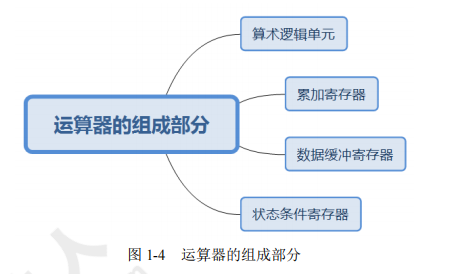
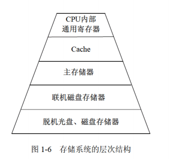
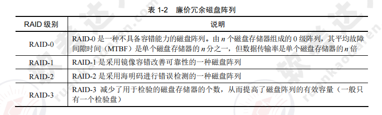
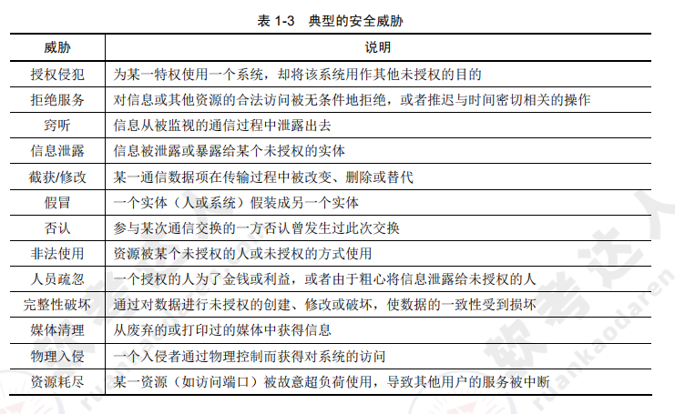

[toc]

# 软件设计师笔记01

## 软考考点

## 第一章 计算机系统知识

如图是计算机系统知识的架构图

### 计算机基础知识

#### 计算机系统硬件基本组成

计算机的基本硬件系统主要由运算器、控制器、存储器、输入设备和输出设备五大部件组成。

- 运算器、控制器等部件被集成在一起统称为中央处理单元（Central Processing Unit，CPU）。CPU是硬件系统的核心，负责数据的加工处理，能完成各种算术，逻辑运算以及控制功能。
- 存储器是计算机系统中的记忆设备，分为内部存储器和外部存储器。前者速度高、容量小，一般用于临时存放程序代码、数据及中间结果；而后者容量大、速度慢，可长期保存程序代码和数据。
- 输入设备和输出设备合称为外部设备（简称外设），输入设备用于输入原始数据及各种命令，而输出设备则用于输出计算机的运行处理结果。

#### 中央处理单元CPU

中央处理单元CPU是计算机系统的核心部件。它负责获取程序指令，对指令进行翻译转码，并执行。

##### CPU的功能

1. 程序控制。CPU通过执行指令来控制程序的运行顺序。
2. 操作控制。CPU执行一条指令，需要多个操作信号配合才能完成。CPU会产生每条指令的操作信号，并将操作xinh发送给对应的部件。之后CPU会控制相应的部件按指令的功能要求去进行操作。
3. 时间控制。CPU会对各个操作进行时间上的控制。即指令执行过程中的操作信号的出现时间，持续时间，出现的时间顺序都被CPU进行严格控制。
4. 数据处理。CPU会通过算术运算，逻辑运算的方式对数据进行加工处理,并将数据加工处理结果返回。

除此之外，CPU 还需要对系统内部和外部的中断（异常）做出响应，进行相应的处理。

如结构图所示

##### CPU的组成

CPU 主要由运算器、控制器、寄存器组和内部总线等部件组成。如下图所示

> 运算器

运算器又由算术逻辑单元（ALU），累加寄存器，数据缓冲寄存器，状态条件寄存器等部件组成。运算器的主要作用是进行数据加工处理，用于完成各种算术运算和逻辑运算。

在整个计算机系统中，运算器的全部操作，都是通过控制器发出的控制信号来指挥的。简而言之运算器接受控制器传来的指令而执行。

运算器有两个主要功能：
1. 执行所有的算术运算，例如加、减、乘、除等基本运算及附加运算。
2. 执行所有的逻辑运算并进行逻辑测试，例如与、或、非、零值测试或两个值的比较等。

运算器组成如图所示

运算器功能如图所示

下面简要介绍运算器中各组成部件的功能。
1. 算术逻辑单元（ALU）。ALU 是运算器的重要组成部件，负责处理数据，实现对数据的算术运算和逻辑运算。
2. 累加寄存器（AC）。AC 通常简称为累加器，其功能是当运算器的算术逻辑单元执行算术或逻辑运算时，为 ALU 提供一个工作区。例如，在执行一个减法运算前，先将被减数取出暂存在 AC 中，再从内存储器中取出减数，然后同 AC 的内容相减，将所得的结果送回 AC 中。运算的结果是放在累加器中的，运算器中至少要有一个累加寄存器。
3. 数据缓冲寄存器（DR）。在对内存储器进行读/写操作时，用 DR 暂时存放由内存储器读/写的一条指令或一个数据字，将不同时间段内读/写的数据隔离开来。DR 的主要作用为：作为 CPU 和内存、外部设备之间数据传送的中转站；作为 CPU 和内存、外围设备之间在操作速度上的缓冲；在单累加器结构的运算器中，数据缓冲寄存器还可兼作为操作数寄存器。
4. 状态条件寄存器（PSW）。PSW 保存由算术指令和逻辑指令运行或测试的结果建立的各种条件码内容，主要分为状态标志和控制标志，例如运算结果进位标志（C）、运算结果溢出标志（V）、运算结果为 0 标志（Z）、运算结果为负标志（N）、中断标志（I）、方向标志（D）和单步标志等。这些标志通常分别由 1 位触发器保存，保存了当前指令执行完成之后的状态。通常，一个算术操作产生一个运算结果，而一个逻辑操作产生一个判决。

如图所示

> 控制器

运算器只能完成运算，而控制器用于控制整个 CPU 的工作，它决定了计算机运行过程的自动化。

控制器不仅要保证程序的正确执行，而且要能够处理异常事件。控制器一般包括指令控制逻辑、时序控制逻辑、总线控制逻辑和中断控制逻辑等几个部分。

其中
- 指令控制逻辑要完成取指令、分析指令和执行指令的操作，其过程分为取指令、指令译码、按指令操作码执行、形成下一条指令地址等步骤。
- 时序控制逻辑要为每条指令按时间顺序提供应有的控制信号。
- 总线逻辑是为多个功能部件服务的信息通路的控制电路。
- 中断控制逻辑用于控制各种中断请求，并根据优先级的高低对中断请求进行排队，逐个交给 CPU 处理。

下面是控制器中内部的寄存器功能介绍：
1. 指令寄存器（IR）。当 CPU 执行一条指令时，先把它从内存储器取到缓冲寄存器中，再送入 IR 暂存，指令译码器根据 IR 的内容产生各种微操作指令，控制其他的组成部件工作，完成所需的功能。
2. 程序计数器（PC）。PC 具有寄存信息和计数两种功能，又称为指令计数器。程序的执行分两种情况，一是顺序执行，二是转移执行。在程序开始执行前，将程序的起始地址送入 PC，该地址在程序加载到内存时确定，因此 PC 的内容即是程序第一条指令的地址。执行指令时，CPU 自动修改 PC 的内容，以便使其保持的总是将要执行的下一条指令的地址。由于大多数指令都是按顺序来执行的，所以修改的过程通常只是简单地对 PC 加 1。当遇到转移指令时，后继指令的地址根据当前指令的地址加上一个向前或向后转移的位移量得到，或者根据转移指令给出的直接转移的地址得到。
3. 地址寄存器（AR）。AR 保存当前 CPU 所访问的内存单元的地址。由于内存和 CPU 存在着操作速度上的差异，所以需要使用 AR 保持地址信息，直到内存的读 / 写操作完成为止。
4. 指令译码器（ID）。指令包含操作码和地址码两部分，为了能执行任何给定的指令，必须对操作码进行分析，以便识别所完成的操作。指令译码器就是对指令中的操作码字段进行分析解释，识别该指令规定的操作，向操作控制器发出具体的控制信号，控制各部件工作，完成所需的功能。

> 寄存器组

寄存器组可分为专用寄存器和通用寄存器。运算器和控制器中的寄存器是专用寄存器，其作用是固定的。通用寄存器用途广泛并可由程序员规定其用途，其数目因处理器不同有所差异。

##### 多核CPU

核心又称为内核，是 CPU 最重要的组成部分。CPU 中心那块隆起的芯片就是核心，是由单晶硅以一定的生产工艺制造出来的，CPU 所有的计算、接收 / 存储命令、处理数据都由核心执行。

各种 CPU 核心都具有固定的逻辑结构，一级缓存、二级缓存、执行单元、指令级单元和总线接口等逻辑单元都会有合理的布局。

> 多核相比单核的区别

多核是指在一个单芯片上面集成两个甚至更多个处理器内核，其中，每个内核都有自己的逻辑单元、控制单元、中断处理器、运算单元，一级 Cache、二级 Cache 共享或独有，其部件的完整性和单核处理器内核相比完全一致。

多核 CPU 系统最大的优点是可满足用户同时进行多任务处理的要求。

单核多线程 CPU 是交替地转换执行多个任务，只不过交替转换的时间很短，用户一般感觉不出来。如果同时执行的任务太多，就会感觉到 “慢” 或者 “卡”。而多核在理论上则是在任何时间内每个核执行各自的任务，不存在交替问题。因此，单核多线程和多核（一般每核也是多线程的）虽然都可以执行多任务，但多核的速度更快。

#### 数据表示

存储在计算机中的各个数据称为机器数，其特点是采用二进制计数制，数的符号用 0 和 1表示，小数点则隐含，表示不占位置。机器数对应的实际数值称为数的真值。

机器数有无符号数和有符号数之分。
- 对于无符号数，是指在机器数中没有符号位。无符号数都表示正数，没有负数表示。若约定小数点的位置在机器数的最低位之后，则是纯整数；若约定小数点的位置在机器数的最高位之前，则是纯小数。例如一串二进制机器数1101，按无符号数的编码方式，其代表十进制数13。
- 对于有符号数，机器数的最高位是指表示正、负的符号位，其中0为正数，1为负数。其余位则表示数值。例如一串二进制机器数1101，按有符号数的编码方式，其代表十进制数-3。

为了便于运算，带符号的机器数可采用原码、反码和补码等不同的编码方法，机器数的这些编码方法称为码制。

##### 原码表示法

在原码表示法中，机器数是有符号数，最高位表示正负符号位。其中0为正数，1为负数。

##### 反码表示法

在反码表示法中，机器数是有符号数，最高位表示正负符号位。其中0为正数，1为负数。

##### 补码表示法

在补码表示法中，机器数是有符号数，最高位表示正负符号位。其中0为正数，1为负数。

##### 移码表示法

各种编码方式下的有符号数范围表如图所示

#### 校验码

计算机系统运行时，为了确保数据在传送过程中正确无误，通常使用校验码的方法来检测传送的数据是否出错。从而提高硬件电路的可靠性，提高代码的校验能力，包括查错和纠错。

其基本思想是把数据可能出现的编码分为两类：合法编码和错误编码。合法编码用于传送数据，错误编码是不允许在数据中出现的编码。合理地设计错误编码以及编码规则，使得数据在传送中出现某种错误时会变成错误编码，这样就可以检测出接收到的数据是否有错。

下面简要介绍常用的 3 种校验码：奇偶校验码、海明码和循环余校验码。

> 奇偶校验码

奇偶校验是一种简单有效的校验方法。通过在编码中增加一位校验位，使编码中 1 的个数为奇数（奇校验）或者为偶数（偶校验），从而使码距变为 2。

对于奇校验，可检测代码中奇数位出错的编码，但不能发现偶数位出错情况。当合法编码中的奇数位发生错误，即编码中的 1 变成 0 或 0 变成 1 时，该编码中 1 的个数的奇偶性就发生变化，从而可发现错误。

常用的奇偶校验码有 3 种：水平奇偶校验码、垂直奇偶校验码和水平垂直校验码。

> 海明码

海明码是利用奇偶性来查错和纠错的校验方法。

> 循环冗余校验码

循环冗余校验码由两部分组成，左边为信息码（数据），右边为校验码，广泛用于数据通讯领域和磁介质存储系统。

### 计算机体系结构

#### 计算机体系结构的发展

##### 计算机体系结构的概述

1964 年，阿姆达尔（G.M.Amdahl）在介绍 IBM360 系统时指出，计算机体系结构是站在程序员的角度所看到的计算机属性。

1982 年，梅尔斯（G.J.Myers）在其所著的《计算机体系结构的进展》一书中定义了组成计算机系统的若干层次。

1984 年，拜尔（J.L.Baer）在一篇题为《计算机体系结构》的文章中给出了一个含义更加广泛的定义：计算机体系结构是由结构、组织、实现、性能四个基本方面组成的。其中结构指计算机系统各种硬件的互连；组织指各种部件的动态联系与管理；实现指各模块设计的组装完成；性能指计算机系统的行为表现。

计算机体系结构，计算机组织和计算机实现，三者之间的关系如图所示。
- 计算机体系结构是指计算机的概念性结构和功能属性。
- 计算机组织是指计算机体系结构的逻辑实现，包括机器内的数据流和控制流的组成以及逻辑设计等（常称为计算机组成原理）。
- 计算机实现是指计算机组织的物理实现。

##### 计算机体系结构分类

1. 从宏观上按处理机的数量分类。分为单处理系统，并行处理与多处理系统和分布式处理系统。

2. 从微观上按并行程度分类,有Flynn分类法，冯泽云分类法，Handler分类法，Kuck分类法。

##### 指令系统

一个处理器支持的指令和指令的字节级编码称为其指令集体系结构（Instruction Set Architecture，ISA）。不同的处理器族支持不同的指令集体系结构，所以一个程序被编译在一种机器上运行，往往不能在另一种机器上运行。 

从体系结构的观点对指令集进行分类，可以根据下述 5 个方面
1. 操作数在 CPU 中的存储方式，即操作数从主存中取出后保存在什么地方。
2. 显式操作数的数量，即在典型的指令中有多少个显式命名的操作数。
3. 操作数的位置，即任一个 ALU 指令的操作数能否放在主存中，如何定位。
4. 指令的操作，即在指令集中提供哪些操作。
5. 操作数的类型与大小。

指令系统的优化。面向高级语言的优化思路是尽可能缩小高级语言与机器语言之间的语义差异。面向操作系统的优化思路是进一步缩小操作系统与体系架构之间的语义差异。

##### 存储系统

> 存储器的层次结构

计算机系统中可能包括各种存储器，如 CPU 内部的通用寄存器组、CPU 内的 Cache（高速缓存）、CPU 外部的 Cache、主板上的主存储器、主板外的联机（在线）磁盘存储器以及脱机（离线）的磁带存储器和光盘存储器等。

不同特点的存储器通过适当的硬件、软件有机地组合在一起形成计算机的存储体系结构。如下图所示

> 存储器的分类

> 高速缓存

高速缓存用来存放当前最活跃的程序和数据，其特点是：位于 CPU 与主存之间；容量一般在几千字节到几兆字节之间；速度一般比主存快 5～10 倍，由快速半导体存储器构成；其内容是主存局部域的副本，对程序员来说是透明的。

> 虚拟存储器

虚拟存储（Virtual Memory）技术是把很大的程序（数据）分成许多较小的块，全部存储在辅存中。运行时把要用到的程序（数据）块先调入主存，并且把马上就要用到的程序块从主存调入高速缓存。这样就可以一边运行程序，一边进行所需程序（数据）块的调进或调出。

虚拟存储器管理方式的分类。

> 外存储器

外存储器用来存放暂时不用的程序和数据，并且以文件的形式存储。CPU 不能直接访问外存中的程序和数据，只有将其以文件为单位调入主存才可访问。

外存储器主要由磁表面存储器（如磁盘、磁带）、光盘存储器及固态硬盘（采用 Flash 芯片或 DRAM 作为存储介质的存储器）构成。

常见的两种外存储器如图所示

> 磁盘阵列技术

磁盘阵列是由多台磁盘存储器组成的一个快速、大容量、高可靠的外存子系统，常见的磁盘阵列称为廉价冗余磁盘阵列（RAID）。

常见的 RAID 如图所示。

##### 总线结构

总线（Bus），是指计算机设备和设备之间传输信息的公共数据通道。总线是连接计算机硬件系统内多种设备的通信线路，它的一个重要特征是由总线上的所有设备共享，因此可以将计算机系统内的多种设备连接到总线上。

> 总线的定义与分类

一般来说，任何连接两个以上电子元器件的导线都可以称为总线。总线一般分为三类，分别是内部总线、系统总线、外部总线。

- 系统总线: 系统总线的性能直接影响计算机的性能。常见的标准包括 ISA 总线、EISA 总线、PCI 总线。
- 外部总线: 外部总线的标准较多，包括 RS-232C、SCSI 总线、USB、IEEE-1394、IEEE-488 等。

### 计算机安全

#### 计算机安全概述

计算机安全是一个涵盖非常广的课题，既包括硬件、软件和技术，又包括安全规划、安全管理和安全监督。

计算机安全可包括安全管理、通信与网络安全、密码学、安全体系及模型、容错与容灾、涉及安全的应用程序及系统开发、法律、犯罪及道德规范等领域。

其中安全管理非常重要，作为信息系统的管理部门应根据管理原则和该系统处理数据的保密性，制定相应的管理制度或规范。例如，根据工作的重要程度确定系统的安全等级，根据确定的安全等级确定安全管理的范围，制定相应的机房管理制度、操作规程、系统维护措施以及应急措施等。

> 计算机的安全等级

美国国防部和国家标准局的《可信计算机系统评测标准》TCSEC/TDI 将计算机安全划分为4组7个等级。如图所示

> 计算机的安全威胁

典型的安全威胁如图所示

> 加密技术和认证技术

加密技术是最常用的安全保密手段，其中密钥加密技术的密码体制分为对称密钥体制和非对称密钥体制两种。相应地，对数据加密的技术分为对称加密（私人密钥加密）和非对称加密（公开密钥加密）。

1. 常见对称加密算法如图

2. 非对称加密算法

与对称加密算法不同，非对称加密算法需要两个密钥：公开密钥和私有密钥。两者是一对，如果用公开密钥对数据进行加密，只有用对应的私有密钥才能解密；如果用私有密钥对数据进行加密，只有用对应的公开密钥才能解密。因为加密和解密使用的是两个不同的密钥，所以这种算法称为非对称加密算法。

认证技术主要解决网络通信过程中通信双方的身份认可。认证的过程涉及加密和密钥交换。通常，加密可使用对称加密、不对称加密及两种加密方法的混合方法。认证方一般有账户名 / 口令认证、使用摘要算法认证和基于 PKI 的认证。

关键绩效指标（PKI）的基本构成部分和数字签名如图所示。

## 第二章 程序设计语言基础知识

### 程序语言的基本概念

> 低级语言和高级语言

由于计算机硬件只能识别由 0、1 组成的机器指令序列，即机器指令程序，因此机器指令是最基本的计算机语言。机器指令是特定的计算机系统所固有的、面向机器的语言，所以用机器语言进行程序设计时效率很低，程序的可读性很差，也难以修改和维护。

之后，人们就用容易记忆的符号代替 0、1 序列来表示机器指令。例如用 ADD 表示加法、用 SUB 表示减法等。用符号表示的指令称为汇编指令，汇编指令的集合被称为汇编语言。

汇编语言与机器语言十分接近，其书写格式在很大程度上取决于特定计算机的机器指令，因此它仍然是一种面向机器的语言。人们称机器语言和汇编语言为低级语言。

再之后，人们开发了功能更强、抽象级别更高的语言以支持程序设计，于是就产生了面向各类应用的程序设计语言，称为高级语言。常见的有 Java、C、C++、PHP、Python、Delphi、PASCAL 等。这类语言与人们使用的自然语言比较接近，提高了程序设计的效率。

> 编译程序和解释程序

由于计算机只能理解由 0、1 序列构成的机器语言，因此高级程序设计语言需要翻译，担负这一任务的程序称为 “语言处理程序”。语言之间的翻译形式有多种，基本方式为汇编、解释和编译。

用某种高级语言或汇编语言编写的程序称为源程序，源程序不能直接在计算机上执行。如果源程序是用汇编语言编写的，则需要一个对应的“语言处理程序”将其翻译成目标程序后才能在计算机上运行。如果源程序是用某种高级语言编写的，则需要对应的解释程序或编译程序对其进行翻译，然后在机器上运行。

- 解释程序（解释器），它或者直接解释执行源程序，或者将源程序翻译成某种中间代码后再加以执行；
- 编译程序（编译器）则是将源程序翻译成目标语言程序，然后在计算机上运行目标程序。

这两种语言处理程序的根本区别是：在编译方式下，机器上运行的是与源程序等价的目标程序，源程序和编译程序都不再参与目标程序的执行过程；而在解释方式下，解释程序和源程序（或其某种等价表示）要参与到程序的运行过程中，运行程序的控制权在解释程序。简单来说，在解释方式下，翻译源程序时不生成独立的目标程序，而编译器则将源程序翻译成独立保存的目标程序。

简而言之：解释程序会一边解释源程序，然后一边运行解释后的目标程序。而编译程序是将源程序编译完之后，再运行编译后目标程序。

> 程序设计语言的定义

一般地，程序设计语言的定义都涉及语法、语义和语用等方面。

语法是指由程序设计语言的基本符号组成程序中的各个语法成分（包括程序）的一组规则，其中由基本字符构成的符号（单词）书写规则称为词法规则，由符号构成语法成分的规则称为语法规则。程序设计语言的语法可用形式语言进行描述。

语义是指程序设计语言中按语法规则构成的各个语法成分的含义，可分为静态语义和动态语义。静态语义指编译时可以确定的语法成分的含义，而运行时刻才能确定的含义是动态语义。一个程序的执行效果说明了该程序的语义，它取决于构成程序的各个组成部分的语义。

语言的实现则有个语境问题。语境是指理解和实现程序设计语言的环境，包括编译环境和运行环境。

> 程序设计语言的分类

程序语言的分类没有统一的标准，这里根据设计程序的方法将程序语言大致分为命令式和结构化程序设计语言、面向对象的程序设计语言、函数式程序设计语言和逻辑型程序设计语言等范型。

- 命令式和结构化程序设计语言：通常所称的结构化程序设计语言属于命令式语言类。例如C语言。
- 面向对象的程序设计语言: C++、Java 是面向对象程序设计语言的代表，它们都支持数据隐藏、数据抽象、用户定义类型、继承和多态等特性。
- 函数式程序设计语言： 函数式语言的代表 LISP 在许多方面与其他语言不同，其中最为显著的是，其程序和数据的形式是等价的，这样数据结构就可以作为程序执行，程序也可以作为数据修改。常见的函数式语言有 Haskell、Scala、Scheme、APL 等。
- 逻辑型程序设计语言： 逻辑型语言是一类以形式逻辑为基础的语言，其代表是建立在关系理论和一阶谓词理论基础上的 PROLOG。

### 程序设计语言的基本成分

程序语言的基本成分包括数据、运算、控制和传输等。
1. 数据成分:  是指 常量和变量，全局量和局部量，数据类型等
2. 运算成分： 是指 算式运算、关系运算、逻辑运算。
3. 控制成分： 是指 顺序结构、选择结构、循环结构。
4. 传输成分： 是指 数据传输方式，如赋值处理，数据的输入和输出等。

### 汇编程序的基本原理

> 汇编语言源程序

汇编语言是为特定的计算机或计算机系统设计的面向机器的符号化的程序设计语言。用汇编语言编写的程序称为汇编语言源程序。

用汇编语言编写程序要遵循所用语言的规范和约定。汇编语言源程序由若干条语句组成，一个程序中可以有三类语句：指令语句、伪指令语句和宏指令语句。

> 汇编程序

因为计算机不能直接识别和运行汇编语言源程序，所以要用专门的翻译程序—汇编程序进行翻译。因此汇编程序的作用是将汇编语言所编写的源程序翻译成机器指令程序。

汇编程序一般需要两次扫描源程序才能完成翻译过程。
- 第一次扫描：检查语法错误，确定符号名字；建立使用的全部符号名字表；每一符号名字后跟一个对应值（地址或数）。
- 第二次扫描：在第一次扫描的基础上，将符号地址转换成真地址（代真）；利用操作码表将助记符转换成相应的目标码。

### 编译程序的基本原理

> 编译过程概述

编译程序的功能是把某高级语言书写的源程序翻译成与之等价的目标程序（汇编语言或机器语言）。

编译程序的工作过程可以分为 6 个阶段，如图所示，在实际的编译器中可能会将其中的某些阶段结合在一起进行处理。

### 解释程序的基本原理

解释程序是另一种语言处理程序，在词法、语法和语义分析方面与编译程序的工作原理基本相同，但是在运行用户程序时，它直接执行源程序或源程序的内部形式。因此，解释程序不产生源程序的目标程序，这是它和编译程序的主要区别。

如图是解释程序实现高级语言的三种方式

## 第三章 数据结构与数据运算

数据的结构可以分为线性结构、非线性结构与数据的运算三个部分。

该章节的架构图如下。

### 线性结构

线性结构是一种基本的数据结构，主要用于对客观世界中具有单一前驱和后继的数据关系进行描述。线性结构的特点是数据元素之间呈现一种线性关系，即元素 “一个接一个排列”。

#### 线性表

线性表是最简单、最基本的数据结构。线性表常采用顺序存储和链式存储，主要的基本操作是插入、删除和查找等。

一个线性表是 n（n≥0）个元素的有限序列，通常表示为（a1,a2,...,an）。非空线性表的特点为：
- ①存在唯一的一个称作“第一个”的元素；
- ②存在唯一的一个称作“最后一个”的元素；
- ③除第一个元素外，序列中的每个元素均有一个直接前驱；
- ④除最后一个元素外，序列中的每个元素均有一个直接后继;

> 线性表的存储结构

1. 顺序存储

线性表的顺序存储是指用一组地址连续的存储单元依次存储线性表中的数据元素，从而使得逻辑上相邻的两个元素在物理位置上也相邻。

- 优点：可以随机存取表中元素。
- 缺点：插入与删除需要移动元素。

如图所示

2. 链式存储

链式存储通过指针链接起来的结点来存储数据元素。链式存储结构有单链表、循环链表（循环单链表、循环双链表）等，其中单链表只能从头结点开始往后顺序遍历整个链表，而循环单链表可以从表中的任一结点开始遍历整个链表。

- 优点：插入与删除不需要移动元素。
- 缺点：不能对数据元素进行随机访问。

如图所示

> 栈

栈又称为“后进先出”（LIFO）的线性表。在栈中进行插入和删除操作的一端称为栈顶，另一端称为栈底。

如图所示

> 队列

队列是一种“先进先出”（FIFO）的线性表，即在表的一端插入元素，在另一端删除元素。在队列中允许插入元素的一端称为队尾（rear），允许删除元素的一端称为队头（front）。

如图所示

> 循环队列

由于顺序队列的存储空间是提前设定的，所以队尾指针会有一个上限值，当队尾指针达到上限时便无法通过修改队尾指针来添加元素。如若将顺序队列设置成环状结构，就可以维持入队、出队操作。

1. 假设环队列 Q 的容量为 MAXSIZE，初始队列为空，而且 Q.rear 和 Q.front 都等于 0。如图a所示
2. 元素入队时，修改队尾指针 Q.rear=(Q.rear+1)%MAXSIZE，如图b所示。
3. 元素出队时，修改队头指针 Q.front=(Q.front+1)%MAXSIZE，如图c所示。
4. 循环队列约定以“队尾指针所指位置的下一个位置是队头指针”来表示“队列满”的情况，如图d所示。

> 双端队列

某双端队列如图所示，要求元素进出队列必须在同一端口，即从 A 端进入的元素必须从 A 端出、从 B 端进入的元素必须从 B 端出。

> 串

串是仅由字符构成的有限序列，也是一种线性表，一般记为 s=“a1a2...an”（n>0），其中，s 是串的名称，用单引号括起来的字符序列是串值。

串的基本概念包括：
1. 空串：长度为 0 的串称为空串，空串不包含任何字符。
2. 空格串：由一个或多个空格组成的串。
3. 子串：由串中任意长度的连续字符构成的序列称为子串。含有子串的串称为主串。空串是任意串的子串。

### 非线性结构

#### 二维数组

如图所示，二维数组的特点如下：
1. 数据元素数目固定，一旦定义了一个数组结构，就不再有元素个数的增减变化。
2. 数据元素具有相同的类型。
3. 数据元素的下标关系具有上下界约束且下标有序。

#### 三对角矩阵

#### 树

树是 n（n≥0）个结点的有限集合，当 n=0 时，集合为空，称为空树。在任意一非空树中（n＞0），有且仅有一个称为根的结点，其余结点可以分成 m（m≥0）个不相交的有限结点的集合 T1,T2,…,Tm，其中每个 T1 又都是一棵树，并且称为根的子树，如图所示。

> 树的基本概念

1. 双亲、孩子和兄弟。结点的子树的根称为该节点的孩子结点；相应地，该结点称为其子结点的双亲。具有相同双亲的结点互为兄弟。
2. 结点的度。一个结点拥有子树的个数称为该结点的度。例如，如图 3-10 中，A 的度为 3，B 的度为 2，C 的度为 0，D 的度为 1。
3. 叶子结点。叶子结点是指度为 0 的结点。例如，图 3-10 中的 E、F、C、G 都是叶子结点。
4. 内部结点。除根结点外，度不为 0 的结点称为内部结点。例如，图 3-10 中的 B、D 都是内部结点。
5. 结点的层次。例如，图 3-10 中的 A 在第一层，B、C、D 在第二层，E、F、G 在第三层。
6. 树的深度。一棵树的最大层数为该树的深度（或高度）。例如，图 3-10 中的树的深度为 3。
7. 有序/无序树。如果树中各结点的各个子树是从左到右有序排列且不能交换时，则称该树为有序树，否则称为无序树。

> 二叉树

二叉树与普通树的区别在于，二叉树中结点的子树分为左子树和右子树，如图所示。

> 满二叉树与完全二叉树

如果一个二叉树的层数为 K，结点总数为 2^k - 1 个，则它就是满二叉树，如图a所示。在一个深度为 h 的完全二叉树中，除第 h 层外（最后一层），其他各层都是满的。第 h 层所有的结点都必须从左到右依次放置，不能留空，如图 b 所示。图 c 为非完全二叉树。

> 二叉树的性质

> 二叉树的存储结构

二叉树的顺序存储。在采用顺序存储时，完全二叉树与一般二叉树相比节省了空间，这是因为一般二叉树需要添加一些“虚结点”而造成了空间的浪费，如图所示。

二叉树的链式存储。二叉树的链式存储可以分为二叉链表和三叉链表的存储结构，如图所示

> 二叉树的遍历

遍历是按某种策略访问树中的每个结点且仅访问一次的过程。二叉树的遍历可以分为前序、中序、后序和层次遍历四种形式。这四种遍历方式产生的结果如图所示。

> 最优二叉树（哈夫曼树）

哈夫曼树又称为最优二叉树，是一种带权路径长度最短的二叉树。所谓树的带权路径长度，就是树中所有的叶子结点的权值乘上其到根结点的路径长度（若根结点为 0 层，叶子结点到根结点的路径长度为叶子结点的层数）。

树的带权路径长度记为 WPL=(W1×L1+W2×L2+W3×L3+…+Wn×Ln)，N 个权值 Wi（i=1,2,…,n）构成一棵有 N 个叶结点的二叉树，相应的叶结点的路径长度为 Li（i=1,2,…,n）。由此可以证明哈夫曼树的带权路径长度是最小的。

#### 图

图是由集合 V 和 E 构成的二元组，记作 G=(V,E)，其中，V 是图中顶点的非空有限集合，E 是图中边的有限集合，如下图所示。

> 图的存储结构

> 图的遍历

图的遍历可以分为深度优先遍历、广度优先遍历两种方式，深度优先遍历类似于树的前序遍历，而广度优先遍历则相当于树的层次遍历。

### 数据运算

#### 查找

> 顺序查找

将待查的元素从头到尾与表中元素进行比较，如果存在，则返回成功；否则，查找失败。此方法效率不高。顺序查找的平均查找长度为(n+1)/2。

> 二分查找

二分查找的前提是元素有序（一般是升序），基本思路是拿中间元素 A [ m ] 与要查找的元素 x 进行比较，如果相等，则表示找到；如果 A [ m ] 比 x 大，那么要找的元素一定在 A [ m ] 前边（左边）；如果 A [ m ] 比 x 小，那么要找的元素一定在 A [ m ] 后边（右边）。每进行一次查找，数组规模减半。反复将子数组规模减半或使当前子数组为空，直到发现要查找的元素

> 哈希查找

设关键序列为 47、34、13、12、52、38、33、27、3，哈希表长为 11，哈希函数为 Hash(key)=key mod 11，则有
- Hash(47) = 47 mod 11= 3，Hash(34) = 34 mod 11= 1，Hash(13) =13 mod 11= 2，
- Hash(12) = 12 mod 11= 4，Hash(52) = 52 mod 11= 8，Hash(38) = 38 mod 11= 5，
- Hash(33) = 33 mod 11= 0，Hash(27) = 27 mod 11= 6，Hash(3) =3 mod 11= 7。

对于产生的冲突，哈希函数可以采用线性探测法解决冲突，哈希地址和关键字的对应关系如表所示。

#### 排序

> 直接插入排序

在插入第 i 个记录时，R1,R2,...,Ri-1 均已排好序，这时将第 i 个记录依次与 Ri-1,...,R2,R1进行比较，找到合适的位置插入，插入位置及之后的记录依次向后移动。

例如：43 55 70 30 -> 结果：30 43 55 70

直接插入排序在最好情况下的时间复杂度为 O(n)，在最坏情况下的时间复杂度为 O(n^2)

> 冒泡排序

通过相邻元素（i 与 i-1）之间的比较和交换，将排序码较小的元素逐渐从底层移向顶层。整个过程像水底的气泡逐渐向上冒，由此而得名冒泡排序。冒泡排序的时间复杂度为 O(n^2)。

例如：43 55 70 30

排序过程如图所示。

> 简单选择排序

每一趟从待排序的数据元素中选出最小的元素，顺序放在待排序数列的最前面，直到全部待排
序的数据元素全部排完。简单选择排序的时间复杂度为 O(n^2)。

例如：43 55 70 30
第一趟，最小值 30 与第一个元素交换：30 55 70 45
第二趟，最小值 45 与第二个元素交换：30 45 70 55
第三趟，最小值 55 与第三个元素交换：30 45 55 70

> 希尔排序

先将整个待排元素序列分成若干个子序列（由相隔某个“增量”的元素组成）后分别进行直接插入排序，然后依次缩减增量再进行排序，待整个序列中的元素基本有序（增量足够小）时，再对全体元素进行一次直接插入排序。因为直接插入排序在元素基本有序的情况下（接近最好情况），效率是很高的。希尔排序的时间复杂度为 O(n^1.3)

> 快速排序

快速排序是对冒泡排序的一种改进。基本思路是：通过一趟排序将要排序的数据分成独立的两个部分，其中一部分的所有数据都比另外一部分的所有数据要小，然后再按此方法对这两部分数据分别进行快速排序，整个排序过程可以递归进行，以此达到整个数据变成有序序列。快速排序在最好情况下的时间复杂度为 O(nlog2^n)；在最坏情况下，即初始序列按关键字有序或基本有序时，快速排序的时间复杂度为 O(n^2)。

