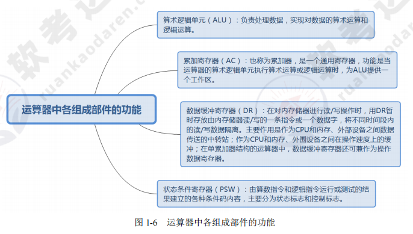
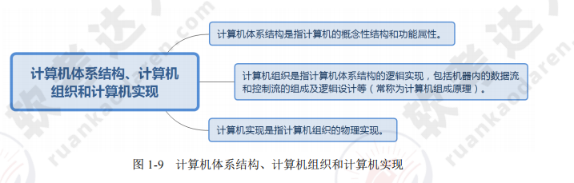
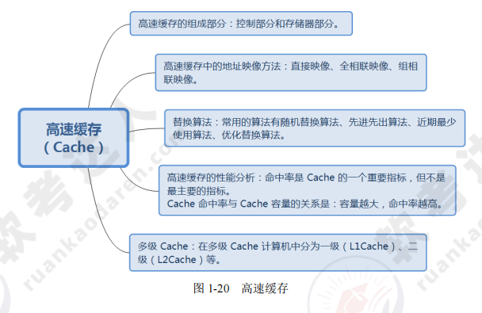
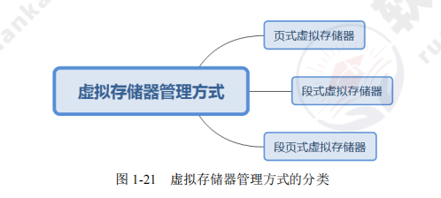
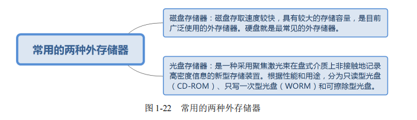
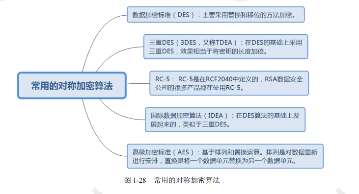
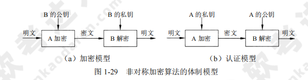

[toc]

# 软件设计师笔记01

## 计算机系统知识

如图是计算机系统知识的架构图

### 计算机基础知识

#### 计算机系统硬件基本组成

计算机的基本硬件系统主要由运算器、控制器、存储器、输入设备和输出设备五大部件组成。

- 运算器、控制器等部件被集成在一起统称为中央处理单元（Central Processing Unit，CPU）。CPU是硬件系统的核心，负责数据的加工处理，能完成各种算术，逻辑运算以及控制功能。
- 存储器是计算机系统中的记忆设备，分为内部存储器和外部存储器。前者速度高、容量小，一般用于临时存放程序代码、数据及中间结果；而后者容量大、速度慢，可长期保存程序代码和数据。
- 输入设备和输出设备合称为外部设备（简称外设），输入设备用于输入原始数据及各种命令，而输出设备则用于输出计算机的运行处理结果。

#### 中央处理单元CPU

中央处理单元CPU是计算机系统的核心部件。它负责获取程序指令，对指令进行翻译转码，并执行。

##### CPU的功能

1. 程序控制。CPU通过执行指令来控制程序的运行顺序。
2. 操作控制。CPU执行一条指令，需要多个操作信号配合才能完成。CPU会产生每条指令的操作信号，并将操作xinh发送给对应的部件。之后CPU会控制相应的部件按指令的功能要求去进行操作。
3. 时间控制。CPU会对各个操作进行时间上的控制。即指令执行过程中的操作信号的出现时间，持续时间，出现的时间顺序都被CPU进行严格控制。
4. 数据处理。CPU会通过算术运算，逻辑运算的方式对数据进行加工处理,并将数据加工处理结果返回。

除此之外，CPU 还需要对系统内部和外部的中断（异常）做出响应，进行相应的处理。

如结构图所示

##### CPU的组成

CPU 主要由运算器、控制器、寄存器组和内部总线等部件组成。如下图所示

> 运算器

运算器又由算术逻辑单元（ALU），累加寄存器，数据缓冲寄存器，状态条件寄存器等部件组成。运算器的主要作用是进行数据加工处理，用于完成各种算术运算和逻辑运算。

在整个计算机系统中，运算器的全部操作，都是通过控制器发出的控制信号来指挥的。简而言之运算器接受控制器传来的指令而执行。

运算器有两个主要功能：
1. 执行所有的算术运算，例如加、减、乘、除等基本运算及附加运算。
2. 执行所有的逻辑运算并进行逻辑测试，例如与、或、非、零值测试或两个值的比较等。

运算器组成如图所示

运算器功能如图所示

下面简要介绍运算器中各组成部件的功能。
1. 算术逻辑单元（ALU）。ALU 是运算器的重要组成部件，负责处理数据，实现对数据的算术运算和逻辑运算。
2. 累加寄存器（AC）。AC 通常简称为累加器，其功能是当运算器的算术逻辑单元执行算术或逻辑运算时，为 ALU 提供一个工作区。例如，在执行一个减法运算前，先将被减数取出暂存在 AC 中，再从内存储器中取出减数，然后同 AC 的内容相减，将所得的结果送回 AC 中。运算的结果是放在累加器中的，运算器中至少要有一个累加寄存器。
3. 数据缓冲寄存器（DR）。在对内存储器进行读/写操作时，用 DR 暂时存放由内存储器读/写的一条指令或一个数据字，将不同时间段内读/写的数据隔离开来。DR 的主要作用为：作为 CPU 和内存、外部设备之间数据传送的中转站；作为 CPU 和内存、外围设备之间在操作速度上的缓冲；在单累加器结构的运算器中，数据缓冲寄存器还可兼作为操作数寄存器。
4. 状态条件寄存器（PSW）。PSW 保存由算术指令和逻辑指令运行或测试的结果建立的各种条件码内容，主要分为状态标志和控制标志，例如运算结果进位标志（C）、运算结果溢出标志（V）、运算结果为 0 标志（Z）、运算结果为负标志（N）、中断标志（I）、方向标志（D）和单步标志等。这些标志通常分别由 1 位触发器保存，保存了当前指令执行完成之后的状态。通常，一个算术操作产生一个运算结果，而一个逻辑操作产生一个判决。

如图所示

> 控制器

运算器只能完成运算，而控制器用于控制整个 CPU 的工作，它决定了计算机运行过程的自动化。

控制器不仅要保证程序的正确执行，而且要能够处理异常事件。控制器一般包括指令控制逻辑、时序控制逻辑、总线控制逻辑和中断控制逻辑等几个部分。

其中
- 指令控制逻辑要完成取指令、分析指令和执行指令的操作，其过程分为取指令、指令译码、按指令操作码执行、形成下一条指令地址等步骤。
- 时序控制逻辑要为每条指令按时间顺序提供应有的控制信号。
- 总线逻辑是为多个功能部件服务的信息通路的控制电路。
- 中断控制逻辑用于控制各种中断请求，并根据优先级的高低对中断请求进行排队，逐个交给 CPU 处理。

下面是控制器中内部的寄存器功能介绍：
1. 指令寄存器（IR）。当 CPU 执行一条指令时，先把它从内存储器取到缓冲寄存器中，再送入 IR 暂存，指令译码器根据 IR 的内容产生各种微操作指令，控制其他的组成部件工作，完成所需的功能。
2. 程序计数器（PC）。PC 具有寄存信息和计数两种功能，又称为指令计数器。程序的执行分两种情况，一是顺序执行，二是转移执行。在程序开始执行前，将程序的起始地址送入 PC，该地址在程序加载到内存时确定，因此 PC 的内容即是程序第一条指令的地址。执行指令时，CPU 自动修改 PC 的内容，以便使其保持的总是将要执行的下一条指令的地址。由于大多数指令都是按顺序来执行的，所以修改的过程通常只是简单地对 PC 加 1。当遇到转移指令时，后继指令的地址根据当前指令的地址加上一个向前或向后转移的位移量得到，或者根据转移指令给出的直接转移的地址得到。
3. 地址寄存器（AR）。AR 保存当前 CPU 所访问的内存单元的地址。由于内存和 CPU 存在着操作速度上的差异，所以需要使用 AR 保持地址信息，直到内存的读 / 写操作完成为止。
4. 指令译码器（ID）。指令包含操作码和地址码两部分，为了能执行任何给定的指令，必须对操作码进行分析，以便识别所完成的操作。指令译码器就是对指令中的操作码字段进行分析解释，识别该指令规定的操作，向操作控制器发出具体的控制信号，控制各部件工作，完成所需的功能。

> 寄存器组

寄存器组可分为专用寄存器和通用寄存器。运算器和控制器中的寄存器是专用寄存器，其作用是固定的。通用寄存器用途广泛并可由程序员规定其用途，其数目因处理器不同有所差异。

##### 多核CPU

核心又称为内核，是 CPU 最重要的组成部分。CPU 中心那块隆起的芯片就是核心，是由单晶硅以一定的生产工艺制造出来的，CPU 所有的计算、接收 / 存储命令、处理数据都由核心执行。

各种 CPU 核心都具有固定的逻辑结构，一级缓存、二级缓存、执行单元、指令级单元和总线接口等逻辑单元都会有合理的布局。

> 多核相比单核的区别

多核是指在一个单芯片上面集成两个甚至更多个处理器内核，其中，每个内核都有自己的逻辑单元、控制单元、中断处理器、运算单元，一级 Cache、二级 Cache 共享或独有，其部件的完整性和单核处理器内核相比完全一致。

多核 CPU 系统最大的优点是可满足用户同时进行多任务处理的要求。

单核多线程 CPU 是交替地转换执行多个任务，只不过交替转换的时间很短，用户一般感觉不出来。如果同时执行的任务太多，就会感觉到 “慢” 或者 “卡”。而多核在理论上则是在任何时间内每个核执行各自的任务，不存在交替问题。因此，单核多线程和多核（一般每核也是多线程的）虽然都可以执行多任务，但多核的速度更快。

#### 数据表示

存储在计算机中的各个数据称为机器数，其特点是采用二进制计数制，数的符号用 0 和 1表示，小数点则隐含，表示不占位置。机器数对应的实际数值称为数的真值。

机器数有无符号数和有符号数之分。
- 对于无符号数，是指在机器数中没有符号位。无符号数都表示正数，没有负数表示。若约定小数点的位置在机器数的最低位之后，则是纯整数；若约定小数点的位置在机器数的最高位之前，则是纯小数。例如一串二进制机器数1101，按无符号数的编码方式，其代表十进制数13。
- 对于有符号数，机器数的最高位是指表示正、负的符号位，其中0为正数，1为负数。其余位则表示数值。例如一串二进制机器数1101，按有符号数的编码方式，其代表十进制数-3。

为了便于运算，带符号的机器数可采用原码、反码和补码等不同的编码方法，机器数的这些编码方法称为码制。

##### 原码表示法

在原码表示法中，机器数是有符号数，最高位表示正负符号位。其中0为正数，1为负数。

##### 反码表示法

在反码表示法中，机器数是有符号数，最高位表示正负符号位。其中0为正数，1为负数。

##### 补码表示法

在补码表示法中，机器数是有符号数，最高位表示正负符号位。其中0为正数，1为负数。

##### 移码表示法

各种编码方式下的有符号数范围表如图所示

#### 校验码

计算机系统运行时，为了确保数据在传送过程中正确无误，通常使用校验码的方法来检测传送的数据是否出错。从而提高硬件电路的可靠性，提高代码的校验能力，包括查错和纠错。

其基本思想是把数据可能出现的编码分为两类：合法编码和错误编码。合法编码用于传送数据，错误编码是不允许在数据中出现的编码。合理地设计错误编码以及编码规则，使得数据在传送中出现某种错误时会变成错误编码，这样就可以检测出接收到的数据是否有错。

下面简要介绍常用的 3 种校验码：奇偶校验码、海明码和循环余校验码。

> 奇偶校验码

奇偶校验是一种简单有效的校验方法。通过在编码中增加一位校验位，使编码中 1 的个数为奇数（奇校验）或者为偶数（偶校验），从而使码距变为 2。

对于奇校验，可检测代码中奇数位出错的编码，但不能发现偶数位出错情况。当合法编码中的奇数位发生错误，即编码中的 1 变成 0 或 0 变成 1 时，该编码中 1 的个数的奇偶性就发生变化，从而可发现错误。

常用的奇偶校验码有 3 种：水平奇偶校验码、垂直奇偶校验码和水平垂直校验码。

> 海明码

海明码是利用奇偶性来查错和纠错的校验方法。

> 循环冗余校验码

循环冗余校验码由两部分组成，左边为信息码（数据），右边为校验码，广泛用于数据通讯领域和磁介质存储系统。

### 计算机体系结构

#### 计算机体系结构的发展

##### 计算机体系结构的概述

1964 年，阿姆达尔（G.M.Amdahl）在介绍 IBM360 系统时指出，计算机体系结构是站在程序员的角度所看到的计算机属性。

1982 年，梅尔斯（G.J.Myers）在其所著的《计算机体系结构的进展》一书中定义了组成计算机系统的若干层次。

1984 年，拜尔（J.L.Baer）在一篇题为《计算机体系结构》的文章中给出了一个含义更加广泛的定义：计算机体系结构是由结构、组织、实现、性能四个基本方面组成的。其中结构指计算机系统各种硬件的互连；组织指各种部件的动态联系与管理；实现指各模块设计的组装完成；性能指计算机系统的行为表现。

计算机体系结构，计算机组织和计算机实现，三者之间的关系如图所示。
- 计算机体系结构是指计算机的概念性结构和功能属性。
- 计算机组织是指计算机体系结构的逻辑实现，包括机器内的数据流和控制流的组成以及逻辑设计等（常称为计算机组成原理）。
- 计算机实现是指计算机组织的物理实现。

##### 计算机体系结构分类

1. 从宏观上按处理机的数量分类。分为单处理系统，并行处理与多处理系统和分布式处理系统。

2. 从微观上按并行程度分类,有Flynn分类法，冯泽云分类法，Handler分类法，Kuck分类法。

##### 指令系统

一个处理器支持的指令和指令的字节级编码称为其指令集体系结构（Instruction Set Architecture，ISA）。不同的处理器族支持不同的指令集体系结构，所以一个程序被编译在一种机器上运行，往往不能在另一种机器上运行。 

从体系结构的观点对指令集进行分类，可以根据下述 5 个方面
1. 操作数在 CPU 中的存储方式，即操作数从主存中取出后保存在什么地方。
2. 显式操作数的数量，即在典型的指令中有多少个显式命名的操作数。
3. 操作数的位置，即任一个 ALU 指令的操作数能否放在主存中，如何定位。
4. 指令的操作，即在指令集中提供哪些操作。
5. 操作数的类型与大小。

指令系统的优化。面向高级语言的优化思路是尽可能缩小高级语言与机器语言之间的语义差异。面向操作系统的优化思路是进一步缩小操作系统与体系架构之间的语义差异。

##### 存储系统

> 存储器的层次结构

计算机系统中可能包括各种存储器，如 CPU 内部的通用寄存器组、CPU 内的 Cache（高速缓存）、CPU 外部的 Cache、主板上的主存储器、主板外的联机（在线）磁盘存储器以及脱机（离线）的磁带存储器和光盘存储器等。

不同特点的存储器通过适当的硬件、软件有机地组合在一起形成计算机的存储体系结构。如下图所示

> 存储器的分类

> 高速缓存

高速缓存用来存放当前最活跃的程序和数据，其特点是：位于 CPU 与主存之间；容量一般在几千字节到几兆字节之间；速度一般比主存快 5～10 倍，由快速半导体存储器构成；其内容是主存局部域的副本，对程序员来说是透明的。

> 虚拟存储器

虚拟存储（Virtual Memory）技术是把很大的程序（数据）分成许多较小的块，全部存储在辅存中。运行时把要用到的程序（数据）块先调入主存，并且把马上就要用到的程序块从主存调入高速缓存。这样就可以一边运行程序，一边进行所需程序（数据）块的调进或调出。

虚拟存储器管理方式的分类。

> 外存储器

外存储器用来存放暂时不用的程序和数据，并且以文件的形式存储。CPU 不能直接访问外存中的程序和数据，只有将其以文件为单位调入主存才可访问。

外存储器主要由磁表面存储器（如磁盘、磁带）、光盘存储器及固态硬盘（采用 Flash 芯片或 DRAM 作为存储介质的存储器）构成。

常见的两种外存储器如图所示

> 磁盘阵列技术

磁盘阵列是由多台磁盘存储器组成的一个快速、大容量、高可靠的外存子系统，常见的磁盘阵列称为廉价冗余磁盘阵列（RAID）。

常见的 RAID 如图所示。

##### 总线结构

总线（Bus），是指计算机设备和设备之间传输信息的公共数据通道。总线是连接计算机硬件系统内多种设备的通信线路，它的一个重要特征是由总线上的所有设备共享，因此可以将计算机系统内的多种设备连接到总线上。

> 总线的定义与分类

一般来说，任何连接两个以上电子元器件的导线都可以称为总线。总线一般分为三类，分别是内部总线、系统总线、外部总线。

- 系统总线: 系统总线的性能直接影响计算机的性能。常见的标准包括 ISA 总线、EISA 总线、PCI 总线。
- 外部总线: 外部总线的标准较多，包括 RS-232C、SCSI 总线、USB、IEEE-1394、IEEE-488 等。

### 计算机安全

#### 计算机安全概述

计算机安全是一个涵盖非常广的课题，既包括硬件、软件和技术，又包括安全规划、安全管理和安全监督。

计算机安全可包括安全管理、通信与网络安全、密码学、安全体系及模型、容错与容灾、涉及安全的应用程序及系统开发、法律、犯罪及道德规范等领域。

其中安全管理非常重要，作为信息系统的管理部门应根据管理原则和该系统处理数据的保密性，制定相应的管理制度或规范。例如，根据工作的重要程度确定系统的安全等级，根据确定的安全等级确定安全管理的范围，制定相应的机房管理制度、操作规程、系统维护措施以及应急措施等。

> 计算机的安全等级

美国国防部和国家标准局的《可信计算机系统评测标准》TCSEC/TDI 将计算机安全划分为4组7个等级。如图所示

> 计算机的安全威胁

典型的安全威胁如图所示

> 加密技术和认证技术

加密技术是最常用的安全保密手段，其中密钥加密技术的密码体制分为对称密钥体制和非对称密钥体制两种。相应地，对数据加密的技术分为对称加密（私人密钥加密）和非对称加密（公开密钥加密）。

1. 常见对称加密算法如图

2. 非对称加密算法

与对称加密算法不同，非对称加密算法需要两个密钥：公开密钥和私有密钥。两者是一对，如果用公开密钥对数据进行加密，只有用对应的私有密钥才能解密；如果用私有密钥对数据进行加密，只有用对应的公开密钥才能解密。因为加密和解密使用的是两个不同的密钥，所以这种算法称为非对称加密算法。

认证技术主要解决网络通信过程中通信双方的身份认可。认证的过程涉及加密和密钥交换。通常，加密可使用对称加密、不对称加密及两种加密方法的混合方法。认证方一般有账户名 / 口令认证、使用摘要算法认证和基于 PKI 的认证。

关键绩效指标（PKI）的基本构成部分和数字签名如图所示。

