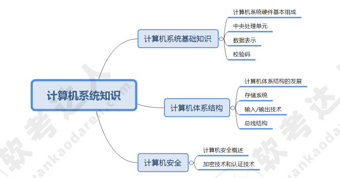
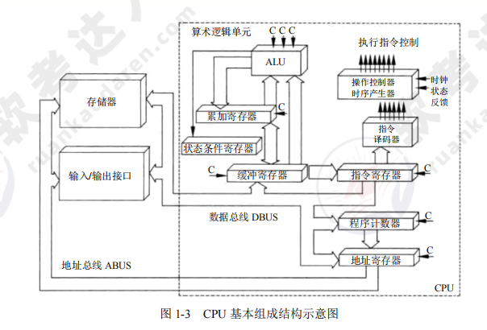

[toc]

# 软件设计师笔记01

## 计算机系统知识

如图是计算机系统知识的架构图

### 计算机基础知识

#### 计算机系统硬件基本组成

计算机的基本硬件系统主要由运算器、控制器、存储器、输入设备和输出设备五大部件组成。

- 运算器、控制器等部件被集成在一起统称为中央处理单元（Central Processing Unit，CPU）。CPU是硬件系统的核心，负责数据的加工处理，能完成各种算术，逻辑运算以及控制功能。
- 存储器是计算机系统中的记忆设备，分为内部存储器和外部存储器。前者速度高、容量小，一般用于临时存放程序代码、数据及中间结果；而后者容量大、速度慢，可长期保存程序代码和数据。
- 输入设备和输出设备合称为外部设备（简称外设），输入设备用于输入原始数据及各种命令，而输出设备则用于输出计算机的运行处理结果。

#### 中央处理单元CPU

中央处理单元CPU是计算机系统的核心部件。它负责获取程序指令，对指令进行翻译转码，并执行。

##### CPU的功能

1. 程序控制。CPU通过执行指令来控制程序的运行顺序。
2. 操作控制。CPU执行一条指令，需要多个操作信号配合才能完成。CPU会产生每条指令的操作信号，并将操作xinh发送给对应的部件。之后CPU会控制相应的部件按指令的功能要求去进行操作。
3. 时间控制。CPU会对各个操作进行时间上的控制。即指令执行过程中的操作信号的出现时间，持续时间，出现的时间顺序都被CPU进行严格控制。
4. 数据处理。CPU会通过算术运算，逻辑运算的方式对数据进行加工处理,并将数据加工处理结果返回。

如图所示

##### CPU的组成

CPU 主要由运算器、控制器、寄存器组和内部总线等部件组成。

如下图所示

> 运算器

运算器由算术逻辑单元（ALU），累加寄存器，数据缓冲寄存器，状态条件寄存器等部件组成。运算器的主要作用是进行数据加工处理，用于完成各种算术运算和逻辑运算。

在整个计算机系统中，运算器的全部操作，都是通过控制器发出的控制信号来指挥的。因此运算器接受控制器的命令而执行。

