[toc]

# 软件设计师笔记01_计算机系统知识概述

## 软件设计师考试分析

软件设计师考试分为科目1，科目2

科目一：综合知识（选择题）。满分75分，需要达到45分才能合格。

科目二：软件设计（填空题）。共6道大题，满分75分，需要达到45分才能合格。前4道题目必答，后2道题目二选一。

> 科目一知识点分布

知识点 | 分数 | 说明 | 比例
------------ | ------------- | ------------- | -------------
软件工程基础知识 | 13 | 开发模型、设计原则、测试方法、质量特性、CMM、Pert图、风险管理 | 17.33%
面向对象 | 11 | 面向对象基本概念、面向对象分析与设计、UML、设计模式 | 14.67%
数据结构与算法 | 9 | 数组、栈、队列、树与二叉树、图、查找与排序、常见算法 | 12%
程序设计语言 | 6 | 文法、有限自动机、正规式、语句的作用、语句的语义、程序的控制结构、函数调用的参数传递、各种程序语言的特点比较 | 8%
计算机硬件基础 | 6 | 浮点数运算、溢出、算术、逻辑运算、计算机体系结构分类、指令系统基础、CISC与RISC、流水线、Cache存储器可靠性分析、校验方法 |  8%
操作系统 | 6 | 进程状态转换图、信号量与PV操作、死锁问题、银行家算法、段页式存储、页面置换算法、磁盘调度、树形文件系统 |  8%
数据库系统 | 6 | E-R模型、关系代数、元组演算、规范化理论（键、范式、模式分解）、并发控制 |  8%
计算机网络 | 5 | OSI模型、TCP/IP协议族、子网划分、常用的网络命令 |  6.6%
信息安全知识 | 5 | 加密解密技术、网络安全、计算机病毒 |  6.6%
知识产业与标准化 | 3 | 作品保护时间、侵权判定、知识产权归属、标准的分类、标准代号 |  4%
专业英语 | 5 | 专业英语填空 | 6.6%

> 科目二知识点分布

题号 | 题目类型 | 知识点 | 内容
------------ | ------------- | ------------- | -------------
第1题 | 必答题 | 数据流图 | 补充数据流图的缺失部分
第2题 | 必答题 | 数据库设计 | E-R模型，关系模式，增加实体等
第3题 | 必答题 | UML建模 | 类图，用例图，活动图，状态图等
第4题 | 必答题 | C语言算法 | 分治法，谈心法，动态规划法，回溯法等
第5题 | 选答题 | C++程序设计 |  C++语法，设计模式
第6题 | 选答题 | Java程序设计 |  Java语法，设计模式

## 第一章 计算机系统知识概述

如图是计算机系统知识的架构图

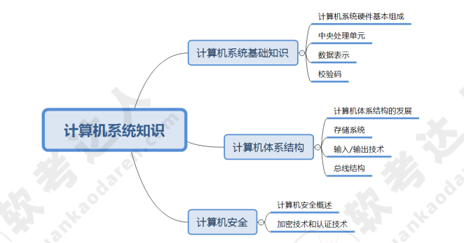

### 1.1 计算机基础知识

#### 1.1.1 计算机系统硬件基本组成

计算机的基本硬件系统主要由运算器、控制器、存储器、输入设备和输出设备五大部件组成。

- 运算器和控制器集成在一起统称为中央处理单元（CPU）。负责数据的加工处理，能完成各种算术，逻辑运算以及控制功能。
- 存储器是计算机系统中的记忆设备，分为内部存储器和外部存储器。
    - 内部存储器（速度高，容量小）：临时存放程序、数据及中间结果。
    - 外部存储器（速度慢，容量大）：长期保存程序和数据。

- 输入设备和输出设备合称为外部设备（简称外设）
    - 输入设备用于输入原始数据及各种命令
    - 输出设备则用于输出计算机的运行处理结果。

#### 1.1.2 中央处理单元CPU

中央处理单元（CPU）是 计算机系统的核心部件，它负责获取程序指令，对指令进行译码并加以执行。

##### CPU的功能

CPU的功能如图所示
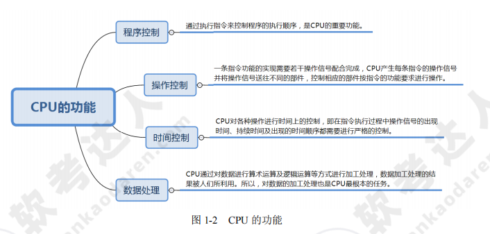

1. 程序控制：CPU通过执行指令来控制程序的执行顺序。
2. 操作控制：CPU执行一条指令，需要若干个操作信号配合才能完成。CPU产生每条指令的操作信号并将操作信号送往对应的部件，控制相应的部件按指令的功能要求进行操作。
3. 时间控制：CPU会对各个操作进行时间上的控制。即指令执行过程中的操作信号的出现时间，持续时间，出现的时间顺序都被CPU进行严格控制。
4. 数据处理：CPU通过对数据进行算术运算及逻辑运算等方式进行加工处理，数据加工处理的结果被人们所利用。所以，对数据的加工处理也是CPU最根本的任务。

除此之外，CPU 还需要对系统内部和外部的中断（异常）做出响应，进行相应的处理。

##### CPU的组成

CPU 主要由运算器、控制器、寄存器组和内部总线等部件组成。如下图所示

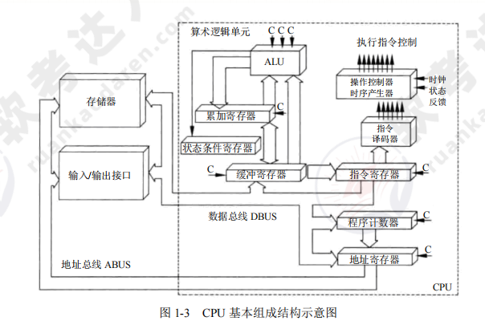

###### 运算器

运算器（是数据加工处理部件，用于完成计算机的各种算术和逻辑运算）：运算器所进行的全部操作都是由控制器发出的控制信号来指挥的，所以它是执行部件。

> 运算器的功能如下：
- 1）执行所有算术运算，如加、减、乘、除等基本运算及附加运算。
- 2）执行所有的逻辑运算并进行逻辑测试，如与、或、非、零值测试或两个值的比较等。

运算器功能如图所示
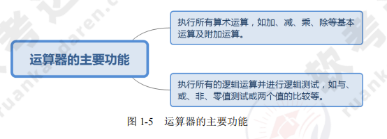

> 运算器的组成如下：
- 1）算术逻辑单元（ALU）：负责处理数据，实现对数据的算术运算和逻辑运算。
- 2）累加寄存器（AC）：简称累加器，是一个通用寄存器。暂存算术运算或逻辑运算的中间运算结果。
- 3）数据缓冲寄存器（DR）：暂存指令或数据字或操作数。
- 4）状态条件寄存器（PSW）：保存指令执行后的状态。

运算器组成如图所示
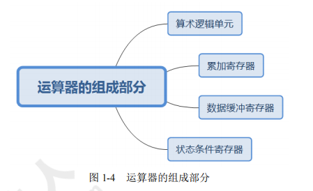

> 运算器中各组成部件的功能如下
1. 算术逻辑单元（ALU）。ALU 是运算器的重要组成部件，负责处理数据，实现对数据的算术运算和逻辑运算。
2. 累加寄存器（AC）。AC 通常简称为累加器，其功能是当运算器的算术逻辑单元执行算术或逻辑运算时，为 ALU 提供一个工作区。例如，在执行一个减法运算前，先将被减数取出暂存在 AC 中，再从内存储器中取出减数，然后同 AC 的内容相减，将所得的结果送回 AC 中。运算的结果是放在累加器中的，运算器中至少要有一个累加寄存器。
3. 数据缓冲寄存器（DR）。在对内存储器进行读/写操作时，用 DR 暂时存放由内存储器读/写的一条指令或一个数据字，将不同时间段内读/写的数据隔离开来。DR 的主要作用为：作为 CPU 和内存、外部设备之间数据传送的中转站；作为 CPU 和内存、外围设备之间在操作速度上的缓冲；在单累加器结构的运算器中，数据缓冲寄存器还可兼作为操作数寄存器。
4. 状态条件寄存器（PSW）。PSW 保存由算术指令和逻辑指令运行或测试的结果建立的各种条件码内容，主要分为状态标志和控制标志，例如运算结果进位标志（C）、运算结果溢出标志（V）、运算结果为 0 标志（Z）、运算结果为负标志（N）、中断标志（I）、方向标志（D）和单步标志等。这些标志通常分别由 1 位触发器保存，保存了当前指令执行完成之后的状态。通常，一个算术操作产生一个运算结果，而一个逻辑操作产生一个判决。

如图所示
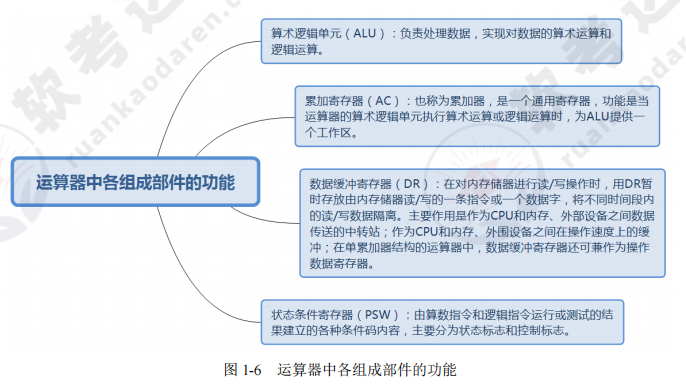

###### 控制器

> 控制器的功能

用于控制整个CPU的工作，决定了计算机运行过程的自动化。它不仅要保证程序的正确执行，而且能够处理异常事件。

> 控制器的组成

控制器一般包括指令控制逻辑、时序控制逻辑、总线控制逻辑和中断控制逻辑等几个部分组成。

其中
- 指令控制逻辑：完成取指令、分析指令和执行指令的操作，其过程分为取指令、指令译码、按指令操作码执行、形成下一条指令地址等步骤。
    1. 指令寄存器（IR）。当 CPU 执行一条指令时，先把它从内存储器取到缓冲寄存器中，再送入 IR 暂存，指令译码器根据 IR 的内容产生各种微操作指令，控制其他的组成部件工作，完成所需的功能。
    2. 程序计数器（PC）。PC 具有寄存信息和计数两种功能，又称为指令计数器。程序的执行分两种情况，一是顺序执行，二是转移执行。在程序开始执行前，将程序的起始地址送入 PC，该地址在程序加载到内存时确定，因此 PC 的内容即是程序第一条指令的地址。执行指令时，CPU 自动修改 PC 的内容，以便使其保持的总是将要执行的下一条指令的地址。由于大多数指令都是按顺序来执行的，所以修改的过程通常只是简单地对 PC 加 1。当遇到转移指令时，后继指令的地址根据当前指令的地址加上一个向前或向后转移的位移量得到，或者根据转移指令给出的直接转移的地址得到。
    3. 地址寄存器（AR）。AR 保存当前 CPU 所访问的内存单元的地址。由于内存和 CPU 存在着操作速度上的差异，所以需要使用 AR 保持地址信息，直到内存的读 / 写操作完成为止。
    4. 指令译码器（ID）。指令包含操作码和地址码两部分，为了能执行任何给定的指令，必须对操作码进行分析，以便识别所完成的操作。指令译码器就是对指令中的操作码字段进行分析解释，识别该指令规定的操作，向操作控制器发出具体的控制信号，控制各部件工作，完成所需的功能。
- 时序控制逻辑：要为每条指令按时间顺序提供应有的控制信号。
- 总线控制逻辑：是为多个功能部件服务的信息通路的控制电路。
- 中断控制逻辑：用于控制各种中断请求，并根据优先级的高低对中断请求进行排队，逐个交给 CPU 处理。

> 寄存器组

寄存器组可分为专用寄存器（运算器和控制器中的寄存器是专用寄存器）和通用寄存器。

通用寄存器用途广泛并可由程序员规定其用途，其数目因处理器不同有所差异。

#### 1.1.3 数据表示

##### 非十进制数转换为十进制数

在软考中，非十进制数（如二进制、八进制、十六进制）转换为十进制数的方法是按位权展开相加法。

> 二进制转十进制

- 方法： 从右往左，将二进制数每一位的值（0 或 1）乘以对应位权（2 的幂次），然后求和。

- 位权计算：从右往左，第一位为 \(2^0\)，第二位为 \(2^1\)，依此类推。

例子：
- 二进制数 1011 转换为十进制：\(1 \times 2^0 + 1 \times 2^1 + 0 \times 2^2 + 1 \times 2^3 = 1+ 2+ 0 + 8 = 11\)

> 八进制转十进制

- 方法：从右往左，将八进制数每一位的值（0-7）乘以对应位权（8 的幂次），然后求和。

- 位权计算：从右往左，第一位为 \(8^0\)，第二位为 \(8^1\)，依此类推。

例子：
- 八进制数 35 转换为十进制：\(5 \times 8^0 + 3 \times 8^1 = 5 + 24= 29\)

> 十六进制转十进制

- 方法：从右往左，将十六进制数每一位的值（0-9，A-F 表示 10-15）乘以对应位权（16 的幂次），然后求和。
- 位权计算：从右往左，第一位为 \(16^0\)，第二位为 \(16^1\)，依此类推。

例子：
- 十六进制数 0xA3 转换为十进制：\( 3 \times 16^0 + A \times 16^1 = 3 + 10 \times 16= 160 + 3 = 163\)

> 带小数的非十进制数转换

- 方法：整数部分和小数部分分别按位权展开，再相加。

- 整数部分：从右往左，位权为 \(基数^0, 基数^1, \dots\)

- 小数部分：从左往右，位权为 \(基数^{-1}, 基数^{-2}, \dots\)

示例：二进制数 101.11 转换为十进制
- 整数部分：\(1 \times 2^0 + 0 \times 2^1  + 1 \times 2^2 = 1 + 0 + 4 = 5\)
- 小数部分：\(1 \times 2^{-1} + 1 \times 2^{-2} = 0.5 + 0.25 = 0.75\)
- 总和：\(5 + 0.75 = 5.75\)

##### 十进制数转换为非十进制数

在软考中，十进制数转换为非十进制数（如二进制、八进制、十六进制）的方法是除基取余法（整数部分）和乘基取整法（小数部分）。

> 十进制整数转非十进制

1. 除基取余：将十进制整数不断除以目标进制的基数（二进制为 2，八进制为 8，十六进制为 16），记录每次的余数。
2. 逆序排列余数：直到商为 0，将余数从最后一次到第一次依次排列，即为转换结果。

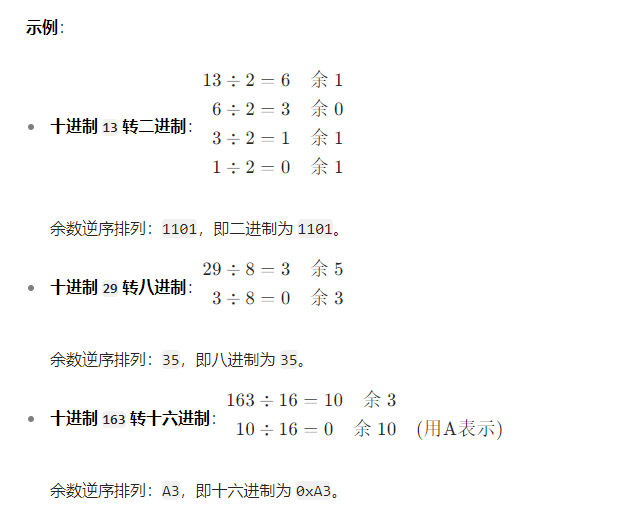

> 十进制小数转非十进制

1. 乘基取整：将十进制小数不断乘以目标进制的基数，记录每次乘积的整数部分。
2. 顺序排列整数部分：直到小数部分为 0 或达到所需精度，将整数部分从第一次到最后一次依次排列，即为转换结果。

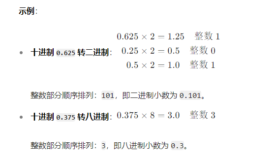

> 带小数的十进制数转换

1. 整数部分：用除基取余法转换。
2. 小数部分：用乘基取整法转换。
3. 合并结果：将整数部分和小数部分用小数点连接。

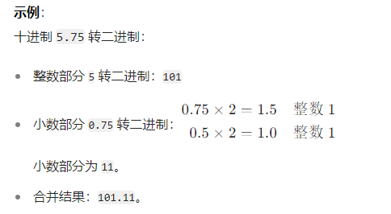

#### 1.1.4 原码，反码，补码，移码

存储在计算机中的各个数据称为机器数，其特点是采用二进制计数制，数的符号用 0 和 1表示，小数点则隐含，表示不占位置。

机器数有无符号数和有符号数之分。
- 对于无符号数，是指在机器数中没有符号位。无符号数都表示正数，没有负数表示。若约定小数点的位置在机器数的最低位之后，则是纯整数；若约定小数点的位置在机器数的最高位之前，则是纯小数。例如一串二进制机器数1101，按无符号数的编码方式，其代表十进制数13。
- 对于有符号数，机器数的最高位是指表示正、负的符号位，其中0为正数，1为负数。其余位则表示数值。例如一串二进制机器数1101，按有符号数的编码方式，其代表十进制数-3。

为了便于运算，带符号数的机器数可采用原码、反码和补码等不同的编码方法。这些编码方法称为码制。

##### 原码表示法

在原码表示法中，机器数是有符号数，最高位表示正负符号位。其中0为正数，1为负数。

原码主要用于早期计算机中，现在已经淘汰了。

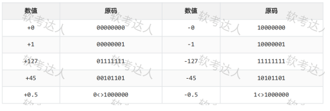

##### 反码表示法

在反码表示法中，正数的反码与原码相同，负数的反码则是其绝对值按位取反。

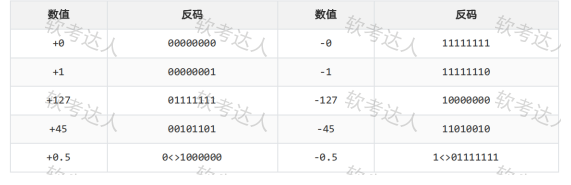

##### 补码表示法

在补码表示法中，正数的补码与其原码相同，负数的的补码则等于其反码的末尾加1。

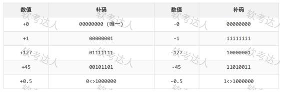

##### 移码表示法

只要将补码的符号位取反便可获得相应的移码表示。

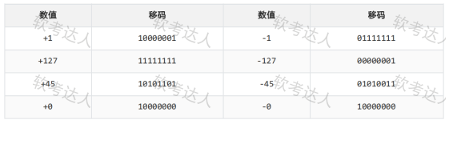

#### 1.1.5 校验码

在计算机系统运行时，各个设备之间要进行数据交换，为了确保数据在传送过程中正确无误，一是提高硬件电路的可靠性，二是提高代码的校验能力，包括查错和纠错。

其基本思想是把数据可能出现的编码分为两类：合法编码和错误编码。合法编码用于传送数据，错误编码是不允许在数据中出现的编码。合理地设计错误编码以及编码规则，使得数据在传送中出现某种错误时会变成错误编码，这样就可以检测出接收到的数据是否有错。

下面简要介绍常用的 3 种校验码：奇偶校验码、海明码和循环余校验码。

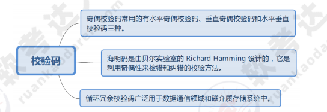

> 奇偶校验码

奇偶校验是一种简单有效的校验方法。通过在编码中增加一位校验位，使编码中 1 的个数为奇数（奇校验）或者为偶数（偶校验），从而使码距变为2。

对于奇校验，可检测代码中奇数位出错的编码，但不能发现偶数位出错情况。当合法编码中的奇数位发生错误，即编码中的 1 变成 0 或 0 变成 1 时，该编码中 1 的个数的奇偶性就发生变化，从而可发现错误。

> 海明码

海明码：可以检错和纠错。在数据位之间的特定位置上插入k个校验位，通过扩大码距来实现检错和纠错。

假设数据位是n位，校验位是k位，则n和k必须满足：2^k^-1≥n+k。

> 循环冗余校验码CRC

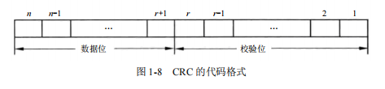

循环冗余校验码由两部分组成，左边为信息码（数据），右边为校验码，广泛用于数据通讯领域。

若信息码占k位，则校验码就占n-k位。其中，n为CRC码的字长。校验码是由信息码产生的，校验码位数越多，该代码的校验能力就越强。

### 1.2 计算机体系结构

#### 1.2.1 计算机体系结构的发展

计算机体系结构是由结构、组织、实现、性能四个基本方面组成的。其中结构指计算机系统各种硬件的互连；组织指各种部件的动态联系与管理；实现指各模块设计的组装完成；性能指计算机系统的行为表现。

计算机体系结构，计算机组织和计算机实现，三者之间的关系如图所示。

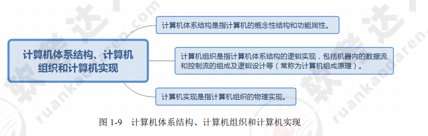

> 计算机体系结构分类

1. 从宏观上按处理机的数量分类。分为单处理系统，并行处理与多处理系统和分布式处理系统。
    - 单处理系统：利用一个处理单元与其他外部设备结合起来。
    - 并行处理与多处理系统：将两个以上的处理机互连起来，彼此进行通信协调的计算机系统。
    - 分布式处理系统：指物理上远距离而松耦合的多计算机系统。

2. 从微观上按并行程度分类,有Flynn分类法，冯泽云分类法，Handler分类法，Kuck分类法。
    - Flynn分类法：按指令流和数据流的多少进行分类。
    - 冯泽云分类法：按并行度对各种计算机系统进行结构分类。
    - Handle分类法：在系统中三个层次上按并行程度及流水线处理程度分类。
    - Kuck分类法：用指令流和执行流及其多重性来描述计算及系统控制结构的特征。

#### 1.2.2 存储系统

> 存储器的层次结构

计算机系统中可能包括各种存储器，如 CPU 内部的通用寄存器组、CPU 内的 Cache（高速缓存）、CPU 外部的 Cache、主板上的主存储器、主板外的联机（在线）磁盘存储器等。

不同的存储器通过适当的硬件、软件有机地组合在一起形成计算机的存储体系结构。如下图所示

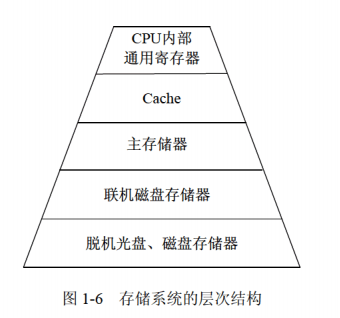

> 存储器的分类

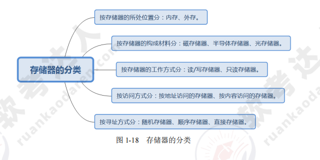

- 按访问方式：按地址访问的存储器、按内容访问的存储器。
- 按储存器所处位置：内存,外存。
- 按存储器的构成材料：磁存储器，半导体存储器，光存储器。
- 按存储器的工作方式：读/写存储器 , 只读存储器等。
- 按寻址方式：随机存储器，顺序存储器，直接存储器等。

> 高速缓存

高速缓存用来存放当前最活跃的程序和数据，其特点是：位于 CPU 与主存之间；容量一般在几千字节到几兆字节之间；速度一般比主存快 5～10 倍，由快速半导体存储器构成；其内容是主存局部域的副本，对程序员来说是透明的。

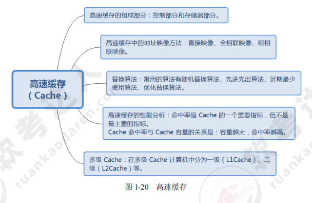

> 虚拟存储器

虚拟存储（Virtual Memory）技术是把很大的程序（数据）分成许多较小的块，全部存储在辅存中。运行时把要用到的程序（数据）块先调入主存，并且把马上就要用到的程序块从主存调入高速缓存。这样就可以一边运行程序，一边进行所需程序（数据）块的调进或调出。

虚拟存储器管理方式的分类。
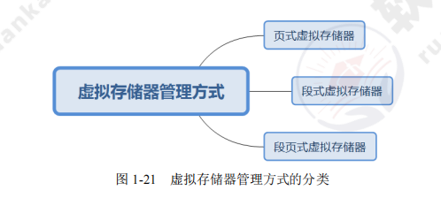

> 外存储器

外存储器用来存放暂时不用的程序和数据，并且以文件的形式存储。CPU 不能直接访问外存中的程序和数据，只有将其以文件为单位调入主存才可访问。

常见的两种外存储器如图所示
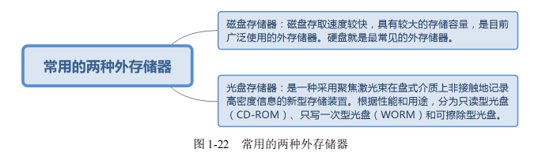

> 磁盘阵列技术

磁盘阵列是由多台磁盘存储器组成的一个快速、大容量、高可靠的外存子系统，常见的磁盘阵列称为廉价冗余磁盘阵列（RAID）。

常见的 RAID 如图所示。
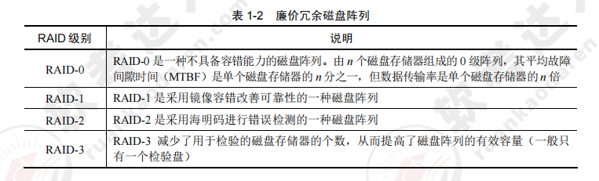
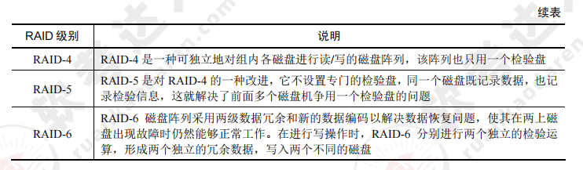

#### 1.2.3 输入输出技术

性价比不高

#### 1.2.4 总线结构

总线（Bus），是指计算机设备和设备之间传输信息的公共数据通道。总线是连接计算机硬件系统内多种设备的通信线路，它的一个重要特征是由总线上的所有设备共享，因此可以将计算机系统内的多种设备连接到总线上。

> 总线的定义与分类

一般来说，任何连接两个以上电子元器件的导线都可以称为总线。总线一般分为三类，分别是数据总线、地址总线、控制总线。

- 数据总线（DB）：用来传送数据信息，是双向的。CPU既可以通过DB从内存或输入设备读入数据，也可以通过DB将内部数据送至内存或输出设备。
- 地址总线（AB）：用于传送CPU发出的地址信息，是单向的。传送地址总线的目的是指明与CPU交换信息的内存单元或I/O设备，地址总线的宽度决定了CPU的最大寻址能力。
- 控制总线（CB）：用来传送控制信号、时序信号和状态信息等，双向线表示。其中有的信号是CPU向内存或外部设备发出的信息，有的信号是内存或外部设备向CPU发出的信息。CB中的每一条线的信息传送方向是单方向且确定的，但CB作为一个整体则是双向的。

### 1.3 计算机安全

#### 1.3.1 计算机安全概述

计算机安全指的是计算机资产安全，是要保证这些计算机资产不受自然和人为的有害因素的威胁和危害。

> 计算机的安全威胁

典型的安全威胁如图所示

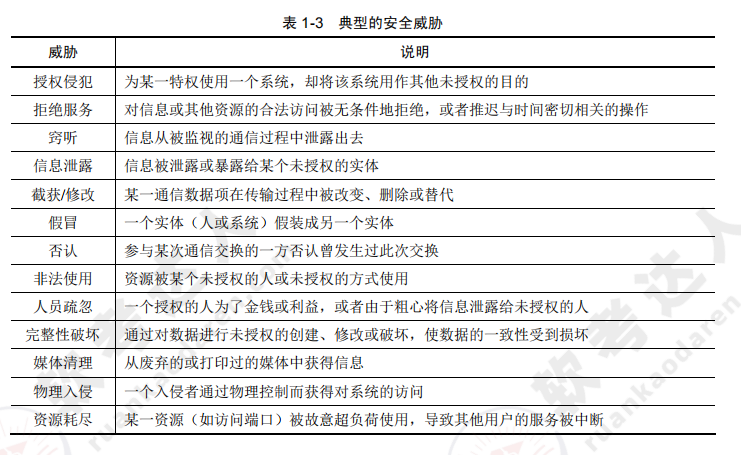

#### 1.3.2 加密技术和认证技术

加密技术是最常用的安全保密手段，其中密钥加密技术的密码体制分为对称密钥体制和非对称密钥体制两种。

相应地，数据加密的技术分为对称加密（私人密钥加密）和非对称加密（公开密钥加密）。

> 常见对称加密算法

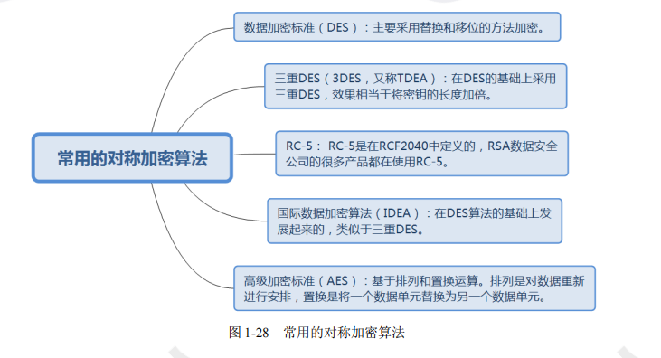

> 非对称加密算法

与对称加密算法不同，非对称加密算法需要两个密钥：公开密钥和私有密钥。两者是一对，如果用公开密钥对数据进行加密，只有用对应的私有密钥才能解密；如果用私有密钥对数据进行加密，只有用对应的公开密钥才能解密。因为加密和解密使用的是两个不同的密钥，所以这种算法称为非对称加密算法。

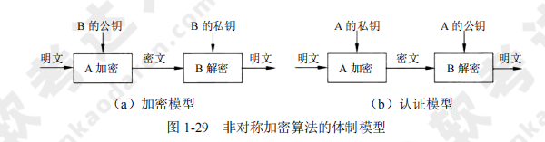

> 认证技术

认证技术主要解决网络通信过程中通信双方的身份认可。认证的过程涉及加密和密钥交换。

通常在认证过程中，可使用对称加密、不对称加密及两种加密方法的混合方法。
