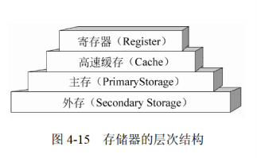
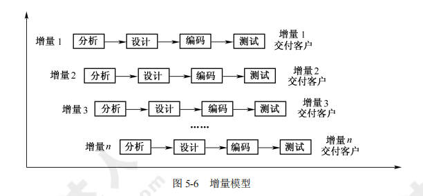
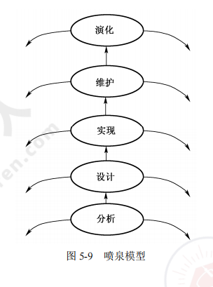
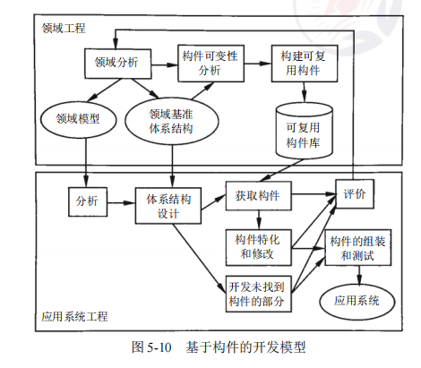
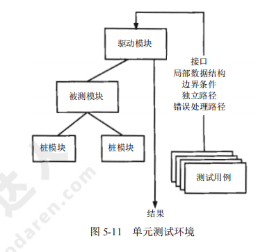
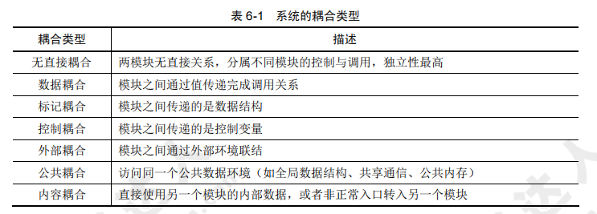
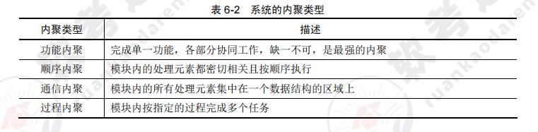
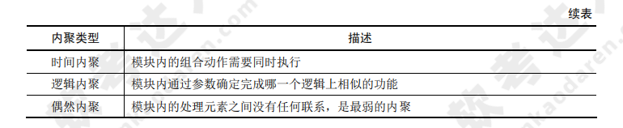

[toc]

# 软件设计师笔记02

## 第四章 操作系统知识

计算机软件通常分为系统软件和应用软件两大类。

- 系统软件是计算机系统的一部分，用来支持应用软件的运行。
- 应用软件是指计算机用户利用计算机的软件、硬件资源为某一专门的应用目的而开发的软件，例如科学计算、工程设计、数据处理、事务处理和过程控制等方面的程序，以及文字处理软件、表格处理软件、辅助设计软件（CAD）和实时处理软件等。

常用的系统软件有操作系统、语言处理程序、链接程序、诊断程序和数据库管理系统等。操作系统是计算机系统中必不可少的核心系统软件，其他软件是建立在操作系统的基础上，并在操作系统的统一管理和支持下运行的，是用户与计算机之间的接口。

### 操作系统的基本概念

> 操作系统的定义和作用

操作系统定义：能有效地组织和管理系统中的各种软 / 硬件资源；合理地组织计算机系统工作流程，控制程序的执行，并且向用户提供一个良好的工作环境和友好的接口。

操作系统有两个重要的作用：第一，通过资源管理提高计算机系统的效率；第二，改善人机界面向用户提供友好的工作环境。

> 操作系统的特征和功能

操作系统的 4 个特征是并发性、共享性、虚拟性和不确定性。

操作系统的功能可分为处理机管理、文件管理、存储管理、设备管理和作业管理 5 大部分。

### 操作系统的分类及特点

操作系统可分为批处理操作系统、分时操作系统、实时操作系统、网络操作系统、分布式操作系统、微型计算机操作系统和嵌入式操作系统等类型。

### 进程管理

进程是资源分配和独立运行的基本单位。

#### 进程间的通信

同步与互斥、信号量、PV 操作。

#### 进程的状态

三态模型和五态模型

#### 进程调度

1. 三级调度。
2. 调度算法：先来先服务、时间片轮转（固定、可变）、优先级调度、多级反馈调度。
3. 进程优先级确定

#### 死锁

死锁，是指两个以上的进程互相都要求对方已经占有的资源导致无法继续运行下去的现象。

死锁的必要条件：互斥、请求保持、不可剥夺、环路。

死锁的处理方式：预防、避免（银行家算法）、检测、解除。

### 存储管理

存储器管理的主要功能包括主存空间的分配和回收、提高主存的利用率、扩充主存、对主存信息实现有效保护。

#### 基本概念

> 存储器的结构

常用的存储器结构有“寄存器-主存-外存”结构 或 “寄存器-缓存-主存-外存”结构。如图所示

虚拟地址：又称相对地址、程序地址、逻辑地址等。

地址空间：程序中由相对地址组成的空间称为逻辑地址空间。

存储空间：简而言之，地址空间是逻辑地址的集合，存储空间是物理地址的集合。

#### 存储管理方案

（1）固定分区。
（2）可变分区：最佳适应、最差适应、首次适应、循环首次适应

### 设备管理

设备管理是操作系统中最繁杂而且与硬件紧密相关的部分。

设备管理不仅要管理实际 I/O 操作的设备（如键盘、鼠标、打印机等），还要管理诸如设备控制器、DMA 控制器、中断控制器和 I/O 处理机（通道）等支持设备。

设备管理包括各种设备分配、缓冲区管理和实际物理 I/O 设备操作，通过管理达到提高设备利用率和方便用户的目的。

#### 设备的分类

1. 按数据组织分类。分为块设备和字符设备。块设备是指以数据块为单位来组织和传送数据信息的设备，如磁盘。字符设备是指以单个字符为单位来传送数据信息的设备，如交互式终端、打印机等。

2. 按照设备的功能分类。分为输入设备、输出设备、存储设备、网络联网设备、供电设备等等。
    - 输入设备是将数据、图像、声音送入计算机的设备；输出设备是将加工好的数据显示、印制、再生出来的设备；
    - 存储设备是指能进行数据或信息保存的设备；
    - 网络联网设备是指网络互连设备以及直接连接上网的设备；
    - 供电设备是指向计算机提供电力能源、电池后备的部件与设备，如开关电源、联机 UPS 等。

3. 从资源分配角度分类。分为独占设备、共享设备和虚拟设备。
    - 独占设备是指在一段时间内只允许一个用户（进程）访问的设备，大多数低速的 I/O 设备（如用户终端、打印机等）属于这类设备。
    - 共享设备是指在一段时间内允许多个进程同时访问的设备。显然，共享设备必须是可寻址的和可随机访问的设备。典型的共享设备是磁盘
    - 虚拟设备是指通过虚拟技术将一台独占设备变换为若干台供多个用户（进程）共享的逻辑设备。一般可以利用假脱机技术（Spooling 技术）实现虚拟设备。

4. 按数据传输率分类，分为低速设备、中速设备和高速设备。
    - 低速设备是指传输速率为每秒钟几个字节到数百个字节的设备，典型的设备有键盘、鼠标、语音的输入等。
    - 中速设备是指传输速率在每秒钟数千个字节到数十千个字节的设备，典型的设备有行式打印机、激光打印机等。
    - 高速设备是指传输速率在每秒数百千个字节到数兆字节的设备，典型的设备有磁带机、磁盘机和光盘机等。

#### 设备管理的目标和任务

设备管理的目标主要是如何提高设备的利用率，为用户提供方便、统一的界面。

设备管理的任务是保证在多道程序环境下，当多个进程竞争使用设备时，按一定的策略分配和管理各种设备，控制设备的各种操作，完成 I/O 设备与主存之间的数据交换。

设备管理的主要功能是动态地掌握并记录设备的状态、设备分配和释放、缓冲区管理、实现物理 I/O 设备的操作、提供设备使用的用户接口及设备的访问和控制。

#### I/O 软件

I/O 设备管理软件一般分为 4 层：中断处理程序、设备驱动程序、与设备无关的系统软件和用户级软件。

如图所示

### 文件管理

#### 文件和文件系统

> 文件

文件（File）是具有符号名的、在逻辑上具有完整意义的一组相关信息项的集合。例如，一个源程序、一个目标程序、编译程序、一批待加工的数据和各种文档等都可以各自组成一个文件。

一个文件包括文件体和文件说明。文件体是文件正文的内容。文件说明是操作系统为了管理文件所用到的信息，包括文件名、文件内部标识、文件的类型、文件存储地址、文件的长度、访问权限、建立时间和访问时间等。

文件也是一种抽象机制，它隐藏了硬件和实现细节，提供了将信息保存在磁盘上而且便于以后读取的手段，使用户不必了解信息存储的方法、位置以及存储设备实际操作方式便可存取信息。

> 文件类型

- 按文件性质和用途可将文件分为系统文件、库文件和用户文件。
- 按信息保存期限分类可将文件分为临时文件、档案文件和永久文件。
- 按文件的保护方式分类可将文件分为只读文件、读 / 写文件、可执行文件和不保护文件。

例如 UNIX 系统将文件分为普通文件、目录文件和设备文件（特殊文件）。

> 文件系统

文件管理系统，就是操作系统中实现文件统一管理的一组软件和相关数据的集合，专门负责管理和存取文件信息的软件机构，简称文件系统。

文件系统的功能包括
1. 按名存取，即用户可以 “按名存取”，而不是 “按地址存取”；
2. 统一的用户接口，在不同设备上提供同样的接口，方便用户操作和编程；
3. 并发访问和控制，在多道程序系统中支持对文件的并发访问和控制；
4. 安全性控制，在多用户系统中的不同用户对同一文件可有不同的访问权限；
5. 优化性能，采用相关技术提高系统对文件的存储效率、检索和读 / 写性能；
6. 差错恢复，能够验证文件的正确性，并具有一定的差错恢复能力。

目前常用的文件系统类型有 FAT、Vfat、NTFS、Ext2 和 HPFS 等。

#### 文件的结构和组织

文件的结构是指文件的组织形式。
- 从用户角度看到的文件组织形式称为文件的逻辑结构。
- 文件在文件存储器上的存放方式称为文件的物理结构。

#### 文件目录

文件目录是由文件控制块组成的，用于文件的检索。

#### 文件的存取方法

文件的存取方法是指读 / 写文件存储器上的一个物理块的方法。通常有顺序存取和随机存取两种方法。
- 顺序存取方法是指对文件中的信息按顺序依次进行读 / 写；
- 随机存取方法是指对文件中的信息可以按任意的次序随机地读 / 写。

#### 文件系统的可靠性

文件系统的可靠性是指系统抵抗和预防各种物理性破坏和人为性破坏的能力。

1. 转储和恢复。在文件系统中无论是硬件或软件都会发生损坏和错误，例如自然界的闪电、电压的突变、火灾和水灾等均可能引起软 / 硬件的破坏。为了使文件系统万无一失，应当采用相应的措施，最简单和常用的措施是通过转储操作形成文件或文件系统的多个副本。这样，一旦系统出现故障，利用转储的数据使得系统恢复成为可能。常用的转储方法有静态转储和动态转储、海量转储和增量转储。
2. 日志文件。在计算机系统的工作过程中，操作系统把用户对文件的插入、删除和修改操作写入日志文件。一旦发生故障，操作系统恢复子系统利用日志文件来进行系统故障恢复，并可协助后备副本进行介质故障恢复。
3. 文件系统的一致性。影响文件系统可靠性的因素之一是文件系统的一致性问题。很多文件系统是先读取磁盘块到主存，在主存进行修改，修改完毕再写回磁盘。但如果读取某磁盘块，修改后再将信息写回磁盘前系统崩溃，则文件系统就可能会出现不一致性状态。如果这些未被写回的磁盘块是索引结点块、目录块或空闲块，那么后果是不堪设想的。通常，解决方案是采用文件系统的一致性检查，一致性检查包括块的一致性检查和文件的一致性检查。

### 作业管理

作业是系统为完成一个用户的计算任务（或一次事务处理）所做的工作总和。

例如，对用户编写的源程序，需要经过编译、连接、装入以及执行等步骤得到结果，这其中的每一个步骤称为作业步。在操作系统中用来控制作业进入、执行和撤销的一组程序称为作业管理程序。操作系统可以进一步为每个作业创建作业步进程，完成用户的工作。

#### 作业与作业控制

> 作业状态及转换

作业状态分为 4 种：提交、后备、执行和完成。
1. 提交。作业提交给计算机中心，通过输入设备送入计算机系统的过程状态称为提交状态。
2. 后备。通过 Spooling 系统将作业输入到计算机系统的后备存储器（磁盘）中，随时等待作业调度程序调度时的状态。
3. 执行。一旦作业被作业调度程序选中，为其分配了必要的资源，并为其建立相应的进程后，该作业便进入了执行状态。
4. 完成。当作业正常结束或异常终止时，作业进入完成状态。此时，由作业调度程序对该作业进行善后处理。如撤销作业的作业控制块，收回作业所占的系统资源，将作业的执行结果形成输出文件放到输出井中，由 Spooling 系统控制输出。

如图所示

> 作业调度

> 用户界面

用户界面（User Interface）是计算机中实现用户与计算机通信的软 / 硬件部分的总称。

用户界面也称用户接口，或人机界面。用户界面的硬件部分包括用户向计算机输入数据或命令的输入装置，以及由计算机输出供用户观察或处理的输出装置。

用户界面的软件部分包括用户与计算机相互通信的协议、约定、操纵命令及其处理软件。目前，常用的输入 / 输出装置有键盘、鼠标、显示器和打印机等。常用的人机通信方法有命令语言、选项、表格填充及直接操纵等。

从计算机用户界面的发展过程来看，用户界面可分为如下阶段。
1. 控制面板式用户界面。这是计算机发展早期，用户通过控制台开关、板键或穿孔纸带向计算机送入命令或数据，而计算机通过指示灯及打印机输出运行情况或结果。这种界面的特点是人去适应现在看来十分笨拙的计算机。
2. 字符用户界面。字符用户界面是基于字符型的，用户通过键盘或其他输入设备输入字符，由显示器或打印机输出字符。字符用户界面的优点是功能强、灵活性好、屏幕开销少；缺点是操作步骤繁琐，学会操作也较费时。
3. 图形用户界面。随着文字、图形、声音和图像等多媒体技术的出现，各种图形用户界面应运而生，用户既可使用传统的字符，也可使用图形、图像和声音同计算机进行交互，操作将更加自然、更加方便。现代界面的关键技术是超文本。超文本的 “超” 体现在它不仅包括文本，还包括图像、音频和视频等多媒体信息，即将文本的概念扩充到超文本，超文本的最大特点是具有指向性。
4. 新一代用户界面。虚拟现实技术将用户界面的发展推向一个新阶段：人将作为参与者，以自然的方式与计算机生成的虚拟环境进行通信。以用户为中心、自然、高效、高带宽、非精确、无地点限制等是新一代用户界面的特征。多媒体、多通道及智能化是新一代用户界面的技术支持。语音、自然语言、手势、头部跟踪、表情和视线跟踪等新的、更加自然的交互技术将为用户提供更方便的输入技术。计算机将通过多种感知通道来理解用户的意图，实现用户的要求。计算机不仅以二维屏幕向用户输出，而且以真实感（立体视觉、听觉、嗅觉和触觉等）的计算机仿真环境向用户提供真实的体验。

## 第五章 软件工程知识

### 软件工程概述

软件工程指的是应用计算机科学、数学及管理科学等原理，以工程化的原则和方法来解决软件问题的工程，目的是提高软件生产率、提高软件质量、降低软件成本。

#### 计算机软件

计算机软件指的是计算机系统中的程序及其文档。程序是计算任务的处理对象和处理规则的描述。任何以计算机为处理工具的任务都是计算任务。

按照软件的应用领域，将计算机软件分为以下十类，包括：①系统软件；②应用软件；③工程/科学软件；④嵌入式软件；⑤产品线软件；⑥Web 应用软件（Web APP）；⑦人工智能软件；⑧开放计算；⑨网络资源；⑩开源软件

#### 软件工程基本原理

软件工程的七条基本原理，包括：①分阶段的生命周期计划严格管理；②坚持进行阶段评审；③实现严格的产品控制；④采用现代的程序设计技术；⑤结果应能清楚地审查；⑥开发小组的人员应少而精；⑦承认不断改进软件工程实践的必要性

#### 软件生存周期

软件生存周期包括以下七个方面：
1. 可行性分析与项目开发计划。这个阶段主要确定软件的开发目标及其可行性。参与该阶段的人员有用户、项目负责人、系统分析师。产生的文档有可行性分析报告、项目开发计划。
2. 需求分析。该阶段的任务不是具体的解决问题，而是要确定软件系统要做什么，确定软件系统的功能、性能、数据和界面等要求，从而确定系统的逻辑模型。参与该阶段的人员有用户、项目负责人、系统分析师。产生的文档主要是软件需求说明书。
3. 概要设计。该阶段开发人员把确定的各项功能需求转换成需要的体系结构。概要设计就是设计软件的结构，明确软件由哪些模块组成，这些模块层次结构是怎样的，调用关系是怎样的，每个模块的功能是什么。参与该阶段的人员有系统分析师、软件设计师。产生的文档主要是概要设计说明书。
4. 详细设计。该阶段的主要任务是对每个模块的功能进一步详细、具体的描述。参与该阶段的人员有软件设计师、程序员。产生的文档主要是详细设计文档。
5. 编码。把每个模块的控制结构转换成计算机可接受的程序代码，即写成某种特定程序设计语言表示的源程序清单。
6. 测试。测试是保证软件质量的重要手段。参加测试的人员通常是另一部门（或单位）的软件设计师或系统分析师。产生的文档主要是软件测试计划、测试用例、测试报告。
7. 维护。软件维护是软件生存周期中时间最长的阶段。软件已交付且正式投入使用后，便进入维护阶段。对软件进行修改的原因包括：①运行中发现隐含的错误而需要修改；②为了适应变化的（或变化后的）工作环境而修改；③需要对软件功能进行扩充、增强而进行的修改；④为将来软件维护活动做预先准备。

#### 软件过程

软件开发中遵循一系列可预测的步骤（即路线图），该路线图称为软件过程。

软件过程是软件活动的集合，软件活动是软件任务的集合。

软件过程有三层含义：
1. 个体含义：指某产品、系统在生存周期中的某一类活动的集合，如开发过程、管理过程等。
2. 整体含义：指软件产品、系统在所有上述含义下的软件过程的总体。
3. 工程含义：指解决软件过程的工程。

> 能力成熟度模型（CMM）

CMM 是对软件组织进化阶段的描述，随着软件组织定义、实施、测量、控制和改进其软件过程，软件组织的能力经过这些阶段逐步提高。CMM 将软件过程的改进分为五个成熟度级别。如图所示

> 能力成熟度模型集成（CMMI）

CMMI 提供了两种表示方法：阶段式模型和连续式模型。

1. 阶段式模型。结构类似于 CMM，它关注组织的成熟度。CMMI-SE/SW/IPPD 1.1 版本中有五个成熟度等级。
2. 连续式模型。关注每个过程域的能力，一个组织对不同的过程域可以达到不同的过程域能力等级（简称 CL）。CMMI 中包括六个过程域能力等级。如图所示

> 统一过程

统一过程定义了四个技术阶段及其产品：
（1）起始阶段：专注于项目初创活动。
（2）精化阶段：在理解了最初领域范围之后，需要进行需求分析和架构演进。
（3）构建阶段：关注系统的构建，产生实现模型。
（4）移交阶段：关注软件提交方面的工作，产生软件增量。随着阶段进展，每个核心工作流的工作量发生变化，四个技术阶段由主要里程碑所终止。

### 软件过程模型

软件过程模型习惯上称为软件开发模型，它是软件开发全部过程、活动和任务的结构框架。典型的软件过程有瀑布模型、增量模型、演化模型（原型模型、螺旋模型）、喷泉模型、基于构件的开发模型和形式化方法模型等。

#### 瀑布模型

瀑布模型将软件生命周期中的各个活动规定为依据线性顺序连接的若干阶段的模型，包括需求分析、设计、编码、测试、运行与维护。如同瀑布流水逐级下落。如图所示

- 瀑布模型的优点：容易理解、成本低、强调开发的阶段性早期计划及需求调查和产品测试
- 瀑布模型的缺点：客户必须要准确地表达他们的需要；在开始的两个或三个阶段中，很难评估真正的进度状态；项目快结束时，出现大量的集成与测试工作；项目结束之前，不能演示系统的能力；在瀑布模型中，需求或设计的错误往往只有到了项目后期才能被发现，对项目风险的控制能力较弱，导致项目通常会延期，开发费用超出预算。

瀑布模型的一个变体是 V 模型，如图所示。

#### 增量模型

增量模型融合了瀑布模型的基本成分和原型实现的迭代特征。如图所示。

- 增量模型的优点：可交付的第一个版本所需要的成本和时间很少，开发由增量表示的小系统所承担的风险不大，由于很快发布了第一个版本，因此可减少用户需求的变更。同时，它也具有瀑布模型所有的优点。

- 增量模型的缺点：若没有对用户的变更要求进行规划，那么产生的初始增量可能会造成后来增量的不稳定；若需求不像早期思考的那样稳定和完整，那么一些增量就可能需要重新开发或重新发布；管理发生的成本、进度和配置的复杂性可能会超出组织的能力。

#### 演化模型

典型的演化模型有原型模型和螺旋模型两种。

> 原型模型

原型模型开始于沟通，目的是定义软件的总体目标、标识需求，然后快速制定原型开发计划，确定原型的目标和范围，快速构建原型并交付用户使用，收集客户反馈意见，并在下一轮中对原型进行改进。在前一个原型需要改进（或扩展其范围）的时候，进入下一轮原型的迭代开发。原型模型如图所示。

> 螺旋模型

对于一个复杂的大项目，开发一个原型往往达不到要求。螺旋模型将瀑布模型和演化模型结合起来，加入两种模型均忽略的风险分析，弥补了这两种模型的不足。螺旋模型如图所示。

螺旋模型中的每个螺旋周期分为以下四个步骤：
1. 制订计划：确定软件目标，选定实施方案，明确项目开发的限制条件。
2. 风险分析：对所选方案进行分析，识别风险，消除风险。
3. 实施工程：实施软件开发，验证阶段性产品。
4. 用户评估：评价开发工作，提出修正建议，建立下一个周期的开发计划。

螺旋模型强调风险分析，使用户、开发人员对演化层出现的风险有所了解，从而作出反映。因此，螺旋模型适合用于庞大、复杂、高风险的系统。

#### 喷泉模型

喷泉模型是以用户需求为动力、以对象为驱动的模型。适用于面向对象的开发方法，克服了瀑布模型不支持软件重用和多项开发活动集成的局限性。喷泉模型使开发过程具有迭代性和无间隙性。喷泉模型如图所示。

#### 基于构件的开发模型

基于构件的开发模型是指利用预先包装的构件来构造应用系统。构件可以是组织内部开发的构件，也可以是商品化成品（COTS）软件构件。一种基于构件的开发模型包括领域工程和应用系统工程。
（1）领域工程的目的是构建领域模型、领域基准体系结构和可复用构件库。
（2）应用系统工程的目的是使用可复用构件组装应用系统。

基于构件的开发模型如图所示

#### 形式化方法模型

形式化方法是建立在严格数学基础上的一种软件开发方法，主要活动是生成计算机软件形式化的数学规格说明。

#### 统一过程模型

统一过程（UP）模型是一种“用例和风险驱动，以架构为中心，迭代并增量”的开发过程，由 UML 方法和工具支持。

统一过程定义了四个技术阶段及其主要工作产品：
（1）起始阶段：专注项目的初创活动，主要工作产品有构想文档、初始用例模型、初始项目术语表、初始业务用例、初始风险评估、项目计划、业务模型及多个原型（需要时）。
（2）精化阶段：在理解了最初的领域范围之后进行需求分析和架构演进，主要工作产品有用例模型、补充需求、分析模型、整体体系结构描述、可执行的软件体系结构原型、初步设计模型、修订的风险列表、项目计划及初始用户手册。
（3）构建阶段：关注系统的构建，产生实现模型，主要工作产品有设计模型、软件构件、集成软件增量、测试计划及步骤、测试用例及支持文档（用户手册、安装手册等）。
（4）移交阶段：关注软件提交方面的工作，产生软件增量，主要工作产品有提交的软件增量、β 测试报告和综合用户反馈。

### 软件项目需求分析

需求分析也称为软件需求分析、系统需求分析或需求分析工程等，是开发人员经过深入细致的调研和分析，准确理解用户和项目的功能、性能、可靠性等具体要求，将用户非形式的需求表述转化为完整的需求定义，从而确定系统必须做什么的过程。

#### 软件需求

软件需求包括以下内容：
（1）功能需求：考虑系统要做什么、什么时候做、如何修改或升级。
（2）性能需求：考虑软件开发的技术性指标，如存储容量限制、执行速度、响应时间、吞吐量等。
（3）用户或人的因素：考虑用户的类型。
（4）环境需求：考虑软件应用的环境。
（5）界面需求：考虑来自其他系统的输入或到其他系统的输出等。
（6）文档需求：考虑需要哪些文档、文档针对哪些读者。
（7）数据需求：考虑输入、输出格式，接收、发送数据的频率，数据的精准度、数据流量、数据保持时间。
（8）资源使用需求：考虑软件运行时所需要的资源。
（9）安全保密需求：考虑是否需要对访问系统或系统信息加以控制。
（10）可靠性需求：考虑系统的可靠性需求、系统是否必须检测和隔离错误、出错后重启系统所允许的时间等。
（11）软件成本消耗或开发进度需求：考虑开发是否有规定的时间表
（12）其他非功能性需求：如采用某种开发模式、确定质量控制标准、里程碑和评审、验收标准等。

#### 需求分析原则

需求分析过程有不同的分析方法，它们要遵循的操作原则有：
- ①必须能表示和理解问题的信息域；
- ②必须能定义软件将完成的任务；
- ③必须能表示软件的行为；
- ④必须划分描述数据、功能和行为的模型；
- ⑤分析过程应该从要素信息移向细节信息

#### 需求工程

需求工程是一个不断反复的需求定义、文档记录、需求演进的过程，并最终在验证的基础上冻结需求。

需求工程可以细分为六个阶段：①需求获取；②需求分析与协商；③系统建模；④需求规约；⑤需求验证；⑥需求管理

### 软件项目系统设计

系统设计的主要内容包括新系统总体结构设计、代码设计、输出设计、输入设计、处理过程设计、数据存储设计、用户界面设计和安全控制设计等。

常用的设计方法有：面向数据流的结构化设计方法（SD）、面向对象的分析方法（OOD）。

系统设计包括两个基本的步骤：概要设计、详细设计。

#### 概要设计

概要设计主要包括：①软件系统总体结构设计；②数据结构及数据库设计；③编写概要设计文档（概要设计说明书、数据库设计说明书、用户手册及修订测试计划）；④评审。

#### 详细设计

详细设计主要包括：①对每个模块进行详细设计；②对模块内部的数据结构进行设计；③对数据库进行物理设计，即确定数据库的物理结构；④其他设计（代码设计、输入/输出设计、用户界面设计）；⑤编写详细设计说明书；⑥评审

### 软件项目系统测试

软件项目系统测试是对整个系统的测试，将硬件、软件、操作人员看作一个整体，检验它是否有不符合系统说明书的地方。这种测试可以发现系统分析和设计中的错误。

#### 系统测试与调试

信息系统测试包括软件测试、硬件测试、网络测试。测试的目的是以最少的人力和时间发现潜在的各种错误和缺陷。

> 测试应遵循的基本原则

①应尽早并不断地进行测试；②测试工作应避免原先开发软件的人员或小组参与；③设计测试方案时要确定输入数据，还要根据系统功能确定预期的输出结果；④设计测试用例时要设计合理、有效的输入条件，还要包含不合理、失效的输入条件。人们在测试时通常忽略了对异常、不合理、意想不到的情况进行测试，这可能就是隐患；⑤在测试时要检查程序是否做了该做、不该做的事，多余的工作会影响程序的效率；⑥严格按照测试计划进行测试；⑦妥善保存测试计划、测试用例；⑧要精心设计测试用例。

测试的过程包括：①制定测试计划；②编制测试大纲；③根据测试大纲设计和生产测试用例；④事实测试；⑤生成测试报告

#### 传统软件的测试策略

> 单元测试

单元测试也称模块测试，在模块编写完成且编译无误后进行，侧重于模块中的内部处理逻辑和数据结构。单元测试环境如图所示。

> 集成测试

集成测试通常有以下两种方法：
（1）非增量集成：分别测试各个模块，再将这些模块组合起来进行整理测试。
（2）增量集成：以小增量的方式逐步进行构造和测试。

常用的增量集成策略包括：自顶向下集成测试、自底向上集成测试、回归测试、冒烟测试等

> 确认测试

确认测试始于集成测试的结束，那时已测试完单个构件，软件已经组装成完整的软件包，而且接口错误已被发现和改正。

确认过程的一个重要成分是配置评审，主要检查软件、文档、数据是否齐全、分类有序。

> 系统测试

系统测试是将已经确认的软件、硬件、外设、网络等其他因素结合在一起，进行各种集成测试和确认测试，主要包括恢复测试、安全性测试、压力测试、性能测试、部署测试。

#### 测试方法

软件测试分为静态测试和动态测试。
1. 静态测试：被测程序不在机器上运行，采用人工检测和计算机辅助静态分析的手段对程序进行测试，包括人工检测、计算机辅助静态分析。
2. 动态测试：通过运行程序发现错误，一般采用黑盒测试和白盒测试。
    - 黑盒测试：也称功能测试，在不考虑软件内部结构和特性的情况下，测试软件的外部特性。
    - 白盒测试：也称结构测试，根据程序的内部结构和逻辑来设计测试用例，对程序的路径和过程进行测试，检查是否满足设计的需要。

#### 调试

目前常用的调试方法有以下五种：
（1）试探法：调试人员分析错误的症状，猜测问题所在的位置，一步步试探和分析问题所在。该方法效率低，适用于结构比较简单的程序。
（2）回溯法：调试人员从发现错误症状的位置开始，人工沿着程序的控制流程往回追踪代码，直到找出问题根源为止。该方法适用于小型程序。
（3）对分查找法：该方法主要用来缩小错误范围，直到把故障范围缩小到比较容易诊断为止。
（4）归纳法：从测试所暴露的问题出发，收集所有正确、不正确的数据，并分析它们之间的关系，提出假想的错误原因，用这些数据证明或反驳，从而查出错误所在。
（5）演绎法：根据测试结果，列出可能的错误原因，分析已有的数据，排除不可能和彼此矛盾的原因。若有多个错误同时存在，就要重新分析，提出新的假设，直到发现错误为止。

### 软件项目管理

#### 项目管理涉及的范围

有效的软件项目管理集中在以下四点：人员（person）、产品（product）、过程（procedure）项目（project）。

（1）人员：参与项目的人员类型有项目管理人员、高级管理人员、开发人员、客户、最终用户。
（2）产品：开展项目计划之前，应先进行项目定义，即定义项目范围，其中包括建立产品的目的和范围、可选的解决方案、技术、管理约束等。
（3）过程：对于软件项目来说，强调的是对其进行过程控制，通常将项目分解为任务、子任务等。
（4）项目：常识的软件项目办法有明确目标及过程、保持动力、跟踪进展、作出明智的决策、进行事后分析。

#### 项目估算

常用的估算方法有三种：基于已经完成的类似项目进行估算、基于分解技术进行估算、基于经验估算模型的估算。

常用的成本估算方法有：自顶向下估算方法、自底向上估算方法、差别估算方法、其他估算方法（如专家估算、类推估算、算式估算）。

#### 进度管理

> 进度管理的基本原则

（1）划分：项目必须要被划分成若干个可以管理的活动和任务。
（2）相互依赖性：划分后的各个活动之间的依赖关系必须是明确的，如有的任务必须按顺序完成，有的任务可以并发进行，有的任务只能在其他活动完成后才能开展，有的任务则可以独立进行。
（3）时间分配：必须为每个任务规定开始和结束时间。
（4）工作量确认：每个项目都有预定的人员参与，项目管理者在任何时间节点中所分配的人员数量不能超过项目团队的总人数。
（5）确定责任：为每个任务指定特定的团队成员进行负责。
（6）明确输出结果：每个任务都要有一个明确的输出结果，如一个可交付的工作产品。
（7）确定里程碑：每个任务或任务组都应该与一个项目里程碑相关联，当一个或多个工作产品经过质量评审并得到认可时，标志着一个里程碑的完成.

> 进度安排

为了监控项目的进度计划和实际的进展情况，也为了表示各项任务之间进度的相互依赖关系，需要采用图示的方法。常用的方法有甘特图（Gantt Chart）和项目计划评审技术图（PERT），分别如图所示。

#### 软件项目组织

开发组织采用什么形式，不仅要考虑到项目的特点，还要考虑参与人员的素质。软件项目组织的原则有：①尽早落实责任；②减少交流接口；③责权均衡

组织结构的模式，根据项目的分解和过程的分解，软件项目有以下三种组织形式:
1. 按项目划分的模式。将开发人员组织成项目组，项目组成员共同完成项目的所有任务，如项目的定义、需求分析、设计、编码、测试、评审等，甚至还包括项目的维护。
2. 按职能划分的模式。按软件过程中所反映的各种职能将项目参与者组织成相应的专业组，如开发组、测试组、质量保证组、维护组等。
3. 矩阵模式：该模式是上述两种模式的组合，它既按职能来组织相应的专业组，又按项目来组织项目组。

#### 软件质量管理

在 ISO/IEC 9126 中，软件质量模型由三个层次组成，第一层为质量特性，第二层为质量子特性，第三层为度量指标。

> 软件质量保证

在软件质量方面强调三个要点：①软件必须满足用户规定的需求；②软件应遵循规定标准所定义的一系列开发准则；③软件还应满足某些隐含的需求。

软件质量保证包括七个主要活动相关的各种任务：①应用技术方法；②进行正式的技术评审；③测试软件；④标准的实施；⑤控制变更；⑥度量；⑦记录、保存和报告。

> 软件评审

软件评审的内容包括以下三个方面：
（1）设计质量的评审。包括评审软件的规格说明书是否符合用户的要求；评审可靠性；评审保密措施的实施情况；评审操作特性的实施情况；评审性能；评审软件是否具有可修改性、可扩充性、可互换性和可移植性；评审软件可测试性；评审软件可复用性。
（2）程序质量的评审。从开发者的角度进行评审，与开发技术直接相关，着眼于软件本身的结构与运行环境的接口，以及变更带来的影响。
（3）与运行环境的接口。运行环境包括硬件、其他软件和用户，主要检查项目与硬件的接口、与用户的接口.

> 软件容错技术

提高软件质量和可靠性的技术大致分为两类：避开错误和容错技术。实现容错的主要手段是冗余，常见的冗余技术有：
（1）结构冗余：又分为静态冗余、动态冗余和混合冗余。
（2）信息冗余：为检测或纠正正在运算或传输中的信息错误需外加的一部分信息。
（3）时间冗余：以重复执行指令或程序来消除瞬时错误带来的影响。
（4）冗余附加技术：为实现上述冗余技术所需要的资源和技术，包括程序、指令、数据、存放和调动它们的空间和通道等。

#### 软件配置管理

软件配置管理（SCM）用于整个软件工程，主要目标是识别变更、控制变更、确保变更正确实现、报告有关变更。

#### 软件风险管理

> 软件风险

软件风险包括两个特性：不确定性和损失。不确定性是指风险可能发生也可能不发生；损失是指风险发生后会产生恶性后果。

常见的商业风险有：市场风险、策略风险、销售风险、管理风险、预算风险。

> 风险识别

当识别出已知风险和可预测风险后，项目管理者首先要做的是尽可能回避这些风险，在必要时控制这些风险。风险因素可以定义为：性能风险、成本风险、支持风险、进度风险。

> 风险预测

风险预测又称为风险估计，它试图从两个方面评估一个风险：风险发生的可能性或概率；风险发生后所产生的后果。

> 风险控制

应对风险最好的办法是主动地避免风险，即在风险发生前分析引起风险的原因，然后采取措施避免风险的发生。

### 软件度量

软件度量用于对产品及开发产品的过程进行度量。软件产品、软件过程、资源都具有外部属性和内部属性。

> 面向规模的度量

面向规模的度量主要是通过对质量和生产率的测量进行规范化得到的，而这些量都是根据开发过的软件的规模得到的。面向规模的度量公式如图所示。

> 面向功能的度量

面向功能的度量以功能测量数据为规范化值。应用最广泛的面向功能的度量是功能点（FP）。功能点是根据软件信息域的特性及复杂性来计算的。

> 软件复杂性度量

软件复杂性度量是指理解和处理软件的难易程度。软件复杂性度量的参数有很多，主要包括：①规模；②难度；③结构；④智能度。

软件复杂性包括程序复杂性和文档复杂性。

> 程序复杂性度量

程序复杂性度量的原则包括：①程序理解的难度；②纠错、维护程序的难度；③向他人解释程序的难度；④根据设计文件编写程序的工作量；⑤执行程序时需要资源的程度。

## 第六章 结构化开发方法

### 系统分析与设计概述

> 系统分析的目的和任务

系统分析报告（系统方案说明书）。

> 系统分析的主要步骤

将系统分析阶段的主要工作分为以下五步：
1. 对当前系统进行详细的调查，收集数据。
2. 建立当前系统的逻辑模型。
3. 对现状进行分析，提出改进意见和新系统应达到的目标。
4. 建立新系统的逻辑模型。
5. 编写系统方案说明书

如图所示

> 系统设计的基本原理

- 抽象。
- 模块化。
- 信息隐蔽。
- 模块独立：低耦合、高内聚。

> 系统结构设计原则

1. 分解－协调。
2. 自顶向下。
3. 信息隐蔽、抽象。
4. 一致性原则。
5. 明确性原则。
6. 模块间松耦合、模块内高内聚。
7. 模块的扇入系数和扇出系数要合理。
8. 模块规模适当

> 子系统划分原则
- 子系统相对独立。
- 子系统间的依赖小。
- 数据冗余小。
- 考虑扩展性。
- 便于系统分阶段实现。
- 考虑到各资源的利用情况

> 子系统结构设计

- 各个子系统划分成多个模块。
- 子系统、模块之前的数据及调用关系。
- 评价并改进模块结构的质量。
- 从数据流图导出模块结构图.

> 系统模块结构设计
- 模块四要素：输入输出、处理功能、内部数据、程序代码。
- 模块结构图

> 数据存储设计
- 数据资源分布。
- 数据安全保密: 八个等级(0-7)，四种方式（只读、只写、删除、修改）

### 结构化分析方法

> 结构化分析 SA 概述

抽象（自底向上）、分解（自顶向下）

> 数据流图 DFD

DFD 的常见错误如图所示。

> 数据字典 DD

数据流、数据项、数据存储、基本加工。

### 结构化设计方法

> 结构化设计

结构化设计 SD 是一种面向数据流的设计方法，与 SA 衔接，基本思想是将系统设计成相对独立、功能单一的模块组成的结构。

结构化设计步骤
- 建立初始结构图。
- 对结构图进行改进。
- 书写设计文档。
- 设计评审。

数据流图到软件体系结构的映射
- 信息流的类型：交换流（主加工）、事物流。
- 变换分析。