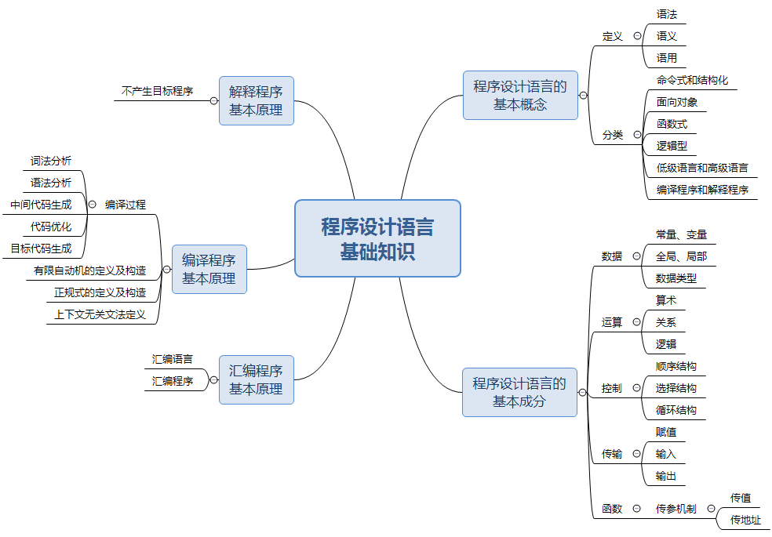

[toc]

# 软件设计师笔记02_程序设计语言基础

## 第二章 程序设计语言基础知识

考点图如下所示

### 程序语言的基本概念

> 低级语言和高级语言

由于计算机硬件只能识别由 0、1 组成的机器指令序列，即机器指令程序，因此机器指令是最基本的计算机语言。机器指令是特定的计算机系统所固有的、面向机器的语言，所以用机器语言进行程序设计时效率很低，程序的可读性很差，也难以修改和维护。

之后，人们就用容易记忆的符号代替 0、1 序列来表示机器指令。例如用 ADD 表示加法、用 SUB 表示减法等。用符号表示的指令称为汇编指令，汇编指令的集合被称为汇编语言。

汇编语言与机器语言十分接近，其书写格式在很大程度上取决于特定计算机的机器指令，因此它仍然是一种面向机器的语言。人们称机器语言和汇编语言为低级语言。

再之后，人们开发了功能更强、抽象级别更高的语言以支持程序设计，于是就产生了面向各类应用的程序设计语言，称为高级语言。常见的有 Java、C、C++、PHP、Python、Delphi、PASCAL 等。这类语言与人们使用的自然语言比较接近，提高了程序设计的效率。

总结：
- 低级语言：机器语言，汇编语言。
- 高级语言：功能更强，抽象级别更高，与人们使用的自然语言比较接近，常见的有Java，C，C++，PHP，Python，Delphi等。

> 编译程序和解释程序

由于计算机只能理解由 0、1 序列构成的机器语言，因此高级程序设计语言需要翻译，担负这一任务的程序称为 “语言处理程序”。语言之间的翻译形式有多种，基本方式为汇编、解释和编译。

用某种高级语言或汇编语言编写的程序称为源程序，源程序不能直接在计算机上执行。如果源程序是用汇编语言编写的，则需要一个对应的“语言处理程序”将其翻译成目标程序后才能在计算机上运行。如果源程序是用某种高级语言编写的，则需要对应的解释程序或编译程序对其进行翻译，然后在机器上运行。

- 解释程序（解释器），它或者直接解释执行源程序，或者将源程序翻译成某种中间代码后再加以执行；
- 编译程序（编译器）则是将源程序翻译成目标语言程序，然后在计算机上运行目标程序。

这两种语言处理程序的根本区别是：在编译方式下，机器上运行的是与源程序等价的目标程序，源程序和编译程序都不再参与目标程序的执行过程；而在解释方式下，解释程序和源程序都要参与到程序的运行过程中，运行程序的控制权在解释程序。

简单来说，在解释方式下，翻译源程序时不生成独立的目标程序，而编译器则将源程序翻译成独立保存的目标程序。

简而言之：解释程序会一边解释源程序，然后一边运行解释后的目标程序。而编译程序是将源程序编译完之后，再运行编译后的目标程序。

总结：
- 编译程序生成独立的可执行文件，直接运行，运行时无法控制源程序，效率高。
- 解释程序不生成可执行文件，可以遂条解释执行，用于调试模式，可以控制源程序，因为还需要控制程序，因此执行速度慢，效率低。

> 程序设计语言的定义

一般地，程序设计语言的定义都涉及语法、语义和语用等方面。

语法是指由程序设计语言的基本符号组成程序中的各个语法成分（包括程序）的一组规则，其中由基本字符构成的符号（单词）书写规则称为词法规则，由符号构成语法成分的规则称为语法规则。程序设计语言的语法可用形式语言进行描述。

语义是指程序设计语言中按语法规则构成的各个语法成分的含义，可分为静态语义和动态语义。静态语义指编译时可以确定的语法成分的含义，而运行时刻才能确定的含义是动态语义。一个程序的执行效果说明了该程序的语义，它取决于构成程序的各个组成部分的语义。

语言的实现则有个语境问题。语境是指理解和实现程序设计语言的环境，包括编译环境和运行环境。

- 总结：语法（一组规则）、语义（语法成分的含义）、语用（构成语言的各个记号和使用者的关系）。

> 程序设计语言的分类

程序语言的分类没有统一的标准，这里根据设计程序的方法将程序语言大致分为命令式和结构化程序设计语言、面向对象的程序设计语言、函数式程序设计语言和逻辑型程序设计语言等范型。

- 命令式和结构化程序设计语言：通常所称的结构化程序设计语言属于命令式语言类。例如C语言。
- 面向对象的程序设计语言: C++、Java 是面向对象程序设计语言的代表，它们都支持数据隐藏、数据抽象、用户定义类型、继承和多态等特性。
- 函数式程序设计语言： 函数式语言的代表 LISP 在许多方面与其他语言不同，其中最为显著的是，其程序和数据的形式是等价的，这样数据结构就可以作为程序执行，程序也可以作为数据修改。常见的函数式语言有 Haskell、Scala、Scheme、APL 等。
- 逻辑型程序设计语言： 逻辑型语言是一类以形式逻辑为基础的语言，其代表是建立在关系理论和一阶谓词理论基础上的 PROLOG。

### 程序设计语言的基本成分

程序设计语言的基本成分包括：数据、运算、控制、传输、函数。
1. 数据成分:  是指 常量和变量，全局量和局部量，数据类型
2. 运算成分： 是指 算式运算、关系运算、逻辑运算。
3. 控制成分： 是指 顺序结构、选择结构、循环结构。
4. 传输成分： 是指 数据传输方式，如赋值处理，数据的输入和输出。
5. 函数成分： 是指 定义函数，声明函数，调用函数。

### 汇编程序的基本原理

> 汇编语言源程序

汇编语言是为特定的计算机或计算机系统设计的面向机器的符号化的程序设计语言。用汇编语言编写的程序称为汇编语言源程序。

用汇编语言编写程序要遵循所用语言的规范和约定。汇编语言源程序由若干条语句组成，一个程序中可以有三类语句：指令语句、伪指令语句和宏指令语句。

> 汇编程序

因为计算机不能直接识别和运行汇编语言源程序，所以要用专门的翻译程序—汇编程序进行翻译。因此汇编程序的作用是将汇编语言所编写的源程序翻译成机器指令程序。

汇编程序一般需要两次扫描源程序才能完成翻译过程。
- 第一次扫描：检查语法错误，确定符号名字；建立使用的全部符号名字表；每一符号名字后跟一个对应值（地址或数）。
- 第二次扫描：在第一次扫描的基础上，将符号地址转换成真地址（代真）；利用操作码表将助记符转换成相应的目标码。

### 编译程序的基本原理

> 编译过程概述

编译程序的功能是把某高级语言书写的源程序翻译成与之等价的目标程序（汇编语言或机器语言），从而让机器运行目标程序。

编译程序的工作过程可以分为 6 个阶段，如图所示，在实际的编译器中可能会将其中的某些阶段结合在一起进行处理。

编译方式中中间代码生成和代码优化不是必要的，可省略。

### 解释程序的基本原理

解释程序是另一种语言处理程序，在词法、语法和语义分析方面与编译程序的工作原理基本相同，但是在运行用户程序时，它直接执行源程序或源程序的内部形式。因此，解释程序不产生源程序的目标程序，这是它和编译程序的主要区别。

如图是解释程序实现高级语言的三种方式

注意：编译器和解释器都不可省略词法分析、语法分析、语义分析并且这三个步骤顺序不可交换。

### 词法分析

- 输入：源程序。
- 输出：记号流。
- 主要作用是分析构成程序的字符及由字符按照构造规则构成的符号是否符合程序语言的规定。

### 语法分析

- 输入：记号流。
- 输出：语法树(分析树)。
- 主要作用是对各条语句的结构进行合法性分析分析程序中的句子结构是否正确。可以发现程序中所有的语法错误。

> 语法分析的几种方法

- 自上而下语法分析：最左推导，从左至右。给定文法G和源程序串r。从G的开始符号s出发，通过反复使用产生式对句型中的非终结符进行替换(推导)，逐步推导出r。
- 递归下降思想：原理是利用函数之间的递归调用模拟语法树自上而下的构造过程，是一种自上而下的语法分析方法。
- 自下而上语法分析：最右推导，从右至左。从给定的输入串r开始，不断寻找子串与文法G中某个产生式P的候选式进行匹配，并用P的左部代替(归约)之，逐步归约到开始符号S。
- 移进-规约思想：设置一个栈，将输入符号逐个移进栈中，栈顶形成某产生式的右部时，就用左部去代替，称为归约。很明显，这个思想是通过右部来推导出左部，因此是自下而上语法分析的核心思想。

### 语义分析

- 输入：语法树
- 主要作用是进行类型分析和检查语义分析阶段不能发现程序中所有的语义错误。

语义分析可以发现静态语义错误，但是不能发现动态语义错误。动态语义错误只有运行时才能发现。有语义错误是可以编译成功的，例如a/0；这是符合语法的，也符合静态语义，编译器检验不出来这个是错的，只有运行才会报错，也就是动态语义，动态语义错误常见的有死循环。

### 目标代码生成

目标代码生成阶段的工作与具体的机器密切相关。寄存器的分配也处于目标代码生成阶段
