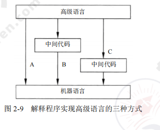
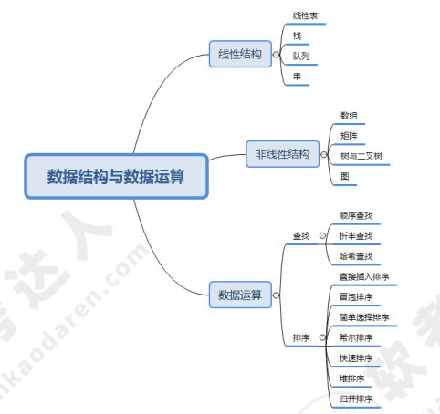
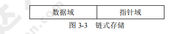
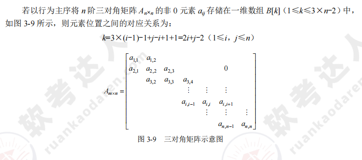
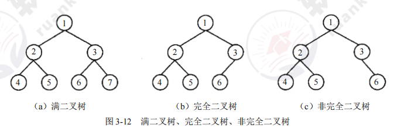
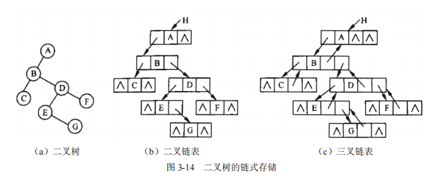
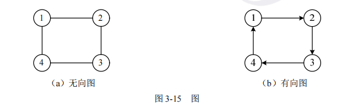
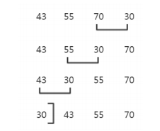
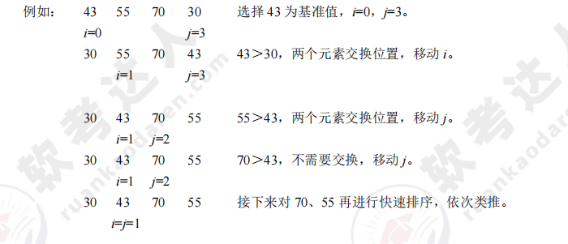

[toc]

# 软件设计师笔记01_计算机系统知识概述

## 第二章 程序设计语言基础知识

### 程序语言的基本概念

> 低级语言和高级语言

由于计算机硬件只能识别由 0、1 组成的机器指令序列，即机器指令程序，因此机器指令是最基本的计算机语言。机器指令是特定的计算机系统所固有的、面向机器的语言，所以用机器语言进行程序设计时效率很低，程序的可读性很差，也难以修改和维护。

之后，人们就用容易记忆的符号代替 0、1 序列来表示机器指令。例如用 ADD 表示加法、用 SUB 表示减法等。用符号表示的指令称为汇编指令，汇编指令的集合被称为汇编语言。

汇编语言与机器语言十分接近，其书写格式在很大程度上取决于特定计算机的机器指令，因此它仍然是一种面向机器的语言。人们称机器语言和汇编语言为低级语言。

再之后，人们开发了功能更强、抽象级别更高的语言以支持程序设计，于是就产生了面向各类应用的程序设计语言，称为高级语言。常见的有 Java、C、C++、PHP、Python、Delphi、PASCAL 等。这类语言与人们使用的自然语言比较接近，提高了程序设计的效率。

> 编译程序和解释程序

由于计算机只能理解由 0、1 序列构成的机器语言，因此高级程序设计语言需要翻译，担负这一任务的程序称为 “语言处理程序”。语言之间的翻译形式有多种，基本方式为汇编、解释和编译。

用某种高级语言或汇编语言编写的程序称为源程序，源程序不能直接在计算机上执行。如果源程序是用汇编语言编写的，则需要一个对应的“语言处理程序”将其翻译成目标程序后才能在计算机上运行。如果源程序是用某种高级语言编写的，则需要对应的解释程序或编译程序对其进行翻译，然后在机器上运行。

- 解释程序（解释器），它或者直接解释执行源程序，或者将源程序翻译成某种中间代码后再加以执行；
- 编译程序（编译器）则是将源程序翻译成目标语言程序，然后在计算机上运行目标程序。

这两种语言处理程序的根本区别是：在编译方式下，机器上运行的是与源程序等价的目标程序，源程序和编译程序都不再参与目标程序的执行过程；而在解释方式下，解释程序和源程序（或其某种等价表示）要参与到程序的运行过程中，运行程序的控制权在解释程序。简单来说，在解释方式下，翻译源程序时不生成独立的目标程序，而编译器则将源程序翻译成独立保存的目标程序。

简而言之：解释程序会一边解释源程序，然后一边运行解释后的目标程序。而编译程序是将源程序编译完之后，再运行编译后目标程序。

> 程序设计语言的定义

一般地，程序设计语言的定义都涉及语法、语义和语用等方面。

语法是指由程序设计语言的基本符号组成程序中的各个语法成分（包括程序）的一组规则，其中由基本字符构成的符号（单词）书写规则称为词法规则，由符号构成语法成分的规则称为语法规则。程序设计语言的语法可用形式语言进行描述。

语义是指程序设计语言中按语法规则构成的各个语法成分的含义，可分为静态语义和动态语义。静态语义指编译时可以确定的语法成分的含义，而运行时刻才能确定的含义是动态语义。一个程序的执行效果说明了该程序的语义，它取决于构成程序的各个组成部分的语义。

语言的实现则有个语境问题。语境是指理解和实现程序设计语言的环境，包括编译环境和运行环境。

> 程序设计语言的分类

程序语言的分类没有统一的标准，这里根据设计程序的方法将程序语言大致分为命令式和结构化程序设计语言、面向对象的程序设计语言、函数式程序设计语言和逻辑型程序设计语言等范型。

- 命令式和结构化程序设计语言：通常所称的结构化程序设计语言属于命令式语言类。例如C语言。
- 面向对象的程序设计语言: C++、Java 是面向对象程序设计语言的代表，它们都支持数据隐藏、数据抽象、用户定义类型、继承和多态等特性。
- 函数式程序设计语言： 函数式语言的代表 LISP 在许多方面与其他语言不同，其中最为显著的是，其程序和数据的形式是等价的，这样数据结构就可以作为程序执行，程序也可以作为数据修改。常见的函数式语言有 Haskell、Scala、Scheme、APL 等。
- 逻辑型程序设计语言： 逻辑型语言是一类以形式逻辑为基础的语言，其代表是建立在关系理论和一阶谓词理论基础上的 PROLOG。

### 程序设计语言的基本成分

程序语言的基本成分包括数据、运算、控制和传输等。
1. 数据成分:  是指 常量和变量，全局量和局部量，数据类型等
2. 运算成分： 是指 算式运算、关系运算、逻辑运算。
3. 控制成分： 是指 顺序结构、选择结构、循环结构。
4. 传输成分： 是指 数据传输方式，如赋值处理，数据的输入和输出等。

### 汇编程序的基本原理

> 汇编语言源程序

汇编语言是为特定的计算机或计算机系统设计的面向机器的符号化的程序设计语言。用汇编语言编写的程序称为汇编语言源程序。

用汇编语言编写程序要遵循所用语言的规范和约定。汇编语言源程序由若干条语句组成，一个程序中可以有三类语句：指令语句、伪指令语句和宏指令语句。

> 汇编程序

因为计算机不能直接识别和运行汇编语言源程序，所以要用专门的翻译程序—汇编程序进行翻译。因此汇编程序的作用是将汇编语言所编写的源程序翻译成机器指令程序。

汇编程序一般需要两次扫描源程序才能完成翻译过程。
- 第一次扫描：检查语法错误，确定符号名字；建立使用的全部符号名字表；每一符号名字后跟一个对应值（地址或数）。
- 第二次扫描：在第一次扫描的基础上，将符号地址转换成真地址（代真）；利用操作码表将助记符转换成相应的目标码。

### 编译程序的基本原理

> 编译过程概述

编译程序的功能是把某高级语言书写的源程序翻译成与之等价的目标程序（汇编语言或机器语言）。

编译程序的工作过程可以分为 6 个阶段，如图所示，在实际的编译器中可能会将其中的某些阶段结合在一起进行处理。

### 解释程序的基本原理

解释程序是另一种语言处理程序，在词法、语法和语义分析方面与编译程序的工作原理基本相同，但是在运行用户程序时，它直接执行源程序或源程序的内部形式。因此，解释程序不产生源程序的目标程序，这是它和编译程序的主要区别。

如图是解释程序实现高级语言的三种方式

## 第三章 数据结构与数据运算

数据的结构可以分为线性结构、非线性结构与数据的运算三个部分。

该章节的架构图如下。

### 线性结构

线性结构是一种基本的数据结构，主要用于对客观世界中具有单一前驱和后继的数据关系进行描述。线性结构的特点是数据元素之间呈现一种线性关系，即元素 “一个接一个排列”。

#### 线性表

线性表是最简单、最基本的数据结构。线性表常采用顺序存储和链式存储，主要的基本操作是插入、删除和查找等。

一个线性表是 n（n≥0）个元素的有限序列，通常表示为（a1,a2,...,an）。非空线性表的特点为：
- ①存在唯一的一个称作“第一个”的元素；
- ②存在唯一的一个称作“最后一个”的元素；
- ③除第一个元素外，序列中的每个元素均有一个直接前驱；
- ④除最后一个元素外，序列中的每个元素均有一个直接后继;

> 线性表的存储结构

1. 顺序存储

线性表的顺序存储是指用一组地址连续的存储单元依次存储线性表中的数据元素，从而使得逻辑上相邻的两个元素在物理位置上也相邻。

- 优点：可以随机存取表中元素。
- 缺点：插入与删除需要移动元素。

如图所示

2. 链式存储

链式存储通过指针链接起来的结点来存储数据元素。链式存储结构有单链表、循环链表（循环单链表、循环双链表）等，其中单链表只能从头结点开始往后顺序遍历整个链表，而循环单链表可以从表中的任一结点开始遍历整个链表。

- 优点：插入与删除不需要移动元素。
- 缺点：不能对数据元素进行随机访问。

如图所示

> 栈

栈又称为“后进先出”（LIFO）的线性表。在栈中进行插入和删除操作的一端称为栈顶，另一端称为栈底。

如图所示

> 队列

队列是一种“先进先出”（FIFO）的线性表，即在表的一端插入元素，在另一端删除元素。在队列中允许插入元素的一端称为队尾（rear），允许删除元素的一端称为队头（front）。

如图所示

> 循环队列

由于顺序队列的存储空间是提前设定的，所以队尾指针会有一个上限值，当队尾指针达到上限时便无法通过修改队尾指针来添加元素。如若将顺序队列设置成环状结构，就可以维持入队、出队操作。

1. 假设环队列 Q 的容量为 MAXSIZE，初始队列为空，而且 Q.rear 和 Q.front 都等于 0。如图a所示
2. 元素入队时，修改队尾指针 Q.rear=(Q.rear+1)%MAXSIZE，如图b所示。
3. 元素出队时，修改队头指针 Q.front=(Q.front+1)%MAXSIZE，如图c所示。
4. 循环队列约定以“队尾指针所指位置的下一个位置是队头指针”来表示“队列满”的情况，如图d所示。

> 双端队列

某双端队列如图所示，要求元素进出队列必须在同一端口，即从 A 端进入的元素必须从 A 端出、从 B 端进入的元素必须从 B 端出。

> 串

串是仅由字符构成的有限序列，也是一种线性表，一般记为 s=“a1a2...an”（n>0），其中，s 是串的名称，用单引号括起来的字符序列是串值。

串的基本概念包括：
1. 空串：长度为 0 的串称为空串，空串不包含任何字符。
2. 空格串：由一个或多个空格组成的串。
3. 子串：由串中任意长度的连续字符构成的序列称为子串。含有子串的串称为主串。空串是任意串的子串。

### 非线性结构

#### 二维数组

如图所示，二维数组的特点如下：
1. 数据元素数目固定，一旦定义了一个数组结构，就不再有元素个数的增减变化。
2. 数据元素具有相同的类型。
3. 数据元素的下标关系具有上下界约束且下标有序。

#### 三对角矩阵

#### 树

树是 n（n≥0）个结点的有限集合，当 n=0 时，集合为空，称为空树。在任意一非空树中（n＞0），有且仅有一个称为根的结点，其余结点可以分成 m（m≥0）个不相交的有限结点的集合 T1,T2,…,Tm，其中每个 T1 又都是一棵树，并且称为根的子树，如图所示。

> 树的基本概念

1. 双亲、孩子和兄弟。结点的子树的根称为该节点的孩子结点；相应地，该结点称为其子结点的双亲。具有相同双亲的结点互为兄弟。
2. 结点的度。一个结点拥有子树的个数称为该结点的度。例如，如图 3-10 中，A 的度为 3，B 的度为 2，C 的度为 0，D 的度为 1。
3. 叶子结点。叶子结点是指度为 0 的结点。例如，图 3-10 中的 E、F、C、G 都是叶子结点。
4. 内部结点。除根结点外，度不为 0 的结点称为内部结点。例如，图 3-10 中的 B、D 都是内部结点。
5. 结点的层次。例如，图 3-10 中的 A 在第一层，B、C、D 在第二层，E、F、G 在第三层。
6. 树的深度。一棵树的最大层数为该树的深度（或高度）。例如，图 3-10 中的树的深度为 3。
7. 有序/无序树。如果树中各结点的各个子树是从左到右有序排列且不能交换时，则称该树为有序树，否则称为无序树。

> 二叉树

二叉树与普通树的区别在于，二叉树中结点的子树分为左子树和右子树，如图所示。

> 满二叉树与完全二叉树

如果一个二叉树的层数为 K，结点总数为 2^k - 1 个，则它就是满二叉树，如图a所示。在一个深度为 h 的完全二叉树中，除第 h 层外（最后一层），其他各层都是满的。第 h 层所有的结点都必须从左到右依次放置，不能留空，如图 b 所示。图 c 为非完全二叉树。

> 二叉树的性质

> 二叉树的存储结构

二叉树的顺序存储。在采用顺序存储时，完全二叉树与一般二叉树相比节省了空间，这是因为一般二叉树需要添加一些“虚结点”而造成了空间的浪费，如图所示。

二叉树的链式存储。二叉树的链式存储可以分为二叉链表和三叉链表的存储结构，如图所示

> 二叉树的遍历

遍历是按某种策略访问树中的每个结点且仅访问一次的过程。二叉树的遍历可以分为前序、中序、后序和层次遍历四种形式。这四种遍历方式产生的结果如图所示。

> 最优二叉树（哈夫曼树）

哈夫曼树又称为最优二叉树，是一种带权路径长度最短的二叉树。所谓树的带权路径长度，就是树中所有的叶子结点的权值乘上其到根结点的路径长度（若根结点为 0 层，叶子结点到根结点的路径长度为叶子结点的层数）。

树的带权路径长度记为 WPL=(W1×L1+W2×L2+W3×L3+…+Wn×Ln)，N 个权值 Wi（i=1,2,…,n）构成一棵有 N 个叶结点的二叉树，相应的叶结点的路径长度为 Li（i=1,2,…,n）。由此可以证明哈夫曼树的带权路径长度是最小的。

#### 图

图是由集合 V 和 E 构成的二元组，记作 G=(V,E)，其中，V 是图中顶点的非空有限集合，E 是图中边的有限集合，如下图所示。

> 图的存储结构

> 图的遍历

图的遍历可以分为深度优先遍历、广度优先遍历两种方式，深度优先遍历类似于树的前序遍历，而广度优先遍历则相当于树的层次遍历。

### 数据运算

#### 查找

> 顺序查找

将待查的元素从头到尾与表中元素进行比较，如果存在，则返回成功；否则，查找失败。此方法效率不高。顺序查找的平均查找长度为(n+1)/2。

> 二分查找

二分查找的前提是元素有序（一般是升序），基本思路是拿中间元素 A [ m ] 与要查找的元素 x 进行比较，如果相等，则表示找到；如果 A [ m ] 比 x 大，那么要找的元素一定在 A [ m ] 前边（左边）；如果 A [ m ] 比 x 小，那么要找的元素一定在 A [ m ] 后边（右边）。每进行一次查找，数组规模减半。反复将子数组规模减半或使当前子数组为空，直到发现要查找的元素

> 哈希查找

设关键序列为 47、34、13、12、52、38、33、27、3，哈希表长为 11，哈希函数为 Hash(key)=key mod 11，则有
- Hash(47) = 47 mod 11= 3，Hash(34) = 34 mod 11= 1，Hash(13) =13 mod 11= 2，
- Hash(12) = 12 mod 11= 4，Hash(52) = 52 mod 11= 8，Hash(38) = 38 mod 11= 5，
- Hash(33) = 33 mod 11= 0，Hash(27) = 27 mod 11= 6，Hash(3) =3 mod 11= 7。

对于产生的冲突，哈希函数可以采用线性探测法解决冲突，哈希地址和关键字的对应关系如表所示。

#### 排序

> 直接插入排序

在插入第 i 个记录时，R1,R2,...,Ri-1 均已排好序，这时将第 i 个记录依次与 Ri-1,...,R2,R1进行比较，找到合适的位置插入，插入位置及之后的记录依次向后移动。

例如：43 55 70 30 -> 结果：30 43 55 70

直接插入排序在最好情况下的时间复杂度为 O(n)，在最坏情况下的时间复杂度为 O(n^2)

> 冒泡排序

通过相邻元素（i 与 i-1）之间的比较和交换，将排序码较小的元素逐渐从底层移向顶层。整个过程像水底的气泡逐渐向上冒，由此而得名冒泡排序。冒泡排序的时间复杂度为 O(n^2)。

例如：43 55 70 30

排序过程如图所示。

> 简单选择排序

每一趟从待排序的数据元素中选出最小的元素，顺序放在待排序数列的最前面，直到全部待排
序的数据元素全部排完。简单选择排序的时间复杂度为 O(n^2)。

例如：43 55 70 30
第一趟，最小值 30 与第一个元素交换：30 55 70 45
第二趟，最小值 45 与第二个元素交换：30 45 70 55
第三趟，最小值 55 与第三个元素交换：30 45 55 70

> 希尔排序

先将整个待排元素序列分成若干个子序列（由相隔某个“增量”的元素组成）后分别进行直接插入排序，然后依次缩减增量再进行排序，待整个序列中的元素基本有序（增量足够小）时，再对全体元素进行一次直接插入排序。因为直接插入排序在元素基本有序的情况下（接近最好情况），效率是很高的。希尔排序的时间复杂度为 O(n^1.3)

> 快速排序

快速排序是对冒泡排序的一种改进。基本思路是：通过一趟排序将要排序的数据分成独立的两个部分，其中一部分的所有数据都比另外一部分的所有数据要小，然后再按此方法对这两部分数据分别进行快速排序，整个排序过程可以递归进行，以此达到整个数据变成有序序列。快速排序在最好情况下的时间复杂度为 O(nlog2^n)；在最坏情况下，即初始序列按关键字有序或基本有序时，快速排序的时间复杂度为 O(n^2)。

