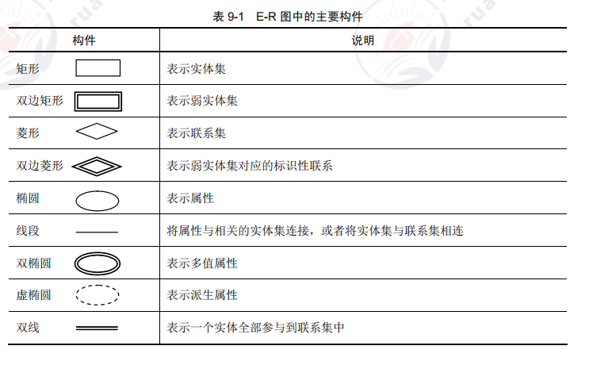

[toc]

# 软件设计师笔记03

## 第七章 面向对象技术

### 面向对象基础

#### 面向对象基础的概念

面向对象 = 对象 + 类 + 继承 + 消息通信 

> 对象

在面向对象的系统中，对象是基本运行时的实体，即包括数据（属性），也包括作用于数据的操作（行为）。一个对象把属性和行为封装为一个整体。封装是一种信息隐藏技术，目的是使对象的使用者和生产者分离，使对象的定义和实现分开。从程序设计者来看，对象是一个程序模块；从用户来看，对象为他们提供了所希望的行为。

对象内进行的操作通常称为方法。一个对象一般由对象名（标识）、属性和方法三个部分组成。

> 类

类是在对象上的抽象，对象是类的具体化，是类的实例（instance）。在分析和设计时，通常把注意力集中在类上，而不是具体的对象。也不必逐个定义每个对象，只需对类作出定义，而对类的属性进行不同的赋值即可得到该类的对象实例。

> 继承

继承是父类与子类之间共享数据和方法的机制。这是类之间的一种关系，在定义和实现一个类的时候，可以在一个已经存在的类的基础上进行，并把这个类所定义的内容作为自己的内容，并加入若干新的内容。

> 消息

对象之间进行通信的一种构造称为消息。当一个消息发送给某个对象时，包含要求接收对象去执行某些活动的信息，接收到信息的对象经过解释，然后予以响应，这种通信机制称为消息传递。发送消息的对象不需要知道接收消息的对象如何对请求予以响应。

> 多态

在收到消息时，对象要予以响应。不同的对象收到同一信息可以产生不同的结果，这个现象称为多态。Cardelli 和 Wegner 将其分为通用的（参数的、包含的）和特定的（过载的、强制的）。

> 动态绑定

绑定是一个把过程调用和响应调用所需要执行的代码加以结合的过程。在一般的程序设计语言中，绑定是在编译时进行的，称为静态绑定。动态绑定则是在运行时进行的，因此，一个给定的过程调用和代码的结合直到调用发生时才进行。

#### 面向对象分析

面向对象分析（OOA）的目的是获得对应用问题的理解。理解的目的是确定系统的功能和性能要求。

面向对象分析技术可以将系统的行为和信息间的关系表示为迭代构造特征。面向对象分析包括五个活动：①认定对象；②组织对象；③对象间的相互作用；④定义对象的操作；⑤定义对象的内部信息。

#### 面向对象设计

面向对象设计（OOD）的含义是设计分析模型和实现相应的源代码，在目标代码环境中，这种源代码可以被执行。

通常情况下，由概念模型生成的分析模型被装入到相应的执行环境中时，还需要被修改。对象标识期间的目标是分析对象，设计过程也是发现对象的过程，称为再处理。

面向对象是一种程序设计风格，不只是一种具有构造继承性、封装性和多态的程序设计语言族的命名。

#### 面向对象测试

面向对象测试可以分为四个层次：
- 算法层。用于测试类中定义的每个方法，基本上相当于传统软件测试中的单元测试。
- 类层。用于测试封装在同一个类中的所有方法与属性之间的相互作用。在面向对象软件中，类是基本模块，因此可以认为这是面向对象测试中所特有的模块测试。
- 模板层。用于测试一组协同工作的类之间的相互作用。大体上相当于传统软件测试中的集成测试，但是也有面向对象软件的特点，如对象之间通过发送消息相互作用。
- 系统层。把各个子系统组装成完整的面向对象软件系统，在组装过程中同时进行测试。

### UML

#### 事物

UML 中有四种事物。如图所示。

#### 关系

UML 中有四种关系：依赖、关联、泛化和实现。这四种关系是 UML 模型中可以包含的基本关系事物。

### 设计模式

> 设计模式的要素

设计模式的核心在于提供了相关问题的解决方案，使人们可以更加简单方便地复用成功的设计和体系结构。

设计模式的四个基本要素为：①模式名称；②问题；③解决方案；④效果。

> 创建型设计模式

创建型设计模式抽象了实例化过程，它们帮助一个系统独立于如何创建、组合和表示它的那些对象。

一个类的创建型模式使用继承改变被实例化的类，而一个对象创建型模式将实例化委托给另一个对象。

创建型设计模式的基本要素为：①抽象工厂（Abstract Factory）；②生成器（Builder）；③工厂方法（Factory Method）；④原型（Prototype）；⑤单例（Singleton）。

> 结构型设计模式

结构型设计模式的基本要素为：①适配器（Adapter）；②桥接（Bridge）；③组合（Composite）；④装饰（Decorator）；⑤外观（Facade）；⑥享元（Flyweight）；⑦代理（Proxy）。

> 行为设计模式

行为设计模式涉及算法和对象间职责的分配。行为设计模式不仅描述对象或类的模式，还描述了它们之间的通信模式。这些模式刻画了在运行时难以跟踪的、复杂的控制流。它们将用户的注意力从控制流转移到对象间的联系方式上来。

行为设计模式的基本要素为：①责任链（Chain of Responsibility）；②命令（Command）；③解释器（Interpreter）；④迭代器（Iterator）；⑤中介者（Mediator）；⑥备忘录（Memento）；⑦观察者（Observer）；⑧状态（State）；⑨策略（Strategy）；⑩模板方法（Template Method）；⑪访问者（Visitor）。

## 第八章 算法设计与分析

算法被公认为是计算机科学的基石，算法理论研究的是算法的设计技术和分析技术。

### 算法的基本概念

算法（Algorithm）是对特定问题求解步骤的一种描述，它是指令的有限序列，其中每一条指令表示一个或多个操作。

> 算法的特性

有穷性、确定性、可行性、输入、输出。

> 一个“好”算法的要求

正确性、健壮性、高效性

> 算法的表示的优缺点

### 算法的分析基础

> 算法复杂性

时间复杂性、空间复杂性。

### 分治法

1. 递归的概念
2. 分治法思想:分解、求解、合并。
3. 分治法实例:归并排序。

### 动态规划法

> 基本思想
1. 找出最优解的性质，并刻画其结构特征。
2. 递归定义最优解的值。
3. 自底向上算出最优解。
4. 构造最优解。

> 动态规划法的实例

0－1 背包问题

### 贪心法

1. 基本思想
2. 实例:活动选择问题、背包问题。

### 回溯法

1．解空间
2．基本思想
3．算法框架：非递归、递归。
4．实例：0－1 背包问题。

### 分支限界法

1．队列式（FIFO）分支限界法
2．优先队列式分支限界法

### 概率算法

1．数值概率算法
2．蒙特·卡罗（Monte Carlo）算法
3．拉斯维加斯（Las Vegas）算法
4．舍伍德（Sherwood）算法

### 近似算法

1．性能标准：算法的时间复杂度、解的近似程度。
2．实例：定点覆盖问题、TSP 问题、子集和数问题

### NP 完全性理论

1．P 类问题和 NP 类问题
2．NP 完全问题
3．典型的 NP 完全问题

## 第九章 数据库技术基础

### 数据库模型

> 三级模式

概念模式（模式）、外模式（用户/子模式）、内模式（物理模式）。

> 二级映射

模式/内模式映像、外模式/模式映像。

> 数据的独立性

数据的逻辑独立性、数据的物理独立性。

### 数据模型

> 常用的数据模型

1. 概念数据模型：也称信息模型，以用户视角对数据和信息建模，是对现实世界信息的抽象，如 E-R 模型。
2. 基本数据模型：以计算机视角对数据建模，是对现实世界数据特征的抽象，用 DBMS 来实现，有层次模型、网状模型、关系模型和面向对象模型等.

> 数据模型三要素

数据结构、数据操作、数据的约束条件。

> E-R 模型的概念

用 E-R 图来描述现实世界的概念模型，E-R 图中的主要构件如图所示。
- 实体：用矩形表示，每个实体由一组属性表示，包括主键、候选键、外键。
- 联系：用菱形表示，分为一对一（1:1）、一对多（1:n）、多对多（m:n）。
- 属性：用椭圆表示，是实体某方面的特性。E-R 模型中的属性分为：①简单和复合属性；②单值和多值属性；③null 属性；④派生属性

### 数据库操作

> 关系模型的完整性规则

- 实体完整性：主属性不能为空值。
- 参照完整性：外键的值必须存在。
- 用户定义完整性：满足用户要求。

> 基本关系运算

关系代数运算符如图所示。

### 数据库语言 SQL

> 数据定义

CREATE、DROP、ALTER。

> 数据操纵

INSERT、UPDATE、DELETE。

> 数据查询

SELECT、简单查询、连接查询、子查询与聚集函数、分组查询、更名运算、字符串操作。

> 数据控制

GRANT、REVORK

### 数据库管理系统

> 数据库管理系统

数据库管理系统（DBMS）是操纵和管理数据库的软件，用于建立、使用和维护数据库。

> DBMS 的功能
- 数据定义。
- 数据库的操作。
- 数据库的运行管理。
- 数据的组织、存储和管理。
- 数据库的建立和维护。
- 其他功能，如通信、数据转换等

> DBMS 的特征
- 数据的结构化且统一管理。
- 有较高的数据独立性。
- 数据的控制功能，对数据库中数据的安全性、完整性、并发和恢复的控制。

> DBMS 的分类
- 关系数据库系统（RDBS）。
- 面向对象的数据库系统（OODBS）。
- 对象关系数据库系统（ORDBS）。

### 关系数据库的规范化

> 函数依赖

函数依赖、平凡依赖、非平凡依赖、完全依赖、部分依赖、传递依赖、Armstrong 公理系统（A1自反律、A2 增广率、A3 传递率；合并规则、伪传递率、分解规则）。

> 规范化
- 1NF：每个分量（属性）不可分割。
- 2NF：满足 1NF，而且消除非主属性对候选键的部分依赖。
- 3NF：满足 2NF，而且消除非主属性对候选键的传递依赖。

> 模式分解
- 分解。
- 无损连接。
- 保存函数依赖。

### 数据库的控制功能

> 事务

事务是指作为单个逻辑工作单元执行的一系列操作，要么完全执行，要么完全不执行。

> 事务的性质（ACID）
- 原子性（Atomicity）：要么都做，要么都不做。
- 一致性（Consistency）：事务完成时，必须保证所有数据都保持一致的状态。
- 隔离性（Isolation）：事务之间相互隔离。
- 持久性（Durability）：事务完成后，更新操作永久有效

> 数据库的故障类型
- 事务内部故障：如运算溢出、并发事务发生死锁等。
- 系统故障：也称为软故障，是指造成系统停运的事件，如 CPU 故障、OS 故障、突然停
电等。
- 介质故障：也称为硬故障，如磁盘损坏等。
- 计算机病毒。

> 备份方法
- 静态、动态转储。
- 海量、增量转储。
- 日志文件

> 数据不一致
- 丢失修改。
- 不可重复读。
- 读脏数据。

数据不一致的三种情况如图所示

> 锁
- 排他锁（X/写锁）
- 共享锁（S/读锁）

> 三级封锁协议
- 一级：修改数据前先加 X 锁，事务结束后释放，可解决丢失修改问题。
- 二级：在一级基础上，读数据之前加 S 锁，读完后释放即可解决读脏数据问题。
- 三级：在一级基础上，读数据之前加 S 锁，直到事务结束后释放 S 锁，即可解决丢失修改、读脏数据、不可重复读三个数据不一致的问题.

### 数据仓库和分布式数据库基础知识

> 数据仓库

数据仓库是一个面向主题的、集成的、相对稳定的、反映历史变化的数据集合，用于支持管理决策。

数据仓库的体系结构如图所示

> 数据仓库的分类
- 企业仓库。
- 数据集市。
- 虚拟仓库

> 分布式数据库

通常使用较小的计算机系统，每台计算机可以单独放在一个地方，每台计算机中都可能有DBMS 的一份完整拷贝副本或部分拷贝副本，并具有自己局部的数据库，位于不同地点的许多计算机通过网络互相连接，共同组成一个完整的、全局的逻辑上集中、物理上分布的大型数据库。

分布式数据库的体系结构如图所示。

