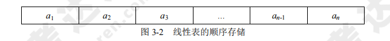
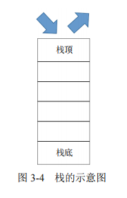
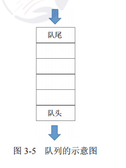
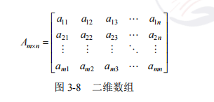
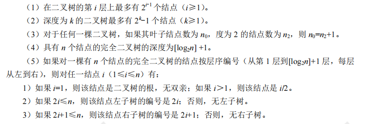

[toc]

# 软件设计师笔记03_数据结构与数据运算

## 第三章 数据结构与数据运算

数据的结构可以分为线性结构、非线性结构与数据的运算三个部分。

该章节的架构图如下。

### 线性结构

线性结构的特点是数据元素之间呈现一种线性关系，即元素 “一个接一个排列”。

#### 线性表

线性表是最简单、最基本的线性结构。

线性表常采用顺序存储和链式存储，主要的基本操作是插入、删除和查找等。

> 线性表的存储结构

线性表常采用顺序存储和链式存储，主要的基本操作是插入、删除和查找等。
- 顺序存储：用一组地址连续的存储单元依次存储线性表中的数据元素，使得逻辑上相邻的元素物理上也相邻
- 链式存储：存储各数据元素的结点的地址并不要求是连续的，数据元素逻辑上相邻，物理上分开

#### 栈

栈是一种“后进先出”（LIFO）的线性表。在栈中进行插入和删除操作的一端称为栈顶，另一端称为栈底。

#### 队列

队列是一种“先进先出”（FIFO）的线性表，即在表的一端插入元素，在另一端删除元素。在队列中允许插入元素的一端称为队尾，允许删除元素的一端称为队头。

#### 串

串是由字符构成的有限序列，也是一种线性表，一般记为 s=“a1a2...an”（n>0），其中，s 是串的名称，用单引号括起来的字符序列是串值。

> 串的基本概念
- 空串：长度为 0 的串称为空串，空串不包含任何字符。
- 空格串：由一个或多个空格组成的串，空格是空白字符，占一个字符长度。
- 子串：由串中任意长度的连续字符构成的序列称为子串。含有子串的串称为主串。空串是任意串的子串。

### 非线性结构

#### 二维数组

二维数组的特点如下：
1. 数据元素数目固定。
2. 数据元素具有相同的类型。
3. 数据元素的下标关系具有上下界约束且下标有序。

一个m行n列的数组表示如下

> 数组存储地址的计算

假设每个数组元素占用内存长度为len，起始地址为a，存储地址计算如下：

#### 三对角矩阵

常见的特殊矩阵有对称矩阵、三角矩阵和对角矩阵。

#### 树

树是一种非线性结构，树中的每一个数据元素可以有两个或两个以上的直接后继元素，用来描述层次结构关系。

如图所示。

> 树的基本概念

1. 双亲、孩子和兄弟。结点的子树的根称为该节点的孩子结点；相应地，该结点称为其子结点的双亲。具有相同双亲的结点互为兄弟。
2. 结点的度。一个结点拥有子树的个数称为该结点的度。例如，如图 3-10 中，A 的度为 3，B 的度为 2，C 的度为 0，D 的度为 1。
3. 叶子结点。叶子结点是指度为 0 的结点。例如，图 3-10 中的 E、F、C、G 都是叶子结点。
4. 内部结点。除根结点外，度不为 0 的结点称为内部结点。例如，图 3-10 中的 B、D 都是内部结点。
5. 结点的层次。例如，图 3-10 中的 A 在第一层，B、C、D 在第二层，E、F、G 在第三层。
6. 树的深度。一棵树的最大层数为该树的深度（或高度）。例如，图 3-10 中的树的深度为 3。
7. 有序/无序树。如果树中各结点的各个子树是从左到右有序排列且不能交换时，则称该树为有序树，否则称为无序树。

#### 二叉树

二叉树与普通树的区别在于，每个节点最多只有两个孩子结点。二叉树中结点的子树分为左子树和右子树。

如图所示

> 满二叉树与完全二叉树与非完全二叉树

- 满二叉树：如果一个二叉树的层数为 K，结点总数为 2^k - 1 个，则它就是满二叉树，如图a所示。
- 完全二叉树：在一个深度为 h 的完全二叉树中，除第 h 层外（最后一层），其他各层都是满的。第 h 层所有的结点都必须从左到右依次放置，不能留空，如图 b 所示。
- 非完全二叉树：除了上面两个情况之外的二叉树就是非完全二叉树，图 c 为非完全二叉树。

> 二叉树的重要特性

> 二叉树的存储结构

二叉树的顺序存储结构：顺序存储，就是用一组连续的存储单元存储二叉树中的节点，按照从上到下，从左到右的顺序依次存储每个节点。

在采用顺序存储时，完全二叉树与一般的二叉树相比节省了空间，这是因为一般二叉树需要添加一些“虚结点”而造成了空间的浪费，如图所示。

二叉树的链式存储结构：一般用二叉链表来存储二叉树节点，二叉链表中除了该节点本身的数据外，还存储有左孩子结点的指针、右孩子结点的指针。每个二叉链表节点存储一个二叉树节点，头指针则指向根节点

在采用链式存储时，二叉树的链式存储可以分为二叉链表和三叉链表的存储结构，如图所示

> 二叉树的遍历

二叉树的遍历是按某种策略访问树中的每个结点且仅访问一次的过程。

二叉树的遍历可以分为前序、中序、后序和层次遍历四种形式。这四种遍历方式产生的结果如图所示。

- 先序（前序）遍历：根左右
- 中序遍历：左根右
- 后序遍历：左右根
- 层次遍历：按层次，从上到下，从左到右

> 最优二叉树（哈夫曼树）

哈夫曼树又称为最优二叉树，是一种带权路径长度最短的二叉树。
- 权：节点代表的值
- 路径：树中一个结点到另一个结点之间的通路
- 结点的路径长度：路径上的分支数目
- 树的路径长度：根节点到达每一个叶子节点之间的路径长度之和
- 结点的带权路径长度：该结点到根结点之间的路径长度乘以该节点的权值

所谓树的带权路径长度，就是树中所有的叶子结点的权值乘上其到根结点的路径长度（若根结点为 0 层，叶子结点到根结点的路径长度为叶子结点的层数）。

#### 图

图也是一种非线性结构，图中任意两个节点间都可能有直接关系。

图是由集合 V 和 E 构成的二元组，记作 G=(V,E)，其中，V 是图中顶点的非空有限集合，E 是图中边的有限集合，如下图所示。

> 图的种类

- 无向图：图的结点之间连接线是没有箭头的，不分方向
- 有向图：图的结点之间连接线是箭头，表示从一个节点到另一个节点。
- 无向完全图：节点两两之间都有连线，n个结点的连线数为(n-1)+(n-2)+...+1=n(n-1)/2;
- 有向完全图：节点两两之间都有互通的两个箭头，n个节点的连线数为n(n-1)

> 图的基础概念

- 度、出度和入度：节点的度是关联与该节点的边的数目。在有向图中，节点的度为出度和入度之和。
- 出度是以该节点为起点的有向边的数目。
- 入度是以该节点为终点的有向边的数目。
- 路径：存在一条通路，可以从一个节点到达另一个节点，有向图的路径也是有方向的
- 连通图：针对无向图。若从节点v到节点u之间是有路径的，则说明v和u之间是连通的，若无向图中任意两个顶点之间都是连通的，则称为连通图。
- 连通分量：无向图G的极大连通子图称为其连通分量。
- 强连通图和强连通分量：针对有向图。若有向图任意节个顶点间都互相存在路径即存在v到u，也存在u到v的路径，则称为强连通图。
- 强连通分量：有向图中的极大连通子图称连通分量网：边带权值的图称为网

> 图的存储结构

1. 领接矩阵

邻接矩阵表示法是指用一个矩阵来表示图中顶点之间的关系。

假设一个图中有n个节点，则使用n阶矩阵来存储这个图中各节点的关系，规则是若节点i到节点j有连线，则矩阵R(i,j)=1，否则为0。

如果是一个无向图，肯定是沿对角线对称的，只需要存储上三角或者下三角就可以了，而有向图则不一定对称。

2. 邻接链表

邻接链表表示法是指为图中的每一个顶点建立一个单链表。

先用一个一维数组将图中所有顶点存储起来,而后，对此一维数组的每个顶点元素，使用链表挂上和其有连线关系的结点的编号和权值

如图所示

> 图的遍历

图的遍历是指从图的任意节点出发，沿着某条搜索路径对图中所有节点进行访问且只访问一次，主要分为以下两种方式。

- 深度优先遍历：从任一顶点出发，遍历到底，直至返回，再选取任一其他节点出发，重复这个过程直至遍历完整个图。
- 广度优先遍历：先访问完一个顶点的所有邻接顶点，而后再依次访问其邻接顶点的所有邻接顶点，类似于层次遍历。

### 数据运算

#### 算法

算法是对特定问题求解步骤的一种描述，它是指令的有限序列，其中每一条指令表示一个或多个操作。

算法的5个重要特性：有穷性、确定性、可行性、输入、输出。

- 时间复杂度：是指程序运行从开始到结束所需要的时间。
- 空间复杂度：是指对一个算法在运行过程中临时占用存储空间大小的度量。一个算法的空间复杂度只考虑在运行过程中为局部变量分配的存储空间的大小。

#### 查找算法

##### 顺序查找

将待查的元素从头到尾与表中元素进行比较，如果存在，则返回成功；否则，查找失败。

- 顺序查找的平均查找长度为(n+1)/2。
- 顺序查找的时间复杂度为：时间复杂度为O(n)

##### 二分查找（折半查找）

- 二分查找的前提是元素有序（一般是升序）。
- 二分查找的时间复杂度为：O(log2n)

二分查找的基本思路是拿中间元素 A [ m ] 与要查找的元素 x 进行比较，如果相等，则表示找到；如果 A [ m ] 比 x 大，那么要找的元素一定在 A [ m ] 前边（左边）；如果 A [ m ] 比 x 小，那么要找的元素一定在 A [ m ] 后边（右边）。每进行一次查找，数组规模减半。反复将子数组规模减半或使当前子数组为空，直到发现要查找的元素。

##### 哈希查找

- 哈希查找的查找方式与哈希表有关。
- 哈希表：根据提前设定的哈希函数H和处理冲突的方法，将元素映射到一个有限的连续的地址集上，并以关键字在地址集中的“像”作为记录在表中的存储位置。

假设关键序列为 47、34、13、12、52、38、33、27、3，哈希表长为 11，哈希函数为 Hash(key)=key mod 11，则有
- Hash(47) = 47 mod 11= 3，Hash(34) = 34 mod 11= 1，Hash(13) =13 mod 11= 2，
- Hash(12) = 12 mod 11= 4，Hash(52) = 52 mod 11= 8，Hash(38) = 38 mod 11= 5，
- Hash(33) = 33 mod 11= 0，Hash(27) = 27 mod 11= 6，Hash(3) =3 mod 11= 7。

对于产生的冲突，哈希函数可以采用线性探测法解决冲突，哈希地址和关键字的对应关系如表所示。

#### 排序算法

##### 直接插入排序

在插入第 i 个记录时，R1,R2,...,Ri-1 均已排好序，这时将第 i 个记录依次与 Ri-1,...,R2,R1进行比较，找到合适的位置插入，插入位置及之后的记录依次向后移动。

例如：43 55 70 30 -> 30 43 55 70

直接插入排序在最好情况下的时间复杂度为 O(n)，在最坏情况下的时间复杂度为 O(n^2)

##### 冒泡排序

通过相邻元素（i 与 i-1）之间的比较和交换，将排序较小的元素逐渐从底层移向顶层。整个过程像水底的气泡逐渐向上冒，由此而得名冒泡排序。冒泡排序的时间复杂度为 O(n^2)。

例如：43 55 70 30

排序过程如图所示。

##### 简单选择排序

每一趟从待排序的数据元素中选出最小的元素，顺序放在待排序数列的最前面，直到全部待排
序的数据元素全部排完。简单选择排序的时间复杂度为 O(n^2)。

例如：43 55 70 30
第一趟，最小值 30 与第一个元素交换：30 55 70 45
第二趟，最小值 45 与第二个元素交换：30 45 70 55
第三趟，最小值 55 与第三个元素交换：30 45 55 70

##### 快速排序

快速排序是对冒泡排序的一种改进。基本思路是：通过一趟排序将要排序的数据分成独立的两个部分，其中一部分的所有数据都比另外一部分的所有数据要小，然后再按此方法对这两部分数据分别进行快速排序，整个排序过程可以递归进行，以此达到整个数据变成有序序列。快速排序在最好情况下的时间复杂度为 O(nlog2^n)；在最坏情况下，即初始序列按关键字有序或基本有序时，快速排序的时间复杂度为 O(n^2)。

