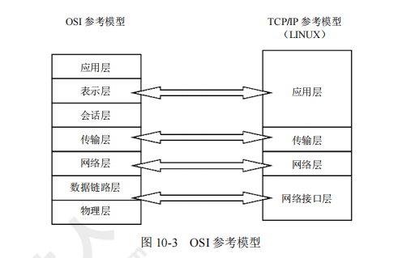

[toc]

# 软件设计师笔记04

## 第十章 网络与信息安全基础知识

### 网络概述

计算机网络是计算机技术与通信技术相结合的产物，它实现了远程通信、远程信息处理和资源共享。

> 计算机网络的概念

- 计算机网络的功能：数据通信、资源共享、负载均衡、高可靠性。
- 计算机网络按照数据通信和数据处理的功能分为两层：内层通信子网和外层资源子网。

> 计算机网络的分类

> 网络拓扑结构

常见的网络拓扑结构包括总线型结构、星型结构、环型结构、树型结构、分布式结构，如图所示。

> ISO/OSI 网络体系结构

ISO/OSI 的参考模型一共有七层，如图所示。

由低层到高层分别为：物理层、数据链路层、网络层、传输层、会话层、表示层、应用层。

### 网络设备及网络协议与标准

构建一个实际的网络需要网络的传输介质、网络互连设备作为支持，这里主要介绍构件网络的传输介质和互连设备。

> 网络设备

> 网络传输介质

> TCP/IP 协议族

1. TCP/IP 分层模型
协议是对数据在计算机或设备之间传输时的表示方法进行定义和描述的标准。协议规定了进行传输、检测错误及传送确认信息等内容。TCP/IP 是个协议族，它包含了多种协议。

ISO/OSI 模型、TCP/IP 的分层模型及协议的对比如图 10-6 所示。

2. 网络接口层协议
TCP/IP 协议不包含具体的物理层和数据链路层，只定义了网络接口层作为物理层与网络层的接口规范。这个物理层可以是广域网，也可以是局域网。网络接口层处在 TCP/IP 协议的最底层，主要负责管理为物理网络准备数据所需的全部服务程序和功能。

> 网际层协议 IP

网际层是整个 TCP/IP 协议族的重点，在网际层定义的协议除了 IP 外，还有 ICMP、ARP 和RARP 等几个重要的协议。

IP 的主要功能包括将上层数据（如 TCP、UDP 数据）或同层的其他数据（如 ICMP 数据）封装到 IP 数据中；将 IP 数据报送到最终目的地；为了使数据能够在链路层上进行传输，对数据进行分段；确定数据报到达其他网络中的目的地的路径。

> ARP 和 RARP

地址解析协议 ARP 的作用是将 IP 地址转换为物理地址，反地址解析协议 RARP 的作用是将物理地址转换为 IP 地址.

> Internet 控制信息协议 ICMP

Internet 控制信息协议（ICMP）是网际层的另一个比较重要的协议。由于 IP 是一种尽力传送的通信协议，即传送的数据报可能会丢失、重复、延迟或乱序，因此 IP 需要一种避免差错并在发生差错时报告的机制。ICMP 就是一个专门用于发送差错报文的协议。ICMP 定义了五种差错报文（源抑制、超时、目的不可达、重定向和要求分段）和四种信息报文（回应请求、回应应答、地址屏蔽码请求和地址屏蔽码应答）。

> 传输控制协议 TCP

传输控制协议 TCP 是 TCP/IP 协议族中最重要的协议之一，利用 TCP 在源主机和目的机之间建立和关闭连接操作时，均需要通过三次握手来确认建立和关闭是否成功，如图所示

> 用户数据报协议 UDP

用户数据报协议 UDP 是一种不可靠、无连接的协议。UDP 协议软件的主要作用是将 UDP 消息展示给应用层，并不负责重新发送丢失或出错的数据消息，不对接收到的无序 IP 数据报重新排序，不消除重复的 IP 数据报等。

> 应用层协议

应用层协议包括 NFS、Telnet、SMTP、DNS、SNMP、FTP 等。

### Internet 及应用

一个完整、通用的层次型主机域名由四个部分组成：计算机主机名、本地名、组名、最高层域名。从右到左，子域名分别表示不同的国家或地区的名称、组织类型、组织名称、分组织名称和计算机名称等。域名地址的最后一部分子域名称为高层域名，它大致分成两类：一类是组织性顶级域名，另一类是地理性顶级域名。

例如：`www.dzkjdx.edu.cn` cn 是地理性顶级域名，表示“中国”。`www.263.net` net 是组织性顶级域名，表示“网络技术组织机构”

Internet 中的地址可以分为五类：A 类、B 类、C 类、D 类和 E 类，各类地址分配方案如图所示.

### 网络安全

> 网络安全概述

计算机网络安全是指计算机、网络系统的软件或硬件及系统中的数据受到保护，不因偶然的或恶意的原因遭到破坏、更改、泄露，确保系统能连续、可靠地运行，使网络服务不中断。网络安全

从本质上讲就是网络上的信息安全。凡是涉及网络上信息的保密性、完整性、可用性、真实性和可控性的相关技术和理论，都是网络安全所要研究的领域。

网络安全涉及的主要内容如图所示。

- 信息系统安全的基本需求：保密性、完整性、可用性、可控性、可核查性。
- 网络安全威胁主要来自五类：物理威胁、网络攻击、身份鉴别、编程威胁、系统漏洞

> 网络信息安全

- 信息存储安全:信息存储安全的主要内容如图所示。

- 信息传输安全:信息传输加密的主要措施有链路加密、结点加密、端—端加密。

#### 防火墙技术

> 防火墙的分类

防火墙技术经历了包过滤、应用代理网关和状态监测三个发展阶段。

1. 包过滤防火墙。包过滤防火墙工作在网络层，对数据包的源及目的 IP 具有识别和控制作用，对于传输层，也只能识别数据报是 TCP 还是 UDP 及所用的端口信息。包过滤防火墙的处理速度较快，也易于配置。
    - 包过滤防火墙的优点是防火墙对每条传入和传出网络的包实行低水平控制：①每个 IP 包的字段都被检查，如源地址、目的地址、协议和端口等；②可以识别和丢弃带欺骗性的源 IP 地址的包；③两个网络之间访问的唯一来源；④通常被包含在路由器数据报中，所以不必额外的系统来处理这个特征。

2. 应用代理网关防火墙。应用代理网关防火墙的优点是可以检查应用层、传输层和网络层的协议特征，对数据包的检测能力较强，其缺点是难于配置、处理速度非常慢。

3. 状态监测防火墙。状态监测防火墙结合了代理防火墙的安全性和包过滤防火墙的高速度等优点，在不损失安全性的技术上将代理防火墙的性能提高了 10 倍。

> 典型防火墙的体系结构

典型防火墙的体系结构包括过滤路由器、双宿主主机、屏蔽主机网关和被屏蔽子网等类型。

1. 包过滤路由器。又称为屏蔽路由器，一般作用在网络层，对进出内部网络的所有信息进行分析，并按照一定的安全策略（过滤规则）对进出内部网络的信息进行限制。包过滤路由器防火墙示意图如图所示.
    - 采用包过滤路由器防火墙的优点在于速度快、实现方便。缺点是安全性能差，不同操作系统环境下 TCP 和 UDP 端口号所代表的应用服务协议类型有所不同，故兼容性差，没有或只有较少的日志记录能力。

 

2. 双宿主主机。双宿主主机结构是围绕着至少具有两个网络接口的双宿主主机构成的，每一个接口都连接在物理和逻辑上分离的不同网段，代理服务器软件在双宿主主机上运行，如图所示。

3. 屏蔽主机网关。屏蔽主机网关防火墙的优点是安全等级较高，可以提供公开的信息服务的服务器，可以放置在由包过滤器路由器和堡垒主机共用的网段上，如图所示。

4. 被屏蔽子网。被屏蔽子网由两个包过滤路由器和一个应用网关组成，如图所示。

> 被屏蔽子网防火墙系统的优点如下：
1）入侵者必须突破三个不同的设备（外部路由器、堡垒主机、内部路由器）才能侵袭内部网络。
2）由于外部路由器只能向 Internet 通告 DMZ 网络的存在，Internet 上的系统不需要有路由器和内部网络相对。
3）由于内部路由器只能向内部网络通告 DMZ 网络的存在，内部网络上的系统不能直接通往Internet，保证了内部网络上的用户必须通往驻留在堡垒主机上的代理服务器才能访问 Internet。
4）包过滤路由器直接将数据引向 DMZ 网络上所指定的系统，消除了堡垒主机双宿的必要。
5）内部路由器在作为内部网络和 Internet 之间最后的防火墙系统时，能够支持比双宿堡垒主机更大的数据报吞吐量。
6）由于 DMZ 网络是一个与内部网络不同的网络，NAT 可以安装在堡垒主机上，从而避免在内部网络上重新编制或重新划分子网。

#### 信息系统安全等级

信息系统安全等级保护详见表 10-2

#### 信息安全系统三维空间

信息安全系统三维空间：X、Y、Z 轴形成的信息安全系统的三维空间（即信息系统的安全空间）。

- X 轴：安全机制（安全防范体系、授权和审计安全、管理安全、运行安全、应用安全、通信安全、数据安全、平台安全、基础设施安全）。
- Y 轴：OSI。
- Z 轴：安全服务（实体认证、访问控制、数据保密、数据完整、数据源认证、禁止否认、犯罪证据提供等服务）。

#### 入侵检测系统

入侵检测是指对计算机、网络上的恶意行为进行识别、响应的处理过程。入侵检测系统（IDS）不仅检测外部入侵，也检测内部未授权（违规行为）的活动。对数据的分析是入侵检测的核心。

IDS 是防火墙之后的又一道防线，可以发现防火墙没有发现的入侵行为，如果防火墙是大厦的门禁系统，IDS 就是监控系统。

防火墙允许内部的一些主机可以被外部访问，但 IDS 没有这些功能，只是监视、分析用户和系统活动。IDS 是一个独立的系统，不需要其他安全审计系统的配合。

入侵检测系统的主要作用为：
- 实时检测：实时地监视、分析网络中所有的数据报文；发现并实时处理所捕获的数据报文。
- 安全审计：对系统记录的网络事件进行统计分析；发现异常现象；得出系统的安全状态，找出所需要的证据。
- 主动响应：主动切断连接或与防火墙的联动，调用其他程序处理。
- 工作原理：实时监控网络数据，与已知的攻击手段进行匹配，从而发现网络或系统中是否有违反安全策略的行为和遭遇袭击的迹象。
- 优点：能及时获知网络安全状况，借助分析发现安全隐患或攻击信息，便于及时采取措施。
- 缺点：难以及时阻断危险行为