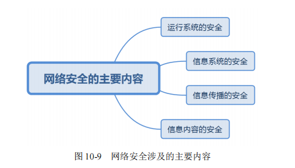
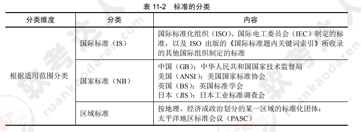
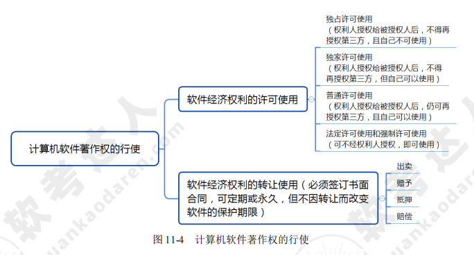
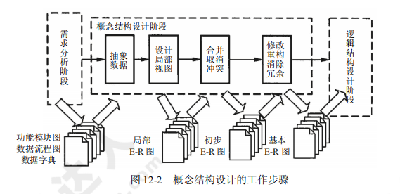
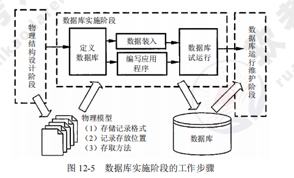
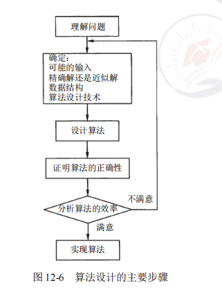

[toc]

# 软件设计师笔记04

## 第十章 网络与信息安全基础知识

### 网络概述

计算机网络是计算机技术与通信技术相结合的产物，它实现了远程通信、远程信息处理和资源共享。

> 计算机网络的概念

- 计算机网络的功能：数据通信、资源共享、负载均衡、高可靠性。
- 计算机网络按照数据通信和数据处理的功能分为两层：内层通信子网和外层资源子网。

> 计算机网络的分类

> 网络拓扑结构

常见的网络拓扑结构包括总线型结构、星型结构、环型结构、树型结构、分布式结构，如图所示。

> ISO/OSI 网络体系结构

ISO/OSI 的参考模型一共有七层，如图所示。

由低层到高层分别为：物理层、数据链路层、网络层、传输层、会话层、表示层、应用层。

### 网络设备及网络协议与标准

构建一个实际的网络需要网络的传输介质、网络互连设备作为支持，这里主要介绍构件网络的传输介质和互连设备。

> 网络设备

> 网络传输介质

> TCP/IP 协议族

1. TCP/IP 分层模型
协议是对数据在计算机或设备之间传输时的表示方法进行定义和描述的标准。协议规定了进行传输、检测错误及传送确认信息等内容。TCP/IP 是个协议族，它包含了多种协议。

ISO/OSI 模型、TCP/IP 的分层模型及协议的对比如图 10-6 所示。

2. 网络接口层协议
TCP/IP 协议不包含具体的物理层和数据链路层，只定义了网络接口层作为物理层与网络层的接口规范。这个物理层可以是广域网，也可以是局域网。网络接口层处在 TCP/IP 协议的最底层，主要负责管理为物理网络准备数据所需的全部服务程序和功能。

> 网际层协议 IP

网际层是整个 TCP/IP 协议族的重点，在网际层定义的协议除了 IP 外，还有 ICMP、ARP 和RARP 等几个重要的协议。

IP 的主要功能包括将上层数据（如 TCP、UDP 数据）或同层的其他数据（如 ICMP 数据）封装到 IP 数据中；将 IP 数据报送到最终目的地；为了使数据能够在链路层上进行传输，对数据进行分段；确定数据报到达其他网络中的目的地的路径。

> ARP 和 RARP

地址解析协议 ARP 的作用是将 IP 地址转换为物理地址，反地址解析协议 RARP 的作用是将物理地址转换为 IP 地址.

> Internet 控制信息协议 ICMP

Internet 控制信息协议（ICMP）是网际层的另一个比较重要的协议。由于 IP 是一种尽力传送的通信协议，即传送的数据报可能会丢失、重复、延迟或乱序，因此 IP 需要一种避免差错并在发生差错时报告的机制。ICMP 就是一个专门用于发送差错报文的协议。ICMP 定义了五种差错报文（源抑制、超时、目的不可达、重定向和要求分段）和四种信息报文（回应请求、回应应答、地址屏蔽码请求和地址屏蔽码应答）。

> 传输控制协议 TCP

传输控制协议 TCP 是 TCP/IP 协议族中最重要的协议之一，利用 TCP 在源主机和目的机之间建立和关闭连接操作时，均需要通过三次握手来确认建立和关闭是否成功，如图所示

> 用户数据报协议 UDP

用户数据报协议 UDP 是一种不可靠、无连接的协议。UDP 协议软件的主要作用是将 UDP 消息展示给应用层，并不负责重新发送丢失或出错的数据消息，不对接收到的无序 IP 数据报重新排序，不消除重复的 IP 数据报等。

> 应用层协议

应用层协议包括 NFS、Telnet、SMTP、DNS、SNMP、FTP 等。

### Internet 及应用

一个完整、通用的层次型主机域名由四个部分组成：计算机主机名、本地名、组名、最高层域名。从右到左，子域名分别表示不同的国家或地区的名称、组织类型、组织名称、分组织名称和计算机名称等。域名地址的最后一部分子域名称为高层域名，它大致分成两类：一类是组织性顶级域名，另一类是地理性顶级域名。

例如：`www.dzkjdx.edu.cn` cn 是地理性顶级域名，表示“中国”。`www.263.net` net 是组织性顶级域名，表示“网络技术组织机构”

Internet 中的地址可以分为五类：A 类、B 类、C 类、D 类和 E 类，各类地址分配方案如图所示.

### 网络安全

> 网络安全概述

计算机网络安全是指计算机、网络系统的软件或硬件及系统中的数据受到保护，不因偶然的或恶意的原因遭到破坏、更改、泄露，确保系统能连续、可靠地运行，使网络服务不中断。网络安全

从本质上讲就是网络上的信息安全。凡是涉及网络上信息的保密性、完整性、可用性、真实性和可控性的相关技术和理论，都是网络安全所要研究的领域。

网络安全涉及的主要内容如图所示。

- 信息系统安全的基本需求：保密性、完整性、可用性、可控性、可核查性。
- 网络安全威胁主要来自五类：物理威胁、网络攻击、身份鉴别、编程威胁、系统漏洞

> 网络信息安全

- 信息存储安全:信息存储安全的主要内容如图所示。

- 信息传输安全:信息传输加密的主要措施有链路加密、结点加密、端—端加密。

#### 防火墙技术

> 防火墙的分类

防火墙技术经历了包过滤、应用代理网关和状态监测三个发展阶段。

1. 包过滤防火墙。包过滤防火墙工作在网络层，对数据包的源及目的 IP 具有识别和控制作用，对于传输层，也只能识别数据报是 TCP 还是 UDP 及所用的端口信息。包过滤防火墙的处理速度较快，也易于配置。
    - 包过滤防火墙的优点是防火墙对每条传入和传出网络的包实行低水平控制：①每个 IP 包的字段都被检查，如源地址、目的地址、协议和端口等；②可以识别和丢弃带欺骗性的源 IP 地址的包；③两个网络之间访问的唯一来源；④通常被包含在路由器数据报中，所以不必额外的系统来处理这个特征。

2. 应用代理网关防火墙。应用代理网关防火墙的优点是可以检查应用层、传输层和网络层的协议特征，对数据包的检测能力较强，其缺点是难于配置、处理速度非常慢。

3. 状态监测防火墙。状态监测防火墙结合了代理防火墙的安全性和包过滤防火墙的高速度等优点，在不损失安全性的技术上将代理防火墙的性能提高了 10 倍。

> 典型防火墙的体系结构

典型防火墙的体系结构包括过滤路由器、双宿主主机、屏蔽主机网关和被屏蔽子网等类型。

1. 包过滤路由器。又称为屏蔽路由器，一般作用在网络层，对进出内部网络的所有信息进行分析，并按照一定的安全策略（过滤规则）对进出内部网络的信息进行限制。包过滤路由器防火墙示意图如图所示.
    - 采用包过滤路由器防火墙的优点在于速度快、实现方便。缺点是安全性能差，不同操作系统环境下 TCP 和 UDP 端口号所代表的应用服务协议类型有所不同，故兼容性差，没有或只有较少的日志记录能力。

 

2. 双宿主主机。双宿主主机结构是围绕着至少具有两个网络接口的双宿主主机构成的，每一个接口都连接在物理和逻辑上分离的不同网段，代理服务器软件在双宿主主机上运行，如图所示。

3. 屏蔽主机网关。屏蔽主机网关防火墙的优点是安全等级较高，可以提供公开的信息服务的服务器，可以放置在由包过滤器路由器和堡垒主机共用的网段上，如图所示。

4. 被屏蔽子网。被屏蔽子网由两个包过滤路由器和一个应用网关组成，如图所示。

> 被屏蔽子网防火墙系统的优点如下：
1）入侵者必须突破三个不同的设备（外部路由器、堡垒主机、内部路由器）才能侵袭内部网络。
2）由于外部路由器只能向 Internet 通告 DMZ 网络的存在，Internet 上的系统不需要有路由器和内部网络相对。
3）由于内部路由器只能向内部网络通告 DMZ 网络的存在，内部网络上的系统不能直接通往Internet，保证了内部网络上的用户必须通往驻留在堡垒主机上的代理服务器才能访问 Internet。
4）包过滤路由器直接将数据引向 DMZ 网络上所指定的系统，消除了堡垒主机双宿的必要。
5）内部路由器在作为内部网络和 Internet 之间最后的防火墙系统时，能够支持比双宿堡垒主机更大的数据报吞吐量。
6）由于 DMZ 网络是一个与内部网络不同的网络，NAT 可以安装在堡垒主机上，从而避免在内部网络上重新编制或重新划分子网。

#### 信息系统安全等级

信息系统安全等级保护详见表 10-2

#### 信息安全系统三维空间

信息安全系统三维空间：X、Y、Z 轴形成的信息安全系统的三维空间（即信息系统的安全空间）。

- X 轴：安全机制（安全防范体系、授权和审计安全、管理安全、运行安全、应用安全、通信安全、数据安全、平台安全、基础设施安全）。
- Y 轴：OSI。
- Z 轴：安全服务（实体认证、访问控制、数据保密、数据完整、数据源认证、禁止否认、犯罪证据提供等服务）。

#### 入侵检测系统

入侵检测是指对计算机、网络上的恶意行为进行识别、响应的处理过程。入侵检测系统（IDS）不仅检测外部入侵，也检测内部未授权（违规行为）的活动。对数据的分析是入侵检测的核心。

IDS 是防火墙之后的又一道防线，可以发现防火墙没有发现的入侵行为，如果防火墙是大厦的门禁系统，IDS 就是监控系统。

防火墙允许内部的一些主机可以被外部访问，但 IDS 没有这些功能，只是监视、分析用户和系统活动。IDS 是一个独立的系统，不需要其他安全审计系统的配合。

入侵检测系统的主要作用为：
- 实时检测：实时地监视、分析网络中所有的数据报文；发现并实时处理所捕获的数据报文。
- 安全审计：对系统记录的网络事件进行统计分析；发现异常现象；得出系统的安全状态，找出所需要的证据。
- 主动响应：主动切断连接或与防火墙的联动，调用其他程序处理。
- 工作原理：实时监控网络数据，与已知的攻击手段进行匹配，从而发现网络或系统中是否有违反安全策略的行为和遭遇袭击的迹象。
- 优点：能及时获知网络安全状况，借助分析发现安全隐患或攻击信息，便于及时采取措施。
- 缺点：难以及时阻断危险行为

## 第十一章 标准化和软件知识产权基础知识

### 标准化基础知识

> 标准化的基本概念

1. 标准是规定，标准化是过程。
2. 标准的对象：具体对象研究制定标准的具体事物，总体对象研究全体构成整体的共同属性、本质和普遍规律.

3. 标准化过程模式如图所示

4. 标准的分类如图所示

5. 标准的代号和编号如图所示

6. 采用国际标准和国外先进标准的原则：①我国国民经济发展的需要；②先使用、再验证、后修补；③促进产品质量水平的提高；④紧密结合我国的实际条件，符合政策法规要求；⑤基础标准及方法论标准先行采用；⑥应符合《技术引进和设备进口标准化审查管理办法（试行）》；⑦国际标准缺失或不满足，采用国外先进标准。

7. 国际标准和国外先进标准的采用程度如图所示

> 信息技术标准化

- 信息技术标准化包括信息编码标准化（ASCII）、汉字编码标准化（字母+数字+符号）、软件工程标准化。
- 汉字编码的方法包括数字编码（如电报码、四角号码）、拼音编码和字形编码。
- 我国在汉字编码标准化方面取得的突出成就就是信息交换用汉字编码字符集国家标准的制定。
- 汉字信息处理标准化包括汉字编码标准化、汉字键盘输入标准化、汉字文字识别输入和语音识别输入标准化、汉字输出字体和质量标准化、汉字属性和汉语词语标准化等。
- 软件工程标准化主要包括过程标准、产品标准、专业标准、记法标准、开发规范、文件规范、维护规范和质量规范等。
- 计算机与信息处理标准化技术委员会下设 13 个分会，其中程序设计语言分技术委员会和软件工程技术委员会与软件相关。

> 标准化组织

- 世界上两个最大、最具权威的国际标准化组织分别为 ISO 和 IEC。
- 国际标准化组织（ISO）具有非政府性，世界最大，由各国标准化团体组成，官方语言为英文、法文、俄文，会址设在日内瓦，最高的权力机构是成员全体大会。
- 国际标准化组织（ISO）成员分为正式成员和通信成员。正式成员是由各国最具代表性的标准化机构代表其国家和地区参加，而且每个国家有且只有一个组织；通信成员只由不具备标准化机构且一般不参与 ISO 技术工作的成员国参与。
- 国际电工委员会（IEC）具有非政府性，是最早的世界范围的资源认证机构，宗旨是促进国家或国际间的贸易自由，会址设在日内瓦，最高的权力机构是理事会.
- 区域标准化组织，参与组织的机构有政府性，也有非政府性，维护该地区国家的利益，如国家电信联盟（ITU）。

> ISO 9000 标注简介

- ISO 9000 是一系列标准的统称，该标准族由 ISO 900X 构成，标准名称及重点如图所示。

- ISO 9000 的 2000 系列标准的八项质量管理原则：以顾客为中心、领导作用、全员参与、过程方法、管理的系统方法、持续改进、基于事实的决策方法、互利的供方关系。

> ISO/IEC 15504 过程评估标准简介

- ISO/IEC 15504 提供了一个软件过程评估的框架，可以用于任何软件活动。
- ISO/IEC 15504 包含的主要内容：概念和绪论指南、过程和过程能力参考模型、实施评估、评估实施指南、评估模型和标志指南、评估师能力指南、过程改进应用指南、确定供方能力应用指南、词汇九个部分。

### 知识产权基础知识

> 知识产权基本概念

- 知识产权是指民事权利主体（公民、法人）基于创造性的智力成果。
- 根据国际公约，知识产权的保护对象包括：①文学、艺术和科学作品；②表演艺术家的表演，以及唱片和广播节目；③人类一切活动领域的发明；④科学发现；⑤工业品外观设计；⑥商标、服务标记、商业名称和标志；⑦制止不正当竞争；⑧在工业、科学、文学艺术领域内由于智力创造活动而产生的一切其他权利。
- 根据世贸协议，知识产权还包括“未披露过的信息专有权”，即商业秘密。

知识产权的分类如图所示

- 计算机软件和实用艺术品受著作权保护的同时，权利人还可以通过申请发明专利和外观设计专利获得专利权（工业产权）。
- 知识产权的特点：无形性（智力成果）、双重性（多权并存）、确认性（依法审查）、独占性（权利人的相对性）、地域性、时间性。

> 计算机软件著作权

获取软件著作权主体资格的途径如下：
1. 公民：独立开发、委托开发、转让、合作开发、继承（署名权除外）。
2. 法人：组织并提供创作条件；委托、转让等合同关系；主体变更。
3. 其他组织。

计算机软件著作权的客体：计算机程序及其有关文档。

计算机软件著作权自软件开发完成之日起产生，保护期为 50 年，期满后除身份权外，其余权利终止，进入公有领域可被无偿使用。

计算机软件受著作权法保护的条件：
1. 独立创作：非复制和抄袭。
2. 可被感知：创作思想在固定载体中的实际表达
3. 逻辑合理

计算机软件著作权的权利如图所示

计算机软件著作权的行使如图所示。

> 计算机软件的商业秘密

- 商业秘密的构成条件：①未公开的；②具有经济效益的；③采取了保密措施的。
- 侵犯计算机软件商业秘密的表现形式：非法获得、非法使用、违约和明知故犯。

> 专利权概述

- 我国专利法主要保护的对象：发明、实用新型和外观设计。
- 授予专利权的条件：新颖性、创造性和实用性。
- 专利申请日（关键日）是专利局或专利局指定的专利申请受理代办处收到完整专利申请文件的日期，邮寄以寄出的邮戳日为准。
- 专利权的保护期限：发明专利权自申请日起 20 年，实用新型和外观设计自申请日起 10 年.

> 企业保护软件知识产权成果的途径

①明确软件知识产权的归属；②及时对软件技术秘密采取保护措施；③依靠专利保护新技术和新产品；④软件产品进入市场之前的商标权和商业秘密保护权；⑤软件产品进入市场之前申请登记软件著作权。

## 第十二章 软件系统分析与设计

### 结构化分析与设计

- 结构化分析的对象包括数据（实体对象的属性和关系）和处理（对信息的加工和处理）。
- 数据流图（DFD）是面向数据流建模的工具。
- 进行结构化分析的步骤：①确定系统边界，绘制系统环境图；②绘制各层数据流图（自顶向下）；③定义数据字典；④定义加工（处理）说明；⑤将图、字典和加工组成分析模型。
- 系统总体设计模型反映模块间的调用关系，可以采用层次图、HIPO 图和机构图进行表达。
- 数据流图分为变换型数据流图和事务型数据流图。事务型数据流图的处理为条件判断式，根据不同输入数据的类型对应不同的处理动作。
- 详细设计可以采用程序流程图、N-S 图、PAS 图和 PDL 语言等工具进行表达。
- 结构化分析的最终结果：数据流图、数据字典和加工处理说明。

### 数据库分析与设计

> 数据库设计的步骤

数据库应用系统的生命周期分为六个阶段：数据库规划、需求描述与分析、数据库设计与应用程序设计、实现、测试、运行与维护。

其中：
- 需求描述与分析是以用户的角度进行的。
- 应用程序设计包括事务设计和用户界面设计。
- DDL（数据定义语言）用于建立数据库。

> 数据库设计的四个主要阶段

用户需求分析、概念结构设计、逻辑结构设计、物理结构设计。

- 用户需求分析。在需求调研的过程中，需要获得用户对系统的要求包括信息要求（保存哪些数据）、处理要求（实现什么功能）、系统要求（安全要求等）。
- 概念结构设计。概念设计中概念模型的理想工具是 E-R 图，由实体、属性和实体间的联系三要素组成
    - 1）概念结构设计的目标是产生反映系统信息需求的数据库概念结构，即概念模型。
    - 2）概念结构设计的策略通常有以下四种：自顶向下、自底向上、逐步扩张和混合策略。

概念结构设计的工作步骤如图所示。

- 逻辑结构设计。逻辑结构设计包括模式初始设计、子模式设计、应用程序设计、模式评价、模式求精。逻辑结构设计即是在概念结构设计的基础上进行数据模型设计，可以分为层次模型、网状模型和关系模型。

逻辑结构设计的工作步骤如图所示。

- 数据库的物理设计: 物理设计包括确定数据分布、存储结构和访问方式。综合考虑提高数据的访问速度，本阶段需要确定数据库文件的索引字段和索引类型。数据库的物理结构主要由存储记录格式、记录在物理设备上的安排及访问路径（存取方法）构成。

数据库物理设计的工作步骤如图所示。

> 数据库的实施与维护

数据库实施阶段的工作步骤如图所示。

### 面向对象分析与设计

> 面向对象分析与设计的步骤

- 面向对象分析包括四个活动：建模系统功能、定义领域模型、定义交互行为和状态、定义设计类图。
- 通过用例建模系统功能的步骤：①确定参与者；②确定需求用例；③构造用例模型；④记录需求用例描述。

> 建模对象状态

建模状态图应遵循的指导原则如下：①状态名称简单但具有描述性；②避免黑洞（有进无出）；③避免奇迹（有出无进）；④符合状态需对子状态集进行建模；⑤为复杂的实体创建分层的状态图

### 算法分析与设计

算法设计的主要步骤如图所示。

算法问题类型如表所示。

现代优化计算方法如图所示

### 面向过程的程序设计与实现

- 变量的本质是程序中用来存放数据的一段存储空间，通常其对应的存储空间为内存区域。
- 变量具有类型、值、地址、作用域和生存期等属性。
- 存储变量地址的变量称为指针变量。
- 当一个指针变量指向仍为指针变量时，称为多级变量，级数越多，数据访问效率越低

### 面向对象的程序设计与实现

当设计与实现面向对象的程序时，需要注意以下四点：
- 能够根据设计模式的名称画出其对应的类图。
- 理解类图中每一个类的作用与功能。
- 能够将现实问题中所描述的各种职责映射到类图中具体的类。
- 能够使用一种面向对象语言实现设计

## 第十三章 新技术

### 大数据

> 大数据的 5V 特点

大量（volume）、高速（velocity）、多样（variety）、价值（value）、真实性（veracity）

> 大数据的五个环节

大数据需要经过五个环节：①数据准备；②存储管理；③计算处理；④数据分析；⑤知识展现。

> 大数据技术框架图

> 大数据的关键技术

- HDFS。能提供高吞吐量的数据访问，非常适合大规模数据集上的应用。
- HBase。不同于一般的关系数据库，是非结构化数据存储的数据库。
- MapReduce。一种编程模型，主要思想为 Map（映射）和 Reduce（归约）。
- Chukwa。用于监控大型分布式系统的数据收集系统

### 云计算

- 云计算服务类型：云计算服务类型包括 IaaS（基础设施即服务）、PaaS（平台即服务）、SaaS（软件即服务）。
- 云计算技术架构： 云计算技术架构有四层，分别为设施层、资源层、资源控制层、服务层。云计算技术架构。

云计算技术架构如图所示。

### 物联网

> 物联网架构

1. 感知层：负责信息采集和物物之间的信息传输。
2. 网络层：是物联网三层中标准化程度最高、产业化能力最强、最成熟的部分。
3. 应用层：实现应用。

> 物联网的关键技术

感知层作为物联网架构的基础层面，主要技术包括：产品和传感器（条码、RFID、传感器等）自动化识别技术、无线传输技术（WLAN、Bluetooth、ZigBee、UWB）、自组织组网技术、中间件技术。

### 移动互联网

> 移动互联网

移动互联网等于移动通信网络加互联网的内容和应用。它不仅是互联网的延伸，而且是互联网的发展方向。

> 移动互联网的特征

移动互联网不仅具有传统互联网应用的简单复制和移植，还具有以下新特征：接入移动性、时间碎片性、生活相关性、终端多样性。

> 移动互联网的关键技术

1. 架构技术 SOA。面向服务的架构，不涉及底层编程接口和通信模型，Web Service 是目前实现 SOA 的主要技术。
2. 页面展示技术 Web 2.0。严格来说不是一种技术，而是互联网思维模式。
3. 页面展示技术 HTML 5。在原有 HTML 的基础上扩展了 API，最大的优势是可以在网页上直接调试和修改.
4. 主流开发平台 Android。特点是入门容易，因为 Android 的中间层多以 Java 实现，指令相对较少、开发相对简单，而且开发社群活跃，开发资源丰富。
5. 主流开发平台 iOS。一个非开源的操作系统，开发人员必须加入苹果开发者计划，需要付款以获得苹果的批准，开发语言是 Objective-C、C 和 C++，开发难度大于 Android。
6. 主流开发平台 Windows Phone。微软的一款手机操作系统，开发技术有 C、C++、C#等。

### 工业互联网

> 工业互联网的定义

工业互联网是全球工业系统与高级计算、分析、感应技术和互联网连接融合的结果。它通过智能机器间的连接并最终将人机连接，结合软件和大数据分析，重构全球工业，激发生产力，让世界更美好、更快速、更安全、更清洁、更经济。

> 工业互联网的实质

首先是全面互联，在全面互联的基础上，通过数据流动和分析，形成智能化变革，形成新的模式和新的业态。互联是基础，工业互联网使工业系统的各种元素互联起来，无论是机器、人还是系统。

互联解决了通信的基本，更重要的是数据端到端的流动和跨系统的流动，在数据流动技术上充分分析、建模。伯特认为智能化生产、网络化协同、个性化定制、服务化延伸是在互联的基础上，通过数据流动和分析，形成新的模式和新的业态。

这是工业互联网的基理，比现在的互联网更强调数据，更强调充分的连接，更强调数据的流动和集成及分析和建模，这和互联网是有所不同的。工业互联网的本质是要有数据的流动和分析。

工业互联网生态系统的持续拓展基于 Predix 和 Predix.io 两大基础。

### 人工智能

> 定义

人工智能（Artificial Intelligence，AI）是研究使计算机来模拟人的某些思维过程和智能行为（如学习、推理、思考、规划等）的学科，主要包括计算机实现智能的原理、制造类似于人脑智能的计算机、使计算机能实现更高层次的应用。

人工智能涉及计算机科学、心理学、哲学和语言学等学科。可以说几乎涵盖了自然科学和社会科学的所有学科，其范围已远远超出了计算机科学的范畴，人工智能与思维科学的关系是实践和理论的关系，人工智能处于思维科学的技术应用层次，是它的一个应用分支。

> 应用

人工智能的应用包括机器视觉、指纹识别、人脸识别、视网膜识别、虹膜识别、掌纹识别、专家系统、自动规划、智能搜索、定理证明、博弈、自动程序设计、智能控制、机器人学、语言和图像理解、遗传编程等。

### 区块链

> 定义

区块链（Blockchain）是分布式数据存储、点对点传输、共识机制、加密算法等计算机技术的新型应用模式。所谓共识机制是区块链系统中实现不同节点之间建立信任、获取权益的数学算法。

区块链是比特币的一个重要概念，它本质上是一个去中心化的数据库，同时作为比特币的底层技术。区块链是一串使用密码学方法相关联产生的数据块，每一个数据块中包含了一次比特币网络交易的信息，用于验证其信息的有效性（防伪）并生成下一个区块。

> 架构

一般说来，区块链系统由数据层、网络层、共识层、激励层、合约层和应用层组成。
- 数据层封装了底层数据区块及相关的数据加密和时间戳等技术；
- 网络层包括了分布式组网机制、数据传播机制和数据验证机制等；
- 共识层主要封装网络节点的各类共识算法；
- 激励层将经济因素集成到区块链技术体系中来，主要包括经济激励的发行机制和分配机制等；
- 合约层主要封装各类脚本、算法和智能合约，是区块链可编程特性的基础；
- 应用层则封装了区块链的各种应用场景和案例。

该模型中，基于时间戳的链式区块结构、分布式节点的共识机制、基于共识算力的经济激励及灵活可编程的智能合约是区块链技术最具代表性的创新点.

