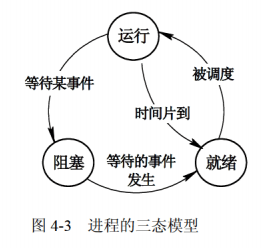
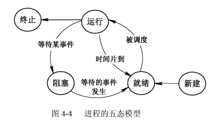
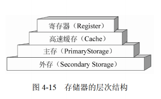
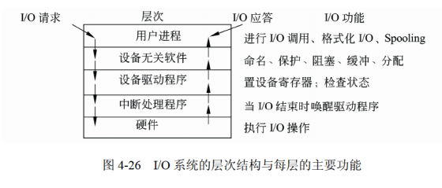

[toc]

# 软件设计师笔记04_操作系统知识

## 第四章 操作系统知识

### 操作系统的基本概念

> 操作系统的定义

操作系统定义：能有效地组织和管理系统中的各种软硬件资源；合理地组织计算机系统工作流程，控制程序的执行，并且向用户提供一个良好的工作环境和友好的接口。

> 操作系统的作用

1. 通过资源管理提高计算机系统的效率
2. 改善人机界面向用户提供友好的工作环境

> 操作系统的特征

操作系统的4个特征是并发性、共享性、虚拟性和不确定性。

> 操作系统的功能

操作系统的功能可分为进程管理、存储管理、文件管理、设备管理、作业管理。

> 操作系统的分类

1. 批处理操作系统
2. 分时操作系统（轮流使用CPU工作片）
3. 实时操作系统（快速响应）
4. 网络操作系统
5. 分布式操作系统（物理分散的计算机互联系统）
6. 微机操作系统（Windows）
7. 嵌入式操作系统

> 计算机的启动流程

计算机启动的基本流程为：BIOS——>主引导记录——>操作系统

### 进程管理

进程是资源分配和独立运行的基本单位。

> 进程的组成

进程通常由程序，数据，进程控制块（PCB）组成。
- 进程控制块PCB（进程的唯一标志）
- 程序（描述进程要做什么）
- 数据（存放进程执行时所需数据）

#### 进程的状态

> 进程的基础状态模型-三态图

进程一般有3中基础状态：运行，就绪和阻塞。

- 就绪：一个进程获得了所有资源，一旦得到CPU资源就可以运行。此时的线程处于就绪状态。
- 运行：一个进程得到了CPU资源，在系统上运行时。
- 阻塞：一个进程由于某个原因处于暂时停止运行的状态。

> 进程的复杂状态模型-五态图

实际一个系统中的进程状态转换更为复杂。

- 新建：对应一个进程刚刚被创建时的状态。
- 终止：对应一个进程运行完毕的状态。

#### 进程间的通信

进程通信是指各个进程之间互相交换信息的过程。

> 同步与互斥

- 进程间的同步：是指系统中的一些需要互相合作的进程。这样的互相合作的联系就是进程间的同步。
- 进程间的互斥：是指系统中的多个进程由于资源而互斥执行。

> 信号量

- 互斥信号量：对临界资源采用互斥访问，使用互斥信号量后其他进程无法访问，初值为1
- 同步信号量：对共享资源的访问控制，初值一般是共享资源的数量

#### 死锁

死锁，是指两个以上的进程互相都要求对方已经占有的资源导致进程无法继续运行下去的现象。

> 死锁产生的四个必要条件：

1. 资源互斥
2. 每个进程占有资源并等待其他资源
3. 系统不能剥夺进程资源
4. 进程资源图是一个环路

> 死锁产生后，解决措施是打破四大条件，有下列方法：

1. 死锁预防：采用某种策略限制并发进程对于资源的请求，破坏死锁产生的四个条件之一，使系统任何时刻都不满足死锁的条件。
2. 死锁避免：一般采用银行家算法来避免，银行家算法，就是提前计算出一条不会死锁的资源分配方法，才分配资源，否则不分配资源，相当于借贷，考虑对方还得起才借钱，提前考虑好以后，就可以避免死锁
3. 死锁检测：允许死锁产生，但系统定时运行一个检测死锁的程序，若检测到系统中发生死锁，则设法加以解除。
4. 死锁解除：即死锁发生后的解除方法，如强制剥夺资源，撤销进程等

> 死锁计算问题

若系统内有n个进程，每个进程都需要R个资源，那么其发生死锁的最大资源数为n*(R-1)。其不发生死锁的最小资源数为n*(R-1)+1

#### 线程

线程是独立调度的最小单位。

线程可以共享进程的公共数据、全局变量、代码、文件等资源，但不能共享线程独有的资源，如线程的栈指针等标识数据

### 存储管理

存储器管理的主要功能包括主存空间的分配和回收、提高主存的利用率、扩充主存、对主存信息实现有效保护。

#### 基本概念

> 存储器的结构

常用的存储器结构有“寄存器-主存-外存”结构 或 “寄存器-缓存-主存-外存”结构。如图所示

虚拟地址：又称相对地址、程序地址、逻辑地址等。

地址空间：程序中由相对地址组成的空间称为逻辑地址空间。

存储空间：简而言之，地址空间是逻辑地址的集合，存储空间是物理地址的集合。

#### 分页式存储管理

将进程空间分为一个个页，假设每个页大小为4K，同样的将系统的物理空间也分为一个个4K大小的物理块(页帧号)，这样，每次将需要运行的逻辑页装入物理块中，运行完再装入其他需要运行的页，就可以分批次运行完进程，而无需将整块逻辑空间全部装入物理内存中

- 优点：利用率高、碎片小(只在最后一个页中有)、分配及管理简单
- 缺点：增加了系统开销,可能产生抖动现象

#### 分段式存储管理

将进程空间分为一个个段，每段也有段号和段内地址，与页式存储不同的是，每段物理大小不同，分段是根据逻辑整体分段的。

- 优点：程序逻辑完整，修改互不影响
- 缺点：内存利用率低，内存碎片浪费大

#### 段页式存储管理

对进程空间先分段，后分页。

- 优点：空间浪费小、存储共享容易、能动态连接
- 缺点：由于管理软件的增加，复杂性和开销也增加，执行速度下降

### 设备管理

设备管理是操作系统中最繁杂而且与硬件紧密相关的部分。

设备管理不仅要管理实际 I/O 操作的设备（如键盘、鼠标、打印机等），还要管理诸如设备控制器、DMA 控制器、中断控制器和 I/O 处理机（通道）等支持设备。

> 设备管理的作用

通过设备管理达到提高设备利用率和方便用户的目的。

#### 设备的分类

1. 按数据组织分类。分为块设备和字符设备。块设备是指以数据块为单位来组织和传送数据信息的设备，如磁盘。字符设备是指以单个字符为单位来传送数据信息的设备，如交互式终端、打印机等。

2. 按照设备的功能分类。分为输入设备、输出设备、存储设备、网络联网设备、供电设备等等。
    - 输入设备是将数据、图像、声音送入计算机的设备；输出设备是将加工好的数据显示、印制、再生出来的设备；
    - 存储设备是指能进行数据或信息保存的设备；
    - 网络联网设备是指网络互连设备以及直接连接上网的设备；
    - 供电设备是指向计算机提供电力能源、电池后备的部件与设备，如开关电源、联机 UPS 等。

3. 从资源分配角度分类。分为独占设备、共享设备和虚拟设备。
    - 独占设备是指在一段时间内只允许一个用户（进程）访问的设备，大多数低速的 I/O 设备（如用户终端、打印机等）属于这类设备。
    - 共享设备是指在一段时间内允许多个进程同时访问的设备。显然，共享设备必须是可寻址的和可随机访问的设备。典型的共享设备是磁盘
    - 虚拟设备是指通过虚拟技术将一台独占设备变换为若干台供多个用户（进程）共享的逻辑设备。一般可以利用假脱机技术（Spooling 技术）实现虚拟设备。

4. 按数据传输率分类，分为低速设备、中速设备和高速设备。
    - 低速设备是指传输速率为每秒钟几个字节到数百个字节的设备，典型的设备有键盘、鼠标、语音的输入等。
    - 中速设备是指传输速率在每秒钟数千个字节到数十千个字节的设备，典型的设备有行式打印机、激光打印机等。
    - 高速设备是指传输速率在每秒数百千个字节到数兆字节的设备，典型的设备有磁带机、磁盘机和光盘机等。

#### I/O 软件

I/O 设备管理软件一般分为 4 层：中断处理程序、设备驱动程序、与设备无关的系统软件和用户级软件。

如图所示

### 文件管理

#### 文件和文件系统

> 文件

文件（File）是具有符号名的、在逻辑上具有完整意义的一组相关信息项的集合。例如，一个源程序、一个目标程序、编译程序、一批待加工的数据和各种文档等都可以各自组成一个文件。

一个文件包括文件体和文件说明。文件体是文件正文的内容。文件说明是操作系统为了管理文件所用到的信息，包括文件名、文件内部标识、文件的类型、文件存储地址、文件的长度、访问权限、建立时间和访问时间等。

文件也是一种抽象机制，它隐藏了硬件和实现细节，提供了将信息保存在磁盘上而且便于以后读取的手段，使用户不必了解信息存储的方法、位置以及存储设备实际操作方式便可存取信息。

> 文件类型

- 按文件性质和用途可将文件分为系统文件、库文件和用户文件。
- 按信息保存期限分类可将文件分为临时文件、档案文件和永久文件。
- 按文件的保护方式分类可将文件分为只读文件、读 / 写文件、可执行文件和不保护文件。

例如 UNIX 系统将文件分为普通文件、目录文件和设备文件（特殊文件）。

> 文件系统

文件管理系统，就是操作系统中实现文件统一管理的一组软件和相关数据的集合，专门负责管理和存取文件信息的软件机构，简称文件系统。

文件系统的功能包括
1. 按名存取，即用户可以 “按名存取”，而不是 “按地址存取”；
2. 统一的用户接口，在不同设备上提供同样的接口，方便用户操作和编程；
3. 并发访问和控制，在多道程序系统中支持对文件的并发访问和控制；
4. 安全性控制，在多用户系统中的不同用户对同一文件可有不同的访问权限；
5. 优化性能，采用相关技术提高系统对文件的存储效率、检索和读 / 写性能；
6. 差错恢复，能够验证文件的正确性，并具有一定的差错恢复能力。

目前常用的文件系统类型有 FAT、Vfat、NTFS、Ext2 和 HPFS 等。

#### 文件的结构和组织

文件的结构是指文件的组织形式。
- 从用户角度看到的文件组织形式称为文件的逻辑结构。
- 文件在文件存储器上的存放方式称为文件的物理结构。

#### 文件目录

文件目录是由文件控制块组成的，用于文件的检索。

#### 文件的存取方法

文件的存取方法是指读 / 写文件存储器上的一个物理块的方法。通常有顺序存取和随机存取两种方法。
- 顺序存取方法是指对文件中的信息按顺序依次进行读 / 写；
- 随机存取方法是指对文件中的信息可以按任意的次序随机地读 / 写。

#### 文件系统的可靠性

文件系统的可靠性是指系统抵抗和预防各种物理性破坏和人为性破坏的能力。

1. 转储和恢复。在文件系统中无论是硬件或软件都会发生损坏和错误，例如自然界的闪电、电压的突变、火灾和水灾等均可能引起软 / 硬件的破坏。为了使文件系统万无一失，应当采用相应的措施，最简单和常用的措施是通过转储操作形成文件或文件系统的多个副本。这样，一旦系统出现故障，利用转储的数据使得系统恢复成为可能。常用的转储方法有静态转储和动态转储、海量转储和增量转储。
2. 日志文件。在计算机系统的工作过程中，操作系统把用户对文件的插入、删除和修改操作写入日志文件。一旦发生故障，操作系统恢复子系统利用日志文件来进行系统故障恢复，并可协助后备副本进行介质故障恢复。
3. 文件系统的一致性。影响文件系统可靠性的因素之一是文件系统的一致性问题。很多文件系统是先读取磁盘块到主存，在主存进行修改，修改完毕再写回磁盘。但如果读取某磁盘块，修改后再将信息写回磁盘前系统崩溃，则文件系统就可能会出现不一致性状态。如果这些未被写回的磁盘块是索引结点块、目录块或空闲块，那么后果是不堪设想的。通常，解决方案是采用文件系统的一致性检查，一致性检查包括块的一致性检查和文件的一致性检查。
