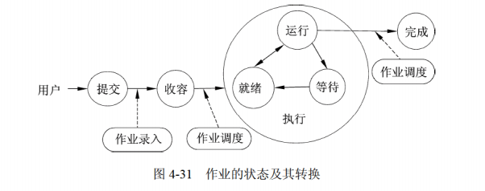

[toc]

# 软件设计师笔记04_操作系统知识

## 第四章 操作系统知识

### 操作系统的基本概念

> 操作系统的定义

操作系统定义：能有效地组织和管理系统中的各种软 / 硬件资源；合理地组织计算机系统工作流程，控制程序的执行，并且向用户提供一个良好的工作环境和友好的接口。

> 操作系统的定义

1. 通过资源管理提高计算机系统的效率
2. 改善人机界面向用户提供友好的工作环境

> 操作系统的特征

操作系统的4个特征是并发性、共享性、虚拟性和不确定性。

> 操作系统的功能

操作系统的功能可分为进程管理、文件管理、存储管理、设备管理和作业管理 5 大部分。

> 操作系统的分类

1. 批处理操作系统
2. 分时操作系统（轮流使用CPU工作片）
3. 实时操作系统（快速响应）
4. 网络操作系统
5. 分布式操作系统（物理分散的计算机互联系统）
6. 微机操作系统（Windows）
7. 嵌入式操作系统

> 计算机的启动流程

计算机启动的基本流程为：BIOS——>主引导记录——>操作系统

### 进程管理

进程是资源分配和独立运行的基本单位。

> 进程的组成

1. 进程控制块PCB（进程的唯一标志）
2. 程序（描述进程要做什么）
3. 数据（存放进程执行时所需数据）

#### 进程间的通信

同步与互斥、信号量、PV 操作。

#### 进程的状态

三态模型和五态模型

#### 进程调度

1. 三级调度。
2. 调度算法：先来先服务、时间片轮转（固定、可变）、优先级调度、多级反馈调度。
3. 进程优先级确定

#### 进行间的通信

#### 死锁

死锁，是指两个以上的进程互相都要求对方已经占有的资源导致无法继续运行下去的现象。

死锁的必要条件：互斥、请求保持、不可剥夺、环路。

死锁的处理方式：预防、避免（银行家算法）、检测、解除。

### 存储管理

存储器管理的主要功能包括主存空间的分配和回收、提高主存的利用率、扩充主存、对主存信息实现有效保护。

#### 基本概念

> 存储器的结构

常用的存储器结构有“寄存器-主存-外存”结构 或 “寄存器-缓存-主存-外存”结构。如图所示

虚拟地址：又称相对地址、程序地址、逻辑地址等。

地址空间：程序中由相对地址组成的空间称为逻辑地址空间。

存储空间：简而言之，地址空间是逻辑地址的集合，存储空间是物理地址的集合。

#### 存储管理方案

（1）固定分区。
（2）可变分区：最佳适应、最差适应、首次适应、循环首次适应

### 设备管理

设备管理是操作系统中最繁杂而且与硬件紧密相关的部分。

设备管理不仅要管理实际 I/O 操作的设备（如键盘、鼠标、打印机等），还要管理诸如设备控制器、DMA 控制器、中断控制器和 I/O 处理机（通道）等支持设备。

设备管理包括各种设备分配、缓冲区管理和实际物理 I/O 设备操作，通过管理达到提高设备利用率和方便用户的目的。

#### 设备的分类

1. 按数据组织分类。分为块设备和字符设备。块设备是指以数据块为单位来组织和传送数据信息的设备，如磁盘。字符设备是指以单个字符为单位来传送数据信息的设备，如交互式终端、打印机等。

2. 按照设备的功能分类。分为输入设备、输出设备、存储设备、网络联网设备、供电设备等等。
    - 输入设备是将数据、图像、声音送入计算机的设备；输出设备是将加工好的数据显示、印制、再生出来的设备；
    - 存储设备是指能进行数据或信息保存的设备；
    - 网络联网设备是指网络互连设备以及直接连接上网的设备；
    - 供电设备是指向计算机提供电力能源、电池后备的部件与设备，如开关电源、联机 UPS 等。

3. 从资源分配角度分类。分为独占设备、共享设备和虚拟设备。
    - 独占设备是指在一段时间内只允许一个用户（进程）访问的设备，大多数低速的 I/O 设备（如用户终端、打印机等）属于这类设备。
    - 共享设备是指在一段时间内允许多个进程同时访问的设备。显然，共享设备必须是可寻址的和可随机访问的设备。典型的共享设备是磁盘
    - 虚拟设备是指通过虚拟技术将一台独占设备变换为若干台供多个用户（进程）共享的逻辑设备。一般可以利用假脱机技术（Spooling 技术）实现虚拟设备。

4. 按数据传输率分类，分为低速设备、中速设备和高速设备。
    - 低速设备是指传输速率为每秒钟几个字节到数百个字节的设备，典型的设备有键盘、鼠标、语音的输入等。
    - 中速设备是指传输速率在每秒钟数千个字节到数十千个字节的设备，典型的设备有行式打印机、激光打印机等。
    - 高速设备是指传输速率在每秒数百千个字节到数兆字节的设备，典型的设备有磁带机、磁盘机和光盘机等。

#### 设备管理的目标和任务

设备管理的目标主要是如何提高设备的利用率，为用户提供方便、统一的界面。

设备管理的任务是保证在多道程序环境下，当多个进程竞争使用设备时，按一定的策略分配和管理各种设备，控制设备的各种操作，完成 I/O 设备与主存之间的数据交换。

设备管理的主要功能是动态地掌握并记录设备的状态、设备分配和释放、缓冲区管理、实现物理 I/O 设备的操作、提供设备使用的用户接口及设备的访问和控制。

#### I/O 软件

I/O 设备管理软件一般分为 4 层：中断处理程序、设备驱动程序、与设备无关的系统软件和用户级软件。

如图所示

### 文件管理

#### 文件和文件系统

> 文件

文件（File）是具有符号名的、在逻辑上具有完整意义的一组相关信息项的集合。例如，一个源程序、一个目标程序、编译程序、一批待加工的数据和各种文档等都可以各自组成一个文件。

一个文件包括文件体和文件说明。文件体是文件正文的内容。文件说明是操作系统为了管理文件所用到的信息，包括文件名、文件内部标识、文件的类型、文件存储地址、文件的长度、访问权限、建立时间和访问时间等。

文件也是一种抽象机制，它隐藏了硬件和实现细节，提供了将信息保存在磁盘上而且便于以后读取的手段，使用户不必了解信息存储的方法、位置以及存储设备实际操作方式便可存取信息。

> 文件类型

- 按文件性质和用途可将文件分为系统文件、库文件和用户文件。
- 按信息保存期限分类可将文件分为临时文件、档案文件和永久文件。
- 按文件的保护方式分类可将文件分为只读文件、读 / 写文件、可执行文件和不保护文件。

例如 UNIX 系统将文件分为普通文件、目录文件和设备文件（特殊文件）。

> 文件系统

文件管理系统，就是操作系统中实现文件统一管理的一组软件和相关数据的集合，专门负责管理和存取文件信息的软件机构，简称文件系统。

文件系统的功能包括
1. 按名存取，即用户可以 “按名存取”，而不是 “按地址存取”；
2. 统一的用户接口，在不同设备上提供同样的接口，方便用户操作和编程；
3. 并发访问和控制，在多道程序系统中支持对文件的并发访问和控制；
4. 安全性控制，在多用户系统中的不同用户对同一文件可有不同的访问权限；
5. 优化性能，采用相关技术提高系统对文件的存储效率、检索和读 / 写性能；
6. 差错恢复，能够验证文件的正确性，并具有一定的差错恢复能力。

目前常用的文件系统类型有 FAT、Vfat、NTFS、Ext2 和 HPFS 等。

#### 文件的结构和组织

文件的结构是指文件的组织形式。
- 从用户角度看到的文件组织形式称为文件的逻辑结构。
- 文件在文件存储器上的存放方式称为文件的物理结构。

#### 文件目录

文件目录是由文件控制块组成的，用于文件的检索。

#### 文件的存取方法

文件的存取方法是指读 / 写文件存储器上的一个物理块的方法。通常有顺序存取和随机存取两种方法。
- 顺序存取方法是指对文件中的信息按顺序依次进行读 / 写；
- 随机存取方法是指对文件中的信息可以按任意的次序随机地读 / 写。

#### 文件系统的可靠性

文件系统的可靠性是指系统抵抗和预防各种物理性破坏和人为性破坏的能力。

1. 转储和恢复。在文件系统中无论是硬件或软件都会发生损坏和错误，例如自然界的闪电、电压的突变、火灾和水灾等均可能引起软 / 硬件的破坏。为了使文件系统万无一失，应当采用相应的措施，最简单和常用的措施是通过转储操作形成文件或文件系统的多个副本。这样，一旦系统出现故障，利用转储的数据使得系统恢复成为可能。常用的转储方法有静态转储和动态转储、海量转储和增量转储。
2. 日志文件。在计算机系统的工作过程中，操作系统把用户对文件的插入、删除和修改操作写入日志文件。一旦发生故障，操作系统恢复子系统利用日志文件来进行系统故障恢复，并可协助后备副本进行介质故障恢复。
3. 文件系统的一致性。影响文件系统可靠性的因素之一是文件系统的一致性问题。很多文件系统是先读取磁盘块到主存，在主存进行修改，修改完毕再写回磁盘。但如果读取某磁盘块，修改后再将信息写回磁盘前系统崩溃，则文件系统就可能会出现不一致性状态。如果这些未被写回的磁盘块是索引结点块、目录块或空闲块，那么后果是不堪设想的。通常，解决方案是采用文件系统的一致性检查，一致性检查包括块的一致性检查和文件的一致性检查。

### 作业管理

作业是系统为完成一个用户的计算任务（或一次事务处理）所做的工作总和。

例如，对用户编写的源程序，需要经过编译、连接、装入以及执行等步骤得到结果，这其中的每一个步骤称为作业步。在操作系统中用来控制作业进入、执行和撤销的一组程序称为作业管理程序。操作系统可以进一步为每个作业创建作业步进程，完成用户的工作。

#### 作业与作业控制

> 作业状态及转换

作业状态分为 4 种：提交、后备、执行和完成。
1. 提交。作业提交给计算机中心，通过输入设备送入计算机系统的过程状态称为提交状态。
2. 后备。通过 Spooling 系统将作业输入到计算机系统的后备存储器（磁盘）中，随时等待作业调度程序调度时的状态。
3. 执行。一旦作业被作业调度程序选中，为其分配了必要的资源，并为其建立相应的进程后，该作业便进入了执行状态。
4. 完成。当作业正常结束或异常终止时，作业进入完成状态。此时，由作业调度程序对该作业进行善后处理。如撤销作业的作业控制块，收回作业所占的系统资源，将作业的执行结果形成输出文件放到输出井中，由 Spooling 系统控制输出。

如图所示

> 作业调度

> 用户界面

用户界面（User Interface）是计算机中实现用户与计算机通信的软 / 硬件部分的总称。

用户界面也称用户接口，或人机界面。用户界面的硬件部分包括用户向计算机输入数据或命令的输入装置，以及由计算机输出供用户观察或处理的输出装置。

用户界面的软件部分包括用户与计算机相互通信的协议、约定、操纵命令及其处理软件。目前，常用的输入 / 输出装置有键盘、鼠标、显示器和打印机等。常用的人机通信方法有命令语言、选项、表格填充及直接操纵等。

从计算机用户界面的发展过程来看，用户界面可分为如下阶段。
1. 控制面板式用户界面。这是计算机发展早期，用户通过控制台开关、板键或穿孔纸带向计算机送入命令或数据，而计算机通过指示灯及打印机输出运行情况或结果。这种界面的特点是人去适应现在看来十分笨拙的计算机。
2. 字符用户界面。字符用户界面是基于字符型的，用户通过键盘或其他输入设备输入字符，由显示器或打印机输出字符。字符用户界面的优点是功能强、灵活性好、屏幕开销少；缺点是操作步骤繁琐，学会操作也较费时。
3. 图形用户界面。随着文字、图形、声音和图像等多媒体技术的出现，各种图形用户界面应运而生，用户既可使用传统的字符，也可使用图形、图像和声音同计算机进行交互，操作将更加自然、更加方便。现代界面的关键技术是超文本。超文本的 “超” 体现在它不仅包括文本，还包括图像、音频和视频等多媒体信息，即将文本的概念扩充到超文本，超文本的最大特点是具有指向性。
4. 新一代用户界面。虚拟现实技术将用户界面的发展推向一个新阶段：人将作为参与者，以自然的方式与计算机生成的虚拟环境进行通信。以用户为中心、自然、高效、高带宽、非精确、无地点限制等是新一代用户界面的特征。多媒体、多通道及智能化是新一代用户界面的技术支持。语音、自然语言、手势、头部跟踪、表情和视线跟踪等新的、更加自然的交互技术将为用户提供更方便的输入技术。计算机将通过多种感知通道来理解用户的意图，实现用户的要求。计算机不仅以二维屏幕向用户输出，而且以真实感（立体视觉、听觉、嗅觉和触觉等）的计算机仿真环境向用户提供真实的体验。