[toc]

# 软件设计师笔记05_软件工程基础

## 第五章 软件工程知识

### 软件工程概述

软件工程指的是应用计算机科学、数学及管理科学等原理，以工程化的原则和方法来解决软件问题的工程，目的是提高软件生产率、提高软件质量、降低软件成本。

#### 计算机软件

计算机软件指的是计算机系统中的程序及其文档。程序是计算任务的处理对象和处理规则的描述。任何以计算机为处理工具的任务都是计算任务。

按照软件的应用领域，将计算机软件分为以下十类，包括：①系统软件；②应用软件；③工程/科学软件；④嵌入式软件；⑤产品线软件；⑥Web 应用软件（Web APP）；⑦人工智能软件；⑧开放计算；⑨网络资源；⑩开源软件

#### 软件工程基本原理

软件工程的七条基本原理
- ① 分阶段的生命周期计划严格管理；
- ② 坚持进行阶段评审；
- ③ 实现严格的产品控制；
- ④ 采用现代的程序设计技术；
- ⑤ 结果应能清楚地审查；
- ⑥ 开发小组的人员应少而精；
- ⑦ 承认不断改进软件工程实践的必要性

#### 软件工程的基本要素

软件工程的基本要素：方法、工具、过程。

#### 软件生存周期

软件生存周期包括以下七个方面：
1. 可行性分析与项目开发计划。这个阶段主要确定软件的开发目标及其可行性。参与该阶段的人员有用户、项目负责人、系统分析师。产生的文档有可行性分析报告、项目开发计划。
2. 需求分析。该阶段的任务不是具体的解决问题，而是要确定软件系统要做什么，确定软件系统的功能、性能、数据和界面等要求，从而确定系统的逻辑模型。参与该阶段的人员有用户、项目负责人、系统分析师。产生的文档主要是软件需求说明书。
3. 概要设计。该阶段开发人员把确定的各项功能需求转换成需要的体系结构。概要设计就是设计软件的结构，明确软件由哪些模块组成，这些模块层次结构是怎样的，调用关系是怎样的，每个模块的功能是什么。参与该阶段的人员有系统分析师、软件设计师。产生的文档主要是概要设计说明书。
4. 详细设计。该阶段的主要任务是对每个模块的功能进一步详细、具体的描述。参与该阶段的人员有软件设计师、程序员。产生的文档主要是详细设计文档。
5. 编码。把每个模块的控制结构转换成计算机可接受的程序代码，即写成某种特定程序设计语言表示的源程序清单。
6. 测试。测试是保证软件质量的重要手段。参加测试的人员通常是另一部门（或单位）的软件设计师或系统分析师。产生的文档主要是软件测试计划、测试用例、测试报告。
7. 维护。软件维护是软件生存周期中时间最长的阶段。软件已交付且正式投入使用后，便进入维护阶段。对软件进行修改的原因包括：①运行中发现隐含的错误而需要修改；②为了适应变化的（或变化后的）工作环境而修改；③需要对软件功能进行扩充、增强而进行的修改；④为将来软件维护活动做预先准备。

#### 软件过程

软件开发中遵循一系列可预测的步骤（即路线图），该路线图称为软件过程。

软件过程是软件活动的集合，软件活动是软件任务的集合。

软件过程有三层含义：
1. 个体含义：指某产品、系统在生存周期中的某一类活动的集合，如开发过程、管理过程等。
2. 整体含义：指软件产品、系统在所有上述含义下的软件过程的总体。
3. 工程含义：指解决软件过程的工程。

> 能力成熟度模型（CMM）

CMM 是对软件组织进化阶段的描述，随着软件组织定义、实施、测量、控制和改进其软件过程，软件组织的能力经过这些阶段逐步提高。CMM 将软件过程的改进分为五个成熟度级别。如图所示

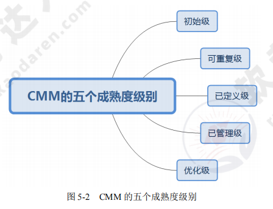

> 能力成熟度模型集成（CMMI）

CMMI 提供了两种表示方法：阶段式模型和连续式模型。

1. 阶段式模型。结构类似于 CMM，它关注组织的成熟度。CMMI-SE/SW/IPPD 1.1 版本中有五个成熟度等级。
2. 连续式模型。关注每个过程域的能力，一个组织对不同的过程域可以达到不同的过程域能力等级（简称 CL）。CMMI 中包括六个过程域能力等级。如图所示

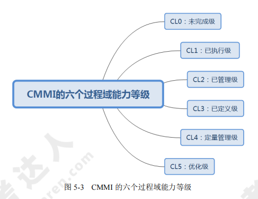

> 统一过程

统一过程定义了四个技术阶段及其产品：
（1）起始阶段：专注于项目初创活动。
（2）精化阶段：在理解了最初领域范围之后，需要进行需求分析和架构演进。
（3）构建阶段：关注系统的构建，产生实现模型。
（4）移交阶段：关注软件提交方面的工作，产生软件增量。随着阶段进展，每个核心工作流的工作量发生变化，四个技术阶段由主要里程碑所终止。

### 软件过程模型

软件过程模型习惯上称为软件开发模型，它是软件开发全部过程、活动和任务的结构框架。典型的软件过程有瀑布模型、增量模型、演化模型（原型模型、螺旋模型）、喷泉模型、基于构件的开发模型和形式化方法模型等。

#### 瀑布模型

瀑布模型将软件生命周期中的各个活动规定为依据线性顺序连接的若干阶段的模型，包括需求分析、设计、编码、测试、运行与维护。如同瀑布流水逐级下落。如图所示

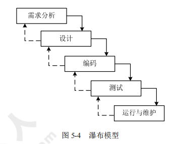

- 瀑布模型的优点：容易理解、成本低、强调开发的阶段性早期计划及需求调查和产品测试
- 瀑布模型的缺点：客户必须要准确地表达他们的需要；在开始的两个或三个阶段中，很难评估真正的进度状态；项目快结束时，出现大量的集成与测试工作；项目结束之前，不能演示系统的能力；在瀑布模型中，需求或设计的错误往往只有到了项目后期才能被发现，对项目风险的控制能力较弱，导致项目通常会延期，开发费用超出预算。

瀑布模型的一个变体是 V 模型，如图所示。

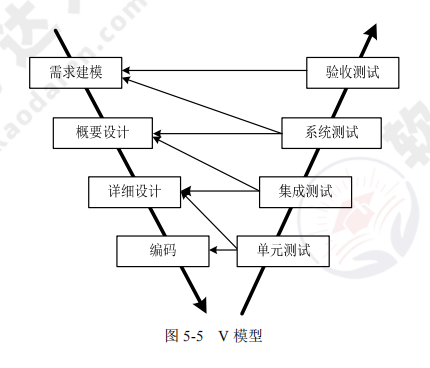

#### 增量模型

增量模型融合了瀑布模型的基本成分和原型实现的迭代特征。如图所示。

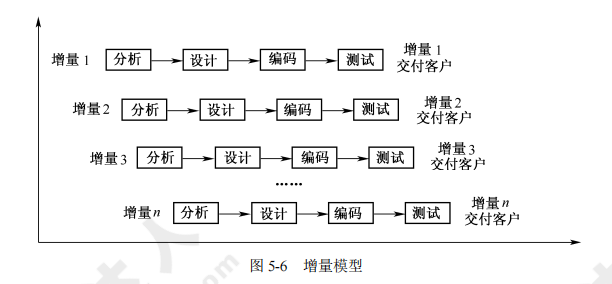

- 增量模型的优点：可交付的第一个版本所需要的成本和时间很少，开发由增量表示的小系统所承担的风险不大，由于很快发布了第一个版本，因此可减少用户需求的变更。同时，它也具有瀑布模型所有的优点。

- 增量模型的缺点：若没有对用户的变更要求进行规划，那么产生的初始增量可能会造成后来增量的不稳定；若需求不像早期思考的那样稳定和完整，那么一些增量就可能需要重新开发或重新发布；管理发生的成本、进度和配置的复杂性可能会超出组织的能力。

#### 演化模型

典型的演化模型有原型模型和螺旋模型两种。

> 原型模型

原型模型开始于沟通，目的是定义软件的总体目标、标识需求，然后快速制定原型开发计划，确定原型的目标和范围，快速构建原型并交付用户使用，收集客户反馈意见，并在下一轮中对原型进行改进。在前一个原型需要改进（或扩展其范围）的时候，进入下一轮原型的迭代开发。原型模型如图所示。

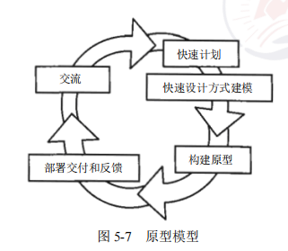

> 螺旋模型

对于一个复杂的大项目，开发一个原型往往达不到要求。螺旋模型将瀑布模型和演化模型结合起来，加入两种模型均忽略的风险分析，弥补了这两种模型的不足。螺旋模型如图所示。

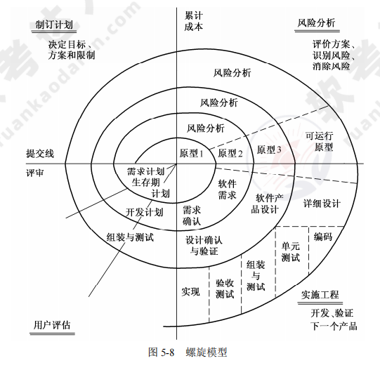

螺旋模型中的每个螺旋周期分为以下四个步骤：
1. 制订计划：确定软件目标，选定实施方案，明确项目开发的限制条件。
2. 风险分析：对所选方案进行分析，识别风险，消除风险。
3. 实施工程：实施软件开发，验证阶段性产品。
4. 用户评估：评价开发工作，提出修正建议，建立下一个周期的开发计划。

螺旋模型强调风险分析，使用户、开发人员对演化层出现的风险有所了解，从而作出反映。因此，螺旋模型适合用于庞大、复杂、高风险的系统。

#### 喷泉模型

喷泉模型是以用户需求为动力、以对象为驱动的模型。适用于面向对象的开发方法，克服了瀑布模型不支持软件重用和多项开发活动集成的局限性。喷泉模型使开发过程具有迭代性和无间隙性。喷泉模型如图所示。

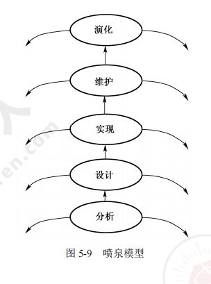

#### 基于构件的开发模型

基于构件的开发模型是指利用预先包装的构件来构造应用系统。构件可以是组织内部开发的构件，也可以是商品化成品（COTS）软件构件。一种基于构件的开发模型包括领域工程和应用系统工程。
（1）领域工程的目的是构建领域模型、领域基准体系结构和可复用构件库。
（2）应用系统工程的目的是使用可复用构件组装应用系统。

基于构件的开发模型如图所示

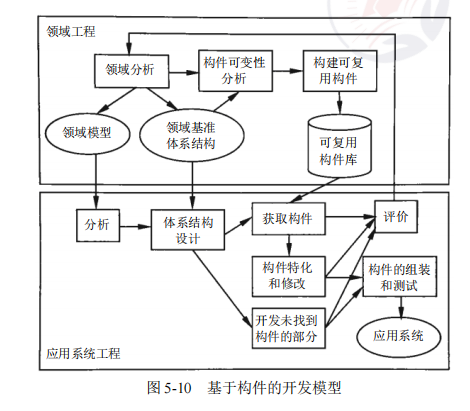

#### 形式化方法模型

形式化方法是建立在严格数学基础上的一种软件开发方法，主要活动是生成计算机软件形式化的数学规格说明。

#### 统一过程模型

统一过程（UP）模型是一种“用例和风险驱动，以架构为中心，迭代并增量”的开发过程，由 UML 方法和工具支持。

统一过程定义了四个技术阶段及其主要工作产品：
（1）起始阶段：专注项目的初创活动，主要工作产品有构想文档、初始用例模型、初始项目术语表、初始业务用例、初始风险评估、项目计划、业务模型及多个原型（需要时）。
（2）精化阶段：在理解了最初的领域范围之后进行需求分析和架构演进，主要工作产品有用例模型、补充需求、分析模型、整体体系结构描述、可执行的软件体系结构原型、初步设计模型、修订的风险列表、项目计划及初始用户手册。
（3）构建阶段：关注系统的构建，产生实现模型，主要工作产品有设计模型、软件构件、集成软件增量、测试计划及步骤、测试用例及支持文档（用户手册、安装手册等）。
（4）移交阶段：关注软件提交方面的工作，产生软件增量，主要工作产品有提交的软件增量、β 测试报告和综合用户反馈。

### 软件项目需求分析

需求分析也称为软件需求分析、系统需求分析或需求分析工程等，是开发人员经过深入细致的调研和分析，准确理解用户和项目的功能、性能、可靠性等具体要求，将用户非形式的需求表述转化为完整的需求定义，从而确定系统必须做什么的过程。

#### 软件需求

软件需求包括以下内容：
（1）功能需求：考虑系统要做什么、什么时候做、如何修改或升级。
（2）性能需求：考虑软件开发的技术性指标，如存储容量限制、执行速度、响应时间、吞吐量等。
（3）用户或人的因素：考虑用户的类型。
（4）环境需求：考虑软件应用的环境。
（5）界面需求：考虑来自其他系统的输入或到其他系统的输出等。
（6）文档需求：考虑需要哪些文档、文档针对哪些读者。
（7）数据需求：考虑输入、输出格式，接收、发送数据的频率，数据的精准度、数据流量、数据保持时间。
（8）资源使用需求：考虑软件运行时所需要的资源。
（9）安全保密需求：考虑是否需要对访问系统或系统信息加以控制。
（10）可靠性需求：考虑系统的可靠性需求、系统是否必须检测和隔离错误、出错后重启系统所允许的时间等。
（11）软件成本消耗或开发进度需求：考虑开发是否有规定的时间表
（12）其他非功能性需求：如采用某种开发模式、确定质量控制标准、里程碑和评审、验收标准等。

#### 需求分析原则

需求分析过程有不同的分析方法，它们要遵循的操作原则有：
- ①必须能表示和理解问题的信息域；
- ②必须能定义软件将完成的任务；
- ③必须能表示软件的行为；
- ④必须划分描述数据、功能和行为的模型；
- ⑤分析过程应该从要素信息移向细节信息

#### 需求工程

需求工程是一个不断反复的需求定义、文档记录、需求演进的过程，并最终在验证的基础上冻结需求。

需求工程可以细分为六个阶段：①需求获取；②需求分析与协商；③系统建模；④需求规约；⑤需求验证；⑥需求管理

### 软件项目系统设计

系统设计的主要内容包括新系统总体结构设计、代码设计、输出设计、输入设计、处理过程设计、数据存储设计、用户界面设计和安全控制设计等。

常用的设计方法有：面向数据流的结构化设计方法（SD）、面向对象的分析方法（OOD）。

系统设计包括两个基本的步骤：概要设计、详细设计。

#### 概要设计

概要设计主要包括：①软件系统总体结构设计；②数据结构及数据库设计；③编写概要设计文档（概要设计说明书、数据库设计说明书、用户手册及修订测试计划）；④评审。

#### 详细设计

详细设计主要包括：①对每个模块进行详细设计；②对模块内部的数据结构进行设计；③对数据库进行物理设计，即确定数据库的物理结构；④其他设计（代码设计、输入/输出设计、用户界面设计）；⑤编写详细设计说明书；⑥评审

### 软件项目系统测试

软件项目系统测试是对整个系统的测试，将硬件、软件、操作人员看作一个整体，检验它是否有不符合系统说明书的地方。这种测试可以发现系统分析和设计中的错误。

#### 系统测试与调试

信息系统测试包括软件测试、硬件测试、网络测试。测试的目的是以最少的人力和时间发现潜在的各种错误和缺陷。

> 测试应遵循的基本原则

①应尽早并不断地进行测试；②测试工作应避免原先开发软件的人员或小组参与；③设计测试方案时要确定输入数据，还要根据系统功能确定预期的输出结果；④设计测试用例时要设计合理、有效的输入条件，还要包含不合理、失效的输入条件。人们在测试时通常忽略了对异常、不合理、意想不到的情况进行测试，这可能就是隐患；⑤在测试时要检查程序是否做了该做、不该做的事，多余的工作会影响程序的效率；⑥严格按照测试计划进行测试；⑦妥善保存测试计划、测试用例；⑧要精心设计测试用例。

测试的过程包括：①制定测试计划；②编制测试大纲；③根据测试大纲设计和生产测试用例；④事实测试；⑤生成测试报告

#### 传统软件的测试策略

> 单元测试

单元测试也称模块测试，在模块编写完成且编译无误后进行，侧重于模块中的内部处理逻辑和数据结构。单元测试环境如图所示。

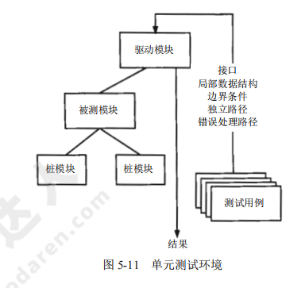

> 集成测试

集成测试通常有以下两种方法：
（1）非增量集成：分别测试各个模块，再将这些模块组合起来进行整理测试。
（2）增量集成：以小增量的方式逐步进行构造和测试。

常用的增量集成策略包括：自顶向下集成测试、自底向上集成测试、回归测试、冒烟测试等

> 确认测试

确认测试始于集成测试的结束，那时已测试完单个构件，软件已经组装成完整的软件包，而且接口错误已被发现和改正。

确认过程的一个重要成分是配置评审，主要检查软件、文档、数据是否齐全、分类有序。

> 系统测试

系统测试是将已经确认的软件、硬件、外设、网络等其他因素结合在一起，进行各种集成测试和确认测试，主要包括恢复测试、安全性测试、压力测试、性能测试、部署测试。

#### 测试方法

软件测试分为静态测试和动态测试。
1. 静态测试：被测程序不在机器上运行，采用人工检测和计算机辅助静态分析的手段对程序进行测试，包括人工检测、计算机辅助静态分析。
2. 动态测试：通过运行程序发现错误，一般采用黑盒测试和白盒测试。
    - 黑盒测试：也称功能测试，在不考虑软件内部结构和特性的情况下，测试软件的外部特性。
    - 白盒测试：也称结构测试，根据程序的内部结构和逻辑来设计测试用例，对程序的路径和过程进行测试，检查是否满足设计的需要。

#### 调试

目前常用的调试方法有以下五种：
（1）试探法：调试人员分析错误的症状，猜测问题所在的位置，一步步试探和分析问题所在。该方法效率低，适用于结构比较简单的程序。
（2）回溯法：调试人员从发现错误症状的位置开始，人工沿着程序的控制流程往回追踪代码，直到找出问题根源为止。该方法适用于小型程序。
（3）对分查找法：该方法主要用来缩小错误范围，直到把故障范围缩小到比较容易诊断为止。
（4）归纳法：从测试所暴露的问题出发，收集所有正确、不正确的数据，并分析它们之间的关系，提出假想的错误原因，用这些数据证明或反驳，从而查出错误所在。
（5）演绎法：根据测试结果，列出可能的错误原因，分析已有的数据，排除不可能和彼此矛盾的原因。若有多个错误同时存在，就要重新分析，提出新的假设，直到发现错误为止。

### 软件项目管理

#### 项目管理涉及的范围

有效的软件项目管理集中在以下四点：人员（person）、产品（product）、过程（procedure）项目（project）。

（1）人员：参与项目的人员类型有项目管理人员、高级管理人员、开发人员、客户、最终用户。
（2）产品：开展项目计划之前，应先进行项目定义，即定义项目范围，其中包括建立产品的目的和范围、可选的解决方案、技术、管理约束等。
（3）过程：对于软件项目来说，强调的是对其进行过程控制，通常将项目分解为任务、子任务等。
（4）项目：常识的软件项目办法有明确目标及过程、保持动力、跟踪进展、作出明智的决策、进行事后分析。

#### 项目估算

常用的估算方法有三种：基于已经完成的类似项目进行估算、基于分解技术进行估算、基于经验估算模型的估算。

常用的成本估算方法有：自顶向下估算方法、自底向上估算方法、差别估算方法、其他估算方法（如专家估算、类推估算、算式估算）。

#### 进度管理

> 进度管理的基本原则

（1）划分：项目必须要被划分成若干个可以管理的活动和任务。
（2）相互依赖性：划分后的各个活动之间的依赖关系必须是明确的，如有的任务必须按顺序完成，有的任务可以并发进行，有的任务只能在其他活动完成后才能开展，有的任务则可以独立进行。
（3）时间分配：必须为每个任务规定开始和结束时间。
（4）工作量确认：每个项目都有预定的人员参与，项目管理者在任何时间节点中所分配的人员数量不能超过项目团队的总人数。
（5）确定责任：为每个任务指定特定的团队成员进行负责。
（6）明确输出结果：每个任务都要有一个明确的输出结果，如一个可交付的工作产品。
（7）确定里程碑：每个任务或任务组都应该与一个项目里程碑相关联，当一个或多个工作产品经过质量评审并得到认可时，标志着一个里程碑的完成.

> 进度安排

为了监控项目的进度计划和实际的进展情况，也为了表示各项任务之间进度的相互依赖关系，需要采用图示的方法。常用的方法有甘特图（Gantt Chart）和项目计划评审技术图（PERT），分别如图所示。

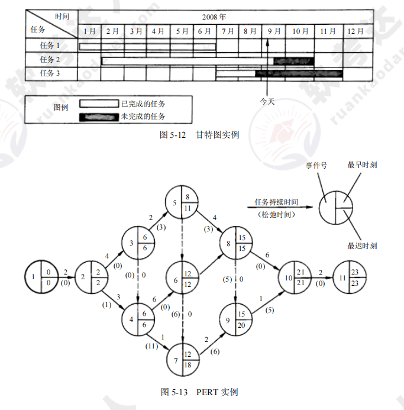

#### 软件项目组织

开发组织采用什么形式，不仅要考虑到项目的特点，还要考虑参与人员的素质。软件项目组织的原则有：①尽早落实责任；②减少交流接口；③责权均衡

组织结构的模式，根据项目的分解和过程的分解，软件项目有以下三种组织形式:
1. 按项目划分的模式。将开发人员组织成项目组，项目组成员共同完成项目的所有任务，如项目的定义、需求分析、设计、编码、测试、评审等，甚至还包括项目的维护。
2. 按职能划分的模式。按软件过程中所反映的各种职能将项目参与者组织成相应的专业组，如开发组、测试组、质量保证组、维护组等。
3. 矩阵模式：该模式是上述两种模式的组合，它既按职能来组织相应的专业组，又按项目来组织项目组。

#### 软件质量管理

在 ISO/IEC 9126 中，软件质量模型由三个层次组成，第一层为质量特性，第二层为质量子特性，第三层为度量指标。

> 软件质量保证

在软件质量方面强调三个要点：①软件必须满足用户规定的需求；②软件应遵循规定标准所定义的一系列开发准则；③软件还应满足某些隐含的需求。

软件质量保证包括七个主要活动相关的各种任务：①应用技术方法；②进行正式的技术评审；③测试软件；④标准的实施；⑤控制变更；⑥度量；⑦记录、保存和报告。

> 软件评审

软件评审的内容包括以下三个方面：
（1）设计质量的评审。包括评审软件的规格说明书是否符合用户的要求；评审可靠性；评审保密措施的实施情况；评审操作特性的实施情况；评审性能；评审软件是否具有可修改性、可扩充性、可互换性和可移植性；评审软件可测试性；评审软件可复用性。
（2）程序质量的评审。从开发者的角度进行评审，与开发技术直接相关，着眼于软件本身的结构与运行环境的接口，以及变更带来的影响。
（3）与运行环境的接口。运行环境包括硬件、其他软件和用户，主要检查项目与硬件的接口、与用户的接口.

> 软件容错技术

提高软件质量和可靠性的技术大致分为两类：避开错误和容错技术。实现容错的主要手段是冗余，常见的冗余技术有：
（1）结构冗余：又分为静态冗余、动态冗余和混合冗余。
（2）信息冗余：为检测或纠正正在运算或传输中的信息错误需外加的一部分信息。
（3）时间冗余：以重复执行指令或程序来消除瞬时错误带来的影响。
（4）冗余附加技术：为实现上述冗余技术所需要的资源和技术，包括程序、指令、数据、存放和调动它们的空间和通道等。

#### 软件配置管理

软件配置管理（SCM）用于整个软件工程，主要目标是识别变更、控制变更、确保变更正确实现、报告有关变更。

#### 软件风险管理

> 软件风险

软件风险包括两个特性：不确定性和损失。不确定性是指风险可能发生也可能不发生；损失是指风险发生后会产生恶性后果。

常见的商业风险有：市场风险、策略风险、销售风险、管理风险、预算风险。

> 风险识别

当识别出已知风险和可预测风险后，项目管理者首先要做的是尽可能回避这些风险，在必要时控制这些风险。风险因素可以定义为：性能风险、成本风险、支持风险、进度风险。

> 风险预测

风险预测又称为风险估计，它试图从两个方面评估一个风险：风险发生的可能性或概率；风险发生后所产生的后果。

> 风险控制

应对风险最好的办法是主动地避免风险，即在风险发生前分析引起风险的原因，然后采取措施避免风险的发生。

### 软件度量

软件度量用于对产品及开发产品的过程进行度量。软件产品、软件过程、资源都具有外部属性和内部属性。

> 面向规模的度量

面向规模的度量主要是通过对质量和生产率的测量进行规范化得到的，而这些量都是根据开发过的软件的规模得到的。面向规模的度量公式如图所示。

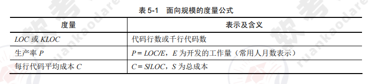
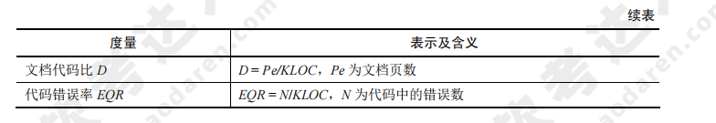

> 面向功能的度量

面向功能的度量以功能测量数据为规范化值。应用最广泛的面向功能的度量是功能点（FP）。功能点是根据软件信息域的特性及复杂性来计算的。

> 软件复杂性度量

软件复杂性度量是指理解和处理软件的难易程度。软件复杂性度量的参数有很多，主要包括：①规模；②难度；③结构；④智能度。

软件复杂性包括程序复杂性和文档复杂性。

> 程序复杂性度量

程序复杂性度量的原则包括：①程序理解的难度；②纠错、维护程序的难度；③向他人解释程序的难度；④根据设计文件编写程序的工作量；⑤执行程序时需要资源的程度。