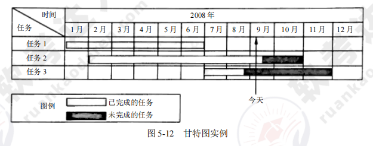

[toc]

# 软件设计师笔记05_软件工程基础

## 第五章 软件工程知识

### 软件工程概述

软件工程指的是应用计算机科学、数学及管理科学等原理，以工程化的原则和方法来解决软件问题的工程，目的是提高软件生产率、提高软件质量、降低软件成本。

#### 计算机软件

计算机软件指的是计算机系统中的程序及其文档。程序是计算任务的处理对象和处理规则的描述。任何以计算机为处理工具的任务都是计算任务。

按照软件的应用领域，将计算机软件分为以下十类，包括：①系统软件；②应用软件；③工程/科学软件；④嵌入式软件；⑤产品线软件；⑥Web 应用软件（Web APP）；⑦人工智能软件；⑧开放计算；⑨网络资源；⑩开源软件

#### 软件工程基本原理

软件工程的七条基本原理
- ① 分阶段的生命周期计划严格管理；
- ② 坚持进行阶段评审；
- ③ 实现严格的产品控制；
- ④ 采用现代的程序设计技术；
- ⑤ 结果应能清楚地审查；
- ⑥ 开发小组的人员应少而精；
- ⑦ 承认不断改进软件工程实践的必要性

#### 软件工程的基本要素

软件工程的基本要素：方法、工具、过程。

#### 软件生存周期

一个软件产品或软件系统要经历孕育、诞生、成长、成熟、衰亡等阶段，一般称为软件生存周期。

软件生存周期包括以下七个方面：
1. 可行性分析与项目开发计划。这个阶段主要确定软件的开发目标及其可行性。参与该阶段的人员有用户、项目负责人、系统分析师。产生的文档有可行性分析报告、项目开发计划。
2. 需求分析。该阶段的任务不是具体的解决问题，而是要确定软件系统要做什么，确定软件系统的功能、性能、数据和界面等要求，从而确定系统的逻辑模型。参与该阶段的人员有用户、项目负责人、系统分析师。产生的文档主要是软件需求说明书。
3. 概要设计。该阶段开发人员把确定的各项功能需求转换成需要的体系结构。概要设计就是设计软件的结构，明确软件由哪些模块组成，这些模块层次结构是怎样的，调用关系是怎样的，每个模块的功能是什么。参与该阶段的人员有系统分析师、软件设计师。产生的文档主要是概要设计说明书。
4. 详细设计。该阶段的主要任务是对每个模块的功能进一步详细、具体的描述。参与该阶段的人员有软件设计师、程序员。产生的文档主要是详细设计文档。
5. 编码。把每个模块的控制结构转换成计算机可接受的程序代码，即写成某种特定程序设计语言表示的源程序清单。
6. 测试。测试是保证软件质量的重要手段。参加测试的人员通常是另一部门（或单位）的软件设计师或系统分析师。产生的文档主要是软件测试计划、测试用例、测试报告。
7. 维护。软件维护是软件生存周期中时间最长的阶段。软件已交付且正式投入使用后，便进入维护阶段。对软件进行修改的原因包括：①运行中发现隐含的错误而需要修改；②为了适应变化的（或变化后的）工作环境而修改；③需要对软件功能进行扩充、增强而进行的修改；④为将来软件维护活动做预先准备。

#### 软件过程

软件开发中遵循一系列可预测的步骤（即路线图），该路线图称为软件过程。

软件过程是软件活动的集合，软件活动是软件任务的集合。

软件过程有三层含义：
1. 个体含义：指某产品、系统在生存周期中的某一类活动的集合，如开发过程、管理过程等。
2. 整体含义：指软件产品、系统在所有上述含义下的软件过程的总体。
3. 工程含义：指解决软件过程的工程。

> 能力成熟度模型（CMM）

CMM 是对软件组织进化阶段的描述，随着软件组织定义、实施、测量、控制和改进其软件过程，软件组织的能力经过这些阶段逐步提高。CMM 将软件过程的改进分为五个成熟度级别。如图所示

> 能力成熟度模型集成（CMMI）

CMMI 提供了两种表示方法：阶段式模型和连续式模型。

1. 阶段式模型。结构类似于 CMM，它关注组织的成熟度。CMMI-SE/SW/IPPD 1.1 版本中有五个成熟度等级。
2. 连续式模型。关注每个过程域的能力，一个组织对不同的过程域可以达到不同的过程域能力等级（简称 CL）。CMMI 中包括六个过程域能力等级。如图所示

> 统一过程

统一过程定义了四个技术阶段及其产品：
（1）起始阶段：专注于项目初创活动。
（2）精化阶段：在理解了最初领域范围之后，需要进行需求分析和架构演进。
（3）构建阶段：关注系统的构建，产生实现模型。
（4）移交阶段：关注软件提交方面的工作，产生软件增量。随着阶段进展，每个核心工作流的工作量发生变化，四个技术阶段由主要里程碑所终止。

### 软件过程模型

软件过程模型习惯上称为软件开发模型，它是软件开发全部过程、活动和任务的结构框架。

典型的软件过程有瀑布模型、增量模型、演化模型（原型模型、螺旋模型）、喷泉模型、基于构件的开发模型和形式化方法模型等。

#### 瀑布模型

瀑布模型的开发流程如同瀑布一般，一步一步的走下去，直到最后完成项目开发。

瀑布模型包括需求分析、设计、编码、测试、运行与维护共5个阶段。如图所示

- 瀑布模型的优点：容易理解、成本低、强调开发的阶段性早期计划及需求调查和产品测试
- 瀑布模型的缺点：只适用于需求明确或者二次开发(需求稳定)，当需求不明确时，最终开发的项目会错误，有很大的缺陷。

#### V 模型

V模型是瀑布模型的一个变体。如图所示。

V 模型的特点是增加了很多轮测试，并且这些测试贯穿于软件开发的各个阶段，不像其他模型都是软件开发完再测试，很大程度上保证了项目的准确性。

#### 增量模型

增量模型：首先开发核心模块功能，而后与用户确认，之后再开发次核心模块的功能，即每次开发一部分功能，并与用户需求确认，最终完成项目开发，优先级最高的服务最先交付

- 增量模型的优点：可交付的第一个版本所需要的成本和时间很少，开发由增量表示的小系统所承担的风险不大，由于很快发布了第一个版本，因此可减少用户需求的变更。同时，它也具有瀑布模型所有的优点。

- 增量模型的缺点：若没有对用户的变更要求进行规划，那么产生的初始增量可能会造成后来增量的不稳定；若需求不像早期思考的那样稳定和完整，那么一些增量就可能需要重新开发或重新发布；管理发生的成本、进度和配置的复杂性可能会超出组织的能力。

#### 演化模型

演化模型主要有原型模型和螺旋模型两种。

##### 原型模型

原型模型：即快速原型开发，原型模型针对的就是需求不明确的情况，首先快速构造一个功能模板，演示给用户看，并按用户要求及时修改，中间再通过不断的演示与用户沟通，最终设计出项目，就不会出现与用户要求不符合的情况，采用的是迭代的思想。

原型模型如图所示。

##### 螺旋模型

螺旋模型：是多种模型的混合，针对需求不明确的项目，与原型类似，但是增加了风险分析，这也是其最大的特点。

螺旋模型强调风险分析，使用户、开发人员对演化层出现的风险有所了解，从而作出反映。因此，螺旋模型适合用于庞大、复杂、高风险的系统。

螺旋模型如图所示。

螺旋模型中的每个螺旋周期分为以下四个步骤：
1. 制订计划：确定软件目标，选定实施方案，明确项目开发的限制条件。
2. 风险分析：对所选方案进行分析，识别风险，消除风险。
3. 实施工程：实施软件开发，验证阶段性产品。
4. 用户评估：评价开发工作，提出修正建议，建立下一个周期的开发计划。

#### 喷泉模型

喷泉模型：是一种以用户需求为动力，以对象作为驱动的模型，适合于面向对象的开发方法。使开发过程具有迭代性和无间隙性。

喷泉模型如图所示。

#### 基于构件的开发模型CBSD

基于构件的开发模型CBSD：利用预先包装的构件来构造应用系统。构件可以是组织内部开发的构件，也可以是商品化成品软件构件。

- 特点是增强了复用性，在系统开发过程中，会构建一个构件库，供其他系统复用,因此可以提高可靠性,节省时间和成本。

基于构件的开发模型如图所示

#### 形式化方法模型

形式化方法是建立在严格数学基础上的一种软件开发方法，主要活动是生成计算机软件形式化的数学规格说明。

### 软件项目需求分析

需求分析也称为软件需求分析、系统需求分析或需求分析工程等，是开发人员经过深入细致的调研和分析，准确理解用户和项目的功能、性能、可靠性等具体要求，将用户非形式的需求表述转化为完整的需求定义，从而确定系统必须做什么的过程。

> 软件需求包括以下内容
- （1）功能需求：考虑系统要做什么、什么时候做、如何修改或升级。
- （2）性能需求：考虑软件开发的技术性指标，如存储容量限制、执行速度、响应时间、吞吐量等。
- （3）用户或人的因素：考虑用户的类型。
- （4）环境需求：考虑软件应用的环境。
- （5）界面需求：考虑来自其他系统的输入或到其他系统的输出等。
- （6）文档需求：考虑需要哪些文档、文档针对哪些读者。
- （7）数据需求：考虑输入、输出格式，接收、发送数据的频率，数据的精准度、数据流量、数据保持时间。
- （8）资源使用需求：考虑软件运行时所需要的资源。
- （9）安全保密需求：考虑是否需要对访问系统或系统信息加以控制。
- （10）可靠性需求：考虑系统的可靠性需求、系统是否必须检测和隔离错误、出错后重启系统所允许的时间等。
- （11）软件成本消耗或开发进度需求：考虑开发是否有规定的时间表
- （12）其他非功能性需求：如采用某种开发模式、确定质量控制标准、里程碑和评审、验收标准等。

### 软件项目系统测试

软件项目系统测试是对整个系统的测试，将硬件、软件、操作人员看作一个整体，检验它是否有不符合系统说明书的地方。这种测试可以发现系统分析和设计中的错误。

#### 系统测试与调试

信息系统测试包括软件测试、硬件测试、网络测试。测试的目的是以最少的人力和时间发现潜在的各种错误和缺陷。

> 测试应遵循的基本原则

- ①应尽早并不断地进行测试；
- ②测试工作应避免原先开发软件的人员或小组参与；
- ③设计测试方案时要确定输入数据，还要根据系统功能确定预期的输出结果；
- ④设计测试用例时要设计合理、有效的输入条件，还要包含不合理、失效的输入条件。人们在测试时通常忽略了对异常、不合理、意想不到的情况进行测试，这可能就是隐患；
- ⑤在测试时要检查程序是否做了该做、不该做的事，多余的工作会影响程序的效率；
- ⑥严格按照测试计划进行测试；
- ⑦妥善保存测试计划、测试用例；
- ⑧要精心设计测试用例。

> 测试的过程包括

- ①制定测试计划；
- ②编制测试大纲；
- ③根据测试大纲设计和生产测试用例；
- ④事实测试；
- ⑤生成测试报告

#### 传统软件的测试策略

> 单元测试

单元测试也称模块测试，在模块编写完成且编译无误后进行，侧重于模块中的内部处理逻辑和数据结构。单元测试环境如图所示。

> 集成测试

集成测试通常有以下两种方法：
- （1）非增量集成：分别测试各个模块，再将这些模块组合起来进行整理测试。
- （2）增量集成：以小增量的方式逐步进行构造和测试。

常用的增量集成策略包括：自顶向下集成测试、自底向上集成测试、回归测试、冒烟测试等

> 确认测试

确认测试始于集成测试的结束，那时已测试完单个构件，软件已经组装成完整的软件包，而且接口错误已被发现和改正。

确认过程的一个重要成分是配置评审，主要检查软件、文档、数据是否齐全、分类有序。

> 系统测试

系统测试是将已经确认的软件、硬件、外设、网络等其他因素结合在一起，进行各种集成测试和确认测试，主要包括恢复测试、安全性测试、压力测试、性能测试、部署测试。

#### 测试方法

软件测试分为静态测试和动态测试。
1. 静态测试：被测程序不在机器上运行，采用人工检测和计算机辅助静态分析的手段对程序进行测试，包括人工检测、计算机辅助静态分析。
2. 动态测试：通过运行程序发现错误，一般采用黑盒测试和白盒测试。
    - 黑盒测试：也称功能测试，在不考虑软件内部结构和特性的情况下，测试软件的外部特性。
    - 白盒测试：也称结构测试，根据程序的内部结构和逻辑来设计测试用例，对程序的路径和过程进行测试，检查是否满足设计的需要。

#### 调试

目前常用的调试方法有以下五种：
- （1）试探法：调试人员分析错误的症状，猜测问题所在的位置，一步步试探和分析问题所在。该方法效率低，适用于结构比较简单的程序。
- （2）回溯法：调试人员从发现错误症状的位置开始，人工沿着程序的控制流程往回追踪代码，直到找出问题根源为止。该方法适用于小型程序。
- （3）对分查找法：该方法主要用来缩小错误范围，直到把故障范围缩小到比较容易诊断为止。
- （4）归纳法：从测试所暴露的问题出发，收集所有正确、不正确的数据，并分析它们之间的关系，提出假想的错误原因，用这些数据证明或反驳，从而查出错误所在。
- （5）演绎法：根据测试结果，列出可能的错误原因，分析已有的数据，排除不可能和彼此矛盾的原因。若有多个错误同时存在，就要重新分析，提出新的假设，直到发现错误为止。

### 软件项目管理

#### 项目管理涉及的范围

有效的软件项目管理集中在以下四点：人员（person）、产品（product）、过程（procedure）项目（project）。

#### 项目估算

> 常用的成本估算方法如下
- 1、自顶向下估算：又称类比估算法，确定一个总金额，再向下分摊到每一个功能点
- 2、自底向上估算：从底层功能点开始估算成本，向上累加
- 3、差别估算法：与以前项目比较，找出不同点重新估算，相同点则直接估算
- 4、专家估算：聘请专家以其经验对项目整体费用进行估算

#### COCOMO估算模型

COCOMO估算模型是常见的软件规模估算方法。常用的代码行分析方法作为其中一种度量估计单位，以代码行数估算出每个程序员工作量，累加得软件成本

> COCOMO估算模型按其详细程度可以分为三级：

1. 基本COCOMO模型：是一个静态单变量模型，它用一个以已估算出来的原代码行数(LOC)为自变量的经验函数计算软件开发工作量
2. 中间COCOMO模型：在基本COCOMO模型的基础上，再用涉及产品、硬件、人员、项目等方面的影响因素调整工作量的估算
3. 详细COCOMO模型：包括中间COCOMO模型的所有特性，但更进一步考虑了软件工程中每一步骤（如分析、设计）的影响

#### 进度管理

##### 进度管理的基本原则

- （1）划分：项目必须要被划分成若干个可以管理的活动和任务。
- （2）相互依赖性：划分后的各个活动之间的依赖关系必须是明确的，如有的任务必须按顺序完成，有的任务可以并发进行，有的任务只能在其他活动完成后才能开展，有的任务则可以独立进行。
- （3）时间分配：必须为每个任务规定开始和结束时间。
- （4）工作量确认：每个项目都有预定的人员参与，项目管理者在任何时间节点中所分配的人员数量不能超过项目团队的总人数。
- （5）确定责任：为每个任务指定特定的团队成员进行负责。
- （6）明确输出结果：每个任务都要有一个明确的输出结果，如一个可交付的工作产品。
- （7）确定里程碑：每个任务或任务组都应该与一个项目里程碑相关联，当一个或多个工作产品经过质量评审并得到认可时，标志着一个里程碑的完成.

##### 甘特图（Gantt Chart）

为了监控项目的进度计划和实际的进展情况，也为了表示各项任务之间进度的相互依赖关系，需要采用图示的方法。

Gantt图：又称为横道图，横轴表示时间，纵轴表示活动，以时间顺序表示活动，能反应活动间的并行关系，但无法反应活动之间的依赖关系。

##### PERT图

PERT图：类似于前趋图，是有向图，反应活动之间的依赖关系，有向边上标注活动运行的时间，但无法反应活动之间的并行关系

#### 软件项目组织

根据项目的分解和过程的分解，软件项目组织有以下三种组织形式:
1. 项目型(项目经理绝对领导)。
2. 职能型（部门领导为主）。
3. 矩阵型(二者结合，既有项目经理也有部门领导，但权利分割不同)。

#### 软件质量管理

在 ISO/IEC 9126 中，软件质量模型由三个层次组成，第一层为质量特性，第二层为质量子特性，第三层为度量指标。

如图所示

McCall 软件质量模型给出了一个三层模型框架，第一层为质量特性，第二层为评价准则，第
三层为度量指标。

> 软件质量保证

在软件质量方面强调三个要点：①软件必须满足用户规定的需求；②软件应遵循规定标准所定义的一系列开发准则；③软件还应满足某些隐含的需求。

软件质量保证包括七个主要活动相关的各种任务：①应用技术方法；②进行正式的技术评审；③测试软件；④标准的实施；⑤控制变更；⑥度量；⑦记录、保存和报告。
