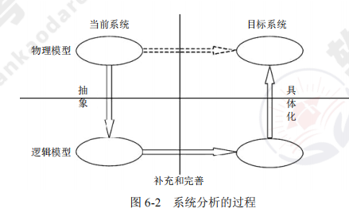

[toc]

# 软件设计师笔记06_结构化开发方法

## 第六章 结构化开发方法

结构化开发方法的内容，科目一考试中占2分左右，但是科目二占一道大题。

知识点结构图如下

### 系统分析与设计概述

#### 系统分析

> 系统分析的目的和任务

系统分析的主要任务是对现行系统进一步详细调查，将调查中所得到的文档资料集中，对组织内部整体管理状况和信息处理过程进行分析，为系统开发提供所需的资料，并提交系统方案说明书。

简而言之就是系统分析报告（系统方案说明书）。

> 系统分析的主要步骤

将系统分析阶段的主要工作分为以下五步：
1. 对当前系统进行详细的调查，收集数据。
2. 建立当前系统的逻辑模型。
3. 对现状进行分析，提出改进意见和新系统应达到的目标。
4. 建立新系统的逻辑模型。
5. 编写系统方案说明书

如图所示

> 系统分析的目的

系统分析的目的是将现有系统的物理模型转换为目标系统的物理模型。

#### 系统设计

> 系统设计的基本原理

- 抽象。（重点说明本质方面，忽略非本质方面）
- 模块化。（可组合、分解和更换的单元）
- 信息隐蔽。（将每个程序的成分隐蔽或封装在一个单一的设计模块中）
- 模块独立：低耦合、高内聚。（每个模块完成一个相对独立的特定子功能，且与其他模块之间的联系简单）

> 系统设计的主要目

系统设计的主要目的是为系统制定蓝图，在各种技术和实施方法中权衡利弊，精心设计，合理地使用各种资源，得出新系统的详细设计方案。

### 结构化分析方法

#### 结构化分析 SA 概述

结构化的分析方法SA：自顶向下，逐步分解，是面向数据的，强调分析对象的数据流。

需要建立：功能模型（数据流图）、行为模型（状态转换图）、数据模型（E-R图）以及数据字典（数据元素、数据结构数据流、数据存储、加工逻辑、外部实体）

#### 数据流图 DFD

数据流图描述数据在系统中如何被传送或变换，以及如何对数据流进行变换的功能或子功能，主要用于对功能建模。

> 数据流图基本设计原则

1. 数据守恒原则：对任何一个加工来说，其所有输出数据流中的数据必须能从该加工的输入数据流中直接获得，或者说是通过该加工能产生的数据
2. 守恒加工原则：对同一个加工来说，输入与输出的名字必须不相同，即使它们的组成成分相同。
3. 对于每个加工，必须既有输入数据流，又有输出数据流
4. 外部实体与外部实体之间不存在数据流
5. 外部实体与数据存储之间不存在数据流
6. 数据存储与数据存储之间不存在数据流
7. 父图与子图的平衡原则：子图的输入输出数据流同父图相应加工的输入输出数据流必须一致，此即父图与子图的平衡。父图与子图之间的平衡原则不存在于单张图
8. 数据流与加工有关，且必须经过加工

#### 数据字典 DD

数据字典：是用来定义在数据流图中出现的符号或者名称的含义，在数据流图中，每个存储、加工、实体的含义都必须定义在数据字典中，并且父图和子图之间这些名称要相同。