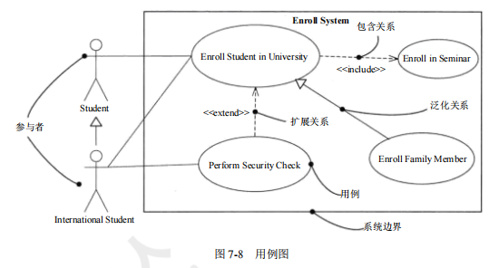

[toc]

# 软件设计师笔记07_面向对象技术

## 第七章 面向对象技术

### 面向对象基础

#### 面向对象基础的概念

面向对象 = 对象 + 类 + 继承 + 消息通信 

> 对象

在面向对象的系统中，对象是基本运行时的实体，即包括数据（属性），也包括作用于数据的操作（行为）。一个对象把属性和行为封装为一个整体。

> 消息

对象之间进行通信的一种构造称为消息

> 类

类：是对象的抽象，定义了一组大体相似的对象结构，定义了数据和行为。

> 继承

继承是指父类与子类之间共享数据和方法的机制。

这是类之间的一种关系，在定义和实现一个类的时候，可以在一个已经存在的类的基础上进行，并把这个类所定义的内容作为自己的内容，并加入若干新的内容。

> 多态

在收到消息时，对象要予以响应。不同的对象收到同一信息可以产生不同的结果，这个现象称为多态。

多态有如下几种
- 参数多态（不同类型参数多种结构类型）
- 包含多态（父子类型关系）
- 过载多态（类似于重载，一个名字不同含义）
- 强制多态（强制类型转换）

> 覆盖

覆盖是指子类在原有父类接口的基础上，用适合于自己要求的实现去置换父类中的相应实现。

即在子类中重定义一个与父类同名同参的方法

> 函数重载

函数重载与覆盖要区分开，函数重载与子类父类无关，且函数是同名不同参数。

即一个类中存在同名不同参数的多个函数。

> 封装

封装：一种信息隐蔽技术，其目的是使对象的使用者和生产者分离，也就是使其他开发人员无需了解所要使用的软件组件内部的工作机制，只需知道如何使用组件。

> 静态类型

静态类型是指一个对象的类型在编译时就确定了动态类型：指对象类型在运行时才能确定

> 静态绑定与动态绑定

绑定是一个把过程调用和响应调用所需要执行的代码加以结合的过程。在一般的程序设计语言中，绑定是在编译时进行的，称为静态绑定。动态绑定则是在运行时进行的，因此，一个给定的过程调用和代码的结合直到调用发生时才进行。

#### 面向对象分析

面向对象分析是为了确定问题域，理解问题。

面向对象分析包括五个活动
1. 认定对象（按自然存在的实体确定对象）
2. 组织对象（分析对象关系，抽象成类）
3. 对象间的相互作用（描述各对象在应用系统中的关系）
4. 确定对象的操作（操作，如创建增加删除等）
5. 定义对象的内部信息（属性）

#### 面向对象设计

面向对象设计（OOD）的含义是设计分析模型和实现相应的源代码，在目标代码环境中，这种源代码可以被执行。

#### 面向对象程序设计

面向对象程序设计：用面向对象程序设计语言实现设计方案。

#### 面向对象测试

面向对象测试可以分为四个层次：
- 算法层。用于测试类中定义的每个方法，相当于单元测试。
- 类层。用于测试封装在同一个类中的所有方法与属性之间的相互作用。类似模块测试。
- 模板层。用于测试一组协同工作的类之间的相互作用。相当于集成测试。
- 系统层。把各个子系统组装成完整的面向对象软件系统，在组装过程中同时进行测试。相当于系统测试。

### UML

UML：是统一建模语言，和程序设计语言并无关系。

> UML三个要素如下
- 1、UML的基本构造块
- 2、支配这些构造块如何放置在一起的规则和运用
- 3、整个语言的一些公共机制

> UML的基本构造块如下
- 事物（对模型中最具有代表性的成分的抽象）
- 关系（把事务结合在一起）
- 图（聚集了相关的事物）

#### 事物

UML 中有四种事物。
- 结构事物：模型的静态部分，如类、接口、用例、构件等。
- 行为事物：模型的动态部分，如交互、活动、状态机。
- 分组事物：模型的组织部分，如包
- 注释事物：模型的解释部分，依附于一个元素或一组元素之上对其进行约束或解释的简单符号。

#### 关系

UML 中有四种关系
- 依赖：一个事物的语义依赖于另一个事物的语义的变化而变化。
- 关联：是一种结构关系，描述了一组链，链是对象之间的连接。
- 泛化：一般/特殊的关系，子类和父类之间的关系。
- 实现：一个类元指定了另一个类元保证执行的契约

其中关联分为组合和聚合,都是部分和整体的关系，其中组合之间关系更强。

如图所示

#### 图

#### 类图

类图：展现一组对象、接口、协作和它们之间的关系，是系统的静态设计视图。

#### 对象图

对象图：展现某一时刻一组对象及它们之间的关系。对象图一般包括对象和链。

#### 用例图

用例图展现了一组用例、参与者和它们之间的关系。

- 参与者是指人、硬件或其他系统可以扮演的角色
- 用例是指参与者完成的一系列操作
- 用例之间的关系是指 包含（必须要做）、扩展（可做可不做）、泛化等。

#### 序列图

序列图描述了以时间顺序组织的对象之间的交互活动。

- 同步消息：调用者中止执行，等待控制权返回。需要等待返回消息，用实心三角箭头表示。
- 异步消息：发出消息后继续执行，不引起调用者阻塞，也不等待返回消息，由空心箭头表示。
- 返回消息：由从右到左的虚线箭头表示。

#### 通信图

通信图不强调时间顺序，只强调事件之间的通信。

#### 状态图

状态图描述单个对象在多个用例中的行为，包括简单状态和组合状态。

状态图中转换和状态是两个独立的概念，如图中方框代表状态，箭头上的代表触发事件，实心圆点为起点和终点

#### 活动图

活动图展现了在系统内从一个活动到另一个活动的控制流程。

- 活动图中的分岔和汇合线是一条水平粗线。
- 每个分岔的分支数代表了可同时运行的线程数。活动图中能够并行执行的是在一个分岔粗线下的分支上的活动

#### 构件图

构件图展现了一组构件之间的组织和依赖关系。

#### 部署图

部署图是用来对面向对象系统的物理方面建模的方法。它与构件图相关，通常一个结点包含一个或多个构件。其依赖关系类似于包依赖，因此部署组件之间的依赖是单向的类似于包含关系。

### 设计模式

设计模式的核心在于提供了相关问题的解决方案，使人们可以更加简单方便地复用成功的设计和体系结构。

> 设计模式的四个基本要素：
1. 模式名称
2. 问题：应该在何时使用模式。
3. 解决方案：设计的内容
4. 效果：模式应用的效果

> 设计模式的类别

1. 创建型模式：主要处理创建对象
2. 结构型模式：主要处理类和对象的组合
3. 行为型模式：主要是描述类或者对象的交互行为

#### 创建型设计模式

创建型设计模式抽象了实例化过程，它们帮助一个系统独立于如何创建、组合和表示它的那些对象。

一个类的创建型模式使用继承改变被实例化的类，而一个对象创建型模式将实例化委托给另一个对象。

创建型设计模式的有：
- ①抽象工厂
- ②生成器
- ③工厂方法
- ④原型
- ⑤单例

#### 结构型设计模式

结构型设计模式的有
- ①适配器
- ②桥接
- ③组合
- ④装饰
- ⑤外观
- ⑥享元
- ⑦代理

#### 行为设计模式

行为设计模式涉及算法和对象间职责的分配。行为设计模式不仅描述对象或类的模式，还描述了它们之间的通信模式。这些模式刻画了在运行时难以跟踪的、复杂的控制流。它们将用户的注意力从控制流转移到对象间的联系方式上来。

行为设计模式的有
- ①责任链
- ②命令
- ③解释器
- ④迭代器
- ⑤中介者
- ⑥备忘录
- ⑦观察者
- ⑧状态
- ⑨策略
- ⑩模板方法
- ⑪访问者
