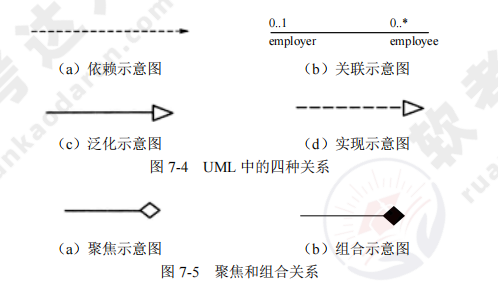

[toc]

# 软件设计师笔记07_面向对象技术

## 第七章 面向对象技术

### 面向对象基础

#### 面向对象基础的概念

面向对象 = 对象 + 类 + 继承 + 消息通信 

> 对象

在面向对象的系统中，对象是基本运行时的实体，即包括数据（属性），也包括作用于数据的操作（行为）。一个对象把属性和行为封装为一个整体。封装是一种信息隐藏技术，目的是使对象的使用者和生产者分离，使对象的定义和实现分开。从程序设计者来看，对象是一个程序模块；从用户来看，对象为他们提供了所希望的行为。

对象内进行的操作通常称为方法。一个对象一般由对象名（标识）、属性和方法三个部分组成。

> 类

类是在对象上的抽象，对象是类的具体化，是类的实例（instance）。在分析和设计时，通常把注意力集中在类上，而不是具体的对象。也不必逐个定义每个对象，只需对类作出定义，而对类的属性进行不同的赋值即可得到该类的对象实例。

> 继承

继承是父类与子类之间共享数据和方法的机制。这是类之间的一种关系，在定义和实现一个类的时候，可以在一个已经存在的类的基础上进行，并把这个类所定义的内容作为自己的内容，并加入若干新的内容。

> 消息

对象之间进行通信的一种构造称为消息。当一个消息发送给某个对象时，包含要求接收对象去执行某些活动的信息，接收到信息的对象经过解释，然后予以响应，这种通信机制称为消息传递。发送消息的对象不需要知道接收消息的对象如何对请求予以响应。

> 多态

在收到消息时，对象要予以响应。不同的对象收到同一信息可以产生不同的结果，这个现象称为多态。Cardelli 和 Wegner 将其分为通用的（参数的、包含的）和特定的（过载的、强制的）。

> 动态绑定

绑定是一个把过程调用和响应调用所需要执行的代码加以结合的过程。在一般的程序设计语言中，绑定是在编译时进行的，称为静态绑定。动态绑定则是在运行时进行的，因此，一个给定的过程调用和代码的结合直到调用发生时才进行。

#### 面向对象分析

面向对象分析（OOA）的目的是获得对应用问题的理解。理解的目的是确定系统的功能和性能要求。

面向对象分析技术可以将系统的行为和信息间的关系表示为迭代构造特征。面向对象分析包括五个活动：①认定对象；②组织对象；③对象间的相互作用；④定义对象的操作；⑤定义对象的内部信息。

#### 面向对象设计

面向对象设计（OOD）的含义是设计分析模型和实现相应的源代码，在目标代码环境中，这种源代码可以被执行。

通常情况下，由概念模型生成的分析模型被装入到相应的执行环境中时，还需要被修改。对象标识期间的目标是分析对象，设计过程也是发现对象的过程，称为再处理。

面向对象是一种程序设计风格，不只是一种具有构造继承性、封装性和多态的程序设计语言族的命名。

#### 面向对象测试

面向对象测试可以分为四个层次：
- 算法层。用于测试类中定义的每个方法，基本上相当于传统软件测试中的单元测试。
- 类层。用于测试封装在同一个类中的所有方法与属性之间的相互作用。在面向对象软件中，类是基本模块，因此可以认为这是面向对象测试中所特有的模块测试。
- 模板层。用于测试一组协同工作的类之间的相互作用。大体上相当于传统软件测试中的集成测试，但是也有面向对象软件的特点，如对象之间通过发送消息相互作用。
- 系统层。把各个子系统组装成完整的面向对象软件系统，在组装过程中同时进行测试。

### UML

#### 事物

UML 中有四种事物。如图所示。

#### 关系

UML 中有四种关系：依赖、关联、泛化和实现。这四种关系是 UML 模型中可以包含的基本关系事物。

### 设计模式

> 设计模式的要素

设计模式的核心在于提供了相关问题的解决方案，使人们可以更加简单方便地复用成功的设计和体系结构。

设计模式的四个基本要素为：①模式名称；②问题；③解决方案；④效果。

> 创建型设计模式

创建型设计模式抽象了实例化过程，它们帮助一个系统独立于如何创建、组合和表示它的那些对象。

一个类的创建型模式使用继承改变被实例化的类，而一个对象创建型模式将实例化委托给另一个对象。

创建型设计模式的基本要素为：①抽象工厂（Abstract Factory）；②生成器（Builder）；③工厂方法（Factory Method）；④原型（Prototype）；⑤单例（Singleton）。

> 结构型设计模式

结构型设计模式的基本要素为：①适配器（Adapter）；②桥接（Bridge）；③组合（Composite）；④装饰（Decorator）；⑤外观（Facade）；⑥享元（Flyweight）；⑦代理（Proxy）。

> 行为设计模式

行为设计模式涉及算法和对象间职责的分配。行为设计模式不仅描述对象或类的模式，还描述了它们之间的通信模式。这些模式刻画了在运行时难以跟踪的、复杂的控制流。它们将用户的注意力从控制流转移到对象间的联系方式上来。

行为设计模式的基本要素为：①责任链（Chain of Responsibility）；②命令（Command）；③解释器（Interpreter）；④迭代器（Iterator）；⑤中介者（Mediator）；⑥备忘录（Memento）；⑦观察者（Observer）；⑧状态（State）；⑨策略（Strategy）；⑩模板方法（Template Method）；⑪访问者（Visitor）。
