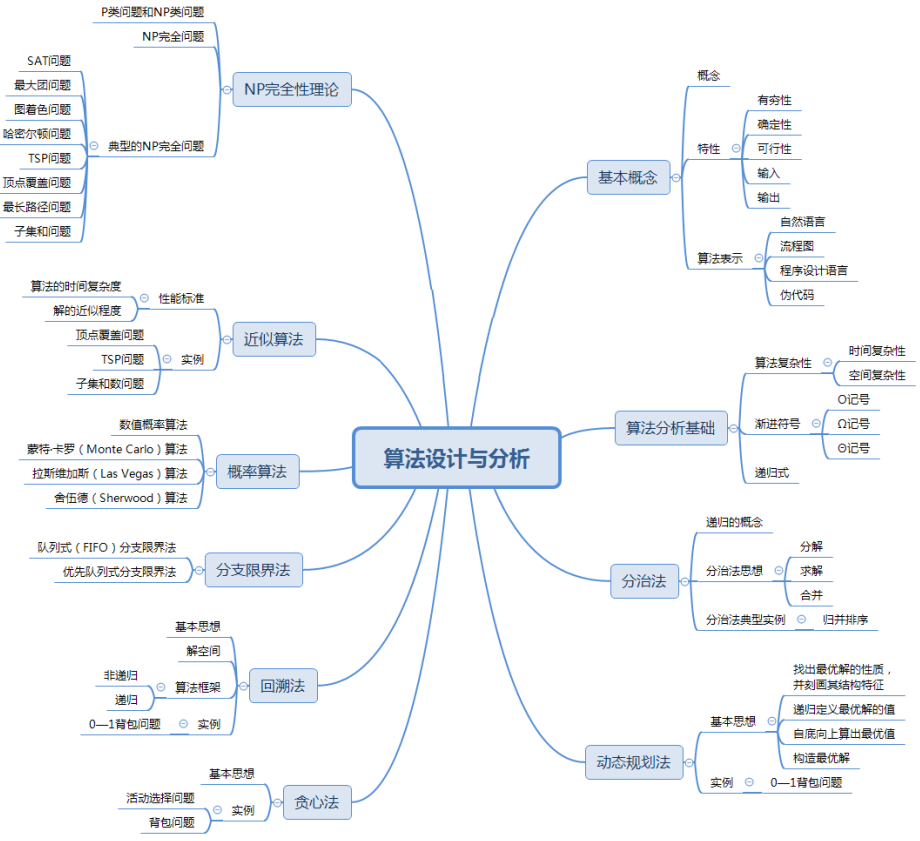

[toc]

# 软件设计师笔记08_算法设计与分析

## 第八章 算法设计与分析

算法被公认为是计算机科学的基石，算法理论研究的是算法的设计技术和分析技术。

本章知识点结构图

### 算法的基本概念

算法是对特定问题求解步骤的一种描述，它是指令的有限序列，其中每一条指令表示一个或多个操作。

> 算法的5个重要特性

有穷性、确定性、可行性、输入、输出。

> 一个“好”算法的要求

正确性、健壮性、高效性

### 算法的复杂度

#### 时间复杂度

时间复杂度：是指程序运行从开始到结束所需要的时间。

通常分析时间复杂度的方法是从算法中选取一种对于所研究的问题来说是基本运算的操作以该操作重复执行的次数作为算法的时间度量。

#### 空间复杂度

空间复杂度是指对一个算法在运行过程中临时占用存储空间大小的度量。一个算法的空间复杂度只考虑在运行过程中为局部变量分配的存储空间的大小。

### 分治法

