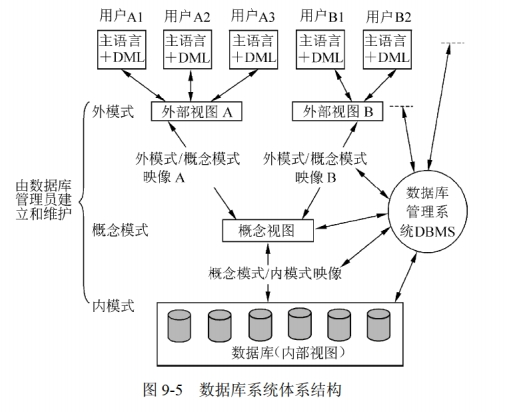
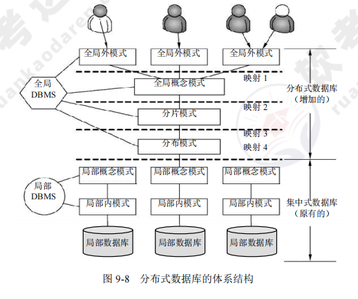

[toc]

# 软件设计师笔记09_数据库技术基础

## 第九章 数据库技术基础

### 基本概念

> 数据库系统（DBS）的定义

数据库系统（DBS）：从广义上讲是由数据库、硬件、软件和人员组成的，其中管理的对象是数据。
- 数据库（DB）：是指长期存储在计算机内的、有组织的、可共享的数据集合。
- 硬件：是指构成计算机系统的各种物理设备，包括存储数据所需的外部设备。
- 软件：包括操作系统、数据库管理系统及应用程序。
- 人员：系统分析员和数据库设计人员、应用程序员、最终用户、数据库管理员（DBA）

> DBMS的功能

1. 主要功能：数据定义，数据库操作，数据库运行管理，数据组织、存储和管理，数据库的建立和维护。
2. 其他功能：如DBMS在网络中与其他软件系统的通信功能，一个DBMS与另一个DBMS或文件系统的数据转换功能等。

> DBMS的特征与分类

- DBMS的特征：数据结构化且统一管理、有较高的数据独立性、数据控制功能。
- DBMS的分类：关系数据库系统（RDBS）、面向对象的数据库系统（OOBS）、对象关系数据库系统（ORDBS）。

### 数据库的"三级模式和两级映像"结构

数据库体系结构大多采用"三级模式和两级映像"。如图所示

> 数据库的三级模式结构

1. 外模式（用户/子模式）。是用户与数据库系统的接口，是用户用到的那部分数据的描述，由若干个外部记录类型组成。
2. 概念模式（模式）。是数据库中全体数据的逻辑结构和特征的描述，它由若干个概念记录类型组成，只涉及行的描述，不涉及具体的值。
3. 内模式（存储模式），是数据物理结构和存储方式的描述，是数据在数据库内部的表示方式，定义所有的内部记录类型、索引和文件的组织方式以及数据控制方面的细节。

> 数据库的两级映像

数据库系统在三级模式之间提供了两级映像，即模式/内模式映像和外模式/模式映像。
1. 模式/内模式映像。该映像存在于概念级和内部级之间，实现了概念模式到内模式之间的相互转换。（物理独立性）
2. 外模式/模式映像。该映像存在于外部级和概念级之间，实现了外模式到概念模式之间的相互转换。（逻辑独立性）

### 数据模型

#### 基本概念

最常用的数据模型分为概念数据模型和基本数据模型。

1. 概念数据模型：也称信息模型，是按用户的观点对数据和信息建模，是现实世界到信息世界的第一层抽象，强调其语义表达功能，易于用户理解，是用户和数据库设计人员交流的语言，主要用于数据库设计。这类模型中最著名的是实体联系模型，简称E-R模型。

2. 基本数据模型：是按计算机系统的观点对数据建模，是现实世界数据特征的抽象，用于DBMS的实现。基本数据模型主要有层次模型、网状模型、关系模型和面向对象模型(OOM)。

#### 数据模型三要素

数据模型是用来描述数据的一组概念和定义。数据模型的三要素是数据结构、数据操作、数据的约束条件。
- 数据结构：是所研究的对象类型的集合，是对系统静态特性的描述。
- 数据操作：是对数据库中各种对象(型)的实例(值)允许执行的操作集合，包括操作及操作规则。数据操作是对系统动态特性的描述。
- 数据的约束条件：是一组完整性规则的集合。也就是说，对于具体的应用数据必须遵循特定的语义约束条件，以保证数据的正确、有效、相容。

#### E-R 模型

实体-联系模型简称E-R模型，是软件工程设计中的一个重要方法，因为它接近于人的思维方式，容易理解并且与计算机无关，所以用户容易接受。一般遇到实际问题，应先设计一个E-R模型，然后再把它转换成计算机能接受的数据模型。

> E-R模型的3个主要概念

E-R模型，所采用的3个主要概念是实体、联系和属性。

- 实体：是现实世界中可以区别于其他对象的“事件”或“物体”。每个实体由一组特性(属性)来表示，其中的某一部分属性可以唯一表示实体。实体集是具有相同属性的实体集合。
- 联系：实体集之间的对应关系称为联系。实体的联系分为实体内部的联系和实体与实体之间的联系。实体集内部的联系反映数据在同一记录内部各字段间的联系。
- 属性：是实体某方面的特性。在同一实体集中，每个实体的属性及其域是相同的，但可能取不同的值

> 实体集之间的联系类型

- 一对一联系：如果对于实体集A中的每一个实体，实体集B中至多有一个实体与之联系；反之亦然，则称实体集A与实体集B具有一对一联系。记为1∶1。
- 一对多联系：如果对于实体集A中的每一个实体，实体集B中有n个实体(n≥0)与之联系；反之，对于实体集B中的每一个实体，实体集A中至多只有一个实体与之联系，则称实体集A与实体集B有一对多联系。记为1∶n。
- 多对多联系：如果对于实体集A中的每一个实体，实体集B中有n个实体(n≥0)与之联系；反之，对于实体集B中的每一个实体，实体集A中也有m个实体(m≥0)与之联系，则称实体集A与实体集B具有多对多联系。记为m：n。

> E-R模型中的属性有以下分类

- 简单属性和复合属性：
    - 简单属性：是原子的、不可再分的。
    - 复合属性：可以细分为更小的部分(即划分为别的属性)。
- 单值属性和多值属性：
    - 若定义的属性对于一个特定的实体只有一个值，这样的属性叫做单值属性。
    - 若定义的属性对应一组值，则称为多值属性。
- NULL属性：当实体在某个属性上没有值或属性值未知时，使用NULL值，表示无意义或不知道。
- 派生属性：可以从其他属性得来。

> E-R 模型图

E-R 图中的主要构件如图所示。
- 实体：用矩形表示，每个实体由一组属性表示，包括主键、候选键、外键。
- 联系：用菱形表示，分为一对一（1:1）、一对多（1:n）、多对多（m:n）。
- 属性：用椭圆表示，是实体某方面的特性。E-R 模型中的属性分为：①简单和复合属性；②单值和多值属性；③null 属性；④派生属性

### 关系模型

关系模型是最常用的数据模型之一。关系数据库系统就是使用关系模型作为数据的组织方式。

#### 关系数据库的基本概念

> 属性和域

- 属性： 在现实世界中，要描述一个事物，常常取其若干特征来表示。这些特征称为属性。
- 域： 每个属性的取值范围的集合，称为该属性的域。

> 关系的三种类型

- 基本关系(通常又称为基本表、基表)：这是实际存在的表，它是实际存储数据的逻辑表示。
- 查询表：查询结果对应的表。
- 视图表：这是由基本表或其他视图表导出的表。由于它本身不独立存储在数据库中，数据库中只存放它的定义，所以常称为虚表。

> 关系的相关名词

- 目或度：常用R表示关系的名字，n表示关系的目或度。
- 候选码：若关系中的某一属性或属性组的值能唯一标识一个元组，则称该属性或属性组为候选码。
- 主码：若一个关系有多个候选码，则选定其中一个为主码。
- 主属性：所有候选码都是主属性，其他都是非主属性。
- 外码：如果关系模式R中的属性或属性组非该关系的码，但它是其他关系的码，那么该属性集对关系模式R而言是外码。
- 全码：关系模式的所有属性组是这个关系模式的候选码，称为全码。

> 关系和笛卡儿积

一个关系可以用二维表来表示。关系中属性个数称为元数，元组的个数称为基数。

> 关系运算

#### 5种基本的关系代数运算

5种基本的关系代数运算分别为 并，差，笛卡尔积，投影，选择。

暂无

#### 扩展的关系代数运算

暂无

### 关系数据库SQL语言

SQL是关系数据库的标准语言。

#### SQL的基本概念

> SQL的特点

1. 综合统一。
2. 高度非过程化。
3. 面向集合的操作方式。
4. 两种使用方式：
    - a、用户可以在终端键盘上输入SQL命令，对数据库进行操作，故称之为自含式语言；
    - b、将SQL嵌入到高级语言程序中，所以又是嵌入式语言。
5. 语言简洁，易学易用。

SQL支持三级模式结构：视图对应外模式、基本表对应模式、存储文件对应内模式。

> SQL的基本构成

SQL语言由以下几个部分构成：
- 数据定义语言(DDL)：SQLDDL提供定义关系模式和视图、删除关系和视图、修改关系模式的命令。
- 交互式数据操纵语言(DML)：SQLDML提供查询、插入、删除和修改的命令。
- 事务控制：SQL提供的定义事务开始和结束的命令。
- 嵌入式SQL和动态SQL：用于嵌入到高级语言(C、C++、Java等)中混合编程。其中SQL负责操纵数据库，高级语言负责控制程序流程。
- 完整性：SQLDDL包括定义数据库中的数据必须满足的完整性约束条件的命令，对于破坏完整性约束条件的更新将被禁止。
- 权限管理：SQLDDL中包括说明对关系和视图的访问权限的命令。

#### SQL数据定义

> 创建表

> 修改表

> 删除表

> 建立索引

> 删除索引

#### SQL数据查询

> 查询表

> 简单查询与连接查询

- 简单查询：简单查询只需要使用3个保留字，即SELECT、FROM和WHERE。
- 连接查询：若查询涉及两个以上的表，则称为连接查询。

> 子查询与聚集查询

- 子查询：子查询也称为嵌套查询，是指一个SELECT-FROM-WHERE查询可以嵌入另一个查询块之中。在SQL中允许多重嵌套。
- 聚集函数：聚集函数是以一个值的集合为输入，返回单个值的函数。SQL提供了5个预定义集合函数，即平均值AVG、最小值MIN、最大值MAX、求和SUM及计数COUNT。

> 分组查询

- GROUPBY子句：在WHERE子句后面加上GROUPBY子句可以对元组进行分组，保留字GROUPBY后面跟着一个分组属性列表。最简单的情况是，FROM子句后面只有一个关系，根据分组属性对其元组进行分组。SELECT子句中使用的聚集操作符仅用在每个分组上。

- HAVING子句：假如元组在分组前按照某种方式加上限制，使得不需要的分组为空，则在GROUPBY子句后面跟一个HAVING子句即可。

当元组含有空值时，应注意以下两点：
- a、空值在任何聚集操作中都被忽略。它对求和、求平均值和计数都没有影响，也不能是某列的最大值或最小值
- b、NULL值可以在分组属性中看作一个一般的值。

> 字符串操作

对于字符串进行的最通常的操作是使用LIKE操作符的模式匹配。使用两个特殊的字符来描述模式，即“%”匹配任意字符串、“-”匹配任意一个字符。

#### SQL数据更新

> 插入数据

> 删除数据

> 更新数据

#### SQL访问控制

SQL访问控制是指控制用户的数据存储权利，是由DBA来决定的。

DBMS数据控制应具有以下功能：
- 通过GRANT和REVOKE将授权通知系统，并存入数据词典。
- 当用户提出请求时，根据授权情况检查是否执行操作请求。
- SQL标准包括DELETE、INSERT、SELECT和UPDATE权限。

> 授权语句

### 数据库的控制能力

#### 事务管理

事务是一个操作序列，是数据库环境中不可分割的逻辑工作单位。

> 事务的4个特性

1. 原子性：事务的所有操作在数据库中要么全做，要么全都不做
2. 一致性：一个事务独立执行的结果，将保持数据的一致性，即数据不会因为事务的执行而被破坏
3. 隔离性：一个事务的执行不能被其他事务干扰
4. 持久性：一个事务一旦提交，它对数据库中数据的改变必须是永久的，即便系统出现故障时也是如此

#### 数据库的备份和恢复

数据库一般遭遇的故障类型如下
1. 事务内部故障：事务内部的故障有的可以通过事务程序本身发现
2. 系统故障：通常称为软故障，是指造成系统停止运行的任何事件，使得系统要重新启动
3. 介质故障：通常称为硬故障，如磁盘损坏、磁头碰撞和瞬时强磁干扰。此类故障发生的几率小，但破坏性最大
4. 计算机病毒：是一种人为的故障和破坏，是在计算机程序中插入的破坏，计算机功能或者数据可以繁殖和传播的一组计算机指令或程序代码。

数据库的备份方法：恢复的基本原理是“建立数据冗余”(重复存储)。建立冗余数据的方法是进行数据转储和登记日志文件。

> 数据的转储的分类

数据的转储分为：
1. 静态转储和动态转储：
    - 静态转储是指在转储期间不允许对数据库进行任何存取、修改操作
    - 动态转储是指在转储期间允许对数据库进行存取、修改操作
2. 海量转储和增量转储：
    - 海量转储是指每次转储全部数据
    - 增量转储是指每次只转储上次转储后更新过的数据

> 事务恢复的3个步骤

1. 反向扫描文件日志，查找该事务的更新操作
2. 对事务的更新操作执行逆操作
3. 继续反向扫描日志文件，查找该事务的其他更新操作，并做同样的处理，直到事务的开始标志

> 日志文件

日志文件：在事务处理的过程中，DBMS把事务开始、事务结束以及对数据库的插入、删除和修改的每一次操作写入日志文件。一旦发生故障，DBMS的恢复子系统利用日志文件撤销事务对数据库的改变，回退到事务的初始状态。因此，DBMS利用日志文件来进行事务故障恢复和系统故障恢复，并可协助后备副本进行介质故障恢复。

#### 数据库的并发控制

并发操作：是指在多用户共享的系统中，许多用户可能同时对同一数据进行操作。并发操作带来问题的原因是事务的并发操作破坏了事务的隔离性。DBMS的并发控制子系统负责协调并发事务的执行，保证数据库的完整性不被破坏，避免用户得到不正确的数据

并发操作带来的问题：并发操作带来的数据不一致性有3类，即丢失修改、不可重复读和读“脏”数据

#### 分布式数据库

通常使用较小的计算机系统，每台计算机可以单独放在一个地方，每台计算机中都可能有DBMS 的一份完整拷贝副本或部分拷贝副本，并具有自己局部的数据库，位于不同地点的许多计算机通过网络互相连接，共同组成一个完整的、全局的逻辑上集中、物理上分布的大型数据库。

分布式数据库的体系结构如图所示。
