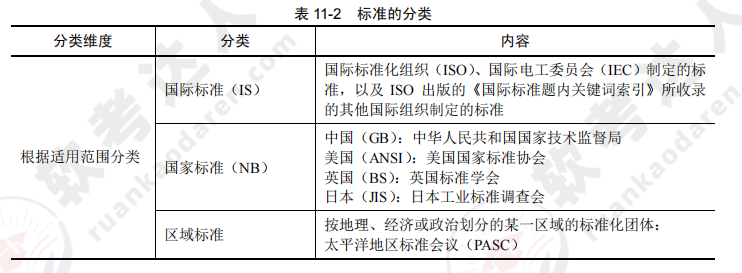
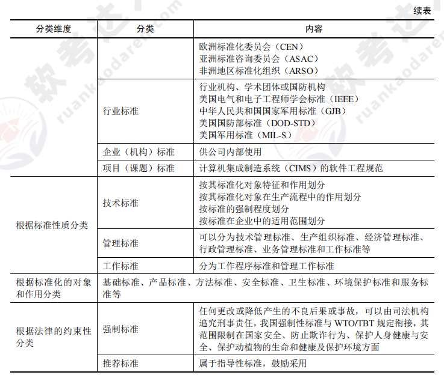
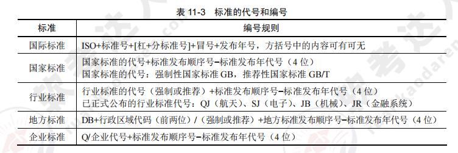
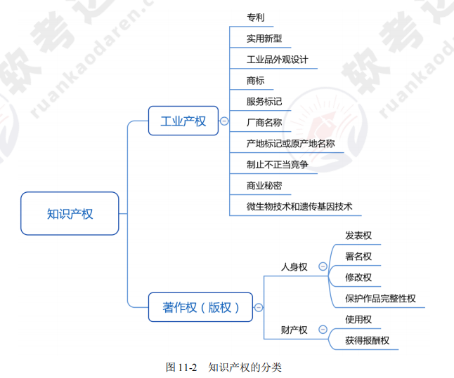
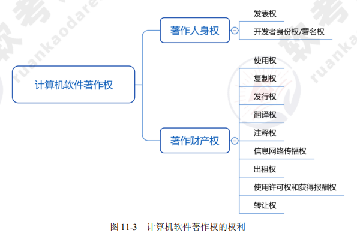
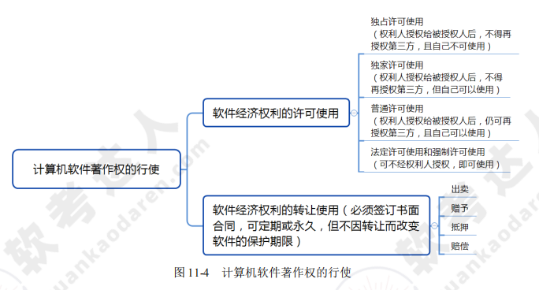

[toc]

# 软件设计师笔记11_标准化和软件知识产权基础知识

## 第十一章 标准化和软件知识产权基础知识

### 标准化基础知识

> 标准的分类如图所示

> 标准的代号和编号如图所示

### 知识产权基础知识

> 知识产权基本概念

- 知识产权是指民事权利主体（公民、法人）基于创造性的智力成果。
- 根据国际公约，知识产权的保护对象包括：①文学、艺术和科学作品；②表演艺术家的表演，以及唱片和广播节目；③人类一切活动领域的发明；④科学发现；⑤工业品外观设计；⑥商标、服务标记、商业名称和标志；⑦制止不正当竞争；⑧在工业、科学、文学艺术领域内由于智力创造活动而产生的一切其他权利。
- 根据世贸协议，知识产权还包括“未披露过的信息专有权”，即商业秘密。

> 知识产权的分类如图所示

- 计算机软件和实用艺术品受著作权保护的同时，权利人还可以通过申请发明专利和外观设计专利获得专利权（工业产权）。
- 知识产权的特点：无形性（智力成果）、双重性（多权并存）、确认性（依法审查）、独占性（权利人的相对性）、地域性、时间性。

> 计算机软件著作权的权利如图所示

> 计算机软件著作权的行使如图所示。

> 计算机软件的商业秘密

- 商业秘密的构成条件：①未公开的；②具有经济效益的；③采取了保密措施的。
- 侵犯计算机软件商业秘密的表现形式：非法获得、非法使用、违约和明知故犯。

> 专利权概述

- 我国专利法主要保护的对象：发明、实用新型和外观设计。
- 授予专利权的条件：新颖性、创造性和实用性。
- 专利申请日（关键日）是专利局或专利局指定的专利申请受理代办处收到完整专利申请文件的日期，邮寄以寄出的邮戳日为准。
- 专利权的保护期限：发明专利权自申请日起 20 年，实用新型和外观设计自申请日起 10 年.

> 企业保护软件知识产权成果的途径

①明确软件知识产权的归属；②及时对软件技术秘密采取保护措施；③依靠专利保护新技术和新产品；④软件产品进入市场之前的商标权和商业秘密保护权；⑤软件产品进入市场之前申请登记软件著作权。

