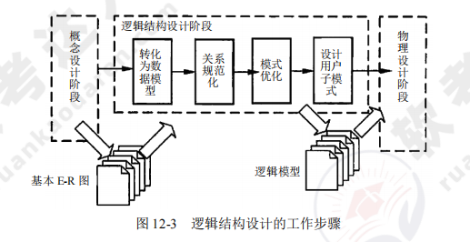

[toc]

# 软件设计师笔记12_软件系统分析与设计

## 第十二章 软件系统分析与设计

### 结构化分析与设计

- 结构化分析的对象包括数据（实体对象的属性和关系）和处理（对信息的加工和处理）。
- 数据流图（DFD）是面向数据流建模的工具。
- 进行结构化分析的步骤：①确定系统边界，绘制系统环境图；②绘制各层数据流图（自顶向下）；③定义数据字典；④定义加工（处理）说明；⑤将图、字典和加工组成分析模型。
- 系统总体设计模型反映模块间的调用关系，可以采用层次图、HIPO 图和机构图进行表达。
- 数据流图分为变换型数据流图和事务型数据流图。事务型数据流图的处理为条件判断式，根据不同输入数据的类型对应不同的处理动作。
- 详细设计可以采用程序流程图、N-S 图、PAS 图和 PDL 语言等工具进行表达。
- 结构化分析的最终结果：数据流图、数据字典和加工处理说明。

### 数据库分析与设计

> 数据库设计的步骤

数据库应用系统的生命周期分为六个阶段：数据库规划、需求描述与分析、数据库设计与应用程序设计、实现、测试、运行与维护。

其中：
- 需求描述与分析是以用户的角度进行的。
- 应用程序设计包括事务设计和用户界面设计。
- DDL（数据定义语言）用于建立数据库。

> 数据库设计的四个主要阶段

用户需求分析、概念结构设计、逻辑结构设计、物理结构设计。

- 用户需求分析。在需求调研的过程中，需要获得用户对系统的要求包括信息要求（保存哪些数据）、处理要求（实现什么功能）、系统要求（安全要求等）。
- 概念结构设计。概念设计中概念模型的理想工具是 E-R 图，由实体、属性和实体间的联系三要素组成
    - 1）概念结构设计的目标是产生反映系统信息需求的数据库概念结构，即概念模型。
    - 2）概念结构设计的策略通常有以下四种：自顶向下、自底向上、逐步扩张和混合策略。

概念结构设计的工作步骤如图所示。

- 逻辑结构设计。逻辑结构设计包括模式初始设计、子模式设计、应用程序设计、模式评价、模式求精。逻辑结构设计即是在概念结构设计的基础上进行数据模型设计，可以分为层次模型、网状模型和关系模型。

逻辑结构设计的工作步骤如图所示。

- 数据库的物理设计: 物理设计包括确定数据分布、存储结构和访问方式。综合考虑提高数据的访问速度，本阶段需要确定数据库文件的索引字段和索引类型。数据库的物理结构主要由存储记录格式、记录在物理设备上的安排及访问路径（存取方法）构成。

数据库物理设计的工作步骤如图所示。

> 数据库的实施与维护

数据库实施阶段的工作步骤如图所示。

### 面向对象分析与设计

> 面向对象分析与设计的步骤

- 面向对象分析包括四个活动：建模系统功能、定义领域模型、定义交互行为和状态、定义设计类图。
- 通过用例建模系统功能的步骤：①确定参与者；②确定需求用例；③构造用例模型；④记录需求用例描述。

> 建模对象状态

建模状态图应遵循的指导原则如下：①状态名称简单但具有描述性；②避免黑洞（有进无出）；③避免奇迹（有出无进）；④符合状态需对子状态集进行建模；⑤为复杂的实体创建分层的状态图

### 算法分析与设计

算法设计的主要步骤如图所示。

算法问题类型如表所示。

现代优化计算方法如图所示

### 面向过程的程序设计与实现

- 变量的本质是程序中用来存放数据的一段存储空间，通常其对应的存储空间为内存区域。
- 变量具有类型、值、地址、作用域和生存期等属性。
- 存储变量地址的变量称为指针变量。
- 当一个指针变量指向仍为指针变量时，称为多级变量，级数越多，数据访问效率越低

### 面向对象的程序设计与实现

当设计与实现面向对象的程序时，需要注意以下四点：
- 能够根据设计模式的名称画出其对应的类图。
- 理解类图中每一个类的作用与功能。
- 能够将现实问题中所描述的各种职责映射到类图中具体的类。
- 能够使用一种面向对象语言实现设计

