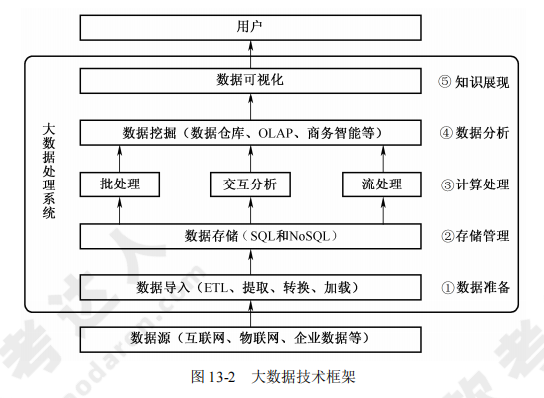

[toc]

# 软件设计师笔记13_新技术

## 第十三章 新技术

### 大数据

> 大数据的 5V 特点

大量（volume）、高速（velocity）、多样（variety）、价值（value）、真实性（veracity）

> 大数据的五个环节

大数据需要经过五个环节：①数据准备；②存储管理；③计算处理；④数据分析；⑤知识展现。

> 大数据技术框架图

> 大数据的关键技术

- HDFS。能提供高吞吐量的数据访问，非常适合大规模数据集上的应用。
- HBase。不同于一般的关系数据库，是非结构化数据存储的数据库。
- MapReduce。一种编程模型，主要思想为 Map（映射）和 Reduce（归约）。
- Chukwa。用于监控大型分布式系统的数据收集系统

### 云计算

- 云计算服务类型：云计算服务类型包括 IaaS（基础设施即服务）、PaaS（平台即服务）、SaaS（软件即服务）。
- 云计算技术架构： 云计算技术架构有四层，分别为设施层、资源层、资源控制层、服务层。云计算技术架构。

云计算技术架构如图所示。

### 物联网

> 物联网架构

1. 感知层：负责信息采集和物物之间的信息传输。
2. 网络层：是物联网三层中标准化程度最高、产业化能力最强、最成熟的部分。
3. 应用层：实现应用。

> 物联网的关键技术

感知层作为物联网架构的基础层面，主要技术包括：产品和传感器（条码、RFID、传感器等）自动化识别技术、无线传输技术（WLAN、Bluetooth、ZigBee、UWB）、自组织组网技术、中间件技术。

### 移动互联网

> 移动互联网

移动互联网等于移动通信网络加互联网的内容和应用。它不仅是互联网的延伸，而且是互联网的发展方向。

> 移动互联网的特征

移动互联网不仅具有传统互联网应用的简单复制和移植，还具有以下新特征：接入移动性、时间碎片性、生活相关性、终端多样性。

> 移动互联网的关键技术

1. 架构技术 SOA。面向服务的架构，不涉及底层编程接口和通信模型，Web Service 是目前实现 SOA 的主要技术。
2. 页面展示技术 Web 2.0。严格来说不是一种技术，而是互联网思维模式。
3. 页面展示技术 HTML 5。在原有 HTML 的基础上扩展了 API，最大的优势是可以在网页上直接调试和修改.
4. 主流开发平台 Android。特点是入门容易，因为 Android 的中间层多以 Java 实现，指令相对较少、开发相对简单，而且开发社群活跃，开发资源丰富。
5. 主流开发平台 iOS。一个非开源的操作系统，开发人员必须加入苹果开发者计划，需要付款以获得苹果的批准，开发语言是 Objective-C、C 和 C++，开发难度大于 Android。
6. 主流开发平台 Windows Phone。微软的一款手机操作系统，开发技术有 C、C++、C#等。

### 工业互联网

> 工业互联网的定义

工业互联网是全球工业系统与高级计算、分析、感应技术和互联网连接融合的结果。它通过智能机器间的连接并最终将人机连接，结合软件和大数据分析，重构全球工业，激发生产力，让世界更美好、更快速、更安全、更清洁、更经济。

> 工业互联网的实质

首先是全面互联，在全面互联的基础上，通过数据流动和分析，形成智能化变革，形成新的模式和新的业态。互联是基础，工业互联网使工业系统的各种元素互联起来，无论是机器、人还是系统。

互联解决了通信的基本，更重要的是数据端到端的流动和跨系统的流动，在数据流动技术上充分分析、建模。伯特认为智能化生产、网络化协同、个性化定制、服务化延伸是在互联的基础上，通过数据流动和分析，形成新的模式和新的业态。

这是工业互联网的基理，比现在的互联网更强调数据，更强调充分的连接，更强调数据的流动和集成及分析和建模，这和互联网是有所不同的。工业互联网的本质是要有数据的流动和分析。

工业互联网生态系统的持续拓展基于 Predix 和 Predix.io 两大基础。

### 人工智能

> 定义

人工智能（Artificial Intelligence，AI）是研究使计算机来模拟人的某些思维过程和智能行为（如学习、推理、思考、规划等）的学科，主要包括计算机实现智能的原理、制造类似于人脑智能的计算机、使计算机能实现更高层次的应用。

人工智能涉及计算机科学、心理学、哲学和语言学等学科。可以说几乎涵盖了自然科学和社会科学的所有学科，其范围已远远超出了计算机科学的范畴，人工智能与思维科学的关系是实践和理论的关系，人工智能处于思维科学的技术应用层次，是它的一个应用分支。

> 应用

人工智能的应用包括机器视觉、指纹识别、人脸识别、视网膜识别、虹膜识别、掌纹识别、专家系统、自动规划、智能搜索、定理证明、博弈、自动程序设计、智能控制、机器人学、语言和图像理解、遗传编程等。

### 区块链

> 定义

区块链（Blockchain）是分布式数据存储、点对点传输、共识机制、加密算法等计算机技术的新型应用模式。所谓共识机制是区块链系统中实现不同节点之间建立信任、获取权益的数学算法。

区块链是比特币的一个重要概念，它本质上是一个去中心化的数据库，同时作为比特币的底层技术。区块链是一串使用密码学方法相关联产生的数据块，每一个数据块中包含了一次比特币网络交易的信息，用于验证其信息的有效性（防伪）并生成下一个区块。

> 架构

一般说来，区块链系统由数据层、网络层、共识层、激励层、合约层和应用层组成。
- 数据层封装了底层数据区块及相关的数据加密和时间戳等技术；
- 网络层包括了分布式组网机制、数据传播机制和数据验证机制等；
- 共识层主要封装网络节点的各类共识算法；
- 激励层将经济因素集成到区块链技术体系中来，主要包括经济激励的发行机制和分配机制等；
- 合约层主要封装各类脚本、算法和智能合约，是区块链可编程特性的基础；
- 应用层则封装了区块链的各种应用场景和案例。

该模型中，基于时间戳的链式区块结构、分布式节点的共识机制、基于共识算力的经济激励及灵活可编程的智能合约是区块链技术最具代表性的创新点.

