[toc]

# 软件设计师笔记_应用大题_精简考点

> 科目二知识点分布

题号 | 题目类型 | 知识点 | 内容
------------ | ------------- | ------------- | -------------
第1题 | 必答题 | 数据流图 | 补充数据流图的缺失部分
第2题 | 必答题 | 数据库设计 | E-R模型，关系模式，增加实体等
第3题 | 必答题 | UML建模 | 类图，用例图，活动图，状态图等
第4题 | 必答题 | C语言算法 | 分治法，谈心法，动态规划法，回溯法等
第5题 | 选答题 | C++程序设计 |  C++语法，设计模式
第6题 | 选答题 | Java程序设计 |  Java语法，设计模式


## 第一题 数据流图

补充数据流图的缺失部分

### 基本

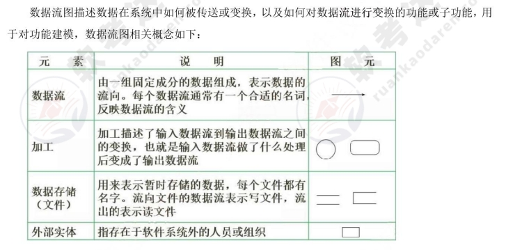

> 外部实体：是指在当前系统之外的实体。例如人，物品，其他系统等。

图像用矩形表示。 英文一般用E1,E2表示。

举例的外部实体：
- 人：学生，老师，医生，客户等
- 物品：传感器，车辆。
- 其他系统：支付系统，订单系统等

> 数据加工：是指输入流经过数据加工后变成输出流。

圆矩形表示数据加工。英文一般用P1,P2来表示

一个数据加工至少由一个输入流和一个输出流。

- 黑洞：是指只有输入没有输出的数据加工。
- 白洞：是指只有输出没有输入的数据加工。
- 灰洞：加工的输入数据不足以产生输出数据

> 数据存储：用于存储数据和取出数据。

图像用缺口矩形表示。英文一般用D1 D2 表示。

例子：客户表，学生表，订单文件等

> 数据流：表示数据的流向


### 做题总结

> 第一题：找出图中的实体名称。

推荐参考 图2和题目说明，找到实体名称。所有的实体名称都在题目说明中出现过。

若发现图中有多个E1,E2,E3 那是为了方便设计数据流图而导致的。本质上多个E1是同样的。

> 第二题：给出图中数据存储的名称

推荐参考 图2和题目说明，找到数据存储的名称。

> 第三题：补充缺失的数据流起点终点

一般是一条数据流对应1-2分。根据分数补充多少条数据流。 

缺失数据流的名称和起点终点都可以从说明中获取.

推荐的书写格式或机考格式如图所示

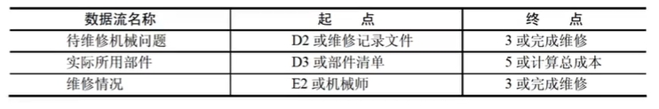

> 有三种发现缺失的数据流的方法。

- 方法1：父图子图平衡。

根据图1和图2中的数据流名称，看图2中是否有缺失的数据流。并根据图1的提示进行补充。

- 方式2：加工既有输入数据流，也有输出数据流。

看图2中的加工是否有输入和输出数据流。若没有则表示该加工缺失数据流，需要进行补充。

- 方式3：数据守恒

根据题目说明与图2进行详细对比，看图2的数据流是否符合题目说明。若不符合则缺少数据流，需要根据说明对图2进行补充。

==注意：数据流的起点或终点必须有一个是加工。==

### 真题1

2014年上半年

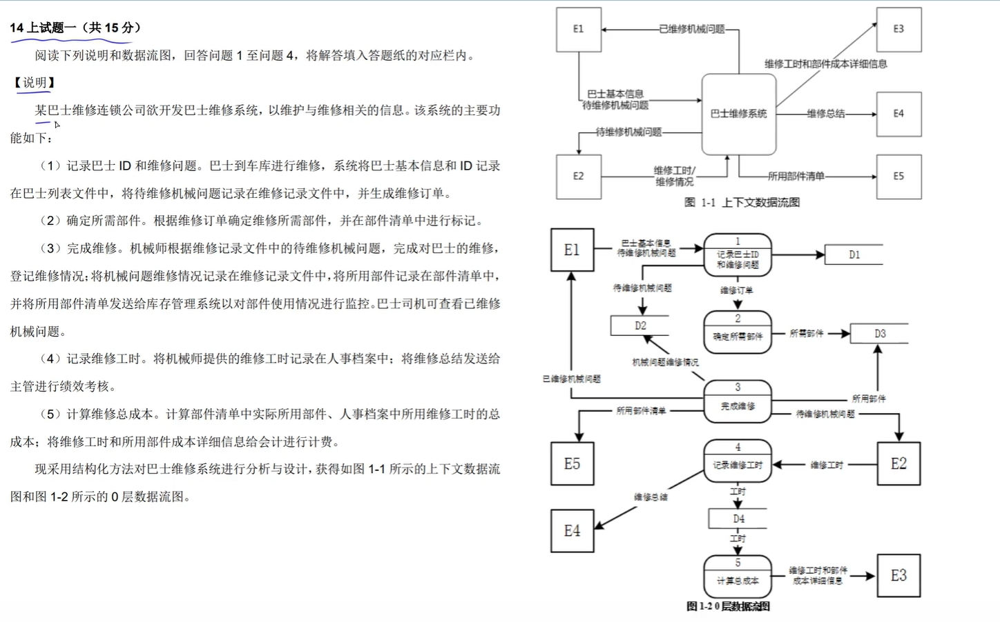

【问题1】
使用说明中的词语，给出图1-1中的实体E1-E5的名称。

E1:巴士司机 E2:机械师 E3:会计 E4：主管 E5：库存管理系统

【问题2】
使用说明中的词语，给出图1-2中的数据存储D1-D4的名称

D1: 巴士列表文件 
D2: 维修记录文件
D3: 部件清单
D4: 人事档案

【问题3】

补充图1-2中缺失的数据流及其起点和终点

答案： 

3分表示有3条缺失的数据流。

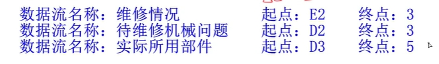


## 第二题 数据库设计

第二题 数据库设计一般考E-R模型，关系模式，增加实体等

### E-R 模型图

E-R 图中的主要构件如图所示。
- 实体：用矩形表示。
- 属性：用椭圆表示。
- 联系：用菱形表示，分为一对一（1:1）、一对多（1:n）、多对多（m:n）。

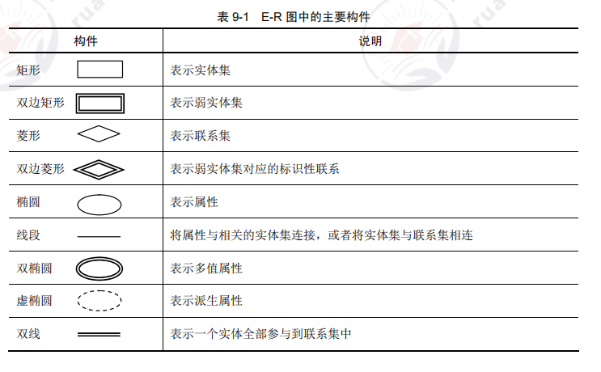

> 弱实体

弱实体用双边矩形表示。弱实体的存在必须以另一个实体为前提。例如实体A,B。只有当实体A存在的时候，实体B才会存在。那么实体B相对于实体A是弱实体。


如图只有当职工实体存在时，家属实体才存在。则家属实体为弱实体。
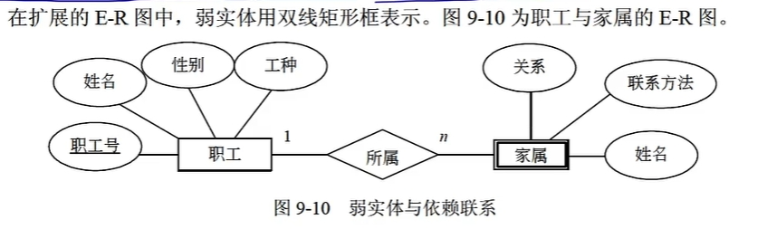

> 父子实体

若实体A，B是父子关系。则实体A是实体B的父实体。

如图所示。职员实体和其他三个实体的关系是父子关系。
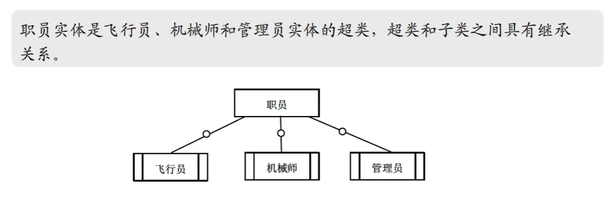

==父子实体的联系需要加上小圆圈表示。子实体是用类似橡皮擦的图案表示。==

### 关系模式和指出主键外键

- 关系模式的格式为：关系名（属性1，属性2，属性3 .。。。。。。。）
- 主键：唯一属性
- 外键：联系其他关系的属性。

==构建关系模式，可以理解为设计表==

> 如何将一对一关系转换为关系模式（参考一对一表的设计）

方式1

1. 先将实体和属性转换为关系。
2. 再将联系也转换为关系。

方式2

1. 先将实体和属性转换为关系。
2. 再选择其中一个实体的主键属性，加入到另一个关系的属性中。

如图所示
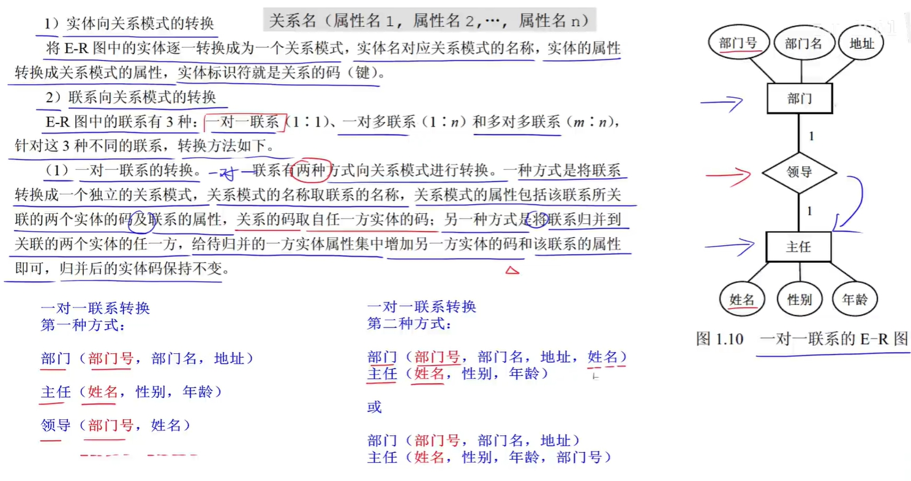

> 如何将一对多关系转换为关系模式（参考一对多表的设计，添加外键）

方式1

1. 先将实体和属性转换为关系。
2. 再将联系也转换为关系。其中多的那方为主键。

方式2

1. 先将实体和属性转换为关系。
2. 选择少的实体的主键属性，加入到多的实体的关系中，作为外键属性。

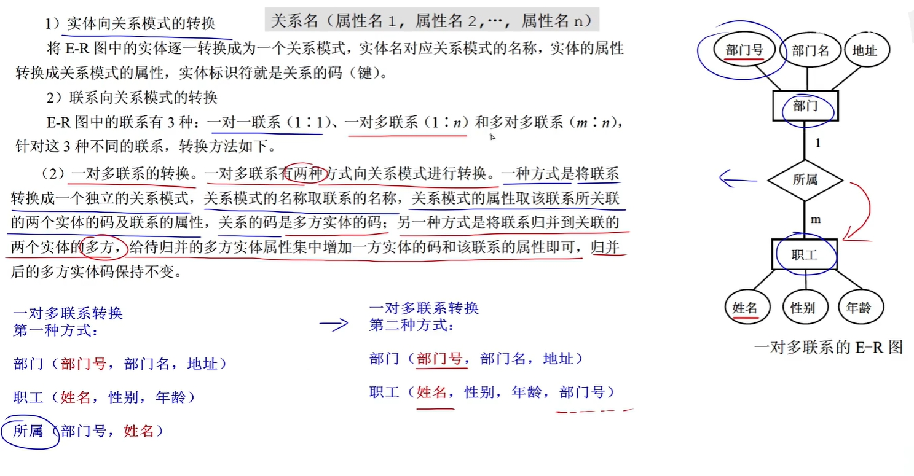

> 如何将多对多关系转换为关系模式（参考多对多表的设计，设计中间表）

1. 先将实体和属性转换为关系。
2. 再将联系也转换为关系。将两个实体的主键都作为属性添加到关系中即可。

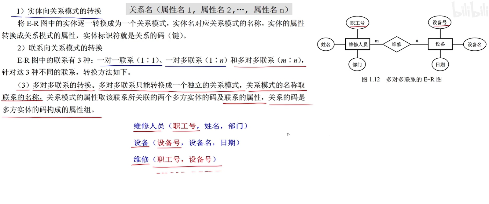

### 第一问：补充E-R图

如图是18年下半年的真题例子
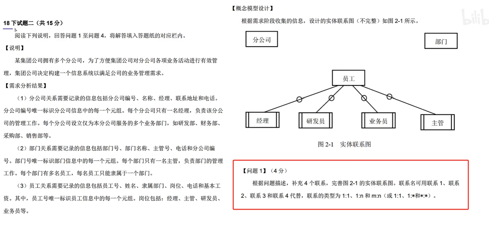

一般根据需求分析结果将E-R图进行补充。注意联系的名称如果没要求可以从需求分析结果中摘取。

答案如图所示
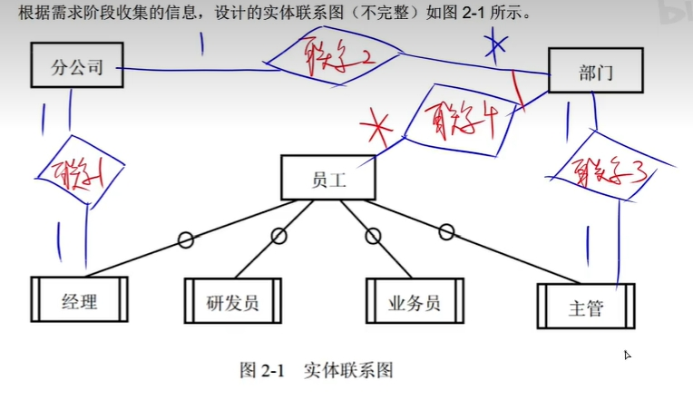


### 第二问：补充关系模式，指出主键和外键

即根据问题一的E-R图转换为对应的关系模式。

如图所示，将关系模式中的a-c补充完整。
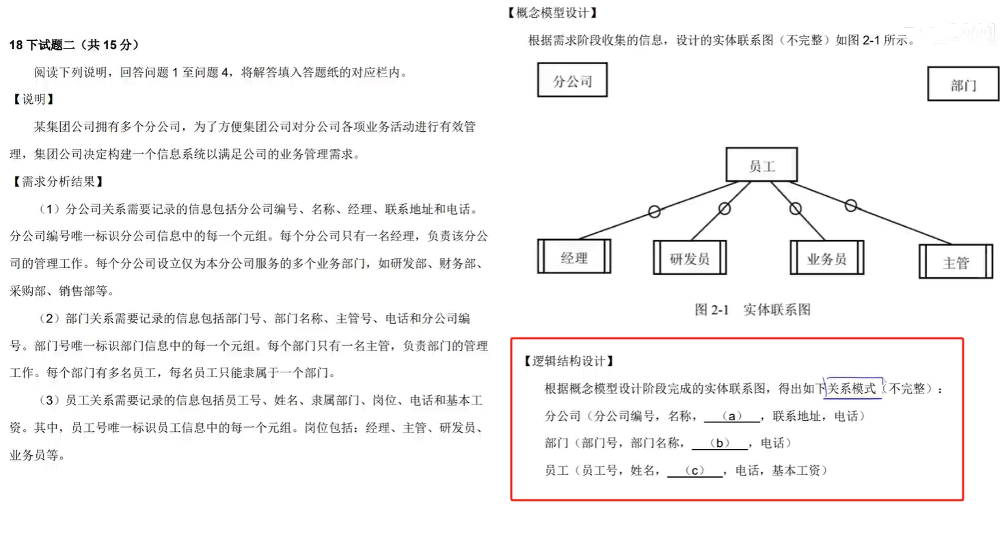

==注意一个空可能要填多个属性。不光要从文字说明中找到对应属性，也要从E-R图中根据对应关系添加对应属性。==

答案

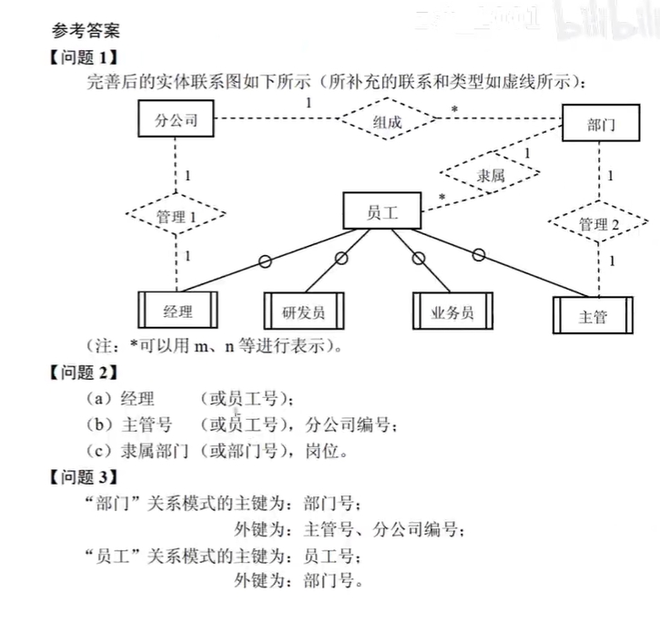


## 第三题 UML建模

### 基本

#### 关系

UML 中有四种关系:依赖，关联，泛化，实现。

> 依赖关系

依赖：一个事物的语义依赖于另一个事物的语义的变化而变化的关系。

如图所示各个关系的画图


用虚线箭头表示，箭头起点是依赖事物，箭头终点是被依赖事物。若A依赖于B，则A在箭头起点，B在箭头终点。

> 关联关系

关联：是一种结构关系，描述了整体和部分之间的关系。

有两个特殊的关联关系。
- 聚合：整体和部分的生命周期不一样。整体消失了，部分任然可以存在。两者是独立的。
- 组合：整体和部分的生命周期一样，整体消失了，部分也会消失。

如图所示各个关系的画图


普通的关联关系用实线表示。聚合关系用白色菱形箭头表示。组合关系用黑色菱形箭头表示。

注意起点代表部分，菱形代表整体。

关联关系上的0..1表示0个或1个。0..*表示0个或多个。


> 泛化关系

泛化：一般/特殊的关系，子类和父类之间的关系。

如图所示各个关系的画图


泛化关系用实线三角箭头表示。箭头起点为子类，三角箭头终点为父类。

> 实现关系（很少考）

实现：一个类元指定了另一个类元保证执行的契约。类似接口和实现类的关系。

如图所示各个关系的画图


实现关系用虚线三角箭头表示。箭头起点为实现类，三角箭头终点为接口类。

#### 图

> 类图

类图：展现一组对象、接口、协作和它们之间的关系。

如图所示
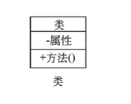


> 用例图

用例图展现了一组用例、参与者和它们之间的关系。

- 参与者是指人、硬件或其他系统可以扮演的角色。用小人展示。
- 用例是指参与者完成的一系列操作。用椭圆展示
- 用例之间的关系是指 包含（必须要做）、扩展（可做可不做）、泛化等。用各种箭头表示。

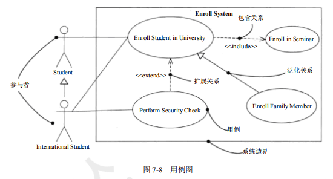 

> 包含关系 

标注`<<include>>`的虚线箭头表示。箭头起点为包含用例。箭头终点为被包含用例。

例如A --include --> B。就是A包含B的意思。

> 扩展关系

标注`<<extend>>`的虚线箭头表示。

> 泛化关系

三角箭头表示泛化关系。表示父类和子类的关系。


### 第一问 补充用例图

一般是补充用例图中的用例（用椭圆表示）。用例是指参与者完成的一些操作。补充用例就是补充操作。

一般根据说明来猜出用例图中缺失的部分。


### 第二问 补充类图

一般来说是补充类图。可以根据说明中用英文标注的单词。推测出每个单词表示一个类。
1. 先找出类图中的具有父类子类关系和接口实现类的关系。
2. 然后根据说明中描述的数量关系，来与类图中的类进行一一比对。
3. 从而将类图中的类与说明中的名词进行绑定。

例如文字说明中机器人有两种类型，表示机器人这个类有两个子类。机器人有两个传感器功能，表示机器人有一个传感器接口，该接口有两个实现类。

==注意类图中的实心箭头图表示泛化关系，也就是父类子类关系。==

也有可能通过第三问的题干，推出第二题的答案。
 
### 例题

> 21年下

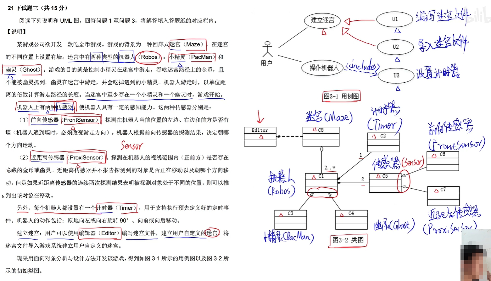
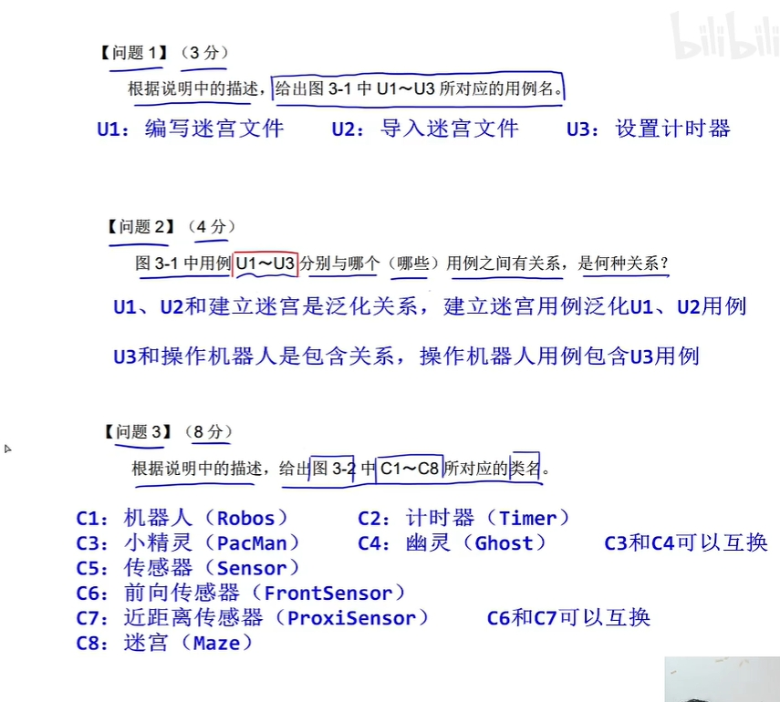

> 21年上

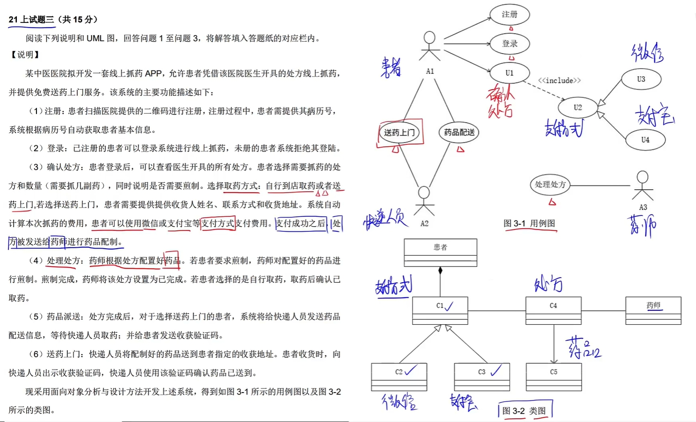
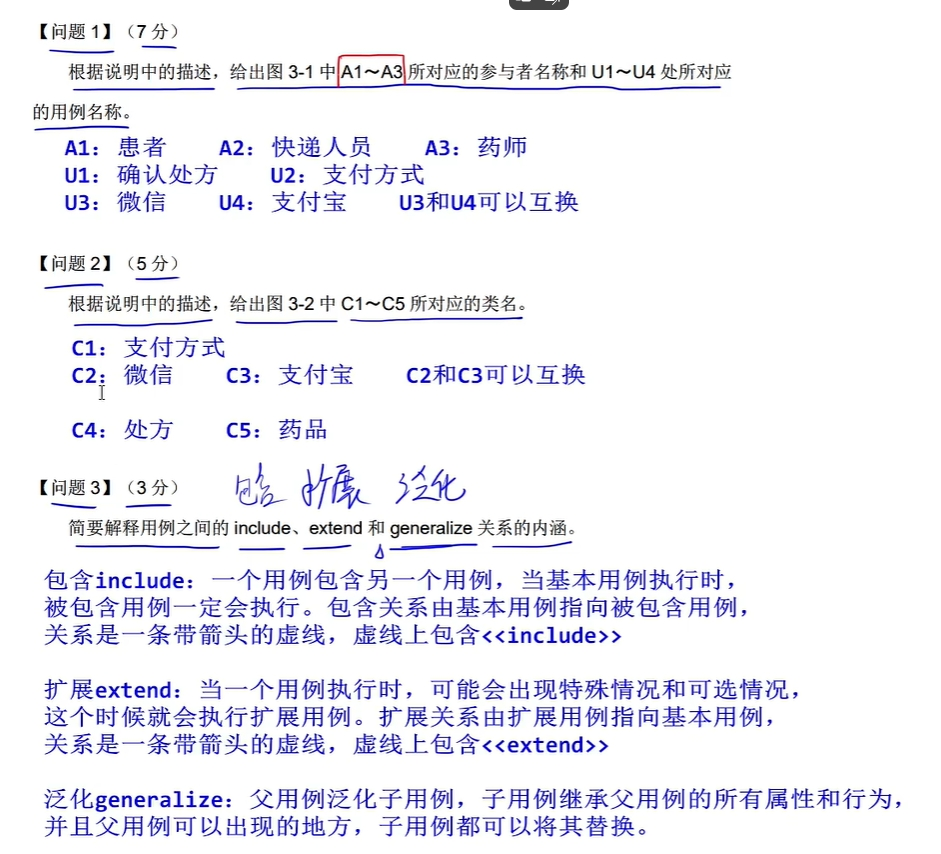

> 19年下

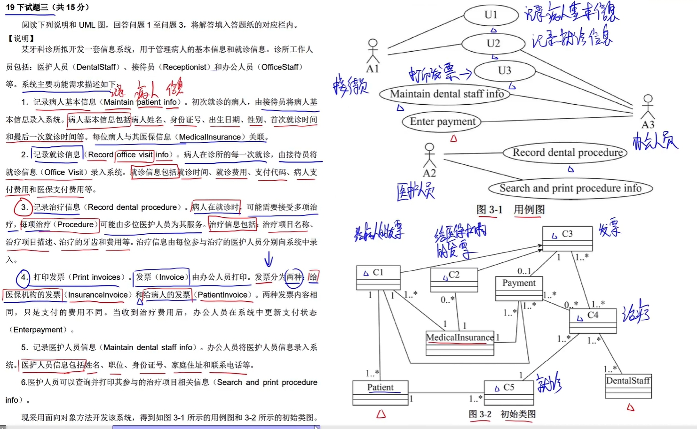
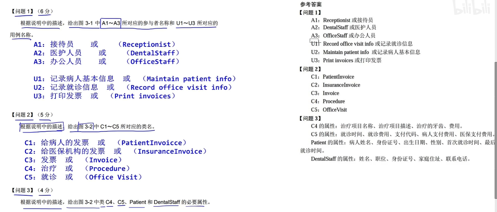

## 第四题 算法题


## 第五题 第六题 二选一 C++程序设计 java程序设计

主要考补全代码，程序填空题。

### java程序设计

闹记关键字

> 类

继承类的关键字为 extends

```java
class A{
	String name;
}
class B extends A{
	int age;
}
```

> 抽象类和抽象方法

抽象类的关键字：abstract

```java
abstract class A{
	public abstract int show();   //抽象方法show
}

```

> 接口

接口的关键字：interface  implements

```java

//用interface关键字声明接口
interface C{
	 void show();    //抽象方法
}

//用implements关键字实现接口C
class D implements C{
	public void show() {    //对接口的重写
		System.out.println("show");
	}
}
```

根据类图中的箭头图案，推测出类之间的关系。并推测出对应的代码


