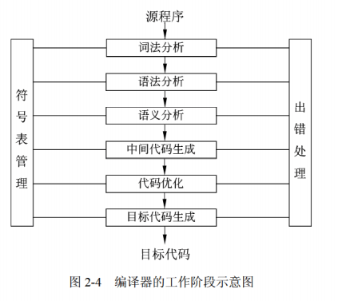

[toc]

# 软件设计师笔记_知识点合集

# 第一章 计算机系统组成

## 进制转换

### 十进制 转换 二进制

- 整数部分：使用除基取余法。即整数不断除2，直至商为0，然后将余数逆序输出。
- 小数部分：采用乘基取整法。即将小数不断乘以2，记录整数部分，直至小数部分为0为止。然后将整数部分正序输出。

### 二进制 转换 十进制

位权相加法。将二进制的每一位乘以二进制的对应位权（从2的0次方开始），然后求和，即可得到二进制对应的十进制。

## 原码，反码，补码，移码

原码：在一串二进制机器数中，数的最高位是符号位。其中0为正符号位，1为负符号位。其余位是绝对值部分。

反码：正数的反码与原码相同。负数的反码中绝对值部分相比原码是按位取反的。

补码：正数的补码与原码相同，负数的补码等于其对应反码的末尾加1。

移码：只要将补码的符号位取反，就可以得到对应的移码表示。

## 校验码-海明码

海明码可以检错也可以纠错。其余出现的校验码方法可以检错，不能纠错。

海明码公式： 2^k >= n+k+1

## 指令系统

### CISC

CISC 全称为Complex Instruction Set Computing 复杂指令集。

指令种类多，指令复杂度高，寻址方式复杂，通用寄存器数量一般，不支持流水线技术。采用微程序控制技术实现译码。

### RISC

RISC 全称为Reduced Instruction Set Computer，精简指令集。

指令种类少，指令复杂度低，寻址方式固定，通用寄存器数量大量，支持流水线技术。采用硬布线控制逻辑来实现译码。

### 流水线

流水线执行指令时间的公式 T = NT + (K-1)t

- NT是第一条指令执行的完整时间。
- t 是流水线中耗时最长的哪个部分的时间。
- k 是流水线中一共需要执行的指令数。

流水线的吞吐率公式 = 总的指令数 / (流水线执行指令时间) = 总的指令数 / ( NT + (K-1)t )

### 寄存器中的寻址方式

- 立即寻址：操作数在指令中的寻址方式。
- 寄存器寻址：操作数在寄存器中的寻址方式。
- 直接寻址：操作数的地址在指令中的寻址方式。
- 寄存器间接寻址：操作数的地址在寄存器中的寻址方式。
- 间接寻址：操作数的地址的地址在指令中的寻址方式。

> 存储器中各个寻址方式的速度对比：

立即寻址 > 寄存器寻址 > 直接寻址 > 寄存器间接寻址 > 间接寻址

### DMA

DMA全称是直接内存存取。是指通过DMA硬件来控制内存和设置的数据交换，这种方式可以不需要CPU处理。即绕过了CPU来进行数据交换的方式。

### 总线

- 数据总线：用于传输数据的，双向的
- 地址总线：用于传输CPU发出的地址数据的。
- 控制总线：用于传输控制信号的

## 系统可靠性

### 串联系统

如果一个系统R，由于各个子系统R1...Rn组成。

那么串联系统的可靠性等于各个子系统的可靠性乘积。即 R = R1 * R2 * ....Rn

串联系统的失效率等于各个子系统的失效率的和。即A = A1+...An

### 并联系统

并联系统的可靠性等于1减去各个子系统的不可靠性的乘积。即 1 -（1-R1）（1-R2）...(1-Rn)

### 可靠性公式

可靠性是指一个系统对于给定的时间间隔内、在给定条件下无失效运作的概率。

可靠性公式 MTTF/（1+MTTF），其中MTTF为平均无故障时间。

### 可用性公式

可用性是在给定的时间点上，一个系统能够按照规格说明正确运作的概率。

可用性公式 MTBF/（1+MTBF），其中MTBF为平均失效间隔时间。

### 可维护性公式

可维护性是在给定的使用条件下，在规定的时间间隔内，使用规定的过程和资源完成维护活动的概率。

可维护性公式 1/（1+MTTR），其中MTTR为平均修复时间。

## 存储系统

### 存储器

计算机系统中可能包括各种存储器。下面是存储器的分类方式。

- 按访问方式：按地址访问的存储器、按内容访问的存储器。
    - 相联存储器是一种按内容访问的存储器。
- 按储存器所处位置：内存,外存。
    - 内存：又名主存，存放运行所需要的数据和程序。
    - 外存：又名辅存，存放不参与运行的数据。在需要的适合会调入内存中。
    - 主存与辅存的交互由硬件和软件共同实现的。
- 按存储器的构成材料：磁存储器，半导体存储器，光存储器。
- 按存储器的工作方式：读/写存储器 , 只读存储器等。
    - 读写存储器（RAM）：既能读取数据也能写入数据。
    - 固定只读存储器（ROM）：内容只能读出，不能改变。
    - 可编程的只读存储器（PROM）：其中的内容可以由用户一次性地写入，写入后不能改变。
    - 闪速存储器（FM）：又名闪存。
- 按寻址方式：随机存储器，顺序存储器，直接存储器等。
    - 随机存储器（Random Access Memory,RAM）读取和写入数据的时间是相同的。
    - 顺序存储器（Sequent Access Memory,SAM）读取和写入数据，与存储位置相关。
    - 直接存储器 (DAM) 介于随机存储器和顺序存储器之间。

### 高速缓存（Cache）

- 高速缓存（Cache）位于 CPU 与主存之间；其组成部分分为 控制部分，存储部分。
- 高速缓存（Cache）与 主存的交互完全由硬件自动完成的。
- 高速缓存（Cache）的容量一般在几千字节到几兆字节之间；速度一般比主存快 5～10 倍，由快速半导体存储器构成；
- 高速缓存（Cache）的内容是主存的部分副本，对程序员来说是透明的。

由于高速缓存Cache中的内容是与主存的内容是一一映像的。因此有多种地址映像方法。

高速缓存中的地址映像方法如下：
- 直接映像：是指主存的块与Cache块的对应关系是固定的。优点是地址变换简单，缺点是灵活性差，Cache块冲突率高。
- 全相联映像：允许主存的任一块可以调入Cache存储器的任何一个块的空间中。优点是Cache块冲突率低、灵活性好。缺点是访问速度慢、地址变换较复杂、成本太高。
- 组相联映像：是前两种方式的折中方案，即组采用直接映像方式、块采用全相联映像方式。

发生块冲突从少到多的顺序：全相联映射-->组相联映射-->直接映射。

多级Cache：在多级Cache计算机中分为一级(L1Cache)，二级(L2Cache)等。

Cache的命中率与Cache容量的关系是：容量越大，命中率越高。

### 内存编址计算 *****

暂无

## 计算机安全

### 加密算法

> 分类

- 常见的对称加密算法包括：DES，3DES，RC-5，IDEA，AES等
    - 优点：加密解密速度块。但是只能对大数据量进行加解密。
    - 缺点：加密强度不高。容易被暴力穷举破解。
- 常见的非对称加密算法包括：RSA，ECC等。
    - 优点：加密强度高。
    - 缺点：加密解密速度极慢。只能对小数据量进行加解密。
- 常见的信息摘要算法包括：SHA，MD5，HMAC等。

ECC、DSA和RSA均属于公开密钥加密算法，DES是共享密钥加密算法。

DES加密算法的密钥长度为56位。

X.509是国际密码学里公钥证书的格式标准，推荐使用的密码算法是RSA。

国密SM2数字证书采用的公钥密码算法是ECC基于椭圆曲线的公钥密码算法。

RSA是一种非对称加密算法，在用户或者机构之间进行身份认证方面有较好的应用；常用于数字签名

SHA-1是一种安全散列算法，常用于对接收到的明文输入产生 160位固定长度的输出，来确保明文在传输过程中不会被篡改；

MD5是一种使用最为广泛的报文摘要算法；输出128位加密的摘要

RC-5是一种用于对明文进行加密的算法，适用于大量明文进行加密并传输。

计算机感染特洛伊木马后的典型现象是有未知程序试图建立网络连接

有效防治计算机病毒的策略是安装井及时升级防病毒软件。

# 第二章 程序语言设计

## 表达式

在考试当中，该知识点的考查，通常形式是给出一个表达式的中缀表达形式（或前缀、后缀），让考生将其转换为前缀或后缀表达形式。

### 中缀表达式

中缀表达式：运算符位于操作数中间，是人们常用的算术表示方法，如 “(3 + 4) × 5 - 6”。

### 前缀表达式

前缀表达式：运算符位于操作数之前，也称为波兰式。如 “- × + 3 4 5 6” 是前缀表达式，等价于中缀表达式 “(3 + 4) × 5 - 6”。

### 后缀表达式

运算符位于操作数之后，也称为逆波兰式。如 “3 4 + 5 × 6 -” 是后缀表达式，等价于中缀表达式 “(3 + 4) × 5 - 6”。

## 文法的推导规则运用

掌握根据给定的文法产生式（如本题中 \(S \to A0|B1\)、\(A \to S1|1\)、\(B \to S0|0\) 这些产生式规则 ）进行推导，通过不断替换非终结符（S、A、B 为非终结符 ）来得到终结符组成的字符串（由 0 和 1 组成 ）。

## 正则表达式

## 编译过程

## 各个程序设计语言的特点

程序设计语言基本上可以分为命令式程序设计语言、函数式程序设计语言、面向对象程序设计语言和逻辑程序设计语言。

- 命令式程序设计语言的代表有：Fortran,Pascal和C语言等。
- 函数式程序设计语言的代表有Lisp、ML等。
- 面向对象程序设计语言的代表有C++、SmallTalk、Java等。
- 逻辑程序设计语言的代表有Prolog。

> 真题

- Java语言符合的特征有（采用即时编译， 对象在堆空间分配）和自动的垃圾回收处理。
- 在运行时将调用和响应调用所需执行的代码加以结合的机制是（动态绑定 ）。
- 对布尔表达式`a or ((cb<c) and d)`求值时，（ a为true ）时可进行短路计算。
- 程序运行过程中常使用参数在函数(过程)间传递信息，引用调用传递的是实参的（ 地址 ）。
- 某表达式的语法树如下图所示，其后缀式(逆波兰式)是（ ）。考中缀表达式转换为后缀表达式。
- 以下关于传值调用与引用调用的叙述中，正确的是（在传值调用方式下，实参可以是变量，也可以是常量和表达式。在引用调用方式下，可以实现形参和实参间双向传递数据的效果 ）。
-  （ Lisp ）是一种函数式编程语言。
- 己知文法G: S→A0|B1，A→S1|1, B→S0|0,其中S是开始符号。从S出发可以推导出（ 某些0和1个数相等的字符串 ）。
- C程序中全局变量的存储空间在（静态数据区）分配。
- 在对高级语言源程序进行编译的过程中，为源程序中变量所分配的存储单元的地址属于（逻辑地址 ）。

- 在程序的执行过程中，系统用（ 栈 ）实现嵌套调用(递归调用)函数的正确返回。
- 面向对象程序设计语言C++、JAVA中，关键字（ this ）可以用于区分同名的对象属性和局部变量名。
- 一个类中可以拥有多个名称相同而参数表（参数类型或参数个数或参数类型顺序） 不同的方法，称为（方法重载 ）。
- 某些程序设计语言中，在运行过程中当一个对象发送消息请求服务时，根据接收对象的具体情况将请求的操作与实现的方法进行连接，称为 （  动态绑定 ） 。
- 多态分为参数多态、包含多态、过载多态和强制多态四种不同形式，其中（ 包含 ）多态在许多语言中都存在，最常见的例子就是子类泛型化。
- 采用继承机制创建子类时，子类中（可以有新的属性和行为 ）。
- 聚合对象是指一个对象（ 包含其它对象 ）。
- 同一消息可以调用多种不同类的对象的方法，这些类有某个相同的超类，这种现象是（ 多态 ）。
- 以下关于实现高级程序设计语言的编译和解释方式的叙述中，正确的是 （ 在编译方式下产生源程序的目标程序，在解释方式下不产生 ） 。
- 计算机执行程序时，内存分为静态数据区、代码区、栈区和堆区。其中（ 栈区 ）一般在进行函数调用和返回时由系统进行控制和管理，（ 堆区 ）由用户在程序中根据需要申请和释放。
- 移进—归约分析法是编译程序（或解释程序）对高级语言源程序进行语法分析的一种方法，属于（ 自底向上（或自下而上） ）的语法分析方法。
- 编译过程中进行的语法分析主要是分析（  程序语句的结构是否合法 ）。
- 将高级语言程序翻译为机器语言程序的过程中，常引入中间代码，其好处是（ 利于进行与机器无关的优化处理 ）。
- 在Python3中，表达式list(range （ ） 【10:0:-2】 的值为（  [10,8,6,4,2] ）。
- 对于大多数通用程序设计语言，用（  上下文无关文法 ）描述其语法即可。