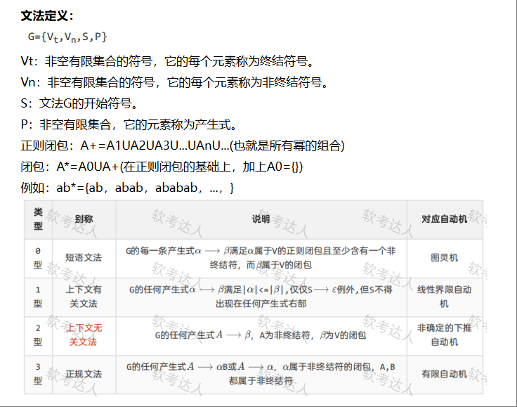
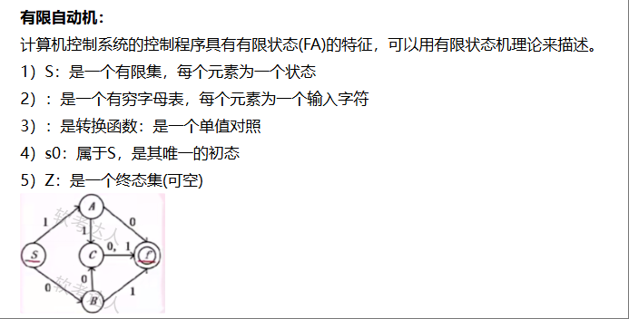
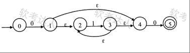
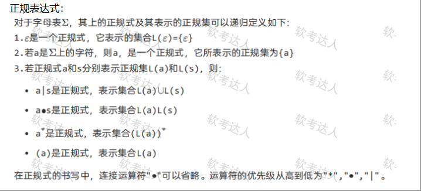
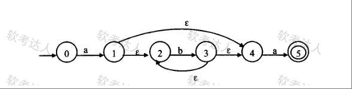
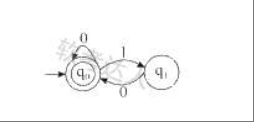

[toc]

# 软件设计师笔记_程序语言设计_考点

## 程序语言

- 低级语言：机器语言，如汇编语言。
- 高级语言：常见的有Java，C，C++，PHP，Python，Delphi等。

程序设计语言基本上可以分为命令式程序设计语言、函数式程序设计语言、面向对象程序设计语言和逻辑程序设计语言。

> 各程序设计语言特点

- 命令式程序设计语言的代表有：Fortran,Pascal和C语言等。
- 函数式程序设计语言的代表有Lisp、ML等。
- 面向对象程序设计语言的代表有C++、SmallTalk、Java等。
- 逻辑程序设计语言的代表有Prolog。

## 解释和编译

- 编译程序生成独立的可执行文件，运行效率高。
- 解释程序不生成可执行文件，控制源程序进行逐条解释执行。因此执行速度慢，效率低。

### 编译过程

顺序不可更换。词法分析 -> 语法分析 -> 语义分析 -> 中间代码生成 -> 代码优化 -> 目标代码生成。 

- 词法分析阶段是编译过程的第一个阶段，这个阶段的任务是对源程序从前到后（从左到右）逐个字符地扫描，从中识别出一个个“单词”符号（记号），并分析一个个符号是否符合程序语言的规定。
- 语法分析：在词法分析的基础上，根据语法规则将一个个单词符号分解成各个语法单位，如“表达式”“语句”等,并分析是否符合语法规则。
- 语义分析：根据语法分析的结果，分析各个表达式，各个语句。检查是否包含静态语义错误,不能发现程序中所有的语义错误。
- 中间代码生成：此阶段与具体机器无关。根据语义分析的结果，将源程序转换为一种中间表示形式，例如将源程序 “int a = 5 + 3;” 转换为中间代码形式可能是 “t1 = 5 + 3; a = t1;” 利于后续处理。
- 代码优化作用：对中间代码进行等价变换，旨在提高目标代码的运行效率，减少运行时间和空间开销 。
- 目标代码生成作用：此阶段与具体机器硬件紧密相关。把中间代码转换为特定机器上的代码。例如将中间代码转换为 x86 架构下的机器指令，让程序能在对应硬件上运行。

编译过程的中间代码生成和代码优化不是必要的，可省略。

> 词法分析

- 输入：源程序。
- 输出：记号流。

> 语法分析

- 输入：记号流。
- 输出：语法树。
- 语法分析阶段可以发现程序中所有的语法错误。

> 语义分析：

- 输入：语法树。
- 语义分析阶段可以发现静态语义错误。不能发现动态语义错误，动态语义错误运行时才能发现。有语义错误是可以编译成功的，例如a/0；这是符合语法的，也符合静态语义，编译器检验不出来这个是错的，只有运行才会报错，也就是动态语义，动态语义错误常见的有死循环。

一般程序中的错误可分为语法错误和语义错误（逻辑错误），语法错误是语句形式上的错误，语义错误是含义上的错误（即逻辑错误）。

> 语法分析的几种方法

- 自上而下语法分析：最左推导，从左至右。给定文法G和源程序串r。从G的开始符号s出发，通过反复使用产生式对句型中的非终结符进行替换(推导)，逐步推导出r。
- 递归下降思想：原理是利用函数之间的递归调用模拟语法树自上而下的构造过程，是一种自上而下的语法分析方法。
- 自下而上语法分析：最右推导，从右至左。从给定的输入串r开始，不断寻找子串与文法G中某个产生式P的候选式进行匹配，并用P的左部代替(归约)之，逐步归约到开始符号S。
- 移进-规约思想：设置一个栈，将输入符号逐个移进栈中，栈顶形成某产生式的右部时，就用左部去代替，称为归约。很明显，这个思想是通过右部来推导出左部，因此是自下而上语法分析的核心思想。

### 解释过程

如图是解释程序实现高级语言的三种方式

解释过程直接执行源程序（词法分析、语法分析、语义分析过程是有的，但是没有中间代码生成，也没有目标机器码代码），其最大的特点是不产生目标程序代码，并且程序每执行一次就要解释一次，运行效率低。

### 编译过程和解释过程的区别

- 编译方式：词法分析、语法分析、语义分析、中间代码生成、代码优化、目标代码生成。
- 解释方式：词法分析、语法分析、语义分析。

编译和解释都不可省略词法分析、语法分析、语义分析且顺序不可交换。

## 函数传值

- 传值调用：将实参的值传递给形参，实参可以是变量、常量和表达式。不可以实现形参和实参之间的双向传递数据。
- 传引用（地址）调用：将实参的地址传递给形参，形参必须有地址，实参不能是常量（值）、表达式。可以实现形参和实参间双向传递数据的效果，即改变形参的值同时也改变了实参的值。

## 表达式

在考试当中，该知识点的考查，通常形式是给出一个表达式的中缀表达形式（或前缀、后缀），让考生将其转换为前缀或后缀表达形式。

### 中缀表达式

中缀表达式：运算符位于操作数中间，是人们常用的算术表示方法，如 “(3 + 4) × 5 - 6”。

### 前缀表达式

前缀表达式：运算符位于操作数之前，也称为波兰式。如 “- × + 3 4 5 6” 是前缀表达式，等价于中缀表达式 “(3 + 4) × 5 - 6”。

### 后缀表达式

运算符位于操作数之后，也称为逆波兰式。如 “3 4 + 5 × 6 -” 是后缀表达式，等价于中缀表达式 “(3 + 4) × 5 - 6”。

> 记忆背诵方法如下：

- 记住 “前缀运算符在前，中缀运算符在中，后缀运算符在后” 这个关键区别，通过具体例子如 “+ 2 3”“2 + 3”“2 3 +” 来加深理解。
- 也要注意运算符的优先级。

## 文法

对于大多数通用程序设计语言，用（上下文无关文法 ）描述其语法即可。

### 文法案例题1

[2013年下半年]
己知文法G: S→A0|B1，A→S1|1, B→S0|0,其中S是开始符号。从S出发可以推导出（ ）。

A 所有由0构成的字符串
B 所有由1构成的字符串
C 某些0和1个数相等的字符串
D 所有0和1个数不同的字符串

正确答案：C

本题考点：要求考生掌握根据给定的文法产生式（如本题中 \(S \to A0|B1\)、\(A \to S1|1\)、\(B \to S0|0\) 这些产生式规则 ）进行推导，通过不断替换非终结符（S、A、B 为非终结符 ）来得到终结符组成的字符串（由 0 和 1 组成 ）。语言与文法关系理解：理解文法所定义的语言，即从开始符号 S 出发，通过推导能够得到的所有字符串的集合。考生需要分析推导过程中字符串的特征，从而判断文法所产生的语言类型。

解题思路
- 对选项 A 分析：若要得到仅由 0 构成的字符串，从给定文法推导，由于产生式中有 A 相关产生式会引入 1（如 \(A \to S1|1\) ），B 相关产生式也会引入与 1 相关的推导路径（因为 \(B \to S0|0\) 且 S 可推导到含 1 的式子 ），所以无法只推导出全是 0 的字符串，A 选项错误。
- 对选项 B 分析：同理，因为有产生式会引入 0（如 \(B \to S0|0\) ） ，所以不能只推导出全是 1 的字符串，B 选项错误。
- 对选项 C 分析：例如 \(S \to A0\)，\(A \to 1\) 时得到 10 ；\(S \to B1\)，\(B \to 0\) 时得到 01 ；还可以进一步推导如 \(S \to A0\)，\(A \to S1\)，\(S \to B1\)，\(B \to 0\) ，得到 0110 等，能推导出一些 0 和 1 个数相等的字符串，C 选项正确。
- 对选项 D 分析：由前面 C 选项的推导可知，能得到 0 和 1 个数相等的字符串，并非所有 0 和 1 个数不同的字符串，D 选项错误。

记忆方法：把文法推导想象成一种规则游戏，产生式就是游戏规则，非终结符是可替换的 “牌”，通过不断按照规则替换 “牌”（非终结符 ）得到最终的 “牌面”（终结符字符串 ） 。这样能帮助理解推导过程，而不是死记硬背规则。

### 文法案例题2

简单算术表达式的结构可以用下面的上下文无关文法进行描述(E为开始符号)，（ ）是符合该文法的句子。

E→T|E+T
T→F|T*F
F→-F|N
N→0|1|2|3l4|5|6|7|8|9

- A 2--3*4
- B 2+-3*4
- C (2+3)*4
- D 2*4-3

这道题考查上下文无关文法的推导规则，需根据给定产生式逐一分析选项：

- 选项 A：\(2--3*4\)
文法中 \(F \to -F \mid N\)，第一个 “\(-\)” 若按 \(F \to -F\) 推导，第二个 “\(-\)” 无法通过现有规则合法推导，不符合文法。

- 选项 B：\(2+-3*4\)
推导过程：\(E \to E + T \to T + T \to F + T \to N + T \to 2 + T \to 2 + (T * F) \to 2 + (F * F) \to 2 + (-F * F) \to 2 + (-N * N) \to 2 + (-3 * 4)\)，完全符合文法规则。

- 选项 C：\((2+3)*4\)
文法产生式中未定义括号规则，无法推导含括号的表达式，不符合文法。

- 选项 D：\(2*4 - 3\)
文法中 E 的产生式为 \(E \to T \mid E + T\)，无 \(E - T\) 形式，无法推导该表达式，不符合文法。

## 有限自动机

主要有五个符号集，由上图示例，可知用状态来表示十分清晰，由s输入一个0，可得出B，依次类推.

一般考试，给出一个状态图，问能否构造出001这样的字符串，解决方法就是从起始s到终点f之间是否有一条路，权值为001。本质就是有向图从起点到终点的遍历。

- 确定的有限自动机和不确定的有限自动机：输入一个字符，看是否能得出唯一的后继，若能，则是确定的，否则若得出多个后继，则是不确定的。

### 案例1

[2018年下半年]
下图所示为一个不确定有限自动机（NFA）的状态转换图。该NFA可识别字符串（ ）。

A 0110
B 0101
C 1100
D 1010

正确答案：A

主要考查点如下：
不确定有限自动机（NFA）的状态转换：要求考生理解 NFA 状态转换图中节点（状态）和边（状态转换条件，包括输入字符和\(\varepsilon\)转换 ）的含义。根据输入字符串，依据状态转换规则在图中进行状态转移，判断能否从初始状态到达终态。

\(\varepsilon\)转换的处理：\(\varepsilon\)转换是 NFA 的一个特性，即不需要输入字符就可以进行状态转移。考生需要掌握在状态转移过程中如何处理\(\varepsilon\)转换，这是准确判断 NFA 识别字符串能力的关键。

解题思路
- 对于选项 A（0110）：从初始状态0开始，输入字符0，根据状态转换图可转移到状态1。接着有\(\varepsilon\)转换，可从状态1转移到状态2。输入字符1，从状态2转移到状态3。又有\(\varepsilon\)转换，从状态3转移到状态4。再输入字符1，仍在状态4（因为状态4输入1无明确转移，可认为保持在状态4 ） ，之后有\(\varepsilon\)转换到状态4 。最后输入字符0，从状态4转移到终态5 ，所以该 NFA 能识别字符串0110 。
- 对于选项 B（0101）：按照上述状态转移方式，当输入到最后一个字符1时，无法从当前状态转移到终态5 ，所以该 NFA 不能识别此字符串。
- 对于选项 C（1100）：从初始状态0开始，输入第一个字符1时，没有从状态0输入1的转移路径，所以该 NFA 不能识别此字符串。
- 对于选项 D（1010）：同样，从初始状态0开始，输入第一个字符1时，没有从状态0输入1的转移路径，该 NFA 不能识别此字符串。

记忆方法
图形化理解：把 NFA 的状态转换图当作地图，状态是地点，边是路径，输入字符是沿着路径行走的指令。\(\varepsilon\)转换就像是不需要特定指令就能走的 “秘密通道”。这样形象化的理解有助于记忆状态转移规则。

### 案例2

[2016年上半年]
某确定的有限自动机（DFA）的状态转换图如下图所示（A是初态，C是终态），则该DFA能识别（ ）。

A aabb
B abab
C baba
D abba

解题思路
- 对于选项 A（aabb）：从初始状态A开始，输入第一个字符a，根据状态转换图，转移到状态B。输入第二个字符a，在状态B下，输入a又回到状态B。输入第三个字符b，从状态B转移到状态C。输入第四个字符b，在状态C下，没有输入b的转移路径，所以该 DFA 不能识别字符串aabb。
- 对于选项 B（abab）：从初始状态A开始，输入第一个字符a，转移到状态B。输入第二个字符b，从状态B转移到状态C。输入第三个字符a，在状态C下，输入a转移回状态B。输入第四个字符b，从状态B转移到状态C，最终到达终态C，所以该 DFA 能识别字符串abab。
- 对于选项 C（baba）：从初始状态A开始，输入第一个字符b，在状态A下没有输入b的转移路径，所以该 DFA 不能识别字符串baba。
- 对于选项 D（abba）：从初始状态A开始，输入第一个字符a，转移到状态B。输入第二个字符b，从状态B转移到状态C。输入第三个字符b，在状态C下，没有输入b的转移路径，所以该 DFA 不能识别字符串abba。

## 正则表达式

### 案例1

2018年上半年

下图所示为一个不确定有限自动机(NFA)的状态转换图。该NFA识别的字符串集合可用正规式（ ）描述。

- A ab*a
- B (ab)*a
- C a*ba
- D a(ba)*

正确答案：A

解析：
- A. \(ab^*a\)：表示一个a，接着0个或多个b，再一个a，与 NFA 路径规律完全一致。
- B. \((ab)^*a\)：表示ab重复多次后接a（如\(abab\cdots a\)），但 NFA 中b可单独重复，并非固定ab组合重复，不符合。
- C. \(a^*ba\)：开头允许a出现多次，但 NFA 中开头是一个a，并非多次，不符合。
- D. \(a(ba)^*\)：表示a后接ba多次重复（如\(ababa\cdots\)），与 NFA 路径不匹配，不符合。

### 案例2

某有限自动机的状态转换图如下图所示，与该自动机等价的正规式是（ ）。

- A (0|1)*
- B (0|10)*
- C 0*(10)*
- D 0*(1|0)*

正确答案：B

- 分析选项 A：\((0|1)^*\)
表示任意 0 和 1 的组合（包括空串）。但自动机中，若输入 11，从 \(q_0\) 输入 1 到 \(q_1\)，再输入 1 无转换路径，无法识别，排除。
- 分析选项 B：\((0|10)^*\)
表示由 0 或 10 重复任意次组成。输入 0 时，在 \(q_0\) 循环，可识别。输入 10 时，1 使状态从 \(q_0\) 到 \(q_1\)，0 使状态从 \(q_1\) 回到 \(q_0\)，可识别。对于 0 或 10 的任意组合（如 010、100、1010 等），均可通过自动机状态转移识别，符合。
- 分析选项 C：\(0^*(10)^*\)
表示先有任意个 0，然后是任意个 10。但自动机可识别如 101（1 到 \(q_1\)，0 回 \(q_0\)，再 1 到 \(q_1\)），而该正规式不允许中间有单独的 1，排除。
- 分析选项 D：\(0^*(1|0)^*\)
类似 A，表示任意 0 和 1 的组合，存在如 11 无法被自动机识别的情况，排除。

### 案例3

由字符a、b构成的字符串中，若每个a后至少跟一个b，则该字符串集合可用正规式表示为（ ）。

- A （b|ab）*
- B （ab*）*
- C （a*b*）*
- D （a|b）

正确答案为 A

- 选项 A：\((b|ab)^*\)ab 表示 “a 后紧跟一个 b”，b 表示单独的 b。\((b|ab)^*\) 表示由 b 或 ab 重复任意次组成，确保每次出现 a 时，后面必有 b，符合题意。
- 选项 B：\((ab^*)^*\)\(ab^*\) 表示 “a 后接零个或多个 b”，可能出现 a 后无 b 的情况（如 a 单独出现），不满足 “每个 a 后至少跟一个 b”，排除。
- 选项 C：\((a^*b^*)^*\)\(a^*\) 表示零个或多个 a，\(b^*\) 表示零个或多个 b，可能出现连续 a 后无 b 的情况（如 aa），排除。
- 选项 D：\((a|b)\)仅表示单个 a 或单个 b，无法表示任意长度的字符串，排除。

## 真题

- 在 Python 语言中，语句x=（1）不能定义一个元组。x=(1,)可以定义为一个元组。
- 关于 Python 语言的叙述中，不正确的是（ 可以用if...else和switch...case语句表示选择结构 ）
- 某python程序中定义了X=【1，2】，那么X*2的值为（ 【1，2，1，2】 ）
- Python 中采用（ type（） ）方法来获得一个对象的类型。
- 在Python语言中，（ tuple（元组） ）是一种不可变的、有序的序列结构，其中元素可以重复
- Python语言的特点不包括（ 编译型 ）。Python属于解释型而非编译型程序设计语言。
- 在Python3中，表达式list（ range （ ） 【10:0:-2】 的值为（  [10,8,6,4,2] ）。
- Java语言符合的特征有（采用即时编译， 对象在堆空间分配）和自动的垃圾回收处理。
- 在运行时将调用和响应调用所需执行的代码加以结合的机制是（动态绑定 ）。
- 对布尔表达式`a or ((cb<c) and d)`求值时，（ a为true ）时可进行短路计算。
- 以下关于程序设计语言的叙述中，错误的是（  程序中局部变量的值在运行时不能改变 ）。
- 更适合用来开发操作系统的编程语言是（ C/C++ ）。
- 在高级语言源程序中，常需要用户定义的标识符为程序中的对象命名，常见的命名对象有（ ②变量③函数④数据类型 ）
- 以下关于传值调用与引用调用的叙述中，正确的是（在传值调用方式下，实参可以是变量，也可以是常量和表达式。在引用调用方式下，可以实现形参和实参间双向传递数据的效果 ）。
-  （ Lisp ）是一种函数式编程语言。
- 己知文法G: S→A0|B1，A→S1|1, B→S0|0,其中S是开始符号。从S出发可以推导出（  某些0和1个数相等的字符串 ）。
- 在仅由字符a、b构成的所有字符串中，其中以b结尾的字符串集合可用正则表达式为（ (a|b)*b ）。
- 用C/C++语言为某个应用编写的程序，经过（ 预处理、编译、汇编、链接 ）后形成可执行程序。
- C程序中全局变量的存储空间在（静态数据区）分配。
- 在程序运行过程中，（ 将整型变量与浮点型变量相加 ）时涉及整型数据转换为浮点型数据的操作。
- 在对高级语言源程序进行编译的过程中，为源程序中变量所分配的存储单元的地址属于（逻辑地址 ）。
- 在程序的执行过程中，系统用（ 栈 ）实现嵌套调用(递归调用)函数的正确返回。
- 以下关于可视化程序设计的叙述中，错误的是（ 可视化程序设计使开发应用程序无需编写程序代码 ）。
- 面向对象程序设计语言C++、JAVA中，关键字（ this ）可以用于区分同名的对象属性和局部变量名。
- 某些程序设计语言中，在运行过程中当一个对象发送消息请求服务时，根据接收对象的具体情况将请求的操作与实现的方法进行连接，称为 （  动态绑定 ） 。
- 绑定是一个把过程调用和响应调用所需要执行的代码加以结合的过程。在一般的程序设计语言中，绑定在编译时进行，叫做（ 静态绑定 ）；而（ 动态绑定 ）则在运行时进行，即一个给定的过程调用和执行代码的结合直到调用发生时才进行。
- 多态分为参数多态、包含多态、过载多态和强制多态四种不同形式，其中（ 包含 ）多态在许多语言中都存在，最常见的例子就是子类泛型化。
- 采用继承机制创建子类时，子类中（可以有新的属性和行为 ）。
- 聚合对象是指一个对象（ 包含其它对象 ）。
- 同一消息可以调用多种不同类的对象的方法，这些类有某个相同的超类，这种现象是（ 多态 ）。
- 以下关于实现高级程序设计语言的编译和解释方式的叙述中，正确的是 （ 在编译方式下产生源程序的目标程序，在解释方式下不产生 ） 。
- 计算机执行程序时，内存分为静态数据区、代码区、栈区和堆区。其中（ 栈区 ）一般在进行函数调用和返回时由系统进行控制和管理，（ 堆区 ）由用户在程序中根据需要申请和释放。
- 移进—归约分析法是编译程序（或解释程序）对高级语言源程序进行语法分析的一种方法，属于（ 自底向上（或自下而上） ）的语法分析方法。
- 编译过程中进行的语法分析主要是分析（  程序语句的结构是否合法 ）。
- 将高级语言程序翻译为机器语言程序的过程中，常引入中间代码，其好处是（ 利于进行与机器无关的优化处理 ）。
- 以下关于语言L={anbn|n>=1}的叙述中，正确的是（ 不能用正规式表示，也不能通过有限自动机识别 ）。
- 对高级语言源程序进行编译的过程中，有限自动机(NFA或DFA)是进行（ 词法分析 ）的适当工具。
- 己知文法G: S→A0|B1，A→S1|1, B→S0|0,其中S是开始符号。从S出发可以推导出（ 某些0和1个数相等的字符串 ）。
- 对于大多数通用程序设计语言，用（上下文无关文法 ）描述其语法即可。
- 运行下面的C程序代码段 `int k=0;for(;k<100;);{k++;}`，会出现（ 动态语义错误 ）错误。
- 在某C/C++程序中，整型变量a的值为0且应用在表达式“c=b/a”中，则最可能发生的情形是（ 运行时产生异常 ）。
- 语法制导翻译是一种（ 静态语义分析 ）方法。
- 在C程序中有些变量随着其所在函数被执行而为其分配存储空间，当函数执行结束后由系统回收。这些变量的存储空间应在（ 栈区 ）分配。
- 许多程序设计语言规定，程序中的数据都必须具有类型，其作用不包括（ 便于定义动态数据结构 ）。
- 语言L={ambn|m≥0,n≥1}的正规表达式是（  a*bb* ）