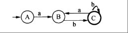

[toc]

# 软件设计师笔记_程序语言设计_考点

## 程序语言

- 低级语言：机器语言，如汇编语言。
- 高级语言：常见的有Java，C，C++，PHP，Python，Delphi等。

程序设计语言基本上可以分为命令式程序设计语言、函数式程序设计语言、面向对象程序设计语言和逻辑程序设计语言。

> 各程序设计语言特点

- 命令式程序设计语言的代表有：Fortran,Pascal和C语言等。
- 函数式程序设计语言的代表有Lisp、ML等。
- 面向对象程序设计语言的代表有C++、SmallTalk、Java等。
- 逻辑程序设计语言的代表有Prolog。

## 解释和编译

- 编译程序生成独立的可执行文件，运行效率高。
- 解释程序不生成可执行文件，控制源程序进行逐条解释执行。因此执行速度慢，效率低。

### 编译过程

顺序不可更换。词法分析 -> 语法分析 -> 语义分析 -> 中间代码生成 -> 代码优化 -> 目标代码生成。 

- 词法分析阶段是编译过程的第一个阶段，这个阶段的任务是对源程序从前到后（从左到右）逐个字符地扫描，从中识别出一个个“单词”符号（记号），并分析一个个符号是否符合程序语言的规定。
- 语法分析：在词法分析的基础上，根据语法规则将一个个单词符号分解成各个语法单位，如“表达式”“语句”等,并分析是否符合语法规则。
- 语义分析：根据语法分析的结果，分析各个表达式，各个语句。检查是否包含静态语义错误,不能发现程序中所有的语义错误。
- 中间代码生成：此阶段与具体机器无关。根据语义分析的结果，将源程序转换为一种中间表示形式，例如将源程序 “int a = 5 + 3;” 转换为中间代码形式可能是 “t1 = 5 + 3; a = t1;” 利于后续处理。
- 代码优化作用：对中间代码进行等价变换，旨在提高目标代码的运行效率，减少运行时间和空间开销 。
- 目标代码生成作用：此阶段与具体机器硬件紧密相关。把中间代码转换为特定机器上的代码。例如将中间代码转换为 x86 架构下的机器指令，让程序能在对应硬件上运行。

编译过程的中间代码生成和代码优化不是必要的，可省略。

> 词法分析

- 输入：源程序。
- 输出：记号流。

> 语法分析

- 输入：记号流。
- 输出：语法树。
- 语法分析阶段可以发现程序中所有的语法错误。

> 语义分析：

- 输入：语法树。
- 语义分析阶段可以发现静态语义错误。不能发现动态语义错误，动态语义错误运行时才能发现。有语义错误是可以编译成功的，例如a/0；这是符合语法的，也符合静态语义，编译器检验不出来这个是错的，只有运行才会报错，也就是动态语义，动态语义错误常见的有死循环。

一般程序中的错误可分为语法错误和语义错误（逻辑错误），语法错误是语句形式上的错误，语义错误是含义上的错误（即逻辑错误）。

> 语法分析的几种方法

- 自上而下语法分析：最左推导，从左至右。给定文法G和源程序串r。从G的开始符号s出发，通过反复使用产生式对句型中的非终结符进行替换(推导)，逐步推导出r。
- 递归下降思想：原理是利用函数之间的递归调用模拟语法树自上而下的构造过程，是一种自上而下的语法分析方法。
- 自下而上语法分析：最右推导，从右至左。从给定的输入串r开始，不断寻找子串与文法G中某个产生式P的候选式进行匹配，并用P的左部代替(归约)之，逐步归约到开始符号S。
- 移进-规约思想：设置一个栈，将输入符号逐个移进栈中，栈顶形成某产生式的右部时，就用左部去代替，称为归约。很明显，这个思想是通过右部来推导出左部，因此是自下而上语法分析的核心思想。

### 解释过程

如图是解释程序实现高级语言的三种方式

解释过程直接执行源程序（词法分析、语法分析、语义分析过程是有的，但是没有中间代码生成，也没有目标机器码代码），其最大的特点是不产生目标程序代码，并且程序每执行一次就要解释一次，运行效率低。

### 编译过程和解释过程的区别

- 编译方式：词法分析、语法分析、语义分析、中间代码生成、代码优化、目标代码生成。
- 解释方式：词法分析、语法分析、语义分析。

编译和解释都不可省略词法分析、语法分析、语义分析且顺序不可交换。

## 函数传值

- 传值调用：将实参的值传递给形参，实参可以是变量、常量和表达式。不可以实现形参和实参之间的双向传递数据。
- 传引用（地址）调用：将实参的地址传递给形参，形参必须有地址，实参不能是常量（值）、表达式。可以实现形参和实参间双向传递数据的效果，即改变形参的值同时也改变了实参的值。

## 表达式

在考试当中，该知识点的考查，通常形式是给出一个表达式的中缀表达形式（或前缀、后缀），让考生将其转换为前缀或后缀表达形式。

### 中缀表达式

中缀表达式：运算符位于操作数中间，是人们常用的算术表示方法，如 “(3 + 4) × 5 - 6”。

### 前缀表达式

前缀表达式：运算符位于操作数之前，也称为波兰式。如 “- × + 3 4 5 6” 是前缀表达式，等价于中缀表达式 “(3 + 4) × 5 - 6”。

### 后缀表达式

运算符位于操作数之后，也称为逆波兰式。如 “3 4 + 5 × 6 -” 是后缀表达式，等价于中缀表达式 “(3 + 4) × 5 - 6”。

> 记忆背诵方法如下：

- 记住 “前缀运算符在前，中缀运算符在中，后缀运算符在后” 这个关键区别，通过具体例子如 “+ 2 3”“2 + 3”“2 3 +” 来加深理解。
- 也要注意运算符的优先级。

## 文法

对于大多数通用程序设计语言，用（上下文无关文法 ）描述其语法即可。

### 文法案例题

[2013年下半年]
己知文法G: S→A0|B1，A→S1|1, B→S0|0,其中S是开始符号。从S出发可以推导出（ ）。

A 所有由0构成的字符串
B 所有由1构成的字符串
C 某些0和1个数相等的字符串
D 所有0和1个数不同的字符串

正确答案：C

本题考点：要求考生掌握根据给定的文法产生式（如本题中 \(S \to A0|B1\)、\(A \to S1|1\)、\(B \to S0|0\) 这些产生式规则 ）进行推导，通过不断替换非终结符（S、A、B 为非终结符 ）来得到终结符组成的字符串（由 0 和 1 组成 ）。语言与文法关系理解：理解文法所定义的语言，即从开始符号 S 出发，通过推导能够得到的所有字符串的集合。考生需要分析推导过程中字符串的特征，从而判断文法所产生的语言类型。

解题思路
- 对选项 A 分析：若要得到仅由 0 构成的字符串，从给定文法推导，由于产生式中有 A 相关产生式会引入 1（如 \(A \to S1|1\) ），B 相关产生式也会引入与 1 相关的推导路径（因为 \(B \to S0|0\) 且 S 可推导到含 1 的式子 ），所以无法只推导出全是 0 的字符串，A 选项错误。
- 对选项 B 分析：同理，因为有产生式会引入 0（如 \(B \to S0|0\) ） ，所以不能只推导出全是 1 的字符串，B 选项错误。
- 对选项 C 分析：例如 \(S \to A0\)，\(A \to 1\) 时得到 10 ；\(S \to B1\)，\(B \to 0\) 时得到 01 ；还可以进一步推导如 \(S \to A0\)，\(A \to S1\)，\(S \to B1\)，\(B \to 0\) ，得到 0110 等，能推导出一些 0 和 1 个数相等的字符串，C 选项正确。
- 对选项 D 分析：由前面 C 选项的推导可知，能得到 0 和 1 个数相等的字符串，并非所有 0 和 1 个数不同的字符串，D 选项错误。

记忆方法：把文法推导想象成一种规则游戏，产生式就是游戏规则，非终结符是可替换的 “牌”，通过不断按照规则替换 “牌”（非终结符 ）得到最终的 “牌面”（终结符字符串 ） 。这样能帮助理解推导过程，而不是死记硬背规则。

## 有限自动机

主要有五个符号集，由上图示例，可知用状态来表示十分清晰，由s输入一个0，可得出B，依次类推.

一般考试，给出一个状态图，问能否构造出001这样的字符串，解决方法就是从起始s到终点f之间是否有一条路，权值为001。本质就是有向图从起点到终点的遍历。

- 确定的有限自动机和不确定的有限自动机：输入一个字符，看是否能得出唯一的后继，若能，则是确定的，否则若得出多个后继，则是不确定的。

### 案例1

[2018年下半年]
下图所示为一个不确定有限自动机（NFA）的状态转换图。该NFA可识别字符串（ ）。

A 0110
B 0101
C 1100
D 1010

正确答案：A

主要考查点如下：
不确定有限自动机（NFA）的状态转换：要求考生理解 NFA 状态转换图中节点（状态）和边（状态转换条件，包括输入字符和\(\varepsilon\)转换 ）的含义。根据输入字符串，依据状态转换规则在图中进行状态转移，判断能否从初始状态到达终态。

\(\varepsilon\)转换的处理：\(\varepsilon\)转换是 NFA 的一个特性，即不需要输入字符就可以进行状态转移。考生需要掌握在状态转移过程中如何处理\(\varepsilon\)转换，这是准确判断 NFA 识别字符串能力的关键。

解题思路
- 对于选项 A（0110）：从初始状态0开始，输入字符0，根据状态转换图可转移到状态1。接着有\(\varepsilon\)转换，可从状态1转移到状态2。输入字符1，从状态2转移到状态3。又有\(\varepsilon\)转换，从状态3转移到状态4。再输入字符1，仍在状态4（因为状态4输入1无明确转移，可认为保持在状态4 ） ，之后有\(\varepsilon\)转换到状态4 。最后输入字符0，从状态4转移到终态5 ，所以该 NFA 能识别字符串0110 。
- 对于选项 B（0101）：按照上述状态转移方式，当输入到最后一个字符1时，无法从当前状态转移到终态5 ，所以该 NFA 不能识别此字符串。
- 对于选项 C（1100）：从初始状态0开始，输入第一个字符1时，没有从状态0输入1的转移路径，所以该 NFA 不能识别此字符串。
- 对于选项 D（1010）：同样，从初始状态0开始，输入第一个字符1时，没有从状态0输入1的转移路径，该 NFA 不能识别此字符串。

记忆方法
图形化理解：把 NFA 的状态转换图当作地图，状态是地点，边是路径，输入字符是沿着路径行走的指令。\(\varepsilon\)转换就像是不需要特定指令就能走的 “秘密通道”。这样形象化的理解有助于记忆状态转移规则。

### 案例2

[2016年上半年]
某确定的有限自动机（DFA）的状态转换图如下图所示（A是初态，C是终态），则该DFA能识别（ ）。

A aabb
B abab
C baba
D abba

解题思路
- 对于选项 A（aabb）：从初始状态A开始，输入第一个字符a，根据状态转换图，转移到状态B。输入第二个字符a，在状态B下，输入a又回到状态B。输入第三个字符b，从状态B转移到状态C。输入第四个字符b，在状态C下，没有输入b的转移路径，所以该 DFA 不能识别字符串aabb。
- 对于选项 B（abab）：从初始状态A开始，输入第一个字符a，转移到状态B。输入第二个字符b，从状态B转移到状态C。输入第三个字符a，在状态C下，输入a转移回状态B。输入第四个字符b，从状态B转移到状态C，最终到达终态C，所以该 DFA 能识别字符串abab。
- 对于选项 C（baba）：从初始状态A开始，输入第一个字符b，在状态A下没有输入b的转移路径，所以该 DFA 不能识别字符串baba。
- 对于选项 D（abba）：从初始状态A开始，输入第一个字符a，转移到状态B。输入第二个字符b，从状态B转移到状态C。输入第三个字符b，在状态C下，没有输入b的转移路径，所以该 DFA 不能识别字符串abba。

## 正则表达式

## 真题

- 在 Python 语言中，语句x=（1）不能定义一个元组。x=(1,)可以定义为一个元组。
- 关于 Python 语言的叙述中，不正确的是（ 可以用if...else和switch...case语句表示选择结构 ）
- 某python程序中定义了X=【1，2】，那么X*2的值为（ 【1，2，1，2】 ）
- Python 中采用（ type（） ）方法来获得一个对象的类型。
- 在Python语言中，（ tuple（元组） ）是一种不可变的、有序的序列结构，其中元素可以重复
- Java语言符合的特征有（采用即时编译， 对象在堆空间分配）和自动的垃圾回收处理。
- 在运行时将调用和响应调用所需执行的代码加以结合的机制是（动态绑定 ）。
- 对布尔表达式`a or ((cb<c) and d)`求值时，（ a为true ）时可进行短路计算。
- 以下关于程序设计语言的叙述中，错误的是（  程序中局部变量的值在运行时不能改变 ）。
- 更适合用来开发操作系统的编程语言是（ C/C++ ）。
- 在高级语言源程序中，常需要用户定义的标识符为程序中的对象命名，常见的命名对象有（ ②变量③函数④数据类型 ）
- 以下关于传值调用与引用调用的叙述中，正确的是（在传值调用方式下，实参可以是变量，也可以是常量和表达式。在引用调用方式下，可以实现形参和实参间双向传递数据的效果 ）。
-  （ Lisp ）是一种函数式编程语言。
- 己知文法G: S→A0|B1，A→S1|1, B→S0|0,其中S是开始符号。从S出发可以推导出（  某些0和1个数相等的字符串 ）。
- 在仅由字符a、b构成的所有字符串中，其中以b结尾的字符串集合可用正则表达式为（ (a|b)*b ）。
- 用C/C++语言为某个应用编写的程序，经过（ 预处理、编译、汇编、链接 ）后形成可执行程序。
- C程序中全局变量的存储空间在（静态数据区）分配。
- 在程序运行过程中，（ 将整型变量与浮点型变量相加 ）时涉及整型数据转换为浮点型数据的操作。
- 在对高级语言源程序进行编译的过程中，为源程序中变量所分配的存储单元的地址属于（逻辑地址 ）。
- 在程序的执行过程中，系统用（ 栈 ）实现嵌套调用(递归调用)函数的正确返回。
- 以下关于可视化程序设计的叙述中，错误的是（ 可视化程序设计使开发应用程序无需编写程序代码 ）。

- 面向对象程序设计语言C++、JAVA中，关键字（ this ）可以用于区分同名的对象属性和局部变量名。
- 一个类中可以拥有多个名称相同而参数表（参数类型或参数个数或参数类型顺序） 不同的方法，称为（方法重载 ）。
- 某些程序设计语言中，在运行过程中当一个对象发送消息请求服务时，根据接收对象的具体情况将请求的操作与实现的方法进行连接，称为 （  动态绑定 ） 。
- 多态分为参数多态、包含多态、过载多态和强制多态四种不同形式，其中（ 包含 ）多态在许多语言中都存在，最常见的例子就是子类泛型化。
- 采用继承机制创建子类时，子类中（可以有新的属性和行为 ）。
- 聚合对象是指一个对象（ 包含其它对象 ）。
- 同一消息可以调用多种不同类的对象的方法，这些类有某个相同的超类，这种现象是（ 多态 ）。
- 以下关于实现高级程序设计语言的编译和解释方式的叙述中，正确的是 （ 在编译方式下产生源程序的目标程序，在解释方式下不产生 ） 。
- 计算机执行程序时，内存分为静态数据区、代码区、栈区和堆区。其中（ 栈区 ）一般在进行函数调用和返回时由系统进行控制和管理，（ 堆区 ）由用户在程序中根据需要申请和释放。
- 移进—归约分析法是编译程序（或解释程序）对高级语言源程序进行语法分析的一种方法，属于（ 自底向上（或自下而上） ）的语法分析方法。
- 编译过程中进行的语法分析主要是分析（  程序语句的结构是否合法 ）。
- 将高级语言程序翻译为机器语言程序的过程中，常引入中间代码，其好处是（ 利于进行与机器无关的优化处理 ）。
- 在Python3中，表达式list（ range （ ） 【10:0:-2】 的值为（  [10,8,6,4,2] ）。
- 对高级语言源程序进行编译的过程中，有限自动机(NFA或DFA)是进行（ 词法分析 ）的适当工具。
- 己知文法G: S→A0|B1，A→S1|1, B→S0|0,其中S是开始符号。从S出发可以推导出（ 某些0和1个数相等的字符串 ）。
- 对于大多数通用程序设计语言，用（上下文无关文法 ）描述其语法即可。
