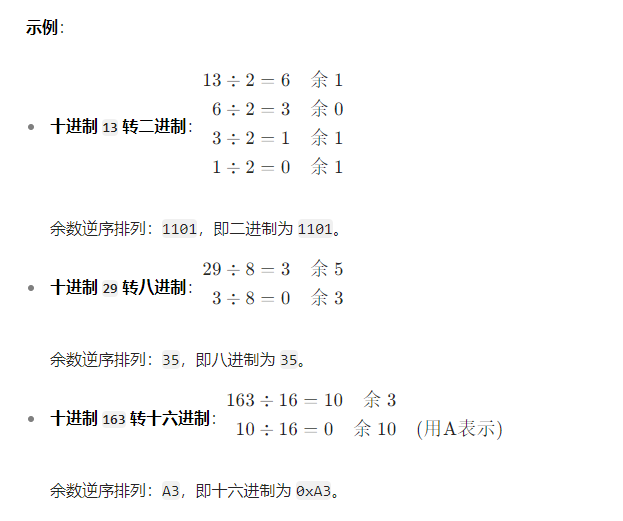
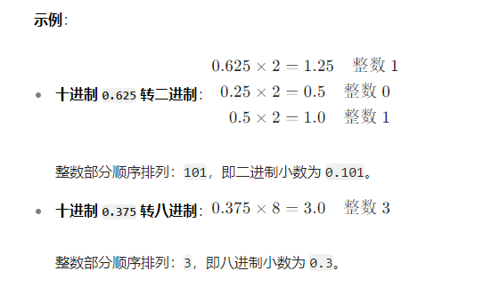
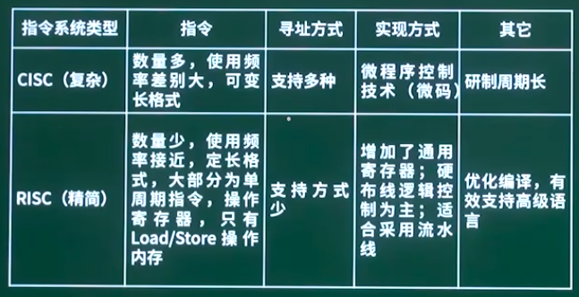

[toc]

# 软件设计师笔记_第一章_计算机系统组成_考点

## 进制转换

### 十进制数转换为非十进制数

在软考中，十进制数转换为非十进制数（如二进制、八进制、十六进制）的方法是除基取余法（整数部分）和乘基取整法（小数部分）。

例如十进制 转换 二进制
- 整数部分：使用除基取余法。即整数不断除2，直至商为0，然后将余数逆序输出。
- 小数部分：采用乘基取整法。即将小数不断乘以2，记录整数部分，直至小数部分为0为止。然后将整数部分正序输出。

> 十进制整数转非十进制

- 步骤1 除基取余：将十进制整数不断除以目标进制的基数（二进制为 2，八进制为 8，十六进制为 16），记录每次的余数。
- 步骤2 逆序排列余数：直到商为 0，将余数从最后一次到第一次依次排列，即为转换结果。

> 十进制小数转非十进制

1. 乘基取整：将十进制小数不断乘以目标进制的基数，记录每次乘积的整数部分。
2. 顺序排列整数部分：直到小数部分为 0 或达到所需精度，将整数部分从第一次到最后一次依次排列，即为转换结果。

> 带小数的十进制数转换

1. 整数部分：用除基取余法转换。
2. 小数部分：用乘基取整法转换。
3. 合并结果：将整数部分和小数部分用小数点连接。

### 非十进制数转换为十进制数

在软考中，非十进制数（如二进制、八进制、十六进制）转换为十进制数的方法是按位权展开相加法。

位权相加法：将二进制的每一位乘以二进制的对应位权（从2的0次方开始），然后求和，即可得到二进制对应的十进制。

> 二进制转十进制

- 方法： 从右往左，将二进制数每一位的值（0 或 1）乘以对应位权（2 的幂次），然后求和。

- 位权计算：从右往左，第一位为 \(2^0\)，第二位为 \(2^1\)，依此类推。

例子：
- 二进制数 1011 转换为十进制：\(1 \times 2^0 + 1 \times 2^1 + 0 \times 2^2 + 1 \times 2^3 = 1+ 2+ 0 + 8 = 11\)

> 八进制转十进制

- 方法：从右往左，将八进制数每一位的值（0-7）乘以对应位权（8 的幂次），然后求和。

- 位权计算：从右往左，第一位为 \(8^0\)，第二位为 \(8^1\)，依此类推。

例子：
- 八进制数 35 转换为十进制：\(5 \times 8^0 + 3 \times 8^1 = 5 + 24= 29\)

> 十六进制转十进制

- 方法：从右往左，将十六进制数每一位的值（0-9，A-F 表示 10-15）乘以对应位权（16 的幂次），然后求和。
- 位权计算：从右往左，第一位为 \(16^0\)，第二位为 \(16^1\)，依此类推。

例子：
- 十六进制数 0xA3 转换为十进制：\( 3 \times 16^0 + A \times 16^1 = 3 + 10 \times 16= 160 + 3 = 163\)

> 带小数的非十进制数转换

- 方法：整数部分和小数部分分别按位权展开，再相加。

- 整数部分：从右往左，位权为 \(基数^0, 基数^1, \dots\)

- 小数部分：从左往右，位权为 \(基数^{-1}, 基数^{-2}, \dots\)

示例：二进制数 101.11 转换为十进制
- 整数部分：\(1 \times 2^0 + 0 \times 2^1  + 1 \times 2^2 = 1 + 0 + 4 = 5\)
- 小数部分：\(1 \times 2^{-1} + 1 \times 2^{-2} = 0.5 + 0.25 = 0.75\)
- 总和：\(5 + 0.75 = 5.75\)

## 原码，反码，补码，移码

原码：在一串二进制机器数中，数的最高位是符号位。其中0为正符号位，1为负符号位。其余位是绝对值部分。

反码：正数的反码与原码相同。负数的反码中绝对值部分相比原码是按位取反的。

补码：正数的补码与原码相同，负数的补码等于其对应反码的末尾加1。

移码：只要将补码的符号位取反，就可以得到对应的移码表示。

## 校验码-海明码

海明码可以检错也可以纠错。奇偶校验码和CRC循环冗余校验码方法可以检错，但不能纠错。

海明码公式： 2^k >= n+k+1 其中数据位是n，校验位是k

> 例题1 2023年上半年

设信息位是8位，用海明码来发现并纠正1位出错的情况，则校验位的位数至少为（ ）

海明码中数据位是n，校验位是k，则n和k必须满足以下关系：2^k >= n+k+1。

本题中信息为位数是8，代入不等式进行计算，r>=4，因此校验位的位数至少为4位

## 计算机组成

计算机的基本硬件系统主要由运算器、控制器、存储器、输入设备和输出设备五大部件组成。

- 运算器和控制器集成在一起称为中央处理单元（CPU）。负责数据的加工处理，能完成各种算术，逻辑运算以及控制功能。
- 存储器是计算机系统中的记忆设备，分为内部存储器和外部存储器。
    - 内部存储器（内存）（速度高，容量小）：临时存放程序、数据及中间结果。
    - 外部存储器（外存）（速度慢，容量大）：长期保存程序和数据。
- 输入设备和输出设备合称为外部设备
    - 输入设备用于输入原始数据及各种命令
    - 输出设备则用于输出计算机的运行处理结果。

### CPU组成

CPU主要由运算器、控制器、寄存器组和内部总线等部件组成。

运算器的组成：
- 1）算术逻辑单元（ALU）：负责 对数据的算术运算和逻辑运算。
- 2）累加寄存器（AC）：是一个通用寄存器。负责暂存算术运算或逻辑运算的中间运算结果。
- 3）数据缓冲寄存器（DR）：写内存时，暂存指令或数据字或操作数。
- 4）状态条件寄存器（PSW）：保存指令执行后的状态。

控制器的组成：
- 程序计数器PC：存储下一条要执行指令的地址。
- 指令寄存器IR：存储即将执行的指令。
- 指令译码器：对指令中的操作码字段进行分析。
- 时序部件：提供时序控制信号。

## 寻址方式

- 立即寻址：操作数在指令中的寻址方式。
- 寄存器寻址：操作数在寄存器中的寻址方式。
- 直接寻址：操作数的地址在指令中的寻址方式。
- 寄存器间接寻址：操作数的地址在寄存器中的寻址方式。
- 间接寻址：操作数的地址的地址在指令中的寻址方式。

> 存储器中各个寻址方式的速度对比：

立即寻址 > 寄存器寻址 > 直接寻址 > 寄存器间接寻址 > 间接寻址

## 指令系统

### CISC与RISC

CISC 全称为Complex Instruction Set Computing 复杂指令集。

CISC的指令种类多，指令复杂度高，寻址方式复杂，通用寄存器数量一般，不支持流水线技术。采用微程序控制技术实现译码。

RISC 全称为Reduced Instruction Set Computer，精简指令集。

RISC的指令种类少，指令复杂度低，寻址方式固定，通用寄存器数量大量，支持流水线技术。采用硬布线控制逻辑来实现译码。

### 流水线

流水线执行指令时间的公式 T = NT + (K-1)t

- NT是第一条指令执行的完整时间。
- t 是流水线中耗时最长的哪个部分的时间。
- k 是流水线中一共需要执行的指令数。

流水线的吞吐率公式 = 总的指令数 / (流水线执行指令时间) = 总的指令数 / ( NT + (K-1)t )

### 输入输出技术

程序控制（查询）方式：分为无条件传送和程序查询方式。方法简单，硬件开销小，但I/O能力不高，严重影响CPU的利用率。

程序中断方式：与程序控制方式相比，中断方式因为CPU无需等待而提高了传输请求的响应速度。

### DMA

DMA全称是直接内存存取。是指通过DMA硬件来控制内存和设置的数据交换，这种方式可以不需要CPU处理。即绕过了CPU来进行数据交换的方式。

DMA方式是为了在主存与外设之间实现高速、批量数据交换而设置的。DMA方式比程序控制方式与中断方式都高效。

### 总线

- 数据总线：用于传输数据的，双向的
- 地址总线：用于传输CPU发出的地址数据的。
- 控制总线：用于传输控制信号的

## 系统可靠性

### 串联系统

如果一个系统R，由于各个子系统R1...Rn组成。

那么串联系统的可靠性等于各个子系统的可靠性乘积。即 R = R1 * R2 * ....Rn

串联系统的失效率等于各个子系统的失效率的和。即A = A1+...An

### 并联系统

并联系统的可靠性等于1减去各个子系统的不可靠性的乘积。即 1 -（1-R1）（1-R2）...(1-Rn)

### 可靠性公式

可靠性是指一个系统对于给定的时间间隔内、在给定条件下无失效运作的概率。

可靠性公式 MTTF/（1+MTTF），其中MTTF为平均无故障时间。

### 可用性公式

可用性是在给定的时间点上，一个系统能够按照规格说明正确运作的概率。

可用性公式 MTBF/（1+MTBF），其中MTBF为平均失效间隔时间。

### 可维护性公式

可维护性是在给定的使用条件下，在规定的时间间隔内，使用规定的过程和资源完成维护活动的概率。

可维护性公式 1/（1+MTTR），其中MTTR为平均修复时间。

## 存储系统

### 存储器的分类

计算机系统中可能包括各种存储器。下面是存储器的分类方式。

- 按访问方式：按地址访问的存储器、按内容访问的存储器。
    - 相联存储器Cache 是一种按内容访问的存储器。
- 按储存器所处位置：内存,外存。
    - 内存：又名主存，存放运行所需要的数据和程序。
    - 外存：又名辅存，存放不参与运行的数据。在需要的适合会调入内存中。
    - 主存与辅存的交互由硬件和软件共同实现的。
- 按存储器的构成材料：磁存储器，半导体存储器，光存储器。
- 按存储器的工作方式：读/写存储器 , 只读存储器等。
    - 读写存储器（RAM）：既能读取数据也能写入数据。
    - 固定只读存储器（ROM）：内容只能读出，不能改变。
    - 可编程的只读存储器（PROM）：其中的内容可以由用户一次性地写入，写入后不能改变。
    - 闪速存储器（FM）：又名闪存。
- 按寻址方式：随机存储器，顺序存储器，直接存储器等。
    - 随机存储器（Random Access Memory,RAM）读取和写入数据的时间是相同的。
    - 顺序存储器（Sequent Access Memory,SAM）读取和写入数据，与存储位置相关。
    - 直接存储器 (DAM) 介于随机存储器和顺序存储器之间。

### 高速缓存（Cache）

在计算机的存储系统体系中，Cache是（除寄存器以外）访问速度最快的。主要解决CPU与主存之间速度容量不匹配问题。

> 高速缓存（Cache）的特点

在计算机中Cache的访问速度是最快的层次（若有寄存器，则寄存器最快）

- 高速缓存（Cache）位于 CPU 与主存之间；其组成部分分为 控制部分，存储部分。
- 高速缓存（Cache）与 主存的交互完全由硬件自动完成的。
- 高速缓存（Cache）的容量一般在几千字节到几兆字节之间；速度一般比主存快 5～10 倍，由快速半导体存储器构成；
- 高速缓存（Cache）的内容是主存的部分副本，对程序员来说是透明的。

> 高速缓存（Cache）的各种地址映像方法

由于高速缓存Cache中的内容是与主存的内容是一一映像的。因此有多种地址映像方法。

高速缓存中的地址映像方法如下：
- 直接映像：是指主存的块与Cache块的对应关系是固定的。优点是地址变换简单，缺点是灵活性差，Cache块冲突率高。
- 全相联映像：允许主存的任一块可以调入Cache存储器的任何一个块的空间中。优点是Cache块冲突率低、灵活性好。缺点是访问速度慢、地址变换较复杂、成本太高。
- 组相联映像：是前两种方式的折中方案，即组采用直接映像方式、块采用全相联映像方式。

发生块冲突从少到多的顺序：全相联映射-->组相联映射-->直接映射。

多级Cache：在多级Cache计算机中分为一级(L1Cache)，二级(L2Cache)等。

Cache的命中率与Cache容量的关系是：容量越大，命中率越高。

### 内存编址计算 *****

暂无

## 计算机安全

### 加密算法

- 常见的对称加密算法包括：DES，3DES，RC-5，IDEA，AES等
    - 优点：加密解密速度块。但是只能对大数据量进行加解密。
    - 缺点：加密强度不高。容易被暴力穷举破解。
- 常见的非对称加密算法包括：RSA，ECC等。
    - 优点：加密强度高。
    - 缺点：加密解密速度极慢。只能对小数据量进行加解密。
- 常见的信息摘要算法包括：SHA，MD5，HMAC等。

ECC、DSA和RSA均属于公开密钥加密算法，DES是共享密钥加密算法。

DES加密算法的密钥长度为56位。

X.509是国际密码学里公钥证书的格式标准，推荐使用的密码算法是RSA。

国密SM2数字证书采用的公钥密码算法是ECC基于椭圆曲线的公钥密码算法。

RSA是一种非对称加密算法，在用户或者机构之间进行身份认证方面有较好的应用；常用于数字签名

SHA-1是一种安全散列算法，常用于对接收到的明文输入产生 160位固定长度的输出，来确保明文在传输过程中不会被篡改；

MD5是一种使用最为广泛的报文摘要算法；输出128位加密的摘要

RC-5是一种用于对明文进行加密的算法，适用于大量明文进行加密并传输。

计算机感染特洛伊木马后的典型现象是有未知程序试图建立网络连接

有效防治计算机病毒的策略是安装井及时升级防病毒软件。

### 加密技术应用

数字信封：用接收方公钥加密使用的对称密钥。

数字签名：用发送方私钥签名，保证发送方身份真实性，发送者不可抵赖。与信息摘要结合，可防篡改。

信息摘要：单向散列值函数，防篡改，保证消息完整性。

### 数字证书

数字证书的内容包括：CA签名、用户信息（用户名称）、用户公钥等。

证书中的CA签名验证数字证书的可靠性、验证网站真伪。

用户公钥：客户端利用证书中的公钥加密，服务器利用自己的私钥解密。
