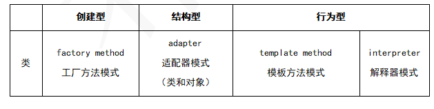
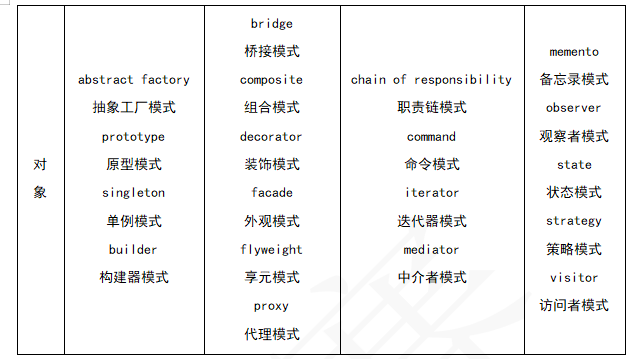
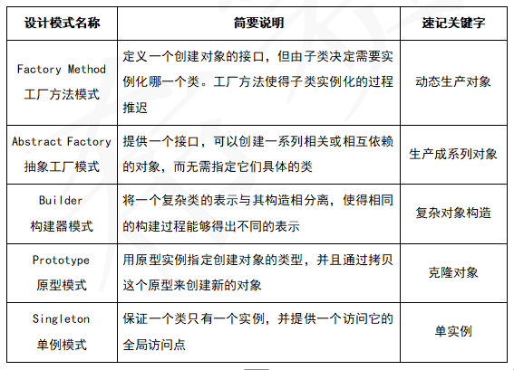
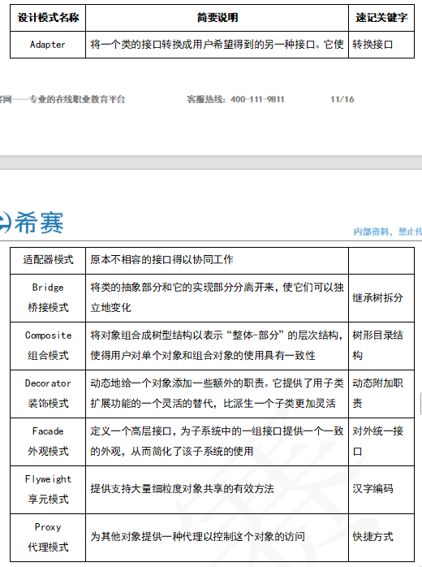
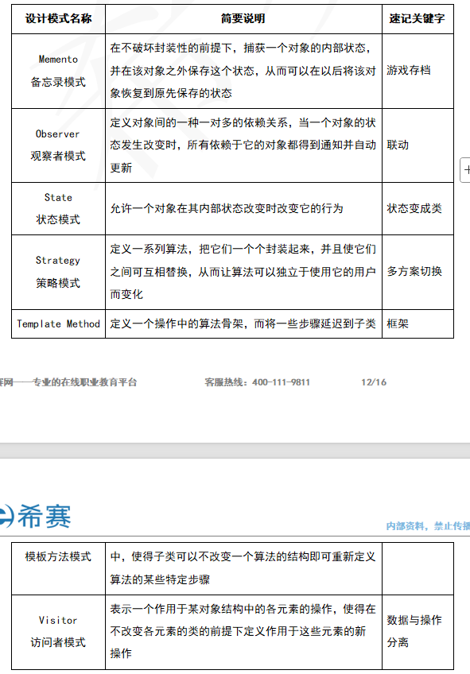
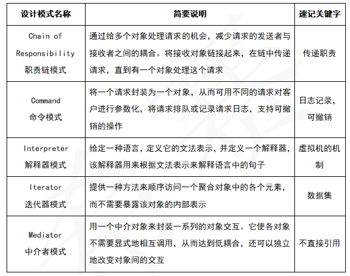

[toc]

# 软件设计师笔记_第七章_面向对象_精简考点

## 基本

- 消息和消息通信：对象之间进行通信的一种方式叫做消息。消息是异步通信的。
- 重置/覆盖：在子类中重新定义父类中已经定义的方法。
- 重载：一个类可以有多个同名而参数类型不同的方法。
- 动态绑定：根据接收对象的具体情况将请求的操作与实现的方法进行连接（运行时绑定）。
- 多态：不同对象收到同样的消息产生不同的结果（软设一般只涉及过载多态。即同一个名字在不同的上下文中所代表的含义不同）。

## 类的类型

类可以分为三种类型，分别是实体类、边界类和控制类。
- 实体类：代表实体对象
- 控制类：描述一个用例所具有的事件流控制行为，控制一个用例中的事件顺序。通常情况下，控制类没有属性，但一定有方法。
- 边界类： 描述外部参与者与系统之间的交互。常见的边界类有窗口、通信协议、打印机接口、传感器和终端等。

## 类图关系

类与类之间的关联关系可分为依赖、关联、聚合、组合和继承5种

- 依赖关系：若类A的方法中仅仅使用了类B的对象，那么类A依赖于类B。
- 泛化关系：泛化是一个类与它的一个或多个细化类之间的关系，表达一般与特殊的关系。
- 关联关系：关联是类与类之间，对象与对象之间的一种结构关系。
- 聚合关系：整体与部分的生命周期不同。购物车与商品是整体与部分的关系，购物车包含了商品，但是商品可以脱离购物车独立存在，这是一种聚合关系。
- 组合关系：整体与部分的生命周期相同。网店与商品之间是一种整体与部分的关系，商品是网店的一部分，如果网店不存在了，那么网店中的商品也不存在，它们之间是组合关系。
- 实现关系：接口与类之间的关系。

- 聚集关系：若其中一个较大的整体类包含一个或多个较小的部分类；则大类和小类是聚集关系。

组合是一种很强的"拥有"关系，"部分"和"整体"的生命周期通常一样。整体对象完全支配其组成部分，包括它们的创建和销毁等;

聚合同样表示"拥有"关系，但"部分"对象的生命周期也可以与"整体"对象不同，甚至"部分"对象可以脱离"整体"对象而单独存在。

## 面向对象

- 单一职责原则:设计目的单一的类。
- 开放封闭原则:对扩展开放，对修改封闭。
- 里氏替换原则:子类可以替换父类。
- 依赖倒置原则:要依赖于抽象，而不是具体实现;要针对接口编程，不要针对实现编程。
- 接口分离原则:不强迫客户依赖于他们不用的方法。
- 共同封闭原则：包中的所有类对于同一类性质的变化应该是共同封闭的。一个变化若对一个包产生影响，则将对该包中的所有类产生影响，而对于其他的包不造成任何影响。
- 共同重用原则：一个包中的所有类应该是共同重用的。如果重用了包中的一个类，那么就要重用包中的所有类。

## 多态

多态有不同的形式，分为参数多态、包含多态、过载多态和强制多态四种。
- 参数多态 通过给出不同的类型参数，使得一个结构有多种类型;
- 包含多态是指同样的操作可用于一个类型及其子类型，即子类型化:
- 过载多态是指同一个名字在不同上下文中可代表不同的含义；
- 强制多态是指通过语义操作把一个变量的类型加以变换。

## UML

### 事物

UML 中有四种事物。
- 结构事物：模型的静态部分，如类、接口、用例、构件等。
- 行为事物：模型的动态部分，如交互、活动、状态机。
- 分组事物：模型的组织部分，如包
- 注释事物：模型的解释部分，依附于元素之上对其进行约束或解释的简单符号。

### 关系

UML 中有四种关系
- 依赖：一个事物的语义依赖于另一个事物的语义的变化而变化。
- 关联：是一种结构关系，描述了一组对象之间的连接。
- 泛化：一般/特殊的关系，子类和父类之间的关系。
- 实现：一个类元指定了另一个类元保证执行的契约

其中关联分为组合和聚合,都是部分和整体的关系，其中组合之间关系更强。

- 聚合体现的是整体与部分、拥有的关系，即has-a的关系，此时整体与部分之间是可分离的。
- 组合同样体现整体与部分间的关系，是一种con-tains-a的关系，这种关系比聚合更强。它但此时整体与部分是不可分的。

### 图

- 类图：描述系统中的对象、接口、类之间的关系，是系统的静态设计视图。
- 对象图：描述对象之间的关系。对象图描述了在类图中所建立的对象的静态快照。
- 用例图：描述系统与外部系统及用户的交互。从用户使用系统的角度对系统进行了划分；
- 序列图：描述了对象如何通过消息互相交互，说明了消息如何在对象之间被发送和接收以及发送的顺序。。
- 通信图：不强调时间顺序，只强调事件之间的通信。
- 状态图：用于对一个特定对象的动态行为建模，说明了一个对象的生命周期——对象可以经历的各种状态，以及引起对象从一个状态向另一个状态转换的事件。
- 活动图：是一种特殊的状态图，描述一个业务过程或者一个用例的活动的顺序流。
- 构件图：描述系统的物理结构，它可以用来显示程序代码如何分解成模块。
- 部署图：描述系统中硬件和软件的物理架构，它描述构成系统架构的软件构件、处理器和设备。
- 顺序图：是一种交互图，它由一组对象或参与者以及它们之间可能发送的消息构成。顺序图是强调消息的时间次序的交互图。

UML图中
- 关联关系是普通直线。
- 依赖关系是虚线。
- 聚集关系是黑色方块线。
- 组合关系是黑色三角线。
- 泛化关系是白色三角线。

## 设计模式

> 设计模式的类别

1. 创建型模式：主要抽象了实例化过程,用于帮助系统如何创建对象。
2. 结构型模式：主要处理类和对象的组合
3. 行为型模式：主要涉及算法和对象间职责的分配。行为设计模式不仅描述对象或类的模式，还描述了它们之间的通信模式。

### 各个设计模式的应用场景

创建型设计模式的应用场景

结构型设计模式应用场景

行为型设计模式应用场景

- 代理模式：通过提供与对象相同的接口来控制对这个对象的访问，以使得在确实需要这个对象时才对它进行创建和初始化。
- 中介者模式：用一个中介对象来封装一系列的对象交互。它使各对象不需要显式地相互调用，从而达到低耦合，还可以独立地改变对象间的交互。如使一个后端数据模型能够被多个前端用户界面连接，采用此模式最合适。

## 真题

- 在面向对象设计时，如果重用了包中的一个类，那么就要重用包中的所有类，这属于（ 共同重用 ）原则。
- 在领域类模型中不包含（ 领域对象 ）。
- 在面向对象方法中，两个及以上的类作为一个类的父类时，称为（ 多重继承 ），使用它可能造成子类中存在（ 二义性 ）的成员。
- （ 泛化  ） 是一个类与它的一个或多个细化类之间的关系，即一般与特殊的关系。
- 在面向对象的系统中，对象是运行时实体，其组成部分不包括（ 消息 ）；一个类定义了一组大体相似的对象，这些对象共享（ 属性和行为 ）。
- 采用面向对象方法进行系统开发时，以下与新型冠状病毒有关的对象中，存在“一般-特殊’关系的是（  确诊病人和治愈病人 ）。
- 对象的（ 状态 ）标识了该对象的所有属性(通常是静态的)以及每个属性的当前值(通常是动态的)。
- 在面向对象方法中，支持多态的是（ 动态绑定 ）。
- （  过载 ）多态是指操作（方法）具有相同的名称、且在不同的上下文中所代表的含义不同。
- 采用面向对象方法进行系统开发时，需要对两者之间关系创建新类的是（  医生和病人 ）。
- 对采用面向对象方法开发的系统进行测试时，通常从不同层次进行测试。测试类中定义的每个方法属于（ 算法 ）层。
- 在下列机制中，（ 动态绑定 ）是指过程调用和响应调用所需执行的代码在运行时加以结合；而（ 静态绑定 ）是过程调用和响应调用所需执行的代码在编译时加以结合。
- 采用面向对象方法进行软件开发，在分析阶段，架构师主要关注系统的（ 行为 ）。
- 进行面向对象系统设计时，修改某个类的原因有且只有一个，即一个类只做一种类型的功能，这属于（ 单一责任 ）原则。

- 在面向对象方法中,多态指的是（ 客户类无需知道所调用方法的特定子类的实现 ）。
- 以下关于面向对象继承的叙述中，错误的是（ 继承仅仅允许单重继承，即不允许一个子类有多个父类 ）。

> UML

- 在UML用例图中，参与者表示（  人、硬件或其他系统可以扮演的角色 ）。
- UML中关联是一个结构关系，描述了一组链。两个类之间（  可以有多个由不同角色标识的 ）关联。
- 在UML图中，（ 部署 ）图用于展示所交付系统中软件组件和硬件之间的物理关系。
- 对一个复杂用例中的业务处理流程进行进一步建模的最佳工具是UML （ 活动图 ） 。
- UML包图展现由模型本身分解而成的组织单元及其依赖关系，以下关于包图的叙述中，不正确的是（ 一个元素可以被多个包拥有 ）。
- UML构件图(component diagram)展现了一组构件之间的组织和依赖，专注于系统的静态（  实现 ）视图，图中通常包括构件、接口以及各种关系。

> 设计模式

- 为图形用户界面（GUI）组件定义不同平台的并行类层次绩构，适合采用（  抽象工厂 ）模式。
- （  策略 ）模式定义一系列的算法，把它们一个个封装起来，并且使它们可以相互替换，使得算法可以独立于使用它们的客户而变化。
- 以下关于 单例 模式的描述中，正确的是（ 它能够保证一个类只产生唯一的一个实例  ） 。
- （ 观察者 ）设计模式能使一个对象的状态发生改变时通知所有依赖它的监听者。
- 在发布-订阅消息模型中，订阅者订阅一个主题后，当该主题有新消息到达时，所有订阅者都会收到通知。（ 观察者 ）设计模式最适合这一模型。
- （ 命令 ）设计模式将一个请求封装为一个对象，从而使得可以用不同的请求对客户进行参数化，对请求排队或记录请求日志，以及支持可撤销的操作。
- 欲使一个后端数据模型能够被多个前端用户界面连接，采用（ 中介者 ）模式最适合。
- 某旅游公司欲开发—套软件系统，要求能根据季节，节假日等推出不同的旅行定价包，如淡季打折、一口价等。实现该要求适合采用（ 策略 ）模式，该模式的主要意图是（ 定义一系列的算法，把它们一个个封装起来，并且使它们可以相互替换 ）
- 因使用大量的对象而造成很大的存储开销时，适合采用（ 享元 ）模式进行对象共享，以减少对象数量从而达到较少的内存占用并提升性能。
- 某公司欲开发一个软件系统的在线文档帮助系统，用户可以在任何一个查询上下文中输入查询关键字，如果当前查询环境下没有相关内容，则系统会将查询按照一定的顺序转发给其他查询环境。基于上述需求，采用（ 责任链模式 ）最为合适。
    - 在责任链模式中，很多对象由每一个对象对其下家的引用而连接起来形成一条链。请求在这个链上传递，直到链上的某一个对象决定处理此请求。