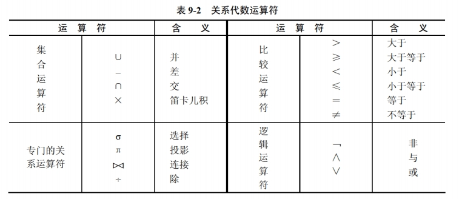

[toc]

# 软件设计师笔记_第九章_数据库系统_精简考点

## 数据库三级模式两级映像

三级模式：外模式-视图；概念模式-基本表；内模式-物理文件。

两级映像：
- 外模式-概念模式映射，保证数据逻辑独立性，即数据的逻辑结构发生变化后，用户程序也可以不修改。只需要修改外模式和概念模式之间的映像。
- 概念模式-内模式映射，保证数据物理独立性，即当数据的物理结构发生改变时，应用程序不用改变。只需要修改概念模式和内模式之间的映像。

## E-R图

> E-R 模型图

E-R 图中的主要构件如图所示。
- 实体：用矩形表示。
- 属性：用椭圆表示。
- 联系：用菱形表示，分为一对一（1:1）、一对多（1:n）、多对多（m:n）。

## 关系代数

### 自然连接关系运算符

属性列数 = 二者之和 - 重复的列数

## 范式

第一范式：在关系数据库中，若每个属性都是不可再分的，则该关系数据库满足第一范式。

## SQL语言

### 普通查询

### 分组查询

- GROUPBY子句：在WHERE子句后面加上GROUPBY子句可以对元组进行分组，保留字GROUPBY后面跟着一个分组属性列表。最简单的情况是，FROM子句后面只有一个关系，根据分组属性对其元组进行分组。SELECT子句中使用的聚集操作符仅用在每个分组上。

- HAVING子句：假如元组在分组前按照某种方式加上限制，使得不需要的分组为空，则在GROUPBY子句后面跟一个HAVING子句即可。

当元组含有空值时，应注意以下两点：
- a、空值在任何聚集操作中都被忽略。它对求和、求平均值和计数都没有影响，也不能是某列的最大值或最小值
- b、NULL值可以在分组属性中看作一个一般的值。

### 权限控制

## 事务并发

### 事务特性

事务特性为ACID

A 原子性： 事务是原子的，要么做，要么都不做。
C 一致性： 事务执行的结果会导致数据库状态从一个一致性状态转换为另一个一致性状态
I 隔离性：事务之间互相隔离。
D 持久性：一旦事务成功提交，则对数据库的更新操作是永久有效的。

### 真题

- 采用三级模式结构的数据库系统中，如果对一个表创建聚簇索引，那么改变的是数据库的（ 内模式 ）。
- 数据的物理独立性和逻辑独立性分别是通过修改（ 模式与内模式之间的映像、外模式与模式之间的映像 ）来完成的。
- 数据库系统通常采用三级模式结构：外模式、模式和内模式。这三级模式分别对应数据库的视图、基本表和存储文件。
- 以下关于数据库两级映像的叙述中，正确的是（ 模式/内模式映像实现了概念模式到内模式之间的相互转换 ）。

- 采用三级结构/两级映像的数据库体系结构，如果对数据库的一张表创建聚簇索引，改变的是数据库的（ 内模式 ）。