[toc]

# 软件设计师笔记_第五章_软件工程_考点

## 软件工程概述

- 软件工程的基本要素：方法、工具、过程。

- 软件生存周期：可行性分析与项目开发计划、需求分析、概要设计、详细设计、编码、测试、维护。
    - 需求分析。该阶段是确定软件系统的功能、性能、数据和界面等要求，从而确定系统的逻辑模型。产生的文档主要是软件需求说明书。
    - 概要设计。概要设计包含系统构架、模块划分、系统接口、数据设计4个主要方面的内容。产生的文档主要是概要设计说明书。
    - 详细设计。详细设计是对每个模块的功能进一步详细、具体的描述。产生的文档主要是详细设计文档。

软件详细设计阶段的主要任务包括：对模块内的数据结构进行设计；对数据库进行物理设计；对每个模块进行详细的算法设计；代码设计、输入/输出设计、用户界面设计等其他设计。

## 能力成熟度模型

> 能力成熟度模型（CMM）

CMM 是对软件组织进化阶段的描述，随着软件组织定义、实施、测量、控制和改进其软件过程，软件组织的能力经过这些阶段逐步提高。CMM 将软件过程的改进分为五个成熟度级别。如图所示

- 初始级的特点是无秩序的，有时甚至是混乱的。项目成功完全依赖个人努力。
- 可重复级的特点是建立了基本的项目管理过程，可用于对成本、进度和功能特性进行跟踪。
- 已定义级的特点是文档化、标准化，并形成了整个软件组织的标准软件过程。
- 已管理级是可预测的过程。制定了详细的度量标准，软件过程和产品质量得到了定量的认识和控制。
- 优化级是持续改进的过程，加强了定量分析。能够不断地、持续性地进行改进。

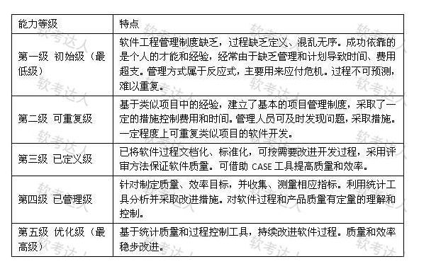

> 能力成熟度模型集成（CMMI）

CMMI 提供了两种表示方法：阶段式模型和连续式模型。

1. 阶段式模型。结构类似于 CMM，它关注组织的成熟度。CMMI-SE/SW/IPPD 1.1 版本中有五个成熟度等级。
2. 连续式模型。关注每个过程域的能力，一个组织对不同的过程域可以达到不同的过程域能力等级（简称 CL）。CMMI 中包括六个过程域能力等级。如图所示

- CL0（未完成的）：过程域未执行或未得到CL1中定义的所有目标。
- CL1（已执行的）：其共性目标是过程将可标识的输入工作产品转换成可标识的输出工作产品，以实现支持过程域的特定目标。
- CL2（已管理的）：其共性目标是集中于已管理的过程的制度化。所有工作任务和工作产品都被监控、控制、和评审。
- CL3（已定义级的）：其共性目标集中于已定义的过程的制度化。过程是按照组织的裁剪指南从组织的标准过程中裁剪得到的，还必须收集过程资产和过程的度量，并用于将来对过程的改进。
- CL4（定量管理的）：其共性目标集中于可定量管理的过程的制度化。使用测量和质量保证来控制和改进过程域，建立和使用关于质量和过程执行的质量目标作为管理准则。
- CL5（优化的）：使用量化（统计学）手段改变和优化过程域，以满足客户的改变和持续改进计划中的过程域的功效。

## 软件开发方法

- 原型化开发方法：适合需求不清晰，需求变化大且规模不太大时采用。
- 结构化开发方法：对于系统规模不太大且不太复杂，需求变化也不大。

## 统一过程

统一过程的四个技术阶段及其产品：
- （1）起始阶段：专注于项目初创活动。
- （2）精化阶段：在理解了最初领域范围之后，需要进行需求分析和架构演进。
- （3）构建阶段：关注系统的构建，产生实现模型。
- （4）移交阶段：关注软件提交方面的工作，产生软件增量。

## 软件过程模型

典型的软件过程有瀑布模型、增量模型、演化模型（原型模型、螺旋模型）、喷泉模型、基于构件的开发模型和形式化方法模型等。

### 各个软件过程模型总结

- 瀑布模型：需求明确，如同瀑布一般，按阶段一步一步完成。
- V模型：在瀑布模型的各个阶段上添加多轮测试。很大程度上保证了软件的准确性。
- 增量模型：先开发核心功能，后开发附加功能。特点是可以很快发布了第一个版本。
- 原型模型（快速原型开发）：针对的就是需求不明确的情况。采用快速迭代的思想。只适合小型软件系统的开发。
- 螺旋模型：在原型模型的基础上加上了风险分析。适合用于庞大、复杂、高风险的系统。
- 喷泉模型：适合于面向对象的开发方法,可复用。使开发过程具有迭代性和无间隙性。

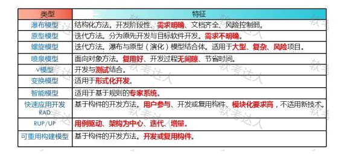

## 项目活动图 里程碑

### 真题案例1 

2018年下半年

某软件项目的活动图如下图所示，其中顶点表示项目里程碑，连接顶点的边表示包含的活动，边上的数字表示活动的持续时间（天），则完成该项目的最少时间为（ ）天。活动FG的松驰时间为（ ）天。

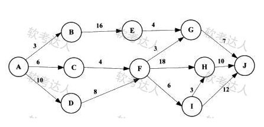

- A 20
- B 37
- C 38
- D 46

完成该项目的最少时间由活动图中的最长路径决定。

其中路径 \(A \to D \to F \to H \to J\)：\(10 + 8 + 18 + 10 = 46\)（天）。因此完成该项目的最少时间为46天。

某个活动的松弛时间 = 最长路径的天数 - 包含该活动的最长路径的天数。

活动 FG 所在路径中的最长路径为 \(A \to D \to F \to G \to J\)，其长度为 \(10 + 8 + 3 + 7 = 28\)（天）。

完成该项目的最少时间为46天。所以活动 FG 的松弛时间为 \(46 - 28 = 18\)（天）。

### 真题案例2

2023年上半年

下图是一个软件项目的活动图，其中顶点表示项目里程碑，连接顶点的边表示活动，则里程碑（ ）在关键路径上,关键路径长度为（ ）

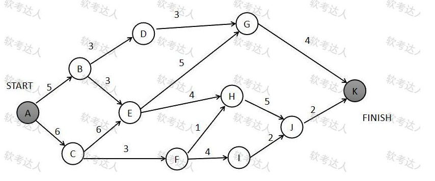

- A B
- B E
- C G
- D I

关键路径就是完成该项目的最长路径，也是完成该项目的最少时间。

如图可知：A-C-E-H-J-K 所在路径是最长路径。该路径完成时间为23天。因此里程碑E在关键路径上。关键路径长度为23

### 真题案例3 

2021年下半年

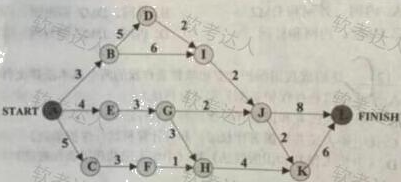

下图是一个软件项目的活动图，其中顶点表示项目里程碑，连接顶点的边表示活动，上的权重表示完成该活动所需要的时间(天)，则活动（ ）不在关键路径上。活动BI和EG的松弛时间分别是（ ）。

- A BD
- B BI
- C GH
- D KL

某路径的松弛时间 = 完成该项目的最长路径的天数 - 包含该路径的最长路径的天数。

如图：有三个最长路径。最长路径天数都为20天。分别是 ABDIJL,ABDIJKL,AEGHKL。其中BI不在关键路径上。

活动BI的松弛时间 = 完成该项目的最长路径的天数 - 包含活动BI的最长路径的天数 = 20 - 19 = 1天

活动EG的松弛时间 = 20 - 20 = 0天

## 敏捷开发

敏捷开发方法，包括极限编程（XP)、水晶法（Crystal)、并列争球法（Scrum:)和自适应软件开发（ASD)等。

- 极限编程XP是一种轻量级的软件开发方式。由价值观、原则、实践和行为4个部分组成。
- 水晶法Crystal认为每一个不同的项目都需要一套不同的策略、约定和方法论。
- 并列争球法Scrum使用迭代的方法，并按需求的优先级来实现产品。

## 软件测试

- 白盒测试技术的各种覆盖方法中，（ 语句覆盖 ）具有最弱的错误发现能力。

- 软件产品的 Alpha 测试和 Beta 测试属于（ 确认测试 ）。

### 黑盒测试

黑盒测试又称功能测试。完全不考虑（或不了解）软件的内部结构和处理算法，它只检查软件功能是否能按照软件需求说明书的要求正常使用。

常用的黑盒测试技术包括等价类划分、边界值分析、错误推测和因果图等。

### 白盒测试

白盒测试按照程序内部逻辑测试程序，检验程序中每条通路是否按预定要求正确工作。

典型的白盒测试方法包括：静态测试、动态测试。其中静态测试包括：代码检查法、静态结构分析法、静态质量度量法。

### 语句覆盖测试 和 路径覆盖测试

- 语句覆盖：语句覆盖是指设计足够的测试用例，使得程序中的每条语句至少被执行一次。语句就是代码。
- 路径覆盖：路径覆盖是指设计足够的测试用例，覆盖程序中所有可能的判断条件路径。路径就是判断条件。

### 案例1

对下图所示的程序流程图进行语句覆盖测试和路径覆盖测试，至少需要（ ）个测试用例。

- 语句覆盖：语句覆盖是指设计足够的测试用例，使得程序中的每条语句至少被执行一次。

观察流程图，从 “开始” 到 “结束”，至少需要 2 个测试用例,可以使得程序中的每条语句至少被执行一次。

例如：第一个测试用例走语句1，语句2，语句4，语句5，语句6。 第二个测试用例走语句1，语句2，语句3，语句6。

- 路径覆盖：路径覆盖是指设计足够的测试用例，覆盖程序中所有可能的路径。

该流程图中可能的路径较多，但至少需要 4 个测试用例才能覆盖所有路径。

例如：用例1是判断 1 为 “N”；用例2是判断 1 为 “Y”，判断 2 为 “N” ；用例3是判断 1 为 “Y”，判断 2 为 “Y”，判断 3 为 “N” ；用例4是判断 1 为 “Y”，判断 2 为 “Y”，判断 3 为 “Y” 。

## 项目管理

- Gantt图能清晰地描述每个任务从何时开始，到何时结束，任务的进展情况。能反映各个任务之间的并行性。但它不能清晰地反映出各任务之间的依赖关系，难以确定整个项目的关键所在，也不能反映计划中有潜力的部分。

- PERT图, 是有向图。能反应项目活动之间的依赖关系，但无法反应活动之间的并行关系

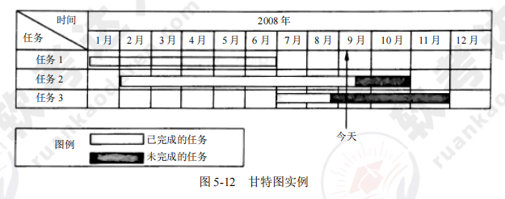

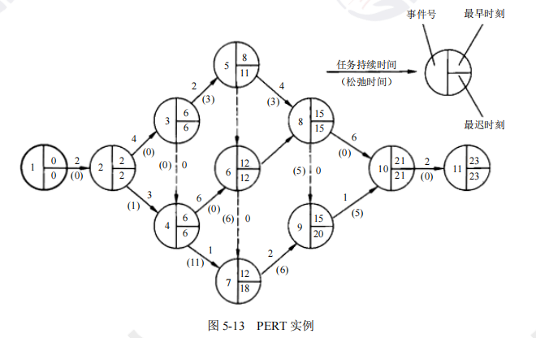

## 软件质量

ISO/IEC 9126模型中，基本特性为6个：功能性、可靠性、易使用性、效率、可维护性和可移植性。

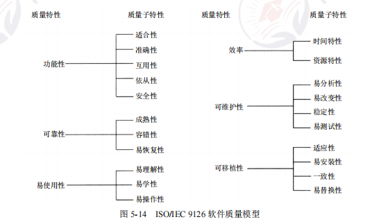

- 软件维护的工作量比开发阶段的工作量大
- 在ISO/IEC软件质量模型中，易使用性的子特性不包括（ 易分析性 ）。
- 软件可维护性是一个系统在特定的时间间隔内可以正常进行维护活动的概率。用MTTF和MTTR分别表示平均无故障时间和平均故障修复时间，则软件可维护性计算公式为（ 1/(1+MTTR) ）
- 系统的可维护性指标：可理解性、可测试性和可修改性。

## McCabe度量法

- 软件的复杂性主要体现在程序的复杂性。（ 代码行数 ）是度量软件复杂性的一个主要参数。

- McCabe环路复杂度。有两种方式求出。
    - 公式法：先将程序的流程图转换为有向图。然后使用公式 V(G)= m - n + 2 。其中 m 是程序图中边的数量，n 是节点数量。
    - 区域法：先数出图中封闭环的个数。环形复杂度等于封闭环个数+1。

### 案例1

若采用McCabe度量法计算环路复杂性，则对于下图所示的程序图，其环路复杂度为（ ）。

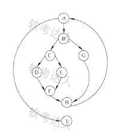

考点：McCabe 度量法计算环路复杂度。

> 解法1 公式法

解题思路：McCabe 度量法计算环路复杂度公式为 \(V(G)=e - n + 2\) ，其中 e 是程序图中边的数量，n 是节点数量 。

由于图为有向图，因此从图中数出节点数 \(n = 9\) ，边数 \(e = 11\) ，代入公式可得 \(V(G)=11 - 9 + 2 = 4\) 。

> 解法2 区域法

程序图的环路数等于由程序图中封闭的区域数量加上 1。

如图图中封闭的区域数量为3。因此 环路复杂度 = 3 + 1 = 4

### 案例2

对下图所示的程序流程图采用McCabe度量法计算其环路复杂度为（ ）。

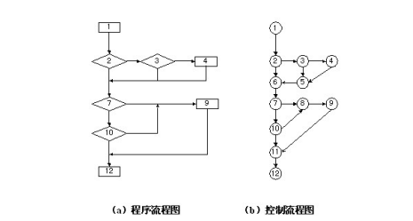

> 解法1 公式法

先将程序流程图转换为有向图。然后根据公式  V(G)= m - n + 2 。m为边数，m为节点数。得到环路复杂度。

如图  V(G)= 15 - 12 + 2 = 5

> 解法2 区域法

如图程序流程图的封闭环路数量为 6.因此该图的环路复杂度为6+1=7

### 案例3

采用McCabe度量法计算下列程序图的环路复杂性为（）。

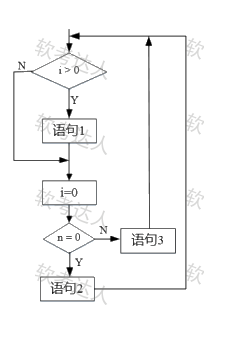

环形度量采用封闭环个数+1的方式进行计算最简单也是最保险的方式。上图可以直接看出存在3个封闭环回路，整个环形复杂度就是3+1 = 4

注意：封闭环个数不计算重叠的。

## 真题

- 以下软件产品中，属于图像编辑处理工具的软件是（ Photoshop ）。
- 某个项目在开发时采用了不成熟的前沿技术，由此而带来的风险属于（ 技术 ）风险。
- 软件开发过程中，需求分析阶段的输出不包括（ 软件体系结构图 ）。
- 由8位成员组成的开发团队中，一共有（ 28 ）条沟通路径.
    - 如果是采用有主程序员的沟通方式，只要7条路径。
    - 如果是无主程序员的沟通方式。计算7+6+5+4+3+2+1，结果是28。
- 软件详细设计阶段的主要任务不包括（ 模块之间的接口设计 ）。
- 信息系统的文档是开发人员与用户交流的工具。在系统规划和系统分析阶段,用户与系统分析人员交流所使用的文档不包括（  用户使用手册 ）。
- 正式技术评审的目标是（ 发现软件中的错误 ）。
- 以下关于各类文档撰写阶段的叙述中，不正确的是（ 测试计划必须在测试阶段撰写 ）。
- 下列活动，（ 针对系统特点，考虑并确定系统开发平台与程序设计语言 ）不属于需求开发活动的范畴。

- 能力成熟度模型集成（CMMI）是若干过程模型的综合和改进。连续式模型和阶段式模型是CMMI提供的两种表示方法，而连续式模型包括6个过程域能力等级，其中（ CL5（优化的） ）使用量化（统计学）手段改变和优化过程域，以应对客户要求的改变和持续改进计划中的过程域的功效。

- 能力成熟度模型集成(CMMI)是若干过程模型的综合和改进。连续式模型和阶段式模型是CMMI提供的两种表示方法。连续式模型包括6个过程域能力等级( Capability Level,CL)，其中（ CL1(已执行的) ）的共性目标是过程将可标识的输入工作产品转换成可标识的输出工作产品,以实现支持过程域的特定目标。

- 若用户需求不清晰且经常发生变化，但系统规模不太大且不太复杂，则最适宜采用（ 原型化 ）开发方法，对于数据处理领域的问题，若系统规模不太大且不太复杂，需求变化也不大，则最适宜采用（ 结构化 ）开发方法。

- 统一过程模型是一种“用例和风险驱动，以架构为中心，迭代并且增量”的开 发过程，定义了不同阶段及其制品，其中精化阶段关注（需求分析和架构演进）。

- 关于螺旋模型，下列陈述中不正确的是（  可以快速的提供一个初始版本让用户测试 ）。
- （ 瀑布 ）开发过程模型最不适用于开发初期对软件需求缺乏准确全面认识的情况。
- 喷泉模型是一种适合于面向（ 对象 ）开发方法的软件过程模型。该过程模型的特点不包括（ 开发活动之间存在明显的界限 ）。
- 某企业拟开发一个企业信息管理系统，系统功能与多个部门的业务相关。现希望该系统能够尽快投入使用，系统功能可以在使用过程中不断改善。则最适宜采用的软件过程模型为（ 演化（迭代）模型 ）。
- 以下关于快速原型模型优点的叙述中，不正确是（ 适用于大型软件系统的开发 ）。

- （ 很容易将客户需求划分为多个增量 ）不是增量式开发的优势。
- 螺旋模型综合了__瀑布模型和演化模型___的优点，并增加了这两种模型忽略的风险分析。
- 确定软件的模块划分及模块之间的调用关系是（  概要设计 ）阶段的任务。

- 敏捷开发方法Scrum的步骤不包括（ Refactoring ）。
- 以下关于极限编程(XP) 中结对编程的叙述中，不正确的是（  编码速度更快 ）。
- 以下关于极限编程（XP）的最佳实践的叙述中，不正确的是（ 编写完程序之后编写测试代码 ）。
- 优化模块结构时，（  使模块功能完整， 消除重复功能，改善软件结构，避免或减少模块之间的病态连接）是适当的处理方法。

- 在软件开发过程中，系统测试阶段的测试目标来自于（ 需求分析 ）阶段。
- 白盒测试技术的各种覆盖方法中，（ 语句覆盖 ）具有最弱的错误发现能力。
- 在设计测试用例时，应遵循（ 不仅要设计有效合理输入，也要包含不合理、失效的输入 ）原则。
- 在软件系统交付给用户使用后，为了使用户界面更友好，对系统的图形输出进行改进，该行为属于（ 改善性 ）维护。
- 以下关于软件测试的叙述中，正确的是（ 一个成功的测试能发现至今未发现的错误  ）。

- 以下关于进度管理工具Gantt图的叙述中，不正确的是 （ 能清晰地确定影响进度的关键任务 ） 。

- 针对“关键职员在项目未完成时就跳槽”的风险，最不合适的风险管理策略是（ 临时招聘具有相关能力的新职员 ）。

- 在进行软件开发时，采用无主程序员的开发小组，成员之间相互平等;而主程序员负责制的开发小组，由一个主程序员和若干成员组成，成员之间没有沟通。在一个由8名开发人员构成的小组中，无主程序员组和主程序员组的沟通路径分别是（ 28和7  ）。
    - 无主程序员组的开发小组，每两十开发人员之间都有沟通路径，因此，8人组成的开发小组沟通路径为完全连通无向图的边数，即 7+6+5+4+3+2+1
    - 主程序员组中，除了主程序员外的每个开发人员只能和主程序员沟通，因此8人组成的开发小组的沟通路径8-1=7。
- 工作量估算模型COCOMO II的层次结构中,估算选择不包括（  用例数 ）。

> 软件质量

- 按照 ISO/IEC 9126 软件质量度量模型定义，一个软件的可靠性的子特性包括（ 容错性和易恢复性  ）。
- 软件可维护性是一个系统在特定的时间间隔内可以正常进行维护活动的概率。用MTTF和MTTR分别表示平均无故障时间和平均故障修复时间，则软件可维护性计算公式为（ 1/(1+MTTR) ）。
- 在ISO/IEC软件质量模型中，可移植性是指与软件可从某环境行移到另一环境的能力有关的一组属性，其子特性不包括（ 测试性 ）。
- 在对程序质量进行评审时，模块结构是一个重要的评审项，评审内容中不包括（ 数据结构 ）。
- 在ISO/IEC9126软件质量模型中，软件质量特性（ 功能性 ）包含质量子特性安全性。
- 在IS0/IEC软件质量模型中，易使用性是指与使用所需的努力和由一组规定或隐含的用户对这样使用所作的个别评价有关的一组属性，其子特性不包括（ 易分析性 ）。
- 在ISO/IEC 9126软件质量模型中，可靠性质量特性是指在规定的一段时间内和规定的条件下，软件维持在其性能水平有关的能力，其质量子特性不包括（ 安全性 ，可移植性 ）。
- （ 易理解性 ）不属于软件质量特性中的可移植性。
- （ 功能与模块之间的对应关系 ）不属于软件设计质量评审。
- 在设计中实现可移植性设计的规则不包括（ 可使用特定环境的专用功能 ）
- 软件质量属性中，（ 吞吐量 ）是指软件每分钟可以处理多少个请求。
- 系统可维护性的评价指标不包括（ 可移植性 ）。
- 系统可维护性是指维护人员理解、改正、改动和改进软件系统的难易程度，其评价指标不包括（ 一致性
 ）。
 - 将每个用户的数据和其他用户的数据隔离开，是考虑了软件的（ 功能性 ）质量特件。

 > 软件度量

