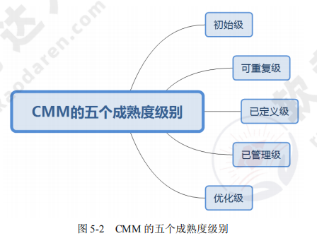
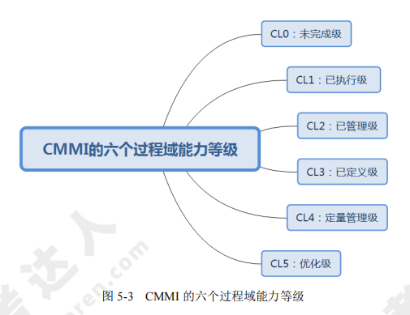

[toc]

# 软件设计师笔记_第五章_软件工程_考点

## 软件工程概述

- 软件工程的基本要素：方法、工具、过程。

- 软件生存周期：可行性分析与项目开发计划、需求分析、概要设计、详细设计、编码、测试、维护。
    - 需求分析。该阶段是确定软件系统的功能、性能、数据和界面等要求，从而确定系统的逻辑模型。产生的文档主要是软件需求说明书。
    - 概要设计。概要设计包含系统构架、模块划分、系统接口、数据设计4个主要方面的内容。产生的文档主要是概要设计说明书。
    - 详细设计。详细设计是对每个模块的功能进一步详细、具体的描述。产生的文档主要是详细设计文档。

软件详细设计阶段的主要任务包括：对模块内的数据结构进行设计；对数据库进行物理设计；对每个模块进行详细的算法设计；代码设计、输入/输出设计、用户界面设计等其他设计。

## 能力成熟度模型

> 能力成熟度模型（CMM）

CMM 是对软件组织进化阶段的描述，随着软件组织定义、实施、测量、控制和改进其软件过程，软件组织的能力经过这些阶段逐步提高。CMM 将软件过程的改进分为五个成熟度级别。如图所示

- 初始级的特点是无秩序的，有时甚至是混乱的。项目成功完全依赖个人努力。
- 可重复级的特点是建立了基本的项目管理过程，可用于对成本、进度和功能特性进行跟踪。
- 已定义级的特点是文档化、标准化，并形成了整个软件组织的标准软件过程。
- 已管理级是可预测的过程。制定了详细的度量标准，软件过程和产品质量得到了定量的认识和控制。
- 优化级是持续改进的过程，加强了定量分析。能够不断地、持续性地进行改进。

> 能力成熟度模型集成（CMMI）

CMMI 提供了两种表示方法：阶段式模型和连续式模型。

1. 阶段式模型。结构类似于 CMM，它关注组织的成熟度。CMMI-SE/SW/IPPD 1.1 版本中有五个成熟度等级。
2. 连续式模型。关注每个过程域的能力，一个组织对不同的过程域可以达到不同的过程域能力等级（简称 CL）。CMMI 中包括六个过程域能力等级。如图所示

- CL0（未完成的）：过程域未执行或未得到CL1中定义的所有目标。
- CL1（已执行的）：其共性目标是过程将可标识的输入工作产品转换成可标识的输出工作产品，以实现支持过程域的特定目标。
- CL2（已管理的）：其共性目标是集中于已管理的过程的制度化。所有工作任务和工作产品都被监控、控制、和评审。
- CL3（已定义级的）：其共性目标集中于已定义的过程的制度化。过程是按照组织的裁剪指南从组织的标准过程中裁剪得到的，还必须收集过程资产和过程的度量，并用于将来对过程的改进。
- CL4（定量管理的）：其共性目标集中于可定量管理的过程的制度化。使用测量和质量保证来控制和改进过程域，建立和使用关于质量和过程执行的质量目标作为管理准则。
- CL5（优化的）：使用量化（统计学）手段改变和优化过程域，以满足客户的改变和持续改进计划中的过程域的功效。

## 软件过程模型

典型的软件过程有瀑布模型、增量模型、演化模型（原型模型、螺旋模型）、喷泉模型、基于构件的开发模型和形式化方法模型等。

### 瀑布模型

瀑布模型的开发流程如同瀑布一般，一步一步的走下去，直到最后完成项目开发。

瀑布模型包括需求分析、设计、编码、测试、运行与维护共5个阶段。如图所示

- 瀑布模型的优点：容易理解、成本低、强调开发的阶段性早期计划及需求调查和产品测试
- 瀑布模型的缺点：只适用于需求明确或者二次开发(需求稳定)，当需求不明确时，最终开发的项目会错误，有很大的缺陷。

### V 模型

V模型是瀑布模型的一个变体。如图所示。

V 模型的特点是增加了很多轮测试，并且这些测试贯穿于软件开发的各个阶段，不像其他模型都是软件开发完再测试，很大程度上保证了项目的准确性。

### 增量模型

增量模型：首先开发核心模块功能，而后与用户确认，之后再开发次核心模块的功能，即每次开发一部分功能，并与用户需求确认，最终完成项目开发，优先级最高的服务最先交付

- 增量模型的优点：可交付的第一个版本所需要的成本和时间很少，开发由增量表示的小系统所承担的风险不大，由于很快发布了第一个版本，因此可减少用户需求的变更。同时，它也具有瀑布模型所有的优点。

- 增量模型的缺点：若没有对用户的变更要求进行规划，那么产生的初始增量可能会造成后来增量的不稳定；若需求不像早期思考的那样稳定和完整，那么一些增量就可能需要重新开发或重新发布；管理发生的成本、进度和配置的复杂性可能会超出组织的能力。

### 演化模型

演化模型主要有原型模型和螺旋模型两种。

#### 原型模型

原型模型：即快速原型开发，原型模型针对的就是需求不明确的情况，首先快速构造一个功能模板，演示给用户看，并按用户要求及时修改，中间再通过不断的演示与用户沟通，最终设计出项目，就不会出现与用户要求不符合的情况，采用的是迭代的思想。

原型模型如图所示。

#### 螺旋模型

螺旋模型：是多种模型的混合，针对需求不明确的项目，与原型类似，但是增加了风险分析，这也是其最大的特点。

螺旋模型强调风险分析，使用户、开发人员对演化层出现的风险有所了解，从而作出反映。因此，螺旋模型适合用于庞大、复杂、高风险的系统。

螺旋模型如图所示。

螺旋模型中的每个螺旋周期分为以下四个步骤：
1. 制订计划：确定软件目标，选定实施方案，明确项目开发的限制条件。
2. 风险分析：对所选方案进行分析，识别风险，消除风险。
3. 实施工程：实施软件开发，验证阶段性产品。
4. 用户评估：评价开发工作，提出修正建议，建立下一个周期的开发计划。

### 喷泉模型

喷泉模型：是一种以用户需求为动力，以对象作为驱动的模型，适合于面向对象的开发方法。使开发过程具有迭代性和无间隙性。

喷泉模型如图所示。

## 项目活动图 里程碑

### 真题案例1 

2018年下半年

某软件项目的活动图如下图所示，其中顶点表示项目里程碑，连接顶点的边表示包含的活动，边上的数字表示活动的持续时间（天），则完成该项目的最少时间为（ ）天。活动FG的松驰时间为（ ）天。

- A 20
- B 37
- C 38
- D 46

完成该项目的最少时间由活动图中的最长路径决定。

其中路径 \(A \to D \to F \to H \to J\)：\(10 + 8 + 18 + 10 = 46\)（天）。因此完成该项目的最少时间为46天。

某个活动的松弛时间 = 最长路径的天数 - 包含该活动的最长路径的天数。

活动 FG 所在路径中的最长路径为 \(A \to D \to F \to G \to J\)，其长度为 \(10 + 8 + 3 + 7 = 28\)（天）。

完成该项目的最少时间为46天。所以活动 FG 的松弛时间为 \(46 - 28 = 18\)（天）。

### 真题案例2

2023年上半年

下图是一个软件项目的活动图，其中顶点表示项目里程碑，连接顶点的边表示活动，则里程碑（ ）在关键路径上,关键路径长度为（ ）

- A B
- B E
- C G
- D I

关键路径就是完成该项目的最长路径，也是完成该项目的最少时间。

如图可知：A-C-E-H-J-K 所在路径是最长路径。该路径完成时间为23天。因此里程碑E在关键路径上。关键路径长度为23

### 真题案例3 

2021年下半年

下图是一个软件项目的活动图，其中顶点表示项目里程碑，连接顶点的边表示活动，上的权重表示完成该活动所需要的时间(天)，则活动（ ）不在关键路径上。活动BI和EG的松弛时间分别是（ ）。

- A BD
- B BI
- C GH
- D KL

某路径的松弛时间 = 完成该项目的最长路径的天数 - 包含该路径的最长路径的天数。

如图：有三个最长路径。最长路径天数都为20天。分别是 ABDIJL,ABDIJKL,AEGHKL。其中BI不在关键路径上。

活动BI的松弛时间 = 完成该项目的最长路径的天数 - 包含活动BI的最长路径的天数 = 20 - 19 = 1天

活动EG的松弛时间 = 20 - 20 = 0天

## 真题

- 以下软件产品中，属于图像编辑处理工具的软件是（ Photoshop ）。
- 某个项目在开发时采用了不成熟的前沿技术，由此而带来的风险属于（ 技术 ）风险。
- 软件开发过程中，需求分析阶段的输出不包括（ 软件体系结构图 ）。
- 由8位成员组成的开发团队中，一共有（ 28 ）条沟通路径.
    - 如果是采用有主程序员的沟通方式，只要7条路径。
    - 如果是无主程序员的沟通方式。计算7+6+5+4+3+2+1，结果是28。
- 软件详细设计阶段的主要任务不包括（ 模块之间的接口设计 ）。
- 信息系统的文档是开发人员与用户交流的工具。在系统规划和系统分析阶段,用户与系统分析人员交流所使用的文档不包括（  用户使用手册 ）。
- 正式技术评审的目标是（ 发现软件中的错误 ）。
- 以下关于各类文档撰写阶段的叙述中，不正确的是（ 测试计划必须在测试阶段撰写 ）。
- 下列活动，（ 针对系统特点，考虑并确定系统开发平台与程序设计语言 ）不属于需求开发活动的范畴。

- 能力成熟度模型集成（CMMI）是若干过程模型的综合和改进。连续式模型和阶段式模型是CMMI提供的两种表示方法，而连续式模型包括6个过程域能力等级，其中（ CL5（优化的） ）使用量化（统计学）手段改变和优化过程域，以应对客户要求的改变和持续改进计划中的过程域的功效。

- 能力成熟度模型集成(CMMI)是若干过程模型的综合和改进。连续式模型和阶段式模型是CMMI提供的两种表示方法。连续式模型包括6个过程域能力等级( Capability Level,CL)，其中（ CL1(已执行的) ）的共性目标是过程将可标识的输入工作产品转换成可标识的输出工作产品,以实现支持过程域的特定目标。