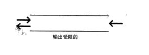
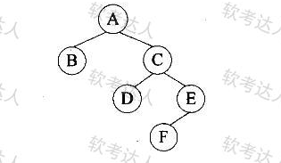

[toc]

# 软件设计师笔记_第八章_数据结构与算法_精简考点

## 线性表

- 给定一个有n个元素的有序线性表。若采用顺序存储结构，则在等概率前提下，删除其中的一个元素平均需要移动 (n-1)/2 个元素。

- 当线性表进行顺序存储时，逻辑上相邻的元素，其物理位置也相邻。此时查询元素的时间复杂度为O(1)，也就是常量级。此时插入元素就需要移动一些元素了，因此插入元素的时间复杂度为O(n)，其中n为线性表的长度。
- 当线性表进行链式存储时，逻辑上相邻的元素，其物理位置不要求相邻。此时查找元素和插入元素的时间复杂度都为O(n)。

单向循环链表由于指针方向是单向的。因此访问其直接后继的运算时间复杂度为O(1)，访问其直接前驱的运算时间复杂度为O(n)。

## 栈

- 表达式采用逆波兰式(后缀式)表示时，利用（ 栈 ）进行求值。
- 栈是一种按“后进先出”原则进行插入和删除操作的数据结构，因此，  实现函数或过程的递归调用及返回处理时 必须用栈。

- 计算存放操作数的栈的至少容量：
    - 先将表达式转换为后缀式。
    - 看后缀式中的第一个运算符号前的操作数个数。那就是存放操作数的栈的至少容量。

## 队列

- 循环队列中求队头元素的指针的计算公式为：(rear-len+1+M) % M 其中rear是队尾指针，len是队列长度，M是队列存储容量。

- 必须采用队列结构的是 打印序列。

> 真题案例1

输出受限的双端队列是指元素可以从队列的两端输入，但只能从队列的一端输出，如下图所示，若有e1,e2,e3,e4依次进入输出受限的双端队列，则得不到输出序列 （ ）。

- A e4,e3,e2,e1
- B e4,e2,e1,e3
- C e4,e3,e1,e2
- D e4,e2,e3,e1

正确答案是D

- 选项 A：e4,e3,e2,e1  输入过程：让e1、e2、e3、e4依次从左端输入队列。输出过程：由于只能从一端输出，此时队列中元素顺序从左到右为e4 e3 e2 e1。按照先进后出原则，依次输出e4、e3、e2、e1，该输出序列可以得到。

- 选项 B：e4,e2,e1,e3输入过程：先让e1、e2从左端输入，e3 从右端输入 e4再从左端输入。此时队列中元素顺序从左到右为e4 e2 e1 e3。按照先进后出原则，依次输出e4,e2,e1,e3。该输出序列可以得到。

- 选项 C：e4,e3,e1,e2输入过程：让e1、e2从左端输入，e3、e4从右端输入。此时队列中元素顺序从左到右为e4,e3,e1,e2。按照先进后出原则，依次输出e4,e3,e1,e2。该输出序列可以得到。

- 选项 D：e4,e2,e3,e1输入过程：尝试各种从两端输入元素的方式。若要先输出e4，e4需最后进入队列且在队尾（输出端 ）。矛盾分析：若e4在队尾，当输出e4后，接下来要输出e2，由于只能从一端输出，在e4输出后，要输出e2，则e2需在队尾，但此时若e2在队尾，e3就无法在e2之前输出，所以无法得到该输出序列。

## 二维数组

二维数组计算地址（按照行优先顺序）的公式为：LOC（i,j）=LOC（0,0）+（i*m+j）*L

> 案例1

在一个二维数组A中，假设每个数组元素的长度为3个存储单元，行下标i为0-8，列下标j为0-9，从首地址SA开始连续存放，在这种情况下，元素A[8][5]的起始地址为（ ）。

- A SA+141
- B SA+144
- C SA+222
- D SA+255

正确答案：D

二维数组按行优先存储，即先存储完一行的所有元素，再存储下一行。

那么元素A[8][5]是二维数组中的第86个元素。

元素A[8][5]的起始地址 SA + 85 * 3 = SA + 255

## 矩阵

> 三对角矩阵公式如图所示

> 数组存储地址的计算

假设每个数组元素占用内存长度为len，起始地址为a，存储地址计算如下：

> 真题范例1

设有n阶三对角矩阵A，即非零元素都位于主对角线以及与主对角线平行且紧邻的两条对角线上，现对该矩阵进行按行压缩存储，若其压储空间用数组B表示，A的元素下标从0开始，B的元素下标从1开始。已知A[0,0]存储在B[1]，A[n-1,n-1]存储在B[3n-2]，那么非零元素A[i，j](0≤i<n，0≤j<n，|i-j|≤1)存储在B[（ ）]。

A 2i+j-1
B 2i+j
C 2i+j+1
D 3i-j+1

正确答案：C

n阶三对角矩阵如下图所示。

在元素ai,y之前共有i行（行号从0到i-1 )，除了第一行外，其余每行都是3个元素, 因此这i行上的元素个数为(3*i-1);在行号为i时，排列在ai,y之前的元素个数为j-i+1, 合计2i+j个元素，因此元素ai,y存储在B[]中的下标为2i+j+1(因数组B是从下标1开始存放元素的）。

> 真题范例2

某n阶的三对角矩阵A 如下图所示，按行将元素存储在一维数组M中，设a1,1存储在M[1]，那么ai,j (1<=i，j<=n且ai,j位于三条对角线中)存储在M（ ）。

A i+2j
B 2i+j
C i+2j-2
D 2i+j-2

按行存储时，aij之前有i-1行，除了第一行外，每行有3个元素，在第i行上，其之前有j-i+1个元素，因此aij之前共有(i-1)*3-1+j-i+1=2i+j-3个元素，由于ai,1存储在M[1]，所以 ai,j存储在M[2i+j-3+1]。

## 树

二叉树顺序存储的规则：对于完全二叉树，若根节点下标为i ，则其左孩子节点下标为2i，右孩子节点下标为2i + 1

> 真题范例1

对下面的二叉树进行顺序存储(用数组MEM表示)，已知结点A、B、C在MEM中对应元素的下标分别为1、2、3，那么结点D、E、F对应的数组元素下标为（ ）。

A 4、5、6
B 4、7、10
C 6、7、8
D 6、7、14

正确答案D

二叉树顺序存储规则：
对于完全二叉树，若根节点下标为i（本题中根节点A下标为1 ） ，则其左孩子节点下标为2i，右孩子节点下标为\(2i + 1\) 。

- 节点D：节点C下标为3，D是C的左孩子，根据规则，D的下标为\(2\times3 = 6\)。
- 节点E：E是C的右孩子，其下标为\(2\times3 + 1 = 7\)。
- 节点F：F是D的右孩子，D下标为6，所以F的下标为\(2\times6 + 1 = 14\) 。
- 综上，节点D、E、F对应的数组元素下标为6、7、14，答案选 D。

## 图

## 查找算法

## 真题

- 对于线性表，相对于顺序存储，采用链表存储的缺点是（ 数据元素之间的关系需要占用存储空间，导致存储密度不高 ）。
- 以下关于线性表存储结构的叙述，正确的是（ 线性表采用顺序存储结构时，访问表中任意一个指定序号元素的时间复杂度为常量级 ）。
- 当函数调用执行时，在栈顶创建项目用来支持被调用函数执行的一段存储空间称为活动记录或栈帧，栈帧中不包括（ 全局变量 ）。
- 利用栈对算术表达式10*(40-30/5)+20求值时，存放操作数的栈(初始为空)的容星至少为_（ 4 ）_,才能满足暂存该表达式中的运算数或运算结果的要求。
    - 先将表达式转换为后缀式 10 40 30 5 / - * 20 +
    - 然后看后缀式中的第一个运算符号前的操作数个数。那就是存放操作数的栈的容量。
    - 后缀式 10 40 30 5 / - * 20 + 中第一个运算符号前的操作数个数是4个

- 若一个栈初始为空，其输入序列是1，2，3，…，n-1，n，其输出序列的第一个元素为k(1≤k≤「n/2」)，则输出序列的最后一个元素是 （ 不确定的 ） 。
- 队列的特点是先进先出，若用循环单链表表示队列，则（ 入队列和出队列操作都不需要遍历链表 ）。
- 采用循环队列的优点是（  入队和出队操作都不需要移动队列中的其他元素 ）。

> 矩阵

- （ 三元组顺序表和十字链表 ）是对稀疏矩阵进行压缩存储的方式。
- 对于一个n阶的对称矩阵A,将其下三角区域(含主对角线)的元素按行存储在一维数组S中，设元素A[i][j]存放在S[K]中，且S[1]=A[0][0]，则k与i、j (i≤j)的对应关系是（ ）。

> 树

- 已知树T的度为4，且度为4的结点数为7个、度为3的结点数5个、度为2的结点数为8个、度为1的结点数为10个，那么T的叶子结点个数为（ 40 ）。(注：树中节点个数称为结点的度，结点的度中的最大值称为树的度。）
- 当二叉数中的结点数目确定时，（ 完全二叉树 ）的高度一定是最小的。
    - 完全二叉树是让二叉树的每一层的结点都尽可能全满，除了最底层，此时树的高度一定是最小的。

- 二叉树的高度是指其层数， 空二叉树的高度为0，仅有根结点的二叉树高度为若某二叉树中共有1024个结点，则该二叉树的高度是整数区间（ [11, 1024] ）中的任一值。
- 具有3个结点的二叉树有5种，可推测出具有4个结点的二叉树有（ 14 ）种。
- 已知某二叉树的先序遍历序列为A B C D E F、中序遍历序列为B A D C F E，则可以确定该二叉树（ 高度为4（即结点分布在4层上） ）。
- 某二叉树的中序、先序遍历序列分别为{20,30,10,50,40}、{10,20,30,40,50}，则该二叉树的后序遍历序列为（ 30,20,50,40,10 ）。
- 设m和n是某二叉树上的两个结点，中序遍历时，n排在m之前的条件是（ m在n的右边 ）。
    - 对于二叉树的中序遍历，是先遍历根结点的左子数，再访问根结点，最后遍历根结点的右子树。所以结点n排在结点m之前的条件是n在m的左边，也就是m在n的右边。、
- 设某二叉树采用二叉链表表示（即结点的两个指针分别指示左、右孩子）。当该二叉树包含k个节点时，其二叉链表节点中必有（ k+1 ）个空的孩子指针。
- 某二叉树的先序遍历序列为ABCDEF ，中序遍历序列为BADCFE ，则该二叉树的高度(即层数)为（ 4 ）。
- 若一棵二叉树的高度（即层数）为h，则该二叉树（ 最多有2h-1个结点 ）。
- 以下关于哈夫曼树的叙述，正确的是（ 哈夫曼树中叶子结点的权值越小则距离树根越远、叶子结点的权值越大则距离树根越近 ）。
- 具有3个结点的二叉树有（ 5 ）种形态。
- 设由三棵树构成的森林中，第一棵树、第二棵树和第三棵树的结点总数分别为n1、 n2和n3。将该森林转换为—棵二叉树，那么该二叉树的右子树包含_（ n2+n3 ）个结点。
- 一个高度为h的满二叉树的结点总数为2h-1，从根结点开始，自上而下、同层次结点从左至右，对结点按照顺序依次编号，即根结点编号为1，其左、右孩子结点编号分别为2和3，再下一层从左到右的编号为4，5，6，7，依此类推。那么，在一棵满二叉树中，对于编号为m和n的两个结点，若n=2m+1,则 （ n是m的右孩子 ）。

> 图

- 某图G的邻接表中共有奇数个表示边的表结点，则图G（ 是有向图 ）。
- 若无向图G有n个顶点e条边，则G采用邻接矩阵存储时，矩阵的大小为（ n2 ）。
- 对有向图G进行拓扑排序得到的拓扑序列中，顶点Vi在顶点Vj之前，则说明G中（ 一定不存在有向弧
`<vj, vi>` ）。
- 在一个有向图G的拓扑序列中，顶点Vi排列在Vj之前，说明图G中（ 可能存在vi到vj的路径，而不可能存在Vj到vi的路径 ）。
- 以下关于无向连通图G的叙述中，不正确的是（ G中任意两个顶点之间均有边存在 ）。
- 设一个包含n个顶点、e条弧的简单有向图采用邻接矩阵存储结构（即矩阵元素A[i][j]等于1或0，分别表示顶点i与顶点j之间有弧或无弧）,则该矩阵的非零元素数目为（ e ）。
- 某简单无向连通图G的顶点数为n，则图G最少和最多分别有（ n-1,n*(n-1)/2 ）条边。

> 算法

- 对长度为n的有序顺序进行折半查找(即二分查找)的过程可用一棵判定树表该判定树的形态符合（ 平衡二叉树 ）的特点。
- 在线性表L中进行二分查找，要求L（ 序存储，元素有序排列 ）。
- 对某有序概序表进行折率查找《二分查找》时，进行比较的关键字序列不可能是（  90,85,61,77,42 ）
- 在55个互异元素构成的有序表A[1..55]中进行折半查找（或二分查找，向下取整）。若需要找的元素等于A[19]，则在查找过程中参与比较的元素依次为（ A[28]、A[14]、A[21]、A[17] ）、A[19]。
- 对于有序表(8,15, 19, 23, 26, 31, 40, 65, 91)，用二分法进行查找时，可能的关键字比较顺序为（  26,40,65 ）。
- 以下关于哈希(Hash,散列)查找叙述中，正确的是（ 构造哈希函数时应尽量使关键字的所有组成部分都能起作用 ）。