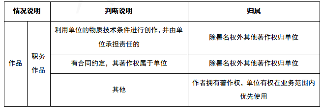
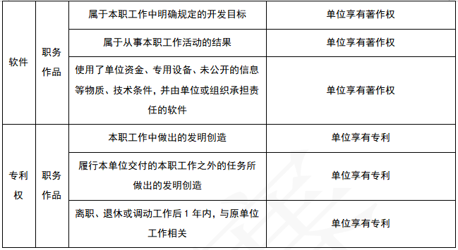
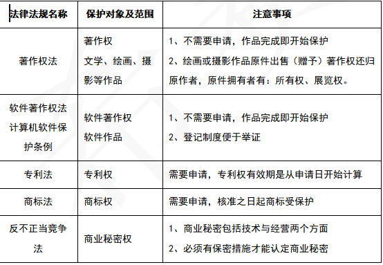

[toc]

# 软件设计师笔记_第十一章_知识产权_精简考点

## 基本
 
《中华人民共和国著作权法》和《计算机软件保护条例》 是构成我国保护计算机软件著作权的两个基本法律文件。

《计算机软件保护条例》 第八条第一款第八项规定的软件著作权中的翻译权将原软件由（ 一种自然语言文字转换成另一种自然语言文字 ）的权利。

若两个申请人分别就相同内容的计算机程序的发明创造，先后向专利行政部门提出申请，先申请人可以获得专利申请权。

商标权的保护期是可以延长的。

商标权确定知识产权人的过程。第一原则是：谁先申请谁获得。其次，同时申请时，谁先使用谁获得。

## 知识产权人确定-职务作品判定

## 保护范围和保护对象

## 侵权判断的特殊要求

中国公民、法人或者其他组织的作品，不论是否发表，都享有著作权。

开发软件所用的思想、处理过程、操作方法或者数学概念不受保护。

著作权法不适用于下列情形： 
- 法律、法规或其他具有立法、行政、司法性质的文件，及其官方正式译文； 
- 时事新闻； 
- 历法、通用数表、通用表格和公式。

## 真题

王某是一名软件设计师，按公司规定编写软件文档，并上交公司存档。这些软件文档属于职务作品，且（ 其著作权由公司享有 ）。

甲软件公司受乙企业委托安排公司软件设计师开发了信息系统管理软件，由于在委托开发合同中未对软件著作权归属作出明确的约定，所以该信息系统管理软件的著作权由（  甲 ）享有。

以下关于某委托开发软件的著作权归属的叙述中，正确的是（ 若无书面合同或合同中未明确约定，则该软件的著作权由受托人享有 ）。

刘某完全利用任职单位的实验材料、实验室和不对外公开的技术资料完成了一项发明。以下关于该发明的权利归属的叙述中，正确的是（ 原则上应归单位所有，但若单位与刘某对成果的归属有特别约定时遵从约定 ）。

有可能无限期拥有的知识产权是（ 商标权 ）。

以下有关计算机软件著作权的叙述中，正确的是（ 非法进行拷贝、发布或更改软件的人被称为软件盗版者 ）。

国际上为保护计算机软件知识产权不受侵犯所采用的主要方式是实施（ 版权法 ）

甲、 乙两个申请人分别就相同内容的计算机软件发明创造，向国务院专利行政部门门提出专利申请，甲先于乙一日提出，则（ 甲获得该项专利申请权 ）。

甲、乙两互联网公司于2020年7月7日就各自开发的库存管理软件分别申请“宏达”和“鸿达”商标注册，两个库存管理软件相似，甲第一次使用时间为2019年7月，乙第一次使用时间为2019年5月，此情景下，（ “鸿达” ）能获准注册。