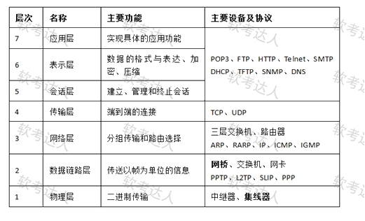
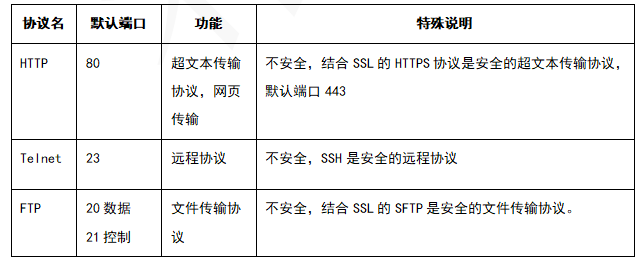
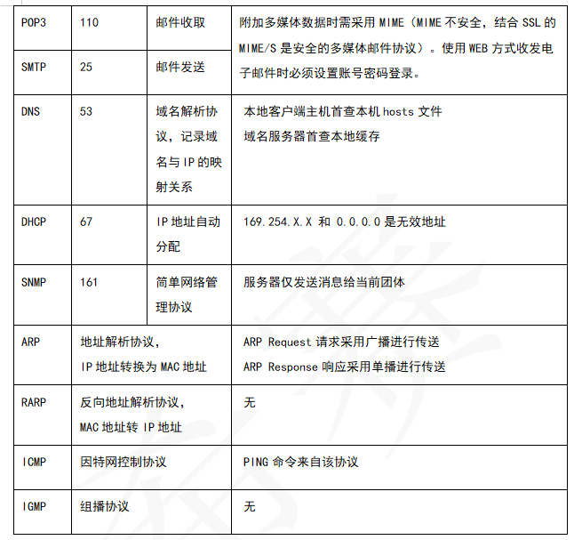

[toc]

# 软件设计师笔记_第十章_网络安全_精简考点

## 基本

## OSI参考模型

- 应用层:实现具体的应用功能。
- 表示层:数据的格式与表达、加密、压缩。
- 会话层:建立、管理和终止会话。
- 传输层:端到端的连接。
- 网络层:分组传输和路由选择。
- 数据链路层:传送以帧为单位的信息。
- 物理层:二进制传输。

> 各层对应的设备

- 中继器是物理层设备，其作用是对接收的信号进行再生放大，以延长传输的距离。
- 网桥是数据链路层设备，可以识别MAC地址，进行帧转发。
- 交换机是由硬件构成的多端口网桥，也是一种数据链路层设备。
- 路由器是网络层设备，可以识别IP地址，进行数据包的转发。

简单网络管理协议SNMP，它的传输层协议是UDP。即该协议的报文封装在（ UDP ）。

## 防火墙

包过滤型防火墙是在网络层对数据包进行分析、选择，选择的依据是系统内设置的过滤规则（访问控制表）。通过检查每个数据包的源地址、目的地址、端口和协议状态等因素，确定是否允许该数据包通过。

防火墙通常分为内网、外网和DMZ三个区域。
- 安全级别最高的LAN Area 内网
- 安全级别中等的DMZ区域
- 安全级别最低的Internet区域（外网）。

防火墙的工作层次是决定防火墙效率及安全的主要因素。一般来说， 工作层次越低，则工作效率越高， 但安全性就低了；反之， 工作层次越高，工作效率越低， 则安全性越高。

## 常见协议功能

邮件相关的
- SSL是为网络通信提供安全及数据完整性的一种安全协议，在传输层对网络连接进行加密。在设置电子邮箱时使用SSL协议，会保障邮箱更安全。
- HTTPS协议是由HTTP加上TLS/SSL协议构建的可进行加密传输、身份认证的网络协议，主要通过数字证书、加密算法、非对称密钥等技术完成互联网数据传输加密，实现互联网传输安全保护。
- PGP是一套用于消息加密、验证的应用程序。PGP加密中每个公钥均绑定唯一的用户名和/或者E-mail地址。
- MIME是设定某种扩展名的文件用一种应用程序来打开的方式类型。它是一个互联网标准，扩展了电子邮件标准。

文件相关的
- FTP是一种用于在不同设备之间传输文件的协议。但是FTP传输的数据是明文形式的，不安全。
- TFTP是FTP协议的简化版本，没有安全机制，仅仅支持读写文件。
- SFTP 协议基于SSH协议，提供了加密和认证机制，可以保证传输的数据是安全的。SFTP使用的TCP端口号默认是22。
- ICMP 协议是一种用于在IP网络中发送控制消息的协议，常用于网络故障排除。ICMP本身不传输数据，不适用于文件传输。

安全相关的
- TCP是可靠的传输层协议，与安全无关。
- TLS安全传输层协议用于在两个通信应用程序之间提供保密性和数据完整性。
- SSH 是建立在应用层和传输层基础上的安全协议。SSH 是目前较可靠，专为远程登录会话和其他网络服务提供安全性的协议。

Telnet 协议提供了访问远程主机的功能，使本地用户可以通过TCP连接登录到远程主机上，像使用本地主机一样使用远程主机的资源。Telnet协议使用TCP端口23号，但是未经加密，因此是不安全的。

## TCP和UDP

目前主要的传输层协议为TCP和UDP。
- TCP协议的是现较为复杂，采用3次握手建立连接，传输过程中能实现可靠传输、流量控制以及拥塞控制，因而也带来了较大开销。
- UDP协议主要通过端口号实现传输层级的寻址，开销也小。

TCP和UDP协议均提供了端口寻址的功能。但是连接管理、差错校验和重传以及流量控制均为TCP的功能。

## HTTP的一次请求过程

当在Web浏览器的地址栏中输入某URL,并按下回车，则处理过程如下：
- (1)对URL进行DNS域名解析，得到对应的IP地址；
- (2)根据这个IP，找到对应的服务器，发起TCP连接，进行三次握手；
- (3)建立TCP连接后发起HTTP请求；
- (4)服务器响应HTTP请求，浏览器得到HTML代码；
- (5)浏览器解析HTML代码，并请求HTML代码中的资源.如js、css图片等；
- (6)浏览器将页面呈现给用户；
- (7)通信完成，断开TCP连接。

## 浏览器和服务器

在HTTPS中，浏览器和服务器之间的通信需要进行加密，以保证数据传输的安全性。

HTTPS使用SSL/TLS协议来实现加密通信。SSL/TLS协议使用了公钥加密和对称加密两种加密方式。
- 在握手阶段，浏览器和服务器会协商出一个会话密钥，用于后续的通信加密。这个会话密钥是使用公钥加密传输的，以保证传输过程中的安全性。
- 后续的通信就会使用对称加密方式，使用会话密钥进行加密和解密。

## 安全措施

- 设备防雷击属于物理线路安全措施
- 入侵检测和流量控制属于网络安全措施
- 漏洞发现与补丁管理属于系统安全措施。

## 网络攻击

跨站脚本 是一种安全攻击，其中攻击者在看上去来源可靠的链接中恶意嵌入译码。它将代码注入到网页上，其他用户在观看网页时就会受到影响。

拒绝服务，对信息或其它资源的合法访问被无条件地阻止，会让服务器拒绝提供服务。

信息篡改，指主动攻击者将窃听到的信息进行修改之后再将信息传送给原本的接受者。

口令猜测，攻击者常常把破译用户的口令作为攻击的开始。只要攻击者能猜测或者确定用户的口令，他就能获得机器或者网络的访问权，并能访问到用户能访问到的任何资源。

SQL注入攻击，就是通过把SQL命令插入到 Web表单提交或输入域名或页面请求的查询字符串，最终达到欺骗服务器执行恶意的SQL命令。其首要目的是获取数据库访问权限。

对用户输入做关键字过滤、Web应用防火墙、定期扫描系统漏洞并及时修复都可以有效防御SQL注入攻击，入侵检测系统无法防御SQL注入。

## IP地址

IPv6地址由128位二进制表示。故IPv6地址空间是IPv4地址空间的2^96倍。

- IPv6的地址为128位，地址空间为2^128;
- IPv4的地址为32位，地址空间为2^32;

> 例题1

IP地址块155.32.80.192/26包含了（）个主机地址，以下IP地址中，不属于这个网络的地址是（）。

答：

155.32.80.192/26表示32位长度的IP地址中，前26位是网络前缀，后6位是主机号，因此包含的主机地址个数为2^6-2=62

因此主机地址范围为155.32.80.193～155.32.80.254，显然155.32.80.191不属于这个网络。

> 例题2

IP地址块222.125.80.128/26包含了（ ）个可用主机地址,其中最小地址是（ ）, 最大地址是（ ）。

答案:

IP地址块222.125.80.128/26留给主机的地址码只有6位，2^6-2=62。

这些地址都采用222.125.80.10xxxxxx 的形式，其中最小的地址是 222.125.80.10000001，即 222.125.80.129，最大的是 222.125.80.10111110，即222.125.80.190。

## 多媒体

- 传输媒体指传输表示媒体的物理介质，如电缆、光缆、电磁波等；
- 表示媒体指传输感觉媒体，如声音、图像等的中介媒体，即用于数据交换的编码，如文本编码、声音编码和图像编码等；
- 表现媒体是指进行信息输入和输出的媒体，如键盘、鼠标、话筒以及显示器、打印机、喇叭等；
- 存储媒体指用于存储表示媒体的物理介质，如硬盘、光盘等。

声音
- 频率范围为20Hz~20kHz 的声波信号称为音频信号；
- 频率小于20Hz声波信号称为亚音信号(也称次音信号);
- 频率高于20kHz的信号称为超音频信号，也称超声波。

## 云

- 公有云通常指第三方提供商为用户提供的能够使用的云。
- 私有云是为一个客户单独使用而构建的。
- 社区云一般是由几个组织共享的云端基础设施。
- 混合云：将公有云和私有云进行混合和匹配，达到了既省钱又安全的目的。

## URL

URL由三部分组成:资源类型、存放资源的主机域名、资源文件名。

URL语法: protocl://hostname[:port]/path/[;parameters][?query]#fragment

## 蓝牙

蓝牙民用实现中通信距离30米以内，是通信距离最短的。

802.15.1蓝牙是覆盖范围最小无线网络技术。

## 真题

- 在网络设计和实施过程中要采取多种安全措施，其中（ 漏洞发现与补丁管理 ）是针对系统安全需求的措施。
- 以下媒体中（ 声音编码 ）是表示媒体，（ 喇叭 ）是表现媒体。
- 云计算有多种部署模型。若云的基础设施是为某个客户单独使用而构建的，那么该部署模型属于（ 私有云 ）。
- 下列无线通信技术中，通信距离最短的是（ 蓝牙 ）。
- 在OSI参考模型中，负责对应用层消息进行压缩、加密功能的层次为（ 表示层 ）。
- 在OSI参考模型中，（ 数据链路层 ）在物理线路上提供可靠的数据传输。
- TCP/IP的四层模型中，每一层都提供了安全协议，下列属于数据链路层安全协议的是 PPTP 。
- IP规定每个C类网络最多可以有（ 254 ）台主机或路由器。
- 为了攻击远程主机，通常利用（ 端口扫描 ）技术检测远程主机状态。 
- 包过滤防火墙对（ 网络层 ）的数据报文进行检查。
- 下列协议中，与电子邮箱服务的安全性无关的是（  MIME ）。
- 下列协议中，可以用于文件安全传输的是（  SFTP ）。
- 使用电子邮件客户端向服务器发送邮件的协议是（ SMTP ）。
- 以下协议中属于应用层协议的是（SNMP），该协议的报文封装在（ UDP ）。
- 下列协议中，属于安全远程登录协议的是（ SSH ）。
- PKI体系中，由SSL/TSL实现HTTPS应用.浏览器和服务器之间用于加密HTTP消息的方式是（ 会话密钥+公钥加密 ）
- 利用报文摘要算法生成报文主要的目的是 （  防止发送的报文被篡改 ）。
- 下列攻击类型中，（ 拒绝服务 ）是以被攻击对象不能继续提供服务为首要目标。
- SQL是一种数据库结构化查询语言，SQL注入攻击的首要目标是（ 获得数据库的权限 ）。
- SQL注入是常见的web攻击，以下不能够有效防御SQL注入的手段是（  部署入侵检测系统阻断攻击 ）。
- IPv6地址长度为（ 128 ）bit。
- 采用DHCP动态分配IP地址，如果某主机开机后没有得到DHCP服务器的响应。则该主机获取的IP地址属于网络（ 169.254.0.0/16 ）。
    - 169.254.0.0/16这个地址段就是local link address(链路本地地址)。
- Telnet协议是一种（ 基于TCP ）的远程登录协议。
- 防火墙通常分为内网、外网和DMZ三个区域，按照受保护程度，从低到高正确的排列次序为（  外网、DMZ和内网 ）。
- 使用漏洞扫描系统对信息系统和服务器进行定期扫描可以（ 发现高危风险和安全漏洞 ）。
- web应用防火墙无法有效保护（ 流氓软件 ）
    - 流氓软件属于系统内部，不是防火墙处理范围
