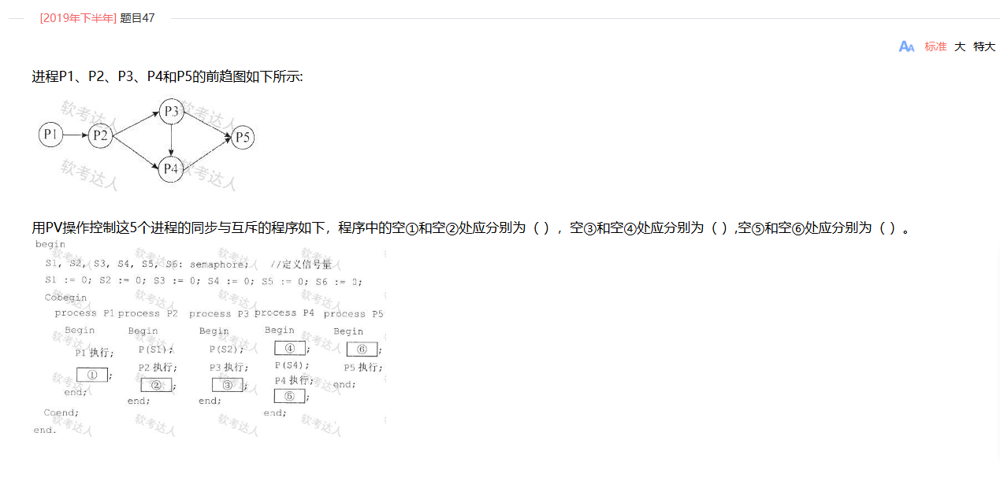
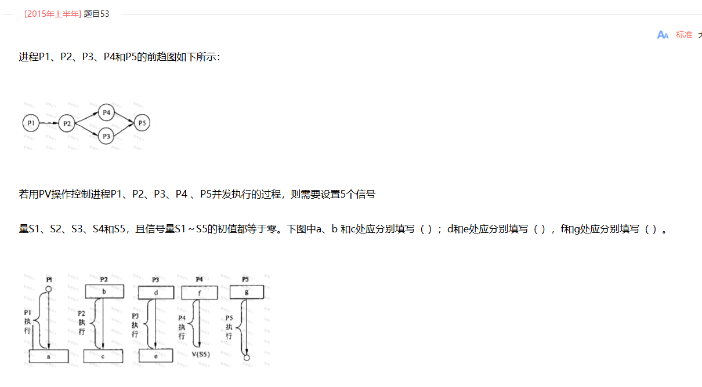
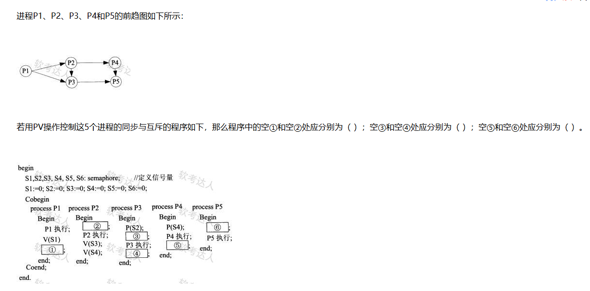
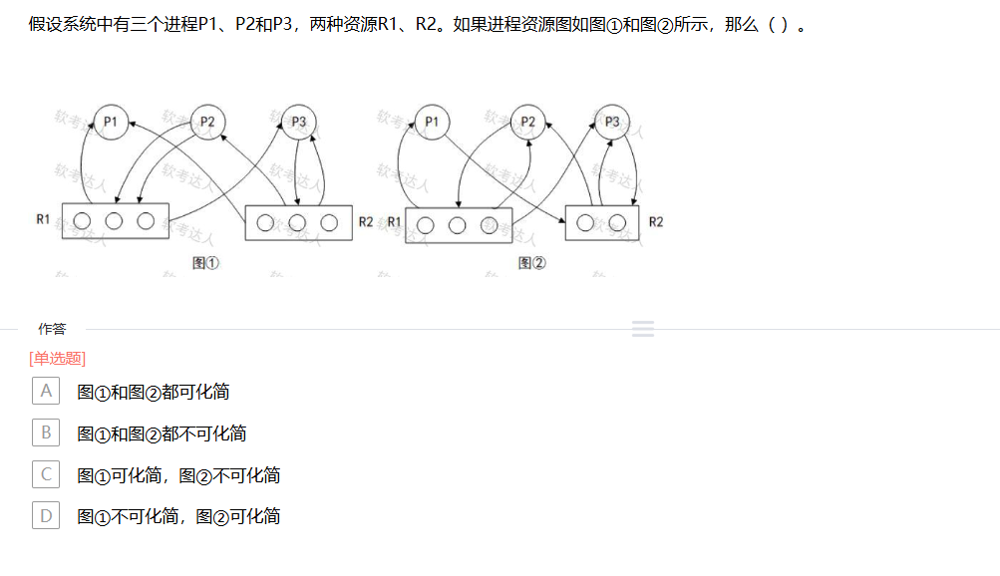

[toc]

# 软件设计师笔记_第四章_操作系统_精简考点

## 进程状态

> 真题示例1

在单处理机系统中，采用先来先服务调度算法。系统中有4个进程P1、P2、P3、P4 (假设进程按此顺序到达)，其中P1为运行状态，P2为就绪状态，P3和P4为等待状态，且P3等待打印机，P4等待扫描仪。若P1 时间片到了，则P1、P2、P3和P4的状态应分别为（ ）。

A 等待、就绪、等待和等待
B 运行、就绪、运行和等待
C 就绪、运行、等待和等待
D 就绪、就绪、等待和运行

解题思路：
- P1 状态：因为时间片到了，P1 不能继续占用 CPU ，它从运行状态转变为就绪状态，等待下一次被调度执行。
- P2 状态：在先来先服务调度算法下，P2 在就绪队列中等待，且 P1 时间片到了释放了 CPU ，按照先来先服务的规则，等待最久的 P2 将获得 CPU 进入运行状态。
- P3 和 P4 状态：P3 等待打印机，P4 等待扫描仪，它们所等待的资源未得到满足，依然处于等待状态 。

> 真题示例2

假设系统采用PV操作实现进程同步与互斥，若有n个进程共享一台扫描仪，那么当信号量S的值为-3时，表示系统中有（ ）个进程等待使用扫描仪。

答案是2。

系统采用PV操作实现进程的同步与互斥，当执行一次P操作表示申请一个资源，信号量S减1，如果S<0,其绝对值表示等待该资源的进程数。

> 真题示例3

在单处理机计算机系统中有1台打印机、1台扫描仪，系统采用先来先服务调度算法。假设系统中有进程P1、P2、P3、P4,其中P1为运行状态，P2为就绪状态，P3等待打印机，P4等待扫描仪。此时，若P1释放了扫描仪，则进程P1、P2、P3、P4的状态分别为（ ）。

本题解题关键在于理解进程状态以及先来先服务调度算法的特点，具体思路如下：
- 分析 P1 状态：P1 释放扫描仪，只是释放了占用的资源，它本身仍在运行，所以 P1 还是运行状态 。
- 分析 P2 状态：系统采用先来先服务调度算法，P2 处于就绪状态且在就绪队列中等待，在 P1 未结束运行且无更高优先级抢占情况下，P2 只能继续等待，状态依旧是就绪。
- 分析 P3 状态：P3 等待打印机，P1 释放的是扫描仪，与 P3 等待的资源无关，所以 P3 仍处于等待打印机的等待状态。
- 分析 P4 状态：P4 等待扫描仪，P1 释放了扫描仪，满足 P4 等待的资源条件，P4 从等待状态变为就绪状态，等待被调度执行

## PV操作

PV 操作原理：P 操作表示申请资源，使信号量的值减 1 ，若信号量的值小于 0 ，则进程进入等待队列；V 操作表示释放资源，使信号量的值加 1 ，若信号量的值小于等于 0 ，则唤醒等待队列中的一个进程。

进程同步与互斥：即通过信号量协调进程间的执行顺序，保证进程按正确的先后顺序执行。通过前驱图确定进程之间的先后关系，然后利用 PV 操作来实现这种同步关系。

> 真题示例1

分析进程间的依赖关系：从前驱图可知，P1 执行完后 P2 才能执行，P2 执行完后 P3 和 P4 才能执行，P3 和 P4 执行完后 P5 才能执行。

- 根据前驱图，P1进程运行完需要V(S1)操作通知P2进程，所以空①应填V(S1)。
- P2进程运行完需要利用V(S2)、V(S3)操作分别通知P3、P4进程，所以空②应填V(S2)V(S3)。
- 根据前驱图，P3进程运行完需要利用V(S4)、V(S5)操作分别通知P4、P5进程，故空③应为填写V(S4)V(S5)。
- P4需要等待P2和P5进程的通知，需要执行2个P操作，由于P4进程的程序中执行前有1个P操作P(S4)，故空④应为填写P(S3)。
- 根据前驱图，P4进程执行完需要通知P5进程，故P4进程应该执行1个V操作，即空⑤应填V(S6)。
- P5进程运行前需要等待P3和P4进程的通知，需要执行2个P操作，故空⑥应填写P(S5)和P(S6)。

> 真题示例2

- 根据前驱图，P1进程执行完需要通知P2进程，故需要利用V (S1)操作通知P2进程，所以空a应填V (S1)；
- P2进程需要等待P1进程的结果，故需要利用P (S1)操作测试P1进程是否运行完，所以空b应填P (S1)；
- 由于P2进程运行结束需要利用V (S2)、V (S3)操作分别通知P3、P4进程，所以空c应填V (S2)、V (S3)。

- 根据前驱图，P3进程运行前需要等待P2进程的结果，故需利用P(S2)操作测试P2进程是否运行完。所以空d应填P(S2)
- 又因为P3进程运行结束后需要利用V(S4)操作通知P5进程。所以空e应填V(S4)

-  根据前驱图，P4进程执行前需要等待P2进程的结果，故空f处需要1个P(S3)操作；
-  P5进程执行前需要等待P3和P4进程的结果，故空g处需要P(S4)P(S5)操作

> 真题示例3

- 根据前驱图，P1进程运行完需要利用V操作V(S1)、V (S2)分别通知P2、P3进程，所以空①应填V (S2)。
- P2进程需要等待P1进程的通知，故需要利用P(S1)操作测试P1进程是否运行完，由于P3进程执行前已经用P(S2)， 所以空②应填P (S1)。
- 根据前驱图，P3进程需要等待P1和P2进程的通知，需要执行2个P操作，即P (S2)、P (S3)。由于P3进程的程序中执行前有1个P操作P (S2)，故空③应为填写P (S3)。
- P3进程运行结束需要利用1个V操作通知P5进程，故空④应为1个V操作V (S5)。
- 根据前驱图，P4进程执行完需要通知P5进程，故P4进程应该执行1个V操作，即空⑤应填V (S6)。
- P5进程运行前需要等待P3和P4进程的通知，需要执行2个P操作，故空⑥应填写P(S5)和P(S6)。

## 进程通信

- 进程调度方式分为可剥夺和不可剥夺两种。
    - 可剥夺式是指当有更高优先级的进程到来时，强行将正在运行进程的 CPU分配给高优先级的进程；
    - 不可剥夺式是指当有更高优先级的进程到来时，必须等待正在运行进程自动释放占用的CPU，然后将CPU分配给高优先级的进程。

- 系统采用PV操作实现进程的同步与互斥，每当执行一次P操作表示申请一个资源，信号量S减1，如果S<0,其绝对值表示等待该资源的进程数。

## 死锁

> 真题范例1

某计算机系统中互斥资源R的可用数为8，系统中有3个进程P1、P2和P3竞争R，且每个进程都需要i个R，该系统可能会发生死锁的最小i值为（ 4 ）。

R资源可用数为8，分配到3个进程中，为了让最后的i值最小，所以每个进程尽量平均分配，可以得到3 、3、2的分配情况，此时如果假设i的取值为3，则必定不会形成死锁。当i>3时系统会形成死锁，此时取整，即最小i值为4。

> 真题范例2

正确答案C 图①可化简，图②不可化简

解析：

在图①中，R1的可用资源数=1，R2的可用资源数=0，进程P1是非阻塞节点，可以运行完毕: P1释放其占用的资源后，R1的可用资源数=2，R2的可用资源数=1，P2、P3都是非阻塞节点,因为P2申请2个R1资源、P1申请1个R2资源的请求均可以满足而运行完毕。可见进程资源图①是可化简的。图②中，R1和R2的可用资源数都为0，P1、P2和P3都是阻塞节点，所以图②是不可化简的。

> 真题范例2

假设某计算机系统中资源R的可用数为6，系统中有3个进程竞争R，且每个进程都需要i个资源R，该系统可能会发生死锁的最小i值是 （ 3 ） 。若信号量S的当前值为-2，则R的可用数和等待R的进程数分别为 （ 0、2 ） 。

解题思路：

资源R的可用数为6，系统中有3个进程竞争R，当每个进程分配2个进程数的适合，不会发送死锁。一旦大于2就会发生死锁。

信号量S的物理意义是：S≥0表示某资源的可用数，若S<0,则其绝对值表示阻塞队列中等待该资源的进程数。

本题由于信号量S的当前值为-2,则意味着系统中资源R的可用个数M=0, 等待资源R的进程数N=2。

> 真题范例3

某系统中有3个并发进程竞争资源R，每个进程都需要5个R，那么至少有（ 13 ）个R，才能保证系统不会发生死锁。

解题思路：

在有限的资源下，要保证系统不发生死锁，则可以按这种逻辑来分析。首先给每个进程分配所需资源数减1个资源，然后系统还有1个资源，则不可能发生死锁。即：3*4+1=13个。

## 真题

- 在计算机系统中，若P1进程正在运行，操作系统强行撒下P1进程所占用的CPU，让具有更高优先级的进程P2运行，这种调度方式称为（ 可剥夺方式 ）。

- 在单处理机系统中，采用先来先服务调度算法。系统中有4个进程P1、P2、P3、P4 (假设进程按此顺序到达)，其中P1为运行状态，P2为就绪状态，P3和P4为等待状态，且P3等待打印机，P4等待扫描仪。若P1时间片到了，则P1、P2、P3和P4的状态应分别为（  就绪、运行、等待和等待 ）。

- 假设系统采用PV操作实现进程同步与互斥，若有n个进程共享一台扫描仪，那么当信号量S的值为-3时，表示系统中有（ 3 ）个进程等待使用扫描仪。

- 假设某分时系统采用简单时间片轮转法，当系统中的用户数为n、时间片为q时， 系统对每个用户的响应时间T= （ n*q ）。

- 在单处理机计算机系统中有1台打印机、1台扫描仪，系统采用先来先服务调度算法。假设系统中有进程P1、P2、P3、P4,其中P1为运行状态，P2为就绪状态，P3等待打印机，P4等待扫描仪。此时，若P1释放了扫描仪，则进程P1、P2、P3、P4的状态分别为（ 运行、就绪、等待、就绪 ）。

- 假设系统中有n个进程共享3台扫描仪，并采用PV操怍实现进程同步与互斥。若系统信号量S的当前值为-1，进程P1、P2又分别执行了1次P（S）操作，那么信号量S的值应为（ -3 ）。
- 假设系统有n (n≥5) 个进程共享资源R，且资源R的可用数为5。若采用PV操作，则相应的信号量S的取值范围应为（ -(n-5)~5 ）。
- PV操作是操作系统提供的具有特定功能的原语。利用PV操作可以（ 实现资源的互斥使用 ）。
- 在支持多线程的操作系统中，假设进程P创建了线程T1、T2和T3， 那么以下叙述中错误的是（ 线程T1、T2可以共享P进程中T3的栈指针 ）。
