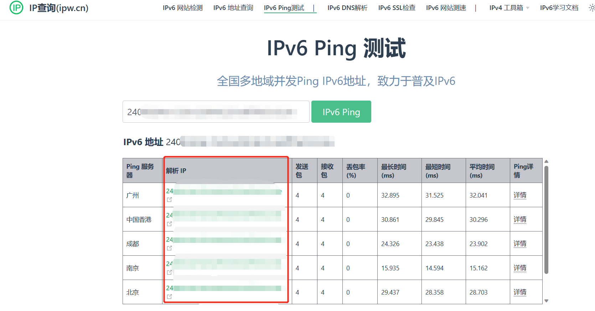

[toc]

# IPV6笔记

## 如何查询当前设备的ipv6是多少？

> windows系统：cmd->ipconfig

> linux系统：终端-》ifconfig

* 一般f开头的ipv6地址，是内网地址。24开头的地址是ipv6外网地址。
* ipv6采用了临时ipv6地址和长期ipv6地址,什么区别呢,临时ipv6地址,是你访问外网的时候使用的,外部其他人是无法连进来的,并且有效时间比较短,可以有效防止追踪,而长期ipv6地址,则默认不用来访问外部,一般用来部署服务,让外部用户连进来进行访问,有效期比较长,

## 如何检测是否有ipv6

1. 访问这个网站 [ipv6测试](http://test-ipv6.com/index.html.zh_CN)
   
2. 若结果如图所示，则表示你当前设备已经有了ipv6的地址了。

## 如何测试ipv6的地址是否能从外网访问

1. 访问这个网站 [IPv6 Ping 测试](https://ipw.cn/ipv6ping/)
2. 输入想要访问的ipv6地址。点击测试。
3. 如果如图所示，则表示你的ipv6网址还不能从外网访问。

访问失败的原因：如果你当前的设备是windows系统。你需要在windows系统上关闭ipv6防火墙。关闭防火墙之后，才有可能访问成功。如果是其他系统，那么也可能需要关闭防火墙。

4. 如果如图所示。那么表示你的ipv6网址能从外网访问。

