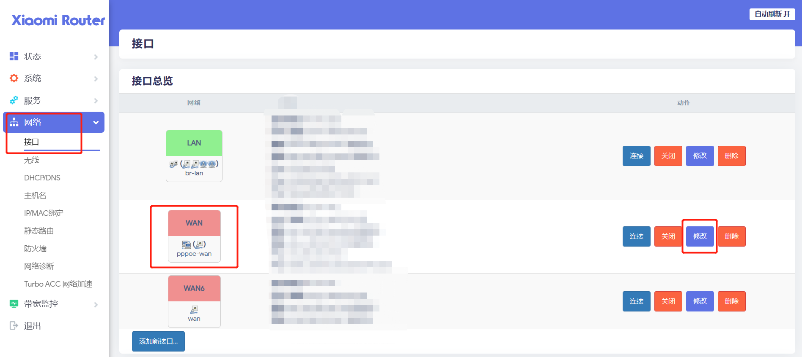
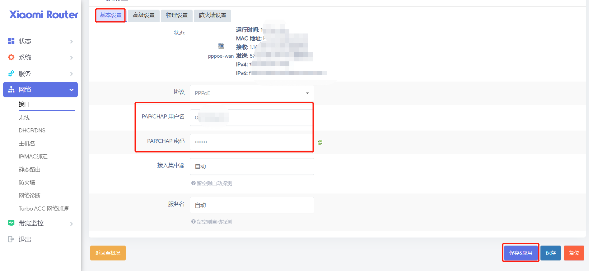
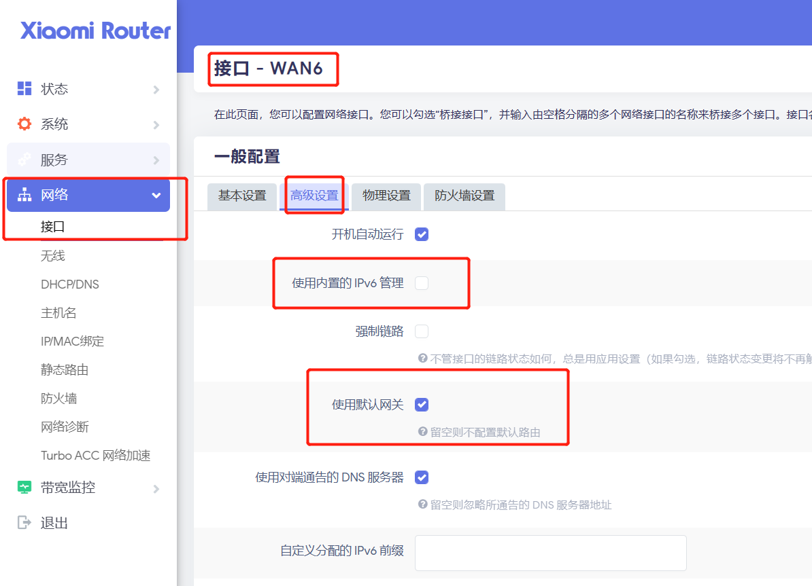
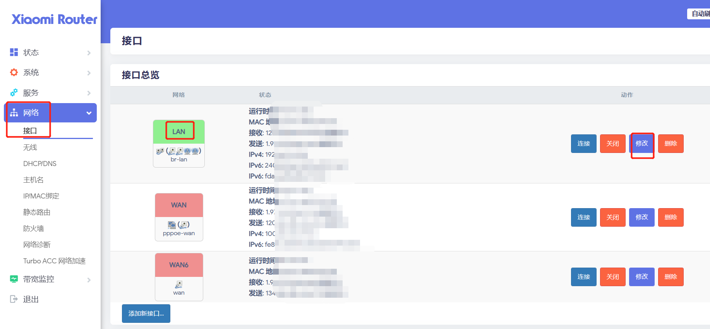
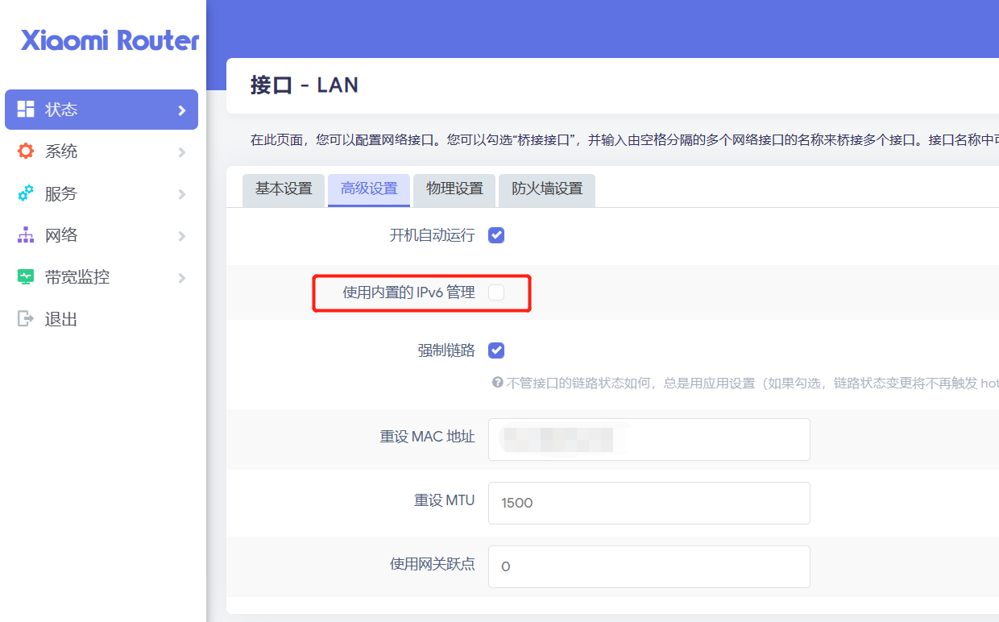
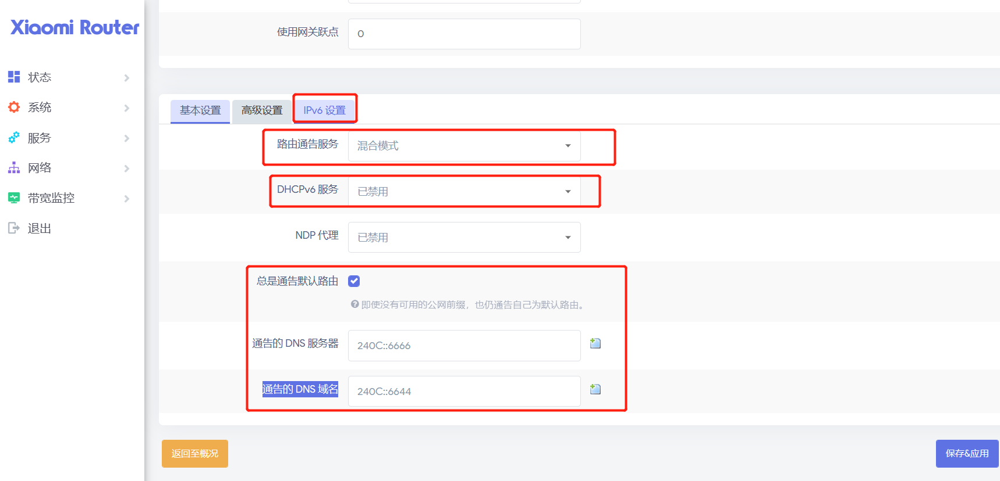
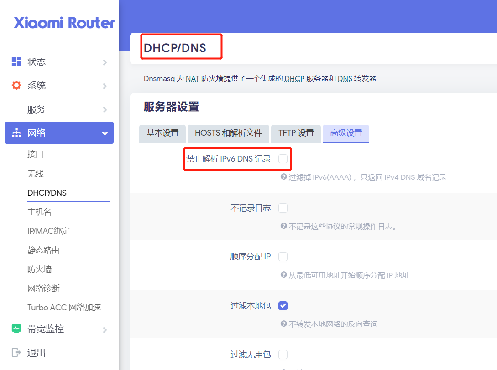

[toc]

# openwrt设置

## openwrt设置拨号

现在的光猫都具有拨号功能，但是由于光猫本身性能弱，如果让光猫负责拨号功能，容易导致光猫的负担大。

因此我们可以设置光猫桥接。让拨号功能由路由器来负责。

* 当前路由器：小米路由器4A千兆版
* 路由器系统：openwrt-小米路由器固件

> openwrt如何设置拨号?

1. 网络-》接口-》wan口-》基本设置

2. 协议选择PPPOE，然后点击切换协议。
3. 切换协议后，输入宽带账户密码。点击保存&应用。

4. 由于网络和系统的关系，可能不是立即拨号成功，如果出现这样的情况，可以把路由器断电重启即可。

## openwrt设置IPV6

目前绝大多数的家庭宽带都开头了ipv6。你可以登录光猫界面，查询光猫是否获取了ipv6地址。

如果光猫获取到了ipv6地址，那么可以在路由器中对ipv6进行设置。然后你家中的每一个设备都拥有了公网ipv6地址了。

>openwrt如何设置IPV6?

全局设置
1. 网络->接口->全局网络选项->IPV6前缀清空

wan6接口设置
1. 网络->接口->WAN6->高级设置
2. 不勾选 “使用内置的 IPv6 管理”
3. 使用默认网关
4. 点击保存&应用

lan接口设置
1. 网络->接口->LAN->高级设置

2. 不勾选 "使用内置的 IPv6 管理"

3. 路由通告服务 设置为 “混合模式”
4. 关闭 DHCPv6 服务
5. 勾选 “总是通告默认路由”
通告的 DNS 服务器： 240C::6666
通告的 DNS 域名：240C::6644
6. 点击保存&应用

DHCP/DNS 服务器设置
1. 网络->DHCP/DNS->高级设置
2. 不勾选 “禁止解析 IPv6 DNS 记录”

均衡负载策略设置（我当时的路由器没有这个设置）
1. 网络->负载均衡->策略
2. 备用成员选择为默认（使用主路由表）

设置完以上步骤，保存并重启路由器即可