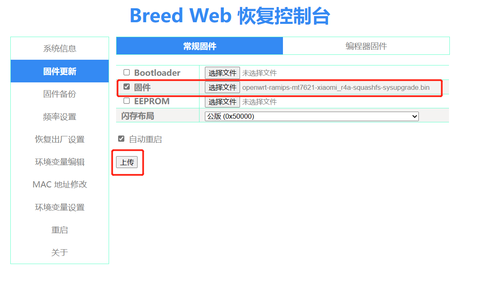

[toc]

# 小米路由器4A千兆版刷机

## 开启SSH和FTP

通过某种方式开启小米路由器4A千兆版的SSH服务，然后通过ssh进入到小米路由器4A千兆版的后台。

1. 提前安装好python环境。
2. 下载OpenWRTInvasion-0.0.8版本的代码压缩包，并解压。

下载地址：[https://github.com/acecilia/OpenWRTInvasion/releases/tag/0.0.8](https://github.com/acecilia/OpenWRTInvasion/releases/tag/0.0.8)

3. Win+R 输入 cmd 打开命令窗口，cd到OpenWRTInvasion-0.0.8目录中。
4. 运行以下命令，会让你输入路由器IP地址和密码。

```sh
# 下载文件
pip3 install -r requirements.txt

# 执行脚本
python remote_command_execution_vulnerability.py

# 输入路由器ip地址，一般是192.168.31.1
# 输入路由器密码
```


5. 然后用putty即可访问小米路由器的后台了。

- 注意：小米路由器默认ip是192.168.31.1
- 端口22，23都可以
- 账户密码默认是root/root


6. 用xftp工具就可以上传文件到小米路由器后台了


## 刷入breed系统

1. 用xftp工具访问路由器后台，将breed-mt7621-pbr-m1.bin文件上传到tmp文件夹内。
2. 之后执行命令

```sh
cd /tmp
mtd -r write breed-mt7621-pbr-m1.bin Bootloader
```

3. 执行完后，访问192.168.1.1。就能进入到breed系统页面了。

注意：此处的地址不是光猫的地址。


4. 备份eeprom和编程器固件，截图mac地址（如果变砖后恢复会用到）


## 如何重新进入breed系统界面

当你通过breed刷了其他系统后。再次访问192.168.1.1，就无法进入breed系统界面了。

> 如何重新进入breed系统界面

1. 断开小米路由器的电源，按下路由器 reset 按钮后重新接入电源。
2. 等到 mini 路由器的灯开始闪烁时，松开 reset 按钮。
3. 在电脑上输入 192.168.1.1，进入Breed控制台。

## 刷入openwtr系统 不推荐

1. 先进入breed系统界面192.168.1.1，备份eeprom和固件，截图mac地址（变砖后恢复会用到）。
2. 勾选固件，然后将小米4A的openwtr固件文件openwrt-ramips-mt7621-xiaomi_r4a-squashfs-sysupgrade.bin文件进行上传

 

4. 点击更新，更新过程中请不要切断路由电源。
5. 更新完成后, 页面并不会自动刷新。需要重新访问小米路由器页面192.168.31.1。账号密码是 root/coolxiaomi

 

 


## 刷入Padavan系统 推荐

小米路由器4A千兆版 适合刷入Padavan系统。Padavan系统相比openwrt系统更加简洁一些。

1. 重新进入breed界面。参考上面
2. 上传Padavan固件和之前备份的EEPROM固件。

 

3. 更新后，访问地址192.168.2.1。账户密码的admin/admin

 

默认的WiFi密码是：1234567890