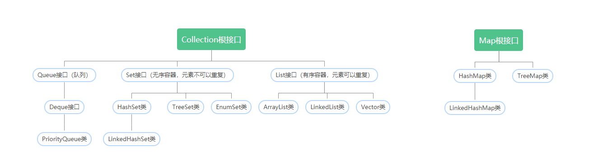
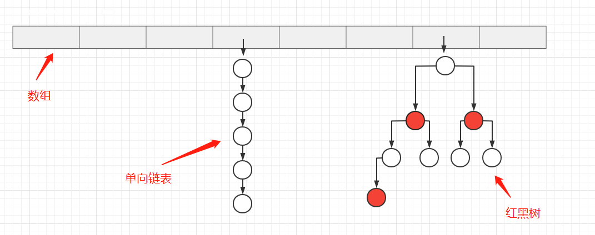
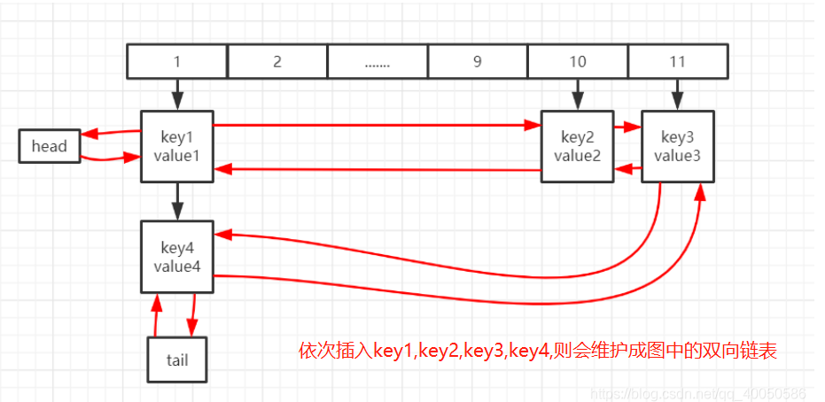
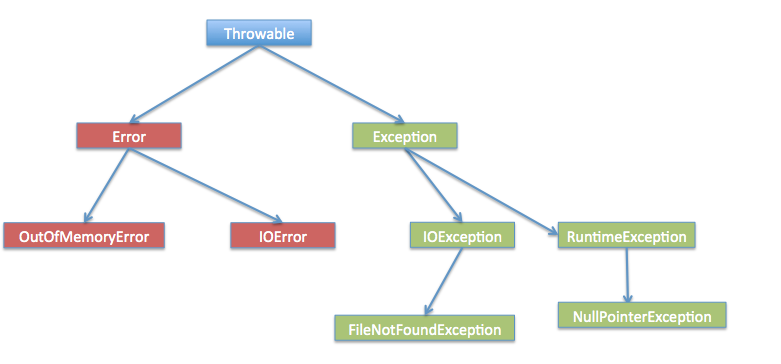

[toc]

## 《Java编程思想第四版》笔记


### 1. 对象的存储位置


① 从java角度上看，程序中有5个地方存储数据：

寄存器，堆栈，堆，常量存储，非RAM存储

② 从电脑硬件的角度上看，存储数据的位置有：

cpu中的寄存器，内存，硬盘


### 2. 基本数据类型及其对应的取值范围

```
整数类型： 
    byte  1个字节               取值范围：-2^7—2^7-1
    short 2个字节               取值范围：-2^15—2^15-1
    int   4个字节               取值范围：-2^31—2^31-1
    long  8个字节               取值范围：-2^63—2^63-1 
浮点数类型： 
    float  4个字节              取值范围：-2^31—2^31-1
    double 8个字节              取值范围：-2^63—2^63-1
字符型：
    char   1个字节              取值范围：0—2^16-1
布尔型:
    boolean 1个字节             取值范围：true\false
```

1. java中的小数默认识别为double类型，整数默认为int类型
2. char,byte,short 在算术表达式中会自动转化为int数据类型，表达式结果也是int数据类型。
3. 通常在算术表达式中，最大的数据类型决定了表达式结果的数据类型。即 float值 与 double 值相加，则结果就是double数据类型的。


### 3. 重载，重写的区别？

1. 重载是在同一个类中，有多个方法名相同，参数列表不同,与返回值类型无关，与访问权限修饰符无关。
2. 重写是子类对父类的允许访问的方法的实现过程进行重新编写。只是方法体重写，返回值类型和访问权限修饰符和参数列表都不能改变。

<font color="red">

1. 重载：与返回值类型无关，与访问权限修饰符无关。
2. 重写：返回值类型不能改变。访问权限不能比父类中被重写的方法的访问权限更低。

</font>

```java
class A{
   public void move(){
      System.out.println("aaa");
   }
   //重载move方法
   public void move(int a){
      System.out.println("bbb");
   }
}
class B extends A{
    //重写move方法
   public void move(){
      System.out.println("ccc");
   }
}
```


### 4. finalize()方法

finalize：是垃圾回收器操作的运行机制中的一部分，进行垃圾回收器操作时会调用finalize方法，因为finalize方法是object的方法，所以每个类都有这个方法并且可以重写这个方法，在这个方法里实现释放系统资源及其他清理工作，注意：JVM不保证此方法总被调用。


### 5. OutputStream , InputStream 快速记忆方式

Output 是从程序中出去的数据，即程序中输出的数据
Input 是进入到程序中的数据，即输入到程序中的数据

因此：程序读取文件，就是把文件的数据进入到程序中。使用InputStream。
程序创建文件，就是把程序中的数据拿出去到文件中。使用OutputStream


### 6. 类中成员变量的初始值

方法中的局部变量必须在使用前进行初始化，否则会显示编译错误。

对于类中的成员变量
1. 若类型的成员（属性）是基本数据类型,程序会给类的成员自动进行初始化。
2. 对于数字类型的属性，初始值为0
3. 对于char字符类型的属性，初始值为空字节符（ASCll码为0）
4. 对于对象类型的属性，初始值为null

```java
public class bb {
    byte a;
    short b;
    int c;
    long d;
    float e;
    double f;
    char g;
    boolean h;
    String i;   //String不是基本数据类型
    public bb(){
        System.out.println("byte: "+a);
        System.out.println("short: "+b);
        System.out.println("int: "+c);
        System.out.println("long: "+d);
        System.out.println("float: "+e);
        System.out.println("double: "+f);
        System.out.println("char: "+g);
        System.out.println("boolean: "+h);
        System.out.println("String: "+i);
    }
    public static void main(String[] args) {
        new bb();
    }
}
//运行结果
byte: 0
short: 0
int: 0
long: 0
float: 0.0
double: 0.0
char:  
boolean: false
String: null
```


### 7. 访问权限修饰符

java中访问权限修饰符有四种,按从大到小：public > protected > default > private。该访问修饰符可以应用在类，类的属性（变量），方法上面。

访问权限级别 | 本类 | 同包 | 不同包的子类 | 不同的包的非子类
------------ | ------------- |  ------------- |  ------------- |  ------------- 
公开 public | √ | √ | √ | √ 
保护 protected | √ | √ | √ | × | ×
默认 default | √ | √ | × | ×
私有 private | √ | × | × |× 

√ 可访问
x 不可访问

#### 1. 私有 private

<font color="red">
private修饰的变量和方法，只能在本类的范围中使用，无法再其他类范围中使用。可以用来隐藏类中的方法和属性。
</font>

```java
// test1 和 test2 是在同一包下
public class test1 {
    private int d_private=40;
}
public class test2 {
    public static void main(String[] args) {
        test1 test1 = new test1();
        System.out.println(test1.d_private);    
        //test1.d_private 编译报错。在test2类中无法访问test1对象的private变量
        //test1类的private变量只能在test1类中访问
    }
}
```


#### 2. 默认 default

<font color="red">
default (即默认，不使用任何修饰符）修饰的变量和方法，只能在同包中访问使用，不能在其他包中访问使用。
</font>

```java
// test1 和 test3 是在不同包下
public class test1 {
    int c_default=30;  //不使用任何修饰符,为默认修饰符default
}
public class test3 {
    public static void main(String[] args) {
        test1 test1 = new test1();
        System.out.println(test1.c_default); 
        //test1.c_default编译报错无法访问
        //test1的default修饰的变量无法在不同包下访问显示
    }
}
```

#### 3. 保护 protected

<font color="red">
protected修饰的变量和方法。只能在同包中和其他包的子类中访问使用。

1. 若子类和父类在同一个包中，则protected修饰的变量方法，能被其他类访问;
2. 若子类和父类不在同一个包中，子类可以访问其从父类继承而来的protected变量和方法，而不能访问父类对象自己的protected方法。

</font>

```java
// test1 和 test3 是在不同包下
public class test1 {
    protected int b_protected=20;  
}
public class test3 extends test1 {
    public static void main(String[] args) {
        test1 test1 = new test1();
        System.out.println(test1.b_protected);  
        //test1.b_protected编译报错无法访问
        //test1的protected修饰的变量无法在不同包下访问显示
    }
}
```

#### 4. 公共 public

<font color="red">
public修饰的变量和方法对所有包下的所有类可访问使用。
</font>

```java
// test1 和 test3 是在不同包下
public class test1 {
    public int a_public=10;
}
public class test3 {
    public static void main(String[] args) {
        test1 test1 = new test1();
        System.out.println(test1.a_public);    //可以访问
    }
}
```

1. 类所有的公有方法和变量都能被其子类继承。

#### 5. 代码举例

① 同包情况下
```java
// test1 和 test2 是在同一包下
public class test1 {
    public int a_public=10;
    protected int b_protected=20;
    int c_default=30;
    private int d_private=40;
}

public class test2 {
    public static void main(String[] args) {
        test1 test1 = new test1();
        System.out.println(test1.a_public);     //public可以访问
        System.out.println(test1.b_protected);  //protected可以访问
        System.out.println(test1.c_default);    //default可以访问
        System.out.println(test1.d_private);    //private无法访问。private变量，无法在其他类中使用
    }
}
```

② 不同包情况下
```java
// test1 和 test3 是在不同包下
public class test1 {
    public int a_public=10;
    protected int b_protected=20;
    int c_default=30;
    private int d_private=40;
}

import demo.test1;
public class test3 {
    public static void main(String[] args) {
        test1 test1 = new test1();
        System.out.println(test1.a_public);     //可以访问
        System.out.println(test1.b_protected);  //无法访问
        System.out.println(test1.c_default);    //无法访问
        System.out.println(test1.d_private);    //无法访问
    }
}
```

#### 6. 访问修饰符的继承规则

1. 父类中声明为 public 的方法在子类中也必须为 public。
2. 父类中声明为 protected 的方法在子类中要么声明为 protected，要么声明为 public，不能声明为private。
3. 父类中声明为 private 的方法，不能够被继承。


### 7.非访问权限修饰符 static final synchronized

#### 1. static 修饰符

static 主要用来修饰类的成员和方法。无论一个类实例化多少对象，被static修饰的变量和方法只有一份拷贝。

1. static修饰类的成员（静态变量）： 无论一个类实例化多少对象，它只有一份拷贝。 
2. static修饰类的方法（静态方法）： 静态方法只能使用静态变量，不能使用非静态变量。


```java
public class test1 {
   private static int a = 0;
   protected static int b() {
      return 1
   }
   public static void main(String[] args) {
      System.out.println(test1.a); 
      System.out.println(test1.b());
      //类变量和类方法直接用类名访问即可
   }
}
```

#### 2. final 修饰符

1. final修饰的变量：该变量必须显式指定初始值，一旦被赋值后不能被重新赋值。
2. final修饰的方法：该方法可以被子类继承，但是无法被子类重写。声明 final 方法的主要目的是防止该方法的内容被修改。
3. final修饰的类：该类不能被继承。

```java
public class Test{
  public static final int value = 6;
  public void aaa(){
     value = 12; //编译报错，该变量被final修饰，无法重新被赋值。
  }
}
```

#### 3. synchronized 修饰符

synchronized修饰的方法，同一时间内只能被一个线程访问。即线程无法同时访问该方法。

```java
public synchronized void aaaa(){
........
}
```


### 8.抽象类和接口

#### 1. 抽象类

1. 抽象方法：没有方法体的方法，就是抽象方法。
2. 抽象类：包含抽象方法的类是抽象类，用abstract关键字修饰。
3. 抽象类不能被实例化。
4. 抽象类的子类，必须重写父类中的所有的抽象方法，否则编译无法通过，除非该子类也是抽象类。
5. 抽象类中的抽象方法必须为public或者protected（因为如果为private，则不能被子类继承，子类便无法实现该方法），缺省情况下默认为public。

```java
//抽象类
public abstract class test5 {
    // 抽象方法,没有方法体
    public abstract void aa();
    //正常
    public void bb(){}
}
```

#### 2. 接口

1. 接口：若一个类中的方法全是抽象方法，则该类是接口,用interface关键字修饰。一般情况下不在接口中定义变量。
2. 接口中的变量会被隐式地指定为public static final 变量
3. 接口中的方法会被隐式地指定为public abstract 方法
4. 接口支持多继承，即一个接口可以继承extends多个接口，一个类可以实现implements多个接口。
5. 接口不能被实例化。

```java
public interface test4 {
    int a = 0;   //变量a 会被隐式地指定为public static final
    void aa();   //方法aa 会被隐式地指定为public abstract
}
```


#### 3.接口和抽象类的修饰符

<font color="red">

1. 抽象类中的抽象方法只能是public或protected，默认为public。
2. 接口中的变量都会被 public static final 修饰。即接口中只有常量，没有变量。
3. 接口中的方法都是抽象方法，会被public abstract 修饰

</font>


#### 4.接口和抽象类在设计上的区别

抽象类是对事物的抽象。是对整个事物的整体进行抽象，包括事物本身的属性和行为。例如老虎抽象类
接口是对某一种附加行为的抽象。例如，飞，游泳，遁地等附加行为。

```
举例：门都有open( )和close( )两个动作，如果我们需要设计一个门具有报警alarm( )的功能，那么该如何实现？

方式1： 将这三个功能都放在抽象类里面，但是这样一来所有继承于这个抽象类的子类都具备了报警功能，但是有的门并不一定具备报警功能；

方式2：将这三个功能都放在接口里面，需要用到报警功能的类就需要实现这个接口中的open( )和close( )，也许这个类根本就不具备open( )和close( )这两个功能，比如火灾报警器。 

方式3：由于open( )和close( )是门的本身的功能，而报警alarm( )的功能是给门的附加功能。因此解决办法是单独将报警设计为一个接口，包含alarm()行为。Door设计为单独的一个抽象类，包含open和close两种行为。再设计一个报警门继承Door类和实现Alarm接口。
```

<font color="red">从上面的例子可以看出继承是一个 "是不是"的关系，而 接口 实现则是 "有没有"的关系。</font>

### 9.java中的四种代码块，及其代码块的初始化顺序

1. 静态代码块：定义在类中,用static关键字修饰。该代码块属于类，因此只在类加载时会调用一次。优先于main方法执行。<font color="red">静态代码块中只能使用静态方法和静态变量</font>
2. 构造代码块：定义在类中，没有用static关键字修饰。会在创建对象时被调用，每次创建时都会被调用，优先于构造函数执行。
3. 普通代码块：定义在方法中，就是一段代码。普通代码块中声明的变量在代码块外部访问不到。执行顺序由代码中出现的次序决定。
4. 同步代码块：定义在方法中,synchronized(){}包裹起来的代码块。该代码块会被加上内置锁，用于线程同步机制。

```java
public class test2 {
    static {
        System.out.println("静态代码块");
    }
    {
        System.out.println("构造代码块");
    }
    public test2(){
        System.out.println("构造函数");
    }
    public void aa(){
        System.out.println("aa方法");
        {
            System.out.println("普通代码块");
        }
        synchronized (test2.class){
            System.out.println("同步代码块");
        }
    }
    public static void main(String[] args) {
        System.out.println("main方法");
        test2 one = new test2();
        one.aa();
    }
}

运行结果：

静态代码块
main方法
构造代码块
构造函数
aa方法
普通代码块
同步代码块
```

<font color="red">代码块执行顺序： 静态代码块 -> main方法 -> 构造代码块 -> 构造函数 -> 其他代码块</font>

> 父类子类中代码块的执行顺序？
父类静态代码块 > 子类静态代码块 > main()方法 > 父类构造代码块 > 父类构造函数 > 子类构造代码块 > 子类构造函数


### 10.类的继承规则

<font color="red">子类会继承父类的所有属性和所有方法，除了构造函数。但是对于父类的private属性和方法，子类无法直接访问，只能间接访问。</font>


### 11.类中变量，代码块，构造函数的初始化顺序

举例：
```java
//父类test1
public class test1 {

    private static int i = 10;
    private int j = 20;
    public test1() {
        System.out.println("父类 构造函数test1()");
    }
    static {
        System.out.println("父类 静态变量 i = "+i);
        System.out.println("父类 静态代码块");
    }
    {
        System.out.println("父类 变量 j = "+j);
        System.out.println("父类 构造代码块");
    }

    public static void main(String[] args) {
        System.out.println("父类 mian方法");
        test1 one =new test1();
    }
}
//单独执行父类test1的main方法，运行结果
父类 静态变量 i = 10
父类 静态代码块
父类 mian方法
父类 变量 j = 20
父类 构造代码块
父类 构造函数test1()


//子类test2
public class test2 extends test1{
    private static int x = 10;
    private int y = 20;
    public test2() {
        System.out.println("子类 构造函数test2()");
    }
    static {
        System.out.println("子类 静态变量 x = "+x);
        System.out.println("子类 静态代码块");
    }
    {
        System.out.println("子类 变量 y = "+y);
        System.out.println("子类 构造代码块");
    }

    public static void main(String[] args) {
        System.out.println("子类 mian方法");
        test2 two = new test2();
    }
}

//执行子类test2的main方法，运行结果
父类 静态变量 i = 10
父类 静态代码块
子类 静态变量 x = 10
子类 静态代码块
子类 mian方法
父类 变量 j = 20
父类 构造代码块
父类 构造函数test1()
子类 变量 y = 20
子类 构造代码块
子类 构造函数test2()

```

总结：
1. 单独类的初始化顺序：（静态变量，静态代码块）-》 main方法 -》 （普通变量，构造代码块，构造函数）
2. 父类子类的初始化顺序：（父类的静态变量，静态代码块）-》 （子类的静态变量，静态代码块）-》 子类的main方法 -》 （父类的普通变量，构造代码块，构造函数）-》 （子类的普通变量，构造代码块，构造函数）

<font color="red">注意：由于静态变量，静态代码块是属于类的。只在第一次实例化对象的时候调用一次，之后不会再调用。</font>


### 12.java中的四个内部类

java中内部类分为：成员内部类，静态内部类，方法内部类（局部内部类），匿名内部类

#### 1. 成员内部类

成员内部类：定义在外部类中。

```java
外部类test1
public class test1 {
    private String name1;
    private int age;
    //成员内部类
    public class test2{
        //成员内部类不能定义静态变量和静态方法
        private String name2;
        private int age;
        public void bbb(){
            System.out.println("内部类访问外部类成员变量 name1 = "+name1);
            //内部类访问外部类方法
            aaa1();
            //内部类访问外部类静态方法
            aaa2();
            System.out.println("内部类访问自己的变量 age"+this.age);
            System.out.println("内部类访问外部类同名变量 age"+test1.this.age);
        }
    }
    public void aaa1(){
        System.out.println("外部类方法 aaa");
        //外部类非静态方法可直接创建内部类
        test2 test2 = new test2();
    }
    public static void aaa2(){
        System.out.println("外部类静态方法 aaa2");
        //外部类静态方法创建内部类对象
        //方式1：通过外部类创建内部类对象
        test2 a = new test1().new test2();
        //方式2：通过外部类对象创建内部类对象
        test1 test1 = new test1();
        test2 b = test1.new test2();
    }
}
```

1. 内部类可以直接访问外部类的全部属性和方法（包括静态和非静态的），而外部类访问内部类需要内部类的对象来访问
2. 若外部类和内部类的变量名相同，在内部类可以通过this关键字来访问外部类同名变量。test1.this.age
3. 成员内部类可以使用四种访问权限修饰符进行修饰.
4. 成员内部类中不能写静态变量和方法。
5. 创建内部类，分为静态和非静态两种情况：
    1. 在外部类静态方法中，必须通过外部类对象来创建内部类对象，new test1().new test2();
    2. 在外部类非静态方法中，可以直接创建内部类对象


<font color="red">注意：静态方法只能访问静态变量和方法，无法访问非静态变量和方法。</font>

#### 2. 静态内部类

静态内部类：定义在外部类中，用static修饰符修饰。

```java
public class test1 {
    private static String name;

    public static class Inner{
        //与外部类同名的静态变量
        private static String name;
        public void show() {
            //重名时 访问外部类的静态变量使用外部类名.属性名访问
            System.out.println("访问外部类同名静态变量 name ="+test1.name);
        }
    }
    public static void main(String[] args) {
        //静态内部类可以直接实例化 不需要依附于外部类
        Inner inner = new Inner();
        inner.show();
    }
}
```

1. 静态内部类不能访问外部类的非static成员变量或者非static方法。
2. 静态内部类中即能声明静态成员也可以声明非静态成员。
3. 静态内部类访问外部类的静态变量,使用外部类名.属性名访问
4. 创建静态内部类对象，无需先创建外部类对象，可以直接实例化静态内部类对象。


#### 3. 方法内部类（局部内部类）

方法内部类，又称局部内部类：定义在方法中。

```java
public class test1 {
    private String name = "小米";
    private static int age = 10;

    public static void show() {
        System.out.println("外部类中的静态方法show");
    }
    public void printf() {
        System.out.println("外部类中的非静态方法printf");
    }
    public void demo() {
        String name = "张三";
        //编写在方法的内部的类称之为局部内部类
        //局部内部类不可使用权限修饰符 静态修饰符进行修饰 同局部变量相同
        //局部内部类与局部变量使用范围一样 在此方法内部
        //局部内部类可以直接访问方法中的属性 重名时使用参数传递完成访问
        //局部内部类 可以访问方法外部类中属性和方法
        class Inner{
            String name = "李四";
            public void showInner(String name) {
                show();
                printf();
                System.out.println("局部内部类访问外部类的变量 age ="+age);
                System.out.println("局部内部类访问外部类的同名变量 name ="+test1.this.name);
                System.out.println("局部内部类访问所在方法的同名变量 name ="+name);
                System.out.println("局部内部类访问自己变量 name ="+this.name);
            }
        }
        //局部内部类 创建对象 要在方法内部 局部内部类的外部声明
        Inner inner=new Inner();
        inner.showInner(name);
    }
    public static void main(String[] args) {
        test1 one = new test1();
        one.demo();
    }
}
```
0. 局部内部类不可使用访问权限修饰符,static修饰符进行修饰。因为局部内部类不属于外部类。
1. 局部内部类可以直接访问方法中的属性,以及方法外部类中属性和方法。
2. 创建局部内部类的对象需要在方法内部。
3. 在局部内部类中访问外部类变量（外部类名.this.属性名）, 访问方法的变量（属性名），访问自己的变量（this.属性名）。

#### 4. 匿名内部类

以后编写

### 13. java的值传递

将参数传给方法或函数的方式目前有两种：一种是值传递，一种是引用传递。

>值传递：
在方法被调用时，实参把它的内容拷贝副本传递给方法的形参。因此在方法内对形参的任何操作，都仅仅是对这个副本的操作，不影响实参的内容。

>引用传递：
”引用”也就是地址值，在方法调用时，实参的地址传递给相应的形参，在方法体内，若形参和实参始终指向同一个内存地址，则对形参的操作会影响的真实内容。

<font color="red">注意：java只有值传递。对于基本数据类型，就是传递数值。对于引用类型和数组类型，就是传递引用地址。</font>

#### 1. 值传递

```java
public class test1 {
    public static void aaa(int age, float weight) {
        System.out.println("传入的age：" + age);
        System.out.println("传入的weight：" + weight);
        age = 33;
        weight = 89.5f;
        System.out.println("方法内重新赋值后的age：" + age);
        System.out.println("方法内重新赋值后的weight：" + weight);

    }
    public static void main(String[] args) {
        int a = 25;
        float w = 77.5f;
        aaa(a, w);
        System.out.println("方法执行后的age：" + a);
        System.out.println("方法执行后的weight：" + w);
    }

}

传入的age：25
传入的weight：77.5
方法内重新赋值后的age：33
方法内重新赋值后的weight：89.5
方法执行后的age：25
方法执行后的weight：77.5
```
1. 从上面例子可以看到变量a,w经过方法后，本身的值并没有改变。因此值传递传递的是实参的一个副本，也就是形参怎么变化，不会影响实参对应的内容。
2. 变量age,weight是属于方法aaa的局部变量，当方法aaa执行结束后，这两个局部变量会被销毁。

#### 2. 引用传递

举例1：
```java
public class test1 {
    private String name;
    public String getName() {
        return name;
    }
    public void setName(String name) {
        this.name = name;
    }
    public static void aaa(test1 person) {
        System.out.println("传入的name：" + person.getName());
        person.setName("我是小红");
        System.out.println("方法内重新赋值后的name：" + person.getName());
    }
    public static void main(String[] args) {
        test1 p = new test1();
        p.setName("我是小明");
        aaa(p);
        System.out.println("方法执行后的name：" + p.getName());
    }
}

传入的name：我是小明
方法内重新赋值后的name：我是小红
方法执行后的name：我是小红
```

1. 对象中的name值经过aaa方法的执行之后,内容发生了改变。

举例2：在举例1中的aaa方法中增加一行代码
```java
public class test1 {
    private String name;
    public String getName() {
        return name;
    }
    public void setName(String name) {
        this.name = name;
    }
    public static void aaa(test1 person) {
        System.out.println("传入的name：" + person.getName());
        person = new test1(); //加此行代码
        person.setName("我是小红");
        System.out.println("方法内重新赋值后的name：" + person.getName());
    }
    public static void main(String[] args) {
        test1 p = new test1();
        p.setName("我是小明");
        aaa(p);
        System.out.println("方法执行后的name：" + p.getName());
    }
}

运行结果：
传入的person的name：我是小明
方法内重新赋值后的name：我是小红
方法执行后的name：我是小明
```

1. 方法中加入`person = new test1();`此行代码后，运行结果与第一个例子不相同了。
2. 当程序运行到新增代码之前，此时实参p和形参person的地址是一样的。对形参person的操作会影响到实参p。但是当程序运行到新增代码之后。形参person的地址被改变，形参person指向了一个新对象，此时实参p和形参person的地址不相同，对形参person的操作不会影响到实参p。
3. 当aaa方法执行完之后，形参person会被销毁。

<font color="red">
根据引用传递的含义：引用传递中形参实参指向同一个对象，形参的操作会改变实参对象的改变。在上面新增代码处，形参person的地址被改变了，因此实参p的地址也应该被改变。但是实际上，实参p的地址却没有改变。这表明无论是基本类型和是引用类型，在实参传入形参时，都是值传递，也就是说传递的都是一个副本，而不是内容本身。因此Java没有引用传递，只有值传递。
</font>

#### 3. 结论

在Java中不管基本类型还是引用类型，都是值传递。

1. 对于基本类型，实参传递给形参的是数值的拷贝。因此对形参的操作，不影响原始内容。同时由于实参在方法外，形参在方法内。方法一旦执行完形参就会销毁。
2. 对于引用类型和数组类型，传递的是地址。主要分两种情况
    1. 在方法执行的过程中，若形参和实参始终保持指向同一个地址，则形参的操作会影响实参。
    2. 在方法执行的过程中，形参重新指向新的对象地址（如被赋值引用），则形参的操作不会影响实参。


### 14. 关于equals和==和hashCode的描述？

1. `==` : 对于基本数据类型，判断值是否相等。对于引用类型，判断两个对象的地址是否相等。
2. `equal` : 主要判断两个对象的地址是否相等。但一般有两种使用情况
    1. 若类没有重写equals()方法,则相当于通过`==`比较。对于对象，则判断地址是否相等
    2. 若类重写了equals()方法。则一般通过equals()方法中的代码来比较两个对象的内容是否相等，相等则返回true。

对象的hashcode值是对地址进行hash算法加密得到的。因此
①对象相等 -》 hashcode相等
②对象不相等 -》 hashcode可能相等，因为不同的地址经过hash算法后，得到的值有相同的可能性。

### 15. java 容器类

java主要有两种不同的根容器接口。Collection接口和Map接口。
1. Collection容器接口：用线性列表的方式存储元素
2. Map容器接口：用键值对的方式存储元素。



#### 1. Collection容器接口

Collection容器接口本身无法使用，有三个重要的子接口，List接口，Set接口，Queue接口。并且提供了一系列操作容器的常规方法。

```java
//Collection容器接口提供操作容器的方法
boolean add(Object obj):向容器中添加指定的元素
Iterator iterator（）：返回能够遍历当前集合中所有元素的迭代器
Object[] toArray():返回包含此容器中所有元素的数组。
Object get（int index）：获取下标为index的那个元素
Object remove（int index）：删除下标为index的那个元素
Object set（int index,Object element）：将下标为index的那个元素置为element
Object add（int index,Object element）：在下标为index的位置添加一个对象element
Object put(Object key,Object value):向容器中添加指定的元素
Object get（Object key）：获取关键字为key的那个对象
int size():返回容器中的元素数   
```

<font color="red">Collection接口提供的一些方法，其具体实现类都可以使用。</font>

##### 1. List接口及其相关实现类

List接口是有序容器，容器中的元素存储位置根据加入的顺序决定。并且该容器可以存放重复元素。

> ArrayLisy类，线程不安全

```java
//ArrayLista的使用
public class test1 {
    public static void main(String[] args) {
        ArrayList<String> one = new ArrayList<String>();
        one.add("1");
        one.add("2");
        System.out.println(one);
    }
}
//ArrayList的源代码
public class ArrayList<E> extends AbstractList<E>
        implements List<E>, RandomAccess, Cloneable, java.io.Serializable
{
    //默认的初始容量为10
    private static final int DEFAULT_CAPACITY = 10;
    //通过一个Object[]数组来存储元素
    transient Object[] elementData;
    //容器中元素的个数
    private int size;
    ......
}

//1. ArrayList每次进行增加元素的操作时，会将size与容量进行对比。当size大于实际容量时，数组会默认将扩容至原来容量的1.5倍
```

1. ArrayList是基于对象数组实现的，添加元素时若数组的容量不够，ArrayList会自动扩容：
①添加元素前判断数组容量是否足够，若不够，则先扩容
②每次扩容都是按原容量的1.5倍进行扩容（新数组容量 = 原数组容量*1.5 + 1）
③原数组通过Arrays.copyOf()将原数据元素拷贝到新数组
2. ArrayLisy类的优缺点：
    1. 由于底层是数组，所以根据下标查询元素效率较高。
    2. 由于底层是数组，所以插入和删除元素的效率低。


> LinkedList类，线程不安全

```java
//LinkedList的使用
public class test1 {
    public static void main(String[] args) {
        LinkedList<String> one = new LinkedList<>();
        one.add("1");
        one.add("2");
        System.out.println(one);
    }
}

//LinkedList的源代码
public class LinkedList<E>
    extends AbstractSequentialList<E>
    implements List<E>, Deque<E>, Cloneable, java.io.Serializable
{
    transient int size = 0;
    transient Node<E> first;  //链表的头节点
    transient Node<E> last;    //链表的尾节点
    public LinkedList() {
    }
    //每个节点包含前指针，后指针。分别指向前一个节点和后一个节点
    private static class Node<E> {
        E item;
        Node<E> next;
        Node<E> prev;

        Node(Node<E> prev, E element, Node<E> next) {
            this.item = element;
            this.next = next;
            this.prev = prev;
        }
    }
    .......
}
//1. 通过节点中的next，prev，来使用双向链表的功能
//2. 节点中的item用来存放数据
//3. first 和 last 分别指向 首节点和尾节点


```

1. LinkedList底层是通过双向链表来存储元素的。
2. LinkedList的增加和删除元素效率高。查询元素相比ArrayList效率低。

> Vector类，线程安全

```java
//Vector类的使用
public class test1 {
    public static void main(String[] args) {
        Vector<String> one = new Vector<String>();
        one.add("1");
        one.add("2");
        System.out.println(one);
    }
}
//Vector类的源代码
public class Vector<E>
    extends AbstractList<E>
    implements List<E>, RandomAccess, Cloneable, java.io.Serializable
{
    protected Object[] elementData;
    protected int elementCount;
    protected int capacityIncrement;
    public Vector() {
        this(10);
    }
    public synchronized boolean add(E e) {
        modCount++;
        ensureCapacityHelper(elementCount + 1);
        elementData[elementCount++] = e;
        return true;
    }
    .....
}
```
 
1. Vector类的底层也是通过对象数组来存储元素。
2. Vector类中的方法都有synchronized关键字修饰，是线程安全的。
3. 因为Vector类中每个方法中都添加了synchronized的关键字来保证同步，使得它的效率比ArrayList的效率要慢。
4. <font color="red">Vector类大多数操作和ArrayList类相同，区别之处在于Vector类是线程同步的。因此可以将Vector类看作线程安全的ArrayList类。</font>

##### 2. Set接口及其相关实现类

Set接口是无序容器，容器中的元素存储位置不是根据加入的顺序决定。并且该容器不能存放重复元素。

> HashSet类 线程不安全

```java
//HashSet的使用
public class test1 {
    public static void main(String[] args) {
        HashSet<String> one = new HashSet<>();
        one.add("1");
        one.add("2");
        System.out.println(one);
    }
}
//HashSet的源代码
public class HashSet<E>
    extends AbstractSet<E>
    implements Set<E>, Cloneable, java.io.Serializable
{
    private transient HashMap<E,Object> map;
    public HashSet() {
        map = new HashMap<>();
    }
    public boolean add(E e) {
        return map.put(e, PRESENT)==null;
    }
    ....
}
// HashSet底层是基于 HashMap 来实现的，是一个不允许有重复元素的集合。
```

1. HashSet底层是基于 HashMap 来实现的。使用HashMap的key来作为单个元素存储。
2. HashSet容器允许只能有一个null值。
3. HashSet是根据被插入对象的hashcode值来选择对象的存储位置，若该位置已存在一个对象。则通过equals()方法来判断两个对象内容是否相同。相同则放弃插入，不相同则新对象取代旧对象。
4. 为了保证HashSet中的对象不会出现重复，在被存放元素的类中必须要重写hashCode()和equals()这两个方法。

> LinkedHashSet类

```java
public class test1 {
    public static void main(String[] args) {
        LinkedHashSet<String> one = new LinkedHashSet<>();
        one.add("1");
        one.add("2");
        System.out.println(one);
    }
}
//LinkedHashSet源代码
public class LinkedHashSet<E>
    extends HashSet<E>
    implements Set<E>, Cloneable, java.io.Serializable {
    private static final long serialVersionUID = -2851667679971038690L;
    public LinkedHashSet() {
        //调用父类的有参构造方法
        super(16, .75f, true);
    }
    .....
}
//HashSet源代码
public class HashSet<E>
    extends AbstractSet<E>
    implements Set<E>, Cloneable, java.io.Serializable
{
    ......
    //该构造方法创建LinkedHashMap对象
    HashSet(int initialCapacity, float loadFactor, boolean dummy) {
        map = new LinkedHashMap<>(initialCapacity, loadFactor);
    }
    ......
}
```

1. LinkedHashSet是HashSet的子类。底层是通过LinkedHashMap对象来实现的，而LinkedHashMap的底层是由双向链表组成。
2. LinkedHashSet通过双向链表可以保证元素的插入顺序，又因为是HashSet的子类，所以插入的元素不能重复。
3. 按照插入的顺序，来存储元素

> TreeSet类

```java
public class test1 {
    public static void main(String[] args) {
        TreeSet<String> one = new TreeSet<>();
        one.add("1");
        one.add("2");
        System.out.println(one);
    }
}
//TreeSet的源代码
public class TreeSet<E> extends AbstractSet<E>
    implements NavigableSet<E>, Cloneable, java.io.Serializable
{
    private transient NavigableMap<E,Object> m;
    private static final Object PRESENT = new Object();
    TreeSet(NavigableMap<E,Object> m) {
        this.m = m;
    }
    public TreeSet() {
        this(new TreeMap<E,Object>());
    }
    public boolean add(E e) {
        return m.put(e, PRESENT)==null;
    }
    .....
}
```

1. TreeSet的底层是基于TreeMap实现的。而TreeMap的底层是通过红黑二叉树实现的。
2. TreeSet通过红黑二叉树可以保证元素的插入顺序。又因为实现了Set接口，所以插入的元素不能重复。

##### 3. Queue接口及其相关实现类

1. Deque接口：双端队列，它支持在两端插入和删除元素，LinkedList类实现了Deque接口。
2. PriorityQueue类：优先级队列的元素按照其自然顺序进行排序，或者根据构造队列时提供的 Comparator 进行排序


#### 2. Map接口

Map接口容器主要是键值对的方式存储元素到容器中，Map中不能包含重复的key。有三个常用的实现类，HashMap类，TreeMap类，LinkedHashMap类。Map接口本身提供一些操作容器的方法。

```java
//Map接口本身提供一些操作容器的方法
put(K key,V value)	把指定的值与键添加到Map集合中，返回value值  //若key重复，则新的value替换旧的value
remove（Object key）	把指定键所在的键值对在集合中删除，返回被删除元素
get（Object key）	根据指定的键，获取对应的值
containsSky（Object key）	判断集合是否包含指定键，返回true或false
keySet()	获取Map集合中所有的键，存储到Set集合
entrySet()	获取Map集合中所有的键值对对象，存储到Set集合
```

##### 1. HashMap实现类，线程不同步，线程不安全，无序

```java
//HashMap的使用
public class test1 {
    public static void main(String[] args) {
        HashMap<String, String> one = new HashMap<>();
        one.put("1","tom");
        one.put("2","jack");
        System.out.println(one);  //{1=tom, 2=jack}
    }
}
//HashMap源代码
public class HashMap<K,V> extends AbstractMap<K,V> implements Map<K,V>, Cloneable, Serializable {
    public V put(K key, V value) {
        return putVal(hash(key), key, value, false, true);
    }
    transient Node<K,V>[] table; //数组
    ......
}


```
HashMap类底层设计图：



0. HashMap中键不可以重复，重复时，后者键值会覆盖前者
1. HashMap由数组和单向链表共同完成，当链表长度超过8个时会转化为红黑树。则HashMap的底层是散列表（数组+单向链表/红黑树）的方式进行存储元素。
2. 数组是节点类型数组，用于存放节点。节点可存储一个键值对。
3. HashMap的put方法步骤：
    ① 对key进行哈希算法来确定存储在数组中的那个index。哈希算法：index = HashCode（key） & （容器HashMap长度 - 1）。
    ② 若存储位置无元素存在，则直接存储。
    ③ 若存储位置已经有元素存在，则根据单向链表的存储方式。将新元素作为链表的头节点存储在数组上，旧元素作为新元素的下一个节点。（其中会遍历链表，用equals()方法来检查key是否重复，若有重复的key则覆盖，没有则当作新节点插入到链表头节点中）
    ④ 当链表的长度>8时，把链表转换为红黑树的形式存储元素。

##### 2. LinkedHashMap实现类，线程不同步，线程不安全，有序

```java
public class test1 {
    public static void main(String[] args) {
        LinkedHashMap<String, String> one = new LinkedHashMap<String,String>();
        one.put("1","tom");
        one.put("2","mike");
        one.put("3","jack");
        System.out.println(one); //{1=tom, 2=mike, 3=jack}
    }
}
//LinkedHashMap的源代码
public class LinkedHashMap<K,V> extends HashMap<K,V> implements Map<K,V>
{
    transient LinkedHashMap.Entry<K,V> head;
    transient LinkedHashMap.Entry<K,V> tail;
    static class Entry<K,V> extends HashMap.Node<K,V> {
        Entry<K,V> before, after;
        Entry(int hash, K key, V value, Node<K,V> next) {
            super(hash, key, value, next);
        }
    }
    .....
}
```




1. LinkedHashMap类继承自HashMap类，本质上LinkedHashMap = HashMap + 双向链表。
2. LinkedHashMap在HashMap的基础上，增加了双链表的结果（即节点中增加了前before、后after指针，LinkedHashMap中增加了head、tail指针），其他处理逻辑与HashMap一致，同样也没有锁保护，多线程使用存在风险。
3. LinkedHashMap类是有序的，容器内元素默认是按照插入顺序进行排序。

##### 3. TreeMap实现类，线程不安全，有序

```java
public class bb {
    public static void main(String[] args) {
        TreeMap<String, String> one = new TreeMap<>();
        one.put("1","jack");
        one.put("2","tom");
        one.put("3","mike");
        System.out.println(one);
    }
}
//TreeMap类源代码
public class TreeMap<K,V>
    extends AbstractMap<K,V>
    implements NavigableMap<K,V>, Cloneable, java.io.Serializable
{
    private final Comparator<? super K> comparator;
    private transient Entry<K,V> root;
    private transient int size = 0;
    private transient int modCount = 0;
    public TreeMap() {
        comparator = null;
    }
    //元素节点内部构造
    //每个节点包含父指针，左指针，右指针
     static final class Entry<K,V> implements Map.Entry<K,V> {
        K key;
        V value;
        Entry<K,V> left;
        Entry<K,V> right;
        Entry<K,V> parent;
        boolean color = BLACK;
        .....        
    }
    ....
}
```

1. TreeMap是一个有序的key-value集合，它是通过红黑树实现元素的存储。
2. TreeMap内部存储的元素，都会经过红黑树的排序之后再存储。红黑树的存储结构天然支持排序，默认情况下通过Key值的自然顺序进行排序；
3. TreeMap类线程不安全，按照比较的排序来存储元素。


### 16.Java Iterator（迭代器）

#### 1.Iterator接口

Java提供了一些对象用于专门处理集合中的元素.例如删除和获取集合中的元素.该对象就叫做迭代器(Iterator)。该对象比较特殊，不能直接创建对象（通过new），该对象是以内部类的形式存在于每个集合类的内部。

```java
//Collection接口源代码
public interface Collection<E> extends Iterable<E> {
    ....
    Iterator<E> iterator(); 
    ....
}
//例如Collection接口中定义了获取集合类迭代器的方法（iterator（）），因此所有的Collection体系集合都可以获取自身的迭代器。


// Iterator接口的源代码
public interface Iterator<E> {
    boolean hasNext();  //hasNext() 用于检测集合中是否还有元素
    E next();           //会返回迭代器的下一个元素
    default void remove() {  //将迭代器返回的元素删除
        throw new UnsupportedOperationException("remove");
    }
    ....
}
```

Iterator对象的使用
```java
public class bb {
    public static void main(String[] args) {
        ArrayList<String> one = new ArrayList<>();
        one.add("1");
        one.add("2");
        one.add("3");
        one.add("4");
        System.out.println(one);
        //通过while循环，Iterator对象来遍历容器元素
        Iterator it = one.iterator();
        while (it.hasNext()) {
            String next = (String) it.next();
            System.out.println(next);
        }
        //通过for循环，Iterator对象来遍历容器元素
        for (Iterator it2 = one.iterator(); it2.hasNext();) {
            String next2 = (String) it2.next();
            System.out.println(next2);
        }
    }
}
```


#### 2. ListIterator接口

Iterator在迭代时，只能对元素进行获取(next())和删除(remove())的操作。而对于Iterator的子接口ListIterator在迭代list集合时，还可以对元素进行添加。

```java
//ListIterator接口的源代码
public interface ListIterator<E> extends Iterator<E> {
    boolean hasNext();
    E next();
    boolean hasPrevious();
    E previous();
    int nextIndex();
    int previousIndex();
    void remove();
    void set(E e);
    void add(E e);
}
```


### 17.java 异常和错误



1. Throwable 类是 Java 语言中所有错误或异常的顶层父类，其他异常类都继承于该类。Throwable类有两个子类，Error类（错误）和Exception类（异常），各自都包含大量子类。 
2. Error（错误）:是程序无法处理的错误，表示运行应用程序中较严重问题。大多数错误与代码编写者执行的操作无关。例如栈溢出等错误。这些错误是不可查的，因为它们在应用程序的控制和处理能力之外。
3. Exception（异常）:代表程序运行时发送的各种不期望发生的事件。可以被Java异常处理机制使用，是异常处理的核心。


#### 1. Exception（异常）

Exception（异常）主要分为非检查性异常和检查性异常两大类。

> 非检查性异常：包括RuntimeException及其子类和Error。
对于非检查性异常，Java不会强制要求为这样的异常做处理工作。这些异常发生的原因多半是由于我们的代码逻辑出现了问题。例如：空指针异常，数组越界异常等。需要主动去修改代码逻辑。

> 检查性异常: 除了Error 和 RuntimeException的其它异常
对于检查性异常，就是指编译器在编译期间要求必须得到处理的那些异常，否则编译不会通过。这些异常发生的原因主要是程序运行环境导致的。例如SQLException，IOException，ClassNotFoundException等。


#### 2. 异常处理机制

java通过抛出异常和处理异常的方式来对异常进行处理。

抛出异常：throw和throws
处理异常：try...catch...finally...

#### 3. 异常处理的五个关键字

> 1. try – 用于监听可能抛出异常的代码。当try语句块内的代码发生异常时，异常就会被捕获。

> 2. catch – 用来捕获try语句块中发生的异常。如果try中没有发生异常，则所有的catch块将被忽略。

> 3. finally – finally语句块总是会被执行。它主要用于做一些清理工作(如关闭数据库连接、网络连接和磁盘文件等)。当finally块执行完成之后，才会回来执行try或者catch块中的return。

> 4. throws :若某个方法内可能会发生异常。而方法内部又没有处理这些异常。则可以再方法声明上使用throws关键字。将方法内部的异常抛出给使用者去处理。

注意：方法的使用若不通过try catch代码块处理方法内抛出的异常。也可以通过throws继续向上抛出异常。

> 5. throw ：可以通过关键字throw手动抛出一个具体的异常对象。若再方法内使用，则方法要用throw关键字将该异常向上抛出。或者使用try catch代码块处理这个异常。

```java
public class bb {
    public static void main(String[] args){
        try {
            aa();                //捕获该方法的异常，并进行处理
        } catch (Exception e) {
            e.printStackTrace();
        }
    }
    public static void aa () throws Exception {
        System.out.println("aa");
        throw new Exception();   //主动抛出一个异常，若不处理则需要再方法上通过throws关键字来抛出该异常
    }
}
```

```java
try{
   // 程序代码
}catch(异常类型1 异常的变量名1){
  // 程序代码
}catch(异常类型2 异常的变量名2){
  // 程序代码
}catch(异常类型2 异常的变量名2){
  // 程序代码
}

如果try中代码中发生异常，异常被抛给第一个 catch 块。 
如果抛出异常的数据类型与异常类型1匹配，它在这里就会被捕获。 
如果不匹配，它会被传递给第二个catch块。 如此，直到异常被捕获或者通过所有的 catch 块。
```


#### 4.自定义异常

通过自定义异常类型来向上报告某些错误信息。自定义异常类型可以选择继承 Throwable，Exception 或它们的子类。

```java
public class MyException extends Exception {
    public MyException() {
        super();
    }
    public MyException(String message) {
        super(message);
    }
}

//通常自定义的异常应该总是包含如下的构造函数：
//一个无参构造函数
//一个带有String参数的构造函数，并传递给父类的构造函数。

```

后续编写


### 18 泛型

泛型：即参数化数据类型。常与容器类配合使用，由于容器可以存放各种数据类型，给容器加上泛型可以限定容器内元素的数据类型。

泛型的好处：
1. 保证了容器中数据类型的一致性
2. 消除源代码中的许多强制类型转换
3. 避免了不必要的装箱、拆箱操作，提高程序的性能
4. 提高了代码的重用性

#### 1.通配符

```
常用的 T，E，K，V，？
上面这些都是通配符，各自都没有区别。是编码时的一种约定俗成的东西。

<？>    表示不确定的 java 类型
<T>     表示某个java类型
<K,V>   分别代表java键值中的Key Value
<E>     代表Element (在集合中使用，因为集合容器中存放的是元素)
<N>     代指Number（数值类型）

```

1. 尖括号`<>`中的字母被称作类型参数，代指任何类型，也可以用其他等字母来表示。
2. 注意：尖括号`<>`中的字母只能接受类，即使是基本数据类型必须使用包装类。


> 限定通配符extends和super

```
< ? extends E>  //表示这个泛型的参数数据类型必须是E或者E的子类
< ? super E>    //表示这个泛型中的参数数据类型必须是E或者E的父类

```


#### 1.泛型类

```java
//<T,T2> 参数化数据类型
public class Student<T,T2> {
    private T x;        //x成员变量为T类型
    private T2 y;       //y成员变量为T2类型
    public Student(){}
    public Student(T x, T2 y) {
        this.x = x;
        this.y = y;
    }
    public T getX() {
        return x;
    }
    public void setX(T x) {
        this.x = x;
    }
    public T2 getY() {
        return y;
    }
    public void setY(T2 y) {
        this.y = y;
    }
    public static void main(String[] args) {
        //实例化对象的时候，需要将具体的数据类型赋值给泛型
        Student<String,Integer> one = new Student<String,Integer>();
        one.x = "bob";
        one.y = 1;
        System.out.println(one.x);
        System.out.println(one.y);
    }
}

```

#### 2.泛型方法

```
泛型方法的语法：
访问修饰符 <T> 返回值类型 方法名(形参列表){
    方法体
}
```


```java
public class Student<T> {
    //泛型类中的使用了泛型的方法并不是泛型方法
    //非泛型方法的形参类型T由泛型类的泛型T决定
    public void method1(T a1){
        System.out.println("a1.class = "+a1.getClass());
        System.out.println("a1 ="+a1);
    }
    //只有声明了<T>的方法才是泛型方法
    //泛型方法的形参类型T由实参的数据类型决定，与泛型类的形参T无关
    public <T> void method2(T a2){
        System.out.println("a2.class = "+a2.getClass());
        System.out.println("a2 ="+a2);
    }
    public static void main(String[] args) {
        Student<String> one = new Student<String>();
        one.method1("1");   //该方法不是泛型方法，形参类型由泛型类中的T决定
        one.method2(1);     //该方法是泛型方法，形参类型根据实参类型决定
    }
}

运行结果：
a1.class = class java.lang.String
a1 =1
a2.class = class java.lang.Integer
a2 =1

```
1. 泛型方法的方法声明比普通方法的方法声明多了泛型形参声明`<T>`
2. 只有声明了`<T>`的方法才是泛型方法。泛型类中的使用了泛型形参的方法并不是泛型方法。
3. 泛型方法的泛型参数T，与所在泛型类的泛型参数T无关。


#### 3.泛型接口

```java
//泛型接口
public interface Student<T>{
    public void show(T t);
    public ArrayList<T> findAll();
    public T findById(Integer id);
}
//泛型接口实现类
public class A implements Student<String>{
    @Override
    public void show(String s) {
        System.out.println("s");
    }
    @Override
    public ArrayList<String> findAll() {
        return null;
    }
    @Override
    public String findById(Integer id) {
        return null;
    }
}

```


### 19 File类

File类可以代指一个文件或者一个目录,用于操作文件。

File类的构造方法：
方法 | 描述
----- | -----
File(String pathname) | 通过路径名来创建一个File对象
File(String parent,String child) | 通过父路径，子路径创建一个File对象
File(File parent,String child) | 根据父文件与子路径来创建File对象

```java
public static void main(String[] args) throws Exception {
	//根据路径创建文件的实例化对象
	File file=new File("C:\\Users\\XXX\\Desktop\\a.txt");
	System.out.println("文件名称 ："+file.getName());
	System.out.println("文件的相对路径："+file.getPath());
	System.out.println("文件的绝对路径："+file.getAbsolutePath());
	System.out.println("判断是否是一个文件："+file.isFile());
	System.out.println("判断是否是一个目录："+file.isDirectory());
	System.out.println("删除文件："+file.delete());
}
```


<h4>①遍历目录下的第一层文件（若目录有文件，则无法遍历）：</h4>

```java
public static void main(String[] args) throws Exception {
		//根据路径创建实例化对象
		File file=new File("D:\\study");
		//判断是否是一个目录
		if(file.isDirectory()) {
			String[] str=file.list();//获得该目录下的所有文件名
			for(String s:str) {
				System.out.println(s);
			}
			
		}
}
```

<h4>①遍历目录下的所有文件（包括子目录中的文件）：</h4>

```java
public static void main(String[] args) throws Exception {
		//根据路径创建实例化对象
		File file=new File("D:\\study");
		//判断是否是一个目录
		if(file.isDirectory()) {
			File[] f=file.listFiles();  //获取目录下的所有文件与子目录
			for(File fo:f) {
				System.out.println(fo);
				//对每一个文件对象再次遍历
				if(fo.isDirectory()) {
					String[] str=fo.list();  //获取目录下的所有文件名
					for(String s:str) {
						System.out.println(s);
					}
				}
			}
		}
	}
```


### 20 I/O流


I/O流的分类：
1. 先根据传输数据类型分为：字节流和字符流。字节流可以处理任何类型的数据，如图片，视频等，字符流只能处理字符类型的数据。
2. 之后根据传输方向分为：输入流和输出流
3. 最后根据操作对象划分：文件流，数组流，管道流等


<font color="red">注意：java通过输入流将源对象数据输入到程序内存中，通过输出流将程序内存中的数据输出到目标对象中</font>


#### 1. 字节流InputStream，OutputStream

字节流中的最顶级的两个抽象类为InputStream 和 OutputStream。程序中通常使用这两个抽象类的实现类。

>InputStream抽象类中的抽象方法

方法 | 描述
----- |  -----
int read() | 读取一个字节，把它转换为0~255的整数，并返回该整数。
int read(byte[] b)  |  读取字节，并保存到字节数组b中，返回读取的字节数
int read(byte[] b,int off,int len) | 读取字节，并保存到b字符数组中，其中off为数组的开始下标，len为读取的字节数
void close() | 关闭输入流
 
>OutputStream抽象类中的抽象方法

方法 | 描述
----- |  -----
void writer(int b) | 向输出流写入一个字节b
void writer(byte[] b)  |  把字节数组写入到输出流中
void writer(byte[] b,int off,int len) | 把数组中从off下标开始的字节写入len个长度到输出流中。
void flush() | 刷新输出流
void close() | 关闭输出流

#### 2. 文件输入输出流FileInputStream，FileOutputStream

1. Java提供FileInputStream 和 FileOutputStream来专门用于读写文件数据。
2. FileInputStream 和 FileOutputStream 分别是InputStream，OutputStream的实现类。

> 例子1：读写文件数据

```java
public static void main(String[] args) throws Exception {
    FileInputStream f = new FileInputStream("C:\\Users\\Desktop\\a.txt");
    int b=0;   
    while(true) {
        b=f.read();   //获取从文件中读取的每一个字节
        if(b==-1) {   //若文件读取结束
            break;
        }
        System.out.println(b);
    }
    f.close();  //关闭输入流
}

/*
运行结果：（文件内容:this is a.txt）
116
.....
*/

public static void main(String[] args) throws Exception {
	//创建文件字节输出流，用于写入数据到文件中
	FileOutputStream os = new FileOutputStream("C:\\Users\\Desktop\\a.txt");
	String str="hello world";
	byte[] b=str.getBytes();   //把字符串转换为字符数组
	for(int i=0;i<b.length;i++) {
		os.write(b[i]);   //把字符数组的数据写入到文件中
	}
	os.close(); 
}
/*
运行结果：hello world
*/
```

1. FileOutputStream写入数据到文件，会把文件内的数据清空后再写入（即会丢失文件之前的数据）。
2. 使用FileOutputStream的构造函数FileOutputStream(String fname,boolean append)，把append设置为true时，写入数据时，原先数据不会被清空。
3. FileOutputStream若目标文件不存在，则会创建一个新的文件，再写入数据。 


> 例子2：复制文件数据

```java
public static void main(String[] args) throws Exception {
	//输入流读取a文件数据
	FileInputStream fin=new FileInputStream("C:\\Users\\Desktop\\a.txt");
	//输出流写入数据到b文件
	FileOutputStream os = new FileOutputStream("C:\\Users\\Desktop\\b.txt");
	int t=0;   
	while(true) {
		t=fin.read();  //读取文件内字节数据
		if(t==-1) {   //-1表示读取数据完毕
			break;
		}
		os.write(t);    //把从文件a读取的数据，写入到文件b中
	}
	
	fin.close();
	os.close(); 
	}
```

> 例子3：通过缓存区，加快文件输入输出速度

1. 通过定义一个字节数组作为缓冲区，来提高字节流读取写入的效率。

```java
public static void main(String[] args) throws Exception {
	//输入流读取文件a数据
	FileInputStream fin=new FileInputStream("C:\\Users\\Desktop\\a.txt");
	//输出流写入数据到b文件
	FileOutputStream os = new FileOutputStream("C:\\Users\\Desktop\\b.txt");
	byte[] b=new byte[1024];  //定义字节数组作为缓冲区
	int t;   //临时存储一个字节
	while(true) {
		t=fin.read(b);
		if(t==-1) {   //-1表示读取数据完毕
			break;
		}
		os.write(b);   //把缓冲区的数据写入到文件b中
	}
	
	fin.close();
	os.close(); 
	}
```


#### 3.字符流Reader,Writer

1. 字符流有两个顶级抽象类Reader,Writer。程序中经常使用他们的实现类来读写数据。
2. InputSteamReader类可以把InputSteam转换为Reader
3. OutputSteamWriter类可以把OutputSteam转换为Writer


#### 4.字符流读写文件---FileReader,FileWriter

```java
public static void main(String[] args) throws Exception {
	FileReader fr=new FileReader("C:\\Users\\Desktop\\a.txt");
	int t;   
	while(true) {
		t=fr.read();  //存储从文件中读取的一个字符
		if(t==-1) {
			break;
		}
		System.out.println((char)t);  //强制转换为字符
	}
	fr.close();
	
}

//--------------------

public static void main(String[] args) throws Exception {
	FileWriter fw=new FileWriter("C:\\Users\\Desktop\\a.txt");
	String str="good bybe";
	fw.write(str);     //把字符串写入文件a中
	fw.close();
}

```

1. FileWriter会把文件原先的数据清空，在写入数据。
2. FileWriter的构造函数FileWriter(String fname,boolean append)可以确保写入数据时原先数据不被清空


### 21 enum枚举类

枚举enum可以将一些常量组织为一种新的数据类型。例如一个人的性别只能是“男”或者“女”，一周只能是7天。类似只能有几种固定的取值的常量时，就可以将它定义为枚举类型。枚举的好处是可以把常量组织为枚举类，从而更方便的去使用这些常量。使用场景一般是异常代码状态等

#### 1.使用枚举类之前的背景说明

在使用枚举类之前，是通过静态常量来表示一组常量数据。当常量越来越多的时候，如果全写在一个文件里面容易造成命名混淆，程序就不具备可读性，你无法直接通过数字来看出代表的含义。

```java
public class ColorEnum {
    //通过1，2，3来表示红绿蓝三个常量，当数字越多，常量越多。可读性就变得很差。
    public static final int RED = 1;
    public static final int GREEN = 2;
    public static final int BULE = 3;
}
```

> 为什么放弃静态常量，而使用enum枚举类？

1.static方式的静态变量类型不安全，可以在调用的时候传入其他值，导致错误
2.static方式的静态变量不支持属性扩展，每一个key对应一个值，而enum枚举类型的每一个常量成员可以拥有自己的属性


#### 2.使用枚举类

枚举类是指由一组固定的常量组成的类。并且便于记忆和使用，所见即所得。

> 举例1  枚举基本用法

```java
public enum ColorEnum {
    //颜色枚举类有红绿蓝三个常量，java程序会按常量顺序默认给常量指定为0，1，2的属性值
    RED,GREEN,BULE;

    public static void main(String[] args) {
        System.out.println(ColorEnum.RED);
        System.out.println(ColorEnum.GREEN);
        System.out.println(ColorEnum.BULE);
        System.out.println("values方法的用法:"+ColorEnum.values().toString());
        System.out.println("valueOf方法的用法:"+ColorEnum.valueOf("RED"));
        System.out.println("ordinal方法的用法:"+ColorEnum.RED.ordinal());
    }
}
//运行结果
// RED
// GREEN
// BULE
// values方法的用法:[Lcom.neusoft.fileUpload.test3.ColorEnum;@2d98a335
// valueOf方法的用法:RED
// ordinal方法的用法:0
```


1. 枚举类使用 enum 关键字来定义。各个常量使用逗号 , 来分割,结尾使用分号;结束
2. 在编译枚举类时，会给枚举类型中的每一个常量指定一个序号值。若枚举类定义中没有指定常量的序号值，则序号值从0开始依次递增，因此，ColorEnum枚举类型的3个常量RED、GREEN、BULE对应的序号值分别为0、1、2。注意：在定义枚举类型时，可以指定常量对应的序号值或者属性。
3. 枚举类无法继承其他类。因为在编译枚举类时，Java会让枚举类继承自 java.lang.Enum 类。
4. 枚举类的变量都会被 public static final 修饰符修饰。
5. 枚举类的构造方法是私有的，默认的就是private，定义的时候不加也没事。
6. 由于枚举类继承java.lang.Enum 类。因此可以使用继承自java.lang.Enum 类的常用方法：    
    values()	以数组形式返回枚举类的所有成员常量
    valueOf()	把一个字符串转为对应的枚举类对象，要求字符串必须是枚举类对象的名字
    compareTo()	比较两个枚举成员在定义时的顺序
    ordinal()	获取枚举成员的索引位置


> 举例2 enum类自定义属性

```java
public enum ColorEnum {
    //给枚举常量指定name和index属性，需要创建对应属性的构造方法
    Red("红色", 1), Green("绿色", 2), Blue("蓝色", 3);
    String name;
    int index;
    //构造方法
    ColorEnum(String name, int index) {
        this.name = name;
        this.index = index;
    }
    public static void showAllColors() {
        System.out.println("ColorEnum.values() = "+ColorEnum.values());
        for (ColorEnum color : ColorEnum.values()) {
            System.out.println(color.index + ":" + color.name);
        }
    }
    public static void main(String[] args) {
       showAllColors();
    }
}

```

1. 主动给枚举常量自定义数值，需要重写对应的构造方法，否则编译错误。


### 22 注解

Java注解（Annotation）又称Java标注，是JDK5.0引入的一种注释机制。类，构造器，方法，成员变量，参数都可以被注解。在编译器生成类文件时，注解会被嵌入到字节码中。

注解的作用：
1. 用于生成java代码文档
2. 在编译期间，可以通过注解来对代码进行检查处理。
3. 跟踪代码依赖性，替代配置文件功能


注解的分类：
1. 标准注解（内置注解）：Java程序语言自带的注解，例如：@Override用于说明所标注的方法是重写父类的方法。
2. 元注解：Java程序语言自带的注解，主要用于指定用户的自定义注解。即修饰自定义注解的注解。例如：@Target用于指定用户自定义的注解只能修饰程序中哪些元素。
3. 自定义注解：该注解是用户自行编写的。


#### 1. 自定义注解

```java
@Documented    //元注解，标记该注解是否包含在用户文档中。
@Target(ElementType.TYPE) //元注解 标记该注解用于Java那个成员部分。ElementType.TYPE表示该注解用于类、接口或者枚举声明
public @interface MyAnnotation1 {
    //给该注解定义两个属性变量
    //需要给每个属性变量设置默认值
    public String name() default "null";
    public String value() default "null";
}

@Documented    
@Target(ElementType.TYPE) 
public @interface MyAnnotation2 {
}


//注解的使用
@MyAnnotation1(name="111",value = "111")
public class bb{
}

//注解的使用
@MyAnnotation2
public class aa{
}


```

1. 定义一个注解， 必须需要使用关键字@interface。该关键字表示该自定义注解实现了 java.lang.annotation.Annotation 接口。注意:这与使用implemented 实现接口的方式不同。
2. 上面例子中的三个元注解，都是指定该自定义注解的功能。
3. 可以在自定义注解中设置属性变量。这些属性变量需要设置默认值。当在其他地方使用自定义注解时。需要给注解的属性赋值。


### 23 多线程，并发

java不仅是面向对象的语言，也是一门多线程语言。

#### 1.基本概述：

进程与线程
1. 进程是指系统中运行的应用程序，系统中运行的每一个应用程序就代表着每一个线程。每一个进程都有自己独立的内存空间。
2. 线程是指进程中的一个任务操作（或者说子功能）。例如迅雷是一个进程，在迅雷中下载一个文件，这个下载功能就是一个线程。同时下载多个文件，就是多个线程在进程中执行。
3. 一个进程可以由多个线程组成，即在一个进程中可以同时运行多个不同的线程，它们分别执行不同的任务。
4. 当进程内的多个线程同时运行，这种运行方式称为并发运行

#### 2. java中线程的创建

>Java 提供了三种创建线程的方法：
①通过继承 Thread 类本身,重写该类的run方法。
②通过实现 Runnable 接口
③通过 Callable 和 Future 创建线程。暂不演示

记忆口诀：
0. run()：包含线程运行时所执行的代码。start()：用于启动线程。
1. 无论是继承Thread类还是实现Runnable接口。新的类都是先重写run()方法，后执行start()方法。
2. 继承Thread类后，子类实例化对象直接调用执行start()方法。
3. 实现Runnable接口后，将实现类当作参数传入Thread构造方法中，在调用start()方法。因此两种创建线程的方式都是以Thread类为主。
4. 通常run()方法内部会被写错while循环的形式。除非达成条件，否则该线程永远运行下去。


##### 1. 通过继承Thread类来创建线程

1. 继承Thread类，并重写Thread类的run方法。
2. 实例化对象，调用start()方法。此时每一个实例化对象就代表一个线程
3. Thread类的常用方法：
    1. start()：使该线程开始执行,Java虚拟机调用该线程的run方法。
    2. run() : 如果该线程是使用独立的 Runnable 运行对象构造的，则调用该 Runnable 对象的run方法；否则，该方法不执行任何操作并返回。
    3. setName(String name):设置线程名称
    4. sleep(long millisec)：静态方法，让当前正在执行的线程休眠（暂停执行）

ps: 继承类必须重写 run() 方法，该方法是新线程的入口点。它也必须调用 start() 方法才能执行。本质上也是实现了Runnable接口的一个实例。

```java
//①通过继承 Thread 类,重写该类的run方法:
//通过调用start()方法来启动线程的run方法
public class Mythread extends Thread{
    public void run(){
        //每个线程都会打印50次语句，
        for(int i=0;i<50;i++){
            System.out.println("线程名字："+getName()+"重写Thread类的run方法");
        }
    }
    public static void main(String[] args) {
        //创建3个线程，并设置线程的名字
        Mythread mythread1 = new Mythread();
        mythread1.setName("线程1");
        mythread1.start();
        Mythread mythread2 = new Mythread();
        mythread2.setName("线程2");
        mythread2.start();
        Mythread mythread3 = new Mythread();
        mythread3.setName("线程3");
        mythread3.start();
    }
}
```

##### 2. 通过实现 Runnable 接口来创建线程

<font color="red">由于java只支持单继承，若A类已经继承B类，则A类就无法继承Thread类，实现不了多线程操作。此时可以实现Runnable接口实现多线程。通常用接口来实现多线程更普遍。</font>

PS:当Thread类的构造方法接受Runnable接口的实现类时，调用的run方法是，该实现类的run方法。并不是Thread类本身的run方法

```java
public class Mythread implements Runnable{
    //重写run方法
    public void run(){
        String tname=Thread.currentThread().getName();   //获取当前线程的名字
        //每个线程都会打印50次语句，
        for(int i=0;i<50;i++){
            System.out.println("线程名字："+tname+"打印i="+i);
        }
    }
    public static void main(String[] args) {
        Mythread mythread = new Mythread();
        //创建多个线程对象，将实现类当作参数传进去
        Thread thread1 = new Thread(mythread,"线程1");
        Thread thread2 = new Thread(mythread,"线程2");
        Thread thread3 = new Thread(mythread,"线程3");
        thread1.start();
        thread2.start();
        thread3.start();
    }
}

```

##### 3. 通过多线程实现模拟卖火车票的例子

```java
public class Mythread implements Runnable{
    //一共100张火车票，编号为1-100
    private static int t_num = 100;
    public void run(){
        //票卖完前，线程不会死亡
        while(t_num > 0){
            //卖票
            sell();
        }
    }
    @SneakyThrows
    public synchronized void sell(){
        String tname=Thread.currentThread().getName();   //获取当前线程的名字
        if (t_num > 0){
            Thread.sleep(500);//休息500毫秒
            System.out.println(tname + "正在卖编号为"+t_num+"的票");
            t_num--;
        }else{
            System.out.println(tname + "所有票已卖完");
        }
    }
    public static void main(String[] args) {
        Mythread mythread = new Mythread();
        //三个窗口卖票
        Thread thread1 = new Thread(mythread,"窗口1");
        Thread thread2 = new Thread(mythread,"窗口2");
        Thread thread3 = new Thread(mythread,"窗口3");
        thread1.start();
        thread2.start();
        thread3.start();
    }
}
```

1. 注意：若每个线程中的run方法执行完毕，则该线程就会死亡。因此在run方法中添加while循环目的是在票卖完前，让三个线程不死亡。


#### 3.线程的生命周期：


```
>新建状态:
当建立一个线程对象后，该线程对象就处于新建状态。它保持这个状态直到程序 start() 这个线程。

>就绪状态:
当调用了start()方法之后，线程就进入就绪状态。就绪状态的线程处于就绪队列中，要等待JVM的线程调度器的调度。

>运行状态:
如果就绪状态的线程获取 CPU 资源，就可以执行 run()方法，此时线程处于运行状态。处于运行状态的线程最为复杂，它可以变为阻塞状态、就绪状态和死亡状态。

>阻塞状态:
如果一个线程执行了sleep（睡眠）、suspend（挂起）等方法后，失去所占用资源之后，该线程就从运行状态进入阻塞状态。在睡眠时间已到或获得cpu资源后可以重新进入就绪状态。可以分为三种：
>1. 等待阻塞：线程执行 wait() 方法，使线程进入到等待阻塞状态。
>2. 同步阻塞：线程在获取 synchronized 同步锁失败(因为同步锁被其他线程占用)。
>3. 其他阻塞：通过调用线程的 sleep() 或 join() 发出了 I/O 请求时，线程就会进入到阻塞状态。当sleep() 状态超时，join() 等待线程终止或超时，或者 I/O 处理完毕，线程重新转入就绪状态。

>死亡状态:
一个运行状态的线程完成任务或者其他终止条件发生时，该线程就切换到终止状态。

```


```
//线程中常用的方法
start()方法： Java中启动多线程调用的是start方法。此时线程从新建状态转变为就绪状态。

run()方法： 当线程获取到cpu资源后，线程会开始执行run方法。此时线程从就绪状态转变为运行状态。run()方法包含了该线程要执行的全部内容。当run()方法运行结束，此线程就会终止。

join()方法： join()方法使得调用者优先执行，其余线程进入阻塞状态，待调用者执行完毕后，其他线程才能够执行。

sleep()方法：使调用者线程休眠，从运行状态转变为阻塞状态。睡眠结束后，转变为就绪状态。

wait()方法：该方法是Object类自带的。作用是使线程进入阻塞状态，不被调度，直到被notify方法选中或者notifyAll方法的执行，才会被唤醒。

notify()方法: 该方法是Object类自带的。随机唤醒一个线程。线程从阻塞状态转为就绪状态

notifyAll()方法: 该方法是Object类自带的。唤醒全部线程。线程从阻塞状态转为就绪状态

yield()方法： 让调用者线程主动让处CPU，让其他同等优先级的线程获得执行机会。

sleep()方法和wait()方法的区别：
0. wait方法和sleep方法都会释放cpu资源。
1. wait()方法：会释放锁。
2. sleep()方法：不会释放锁。

```


#### 4. 线程的优先级

1. 每一个 Java 线程都有一个优先级，这样有助于操作系统确定线程的调度顺序。
2. Java 线程的优先级其取值范围是 1 - 10。默认情况下，每一个线程都会分配一个默认优先级5。
3. 高优先级的线程对程序更重要，并且应该在低优先级的线程之前分配处理器资源。但是，线程优先级不能保证线程执行的顺序，根据平台的不同而不同。


#### 5.线程的调度

Java虚拟机采用抢占式调度模型，指的是优先让可运行池中优先级高的线程占用CPU，如果可运行池中线程的优先级相同，那么就随机地选择一个线程，使其占用CPU。处于运行状态的线程会一直运行，直至它不得不放弃CPU。一个线程会因为以下原因而放弃CPU：
1）Java虚拟机让当前线程暂时放弃CPU，转到就绪状态，使其他线程获得运行机会。
2）当前线程因为某些原因而进入阻塞状态。
3）线程运行结束。

如果希望明确地让一个线程给另外一个线程运行的机会，可以采取以下办法之一：
1. 调整各个线程的优先级。
2. 让处于运行状态的线程调用Thread.sleep()方法。
3. 让处于运行状态的线程调用Thread.yield()方法。
4. 让处于运行状态的线程调用另一个线程的join()方法。


