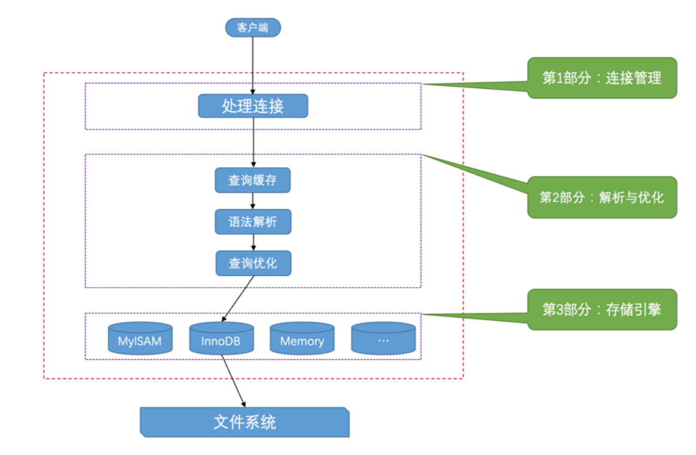

[TOC]

## 《MySQL是怎样运行的：从根儿上理解MySQL》笔记

### 1. mysql服务端如何处理客户端的请求？

服务器程序处理来自客户端的查询请求大致需要经过三个部分，分别是连接管理,解析与优化,存储引擎 。

> 第一部分：连接管理

* mysql客户端通过 TCP/IP，命名管道或共享内存，Unix域套接字 这几种方式之一来与mysql服务器建立连接。
* 在mysql客户端发起连接的时候，会携带主机信息、用户名、密码,mysql服务器会对客户端程序提供的这些信息进行认证。

> 第二部分：解析与优化

1. 查询缓存
    若mysql客户端发送过来的请求是查询请求。先在缓存中查询是否有一摸一样的请求。若有则直接将该请求的查询结果返回给客户端。若无则往下面流程走。
2. 语法解析
    MySQL服务器对请求文本做分析，判断请求的语法是否正确，然后从文本中把要查询的表、查询条件都提取出来。
3. 查询优化
    语法解析之后，mysql服务器把请求文本中表，条件等信息提取出来。之后mysql服务器会吧这些提取出来的信息进行优化。转化为一个执行计划。根据计划来执行sql语句。

> 第三部分：存储引擎

存储引擎根据执行计划来对文件系统进行数据操作。

mysql中存储引擎是负责对表中的数据进行提取和写入工作的，不同的存储引擎对数据的物理存储结构不同。数据的提取算法也不同。提供的各项特色功能也不同。

InnoDB是MySQL默认的存储引擎。

> PS:查询缓存原理

1. mysql会将刚刚处理过的查询请求和对应的查询结果，缓存起来。若下次有一摸一样的查询请求，则直接从缓存中查询结果。
2. 两个查询请求在任何字符上的不同都会被mysql认为这是两个不同的查询请求。会导致不走缓存。
3. 若查询请求中包含系统函数，用户自定义变量和函数等。都会导致mysql不对这个查询请求进行缓存。
4. MySQL的缓存系统会监测涉及到的每张表,只要某个表的结构或者数据被修改。那使用该表的缓存都将变为无效并从缓存中删除。

从MySQL5.7.20开始，不推荐使用查询缓存，并在MySQL 8.0中删除。

### 2. mysql中的utf8和utf8mb4字符集

* utf8mb3 ：阉割过的 utf8 字符集，只使用1～3个字节表示字符。 
* utf8mb4 ：正宗的 utf8 字符集，使用1～4个字节表示字符。 
* 在 MySQL 中 utf8 是 utf8mb3 的别名，如果有使用4字节编码一个字符的情况，比如存储一些emoji表情啥的，那就使用utf8mb4