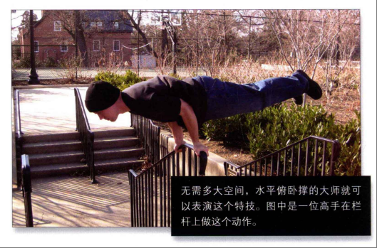

[toc]

# 《囚徒健身》笔记

该文章是阅读《囚徒健身》这本书后的读后感，主要总结了这本书中的几个方面的笔记。

关于健身技巧方面，对于初学者来说，《囚徒健身》这本书提供了一个系统且安全的训练框架。它的训练方式温和且循序渐进，避免了因过度训练或错误动作导致的受伤风险。同时，由于不需要任何器械，随时随地都能进行训练，非常适合时间和场地受限的人群。

关于背景故事方面，由于《囚徒健身》这本书关于作者经历的真实性存在争议。因此《囚徒健身》这本书我们只需要关注核心部分，也就是六艺十式。

## 六艺十式

书中最为核心的内容便是“六艺十式”，即六种基础的身体动作，每个动作又分为十个难度递增的阶段。这六种动作分别是：
1. **俯卧撑**：锻炼胸部、肩部和三头肌。从最简单的墙壁俯卧撑开始，逐步进阶到标准俯卧撑、窄距俯卧撑，直至难度极高的单臂俯卧撑。
2. **深蹲**：主要锻炼大腿、臀部和核心肌群。起始于靠墙深蹲，随着训练的深入，过渡到徒手深蹲，最终挑战单腿深蹲。
3. **引体向上**：重点锻炼背部、手臂和肩部。从辅助引体向上开始，逐渐掌握标准引体向上，直至实现单臂引体向上。
4. **举腿**：强化腹部和下背部肌肉。从简单的坐姿举腿起步，逐步升级到悬垂举腿、水平举腿，最终挑战单腿举腿。
5. **桥**：改善脊柱柔韧性，增强背部和颈部肌肉。从半桥开始练习，逐步过渡到标准桥，直至完成全桥。
6. **倒立撑**：锻炼肩部、手臂和核心稳定性。从靠墙倒立撑开始，逐渐掌握自由倒立撑，最终挑战单臂倒立撑。

## 俯卧撑（锻炼胸部、肩部和三头肌）

俯卧撑是最好的上身练习动作，它既可以增强我们的身体力量、打造出结实的肌肉、形成强有力的肌腱，又可以让上身的推力肌肉与腹部、下背部及下身协调工作。

不同形式的俯卧撑锻炼肌肉的程度不同，但俯卧撑的所有变式都能增强力量、打造肌肉。

以正确的方式循序渐进地练习俯卧撑还可以锻炼关节与肌腱，增强身体的整体力量，改善健康状况。支撑手指、腕部、前臂及肘部的那些微小却至关重要的深层肌肉与组织，也会在练习俯卧撑的过程中变得越来越强。

由于每个人的身体类型的不同（四肢的长短、不同部位力量的相对大小、身体中的脂肪比例等方面的差别）。这导致每个人的完美俯卧撑姿势有细微的差别。

对大多数人来说，做俯卧撑最舒服的姿势就是手掌平放在地板上这个经典姿势。当然，腕部有伤的人例外，对他们而言，腕部锁定，以拳头着地做俯卧撑最容易。

> 俯卧撑的一些大体原则

- 避免诡异的角度和手部姿势。找到适合自己的锻炼姿势。
- 躯干、髋部、双腿始终要成一条直线。只有那些腰部力量太弱无法锁定躯干的人，才会出现做俯卧撑时撅屁股的情况。
- 双腿始终要并拢。如果双腿分开,做动作时就无需保持躯干稳定，练习就变容易了。
- 在动作最高点时，双臂要伸直，但不要让肘部完全锁定，而要使其微弯，以免关节不舒服。
- 要平缓地呼吸。根据我的经验:上推时应呼气，下降时应吸气。但如果你感觉呼吸费力，就不要遵循这一原则，而要多呼吸几次。

> 做俯卧撑的速度

最主要的俯卧撑练习还是应该做得慢一些，经2秒降到最低点，坚持1秒，再用2秒回到最高点，之后立即降低身体。

在没热身的情况下，快速地做俯卧撑容易导致关节受伤。

### 第一式 墙壁俯卧撑

墙壁俯卧撑是最简单的俯卧撑形式，它锻炼的是胸部、肩部和三头肌。

> 动作

面对墙壁站立，双脚并拢，双臂伸直，与肩同宽，双手平放在墙上，手掌与胸等高。这是该动作的起始姿势(图1)。

弯曲肘部,直到前额轻触墙面。这是该动作的结束姿势(图2)。然后将自己推回到起始姿势，如此重复。

> 解析

墙壁俯卧撑只是俯卧撑动作的第一式。既然是第一式，也就最容易的，毫无疑问普通人都能做。

墙壁俯卧撑也是第一个有治疗效果的练习。刚受伤、做过手术或身体正处于恢复期的人若想加快恢复速度、尽快拥有强健的体魄，可以选择这个动作。

肘、腕、肩(尤其是柔弱的肩袖)极易出现慢性或急性损伤，这项练习能够轻柔地剌激这些部位，并改善血液循环。不熟悉徒手体操的初学者应该以较轻柔的动作开始训练，然后逐步提高自己的运动技巧，循序渐进地增强自己的运动能力。

> 训练目标

- 初级标准:1组，各10次
- 中级标准:2组，各25次
- 升级标准:3组，各50次

### 第二式 上斜俯卧撑

> 动作

做这个动作需要借助一个稳固的物体,高度大约是你身高的一半(大概到臀部位置)。桌子、高一些的椅子、工作台、厨房操作台、矮墙、结实的栅栏都是不错的选择。不过你得保证它足够结实。

双脚并拢，身体成一条直线，然后前倾上身，双臂伸直，双手抓住所选物体，与肩同宽。这是该动作的起始姿势(图3)。

弯曲肘部，放低身体，直到胸部轻触物体顶部。如果你选择的物体高度合适，那么此时你的身体与地面的夹角约为45°(图4)。暂停一会，然后将自己推回到起始姿势，如此重复。

> 解析

这个动作的难度比第一式(墙壁俯卧撑)高，因为你将自己推回到起始姿势时，身体与地面的夹角更小，这意味着你的上肢肌肉要承受更大的重量。对大多数人来说，这个动作对肌肉的要求并不太高，而且它能帮助初学者平稳进步，对康复期的健身者也非常有帮助。

> 训练目标

- 初级标准:1组，10次
- 中级标准:2组，各20次
- 升级标准:3组，各40次

> 注意事项

到达动作的最低点时，你的身体与地面的夹角约为45”。初学者如果达不到这么高的水平，那就降低难度(加大倾斜角度，也就是让身体更接近直立)。只要选择高度高于你身体中间点的物体即可。然后，再逐渐减小角度，直到可以轻而易举地完成倾斜45”的上斜俯卧撑。

如果你还想尝试更小的角度，可以利用台阶做此动作。随着能力的提高，你可以逐渐降低支撑物的高度。

### 第三式 膝盖俯卧撑

> 动作

双脚并拢，双膝着地。双臂伸直，与肩同宽。双手在胸部的正下方，两个手掌平放在地面上。脚踝搭在一起，大腿与上身及头部成一条直线，不要撅屁股或者塌腰。这是该动作的起始姿势(图5)。

然后以膝盖为支点,弯曲肘部,直到胸部与地面仅一拳之隔(图6)。暂停一下，然后将自己推回到起始姿势，如此重复。

> 解析

膝盖俯卧撑是俯卧撑系列的第三式，是初学者要掌握的重要动作。它是在地面上做的俯卧撑中最容易的一个，起着承前启后的作用。

此前的俯卧撑都是站立完成的，后面的俯卧撑全是地面动作，而且难度更高。对那些超重或身材走形的人来说，膝盖俯卧撑是不错的起点。因为采用这样的姿势推起上半身相对容易，所以在开始做更难的俯卧撑之前，膝盖俯卧撑是绝佳的热身练习。

>稳扎稳打

如果你不能完成标准的膝盖俯卧撑，可以减小动作幅度。但不要降低到离地面一拳的距离，而是把动作幅度缩短到你能舒服地完成的程度，同时增加次数(约20次)你要不断练习(保持高反复次数),逐渐增加动作深度，直至可以完成标准的膝盖俯卧撑

> 训练目标

- 初级标准:1组，10次
- 中级标准:2组，各15次
- 升级标准:3组，各30次

### 第四式 半俯卧撑

>动作

跪在地板上，双手撑地，双腿向后蹬直。双手与肩同宽，并处于上胸部的正下方。双腿双脚并拢，锁紧身体，使上身、髋部和双腿成一条直线。先伸直手臂，然后降低身体到大约一半臂长的高度，或者直到肘部弯成直角。控制下降高度的绝佳方式就是使用篮球或橄榄球,将球放在髋部下方。这是该动作的起始姿势(图7)。

接下来,弯曲肘部直到髋部与球轻轻接触(图8)。对大多数人来说，这样可以方便且客观地标示这个动作的最低点。暂停一下，然后用力将自己推回到起始姿势。

>解析

半俯卧撑非常重要，要熟练掌握。很多人做俯卧撑的方法都不正确(撅屁股或者塌腰)，这是因为他们的腰部肌肉和脊椎肌肉不发达。这个动作可以锻炼你的腰部肌肉和脊椎肌肉，从而能够锁定髋部，使身体成一条直线。

>训练目标
- 初级标准:1组，8次
- 中级标准:2组，各12次
- 升级标准:2组，各25次

>稳扎稳打

如果你做不了半俯卧撑，可以减小动作幅度。如果你选用的是篮球，那就将其放在膝盖下，而不是髋部下方。伸直手臂，然后慢慢降低身体，直到膝盖与球接触，这相当于四分之一俯卧撑。如果你能做 10 次以上四分之一俯卧撑，那就可以把篮球向上移点儿，就这样逐步移动篮球，直到其位于髋部下方为止。

### 第五式 标准俯卧撑

>动作

跪在地板上，双手撑地，双腿向后蹬直。双腿双脚并拢，双手与肩同宽，并处于上胸部的正下方。双臂伸直,臀部与脊椎成一条直线。这是该动作的起始姿势(图9)。

接着弯曲肘部，直至胸部与地面仅一拳之隔。若你是单独锻炼，又想控制动作幅度，并想让身体与地面保持正确距离，可以在胸部正下方放一个棒球或网球(图10)。你在做动作的过程中，待胸部碰到球后暂停一下，然后回到起始姿势。

>解析

这就是“经典”俯卧撑。大多数人在体育课上学到的就是这个动作。说到俯卧撑，大多数人脑海中浮现的也是这个动作。标准俯卧撑是极好的上身练习动作，可以锻炼我们的手臂、胸部和上肢带肌，而且效果明显。然而无论如何，标准卧撑的难度并不是最高的，它在十式中只排第五。

> 训练目标
- 初级标准:1组，5次
- 中级标准:2组，各10次
- 升级标准:2组，各20次

>稳扎稳打

你可能感到费解，很多看上去很健硕的家伙都不能正确地完成标准俯卧撑。如果你也一样，那还是找个篮球做半俯卧撑吧!如果你已能很好地完成第四式，当球放在髋部下面时，你能重复此动作 25次，那么每次训练时你可以把球向前移动几厘米，在次数保持不变的情况下继续练习。当你的下颚能碰到球时，你再尝试做标准俯卧撑。

### 第六式 窄距俯卧撑

>动作

窄距俯卧撑的起始姿势与标准俯卧撑基本相同(见第五式)，只不过需要双手相触(无需重叠)，也不需要让双手的拇指与食指构成一个“钻石”，只要两个食指指尖相触就可以了。

从手臂伸直的起始姿势开始(图11)，慢慢放低身体，直到胸部轻触手背(图 12)。暂停一下，然后将自己推回到起始姿势。

> 解析

窄距俯卧撑很古老，它在俯卧撑十式中至关重要，因为窄距卧撑在攻克单臂俯卧撑之旅中必不可少。

大多数人做单臂俯卧撑都会感到吃力，他们会发现很难在身体降到最低点之后再把自己推起来。这是因为此时肘部的弯曲程度最大，而肘部的弯曲角度超过直角时胳膊就很难使上力气。做窄距俯卧撑时，由于双手的特殊位置，当你的身体降到最低点时，肘部的弯曲度比做标准俯卧撑时的更大。这个动作可以锻炼三头肌，并且强化你的肘部与腕部的肌腱。因此，能舒服地做窄距俯卧撑的人在终于要挑战单臂俯卧撑的时候，会更从容一些，

> 训练目标
- 初级标准:1组，5次
- 中级标准:2组，各10次
- 升级标准:2组，各20次

>稳扎稳打

如果你做不了双手相触的窄距俯卧撑(如上所述)，可以继续做标准俯卧撑，在次数不变的前提下，让双手逐渐靠近，每次靠近几厘米，

### 第七式 偏重俯卧撑

>动作

双脚并拢，双腿、髋部、上身成一条直线。双臂伸直，双手撑地，并处于上胸部的正下方。一只手稳固地支撑身体，另一只手撑在篮球上，这是该动作的起始姿势(图13)。

找到平衡之后，尽力将身体的重量均匀地分摊在两只手上。这样做虽然不容易，但一定要坚持。接下来，弯曲肘部，慢慢降低身体，直到胸部轻触撑在篮球上的那只手(图 14)。暂停一下，然后将自己推回到起始姿势。

> 解析

这是第一个高级俯卧撑动作，它能够帮助健身者适应由双手俯卧撑向单臂俯卧撑的过渡。你也可以选用一个固定的物体(如篮球)，不过篮球是最好的选择控制篮球的同时可以锻炼你的肩袖，这有助于你完成难度更高的动作。你还可以选用足球，但篮球还是首选，因为篮球表面租糙更容易抓握。

> 训练目标

- 初级标准:1组，5次(每侧)
- 中级标准:2组，各10次(每侧)
- 升级标准:2组，各20次(每侧)

>稳扎稳打

能正确地完成窄距俯卧撑的人都可以信心十足地尝试这个动作。如果刚开始你觉得有些困难，那是因为你的协调性不好，而不是力量不足。你可以用固定的物体，而不用会滚来滚去的篮球。砖块是个不错的选择，等你可以在一块砖上重复此动作 20次之后，你就可以尝试将两块砖摞起来做这个动作。在你可以在三块垒起的砖上重复此动作 20次之后，你就可以尝试用篮球练习了。

### 第八式 单臂半俯卧撑

>动作

摆出半俯卧撑最高点时的姿势，即将篮球放在髋部下方(见第四式)。将一只手撑在胸部下方的地面上，手臂伸直，另一只手背在身后。这是该动作的起始姿势(图15)。

接着弯曲肘部，直到髋部轻触篮球。这是该动作的最低点(图16)。暂停一下，然后将自己推回到起始姿势。

如果你的肱三头肌不够发达，那做该动作时上身很容易发生扭曲。坚持住，整个身体保持一条直线，做所有俯卧撑都应如此。

>解析

单臂半俯卧撑是俯卧撑系列的第八式。通过这个练习，训练者可以逐步从双侧练习转为单侧练习。该动作可以提高你的平衡能力，而这对做单管俯卧极其重要。因为只靠单臂发力，所以这个动作也会让手部、腕部和肩部关节为之后的动作做好准备。单半俯卧撑在这个系列中不可或缺，你必须掌握。不过由于肘关节只是部分弯曲，所以对一次完整的俯卧撑训练来说，只做这样的练习是不够的。你需要再做一些肘部弯曲角度小于 90”的练习来补充，比如在之后加上窄距俯卧撑或偏重俯卧撑，

> 训练目标
- 初级标准:1组，5次(每侧)
- 中级标准:2组，各10次(每侧)
- 升级标准:2组，各20次(每侧)

>稳扎稳打

如果做不了单臂半俯卧撑，你可以把篮球放在膝下，做四分之一单臂俯卧撑。练习一段时间之后，就一点点向前移动篮球，加大动作幅度。

### 第九式 侧推俯卧撑

>动作

摆出做俯卧撑的姿势，身体成一条直线，一只手撑在胸部正下方的地面上，另一只手放在身体外侧的篮球上，靠双脚和撑在地上的那只手支撑身体。双臂伸直，放在球上的手要尽量向远处伸。这是该动作的起始姿势(图17)。

要有控制地慢慢放低身体，自到胸部与地面只有一拳之隔。如果你是独自锻炼，可以像做标准俯卧撑那样，借助棒球或网球控制动作幅度。放低身体时手会顺势把篮球推到远离身体的位置(图18)。身体降至最低点时，暂停一下，然后将自己推回到起始姿势。

>解析

标准杠杆俯卧撑的难度与单臂俯卧撑相差无儿，这也正是杠杆俯卧撑在俯卧撑十式中排在第九的原因。你会发现，撑在篮球上的那只手臂几乎帮不上什么忙，这就迫使支撑身体的手臂必须使出全力。如果你还没强大到足以在做单臂俯卧撑时把自己撑起，那你可以先练习杠杆俯卧撑。

>训练目标

- 初级标准:1组，5次(每侧)
- 中级标准:2组，各10次(每侧)
- 升级标准:2组，各20次(每侧)

>稳扎稳打

由于杠杆原理，撑在篮球上的那只手臂如果完全伸直的话就很难用力。你可以让这只手臂的肘部稍稍弯曲，从而让篮球离你的身体近一点儿，这样做杠杆俯卧撑会容易一些。不过不要太过，要是你把篮球放在身体正下方，那这个动作就变成了第七式--偏重俯卧撑。随着你越来越强壮，你可以逐渐让球远离身体，直到可以将手伸直做标准的杠杆俯卧撑。

### 第十式 侧推俯卧撑

>动 作

跪在地板上，一只手撑在你前方的地面上。双腿向后蹬直，用脚趾支撑身体。脊柱与髋部成一条直线，支撑身体的手臂在胸部下方伸直--不要在身体侧面或是靠前的位置。稳定之后，把不起支撑作用的那只手背在身后。这是该动作的起始姿势(图19)。

弯曲肘部，有控制地放低身体，直到下巴与地面大约有一拳之隔(图20)。在动作的最低点暂停一下，然后将自己推回到起始姿势。

>解 析

姿势正确的单臂俯卧撑是检验胸部与肘部力量的黄金标准，而且能够让人一见难忘。

许多健身者都声称自己能做单臂俯卧撑，但你千万不要被他们蒙骗。当你让他们动真格的时候，你就会发现，他们所谓的单臂俯卧撑就是个笑话。双腿朝两边分开，上身丑陋地扭曲，这是为了更容易做动作，然后他们会用摇摇摆摆、虚弱无力的胳膊猛地将自己推起，而且他们只能完成少数几次反复。

毫无疑问，真正能做单臂俯卧撑的人可谓是危险的稀有动物，你要对自己有点儿信心，相信自己也能跻身其间。

>训练目标

- 初级标准:1组，5次(每侧)
- 中级标准:2组，各10次(每侧)
- 精英标准:1组，100次(每侧)

>稳扎稳打

如果你已经攻克了杠杆俯卧撑，那么单臂俯卧撑对你而言就不是特别忍怖了。但是如果你还不能标准地完成5次单臂俯卧撑，那么你还是回到第九式，确保自己可以标准地完成 20次杠杆俯卧撑。如果你能做到这一点，但做单臂卧撑还是有问题，那么请你继续练习杠杆俯卧撑，直到你可以完成30次反复，然后再挑战单卧撑。

### 变式

俯卧撑有许多变式，但是你应该把主要精力放在前面讲的十式上。不过你可能偶尔也想试试这些变式，或许是想将其作为收尾练习、带伤练习，或许就是为了换个花样。

下面我将介绍一些俯卧撑的变式。

#### 屈臂撑

这是学校体育课上的经典动作。双手抓住两根平行的横杆或是位于身体两侧的平面把自己撑起来,使双脚离地。然后，弯曲肘部,尽可能地放低身体,直到上臂与地面平行。接着，再将自己向上推回到起始姿势。在此过程中保持上身挺直。你可以在做这个动作时把双脚搭在与髋部等高的平面上，这样动作会变得更容易。

另外，你也可以对其稍作改动，借助家中常见的物体做这个动作，比如床、桌子、凳子等，这一变式有时被称为凳子屈臂撑。屈臂撑与凳子屈臂撑并不是真正意义上的俯卧撑，但它们也能锻炼相当一部分推力肌群，还能强有力地(非静力地)作用于背阔肌(上背部侧面的大肌肉)。

#### 下斜俯卧撑

下斜俯卧撑有时被误称为上斜俯卧撑。做下斜俯卧撑时，你需要抬高双脚(放在比双手高的平面上)。

许多家伙都会借助床铺来做这个动作，不过你可以使用更高的物体，如书桌或洗激台。有些人甚至会把双脚高高地蹬在墙上，但要保持这个姿势身体必须绷得特别紧。双脚抬起时，双手就要承受更多的体重，这样难度便加大了。另外，由于身体与地面的角度变大，该动作将会比标准俯卧撑更强烈地作用于胸部的上半部分和肩部。

#### 弹震式俯卧撑

也就是众所周知的击掌俯卧撑，是一种爆发力练习。动作过程中身体始终要挺直，快速下降到最低点后再用力将自己推起，当动作达到最高点时让手掌暂时离地。在半空中快速击掌，然后让手掌着地，反复练习。你将自己推起的力量越大，身体就抬得越高用于击掌的时间也就越长。许多人都能击掌三次，甚至四次。

最难的是单臂击掌俯撑只用单臂推起身体，然后击掌。击掌俯卧撑可以提高你的速度，你可以将其用作健身计划的补充，偶尔为之。但是击掌俯卧撑很容易让训练者受伤，所以你不要急于尝试这个动作--至少要等到攻克了偏重俯卧撑之后。

#### 水平俯卧撑

水平俯卧撑对身体素质有很高的要求，不但每一块肌肉都有要强劲有力，而且还要有较高的平衡能力与协调能力。此外，这也是个很酷的聚会特技。双手撑地，与肩同宽，双臂弯曲，肘部内收，贴在身体两侧，然后身体前倾，直到双脚离地，双腿锁定想要保持这个姿势，你的背部和双腿必须像铁板一样坚挺。水平俯卧撑是块难啃的硬骨头，攻克它的关键就是坚持练习十式，增强身体的力量。坚持练习，你一定会成功的!

## 深蹲（锻炼大腿、臀部和核心肌群）

大多数人提到力量时，想起的只是上半身。宽阔的肩部、隆起的胸肌、粗壮的手臂都被视为强壮的基本标志，好像没人会真的想到双腿。

这一现象在普通健身爱好者的健身计划中也有所反映。你可以到健身房中参观一下看看那些在力量训练区的家伙都在干什么。你会看到很多人在锻炼肩部、躯干和手，甚至有些人正在排队等着做卧推,做斜托弯举或是拉力器下压,好让自己的肱三头肌“鼓”起来。全世界90%的健身房力量训练，很可能都是在锻炼上半身，我估计其中几乎有95% 锻炼的是手臂。在健身房中，你只能看到寥寥几人在努力地锻炼腿部。

其实，真正的力量源于部和腿部，而不是上身和手臂。只要我们不是飘在半空中或双腿离地坐着，那我们上肢做的所有动作都依赖于腿部传递的力量。上身力量在许多体育运动中都很重要，但如果没有强劲有力的下身做基础，上身力量全无用处。

对很多运动员来说，只有当他们腿部受伤时下身力量的重要性才会体现出来。若膝盖受到损伤或腘绳肌撕裂，健身者就会明白无误地理解下身是何等重要了。你可以在自己有腿伤时试着做一些上身动作，如摔跤、拳击、推、拉等，你会发现自己几乎不可能完成这些动作，更不用说下身动作了，如跑步、跳跃、等。

毋庸置疑，大多数体育运动都以下身为基础，也就是说这些运动极大地依赖腿部力量，上身相对而言并不是那么重要。

练出真正强健有力、行动敏捷的双腿的最佳方式就是用最少的、能锻炼尽可能多的腿部肌肉的练习动作来锻炼。最理想的情况是只练习一个动作，那就是深蹲。

> 深蹲的几个要点

- ==最重要的一点是你哪个姿势舒服，就采用哪个姿势。这是你身体的本能反应。记住练习深蹲时，你需要找到最有力、最舒服的姿势，并坚持用这种姿势锻炼。==
- 不同幅度的深蹲会锻炼不同肌肉。标准深蹲能够锻炼下半身的所有肌肉，动作进行到最低点时，大腿后侧会紧贴小腿你的身体将无法继续降低。这时需要大腿和膝盖共同发力才能将身体推起，直到双腿完全伸直。动作幅度再小哪怕一点都算不上“全幅”。
- 有些人认为，直接深蹲到最低点对膝盖不好，事实并非如此。只有在你的膝盖预先有问题时，深蹲才不利于它们。而大多数时候，深蹲甚至有助于缓解盖问题。如果膝关节处的肌腱还不适应较低的姿势，就可能扭伤。但是如果你循序渐进地小心练习，你的膝盖就能变得很结实，足以练习标准深蹲。
- 在将双腿完全伸直的过程中，肌肉的确会有一瞬间不承受压力，这是事实。但是，如果短暂的放松可以在下次转换成更大的力量，就没有什么不好。切记，做深蹲时一定要完全伸直双腿。
- 在深蹲过程中，不要直接就那样蹲下了，而要用肌肉力量有控制地下蹲。下蹲过程中身体要前倾，但不要过分前倾。因为这样将过分锻炼髋部，而忽略了大腿。前倾是必要的，但不要养成向前弓背的习惯。
- 在深蹲到最低点时，你实际是“坐着”。请按照“坐”的标准来要求自己，而不是按照“蹲”的标准要求自己，有时这会帮助训练者降得更低，因为这有助于矫正部的姿势，避免屁股向后摄。
- 最低点的姿势是深蹲中最难控制的部分。你在深蹲中绝不能快速下蹲，然后直接“反弹”(靠惯性)站起，这会严重损伤膝关节处的软骨。你应该通过慢慢练习增强肌腱的力量。
- 建议在动作最低点坚持1秒钟。在动作最低点坚持一会儿是个好习惯，但这并不是万灵药，在这种情况下你仍然可能作弊。有些人在起身的时候会出现摇晃前倾的趋势，这可以为起身提供性，使最初几厘米的移动变得更容易，可这样做会让膝盖承受多余的压力。你应该保持上半身不动，只靠腿部发力将自己推起。如果你做不到，那说明这个动作对你而言太难。你应该回到更容易的动作，坚持锻炼。
- 有些人发现，深蹲时不得不抬起脚跟，所以他们干脆就在脚跟下放上木板或砖块这是个坏习惯。需要抬起脚跟与平衡能力或身体结构无关。之所以会这样，只是因为你的脚踝缺乏灵活性，跟腱不够柔韧。如果你的韧带和肌很僵硬，在深蹲时脚踝不能充分弯曲，那你的双脚脚跟就会不自觉地抬起。一定不要使用木板之类的东西，你应该经常拉伸小腿，直到自己可以在不借助任何辅助的情况下做深蹲。

### 第一式 肩倒立深蹲

>动 作

平躺，双膝弯曲，双手下压。双脚蹬离地面，直到举到空中。在将双腿举起的过程中，顺势把双手撑在下背部，注意上臂要紧贴地面。你现在摆出的姿势是肩倒立,靠双肩上背部以及上臂支撑身体。要记住，始终用这几个部位支撑身体，不要让颈部受到压力身体要锁定伸直，髋部不要弯曲。这是该动作的起始姿势(图21)。

上半身要尽可能伸直弯曲髋部与膝关节，直到膝盖轻触前额,这是该动作的结束姿势(图22)。然后伸直双腿直到身体回到起始姿势，如此重复。

> 解 析

对任何开始练习深蹲的人来说，肩倒立深蹲都是完美的起点。由于做该动作时身体处于倒立姿势，所以膝盖和下背部无需承受身体的重量，这就使得该动作成为一个理想的恢复性训练动作--可以帮助那些背部和膝盖有伤的健身者，或是刚做完手术正处于恢复期的健身者重新开始腿部训练。从力量角度来说，做肩倒立其实对健身者上身的要求更高。但是这一动作能让紧绷的关节放松，增加关节的活动幅度，从而能让初学者为练就完美的深蹲打下基础。

>训练目标

- 初级标准:1组，10次
- 中级标准:2组，各25次
- 升级标准:3组，各50次

>稳扎稳打

第一次尝试该动作时，不是人人都能做到漆盖轻触前额。你可以在每次锻炼时试着加大动作幅度，这样你的关节很快就会得到放松。另外，有酒肚的人几乎无法完成这个动作，因为他的大肚子会碍事。对这类人来说，坚持空腹练习会好一些,直到他们减掉肚子上的赘肉。

### 第二式 折刀深蹲

>动 作

站在一个稳固的物体前，此物体的高度大约与你的膝盖等高，至少也要达到胫骨上部，小咖啡桌、椅子、床铺都是不错的选择。双腿分开，与肩同宽或略宽。双伸直，弯腰俯身，直到双手与面前的物体接触。身体前倾，使一部分体重落在双手上。这是该动作的起始姿势(图 23)。

上半身尽量与地面平行，弯曲膝关节和部，直到大腿后侧紧贴小腿，无法蹲得更低为止。这是该动作的最低点(图24)。下蹲过程中你还需要弯曲双臂，在下降到最低点后腿部与手臂要同时发力，将身体推回到起始姿势。在整个动作过程中，脚跟始终不能抬离地面。

>解 析

做折刀深蹲时上半身前倾，并不直接位于双腿上方，因此两条手臂会承担一部分体重。该动作的难度大约只有标准深蹲(第五式)的一半，但这是能帮助下身肌肉与肌腱为之后的动作做准备的最佳动作。只要正确练习，这个动作就能让初级健身者拥有足够的平衡能力和跟腱的柔韧性，来征服标准深蹲中的最低点，

> 训练目标

- 初级标准:1组，10次
- 中级标准:2组，各20次
- 升级标准:3组，各 40次

>稳扎稳打

下降到最低点时该动作的难度最大，因为此时下肢需要承担身体的大部分重量。如果你觉得动作有难度，那就逐步加大动作幅度来慢慢适应。还有一种方法就是让双臂分担更多的身体重量，这样能够帮助你从最低点站起来。等腿部更强壮之后，你就可以试着减少双臂的用力，更多地依赖双腿。

### 第三式 支撑深蹲

>动 作

直立，双脚分开，与肩同宽或略宽。手臂向斜下方伸出，双手放在比自己的大腿略高的稳固物体上，书桌、高脚凳或椅背都可以。这是该动作的起始姿势(图25)。

弯曲髋部与膝关节，身体慢慢下降，背部尽可能保持挺直，直到大腿后侧紧贴小腿，无法得更低为止，这是该动作的最低点(图26)。

暂停一会，然后主要靠腿部发力站起来。为了分担双腿的一部分压力，尤其是在最低点时，你要通过向下按压面前的物体，来借用手臂的一部分力量。手臂要尽量伸直，在整个动作过程中都不要让脚跟抬离地面。

>解 析

支撑深蹲是半深蹲之前的最后一式。它是折刀深蹲(双腿承受大部分身体重量)与半深蹲(双腿承受全部身体重量)之间理想的过渡动作。支撑深蹲能够进一步加强下肢的柔韧性和力量，锻炼膝盖的肌腱、韧带及软组织。它能让你的深蹲动作更标准，锻炼你仅仅使用肌肉力量而非惯性从最低点推起身体的能力。

>训练目标

- 初级标准:1组，10次
- 中级标准:2组，各15次
- 升级标准:3组，各 30次

>稳扎稳打

要想对该练习所需的腿部力量进行微调，方法非常简单。要使该练习对下身来说更容易，只要更多地使用上身的力量即可。随着你在动作最低点时感觉越来越轻松，你可以逐渐减少在起身过程中臂力的使用。

### 第四式 半深蹲

>动 作

站立，双脚分开，与肩同宽或略宽。脚尖不要指向正前方，而要略微向外。双手放在髋部、胸部、肩部都可以,以舒适为前提。这是该动作的起始姿势(图27)。

弯曲髋部和膝盖，直到膝关节弯曲成90度,换句话说就是大腿与地面平行。这是该动作的最低点(图28)。

刚开始你可以借助一面镜子或是找朋友帮忙，直到能够自如地控制动作幅度。不要求快，也不要借助惯性起身，而要完全在肌肉控制下做整个动作。在最低点(半空中)坚持1秒钟，然后再回到起始姿势。在整个动作过程中，背部始终要挺直，双脚脚跟始终不能抬离地面。膝盖与脚尖应该始终朝向同一方向，深时膝盖绝不要向内转，脚尖指向外有助于你做到这一点。

>解 析

在深蹲系列中，半深蹲是双腿在没有任何辅助的情况下承受全部体重的第一式。因此，它应该受到重视。该动作教你在无辅助的情况下保持平衡和身体姿势，这些对于后面的深蹲练习都是必要的。

此外，该动作也能够让你了解如何让膝盖与双脚摆出对你来说最适合的姿势。这个动作对大腿而言难度并不大，因此下面给出的训练目标量比正常的量要大。攻克了这个动作之后，你会发现自己髋部和大腿内侧的肌肉变得更强了

>训练目标

- 初级标准:1组，8次
- 中级标准:2组，各35 次
- 升级标准:2组，各50次

>稳扎稳打

如果做不了半深蹲，那就先做四分之一深蹲，每当你感到有余力时，就可以适当加大动作幅度。

### 第五式 标准深蹲

>动 作

直立，双脚分开，与肩同宽或略宽(取决于个人偏好)。双脚略向外转，双随意摆放，只要舒服即可。这是该动作的起始姿势(图29)。

髋部与膝关节弯曲，背部始终挺直。当大腿达到几乎与地面平行时，把你的身体重心向后转移，就像要坐下一样。有控制地继续放低身体，直到大腿后侧紧贴小腿。这是该动作的最低点(图30)。

暂停一会，然后仅靠腿部发力将自己推回到起始姿势。起身过程和下蹲过程应该是完全相反的。脚跟始终不要抬离地面，膝盖也不能向内转。

>解 析

标准深蹲是经典的自身体重练习动作。数千年来该动作始终流行于世，是有一定原因的。标准深蹲能够强化膝关节，并增强大腿肌肉、臀部肌肉、脊椎肌肉和部肌肉的力量和运动能力。另外，这个动作也能使小腿、胫骨前肌、脚踝，甚至包括脚掌得到相应的锻炼。标准深蹲有助于让双腿保持年轻活力。

>训练目标

。初级标准:1组，5 次
。中级标准:2组，各10次
。升级标准:2组，各30次

>稳扎稳打

如果你已经达到了半深蹲的升级标准，那么做标准深蹲就不会有太大问题。由于杠杆原理，当动作到达最低点时难度最大，对个子较高的人来说尤其如此。如果你达不到初级标准的目标，那就继续去做半深跳。如果你感到自己变强了，那就增加几厘米的动作幅度。不要心急，一定不要借助惯性起身、让脚跟离地或是摇晃前倾。要纯使用肌肉力量，否则就别练了!

### 第六式 窄距深蹲

> 动 作

直立，双脚脚跟相碰，脚尖微微向外，双臂前伸。这是该动作的起始姿势(图31)。

弯曲膝盖和髋部，直到大腿后侧紧贴小腿，无法蹲得更低为止。此时，你的胸部应该紧贴大腿(图32)。

注意，脚跟始终不要抬离地面。为避免后倾，你得收缩胫骨肌肉使身体微微前倾。保持这一姿势，然后仅靠腿部发力将自己推回到起始姿势

> 解 析

窄距深蹲具有标准深蹲的所有益处，但是对股四头肌的影响更大。经常练习该动作真的能强化你的膝盖、胫骨和臀部肌肉，让你的臀部更紧实，效果比任何一种器械训练都好。

> 训练目标

。初级标准:1组，5次
。中级标准:2组，各10次
。升级标准:2组，各20次

> 稳扎稳打

很多训练者练习前几式时进展神速，但到了窄距深蹲就会碰到问题,即在动作最低点或接近最低点时，身体有可能失去平衡而后倾。这些问题在腿骨长、个头高的训练者身上尤为突出。之所以会出现这些问题，是因为训练者胫骨前侧的肌肉缺乏力量以及平衡能力不强。如果练习前几式时你的进度太快，那就回到标准深蹲，在练习过程中逐渐缩小双脚之间的距离--每次缩小几厘米。双臂前伸能够让重心前移。此外，你也可以手拿重物--如哑铃、书或矿泉水瓶等--练习该动作，不过最好还是空手能完成。有些训练者由于身体结构的原因，做该动作真的很困难，如果你就是这样，那么可以让双脚胸跟保持一掌的距离。

### 第七式 偏重深蹲

>动 作

直立，一只脚踩在地上，另一只脚的脚跟放在位于自己前方、距身体约一步远的篮球上。双脚分开，与肩同宽或略宽，双臂在胸前伸直。这是该动作的起始姿势(图33)。

弯曲膝盖和髋部，直到踩在地上的那条腿的大腿后侧紧贴小腿后侧。这是该动作的最低点(图34)。刚开始练习时，到达最低点后可能出现身体后倾的情况，所以要确保身后有足够的干净空间，这一点对所有全幅深蹲都适用。

暂停一下，然后双腿发力把自己推回到起始姿势。在动作过程中，脚跟始终不要抬离地面，身体不要向前晃，尽管你可能不自觉地想这样做。切记，要有控制地完成整个动作。

>解 析

偏重深蹲是到挑战单腿深蹲的第一步。到现在为止，深蹲系列中各式的动作都是对称的--都能够均衡地锻炼双腿。练习该动作时，放在篮球上的那条腿位置相对较高，而且又必须控制篮球，所以无法完全发力。踩在地上的那条腿需要承担大部分工作，要有足够的力量在另一条腿的辅助下把身体从最低点推起。这个动作还可以很好地改善你的平衡能力与协调能力。

>训练自标

。初级标准:1组，5次(每侧)
。中级标准:2组，各10次(每侧)
。升级标准:2组，各20次(每侧)

>稳扎稳打

与前几式相比，该动作需要更多的技巧和更大的力量。如果把脚架在篮球上难以保持平衡，那你可以选用稳固的物体(如三块垒起的砖头)代替篮球。如果这样还是有问题，你可以选择降低物体的高度(如一块砖)。随着你的信心与平衡能力的增强，可以逐渐增加物体的高度。

### 第八式 单腿半深蹲

>动 作

直立，只靠一条腿站立，另一条腿向前抬起，伸直或略微弯曲，抬起的脚大约处在另一条腿大腿的高度上，双手向胸前伸出。这是该动作的起始势(图35)。

弯曲部和支撑腿的膝盖，直到膝关节几乎弯曲成 90°，即大腿几乎与地面平行。在此过程中，抬起的那条腿应该始终在空中。这是该动作的最低点(图36)。

暂停一会，然后单腿发力把自己推回到起始姿势。在动作过程中，背部始终要保持平直，而且支撑腿的脚跟始终不能抬离地面。

>解 析

该练习是深蹲系列中第一个完全的单腿动作。攻克这个动作很重要，因为这可以让健身者的平衡能力得到极大的提升，从而为标准单腿深蹲打下基础。通过这个动作，健身者能够逐步掌握非支撑腿长时间离地的技巧。这可不容易，因为这需要非常强壮的髋部屈肌，可大多数人的髋部屈肌都很弱。由于只有一条腿支撑身体，所以这个动作可以更好地增强我们的腿部力量。不过由于该动作的运动幅度只有正常的一半，所以在练习该动作时，应该辅以一个全幅动作--窄距深蹲或偏重深蹲都可以。

>训练目标

。初级标准:1组，5次(每侧)
。中级标准:2组，各10次(每侧)
·升级标准:2 组，各20次(每侧)

>稳扎稳打

达到偏重深蹲升级标准的健身者，做该动作应该不成问题。如果你发现这个动作对你来说还是个挑战的话，那就先使用更小的动作幅度，随着体能的发展再逐步增加下蹲的深度即可。

### 第九式 单腿辅助深蹲

>动 作

把篮球放在要练的那条腿的外侧。直立，一只脚平放在地面上，另一只脚在你前方拾起--同单腿半深蹲(第八式)的起始姿势。抬起那条腿的同侧手臂向前伸出，另一只手臂自然垂于体侧(图37)。

然后弯曲部和支撑腿的膝盖，直到大腿后侧紧贴小腿，无法继续下蹲为止。此时，你的手应该稳稳地放在篮球上，这是该动作的最低点(图38)。

起身时主要依靠腿部力量，但你也要用手按压篮球，以便在反向动作的最初阶段借力。注意，在动作过程中，支撑腿的脚跟始终不能抬离地面。

>解 析

任何一种深蹲动作的最低点都是最难的，单腿深蹲尤其如此。该动作通过允许你做反向动作时在至关重要的最初几厘米中用手辅助、借力，安全地解决了在最低位置时的问题。通过练习该动作，你膝关节处的韧带与肌腱将变强，之后你就可以信心十足地开始挑战最终式--单腿深蹲。另外，该动作还会迫使部屈肌更加用力，以保持抬起的那条腿比做单腿半深蹲时抬得更高，而这可能需要你花点儿时间才能适应。在这重要的一式上投入点时间。

>训练目标

。初级标准:1组，5次(每侧)
。中级标准:2 组，各10次(每侧)
·升级标准:2组，各20次(每侧)

>稳扎稳打

如果你还达不到该练习的初级标准，那就试着使用比篮球高的物体，椅子或矮咖啡桌都是不错的选择。相比于使用篮球，这些物体可以在更大的运动范围内为你的手提供支撑。一旦你借助更高物体能完成该动作，就可以换用矮一些的物体，就这样循序渐进地练习，直到你准备好再次尝试用篮球做该动作。

### 第十式 单腿深蹲

> 动 作

直立，抬起一条腿，直到脚大约与髋部等高，腿要尽量伸直，双臂在胸前前伸。如果你在之前几式上已经花了大量时间，那么这些对你来说不会太难。这是该动作的起始姿势(图 39)。

然后弯曲部与支撑腿的膝盖。你应该有控制地放低身体，不要一下蹲到底。缓慢地下蹲，直到支撑腿的大腿后侧紧贴小腿，无法继续下蹲为止。此时，你的腹部应该与支撑腿的大腿紧贴在一起。这是该动作的最低点(图40)。

在紧张状态下暂停一下(数一个数)，然后单腿发力把自己推回到起始姿势。注意，千万不要借助惯性起身。在动作过程中，背部始终挺直，抬起的腿始终离地，而支撑腿则应稳稳地踩在地上。到达动作最高点时暂停一下，然后再下蹲。

>解 析

单腿深蹲是深蹲动作之王，也是锻炼下身力量的终极练习。它可以锻炼脊椎、髋部、大腿、小腿和双脚，还能增强我们的耐力和运动能力。久而久之，皮包骨的双腿将变成强有力的支柱--有钢索般的股四头肌、硬如岩石的大肌、壮硕有形的小腿。掌握这个动作,你的双腿就绝不会衰老。而且,它还会保护你免受髋部病痛与膝关节损伤的折磨

>训练目标

- 初级标准:1组，5次(每侧)
- 中级标准:2组，各10次(每侧)
- 精英标准:2组，各50次(每侧)

>稳扎稳打

如果你达不到单腿深蹲的初级标准，那就到第九式(单腿辅助深蹲)，并使用比篮球略小的物体，如三块据起的砖。逐渐使用越来越小的物体，直到根本无需支撑。

### 变式

#### 弓步

弓步是代替深蹲的经典动作。站立，双脚并拢，一只脚向前面迈一大步。双腿弯曲，背部挺直，直到前膝弯曲接近 90°，后膝几乎接触地面。双腿发力，将身体向后推，直到双腿伸直。接下来，你可以向后撒一步回到起始姿势，然后再重复，或者后向前迈一步再重复。因室内没有太大空间，所以我们都是撤一步回到起始姿势，换腿，另一条腿向前，成弓步，撤回，再换腿。但是，如果你所处的空间很大，那就无需回到起始姿势，只需换腿继续向前即可。若你的双腿状态良好，那你可以这样走很长一段距离。我见过一位特别信赖这个方法的自由搏击选手，他通过数自己走过几遍足球场来判断自己的锻炼程度。

#### 弓步压腿

这是非常不错的弓步变式，每次只集中锻炼一条腿。将一条腿放在大约与膝盖等高的物体上。对我而言，床铺比较合适，你可以借助台阶--尝试不同高度的台阶，以帮助你找到适合自己的高度。抬起的那条腿向前伸出，盖略微弯曲。保持背部挺直，弯曲髋部以及抬起的那条腿，直到大腿后侧紧贴小腿。此时，抬起那条腿的大腿应该紧贴胸部。后面那腿的膝盖可以略微弯曲，以确保安全。但是，主要做动作的应该是前腿。暂停片刻，然后前腿发力，将自己推回到起始姿势。此动作看起来像是蹬腿，但速度更缓慢、更平缓。完成所定的目标次数，然后换腿。练习几百次之后，第二天早晨你的股四头肌将会奇酸无比。

## 引体向上（锻炼背部、手臂和肩部）

引体向上是现存最古老的肌肉练习动作。

> 收紧双肩

收紧双肩在任何悬垂练习中都对保护肩部有重要意义。肩关节是球窝关节，这种关节的运动极其灵活，但其代价就是极易受伤。双手抓据横杆、身体悬于空中时，如果肩部放松，球窝关节就会被完全拉伸，只靠弹性不足的韧带维系稳定。这样不仅会使韧带受力过大，引起发炎，而且有时也会导致肩部完全或部分脱臼。这种情况虽然不常见，但的确会发生。如果有伤在先，情况会更危险。

做动作时如果肩部保持收紧，密集的肌肉群就会把关节和韧带保护起来，脱白也就无从发生了。悬垂式的练习(尤其是引体向上和举腿)是极好的、应该享受终生的练习，所以你从一开始就要掌握正确的方法。

收紧双肩不是大幅度动作，从外面几乎看不出来，只不过是训练者将肩关节向下拉了两三厘米(参见图片),只需收紧背阔肌就行。练习时，整个上身要保持稳定，用不了多久你就会习惯这样了。

> 抓握姿势

关于引体向上，另一个争论点是抓握姿势。有正握(指根关节朝向自己)、反握(指尖朝向自己)、侧握(拇指朝向自己)……那种抓握姿势更好呢?

这要视情况而定。要考虑的最重要因素是运动生理学家所谓的“内旋现象”。在引体向上这个动作中，内旋现象是指当我们把身体拉起时，我们的双手会不自觉地向内转。这是一个非常小的自然动作，一般不会影响标准的引体向上的效果。但在整个引体向上系列中，随着动作难度的不断提高，其影响会变得越来越明显。

做引体向上的要诀是，早期练习时可以使用最容易的抓握方式。本书中的练习示范通常是正握，对大多数人来说，这是最有力的抓握姿势，但反和侧握也都可以。可是当练习进入标准引体向上之后的阶段，内旋现象的影响会越来越大，这时如果你再使用固定姿势进行练习可能会感觉不舒服。如果真是这样，那你可以试试新的抓握姿势。

> 蹬腿

应该借助肌肉力量完成引体向上，而不是惯性。但是肌肉缺乏力量的人在做引体向上时会不自觉地向上抬膝盖，以获得惯性来完成动作。这种作弊技巧有专门的名称叫蹬腿。

蹬腿会给关节带来不必要的压力，造成一种很有力量的错觉，动作也容易走形。因此，初学者在做引体向上时千万不要蹬腿，应该坚持标准的姿势,经2秒钟拉起身体暂停1秒钟，再经2秒钟放低身体，再暂停1秒钟。记住，千万不要用惯性。如果非得借助惯性你才能做几次引体向上，那你应该返回去做那些无需作弊就可以完成多次的、更容易的动作。

记住，当你想升级到下一式时，只有不蹬腿所做的次数才算数。

> 体重与引体向上

与大多数其他练习(比如俯卧撑)不同，引体向上需要训练者移动全身。这意味着你身体上的每一克体重都必须被拉起来，经过整个动作过程。因此训练者越重，就越难在引体向上系列中进步。纯粹肌肉的重量不是你掌握引体向上十式的障碍，但如果你身上有多余的几十斤无用的脂肪，那第五式或第六式的前景都很渺茫，除非你天生神力或是动作不标准。

如果真是这样，你也不要太担心。遵循引体向上系列的十式，能做到哪一式就做到哪儿，然后坚持练习不要放弃。竭尽所能做这项练习--其他五艺也是如此---同时控制饮食以减掉额外的体重。有志者事竟成!

> 慢慢来

引体向上系列比六艺中的大部分动作更具挑战性，这主要是因为要依靠上肢移动全身。所以想要在引体向上系列中进步，所用的时间必定比俯卧撑系列(只需移动身体的一部分重量)和深蹲系列(使用的是强劲有力的下肢肌肉)的更长。

做引体向上系列时进步慢是很正常的。即使你非常努力地训练，想要前进一步有时也要用上好几个月，这不是什么坏事。记住，这只是因为这些动作所需的力量非常大所以进度才看起来比较慢，但这也意味着每一点微小进步都会转变成巨大的能力提升你的注意力应该集中在这上面，不要光想者时间。

不要急于从一个动作过渡到下一个动作，这条建议适用于所有的自身体重练习。切记，升级到某一系列中难度更高的动作，只是表明你的力量增加了而已。而这些增加的力量，只是通过目积月累地重复难度较低的动作才实际获得的。加急升级并不能使你更快地获得力量。

如果你的身体还没有准备好，那你绝不能从一个动作贸然升级到另一个动作，那样最终会导致失败和失望。最成功的体操运动员都深明此理。他们会学着爱上自己正在做的任何练习，他们研究它，沉迷于它，掌握其中的微妙变化;他们会在这个动作上真的投入时间和精力，就像这是他们的终极练习一样。他们有耐心，给身体足够时间打造真正的力量，时候一到他们自然就能做更难的动作。从长远来看，如果你能培养这种态度你就会做得更快、走得更远。

### 第一式 垂直引体

>动 作

找一个可抓握且很稳固的竖直物体，门框和高一点的栏杆都是上好之选。靠近物体站立，脚尖与之保持约8-15厘米的距离。以舒服的姿势抓住该物体，理想情况是双手与肩同宽，但不必要--只要双手对称即可。这是该动作的起始姿势(图41)。

由于你距离物体很近，所以手臂会弯曲。身体慢慢向后倾，在此过程中伸展手臂，直到手几乎伸直、身体后倾与地面成一定角度为止。这是该动作的结束势(图42)。此时，你的上背部应该有拉伸感，手臂可能也会有同感。暂停一会，再并拢肩胛骨并弯曲手臂把身体拉回到起始姿势。暂停，然后再重复该动作。

>解 析

垂直引体是动作非常轻微的引体向上动作。对那些背部和手臂力量正处于恢复阶段的训练者来说，这是非常理想的练习。此外，这个动作对肩部、二头肌或肘部受过伤的训练者而言更适合，因为它可以增加血液流动，并让他们的身体找回“拉力”的感觉对初学者来说，这也是上好的练习。由于该动作强度较小，可以使初尝拉力训练的人，在进人难度更大的动作之前真切地感受肩部和上背部肌肉的“发力"

>训练目标

。初级标准:1组，10次
。中级标准:2组，各20次
。升级标准:3组，各 40次

>稳扎稳打

垂直引体几乎是人人都能做的简易练习。如果你正处在伤病康复阶段，觉得该动作对某些身体部位(也许是缝针部位)而言太过剧烈，那就减小动作幅度，绷紧肩部，别让手臂伸得太直。

### 第二式 水平引体向上

>动 作

找一个至少与你的髋部等高、稳固且双手可抓握的水平物体。该物体要能安全地承载你的体重，又大又结实的桌子(如餐桌和书桌)通常是最佳之选。钻到子下面胸部与下肢都位于桌子下面，抬手抓住桌子边缘(使用正握姿势)。理想情况是，双手与肩同宽，但这要取决于你用的是什么样的桌子。然后拉起身体，使背部离地，只有脚跟与地面接触。有时你的手特可能需要适当弯曲才能使背部离地--这取决于桌子的高度。身体绷紧，让双手和双脚脚跟承担身体的重量。这是该动作的起始姿势(图43)。

然后平缓地拉起身体，在此过程中整个身体(尤其是膝盖)要成一条直线，直到胸部触到桌子边缘。这是该动作的结束姿势(图44)。暂停一下，然后降低身体，回到起始姿势如此重复。

>解 析

水平引体向上与垂直引体类似，但练习水平引体向上时身体会更加倾斜，因此该动作对力量的要求更高。这是非常好的过渡练习，在开始后续的悬垂式练习之前，训练者一定要掌握它。该动作也可以强健
某些关节，尤其是易于受伤的肘关节和肩关节。

>训练目标

。初级标准:1组，10次
。中级标准:2组，各20次
。升级标准:3组，各30次

>稳扎稳打

所用物体越高，该练习也就更容易。如果刚开始你觉得太难，那就找一些比自己部略高的物体。等你能做30次反复之后，再尝试用与髋部等高的物体来练习。在该动作中，双脚会在地面上适当滑动，如果这个过程中的摩擦对你构成了明显阻力，那么可以试着使用更容易滑动的鞋或地板,这样双手的位置就可以在动作过程中适时调整，从而免除了双脚滑动的必要性。

### 第三式 折刀引体向上

>动 作

练习折刀引体向上需要高一点的横杆，横杆下面放一把高脚凳或类似物体。向上跳起抓住横杆，手臂大约与肩同宽，采取正握姿势。用横杆训练时，肩部始终要收紧，手臂也不能完全放松，肘部微微弯曲。将双腿向上摆，把双脚脚跟搭在横杆前方的高脚凳上，双腿要完全伸直。该物体要足够高，理想情况是双腿伸直时脚踝与骨盆恰好在同一高度，此即经典的折刀角度。这是该动作的起始姿势(图45)。

然后平缓地把身体拉起，伸直的双腿向下压以帮助完成动作，最后使下巴高过横杆。这是该动作的结束姿势(图46)。暂停一下,然后降低身体,在肌肉的完全控制下回到起始姿势。注意，每组练习都不要做到“精疲力竭”，好在练习结束后能安全地下来。如果你还没站稳就松开双手，可能会跌倒受伤。

>解 析

折刀引体向上是全幅度引体向上动作。由于双腿要承担一部分体重，在动作最低点时还可以起协助作用，所以该练习比标准引体向上容易。

>训练目标

。初级标准:1组，10次
。中级标准:2组，各 15次
。升级标准:3组，各20次

>稳扎稳打

最低点是所有引体向上动作中最难的部分。如果你做不了全幅的折刀引体向上，那就先集中练习上半部分的动作幅度，也就是手臂保持一定的弯曲度，随着力量的增长再逐渐增加动作幅度。

### 第四式 半引体向上

>动作

选择足够高的横杆，使得身体悬垂在上面时双脚依然离地，即便只离地一厘米也可以。向上跳起抓住横杆，采用正握姿势，两手与肩同宽或略宽，双臂弯曲接近90°(上臂应与地面平行)，肩部始终收紧。膝部微屈，脚踝交叠在一起，以免双腿辅助借力。这是该动作的起始姿势(图47)。

弯曲肘部，夹起肩部，平缓地拉起身体，直到下巴超过横杆。这是该动作的结束姿势(图48)。在最高处暂停一下，然后有控制地下降到起始姿势。在动作过程中肘部可以向前移动，但两腿应始终保持不动。

>解析

在做半引体向上时，上身肌肉要支撑你全身的重量，这肯定比你舒坦地划船或做下拉动作强度大。因此，你的抓握能力会大大增强，背部、肱二头肌和前臂也能够得到锻炼。

>训练目标

·初级标准:1组，8次
·中级标准:2组，各11次
·升级标准:2组，各15次

>稳扎稳打

在引体向上系列中，该动作是训练者在无辅助条件下移动身体的第一个动作。对许多训练者来说(尤其是那些体重略重或超重的家伙)，此动作是一个“暂停点”。如果你的身上有赘肉(大多数人都有)，那在这一点上就需要减重。在减重过程中你依然可以坚持练习该动作。如果觉得有困难，就减少动作幅度，下巴只需接近横杆即可。随着体重减轻，你可以逐步增加动作幅度。

### 第五式 标准引体向上

>动作

以正握姿势握住横杆，双手与肩同宽或略宽一你可以试试看多大宽度对你来说最容易发力。双脚离地，双膝微屈，脚踝交叠在一起并置于身后。身体绷紧，双肩收紧，肘部略微弯曲(几乎看不出来)，让肌肉而不是肘关节承担压力。这是该动作的起始姿势(图49)。

弯曲肘部，夹起肩部，直至下巴超过横杆。这是该动作的结束姿势(图50)。欣赏一下上面的风景吧!暂停一会，然后有控制地反向运动。不要做爆发式动作，否则惯性就会参与进来。平缓的动作是练出肌肉的完美技巧。试着用2秒钟将自己拉起来，再用2秒钟缓慢地放低身体，并在动作的最高点和最低点各停顿1秒钟。

>解析

标准引体向上是锻炼上背部与肱二头肌的经典练习。掌握这个动作后，你将具有出众的行动能力与运动力量。人类天生就善于把自己拉起来，一个男人要是连引体向上都做不了，那就称不上真的强壮。

>训练目标

·初级标准:1组，5次
·中级标准:2组，各8次
·升级标准:2组，各10次

>稳扎稳打

标准引体向上是一个强度颇大的体操动作，如果你觉得该动作比较难，那么很多人都和你有同样的感受。该动作的关键在于坚持不懈，你一定要忍住，不要早早“蹬腿”，因为那会让你养成坏习惯。如果你需要借力才能走出困境(即手臂完全伸直时)，那就把一只脚放在椅子上，轻轻向下压。每次训练时都减少一点这只脚的用力，直到最终只在刚开始的三四厘米中才用脚借力。最后，你就能在没有协助的情况下做标准引体向上了。

### 第六式 窄距引体向上

>动作

向上跳起抓住横杆，采用正握姿势，双手尽量挨在一起--如果距离太近关节会感到不适，但最宽也不要超过10厘米。双膝弯曲，双脚脚踝交叠在一起并置于身后，以免腿部借力。肘部微微弯曲，双肩收紧。这是该动作的起始姿势(图51)。

弯曲肘部，夹起肩部，平缓地将自己拉起来，直到下巴高过横杆。这是该动作的结束姿势(图52)。暂停一下，然后再慢慢放低身体，回到起始姿势。暂停，然后再重复。整个运动过程中，腿部尽量保持不动。

>解 析

在所有的引体向上动作中，短板都是手臂上的屈肌，即肱二头肌与相关的前臂肌肉。如果训练者已经掌握了双臂引体向上，想升级到单臂引体向上，那就得花时间极大地强化肱二头肌一-这就是窄距引体向上的用意所在。两手紧挨在一起时，更大、更强的背部肌肉不容易发力，这样就迫使手臂上的屈肌承担更大的负荷，从而让它们(尤其是肱二头肌)变得更大、更有力。

>训练目标

- 初级标准:1组，5次
- 中级标准:2组，各8次
- 升级标准:2组，各10次

>稳扎稳打

有些练习标准引体向上的训练者会觉得窄距引体向上有点儿难，因为双手间距缩小的话，我们在上拉身体的时候手臂会不自觉地向内扭转一一正握的姿势有时会限制这种自然倾向。这是试验各种抓握姿势的好时候，你不妨尝试一下侧握或反握姿势。如果力量不足，那就继续练习标准引体向上，每次练习时把两手的距离缩小两厘米，久而久之你便会掌握窄距引体向上。

### 第七式 偏重引体向上

>动作

单手抓住横杆。采用侧握或反握姿势会比经典的正握姿势舒服。用另一只手抓住握横杆那只手的手腕一一大拇指位于那只手的手掌下方，其他手指则位于其手背下方。双脚离地，双膝弯曲，脚踝交叠在一起并置于身后。始终收紧上肢带肌，抓横杆那只手臂伸直，但肘部要略微弯曲。另一只手臂由于位置较低，弯曲程度会比较大。你的双肘会朝向前方。这是该动作的起始姿势(图53)。

弯曲肘部，夹起肩部，平缓地将自己拉起来，直到下巴高过横杆。这是该动作的结束姿势(图54)。暂停一下，然后慢慢放低身体，回到起始姿势。再次暂停并重复。

>解析

偏重引体向上的历史可以追溯到几百年前，但此动作再度流行则是因为电影《洛奇2》一一史泰龙用该动作进行训练。由于手臂的位置不同，抓握横杆的那只手臂不得不承担大部分的工作，这将为做单臂引体向上打下基础。该动作能够增强背阔肌、肱二头肌以及背部肌肉的力量，同时也会极大地锻炼抓握能力。

>训练目标

- 初级标准:1组，5次(每侧)
- 中级标准:2组，各7次(每侧)
- 升级标准:2组，各9次(每侧)

>稳扎稳打

如果你能做窄距引体向上，那应该也能做偏重引体向上。这两个动作最大的不同在于，偏重引体向上中你只能用单手吊起身体。如果你觉得吃力，那你在做引体向上之后就要花点儿时间练习单臂悬垂以增强抓握能力。

### 第八式 单臂半引体向上

> 动作

单手抓住高过头顶的横杆，要选择对你来说最容易发力的抓握姿势。有人是正握，有人是侧握或反握，但对大多数人来说，在吊环上做该动作可能最容易。另一只手可随意放置，舒服即可。我的大多数学生喜欢将手臂悬于空中，我个人更喜欢像做单臂俯卧撑那样将手置于身后。哪种姿势都可以，只要不妨碍你做动作就好。将要锻炼的那只手臂(可以通过跳、蹬腿或借助一把椅子等方式)置于半弯曲状态，肘部弯曲成直角，即上臂与地面平行。双脚离地，脚踝交叠在一起并置于身后。发力的那侧肩部应该收紧，同时全身都要绷紧。这是该动作的起始姿势(图55)。

弯曲肘部，夹起肩部，平缓地将自己拉起来，直到下巴高过横杆。这是该动作的结束姿势(图56)。暂停一下，然后慢慢放低身体，回到起始姿势。在起始姿势暂停，再重复练习。

> 解析

在引体向上系列中，这是第一个用单臂拉起全部体重的动作。该动作可以帮助训练者提高平衡能力，熟悉标准单臂引体向上所要求的发力方法。该动作还会发展肱二头肌和背部的力量，练就粗壮的手臂。但由于运动幅度只有一半，所以练习该动作之后，你需要补充一些完整幅度的动作，比如偏重引体向上或窄距引体向上。

> 训练目标

- 初级标准: 1组，4次(每侧)
- 中级标准: 2组，各6次(每侧)
- 升级标准: 2组，各8次(每侧)

> 稳扎稳打

身体降得越低，引体向上就越难做。如果你还不能很好地掌握单臂半引体向上，那还是先集中练习该动作的靠上阶段，即身体接近横杆时的幅度。久而久之，一点点地增加动作幅度，直到可以标准地做这个动作。

### 第九式 单臂辅助引体向上

> 动作

在横杆上搭一条毛巾，向上跳起，单手以最容易发力的姿势抓住横杆，悬挂的毛巾位于另一只手的那一侧。用那只手抓住毛巾，抓握位置要尽量低 - 对大多数人来说，与眼睛等高的位置比较合适。双膝弯曲，脚踝交叠在一起并置于身后。双肩收紧，抓握横杆的那只手臂要微微弯曲。这是该动作的起始姿势(图57)。

然后将自己拉起来 - 前一半动作中，即从起始姿势到抓握横杆那只手臂弯曲成直角的过程中，另一只手都要拉毛巾以协助完成动作。此后放开毛巾，只用单手继续将自己向上拉，直到下巴高过横杆(图58)。暂停一下，然后仅用单手的力量放低身体。在动作的最低点时再抓住毛巾。暂停，再重复动作。

> 解析

单臂辅助引体向上是一个特殊练习，它的作用是帮助锻炼者“体验”单臂引体向上，又不至于使其卡在最低位置。该动作可以缓慢、安全并极大地增强训练者肌腱的力量 - 这是做真正的单臂引体向上所必需的。

> 训练目标

- 初级标准: 1组，3次(每侧)
- 中级标准: 2组，各5次(每侧)
- 升级标准: 2组，各7次(每侧)

> 稳扎稳打

抓握毛巾的那只手的位置越低，就越难提供助力。如果你不能做5次反复，那就升高抓握毛巾的位置，使其更靠近横杆一点儿。等你变得更强以后，就可以降低抓握毛巾的位置。最后，你会感觉到自己是在向下“推”毛巾，而不是“拉”毛巾，这样你的身体就能在这个动作中变得越来越强，并为练习最终式 - 单臂引体向上 - 做好准备。

### 第十式 单臂引体向上

> 动作

向上跳起，单手以最容易发力的抓握姿势牢牢抓住高过头顶的横杆。双腿离地，双膝弯曲，脚踝交叠在一起并置于身后，以防止腿部摆动。另一只手可随意放置，舒服即可。(你在练习第八式单臂半引体向上时，应该已经找到了最舒服的姿势)。发力的肩部要收紧，同时全身绷紧准备做动作。你将要做的可是高级力量技巧，所以你需要在心理上也做好准备。发力那只手的手臂几乎伸直，但略有弯曲以减少关节的压力。这是该动作的起始姿势(图59)。

弯曲肘部，夹起肩部，将自己拉起来，直到下巴高过横杆。在整个动作过程中，尽量少用惯性。这是该动作的结束姿势(图60)。暂停一下，再缓慢地放低身体，回到起始姿势。在最低处暂停一下，再重复动作 - 如果你行的话。

> 解析

不靠“蹬腿”的完整幅度的单臂引体向上，可能是最伟大的背部与手臂练习，它可以赋予你强悍的力量与块头。掌握单臂引体向上后，你的背阔肌就会像一对翅膀一般，上背部也会发展出如蟒蛇盘绕交错般的肌肉。此外，你的抓握力、上臂及前臂力量会比健身房里的那些寻常鼠辈不知强多少倍 - 你很可能在摔跤比赛中把那些所谓健美人士的手臂扯下来。

> 训练目标

- 初级标准: 1组，1次(每侧)
- 中级标准: 2组，各3次(每侧)
- 精英标准: 2组，各6次(每侧)

> 稳扎稳打

这是一个艰苦卓绝的技巧，但如果你下定决心、身体力行，最终肯定能掌握它。但也别梦想一步登天，你需要时间和耐心，在前九式中好好地发展身体。你最初的目标是完成一次完美的单臂引体向上，当你做到了之后，再进行“巩固训练”(参见第249页)。

## 举腿（锻炼腹部和下背部肌肉）

做举腿的一些原则
- 举腿时为了最大化效果，在放下双腿时吸气，在动作进行到最高点呼气完毕。若有必要，可以在两次动作之间喘几口气。
- 在腹肌练习中，应该通过紧紧收缩腹部来锻炼腹横肌。在日常生活中始终通过收腹保持好姿势也会有锻炼效果。
- 做腹部练习之前，要确定胃里的食物已经消化得差不多了。吃饭与练习腹肌的时间间隔至少为两小时，否则会出现腹胀，从而影响动作。
- 如果你想拥有清晰的腹肌，就忘掉高次数训练。循序渐进地练习举腿会使你的腹部肌肉厚实而强壮，同时还要控制饮食以减少脂肪，这样你的肌肉轮廓就会凸显出来。
- 在举腿练习的最低点，如果用一点儿惯性摆动身体，动作就会变得容易不少，但千万不要这样做。如果你的举腿动作没法干净利落，那就回到上一式，直到你足够强壮再以正确的动作练习下一式。

### 第一式 坐姿屈膝

> 动作

坐在椅子或床的边缘，身体略微向后倾斜，双手抓住边沿，两腿伸直，双脚并拢，脚跟距离地面几厘米。这是该动作的起始姿势(图61)。

平缓地抬起膝盖，直到膝盖距胸部约 15 - 25 厘米。在此过程中呼气，动作完成时呼气结束，腹肌保持收缩状态。这是该动作的结束姿势(图62)。

暂停 1 秒钟，进行反向运动并回到起始姿势。伸展膝盖的同时吸气。双脚应该始终沿着一条直线移动，而且始终保持悬空，直到一组动作完成方可接触地面。腹部要始终收缩，动作要慢，要抵制快速完成动作的冲动。如果需要，可以在两次动作之间喘几口气(所有中段练习都一样)。

> 解析

对初学者来说，坐姿屈膝是理想的腹部练习动作，因为该动作可以培养良好的脊柱姿势，锻炼腹部肌肉，增强髋部屈肌。对大多数人来说，这个动作也相对容易，因此给他们提供了发展完美技巧的绝佳机会，为以后的中段练习做好准备。切记，动作要平缓，呼吸节奏要正确，腹部始终要保持收紧状态。

> 训练目标

- 初级标准: 1组，10次
- 中级标准: 2组，各25次
- 升级标准: 3组，各40次

> 稳扎稳打

坐姿屈膝动作的起始姿势(两腿伸展)与结束姿势(两膝靠近胸部)难度相当。想要降低坐姿屈膝的难度，就要在这两个难点之间适当缩小动作幅度。随着训练者的腰部越来越强，再逐渐加大动作幅度，直至动作完美无缺。

### 第二式 平卧抬膝

> 动作

平躺在地上，双腿并拢，双手置于身体两侧的地板上。膝盖弯曲近 90°，双脚距离地面约 2 - 5 厘米。双手用力向下按压地板，这样有助于保持身体稳定。这是该动作的起始姿势(图63)。

然后平缓地抬起膝盖，越过髋部，直到大腿与地面垂直、小腿与地面平行，整个过程中膝盖始终接近 90°。在此过程中呼气，腹部肌肉保持收紧。这是该动作的结束姿势(图64)。

暂停 1 秒钟，进行反向动作。降低双脚，回到起始姿势，并在此过程中吸气。在整组练习中双脚都不能接触地面。

> 解析

掌握坐姿屈膝之后，接着练习平卧抬膝可以进一步强化训练者的腰部。平卧抬膝训练脊椎肌肉、腹部肌肉、腹斜肌和腹横肌，使之协调工作，同时也能够锻炼大腿前侧肌肉。由于该动作要求训练者平躺在地上，所以髋部屈肌也必须更多地参与其中，这会使训练者适应之后强度更大的平卧动作和悬垂动作。

> 训练目标

- 初级标准: 1组，10次
- 中级标准: 2组，各20次
- 升级标准: 3组，各35次

> 稳扎稳打

平卧抬膝的难点是要保持双脚离地。如果这对你来说有点儿困难，那就在两次动作之间让双脚接触地面。当你有力量在双脚离地的情况下连续做几次动作时，就要尽量抬起脚 -- 即便只能做 2 次也应如此。久而久之，在两脚离地的前提下不断增加动作次数。

### 第三式 平卧屈举腿

> 动作

平躺在地上，双腿并拢伸展，双手置于身体两侧的地面上。双腿抬起，膝盖弯曲，使大腿与小腿的夹角大约成 135°，双脚距离地面约 2 - 5 厘米。这是该动作的起始姿势(图65)。

该练习前半部分的动作包括平缓地抬起双腿和双脚，持续大约 2 秒钟，直到双脚位于骨盆正上方(图66)。在整个动作过程中，膝盖弯曲的角度应该保持不变 -- 始终“锁定”。双手向下按压地板，这样有助于保持身体稳定。

两脚位于骨盆正上方时，略作停顿，然后进行反向动作。在回复到起始姿势时也略作停顿，然后重复以上过程。双脚向上运动时呼气，向下运动时吸气。在整组练习中，腹部始终都要收紧，双脚始终不能接触地面。

> 解析

平卧屈举腿是平卧抬膝的简单延续。双脚与身体距离更远，这会增加动作的难度，也会加大髋部、腰部以及腹部肌肉所受的压力，使它们变得更加有力。

> 训练目标

- 初级标准: 1组，10次
- 中级标准: 2组，各15次
- 升级标准: 3组，各30次

> 稳扎稳打

平卧抬膝要求膝盖弯曲成 90°，平卧屈举腿则要求膝盖弯曲成 135°。弯曲角度越大，力臂越长，难度就越大。如果你还达不到该动作的初级标准，那就让膝盖再弯曲一点儿，略大于 90°即可。等你变得更强之后，再一点点把腿伸直，直到达到 135°的标准。

### 第四式 平卧蛙举腿

> 动作

先做第三式前半部分的屈举腿动作，但在最高点的时候(图66)不要停顿，而是要完全伸直双腿，使其与地面垂直，并与上半身的夹角成90°。这是该动作的结束姿势(图67)。

应该在这个两部分的动作过程中呼气。大多数中段练习此时都要反向重复前半部分的动作，但这个练习有所不同。在有阻力(重力)的情况下降低双腿比抬起双腿要容易，蛙举腿正利用了这一点。降低双腿并保持完全伸展(图68)，直到双腿距离地面约2~5厘米(图69)。

大多数练习动作中上与下的过程都要经过2秒钟，但该练习的下落过程要经过4秒钟，以便身体在有利的姿势中获得更多的锻炼。双腿慢慢下降时吸气，然后重复以上动作。

> 解析

不管是平卧姿势，还是悬垂姿势，从屈举腿到直举腿的过渡都是相当大的挑战，需要更多的柔韧性和力量。蛙举腿能够帮助训练者渡过这个难关，其作用就像是屈举腿与直举腿之间的摆渡人，因为它能够锻炼腘绳肌和背部的力量与柔韧性。可惜的是，蛙举腿在健身界少有耳闻一20世纪60年代之后似乎就已失传，因为那时举腿练习已经被卷腹取代，不再流行。

> 训练目标

- 初级标准: 1组，8次
- 中级标准: 2组，各15次
- 升级标准: 3组，各25次

> 稳扎稳打

如果你发现这个动作对你来说有些吃力，那就集中在靠上的动作幅度内，即不要把双腿放得太低。随着你力量的增加，再慢慢加大动作幅度，直到可以练习完整的动作。

### 第五式 平卧直举腿

> 动作

平躺在地上，面部朝上。双脚并拢，双腿伸直，双手置于身体两侧。抬起双脚，使其距离地面约2~5厘米。双手向下按压地板，以保持身体稳定。这是该动作的起始姿势(图70)。

双腿锁定，抬起双脚直到它们到达骨盆正上方，即双腿与上半身的夹角成90°。这是该动作的结束姿势(图71)。

抬脚的过程中呼气，腹部保持收紧。至少要用2秒钟平缓地完成该动作，不要用猛劲。停顿片刻，然后反向动作，降低双腿的过程中吸气。到达起始姿势后略作停顿，再重复。在整个动作过程中，膝盖始终要锁定，双脚不能接触地面，直到一组完成之后方可。

> 解析

这个动作在军事训练营和武术学校中颇受欢迎，因为它既可以增加腹部和髋部的力量及耐力，又可以提升身体的运动能力和柔韧性。该动作貌似很简单，但那只是假象:只要膝关节稍微弯曲，两脚触地，借助惯性离开地板，该动作就会变得非常容易;可是，这也会使练习成效大打折扣。

> 训练目标

- 初级标准: 1组，5次
- 中级标准: 2组，各10次
- 升级标准: 2组，各20次

> 稳扎稳打

只要膝盖稍微弯曲，就可以大幅降低动作难度，但我不推荐大家这样做，因为该动作的主要益处就是来自于双腿伸直。如果你还达不到该动作的初级标准，那就回到平卧蛙举腿(第四式)，等你能够达到3组，每组各30次的标准后再尝试该动作。如果那时你还觉得困难，那就保持双腿伸直，但是缩小动作幅度，集中做靠上部分的动作，随着力量的增加再逐渐增加动作幅度，把脚放得越来越低。

### 第六式 悬垂屈膝

> 动作

向上跳起，抓住高过头顶的横杆，双手与肩同宽。横杆要够高，以使身体悬垂时双脚依然离地，即使离地仅有一厘米。身体成一条直线，保持肩部收紧。这是该动作的起始姿势(图72)。

平缓地抬起膝盖，直到双膝与骨盆处于同一高度，膝关节弯曲成90°，大腿与地面平行。在以上运动过程中呼气，同时保持收腹。这是该动作的结束姿势(图73)。暂停一下，然后反向运动，直到身体完全伸展。在此过程中吸气，然后重复练习。

> 解析

从这一式开始，训练者将开始举腿系列中更难的悬垂动作。在地板上练习时，训练者只需部分地克服重力，而现在必须完全克服重力。这种变化会在短时间内急剧增强髋部与身体中段的力量。此外，在横杆上悬垂，也增加了胸腔肌肉(如前锯肌与肋间肌，它们在手臂和腹部之间起连接作用)的活动性。因此，在横杆上进行悬垂举腿练习比在双杠或类似设备上练习效果更好。

> 训练目标

- 初级标准: 1组，5次
- 中级标准: 2组，各10次
- 升级标准: 2组，各15次

> 稳扎稳打

如果你还不能严格按照要求做5次悬垂屈膝，那就减小动作幅度，集中于动作的靠上阶段，然后再逐渐增加幅度。不管做什么动作，都不要使用惯性。在该系列的前几式使用平缓的、完全有控制的动作，能够很好地锻炼肌肉与肌腱的力量，这对你掌握后面的练习至关重要。切记，惯性无益。

### 第七式 悬垂屈举腿

> 动作

向上跳起，抓住高过头顶的横杆。身体成一直线，双脚离地。双手大致与肩同宽，肩部收紧。弯曲膝盖，直到膝关节大约成135°，双脚置于身后几厘米。这是该动作的起始姿势(图74)。

以髋部为轴，平缓地抬起双腿，直到双脚与骨盆在一个高度上。这是该动作的结束姿势(图75)。暂停一下，然后做反向动作，如此重复。整个运动过程中，只能移动髋部，膝盖要保持锁定。举腿时呼气，下降时吸气，始终保持收腹。

> 解析

悬垂屈举腿是悬垂屈膝的延伸，难度更大。悬垂屈膝时膝盖要弯曲成90°，而悬垂屈举腿时膝盖则要成135°。增长的力臂使得悬垂屈举腿成为到目前为止最难的中段练习。你的腹肌、腰部肌肉、前锯肌、髋部屈肌都会变得更强壮。

> 训练目标

- 初级标准: 1组，5次
- 中级标准: 2组，各10次
- 升级标准: 2组，各15次

> 稳扎稳打

最初，你可能很难在整个动作过程中都将膝关节锁定在135°。双腿下降时，你很想把双腿伸直一点儿。要尽量避免这一趋势，因为在此过程中重新调整膝关节的角度会产生惯性，从而导致身体摇晃。如果你做该动作有困难，只要减少膝盖的弯曲角度即可 - 更接近90°。随着在每次练习后力量的不断提高，再逐渐增加膝盖的弯曲角度，直到最终成135°。

### 第八式 悬垂蛙举腿

> 动作

起始姿势与第七式悬垂屈举腿相同(图74)，就像做第七式一样，抬起双腿。双脚与髋部在同一高度时(图75)，再将双脚伸向正前方，直至双腿完全伸直。这时双腿与地面平行，即与上半身之间的夹角成90°(图76)。

暂停一下，然后慢慢放下双腿，在此过程中双腿始终伸直(图77)。该动作完成时，身体完全伸展(图78)。然后回到起始姿势，重复练习。举腿时呼气，下降时吸气，腹部从始至终都要收紧。

> 解析

从力学上来说，举腿的下降过程比上举过程容易，悬垂蛙举腿便充分利用了这一点。努力练习该动作，可以非常快速地增加力量和柔韧性，从而使你能够更轻松地过渡到后面的直腿练习(第九式与最终式)。

> 训练目标

- 初级标准: 1组，5次
- 中级标准: 2组，各10次
- 升级标准: 2组，各15次

> 稳扎稳打

如果你能达到悬垂屈举腿的升级标准，那做5次悬垂蛙举腿应该不在话下。训练者难以从悬垂屈举腿升级到悬垂蛙举腿，通常是因为身体柔韧性较差，而非力量不足。其实这很容易解决:练习之前先做几分钟体前屈动作，拉伸下背部和腘绳肌。

### 第九式 悬垂半举腿

> 动作

抓住高过头顶的横杆，身体成一条直线，双脚离地，双肩收紧。双腿锁定，然后慢慢抬起，使之与地面之间的夹角成45°。这是该动作的起始姿势(图79)。

膝关节保持锁定，然后平缓地抬起双腿，直到它们与地面平行。这是该动作的结束姿势(图80)。暂停一会，然后放下双腿，回到起始姿势，如此重复。举腿时呼气，下降时吸气，腹部保持收紧。

> 解析

膝盖锁定、不使用惯性做直举腿相当难，500个认真的训练者里可能就有一个人能完成---没准更少。该动作如此困难的原因之一是动作幅度大(身体从完全伸展到完全直角的姿势)。训练者一旦获得在最高点将腿伸直(即悬垂蛙举腿的结果)所需的力量和柔韧性，就可以练习悬垂半举腿。与第八式相比，该动作使上半幅度的动作更难一些，并去除了下半幅度的动作。

> 训练目标

- 初级标准: 1组，5次
- 中级标准: 2组，各10次
- 升级标准: 2组，各15次

> 稳扎稳打

如果你能达到悬垂蛙举腿的升级标准，那就意味着你能够完成更难的直腿动作(图80)。如果你觉得悬垂半举腿太难，那一定是因为你的肌肉力量还无法完成这么大的动作幅度。做出该动作的结束姿势(双腿伸直与地面平行)，然后慢慢地、小幅度地向下再向上移动双腿，即便刚开始只能移动几厘米也没关系，随着力量的增加，你就能够动作标准地完成悬垂半举腿了。

### 第十式 悬垂直举腿

> 动作

现在你已经知道该怎么做悬垂直举腿了。抓住高过头顶的横杆，要保证身体悬垂时双脚依然离地。双手大致与肩同宽，双肩收紧。这是该动作的起始姿势(图81)。

平缓地举起双腿，直到它们与地面平行，此过程至少要持续2秒钟。举腿时呼气，尽量将所有气体都呼出肺部，使腹部完全收紧。这是该动作的结束姿势(图82)。

暂停一下，然后反向运动，回到起始姿势，这一过程至少也要持续2秒钟，在此过程中吸气。即使在起始姿势中腹部也要收紧，两腿始终锁定，整个运动过程中只用肌肉控制，不要用惯性。

> 解析

若根据上述规定严格练习，那么悬垂直举腿将是世界上最伟大的中段练习动作，卷腹、器械练习和负重仰卧起坐都相形见绌。如果你能完美无缺地做上20次悬垂直举腿，那你的腰部将无比强大和灵活，腹外斜肌、前锯肌、腹横肌和肋间肌将犹如岩石般坚硬突出，腹肌也会像钢板般结实。你将拥有魔鬼六块!

> 训练目标

- 初级标准: 1组，5次
- 中级标准: 2组，各10次
- 精英标准: 2组，各30次

> 稳扎稳打

开始练习悬垂直举腿时，你应该已经很好地掌握了悬垂半举腿。如果还没有，那就不要贸然前行。如果已经掌握，那只需不断练习，慢慢增加动作幅度--即便每次只增加1厘米一一你会在不知不觉之间征服这个动作。

## 桥（改善脊柱柔韧性，增强背部和颈部肌肉）

如果非要说这个世界上最重要的力量练习是什么，那就是桥。其他的练习都无法望其项背。

深蹲打造强有力的双腿，俯卧撑发展胸肌，引体向上练就厚实的背阔肌和肱二头肌，还有太多太多的练习能铸就令人钦佩的大块肌肉，只要你知道如何正确做它们。

但桥这一能把脊椎练得如钢鞭般强健而又灵活的技艺，却几乎不为人知。脊椎肌肉对力量和运动来说，远比肱二头肌重要。事实上，脊椎肌肉是身体上最重要的随意肌，没有之一。

> 脊柱的重要性

人体最重要的器官不是肌肉,也不是心脏和肺部,而是脑部。脑部控制着所有的器官，就像它实际控制着人体中的所有结构与活动一样。

人体第二重要的器官是脊髓，因为脊髓联系着脑部与其他身体部分。脊髓是异常复杂的纤细神经管道，从低位脑干向下在后背延伸。如果脊髓受损，不管脑部多强大、多健康，都无法与其他身体部分联系了，因此将变得毫无用处。

脊髓极其脆弱，如果不加保护很容易受伤。它即使受一点点伤，也会对身体功能酿成灾难性的后果。不过还好，由于对我们的健康和生存至关重要，所以脊髓通过进化过程得到了很好的保护。它包在柔韧且呈铰链式连接的、厚厚的装甲里，这种装甲由坚韧的软骨连接着诸多密实的单个骨头组成，这些单个骨头就是脊椎骨，这些软骨就是椎间盘。整个脊椎又进一步由韧带与控制脊椎运动的深层复杂肌肉组成的网络保护。共有30多对基本的脊椎肌肉。

所有这些肌肉都不是各自为战，而是被塑造成了两根厚实的、强有力的、蛇一样的管子，附在脊柱两侧，这些肌肉群叫做竖脊肌。这两根肌肉柱是防止脊柱受伤的第一道防线，就像厚实的紧身衣，能够保护脊柱免受来自外界的危险，比如尖物或钝物的伤害。这些肌肉也能够控制脊柱的运动，确保脊椎骨遵循一定的运动幅度，从而保护脊髓，并规定脊柱的所有活动。

若没有竖脊肌，人根本不能走路、站立、转体、移动躯干，甚至无法扭头。竖脊肌对人体至关重要。但是竖脊肌与其保护对象脊髓相比显得微不足道。神经冲动通过脊髓从上向下传递，所以受伤部位越靠上，后果越严重。

- 脊柱下部(腰椎)受伤，双腿将失去知觉，伤者将大小便失禁和性无能。
- 脊柱中部(胸椎)受伤，伤者无法控制躯干的肌肉。
- 脊柱上部三分之一(颈椎)受伤，会使手臂、肩部和颈部瘫痪。如果伤势严重，那么为肺部提供动力的膈肌也会瘫痪。
- 除以上这些症状以外，脊柱受伤还有可能引发其他可怕的副作用，包括肌肉萎缩、骨质疏松症、神经性头痛，以及基本生理功能(如血压、体温和心率)的失控。
- 更糟糕的是，脊髓神经组织复杂得不可思议，一旦受损其自我修复能力微乎其微。脊髓的安全依赖脊柱的整体性，而脊柱的整体性又主要依赖于支撑脊柱的韧带与肌肉的健康。

保护脊髓并使之保持健康的最好方式就是维持强壮的竖脊肌。可能除呼吸、健康饮食和规律睡眠之外，投入时间训练以保护脊柱是你能做的对健康最重要的事情。就是这样。

> 桥的益处

桥(即便每周只练一次)能预防所有这些问题。因为该动作不但能使脊椎骨恢复正确位置，还能增强背部深层肌肉的力量，这些肌肉对正确的身体姿势至关重要。

长期练习桥，你的骨头甚至会变得更强壮。椎间盘由软骨组成，但凡是软骨其中都很少有血流---它们只能从关节内的液体(滑液)中获得营养。由于滑液并不与血液循环相连，所以只有当关节来回运动时，关节内才会有新鲜的滑液。桥会移除废物，给椎间盘带来营养丰富的滑液，从而使其康复并阻止其退化，确保其处于最佳的健康状态。并且强壮的脊椎肌肉可以减少椎间盘突出的概率，甚至有助于治疗椎间盘突出。

除上述益处以外，桥也会使你所做的所有运动更加强劲有力。桥会使你的脊柱变得更加强壮。让你能做出难度更大、力度更大、速度更快的动作。强壮的脊椎肌肉会释放腰部、躯干以及四肢的潜在力量，那是脆弱的背部无法企及的力量。

> 完美桥的四项标准

完美的桥有四项标准(除第4项标准外，其他标准适用于第六式标准桥及其之后的动作):
1. 脊柱应该形成凹面，背部必须形成优美的弧形。说来简单，但如果脊柱的深层肌肉很弱，那么训练者就倾向于使用四肢撑起身体，这样背部会显得很直挺。
2. 髋部应该远离地面。孱弱的桥最明显标志就是髋部只能勉强离地，完美的桥，髋部与臀部应该比头部和肩胛骨要高。这点很难判断，除非你从侧面给自己拍一张照片。
3. 双臂与双腿应该伸直。做桥时，双臂伸直相对容易，但要双腿与其同时伸直，则需要训练者具有非常好的柔韧性。
4. 呼吸应该又深又平缓。桥使胸腔伸展，使膈受到压力，如果胸部僵硬，那训练者的呼吸会急促不平。自然的呼吸是掌握桥的标志。切记，练习时绝不要屏住呼吸。

完美的桥必须达到这四项标准，能够达到其中的三项，可视为不错的桥，只能达到其中的两项，只能够算初级的桥;只能达到其中的一项或一项也达不到，那你做的根本就不是桥，至少对本书的训练者应如此要求。

### 第一式 短桥

> 动作

躺在地上，双手叠放在腹部。膝盖弯曲，将双脚拉向臀部，直到胫骨与地面接近垂直，此时脚跟距离臀部约 15 - 20 厘米，脚掌平放在地上。双脚与肩同宽或略窄，依个人舒适度而定。这是起始姿势（图 83）。

然后双脚用力下压，身体向上拱起，使髋部和背部离开地面，直到仅以双肩和双脚支撑整个身体。此时，大腿和躯干应成一条直线，髋部不要下沉。这是结束姿势（图 84）。

暂停一会，然后做反向动作，缓缓地放低身体，直到回到起始姿势，如此重复。身体撑起时呼气，身体放低时吸气。

> 解析

用下肢来推动整个身体，这是开始脊柱训练最温和的方式。因为在日常生活中，我们通常都是通过腿部带动脊柱活动的，比如散步、弯腰等。在短桥的最高处保持躯干伸直的动作，会刺激脊椎和髋部的肌肉，同时几乎不会给脊椎骨造成任何压力。所以对椎间盘有伤的人来说，这是极好的治疗动作。

> 训练目标

- 初级标准：1 组，10 次
- 中级标准：2 组，各 25 次
- 升级标准：3 组，各 50 次

> 稳扎稳打

大多数人做短桥时都不会感觉太吃力。如果你正处于背伤恢复阶段，动作对你而言稍有困难，那你可以在髋部下方放上枕头或坐垫，以缩小动作幅度。

### 第二式 直桥

> 动作

坐在地上，双腿伸直，双脚与肩同宽。手掌平放在髋部两侧的地上，手指朝前。坐直，此时腿和上半身之间的夹角成 90°。这是该动作的起始姿势（图 85）。

双手用力下压，双臂绷紧，同时将髋部向上推起，直到双腿与躯干成一条直线。下巴向上抬起，看向天花板，此时只用手掌和脚跟支撑身体。这是结束姿势（图 86）。暂停一会，然后反向运动。身体撑起时呼气，身体放低时吸气。

> 解析

短桥主要通过双腿的推动活动脊椎肌肉，而直桥在此基础上又增加了手臂，再加上伸直整个身体的动作，从而增加了难度。直桥一方面会训练手臂，另一方面也会打开僵硬的身躯，并强化肩胛骨之间的肌肉，这对于难度更大的桥而言至关重要。

>  训练目标

- 初级标准：1 组，10 次
- 中级标准：2 组，各 20 次
- 升级标准：3 组，各 40 次

>  稳扎稳打

如果你觉得上面描述的动作太难，那么可以缩短力臂，降低难度。像做短桥一样弯曲而不是伸直双腿做该动作（图 84）。如果这样还是太难，那就双膝跪地、身体后仰做这个动作，将臀部向上抬起几厘米，使其离开小腿。一直这样练习，直到你足够强壮之后再尝试做标准的直桥。

### 第三式 高低桥

>  动作

高低桥需要借助一个与膝盖等高或略高的物体。在监狱里，床铺是最好的选择。一般家庭里的床稍高一点，但也可以。坐在床的边缘，身体向后躺在床上，双脚平放地上，与肩同宽。身体往前挪，以便髋部离开床。双手放在头部两侧，手指指向脚。这是该动作的起始姿势（图 87）。

双手用力下压，肘部打开，推起髋部，同时背部弯起成弧形。继续平缓地尽力上推身体，至少让头部与身体完全离开床。手臂不必完全伸直，肘部应该是弯曲的。或许你只能将自己的身体推起几厘米，那就可以了。有控制地向后仰头，以便能看见身后的墙壁。这是该动作的结束姿势（图 88）。然后反向运动，缓慢地放低身体，直到躯干与头部再次完全躺在床上。保持正常呼吸。

> 解析

高低桥是桥系列中第一个标准的 “头手并列” 姿势的练习。这种姿势会强化训练者的腕部，打开其肩部与胸部，为之后的动作打下基础。相比于之前的几式，此动作要求脊椎上部有更高的柔韧性和收缩力。

>  训练目标

- 初级标准：1 组，8 次
- 中级标准：2 组，各 15 次
- 升级标准：3 组，各 30 次

> 稳扎稳打

角度越小（即头和手所处的位置越高），桥就越容易。如果床上的高低桥太难，那你可以尝试在更高的物体上练习，比如餐桌或书桌，直到可以用更低的物体练习为止。

### 第四式 顶桥

> 动作

平躺在地上，弯曲膝盖，把脚拉向臀部，直到脚跟与臀部相距约 15 - 20 厘米。双脚与肩同宽或略窄，双手撑在头部两侧的地板上，手指指向脚，两肘指向天花板。尽力抬起髋部，使身体离地。手臂与腿继续用力推，直到背部形成优美的弧形，髋部高高抬起。头向下仰，头顶指向地板，这是 “桥式”。保持这个姿势一会儿，然后弯曲手臂与双腿，直到头部轻轻接触地板。这是该动作的起始姿势（图 89）。

再次暂停一会，然后将背部向上推起成 “桥式”。这是该动作的结束姿势（图 90）。运动过程中要小心，以免撞到头部。在整个练习组中，背部始终要保持弧形，并且尽量正常呼吸。完成训练目标之后，慢慢地放低肩部、背部和髋部，直至整个身体接触地面。

> 解析

瑜伽是以静态姿势训练人体的背部，“老派” 体操则专注于动态的力量。这种小幅度练习只是学习完整的桥的预备阶段。

>  训练目标
- 初级标准：1 组，8 次
- 中级标准：2 组，各 15 次
- 升级标准：2 组，各 25 次

>  稳扎稳打

如果你刚开始进入 “桥式” 有点儿吃力，那就在腰下面放一些东西，两三个坐垫或枕头应该就够了。如果你不能让头部接触地板，那就先练习较小的动作幅度，在以后的锻炼中再把头降得越来越低。

### 第五式 半桥

>  动作

这个动作需要借助一个篮球或足球来控制动作幅度。坐在地上，把球放在自己身后的地上（靠近自己）。向后躺，只有双肩和双脚在地面上，双脚与肩同宽或略窄，球支撑着腰部。如果你感觉这种姿势不舒服，在开始前可以在球上放上毛巾或坐垫。双手撑在头部两侧的地板上，手指指向脚。然后，用手把双肩和头部推离地板，只用双脚、球和手掌支撑身体。这是该动作的起始姿势（图 91）。

在这个姿势基础上髋部要尽力向上顶起，伸展手臂和双腿，抬起背部，直到背部完全离开球。继续向上运动，直到背部形成完全的弧形。这是结束姿势（图 92）。

在最高处暂停一会，然后慢慢放低身体，回到起始姿势。在一组动作过程中，后腰只能轻轻接触球，而不能将整个身体的重量都压在球上。重复练习，尽量保持正常呼吸。

>  解析

半桥其实是第六式标准桥的上半部分动作。等你能达到下面的升级标准后，你的脊椎肌肉将变得强劲且柔韧，足以完成更难的标准桥的下半部分动作。

>  训练目标
- 初级标准：1 组，8 次
- 中级标准：2 组，各 15 次
- 升级标准：2 组，各 20 次

>  稳扎稳打

与大多数桥动作一样，如果你觉得如上述般完成训练目标有困难，可以先缩小动作幅度，然后一点点增加难度。

### 第六式 标准桥

>  动作

平躺在地上，弯曲膝盖，让双脚向臀部靠近，直至与其相距约 15 - 20 厘米。双脚与肩同宽或略窄，双手撑在头部两侧的地板上，手指指向脚，两肘指向天花板。这是该动作的起始姿势（图 93）。

尽量把髋部向上抬，从而使身体离开地板。手臂和双腿继续用力推，直到背部形成优美的弧形。在完美的桥中，手臂要完全伸直。头部尽量后仰，从而看到后面的墙壁。这是该动作的结束姿势（图 94）。

在最高处暂停一会儿，然后反向运动，有控制地放低身体 -- 要平缓地降低，不要一下塌下来，这样你会受益更多。继续放低身体，直到髋部、背部和头部完全接触地面。这一连串动作就是一个标准的桥。完成相应的训练目标，整个过程尽量保持正常呼吸。

>  解析

标准桥是一个不同寻常的动作，它既可以预防和治疗很多背部问题，也可以增加全身的柔韧性，还可以增强脊柱深层肌肉的力量、扩展胸腔，舒展肩膀。此外，它还能强化双臂和双腿，改善血液循环，甚至有助于消化。

>  训练目标
- 初级标准：1 组，6 次
- 中级标准：2 组，各 10 次
- 升级标准：2 组，各 15 次

>  稳扎稳打

想要做到理想的桥 -- 尤其是将双臂和双腿完全伸展 -- 确实很难，需要耐心刻苦的练习。开始时尽量把身体向高抬，“完美” 终有一天会来眷顾你的。

### 第七式 下行桥

>  动作

站在距墙壁大约一臂远的位置，如果把握不准，可以稍近一点儿，这样可以更安全地调整。双脚与肩同宽，髋部向前挺，身体向后弯。抬起下巴，头尽量向后仰，以舒服为准。身体继续平缓地向后弯，直到可以看到身后的墙壁。一旦能看见墙壁，便将双手举过头顶，手掌紧贴墙壁，手指朝下，与头部齐平。这是该动作的起始姿势（图 95）。

将一部分体重向后转移到手上，把一只手降低几厘米，再让其紧贴墙壁；然后再移动另一只手，使其降得更低。用手在墙壁上向下 “行走” 时，身体要一直向后弯曲（图 96）。手向下移动的同时，双脚也要一点点远离墙壁，以适应身体弯曲 -- 只要感觉需要这样做，就小步向前移动。双手继续交替下移，直到移至墙根为止。

之后双手手掌撑地，此时你其实是在墙根处做标准的桥式。这是该动作的最低点（图 97）。然后让身体落到地板上，再站起来，回到起始姿势，重新开始下一轮动作。整个动作过程中要平缓呼吸。

>  解析

顺着墙壁向下 “走” 比向上 “走” 容易，所以要先掌握这个。

>  训练目标

- 初级标准：1 组，3 次
- 中级标准：2 组，各 6 次
- 升级标准：2 组，各 10 次

>  稳扎稳打

第一次做该动作就能 “走” 到墙根的人寥寥无几。你可以一点点地增加动作幅度 -- 每次训练都降得更低一点儿。另外，“把步子迈得小一些” 也会更容易一些。

### 第八式 上行桥

>  动作

背向墙壁（不接触墙壁）站立，身体向后弯曲，双手举过头顶，与墙壁接触，做出第七式的起始姿势（图 95）。然后，如第七式中描述的那样，双手向下 “行走”，直到贴着墙根做出标准的桥式（图 97）。

接下来，你需要向反方向运动。让一只手重新接触墙壁，同时用力推墙壁，之后让另一只手也接触墙壁，位置比之前那只手略高（图 98）。把双手从地面上转移到墙壁上，是该动作最难的地方。接下来只是交替地把一只手放得比另一只手更靠上一些，顺着墙壁往上 “走”。

随着身体逐渐伸展，你很可能需要慢慢小步移动向墙壁靠拢，以保证手掌处有足够的压力。继续向上 “走”，直到身体几乎伸直（图 99）。然后，双手轻轻推墙，再次完全脱离墙壁站立（图 100）。站立、向下 “行走”、向上 “行走”，再回到站立姿势，这就是一个完整的动作。

>  解析

一旦你具备了顺着墙壁向下 “走” 所需要的柔韧性与力量，就该开始练习向上 “走” 了。这并不要求更好的柔韧性，但要求更大的力量，因为你要克服重力。

>  训练目标

- 初级标准：1 组，2 次
- 中级标准：2 组，各 4 次
- 升级标准：2 组，各 8 次

>  稳扎稳打

与第七式一样，想要完美地做成该动作，关键在于逐渐增加动作幅度。首次尝试时，只要顺墙壁向下 “走” 到某一点就可以了 -- 确保你还能从这一点再向上 “走” 回来。如果觉得有用，就用粉笔把这一点标记下来，并逐渐降低下降的高度。

### 第九式 合桥

>  动作

直立，双脚与肩同宽，身体后方的空地要足以让训练者平躺。这是该动作的起始姿势。双手置于髋部两侧，并开始向前推骨盆（图 101）。

当骨盆移至你的极限时，开始弯曲膝盖，同时脊柱向后弯曲成弓形。然后头部向后仰，眼睛向后看。整个过程要流畅、一气呵成。继续弯曲脊柱，直到你可以看到身后几厘米的地面。一旦看到地面，就让双手离开髋部并将其举过头顶（图 102）。

这种姿势要求你有很好的柔韧性，前移的髋部加上弯曲的膝盖能够防止你向后摔倒。继续向后、向下运动，手臂保持伸展，直到手掌接触地面。这是该动作的结束姿势（图 103），标准的桥式。接着，弯曲手臂与双腿，直到背部着地。然后站起来，回到起始姿势，重复动作。在整个练习组中，保持正常呼吸。

>  解析

该动作是目前为止难度最高的桥。它包含最终式铁板桥中的 “离心” 运动阶段，即反向运动阶段。

>  训练目标

- 初级标准：1 组，1 次
- 中级标准：2 组，各 3 次
- 升级标准：2 组，各 6 次

>  稳扎稳打

起初，在该动作的最后三分之一阶段，你的身体很可能会向后倒，运气好的话你可能还能够用手掌 “砸” 地。这样可不行，你必须反复练习，直到你可以让双手温和地落在地面上。有个小窍门对你会有帮助，就是向后倒在台阶上 -- 每次选择更低的台阶，直到可以让双手缓和地落在地上。

### 第十式 铁板桥

>  动作

直立，按照合桥（第九式）的运动过程，做出标准桥式（图 104）。双臂伸直，同时弯曲膝盖，将体重转移至双腿。双手（最后是手指）用力按压地面，使手掌离地，同时继续向前转移体重。此时，如果你的后背足够柔韧以维持高度的弓形，腹部又足够有力，在你起身时手指会离地（图 105）。

这个向上的运动过程应该是平缓向前转移体重的结果，而非用双手以爆发力推地面的结果。继续向上运动，双手绕过肩部收回，颈部也收回，与身体成一直线。最后，将髋部拉回，成直立姿势，双手回到身体两侧。这是该动作的结束姿势（图 106）。

从直立姿势做成标准桥式，然后把自己从下向上拉回成直立姿势，就是一次完整的动作。重复练习，保持正常呼吸。

>  解析

这是桥系列的最终式，它需要不可思议的柔韧性、强大的关节、强有力的肌肉以及极好的平衡能力和协调能力。经常练习铁板桥，可以增强敏捷性、按摩内部器官，调整脊椎和肌肉系统，让你精力充沛。达到高次数练习后，它还会为你的新陈代谢 “加油”。

> 训练目标
- 初级标准：1 组，1 次
- 中级标准：2 组，各 3 次
- 精英标准：2 组，各 30 次

> 稳扎稳打

犹如练习合桥（第九式）一样，练习铁板桥也可以借助台阶一点点增加动作幅度。采用较宽的站姿也会有所帮助，但最终还是要争取回归到与肩同宽的站姿。

## 倒立撑（锻炼肩部、手臂和核心稳定性）

在几乎所有的手臂动作中，肩部的主要肌肉一一三角肌都起着传递躯干肌肉力量的作用。因此，如果肩膀
弱，整个上半身也就弱。宽大的肩部就是“强劲有力”的象征，其他任何身体部位都没有能与之相提并论的视觉效果。

> 倒立撑的技巧要点

倒立撑是困难的动作，你势必要养成自己独一无二的风格。最佳的练习方式就是遵从十式，稳步前进，“榨干”每个动作的“营养”，如平衡能力、肌肉控制能力、协调能力等。下面是一些技巧要点，有助于你在训练中逐步完善自己的技巧。

- 倒立撑可以靠墙做，也可以“自由”做(无任何凭靠)，后者要求训练者在平衡训练上投入的精力和在力量训练上投入的一样多。
- 前几式动作能够循序渐进地训练你的身体和大脑，使之适应倒立，在此过程中你还将学会如何蹬起靠墙和安全落地。切勿贸然尝试更有吸引力的高难度动作，一定要先掌握最基础的。
- 蹬起时双手不要离墙太近一约15~25厘米(有时更远)会更稳定。双手与肩同宽，重量训练者也许倾向于更宽一些，但那样会不太稳定，并使动作缺乏效率。
- 练习倒立撑时，不要像做推举那样强迫两肘分开。肘部会自然向内，或者正对着胸前，或者略微斜向外。哪种都可以，舒服即可。
- 身体不要完全伸直，要略微向前弯曲。双脚比头部更靠后，这是身体倒立时最自然的平衡方式。背部既不要过度弯曲，也不要完全伸展，保持一定的弧度。
- 刚开始练习时，你可能想把背部抵在墙上，以分担体重，这可不是好习惯。你最终要达到的是只有双脚脚跟接触墙壁的水平。其实只需遵循上面的技巧要点一一双手与墙壁有一定距离，身体弯成一定的弧度一双脚脚跟自然而然就会成为身体与墙壁的唯一接触点。
- 你无需强迫自己摆任何怪异的姿势。

### 第一式 靠墙顶立

> 动作

找一堵墙，在墙根处放置一个枕头(坐垫或叠好的毛巾也可)。双手和双膝着地，将头顶在枕头上，头部距离墙壁约15~25厘米。双手稳稳地放在头部两侧，大约与肩同宽。抬起一条腿的膝盖，让其靠近同侧的肘部，同时伸直另一条腿，使膝盖离地(图107)。

然后，让靠近肘部的腿使劲蹬地，同时将另一条腿向上踢，从而让两条腿同时靠向墙壁。一旦双脚靠在墙壁上，就慢慢伸直双腿，把身体摆正(图108)。嘴巴保持闭合，用鼻子平缓呼吸。坚持所需时间后，弯曲双腿，并有控制地放下它们。

> 解析

任何想做倒立撑的人，首先都必须掌握倒立姿势。靠墙顶立是完美的入门技巧，只需稍加练习，我们的血管、内脏器官以及头部就会适应这种突然的颠倒。在这个动作中，整个身体都在头部上方，这对身体的平衡能力是一个考验。肩部要维持身体的平衡，因此也会得到一定的锻炼。

> 训练目标

- 初级标准: 30秒
- 中级标准: 1分钟
- 升级标准: 2分钟

> 稳扎稳打

在做靠墙顶立时，大多数人都能坚持几秒钟，主要问题是如何做成倒立姿势。难就难在找到上墙所需的推和蹬的正确力道。如果你觉得这有点儿困难，可以先请朋友帮忙，直到最终可以独立完成。

### 第二式 乌鸦式

> 动作

双膝分开，呈蹲坐姿势。双手手掌放在身体前面的地板上,与肩同宽。双臂略微弯曲，身体向前倾斜，然后让双膝稳稳地夹在两肘外侧(图109)。

身体继续前倾，一点一点把体重转移到手掌上,双脚的负重则越来越少。最终重心前移,双脚离地。双脚用力提起，保持平衡，平缓呼吸，坚持一定的时间(图110)。然后反向运动，身体重心慢慢后倾，直到脚尖再次接触地面。

> 解析

乌鸦式将教你结合手臂和肩部的力量使身体达到平衡，这是进入倒立撑练习的必要一步，因为你要通过手臂来平衡全身的重量。第一式已经使你在倒立时更加自在，第二式则能够帮助你发展肩部、腕部和手指的基本“平衡”力量。由于这不是倒立姿势，所以练习该动作之后，要接着练习靠墙顶立，才能获得力量训练与倒立平衡的全部效果。

> 训练目标

- 初级标准: 10秒
- 中级标准: 30秒
- 升级标准: 1分钟

> 稳扎稳打

这个动作的关键是找到独特的平衡点。在这个姿势中保持平衡的艺术在于利用微妙的手指力量阻止身体向前倾倒(在用手平衡的更高级的动作中也都一样)。如果你开始向前倾，那就要使劲下压手指。腿要抬得足够高，以防身体向后落。

### 第三式 靠墙倒立

> 动作

找一面墙，双手手掌平放在距离墙根约15 - 25厘米的地面上，双手与肩同宽。手臂伸直或近乎伸直，膝盖弯曲，撑起身体。提起一条腿的膝盖，让其靠近同侧的肘部(图111)，然后使劲向下蹬地，同时让另一条腿向后上方摆。与此同时，让蹬地的腿也离地，紧随另一条腿向墙壁靠近，手臂保持伸展，双脚脚跟应同时接触墙壁。

刚开始练习时，上踢的力量如果过大，你的后背和屁股会猛地撞到墙上，但久而久之你就会掌握完美的上墙技艺。最后，你的手臂应该是直的，身体摆正，背部略向内弓。这就是标准的靠墙倒立姿势(图112)。保持这一姿势一段时间，整个过程中保持正常呼吸。

> 解析

靠墙顶立应该已经让你适应了上下颠倒，乌鸦式应该已经使你的手臂和腕部获得力量来安全地通过双手平衡全部的体重。掌握这些动作之后，接下来就需要学习蹬起靠墙成标准倒立姿势的技艺，这比蹬起成顶立姿势更难(因为手臂要完全伸展)。这个动作不仅能教你这个重要技巧，还会增加你的肩部的基础力量。

> 训练目标

- 初级标准: 30秒
- 中级标准: 1分钟
- 升级标准: 2分钟

> 稳扎稳打

如果你练过蹬起成靠墙顶立(第一式)，那么这个动作对你来说应该不会太难，只不过在蹬起时需要更加用力。如果刚开始感觉这点有些困难，可以尝试将双脚踩在某个东西(比如盒子或椅子)上蹬起。

### 第四式 半倒立撑

> 动作

找一堵墙，双手手掌平放在距离墙根约15 - 25厘米的地面上，双手与肩同宽。手臂尽量伸直，蹬起成靠墙倒立姿势(第三式)。你现在应该处于标准的靠墙倒立姿势，手臂伸直，身体收紧，背部略微向内弓，脚跟与墙壁轻轻接触。这是该动作的起始姿势(图113)。

然后弯曲肘部，使头部向地面方向下降一半高度。这是该动作的结束姿势(图114)。暂停一下，然后稳稳地推起身体，回到起始姿势。整个动作的运动幅度大约只有15厘米。刚开始练习时不要误判距离，让身体降得太低。整组练习中保持平缓呼吸。

> 解析

在靠墙倒立(第三式)的静止姿势中，你的肩部、肘部和躯干应该已经获得了一些力量。该动作的强度要大得多，能够强化整个上肢带肌，并培养强劲有力的肘部和肱三头肌，同时对胸肌上部也有好处。

> 训练目标

- 初级标准: 1组，5次
- 中级标准: 2组，各10次
- 升级标准: 2组，各20次

> 稳扎稳打

通过之前几式的练习，你应该已经学会如何顺利蹬起靠墙成倒立姿势了。但是半倒立撑还要求上半身必须有极好的力量，如果上述动作对你而言太吃力，那你就要减小动作幅度。开始时只是稍微弯曲手臂 — 可能身体只下降了几分之一厘米，然后逐步增加次数和动作幅度，直到头部可以向地面下降一半的距离。假以时日，你会做到的。

### 第五式 标准倒立撑

> 动作

找一面墙，双手手掌平放在距离墙根约15 - 25厘米的地面上，双手与肩同宽。双膝弯曲，蹬起靠墙成倒立姿势。如果你从前几式一路练过来，那现在对此过程必然了如指掌。如果你已经找到了适合自己的上墙技巧，那也很好。重要的是培养肌肉，而不是上墙的方式。上墙之后,只有双脚脚跟与墙壁接触，背部略微向内弯曲成弓形,双臂伸直。这是该动作的起始姿势(图115)。

弯曲肘部，直到头顶轻轻接触地板。这是该动作的结束姿势(图116)。使用“亲亲宝贝”的方法保护头部(参见第37页)。暂停1秒钟，然后推起身体，回到起始姿势。在所有倒立动作中都要通过肌肉控制身体，同时还要集中精神，以确保安全。尽量保持平缓呼吸。

> 解析

这是标准的“囚徒”倒立撑，它可以强化肩部、肱三头肌、肘部、斜方肌、胸肌及双手 —— 其实整个上半身的力量都会得到发展。很多训练者都认为，倒立撑应该是“自由”的，即离开墙做。但这对平衡能力的要求极高。所有老派倒立练习者都相信，要想拥有超凡的平衡能力，首先应该培养力量。

> 训练目标

- 初级标准: 1组，5次
- 中级标准: 2组，各10次
- 升级标准: 2组，各15次

> 稳扎稳打

最低点是该动作的最难点。如果你不能完成5次全幅度的倒立撑，那就不要一开始就降到最低点。等你更强壮的时候再增加动作幅度。

### 第六式 窄距倒立撑

> 动作

找一面墙，双手手掌平放在距离墙根约15 - 25厘米的地面上，但双手(尤其是两个食指)要互相接触。蹬起成倒立姿势，双臂伸直，脚跟与墙壁接触，身体微微弯曲。这是该动作的起始姿势(图117)。

弯曲肘部，直到头部轻轻“亲吻”地板，肘部保持向前、向外的朝向(图118)。暂停一下(此时完全在控制之中)，然后推起身体，回到起始姿势。

> 解析

标准倒立撑是绝佳的基本练习，可以教你有力且协调地使用最强的推力肌肉。但是，如果你想升级到非常高级的单臂倒立动作，那就需要非常强大的肌腱，尤其是肘部、前臂及腕部的肌腱。窄距倒立撑可以培养这些肌腱的力量，因为双手接近的姿势使得上肢带肌在这个动作中更难发力，而这会强迫肘部变得更加强壮。

> 训练目标
- 初级标准: 1组，5次
- 中级标准: 2组，各9次
- 升级标准: 2组，各12次

> 稳扎稳打

如果你够强，在达到一个动作的升级标准后直接升级到下一式动作的初级标准，通常不会有太多问题。可是，在从标准倒立撑升级到窄距倒立撑时你最好慢慢来，以让肌腱逐步适应。

掌握倒立撑之后，每次练习时(或在你觉得状态不错的时候)都让双手更靠近一点儿，在地板上做标记也许有帮助。如果做倒立撑时你的双手相距大约45厘米，那你要想升级到窄距倒立撑，至少要用18周，甚至更长的时间。

### 第七式 偏重倒立撑

> 动作

在墙边放一个篮球，用自己觉得最容易的方式在篮球旁边蹬起成靠墙倒立，然后将一只手伸出去放在篮球上。这个动作说来简单，实际做起来却非常难，这需要你在很短时间(你的手找篮球所用的时间)内用一只锁定的手臂支撑整个体重。手在篮球上放稳之后再调整球的位置，使双手间距大约与肩同宽。支撑在地上的那只手臂要伸直，另一只手臂则是弯曲的。让双手尽量均匀地承担体重，平缓呼吸。

在这时，肱三头肌、肱二头肌及肩部都需要非常卖力，否则很可能因为控制不住篮球而摔倒。这是该动作的起始姿势(图119)。弯曲肘部，直到头部轻轻接触地板。这是该动作的结束姿势(图120)。暂停一下，然后推起身体。

> 解析

为了把自己推起来，必须稳住篮球。如果不能以静力控制篮球，篮球就会向外滚动，这需要有力量极大的手臂与肩部，还有冠军级的肩袖。征服这个动作，你就会拥有超级强悍的关节和山地大猩猩般的肩膀。

> 训练目标

- 初级标准: 1组，5次(每侧)
- 中级标准: 2组，各8次(每侧)
- 升级标准: 2组，各10次(每侧)

> 稳扎稳打

使用篮球要求训练者有高度的力量与平衡能力，还有快速的反应能力。我建议所有训练者刚开始练习这个时都使用稳固的物体，而不是篮球。可以使用一块砖头来起步，到后来用三块垒起来的砖头。在监狱里，很多家伙刚开始练习时会把几本薄书摞起来，以后再逐步往上加书。等到书与篮球一样高时，再用篮球做尝试。总之，安全至上。

### 第八式 单臂半倒立撑

> 动作

蹬起靠墙成倒立姿势，脚跟与墙壁接触，身体略微成弓形。双手与肩同宽，距离墙根约15~25厘米,手臂伸直。逐渐抬起一只手的手掌，将重心慢慢转移到身体的另一侧，另一侧的手掌会承受越来越多的体重。继续这种转移过程(持续几秒钟)，直到略微抬起的手掌上只剩下几千克的压力。现在轻轻抬起这只手，使之离开地面，并将它伸向远处以保持平衡。现在，你就是在以一只伸直的手臂支撑整个身体。这是该动作的起始姿势(图121)。

支撑身体的手臂肘部弯曲，直到头部向地面方向下降一半高度。这是该动作的结束姿势(图122)。暂停一下，然后推起身体。

> 解析

这是以单臂推起整个体重的第一个动作，该动作不仅要求训练者有极大的肩部和手臂力量，也需要有极为强大的关节、较高的身体协调能力、出色的平衡能力以及极其熟练的倒立推举技巧。要想从单臂半倒立撑中获益，你得投入大量时间，“榨干”此前那些动作的全部“营养” — 要花费至少六个月甚至更长的时间，否则连试都不要试这个，不然你很可能是在自讨苦吃。

> 训练目标
- 初级标准: 1组，4次(每侧)
- 中级标准: 2组，各6次(每侧)
- 升级标准: 2组，各8次(每侧)

> 稳扎稳打

该动作很难，只有长久练习，逐渐增加动作幅度，才能掌握。试着以手掌推起身体，而不是用手指推，这样有助于推力肌肉协调发力。

### 第九式 杠杆倒立撑

> 动作

蹬起靠墙成倒立姿势。像平常一样，双手距离与肩同宽，距离墙根约15 - 25厘米。只有双脚脚跟与墙壁接触,身体保持自然的弓形,如第八式那样,把身体的大部分重量(约90%)慢慢转移到一只手上。然后翻转另一只手的手掌，使手背贴地，手心向上，手指朝前(视线方向为前)。将这只手臂在自己面前伸展,而这只手始终保持与地面的接触 — 一部分体重的压力仍然要通过这只手的手指传递。这是该动作的起始姿势(图123)。

手掌向上的那只手臂保持伸展状态，另一只手臂的肘部弯曲，完全在肌肉的控制之中放低身体，不要让身体快速下落，否则会伤到头部，甚至很可能扭伤颈部。头顶轻轻接触地板，然后暂停一下。这是该动作的结束姿势(图124)。最后，用一只手的手掌及另一只手的手背同时推起身体，回到起始姿势。

> 解析

前一式将使你掌握单臂倒立撑的上半部分，这个动作则能够帮你掌握更具挑战的下半部分动作。由于有一只手的手掌向上，所以那只手臂很难用太多力，只能确保在动作最低点时，给你足够的帮助以推起身体 — 这会让肌肉的发展最大化。

> 训练目标
- 初级标准: 1组，3次(每侧)
- 中级标准: 2组，各4次(每侧)
- 升级标准: 2组，各6次(每侧)

> 稳扎稳打

辅助的(即手掌向上的)手臂如果略微弯曲，并更靠近身体，则能够给你更好的辅助力量。随着你不断变强，逐渐伸直辅助的手臂。

### 第十式 单臂倒立撑

> 动作

蹬起靠墙成倒立姿势，向一侧略微倾斜，直到仅用单臂支撑身体的全部重量，就像单臂半倒立撑(第八式)中那样。脚跟与墙壁接触，身体略微成弓形。这是该动作的起始姿势(图125)。

弯曲支撑身体的那只手臂，直到头顶轻轻接触地面。另一只手臂则要随时做好准备，以便失误时可以助你一臂之力。这是该动作的结束姿势(图126)。在将身体推回到起始姿势的过程中，可能需要用些爆发力。为使身体脱离动作的最低点，你也可以向上蹬腿:双膝弯曲(脚跟依然要接触墙壁)并迅速伸直，这样可以增加一些向上的冲力。

> 解析

单臂倒立撑是锻炼肩部和手臂的终极动作。忘掉卧推吧 — 它只能给你带来伤痛和不幸。谨慎练习整个倒立撑系列，直至掌握最终式，你的力量会比你碰到的所有练卧推的都大 — 这里说的是纯粹、有用、能把人抓起来扔出去的力量。

如果有一位体重达90千克的男子做单臂倒立撑，那就相当于他用单臂推举起了近90千克的哑铃;如果是双臂，就是近180千克的杠铃!你认识几个家伙能提起(更不用说推举)180千克的重量呢?体操会让你毫发无伤地拥有这等力量，还有一副健康的肩膀。

> 训练目标

- 初级标准: 1组，1次(每侧)
- 中级标准: 2组，各2次(每侧)
- 精英标准: 1组，5次(每侧)

> 稳扎稳打

你必须逐渐增加动作幅度。其实,唯一能真正掌握此动作的方式，就是练上几年 — 或许三年，或许更久。你本来就是要再老上三年的，对吧?那为什么不让自己在那时变得超级强大呢?