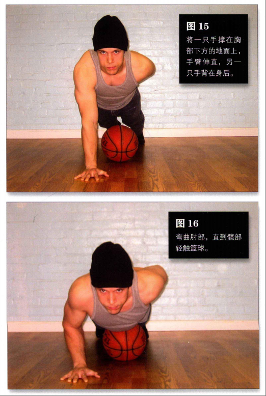

[toc]

# 《囚徒健身》笔记

该文章是阅读《囚徒健身》这本书后的读后感，主要总结了这本书中的几个方面的笔记。

关于健身技巧方面，对于初学者来说，《囚徒健身》这本书提供了一个系统且安全的训练框架。它的训练方式温和且循序渐进，避免了因过度训练或错误动作导致的受伤风险。同时，由于不需要任何器械，随时随地都能进行训练，非常适合时间和场地受限的人群。

关于背景故事方面，由于《囚徒健身》这本书关于作者经历的真实性存在争议。因此《囚徒健身》这本书我们只需要关注核心部分，也就是六艺十式。

## 六艺十式

书中最为核心的内容便是“六艺十式”，即六种基础的身体动作，每个动作又分为十个难度递增的阶段。这六种动作分别是：
1. **俯卧撑**：锻炼胸部、肩部和三头肌。从最简单的墙壁俯卧撑开始，逐步进阶到标准俯卧撑、窄距俯卧撑，直至难度极高的单臂俯卧撑。
2. **深蹲**：主要锻炼大腿、臀部和核心肌群。起始于靠墙深蹲，随着训练的深入，过渡到徒手深蹲，最终挑战单腿深蹲。
3. **引体向上**：重点锻炼背部、手臂和肩部。从辅助引体向上开始，逐渐掌握标准引体向上，直至实现单臂引体向上。
4. **举腿**：强化腹部和下背部肌肉。从简单的坐姿举腿起步，逐步升级到悬垂举腿、水平举腿，最终挑战单腿举腿。
5. **桥**：改善脊柱柔韧性，增强背部和颈部肌肉。从半桥开始练习，逐步过渡到标准桥，直至完成全桥。
6. **倒立撑**：锻炼肩部、手臂和核心稳定性。从靠墙倒立撑开始，逐渐掌握自由倒立撑，最终挑战单臂倒立撑。

## 俯卧撑（锻炼胸部）

俯卧撑是最好的上身练习动作，它既可以增强我们的身体力量、打造出结实的肌肉、形成强有力的肌腱，又可以让上身的推力肌肉与腹部、下背部及下身协调工作。

不同形式的俯卧撑锻炼肌肉的程度不同，但俯卧撑的所有变式都能增强力量、打造肌肉。

以正确的方式循序渐进地练习俯卧撑还可以锻炼关节与肌腱，增强身体的整体力量，改善健康状况。支撑手指、腕部、前臂及肘部的那些微小却至关重要的深层肌肉与组织，也会在练习俯卧撑的过程中变得越来越强。

由于每个人的身体类型的不同（四肢的长短、不同部位力量的相对大小、身体中的脂肪比例等方面的差别）。这导致每个人的完美俯卧撑姿势有细微的差别。

对大多数人来说，做俯卧撑最舒服的姿势就是手掌平放在地板上这个经典姿势。当然，腕部有伤的人例外，对他们而言，腕部锁定，以拳头着地做俯卧撑最容易。

> 俯卧撑的一些大体原则

- 避免诡异的角度和手部姿势。找到适合自己的锻炼姿势。
- 躯干、髋部、双腿始终要成一条直线。只有那些腰部力量太弱无法锁定躯干的人，才会出现做俯卧撑时撅屁股的情况。
- 双腿始终要并拢。如果双腿分开,做动作时就无需保持躯干稳定，练习就变容易了。
- 在动作最高点时，双臂要伸直，但不要让肘部完全锁定，而要使其微弯，以免关节不舒服。
- 要平缓地呼吸。根据我的经验:上推时应呼气，下降时应吸气。但如果你感觉呼吸费力，就不要遵循这一原则，而要多呼吸几次。

> 做俯卧撑的速度

最主要的俯卧撑练习还是应该做得慢一些，经2秒降到最低点，坚持1秒，再用2秒回到最高点，之后立即降低身体。

在没热身的情况下，快速地做俯卧撑容易导致关节受伤。

> 俯卧撑的升级表

### 第一式 墙壁俯卧撑

墙壁俯卧撑是最简单的俯卧撑形式，它锻炼的是胸部、肩部和三头肌。

> 动作

面对墙壁站立，双脚并拢，双臂伸直，与肩同宽，双手平放在墙上，手掌与胸等高。这是该动作的起始姿势(图1)。

弯曲肘部,直到前额轻触墙面。这是该动作的结束姿势(图2)。然后将自己推回到起始姿势，如此重复。

> 解析

墙壁俯卧撑只是俯卧撑动作的第一式。既然是第一式，也就最容易的，毫无疑问普通人都能做。

墙壁俯卧撑也是第一个有治疗效果的练习。刚受伤、做过手术或身体正处于恢复期的人若想加快恢复速度、尽快拥有强健的体魄，可以选择这个动作。

肘、腕、肩(尤其是柔弱的肩袖)极易出现慢性或急性损伤，这项练习能够轻柔地剌激这些部位，并改善血液循环。不熟悉徒手体操的初学者应该以较轻柔的动作开始训练，然后逐步提高自己的运动技巧，循序渐进地增强自己的运动能力。

> 训练目标

- 初级标准:1组，各10次
- 中级标准:2组，各25次
- 升级标准:3组，各50次

### 第二式 上斜俯卧撑

> 动作

做这个动作需要借助一个稳固的物体,高度大约是你身高的一半(大概到臀部位置)。桌子、高一些的椅子、工作台、厨房操作台、矮墙、结实的栅栏都是不错的选择。不过你得保证它足够结实。

双脚并拢，身体成一条直线，然后前倾上身，双臂伸直，双手抓住所选物体，与肩同宽。这是该动作的起始姿势(图3)。

弯曲肘部，放低身体，直到胸部轻触物体顶部。如果你选择的物体高度合适，那么此时你的身体与地面的夹角约为45°(图4)。暂停一会，然后将自己推回到起始姿势，如此重复。

> 解析

这个动作的难度比第一式(墙壁俯卧撑)高，因为你将自己推回到起始姿势时，身体与地面的夹角更小，这意味着你的上肢肌肉要承受更大的重量。对大多数人来说，这个动作对肌肉的要求并不太高，而且它能帮助初学者平稳进步，对康复期的健身者也非常有帮助。

> 训练目标

- 初级标准:1组，10次
- 中级标准:2组，各20次
- 升级标准:3组，各40次

> 注意事项

到达动作的最低点时，你的身体与地面的夹角约为45”。初学者如果达不到这么高的水平，那就降低难度(加大倾斜角度，也就是让身体更接近直立)。只要选择高度高于你身体中间点的物体即可。然后，再逐渐减小角度，直到可以轻而易举地完成倾斜45”的上斜俯卧撑。

如果你还想尝试更小的角度，可以利用台阶做此动作。随着能力的提高，你可以逐渐降低支撑物的高度。

### 第三式 膝盖俯卧撑

> 动作

双脚并拢，双膝着地。双臂伸直，与肩同宽。双手在胸部的正下方，两个手掌平放在地面上。脚踝搭在一起，大腿与上身及头部成一条直线，不要撅屁股或者塌腰。这是该动作的起始姿势(图5)。

然后以膝盖为支点,弯曲肘部,直到胸部与地面仅一拳之隔(图6)。暂停一下，然后将自己推回到起始姿势，如此重复。

> 解析

膝盖俯卧撑是俯卧撑系列的第三式，是初学者要掌握的重要动作。它是在地面上做的俯卧撑中最容易的一个，起着承前启后的作用。

此前的俯卧撑都是站立完成的，后面的俯卧撑全是地面动作，而且难度更高。对那些超重或身材走形的人来说，膝盖俯卧撑是不错的起点。因为采用这样的姿势推起上半身相对容易，所以在开始做更难的俯卧撑之前，膝盖俯卧撑是绝佳的热身练习。

>稳扎稳打

如果你不能完成标准的膝盖俯卧撑，可以减小动作幅度。但不要降低到离地面一拳的距离，而是把动作幅度缩短到你能舒服地完成的程度，同时增加次数(约20次)你要不断练习(保持高反复次数),逐渐增加动作深度，直至可以完成标准的膝盖俯卧撑

> 训练目标

- 初级标准:1组，10次
- 中级标准:2组，各15次
- 升级标准:3组，各30次

### 第四式 半俯卧撑

>动作

跪在地板上，双手撑地，双腿向后蹬直。双手与肩同宽，并处于上胸部的正下方。双腿双脚并拢，锁紧身体，使上身、髋部和双腿成一条直线。先伸直手臂，然后降低身体到大约一半臂长的高度，或者直到肘部弯成直角。控制下降高度的绝佳方式就是使用篮球或橄榄球,将球放在髋部下方。这是该动作的起始姿势(图7)。

接下来,弯曲肘部直到髋部与球轻轻接触(图8)。对大多数人来说，这样可以方便且客观地标示这个动作的最低点。暂停一下，然后用力将自己推回到起始姿势。

>解析

半俯卧撑非常重要，要熟练掌握。很多人做俯卧撑的方法都不正确(撅屁股或者塌腰)，这是因为他们的腰部肌肉和脊椎肌肉不发达。这个动作可以锻炼你的腰部肌肉和脊椎肌肉，从而能够锁定髋部，使身体成一条直线。

>训练目标
- 初级标准:1组，8次
- 中级标准:2组，各12次
- 升级标准:2组，各25次

>稳扎稳打

如果你做不了半俯卧撑，可以减小动作幅度。如果你选用的是篮球，那就将其放在膝盖下，而不是髋部下方。伸直手臂，然后慢慢降低身体，直到膝盖与球接触，这相当于四分之一俯卧撑。如果你能做 10 次以上四分之一俯卧撑，那就可以把篮球向上移点儿，就这样逐步移动篮球，直到其位于髋部下方为止。

### 第五式 标准俯卧撑

>动作

跪在地板上，双手撑地，双腿向后蹬直。双腿双脚并拢，双手与肩同宽，并处于上胸部的正下方。双臂伸直,臀部与脊椎成一条直线。这是该动作的起始姿势(图9)。

接着弯曲肘部，直至胸部与地面仅一拳之隔。若你是单独锻炼，又想控制动作幅度，并想让身体与地面保持正确距离，可以在胸部正下方放一个棒球或网球(图10)。你在做动作的过程中，待胸部碰到球后暂停一下，然后回到起始姿势。

>解析

这就是“经典”俯卧撑。大多数人在体育课上学到的就是这个动作。说到俯卧撑，大多数人脑海中浮现的也是这个动作。标准俯卧撑是极好的上身练习动作，可以锻炼我们的手臂、胸部和上肢带肌，而且效果明显。然而无论如何，标准卧撑的难度并不是最高的，它在十式中只排第五。

> 训练目标
- 初级标准:1组，5次
- 中级标准:2组，各10次
- 升级标准:2组，各20次

>稳扎稳打

你可能感到费解，很多看上去很健硕的家伙都不能正确地完成标准俯卧撑。如果你也一样，那还是找个篮球做半俯卧撑吧!如果你已能很好地完成第四式，当球放在髋部下面时，你能重复此动作 25次，那么每次训练时你可以把球向前移动几厘米，在次数保持不变的情况下继续练习。当你的下颚能碰到球时，你再尝试做标准俯卧撑。

### 第六式 窄距俯卧撑

>动作

窄距俯卧撑的起始姿势与标准俯卧撑基本相同(见第五式)，只不过需要双手相触(无需重叠)，也不需要让双手的拇指与食指构成一个“钻石”，只要两个食指指尖相触就可以了。

从手臂伸直的起始姿势开始(图11)，慢慢放低身体，直到胸部轻触手背(图 12)。暂停一下，然后将自己推回到起始姿势。

> 解析

窄距俯卧撑很古老，它在俯卧撑十式中至关重要，因为窄距卧撑在攻克单臂俯卧撑之旅中必不可少。

大多数人做单臂俯卧撑都会感到吃力，他们会发现很难在身体降到最低点之后再把自己推起来。这是因为此时肘部的弯曲程度最大，而肘部的弯曲角度超过直角时胳膊就很难使上力气。做窄距俯卧撑时，由于双手的特殊位置，当你的身体降到最低点时，肘部的弯曲度比做标准俯卧撑时的更大。这个动作可以锻炼三头肌，并且强化你的肘部与腕部的肌腱。因此，能舒服地做窄距俯卧撑的人在终于要挑战单臂俯卧撑的时候，会更从容一些，

> 训练目标
- 初级标准:1组，5次
- 中级标准:2组，各10次
- 升级标准:2组，各20次

>稳扎稳打

如果你做不了双手相触的窄距俯卧撑(如上所述)，可以继续做标准俯卧撑，在次数不变的前提下，让双手逐渐靠近，每次靠近几厘米，

### 第七式 偏重俯卧撑

>动作

双脚并拢，双腿、髋部、上身成一条直线。双臂伸直，双手撑地，并处于上胸部的正下方。一只手稳固地支撑身体，另一只手撑在篮球上，这是该动作的起始姿势(图13)。

找到平衡之后，尽力将身体的重量均匀地分摊在两只手上。这样做虽然不容易，但一定要坚持。接下来，弯曲肘部，慢慢降低身体，直到胸部轻触撑在篮球上的那只手(图 14)。暂停一下，然后将自己推回到起始姿势。

> 解析

这是第一个高级俯卧撑动作，它能够帮助健身者适应由双手俯卧撑向单臂俯卧撑的过渡。你也可以选用一个固定的物体(如篮球)，不过篮球是最好的选择控制篮球的同时可以锻炼你的肩袖，这有助于你完成难度更高的动作。你还可以选用足球，但篮球还是首选，因为篮球表面租糙更容易抓握。

> 训练目标

- 初级标准:1组，5次(每侧)
- 中级标准:2组，各10次(每侧)
- 升级标准:2组，各20次(每侧)

>稳扎稳打

能正确地完成窄距俯卧撑的人都可以信心十足地尝试这个动作。如果刚开始你觉得有些困难，那是因为你的协调性不好，而不是力量不足。你可以用固定的物体，而不用会滚来滚去的篮球。砖块是个不错的选择，等你可以在一块砖上重复此动作 20次之后，你就可以尝试将两块砖摞起来做这个动作。在你可以在三块垒起的砖上重复此动作 20次之后，你就可以尝试用篮球练习了。

### 第八式 单臂半俯卧撑

>动作

摆出半俯卧撑最高点时的姿势，即将篮球放在髋部下方(见第四式)。将一只手撑在胸部下方的地面上，手臂伸直，另一只手背在身后。这是该动作的起始姿势(图15)。

接着弯曲肘部，直到髋部轻触篮球。这是该动作的最低点(图16)。暂停一下，然后将自己推回到起始姿势。

如果你的肱三头肌不够发达，那做该动作时上身很容易发生扭曲。坚持住，整个身体保持一条直线，做所有俯卧撑都应如此。

>解析

单臂半俯卧撑是俯卧撑系列的第八式。通过这个练习，训练者可以逐步从双侧练习转为单侧练习。该动作可以提高你的平衡能力，而这对做单管俯卧极其重要。因为只靠单臂发力，所以这个动作也会让手部、腕部和肩部关节为之后的动作做好准备。单半俯卧撑在这个系列中不可或缺，你必须掌握。不过由于肘关节只是部分弯曲，所以对一次完整的俯卧撑训练来说，只做这样的练习是不够的。你需要再做一些肘部弯曲角度小于 90”的练习来补充，比如在之后加上窄距俯卧撑或偏重俯卧撑，

> 训练目标
- 初级标准:1组，5次(每侧)
- 中级标准:2组，各10次(每侧)
- 升级标准:2组，各20次(每侧)

>稳扎稳打

如果做不了单臂半俯卧撑，你可以把篮球放在膝下，做四分之一单臂俯卧撑。练习一段时间之后，就一点点向前移动篮球，加大动作幅度。

### 第九式 侧推俯卧撑

>动作

摆出做俯卧撑的姿势，身体成一条直线，一只手撑在胸部正下方的地面上，另一只手放在身体外侧的篮球上，靠双脚和撑在地上的那只手支撑身体。双臂伸直，放在球上的手要尽量向远处伸。这是该动作的起始姿势(图17)。

要有控制地慢慢放低身体，自到胸部与地面只有一拳之隔。如果你是独自锻炼，可以像做标准俯卧撑那样，借助棒球或网球控制动作幅度。放低身体时手会顺势把篮球推到远离身体的位置(图18)。身体降至最低点时，暂停一下，然后将自己推回到起始姿势。

>解析

标准杠杆俯卧撑的难度与单臂俯卧撑相差无儿，这也正是杠杆俯卧撑在俯卧撑十式中排在第九的原因。你会发现，撑在篮球上的那只手臂几乎帮不上什么忙，这就迫使支撑身体的手臂必须使出全力。如果你还没强大到足以在做单臂俯卧撑时把自己撑起，那你可以先练习杠杆俯卧撑。

>训练目标

- 初级标准:1组，5次(每侧)
- 中级标准:2组，各10次(每侧)
- 升级标准:2组，各20次(每侧)

>稳扎稳打

由于杠杆原理，撑在篮球上的那只手臂如果完全伸直的话就很难用力。你可以让这只手臂的肘部稍稍弯曲，从而让篮球离你的身体近一点儿，这样做杠杆俯卧撑会容易一些。不过不要太过，要是你把篮球放在身体正下方，那这个动作就变成了第七式--偏重俯卧撑。随着你越来越强壮，你可以逐渐让球远离身体，直到可以将手伸直做标准的杠杆俯卧撑。

### 第十式 侧推俯卧撑

>动 作

跪在地板上，一只手撑在你前方的地面上。双腿向后蹬直，用脚趾支撑身体。脊柱与髋部成一条直线，支撑身体的手臂在胸部下方伸直--不要在身体侧面或是靠前的位置。稳定之后，把不起支撑作用的那只手背在身后。这是该动作的起始姿势(图19)。

弯曲肘部，有控制地放低身体，直到下巴与地面大约有一拳之隔(图20)。在动作的最低点暂停一下，然后将自己推回到起始姿势。

>解 析

姿势正确的单臂俯卧撑是检验胸部与肘部力量的黄金标准，而且能够让人一见难忘。

许多健身者都声称自己能做单臂俯卧撑，但你千万不要被他们蒙骗。当你让他们动真格的时候，你就会发现，他们所谓的单臂俯卧撑就是个笑话。双腿朝两边分开，上身丑陋地扭曲，这是为了更容易做动作，然后他们会用摇摇摆摆、虚弱无力的胳膊猛地将自己推起，而且他们只能完成少数几次反复。

毫无疑问，真正能做单臂俯卧撑的人可谓是危险的稀有动物，你要对自己有点儿信心，相信自己也能跻身其间。

>训练目标

- 初级标准:1组，5次(每侧)
- 中级标准:2组，各10次(每侧)
- 精英标准:1组，100次(每侧)

>稳扎稳打

如果你已经攻克了杠杆俯卧撑，那么单臂俯卧撑对你而言就不是特别忍怖了。但是如果你还不能标准地完成5次单臂俯卧撑，那么你还是回到第九式，确保自己可以标准地完成 20次杠杆俯卧撑。如果你能做到这一点，但做单臂卧撑还是有问题，那么请你继续练习杠杆俯卧撑，直到你可以完成30次反复，然后再挑战单卧撑。

### 变式

俯卧撑有许多变式，但是你应该把主要精力放在前面讲的十式上。不过你可能偶尔也想试试这些变式，或许是想将其作为收尾练习、带伤练习，或许就是为了换个花样。

下面我将介绍一些俯卧撑的变式。

#### 屈臂撑

这是学校体育课上的经典动作。双手抓住两根平行的横杆或是位于身体两侧的平面把自己撑起来,使双脚离地。然后，弯曲肘部,尽可能地放低身体,直到上臂与地面平行。接着，再将自己向上推回到起始姿势。在此过程中保持上身挺直。你可以在做这个动作时把双脚搭在与髋部等高的平面上，这样动作会变得更容易。

另外，你也可以对其稍作改动，借助家中常见的物体做这个动作，比如床、桌子、凳子等，这一变式有时被称为凳子屈臂撑。屈臂撑与凳子屈臂撑并不是真正意义上的俯卧撑，但它们也能锻炼相当一部分推力肌群，还能强有力地(非静力地)作用于背阔肌(上背部侧面的大肌肉)。

#### 下斜俯卧撑

下斜俯卧撑有时被误称为上斜俯卧撑。做下斜俯卧撑时，你需要抬高双脚(放在比双手高的平面上)。

许多家伙都会借助床铺来做这个动作，不过你可以使用更高的物体，如书桌或洗激台。有些人甚至会把双脚高高地蹬在墙上，但要保持这个姿势身体必须绷得特别紧。双脚抬起时，双手就要承受更多的体重，这样难度便加大了。另外，由于身体与地面的角度变大，该动作将会比标准俯卧撑更强烈地作用于胸部的上半部分和肩部。

#### 弹震式俯卧撑

也就是众所周知的击掌俯卧撑，是一种爆发力练习。动作过程中身体始终要挺直，快速下降到最低点后再用力将自己推起，当动作达到最高点时让手掌暂时离地。在半空中快速击掌，然后让手掌着地，反复练习。你将自己推起的力量越大，身体就抬得越高用于击掌的时间也就越长。许多人都能击掌三次，甚至四次。

最难的是单臂击掌俯撑只用单臂推起身体，然后击掌。击掌俯卧撑可以提高你的速度，你可以将其用作健身计划的补充，偶尔为之。但是击掌俯卧撑很容易让训练者受伤，所以你不要急于尝试这个动作--至少要等到攻克了偏重俯卧撑之后。

#### 水平俯卧撑

水平俯卧撑对身体素质有很高的要求，不但每一块肌肉都有要强劲有力，而且还要有较高的平衡能力与协调能力。此外，这也是个很酷的聚会特技。双手撑地，与肩同宽，双臂弯曲，肘部内收，贴在身体两侧，然后身体前倾，直到双脚离地，双腿锁定想要保持这个姿势，你的背部和双腿必须像铁板一样坚挺。水平俯卧撑是块难啃的硬骨头，攻克它的关键就是坚持练习十式，增强身体的力量。坚持练习，你一定会成功的!

## 深蹲（锻炼腿部）

大多数人提到力量时，想起的只是上半身。宽阔的肩部、隆起的胸肌、粗壮的手臂都被视为强壮的基本标志，好像没人会真的想到双腿。

这一现象在普通健身爱好者的健身计划中也有所反映。你可以到健身房中参观一下看看那些在力量训练区的家伙都在干什么。你会看到很多人在锻炼肩部、躯干和手，甚至有些人正在排队等着做卧推,做斜托弯举或是拉力器下压,好让自己的肱三头肌“鼓”起来。全世界90%的健身房力量训练，很可能都是在锻炼上半身，我估计其中几乎有95% 锻炼的是手臂。在健身房中，你只能看到寥寥几人在努力地锻炼腿部。

其实，真正的力量源于部和腿部，而不是上身和手臂。只要我们不是飘在半空中或双腿离地坐着，那我们上肢做的所有动作都依赖于腿部传递的力量。上身力量在许多体育运动中都很重要，但如果没有强劲有力的下身做基础，上身力量全无用处。

对很多运动员来说，只有当他们腿部受伤时下身力量的重要性才会体现出来。若膝盖受到损伤或腘绳肌撕裂，健身者就会明白无误地理解下身是何等重要了。你可以在自己有腿伤时试着做一些上身动作，如摔跤、拳击、推、拉等，你会发现自己几乎不可能完成这些动作，更不用说下身动作了，如跑步、跳跃、等。

毋庸置疑，大多数体育运动都以下身为基础，也就是说这些运动极大地依赖腿部力量，上身相对而言并不是那么重要。

练出真正强健有力、行动敏捷的双腿的最佳方式就是用最少的、能锻炼尽可能多的腿部肌肉的练习动作来锻炼。最理想的情况是只练习一个动作，那就是深蹲。

> 深蹲的几个要点

- ==最重要的一点是你哪个姿势舒服，就采用哪个姿势。这是你身体的本能反应。记住练习深蹲时，你需要找到最有力、最舒服的姿势，并坚持用这种姿势锻炼。==
- 不同幅度的深蹲会锻炼不同肌肉。标准深蹲能够锻炼下半身的所有肌肉，动作进行到最低点时，大腿后侧会紧贴小腿你的身体将无法继续降低。这时需要大腿和膝盖共同发力才能将身体推起，直到双腿完全伸直。动作幅度再小哪怕一点都算不上“全幅”。
- 有些人认为，直接深蹲到最低点对膝盖不好，事实并非如此。只有在你的膝盖预先有问题时，深蹲才不利于它们。而大多数时候，深蹲甚至有助于缓解盖问题。如果膝关节处的肌腱还不适应较低的姿势，就可能扭伤。但是如果你循序渐进地小心练习，你的膝盖就能变得很结实，足以练习标准深蹲。
- 在将双腿完全伸直的过程中，肌肉的确会有一瞬间不承受压力，这是事实。但是，如果短暂的放松可以在下次转换成更大的力量，就没有什么不好。切记，做深蹲时一定要完全伸直双腿。
- 在深蹲过程中，不要直接就那样蹲下了，而要用肌肉力量有控制地下蹲。下蹲过程中身体要前倾，但不要过分前倾。因为这样将过分锻炼髋部，而忽略了大腿。前倾是必要的，但不要养成向前弓背的习惯。
- 在深蹲到最低点时，你实际是“坐着”。请按照“坐”的标准来要求自己，而不是按照“蹲”的标准要求自己，有时这会帮助训练者降得更低，因为这有助于矫正部的姿势，避免屁股向后摄。
- 最低点的姿势是深蹲中最难控制的部分。你在深蹲中绝不能快速下蹲，然后直接“反弹”(靠惯性)站起，这会严重损伤膝关节处的软骨。你应该通过慢慢练习增强肌腱的力量。
- 建议在动作最低点坚持1秒钟。在动作最低点坚持一会儿是个好习惯，但这并不是万灵药，在这种情况下你仍然可能作弊。有些人在起身的时候会出现摇晃前倾的趋势，这可以为起身提供性，使最初几厘米的移动变得更容易，可这样做会让膝盖承受多余的压力。你应该保持上半身不动，只靠腿部发力将自己推起。如果你做不到，那说明这个动作对你而言太难。你应该回到更容易的动作，坚持锻炼。
- 有些人发现，深蹲时不得不抬起脚跟，所以他们干脆就在脚跟下放上木板或砖块这是个坏习惯。需要抬起脚跟与平衡能力或身体结构无关。之所以会这样，只是因为你的脚踝缺乏灵活性，跟腱不够柔韧。如果你的韧带和肌很僵硬，在深蹲时脚踝不能充分弯曲，那你的双脚脚跟就会不自觉地抬起。一定不要使用木板之类的东西，你应该经常拉伸小腿，直到自己可以在不借助任何辅助的情况下做深蹲。

### 第一式 肩倒立深蹲

>动 作

平躺，双膝弯曲，双手下压。双脚蹬离地面，直到举到空中。在将双腿举起的过程中，顺势把双手撑在下背部，注意上臂要紧贴地面。你现在摆出的姿势是肩倒立,靠双肩上背部以及上臂支撑身体。要记住，始终用这几个部位支撑身体，不要让颈部受到压力身体要锁定伸直，髋部不要弯曲。这是该动作的起始姿势(图21)。

上半身要尽可能伸直弯曲髋部与膝关节，直到膝盖轻触前额,这是该动作的结束姿势(图22)。然后伸直双腿直到身体回到起始姿势，如此重复。

> 解 析

对任何开始练习深蹲的人来说，肩倒立深蹲都是完美的起点。由于做该动作时身体处于倒立姿势，所以膝盖和下背部无需承受身体的重量，这就使得该动作成为一个理想的恢复性训练动作--可以帮助那些背部和膝盖有伤的健身者，或是刚做完手术正处于恢复期的健身者重新开始腿部训练。从力量角度来说，做肩倒立其实对健身者上身的要求更高。但是这一动作能让紧绷的关节放松，增加关节的活动幅度，从而能让初学者为练就完美的深蹲打下基础。

>训练目标

- 初级标准:1组，10次
- 中级标准:2组，各25次
- 升级标准:3组，各50次

>稳扎稳打

第一次尝试该动作时，不是人人都能做到漆盖轻触前额。你可以在每次锻炼时试着加大动作幅度，这样你的关节很快就会得到放松。另外，有酒肚的人几乎无法完成这个动作，因为他的大肚子会碍事。对这类人来说，坚持空腹练习会好一些,直到他们减掉肚子上的赘肉。

### 第二式 折刀深蹲

>动 作

站在一个稳固的物体前，此物体的高度大约与你的膝盖等高，至少也要达到胫骨上部，小咖啡桌、椅子、床铺都是不错的选择。双腿分开，与肩同宽或略宽。双伸直，弯腰俯身，直到双手与面前的物体接触。身体前倾，使一部分体重落在双手上。这是该动作的起始姿势(图 23)。

上半身尽量与地面平行，弯曲膝关节和部，直到大腿后侧紧贴小腿，无法蹲得更低为止。这是该动作的最低点(图24)。下蹲过程中你还需要弯曲双臂，在下降到最低点后腿部与手臂要同时发力，将身体推回到起始姿势。在整个动作过程中，脚跟始终不能抬离地面。

>解 析

做折刀深蹲时上半身前倾，并不直接位于双腿上方，因此两条手臂会承担一部分体重。该动作的难度大约只有标准深蹲(第五式)的一半，但这是能帮助下身肌肉与肌腱为之后的动作做准备的最佳动作。只要正确练习，这个动作就能让初级健身者拥有足够的平衡能力和跟腱的柔韧性，来征服标准深蹲中的最低点，

> 训练目标

- 初级标准:1组，10次
- 中级标准:2组，各20次
- 升级标准:3组，各 40次

>稳扎稳打

下降到最低点时该动作的难度最大，因为此时下肢需要承担身体的大部分重量。如果你觉得动作有难度，那就逐步加大动作幅度来慢慢适应。还有一种方法就是让双臂分担更多的身体重量，这样能够帮助你从最低点站起来。等腿部更强壮之后，你就可以试着减少双臂的用力，更多地依赖双腿。

### 第三式 支撑深蹲

>动 作

直立，双脚分开，与肩同宽或略宽。手臂向斜下方伸出，双手放在比自己的大腿略高的稳固物体上，书桌、高脚凳或椅背都可以。这是该动作的起始姿势(图25)。

弯曲髋部与膝关节，身体慢慢下降，背部尽可能保持挺直，直到大腿后侧紧贴小腿，无法得更低为止，这是该动作的最低点(图26)。

暂停一会，然后主要靠腿部发力站起来。为了分担双腿的一部分压力，尤其是在最低点时，你要通过向下按压面前的物体，来借用手臂的一部分力量。手臂要尽量伸直，在整个动作过程中都不要让脚跟抬离地面。

>解 析

支撑深蹲是半深蹲之前的最后一式。它是折刀深蹲(双腿承受大部分身体重量)与半深蹲(双腿承受全部身体重量)之间理想的过渡动作。支撑深蹲能够进一步加强下肢的柔韧性和力量，锻炼膝盖的肌腱、韧带及软组织。它能让你的深蹲动作更标准，锻炼你仅仅使用肌肉力量而非惯性从最低点推起身体的能力。

>训练目标

- 初级标准:1组，10次
- 中级标准:2组，各15次
- 升级标准:3组，各 30次

>稳扎稳打

要想对该练习所需的腿部力量进行微调，方法非常简单。要使该练习对下身来说更容易，只要更多地使用上身的力量即可。随着你在动作最低点时感觉越来越轻松，你可以逐渐减少在起身过程中臂力的使用。

### 第四式 半深蹲

>动 作

站立，双脚分开，与肩同宽或略宽。脚尖不要指向正前方，而要略微向外。双手放在髋部、胸部、肩部都可以,以舒适为前提。这是该动作的起始姿势(图27)。

弯曲髋部和膝盖，直到膝关节弯曲成90度,换句话说就是大腿与地面平行。这是该动作的最低点(图28)。

刚开始你可以借助一面镜子或是找朋友帮忙，直到能够自如地控制动作幅度。不要求快，也不要借助惯性起身，而要完全在肌肉控制下做整个动作。在最低点(半空中)坚持1秒钟，然后再回到起始姿势。在整个动作过程中，背部始终要挺直，双脚脚跟始终不能抬离地面。膝盖与脚尖应该始终朝向同一方向，深时膝盖绝不要向内转，脚尖指向外有助于你做到这一点。

>解 析

在深蹲系列中，半深蹲是双腿在没有任何辅助的情况下承受全部体重的第一式。因此，它应该受到重视。该动作教你在无辅助的情况下保持平衡和身体姿势，这些对于后面的深蹲练习都是必要的。

此外，该动作也能够让你了解如何让膝盖与双脚摆出对你来说最适合的姿势。这个动作对大腿而言难度并不大，因此下面给出的训练目标量比正常的量要大。攻克了这个动作之后，你会发现自己髋部和大腿内侧的肌肉变得更强了

>训练目标

- 初级标准:1组，8次
- 中级标准:2组，各35 次
- 升级标准:2组，各50次

>稳扎稳打

如果做不了半深蹲，那就先做四分之一深蹲，每当你感到有余力时，就可以适当加大动作幅度。

### 第五式 标准深蹲

>动 作

直立，双脚分开，与肩同宽或略宽(取决于个人偏好)。双脚略向外转，双随意摆放，只要舒服即可。这是该动作的起始姿势(图29)。

髋部与膝关节弯曲，背部始终挺直。当大腿达到几乎与地面平行时，把你的身体重心向后转移，就像要坐下一样。有控制地继续放低身体，直到大腿后侧紧贴小腿。这是该动作的最低点(图30)。

暂停一会，然后仅靠腿部发力将自己推回到起始姿势。起身过程和下蹲过程应该是完全相反的。脚跟始终不要抬离地面，膝盖也不能向内转。

>解 析

标准深蹲是经典的自身体重练习动作。数千年来该动作始终流行于世，是有一定原因的。标准深蹲能够强化膝关节，并增强大腿肌肉、臀部肌肉、脊椎肌肉和部肌肉的力量和运动能力。另外，这个动作也能使小腿、胫骨前肌、脚踝，甚至包括脚掌得到相应的锻炼。标准深蹲有助于让双腿保持年轻活力。

>训练目标

。初级标准:1组，5 次
。中级标准:2组，各10次
。升级标准:2组，各30次

>稳扎稳打

如果你已经达到了半深蹲的升级标准，那么做标准深蹲就不会有太大问题。由于杠杆原理，当动作到达最低点时难度最大，对个子较高的人来说尤其如此。如果你达不到初级标准的目标，那就继续去做半深跳。如果你感到自己变强了，那就增加几厘米的动作幅度。不要心急，一定不要借助惯性起身、让脚跟离地或是摇晃前倾。要纯使用肌肉力量，否则就别练了!

### 第六式 窄距深蹲

> 动 作

直立，双脚脚跟相碰，脚尖微微向外，双臂前伸。这是该动作的起始姿势(图31)。

弯曲膝盖和髋部，直到大腿后侧紧贴小腿，无法蹲得更低为止。此时，你的胸部应该紧贴大腿(图32)。

注意，脚跟始终不要抬离地面。为避免后倾，你得收缩胫骨肌肉使身体微微前倾。保持这一姿势，然后仅靠腿部发力将自己推回到起始姿势

> 解 析

窄距深蹲具有标准深蹲的所有益处，但是对股四头肌的影响更大。经常练习该动作真的能强化你的膝盖、胫骨和臀部肌肉，让你的臀部更紧实，效果比任何一种器械训练都好。

> 训练目标

。初级标准:1组，5次
。中级标准:2组，各10次
。升级标准:2组，各20次

> 稳扎稳打

很多训练者练习前几式时进展神速，但到了窄距深蹲就会碰到问题,即在动作最低点或接近最低点时，身体有可能失去平衡而后倾。这些问题在腿骨长、个头高的训练者身上尤为突出。之所以会出现这些问题，是因为训练者胫骨前侧的肌肉缺乏力量以及平衡能力不强。如果练习前几式时你的进度太快，那就回到标准深蹲，在练习过程中逐渐缩小双脚之间的距离--每次缩小几厘米。双臂前伸能够让重心前移。此外，你也可以手拿重物--如哑铃、书或矿泉水瓶等--练习该动作，不过最好还是空手能完成。有些训练者由于身体结构的原因，做该动作真的很困难，如果你就是这样，那么可以让双脚胸跟保持一掌的距离。

### 第七式 偏重深蹲

>动 作

直立，一只脚踩在地上，另一只脚的脚跟放在位于自己前方、距身体约一步远的篮球上。双脚分开，与肩同宽或略宽，双臂在胸前伸直。这是该动作的起始姿势(图33)。

弯曲膝盖和髋部，直到踩在地上的那条腿的大腿后侧紧贴小腿后侧。这是该动作的最低点(图34)。刚开始练习时，到达最低点后可能出现身体后倾的情况，所以要确保身后有足够的干净空间，这一点对所有全幅深蹲都适用。

暂停一下，然后双腿发力把自己推回到起始姿势。在动作过程中，脚跟始终不要抬离地面，身体不要向前晃，尽管你可能不自觉地想这样做。切记，要有控制地完成整个动作。

>解 析

偏重深蹲是到挑战单腿深蹲的第一步。到现在为止，深蹲系列中各式的动作都是对称的--都能够均衡地锻炼双腿。练习该动作时，放在篮球上的那条腿位置相对较高，而且又必须控制篮球，所以无法完全发力。踩在地上的那条腿需要承担大部分工作，要有足够的力量在另一条腿的辅助下把身体从最低点推起。这个动作还可以很好地改善你的平衡能力与协调能力。

>训练自标

。初级标准:1组，5次(每侧)
。中级标准:2组，各10次(每侧)
。升级标准:2组，各20次(每侧)

>稳扎稳打

与前几式相比，该动作需要更多的技巧和更大的力量。如果把脚架在篮球上难以保持平衡，那你可以选用稳固的物体(如三块垒起的砖头)代替篮球。如果这样还是有问题，你可以选择降低物体的高度(如一块砖)。随着你的信心与平衡能力的增强，可以逐渐增加物体的高度。

### 第八式 单腿半深蹲

>动 作

直立，只靠一条腿站立，另一条腿向前抬起，伸直或略微弯曲，抬起的脚大约处在另一条腿大腿的高度上，双手向胸前伸出。这是该动作的起始势(图35)。

弯曲部和支撑腿的膝盖，直到膝关节几乎弯曲成 90°，即大腿几乎与地面平行。在此过程中，抬起的那条腿应该始终在空中。这是该动作的最低点(图36)。

暂停一会，然后单腿发力把自己推回到起始姿势。在动作过程中，背部始终要保持平直，而且支撑腿的脚跟始终不能抬离地面。

>解 析

该练习是深蹲系列中第一个完全的单腿动作。攻克这个动作很重要，因为这可以让健身者的平衡能力得到极大的提升，从而为标准单腿深蹲打下基础。通过这个动作，健身者能够逐步掌握非支撑腿长时间离地的技巧。这可不容易，因为这需要非常强壮的髋部屈肌，可大多数人的髋部屈肌都很弱。由于只有一条腿支撑身体，所以这个动作可以更好地增强我们的腿部力量。不过由于该动作的运动幅度只有正常的一半，所以在练习该动作时，应该辅以一个全幅动作--窄距深蹲或偏重深蹲都可以。

>训练目标

。初级标准:1组，5次(每侧)
。中级标准:2组，各10次(每侧)
·升级标准:2 组，各20次(每侧)

>稳扎稳打

达到偏重深蹲升级标准的健身者，做该动作应该不成问题。如果你发现这个动作对你来说还是个挑战的话，那就先使用更小的动作幅度，随着体能的发展再逐步增加下蹲的深度即可。

### 第九式 单腿辅助深蹲

>动 作

把篮球放在要练的那条腿的外侧。直立，一只脚平放在地面上，另一只脚在你前方拾起--同单腿半深蹲(第八式)的起始姿势。抬起那条腿的同侧手臂向前伸出，另一只手臂自然垂于体侧(图37)。

然后弯曲部和支撑腿的膝盖，直到大腿后侧紧贴小腿，无法继续下蹲为止。此时，你的手应该稳稳地放在篮球上，这是该动作的最低点(图38)。

起身时主要依靠腿部力量，但你也要用手按压篮球，以便在反向动作的最初阶段借力。注意，在动作过程中，支撑腿的脚跟始终不能抬离地面。

>解 析

任何一种深蹲动作的最低点都是最难的，单腿深蹲尤其如此。该动作通过允许你做反向动作时在至关重要的最初几厘米中用手辅助、借力，安全地解决了在最低位置时的问题。通过练习该动作，你膝关节处的韧带与肌腱将变强，之后你就可以信心十足地开始挑战最终式--单腿深蹲。另外，该动作还会迫使部屈肌更加用力，以保持抬起的那条腿比做单腿半深蹲时抬得更高，而这可能需要你花点儿时间才能适应。在这重要的一式上投入点时间。

>训练目标

。初级标准:1组，5次(每侧)
。中级标准:2 组，各10次(每侧)
·升级标准:2组，各20次(每侧)

>稳扎稳打

如果你还达不到该练习的初级标准，那就试着使用比篮球高的物体，椅子或矮咖啡桌都是不错的选择。相比于使用篮球，这些物体可以在更大的运动范围内为你的手提供支撑。一旦你借助更高物体能完成该动作，就可以换用矮一些的物体，就这样循序渐进地练习，直到你准备好再次尝试用篮球做该动作。

### 第十式 单腿深蹲

> 动 作

直立，抬起一条腿，直到脚大约与髋部等高，腿要尽量伸直，双臂在胸前前伸。如果你在之前几式上已经花了大量时间，那么这些对你来说不会太难。这是该动作的起始姿势(图 39)。

然后弯曲部与支撑腿的膝盖。你应该有控制地放低身体，不要一下蹲到底。缓慢地下蹲，直到支撑腿的大腿后侧紧贴小腿，无法继续下蹲为止。此时，你的腹部应该与支撑腿的大腿紧贴在一起。这是该动作的最低点(图40)。

在紧张状态下暂停一下(数一个数)，然后单腿发力把自己推回到起始姿势。注意，千万不要借助惯性起身。在动作过程中，背部始终挺直，抬起的腿始终离地，而支撑腿则应稳稳地踩在地上。到达动作最高点时暂停一下，然后再下蹲。

>解 析

单腿深蹲是深蹲动作之王，也是锻炼下身力量的终极练习。它可以锻炼脊椎、髋部、大腿、小腿和双脚，还能增强我们的耐力和运动能力。久而久之，皮包骨的双腿将变成强有力的支柱--有钢索般的股四头肌、硬如岩石的大肌、壮硕有形的小腿。掌握这个动作,你的双腿就绝不会衰老。而且,它还会保护你免受髋部病痛与膝关节损伤的折磨

>训练目标

- 初级标准:1组，5次(每侧)
- 中级标准:2组，各10次(每侧)
- 精英标准:2组，各50次(每侧)

>稳扎稳打

如果你达不到单腿深蹲的初级标准，那就到第九式(单腿辅助深蹲)，并使用比篮球略小的物体，如三块据起的砖。逐渐使用越来越小的物体，直到根本无需支撑。

### 变式

#### 弓步

弓步是代替深蹲的经典动作。站立，双脚并拢，一只脚向前面迈一大步。双腿弯曲，背部挺直，直到前膝弯曲接近 90°，后膝几乎接触地面。双腿发力，将身体向后推，直到双腿伸直。接下来，你可以向后撒一步回到起始姿势，然后再重复，或者后向前迈一步再重复。因室内没有太大空间，所以我们都是撤一步回到起始姿势，换腿，另一条腿向前，成弓步，撤回，再换腿。但是，如果你所处的空间很大，那就无需回到起始姿势，只需换腿继续向前即可。若你的双腿状态良好，那你可以这样走很长一段距离。我见过一位特别信赖这个方法的自由搏击选手，他通过数自己走过几遍足球场来判断自己的锻炼程度。

#### 弓步压腿

这是非常不错的弓步变式，每次只集中锻炼一条腿。将一条腿放在大约与膝盖等高的物体上。对我而言，床铺比较合适，你可以借助台阶--尝试不同高度的台阶，以帮助你找到适合自己的高度。抬起的那条腿向前伸出，盖略微弯曲。保持背部挺直，弯曲髋部以及抬起的那条腿，直到大腿后侧紧贴小腿。此时，抬起那条腿的大腿应该紧贴胸部。后面那腿的膝盖可以略微弯曲，以确保安全。但是，主要做动作的应该是前腿。暂停片刻，然后前腿发力，将自己推回到起始姿势。此动作看起来像是蹬腿，但速度更缓慢、更平缓。完成所定的目标次数，然后换腿。练习几百次之后，第二天早晨你的股四头肌将会奇酸无比。

## 引体向上（锻炼背部）

引体向上是现存最古老的肌肉练习动作。

> 收紧双肩

收紧双肩在任何悬垂练习中都对保护肩部有重要意义。肩关节是球窝关节，这种关节的运动极其灵活，但其代价就是极易受伤。双手抓据横杆、身体悬于空中时，如果肩部放松，球窝关节就会被完全拉伸，只靠弹性不足的韧带维系稳定。这样不仅会使韧带受力过大，引起发炎，而且有时也会导致肩部完全或部分脱臼。这种情况虽然不常见，但的确会发生。如果有伤在先，情况会更危险。

做动作时如果肩部保持收紧，密集的肌肉群就会把关节和韧带保护起来，脱白也就无从发生了。悬垂式的练习(尤其是引体向上和举腿)是极好的、应该享受终生的练习，所以你从一开始就要掌握正确的方法。

收紧双肩不是大幅度动作，从外面几乎看不出来，只不过是训练者将肩关节向下拉了两三厘米(参见图片),只需收紧背阔肌就行。练习时，整个上身要保持稳定，用不了多久你就会习惯这样了。

> 抓握姿势

关于引体向上，另一个争论点是抓握姿势。有正握(指根关节朝向自己)、反握(指尖朝向自己)、侧握(拇指朝向自己)……那种抓握姿势更好呢?

这要视情况而定。要考虑的最重要因素是运动生理学家所谓的“内旋现象”。在引体向上这个动作中，内旋现象是指当我们把身体拉起时，我们的双手会不自觉地向内转。这是一个非常小的自然动作，一般不会影响标准的引体向上的效果。但在整个引体向上系列中，随着动作难度的不断提高，其影响会变得越来越明显。

做引体向上的要诀是，早期练习时可以使用最容易的抓握方式。本书中的练习示范通常是正握，对大多数人来说，这是最有力的抓握姿势，但反和侧握也都可以。可是当练习进入标准引体向上之后的阶段，内旋现象的影响会越来越大，这时如果你再使用固定姿势进行练习可能会感觉不舒服。如果真是这样，那你可以试试新的抓握姿势。

> 蹬腿

应该借助肌肉力量完成引体向上，而不是惯性。但是肌肉缺乏力量的人在做引体向上时会不自觉地向上抬膝盖，以获得惯性来完成动作。这种作弊技巧有专门的名称叫蹬腿。

蹬腿会给关节带来不必要的压力，造成一种很有力量的错觉，动作也容易走形。因此，初学者在做引体向上时千万不要蹬腿，应该坚持标准的姿势,经2秒钟拉起身体暂停1秒钟，再经2秒钟放低身体，再暂停1秒钟。记住，千万不要用惯性。如果非得借助惯性你才能做几次引体向上，那你应该返回去做那些无需作弊就可以完成多次的、更容易的动作。

记住，当你想升级到下一式时，只有不蹬腿所做的次数才算数。

> 体重与引体向上

与大多数其他练习(比如俯卧撑)不同，引体向上需要训练者移动全身。这意味着你身体上的每一克体重都必须被拉起来，经过整个动作过程。因此训练者越重，就越难在引体向上系列中进步。纯粹肌肉的重量不是你掌握引体向上十式的障碍，但如果你身上有多余的几十斤无用的脂肪，那第五式或第六式的前景都很渺茫，除非你天生神力或是动作不标准。

如果真是这样，你也不要太担心。遵循引体向上系列的十式，能做到哪一式就做到哪儿，然后坚持练习不要放弃。竭尽所能做这项练习--其他五艺也是如此---同时控制饮食以减掉额外的体重。有志者事竟成!

> 慢慢来

引体向上系列比六艺中的大部分动作更具挑战性，这主要是因为要依靠上肢移动全身。所以想要在引体向上系列中进步，所用的时间必定比俯卧撑系列(只需移动身体的一部分重量)和深蹲系列(使用的是强劲有力的下肢肌肉)的更长。

做引体向上系列时进步慢是很正常的。即使你非常努力地训练，想要前进一步有时也要用上好几个月，这不是什么坏事。记住，这只是因为这些动作所需的力量非常大所以进度才看起来比较慢，但这也意味着每一点微小进步都会转变成巨大的能力提升你的注意力应该集中在这上面，不要光想者时间。

不要急于从一个动作过渡到下一个动作，这条建议适用于所有的自身体重练习。切记，升级到某一系列中难度更高的动作，只是表明你的力量增加了而已。而这些增加的力量，只是通过目积月累地重复难度较低的动作才实际获得的。加急升级并不能使你更快地获得力量。

如果你的身体还没有准备好，那你绝不能从一个动作贸然升级到另一个动作，那样最终会导致失败和失望。最成功的体操运动员都深明此理。他们会学着爱上自己正在做的任何练习，他们研究它，沉迷于它，掌握其中的微妙变化;他们会在这个动作上真的投入时间和精力，就像这是他们的终极练习一样。他们有耐心，给身体足够时间打造真正的力量，时候一到他们自然就能做更难的动作。从长远来看，如果你能培养这种态度你就会做得更快、走得更远。

### 第一式 垂直引体

>动 作

找一个可抓握且很稳固的竖直物体，门框和高一点的栏杆都是上好之选。靠近物体站立，脚尖与之保持约8-15厘米的距离。以舒服的姿势抓住该物体，理想情况是双手与肩同宽，但不必要--只要双手对称即可。这是该动作的起始姿势(图41)。

由于你距离物体很近，所以手臂会弯曲。身体慢慢向后倾，在此过程中伸展手臂，直到手几乎伸直、身体后倾与地面成一定角度为止。这是该动作的结束势(图42)。此时，你的上背部应该有拉伸感，手臂可能也会有同感。暂停一会，再并拢肩胛骨并弯曲手臂把身体拉回到起始姿势。暂停，然后再重复该动作。

>解 析

垂直引体是动作非常轻微的引体向上动作。对那些背部和手臂力量正处于恢复阶段的训练者来说，这是非常理想的练习。此外，这个动作对肩部、二头肌或肘部受过伤的训练者而言更适合，因为它可以增加血液流动，并让他们的身体找回“拉力”的感觉对初学者来说，这也是上好的练习。由于该动作强度较小，可以使初尝拉力训练的人，在进人难度更大的动作之前真切地感受肩部和上背部肌肉的“发力"

>训练目标

。初级标准:1组，10次
。中级标准:2组，各20次
。升级标准:3组，各 40次

>稳扎稳打

垂直引体几乎是人人都能做的简易练习。如果你正处在伤病康复阶段，觉得该动作对某些身体部位(也许是缝针部位)而言太过剧烈，那就减小动作幅度，绷紧肩部，别让手臂伸得太直。

### 第二式 水平引体向上

>动 作

找一个至少与你的髋部等高、稳固且双手可抓握的水平物体。该物体要能安全地承载你的体重，又大又结实的桌子(如餐桌和书桌)通常是最佳之选。钻到子下面胸部与下肢都位于桌子下面，抬手抓住桌子边缘(使用正握姿势)。理想情况是，双手与肩同宽，但这要取决于你用的是什么样的桌子。然后拉起身体，使背部离地，只有脚跟与地面接触。有时你的手特可能需要适当弯曲才能使背部离地--这取决于桌子的高度。身体绷紧，让双手和双脚脚跟承担身体的重量。这是该动作的起始姿势(图43)。

然后平缓地拉起身体，在此过程中整个身体(尤其是膝盖)要成一条直线，直到胸部触到桌子边缘。这是该动作的结束姿势(图44)。暂停一下，然后降低身体，回到起始姿势如此重复。

>解 析

水平引体向上与垂直引体类似，但练习水平引体向上时身体会更加倾斜，因此该动作对力量的要求更高。这是非常好的过渡练习，在开始后续的悬垂式练习之前，训练者一定要掌握它。该动作也可以强健
某些关节，尤其是易于受伤的肘关节和肩关节。

>训练目标

。初级标准:1组，10次
。中级标准:2组，各20次
。升级标准:3组，各30次

>稳扎稳打

所用物体越高，该练习也就更容易。如果刚开始你觉得太难，那就找一些比自己部略高的物体。等你能做30次反复之后，再尝试用与髋部等高的物体来练习。在该动作中，双脚会在地面上适当滑动，如果这个过程中的摩擦对你构成了明显阻力，那么可以试着使用更容易滑动的鞋或地板,这样双手的位置就可以在动作过程中适时调整，从而免除了双脚滑动的必要性。

### 第三式 水平引体向上

>动 作

练习折刀引体向上需要高一点的横杆，横杆下面放一把高脚凳或类似物体。向上跳起抓住横杆，手臂大约与肩同宽，采取正握姿势。用横杆训练时，肩部始终要收紧，手臂也不能完全放松，肘部微微弯曲。将双腿向上摆，把双脚脚跟搭在横杆前方的高脚凳上，双腿要完全伸直。该物体要足够高，理想情况是双腿伸直时脚踝与骨盆恰好在同一高度，此即经典的折刀角度。这是该动作的起始姿势(图45)。

然后平缓地把身体拉起，伸直的双腿向下压以帮助完成动作，最后使下巴高过横杆。这是该动作的结束姿势(图46)。暂停一下,然后降低身体,在肌肉的完全控制下回到起始姿势。注意，每组练习都不要做到“精疲力竭”，好在练习结束后能安全地下来。如果你还没站稳就松开双手，可能会跌倒受伤。

>解 析

折刀引体向上是全幅度引体向上动作。由于双腿要承担一部分体重，在动作最低点时还可以起协助作用，所以该练习比标准引体向上容易。

>训练目标

。初级标准:1组，10次
。中级标准:2组，各 15次
。升级标准:3组，各20次

>稳扎稳打

最低点是所有引体向上动作中最难的部分。如果你做不了全幅的折刀引体向上，那就先集中练习上半部分的动作幅度，也就是手臂保持一定的弯曲度，随着力量的增长再逐渐增加动作幅度。