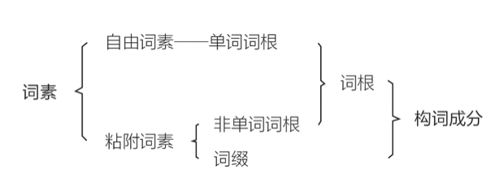

## 《英语词根和单词的说文解字》笔记

### 1. 前提知识

> 什么是词素？

①根据层次语法理论与系统功能语法理论的“级阶成分分析法”，语⾔有句⼦、分句、词组、词和词素 五个⾃上⽽下的语法层次。从结构上看，下⼀层的语法单位构成上⼀层的语法单位。即多个词素构成了单词，多个单词构成了词组等。
②根据这种语⾔理论，产⽣了“词素构词理论”：⼀切单词都是由⼀个或多个词素构成的，词素则是最低⼀级有区别性的语法单位。也就是说，词素是最⼩的⾳义结合的单位。
③词素分为两种：可单独作为词使⽤的叫⾃由词素，如英语中的friend、white、wash、you等；不能单独使⽤的，必须与其他词素结合成单词才能使⽤的，叫粘附词素(不自由词素)，如英语中的vis、manu、lect、- ible、-ly、-er、un-等。

总结：
1. 词素是英语中的最小语法单位。即最小音义单位（最小有含义的单位）。
2. 词素分为两种：自由词素，粘附词素（不自由词素）
2. 自由词素是可以作为单词单独使用，粘附词素无法作为单词单独使用。

> 什么是词根,词缀？

词根的定义：一个单词中带有主要词汇意思的语法单位。
词缀的定义：一个单词中带有次要词汇意思的语法单位。
因此结合词素来看，词根 = 自由词素 + 部分粘附词素。词缀 = 另一部分粘附词素。

总结：词根与词素一样也分为自由词根和粘附词根两种，自由词根就是自由词素，粘附词根是部分粘附词素。由于历史原因，粘附词根相比自由词根的数量要多的多。

举例：
词根词素的定义对汉语的构字与构词也是适⽤的。汉语中也有两种词根：⼀ 种是能独⽴成字的基本单字，如：⼈、⼿、⾔、⼼、⽔……；⼀种是不能独⽴成字的义符偏旁或部⾸， 如：亻、扌、讠、忄、氵……。⼆者都是汉语中含有主要词汇信息的最⼩单位。

> 词根的历史

从语源上说，英语词根可分成本族语词根与外来语词根。本族语词根在现代英语中多以⾃由词根(单词)的形式出现。外来语词根在现代英语中多以粘附词根的形式存在。绝大多数的简单单词都是由自由词根组成。复杂的单词大多都是由粘附词根组成。

同时由于历史原因，粘附词根相比自由词根的数量要多的多。英语学习的难点就是认识粘附词根。

> 自由词根，粘附词根的形态和含义的由来

自由词根：可以作为单词使用。粘附词根：无法作为单词使用。

由于粘附词根是无法单独作为单词使用的词根。那么粘附词根的形态，含义是从何而来？
总结：由于粘附词根来源于外来语词根，因此它的形态和含义是根据外来语来演变的。

> 词缀:

英语词缀可分为派⽣词缀与原⽣词缀。
派生词缀：能与⾃由词根及单词结合形成派生词。
原生词缀：只能与粘附词根结合，形成原生词。

> 英语构词法

根据词素构词理论，可将构词法分为三种。
第一种：词根无词缀
第二种：自由词根 + 派生词缀
第三种：粘附词根 + 原生词缀

### 2. 120个最常用词根

1. ag,act = 做，驱使
派生词：
agent:

