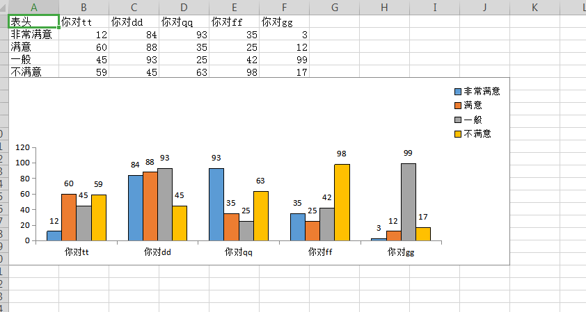

## ApachePOI

Apache POI提供API给Java程序对Microsoft Office格式档案读和写的功能。

## 1.基础操作

HSSF类提供读写 Microsoft Excel XLS 格式文件的功能。
XSSF类提供读写 Microsoft Excel OOXML XLSX 格式文件的功能。
HWPF类提供读写 Microsoft Word DOC 格式文件的功能。


## 2.读取excel中的数据。并在其中创建图表

> 1. 创建excel文件

```java
    /**
	 * 创建xls后缀的excel文件对象
	 * @param fPath
	 * @throws Exception
	 */
	public static HSSFWorkbook createExcel1(String fPath) throws Exception{
//		String fPath1="C:\\Users\\Administrator\\Desktop\\demo1.xls";
		
		//1.示例excel文件路径
		String filePath = fPath;
		//2.根据文件路径创建输出流
		FileOutputStream out =new FileOutputStream(filePath);
		//3.创建excel对象
		HSSFWorkbook workbook =new HSSFWorkbook(); //xls后缀文件由HSSF类创建
		//4.创建sheet工作簿对象
		HSSFSheet sheet = workbook.createSheet();
		//5.把excel文件写入到文件流中。保存Excel文件
		try {
			workbook.write(out);
			//6.关闭文件流
			out.close();
			System.out.println("success");
		} catch (IOException e) {
			System.out.println("fail");
		}
		return workbook;
	}
	
	/**
	 * 创建xlsx后缀的excel文件对象
	 * @param fPath
	 * @throws Exception
	 */
	public static XSSFWorkbook createExcel2(String fPath) throws Exception{
//		String fPath2="C:\\Users\\Administrator\\Desktop\\demo2.xlsx";
		
		//1.示例excel文件路径
		String filePath = fPath;
		//2.根据文件路径创建输出流
		FileOutputStream out =new FileOutputStream(filePath);
		//3.创建excel对象
		XSSFWorkbook workbook =new XSSFWorkbook(); //xlsx后缀文件由XSSF类创建
		//4.创建sheet工作簿对象
		XSSFSheet sheet = workbook.createSheet();
		//5.把excel文件写入到文件流中。保存Excel文件
		try {
			workbook.write(out);
			//6.关闭文件流
			out.close();
			System.out.println("success");
		} catch (IOException e) {
			System.out.println("fail");
		}
		return workbook;
	}
```

> 2. 数据处理

```java

	/**
	* 填充数据到xlsx文件中
	* @throws Exception
	*/
public static void addData() throws Exception{
	String fPath1="C:\\Users\\Administrator\\Desktop\\demo1.xlsx";
	File file = new File(fPath1);
	
	//1,创建excel对象
	XSSFWorkbook workbook=new XSSFWorkbook();
	//2.创建excel中的sheet工作簿
	XSSFSheet sheet = workbook.createSheet("工作簿1");
	//3.创建sheet中的第一行HSSFRow对象
	XSSFRow row0 = sheet.createRow(0);
	//4.给第一行填充数据
	row0.createCell(0).setCellValue("用户表");
	row0.createCell(1).setCellValue("姓名");
	row0.createCell(2).setCellValue("年级");
	row0.createCell(3).setCellValue("班级");
	//5.给其余几行填充数据
	for(int i=0;i<4;i++){
		XSSFRow row = sheet.createRow(i+1);
		for(int j=0;j<4;j++){
			row.createCell(j).setCellValue("2");
		}
	}
	//6.把excel对象写入到目标文件中
	try {
		//把目标文件放到输出流中
		OutputStream outputStream=new FileOutputStream(file);
		workbook.write(outputStream);
		System.out.println("success");
	} catch (Exception e) {
		System.out.println("fail");
	}
}


	/**
	* 从excel文件中读取数据
	* @throws Exception
	*/
public static void readData() throws Exception{
	String fPath1="C:\\Users\\Administrator\\Desktop\\demo1.xlsx";
	File file = new File(fPath1);
	XSSFWorkbook workbook=new XSSFWorkbook(file);
	XSSFSheet sheet0 = workbook.getSheetAt(0);
	//1.获取sheet的总记录条数
	int rows = sheet0.getLastRowNum();
	//2.按行遍历
	for (int i = 0; i <= rows; i++) {  
		Row row = sheet0.getRow(i);
		if(row != null){
			//3.获取当前行的列数
			int columNos = row.getLastCellNum();
			//4.遍历列
			for (int j = 0; j < columNos; j++) {
				Cell cell = row.getCell(j);
				if(cell != null){
					System.out.print(cell.getStringCellValue()+",");
				}
			}
			System.out.println();
		}
	}
}

```

> 3. 模拟业务数据，创建表格和柱状图。

```java
public class barChart2{

    public static void main(String[] args) throws Exception {
        //datalist用于存储除表头的全部数据
    	//titleArr存储表头数据
        Map<String, List<Object>> datalist=new LinkedHashMap<String, List<Object>>();
        List<String> titleArr = new ArrayList<String>();// 标题
        //表头数据
       titleArr.add("表头");
       titleArr.add("你对tt");
       titleArr.add("你对dd");
       titleArr.add("你对qq");
       titleArr.add("你对ff");
       titleArr.add("你对gg");
        
        //li~li4表示为4行不同的满意度的数据
		 List<Object> li=new ArrayList<Object>();
		 List<Object> li2=new ArrayList<Object>();
		 List<Object> li3=new ArrayList<Object>();
		 List<Object> li4=new ArrayList<Object>();
		 //每行数据第一个为左边字段的数据
		 li.add("非常满意");
		 li2.add("满意");
		 li3.add("一般");
		 li4.add("不满意");
		 
		 Random random = new Random();
		 for(int i=0;i<5;i++) {
			 li.add(random.nextInt(100)+1);
			 li2.add(random.nextInt(100)+1);
			 li3.add(random.nextInt(100)+1);
			 li4.add(random.nextInt(100)+1);
		 }
		 
       datalist.put("data1",li);
       datalist.put("data2",li2);
       datalist.put("data3",li3);
       datalist.put("data4",li4);
 
        XSSFWorkbook wb = new XSSFWorkbook();
        XSSFSheet sheet = wb.createSheet("Sheet1");
        int tableRow  = 0;
        int barRow = tableRow+5;    //第一个图在哪一行创建的索引
        createTable(sheet,datalist,titleArr,tableRow);
        //创建柱状图
        createBarChart(sheet,titleArr,barRow,tableRow);
        
        String filepath ="C:\\Users\\Administrator\\Desktop\\"+System.currentTimeMillis() + "demoChart.xls";
        FileOutputStream fileOut = new FileOutputStream(filepath);
        wb.write(fileOut);
        fileOut.close();
    }
 
    /**
     * @Description: 创建Excel数据表格
     * @param wb:工作薄
     * @param sheet：wb.createSheet();
     * @param datalist  除表头数据外的数据
     * @param titleArr 表头数据
     * @param tableRow:从第几行开始(0：就是第一行)
     * @return boolean
     */
    public static void createTable(XSSFSheet sheet,Map<String,List<Object>> datalist,List<String> titleArr,
                       int tableRow) {
    	//导入表头字段,创建第一行标题行
        Row row0 = sheet.createRow(tableRow);
        for (int i = 0; i < titleArr.size(); i++) {
            row0.createCell(i).setCellValue(titleArr.get(i));
        }
    	//创建表格，并填入数据
    	System.out.println("表格共有多少行数据 datalist.size() = "+datalist.size());
    	//遍历4次，创建4行表格数据
    	for (int i = 1; i <=4; i++) {
        	List<Object> data=new ArrayList<Object>();
            // 获取每一行的数据 
        	if(i==1){
        		data= datalist.get("data1");
        	}else if(i==2){
        		data = datalist.get("data2");
        	}else if(i==3){
        		data = datalist.get("data3");
        	}else if(i==4){
        		data = datalist.get("data4");
        	}
            //在表头行之后创建一行对象
            XSSFRow rowi = sheet.createRow(i+tableRow);
            System.out.println("这一行数据  is "+data.toString());
            for (int j = 0; j < data.size(); j++) {
                // 判断是否是标题字段列
                if (j == 0) {
                    rowi.createCell(j).setCellValue(data.get(j).toString());
                } else {
                    rowi.createCell(j).setCellValue(Integer.valueOf(data.get(j).toString()));
                }
            }
    	}
    }
     
    /**
     * 创建柱状图
     * @param sheet
     * @param title 表头字段
     * @param barRow  柱状图从那一行开始的索引值
     * @param tableRow  表格从那一行开始的索引值
     * @throws Exception
     */
    public static void createBarChart(XSSFSheet sheet,List<String> title,int barRow,int tableRow) throws Exception{
        String sheetName=sheet.getSheetName();
        //创建一个画布
        XSSFDrawing drawing = sheet.createDrawingPatriarch();
        ClientAnchor anchor =null;
        anchor=drawing.createAnchor(0, 0, 0, 0, 0,barRow,10,barRow+15);
 
        //创建一个chart对象
        XSSFChart chart = drawing.createChart(anchor);
        CTChart ctChart = ((XSSFChart)chart).getCTChart();
        CTPlotArea ctPlotArea = ctChart.getPlotArea();
            CTBarChart ctBarChart = ctPlotArea.addNewBarChart();
            CTBoolean ctBoolean=ctBarChart.addNewVaryColors();
            ctBarChart.getVaryColors().setVal(true);
 
            //设置类型
            ctBarChart.addNewGrouping().setVal(STBarGrouping.STANDARD);
            ctBoolean.setVal(true);
            ctBarChart.addNewBarDir().setVal(STBarDir.COL);
 
            //是否添加左侧坐标轴
            ctChart.addNewDispBlanksAs().setVal(STDispBlanksAs.ZERO);
            ctChart.addNewShowDLblsOverMax().setVal(true);
 
            //创建序列,并且设置选中区域
            for (int i = 0; i < 4; i++) {
                CTBarSer ctBarSer = ctBarChart.addNewSer();
                CTSerTx ctSerTx = ctBarSer.addNewTx();
                
                //图例区(柱体图中每一部分的柱子的数量渲染。以及右上角的图例的渲染)
                CTStrRef ctStrRef = ctSerTx.addNewStrRef();
                System.out.println("i+1 = "+(i+1));
                
                //读取指定行，指定列的数据
                //CellRangeAddress(int firstRow, int lastRow, int firstCol, int lastCol)
                String legendDataRange = new CellRangeAddress(i+1,i+1,0,0).formatAsString(sheetName, true);
                ctStrRef.setF(legendDataRange);
                ctBarSer.addNewIdx().setVal(i);
 
                //横坐标区
                CTAxDataSource cttAxDataSource = ctBarSer.addNewCat();
                ctStrRef = cttAxDataSource.addNewStrRef();
                String axisDataRange = new CellRangeAddress(0,0,1,title.size()-1)
                        .formatAsString(sheetName, true);
                ctStrRef.setF(axisDataRange);
 
                //数据区域
                CTNumDataSource ctNumDataSource = ctBarSer.addNewVal();
                CTNumRef ctNumRef = ctNumDataSource.addNewNumRef();
                String numDataRange = new CellRangeAddress(i+1,i+1, 1,title.size()-1)
                        .formatAsString(sheetName, true);
                ctNumRef.setF(numDataRange);
 
                ctBarSer.addNewSpPr().addNewLn().addNewSolidFill().addNewSrgbClr().setVal(new byte[] {0,0,0});
 
                //设置负轴颜色不是白色
                ctBarSer.addNewInvertIfNegative().setVal(false);
                //设置标签格式
                ctBoolean.setVal(false);
                CTDLbls newDLbls = ctBarSer.addNewDLbls();
                newDLbls.setShowLegendKey(ctBoolean);
                ctBoolean.setVal(true);
                newDLbls.setShowVal(ctBoolean);
                ctBoolean.setVal(false);
                newDLbls.setShowCatName(ctBoolean);
                newDLbls.setShowSerName(ctBoolean);
                newDLbls.setShowPercent(ctBoolean);
                newDLbls.setShowBubbleSize(ctBoolean);
                newDLbls.setShowLeaderLines(ctBoolean);
            }
 
            //telling the BarChart that it has axes and giving them Ids
            ctBarChart.addNewAxId().setVal(123456);
            ctBarChart.addNewAxId().setVal(123457);
            //cat axis
            CTCatAx ctCatAx = ctPlotArea.addNewCatAx();
            ctCatAx.addNewAxId().setVal(123456); //id of the cat axis
            CTScaling ctScaling = ctCatAx.addNewScaling();
            ctScaling.addNewOrientation().setVal(STOrientation.MIN_MAX);
            ctCatAx.addNewAxPos().setVal(STAxPos.B);
            ctCatAx.addNewCrossAx().setVal(123457); //id of the val axis
            ctCatAx.addNewTickLblPos().setVal(STTickLblPos.NEXT_TO);
            //val axis
            CTValAx ctValAx = ctPlotArea.addNewValAx();
            ctValAx.addNewAxId().setVal(123457); //id of the val axis
            ctScaling = ctValAx.addNewScaling();
            ctScaling.addNewOrientation().setVal(STOrientation.MIN_MAX);
            //设置位置
            ctValAx.addNewAxPos().setVal(STAxPos.L);
            ctValAx.addNewCrossAx().setVal(123456); //id of the cat axis
            ctValAx.addNewTickLblPos().setVal(STTickLblPos.NEXT_TO);
            //legend图注
            CTLegend ctLegend = ctChart.addNewLegend();
            ctLegend.addNewLegendPos().setVal(STLegendPos.TR);
            ctLegend.addNewOverlay().setVal(false);
    }
    
}

```


