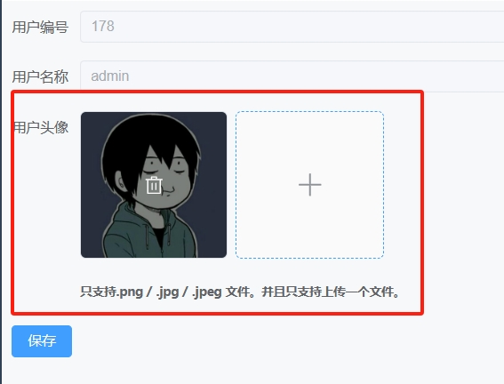
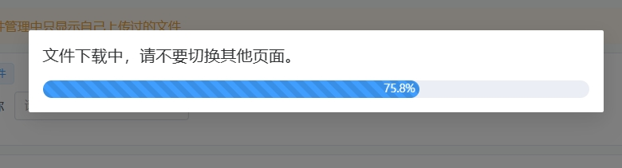
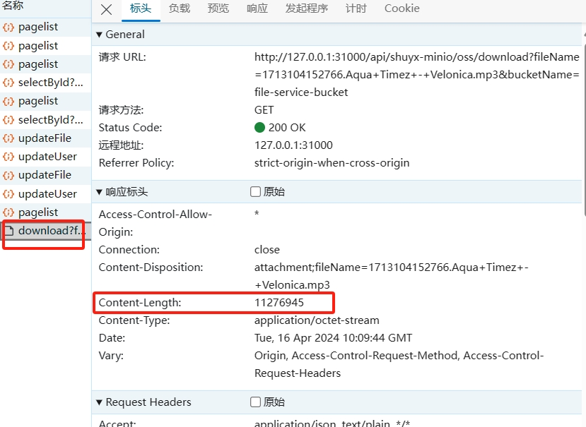

[toc]

# ElementPlus的进度条使用

我们在使用ElementPlus的进度条组件的时候，通常需要让进度条实时显示上传或下载文件的进度。

下面就是我自己写的几个成功的例子。

主要是vue3 + axios + elementplus的搭配

## 上传文件进度条

大概效果图


```html
<template>
          <el-upload
            element-loading-text="获取图片文件中..."
            v-model:file-list="fileList"
            action="#"
            :limit="1"
            list-type="picture-card"
            :auto-upload="false"
          >
            <el-icon><Plus /></el-icon>
            <template #file="{ file }">
              <div>
                
                <span class="el-upload-list__item-actions">
                  <span
                    v-if="!disabled"
                    class="el-upload-list__item-delete"
                    @click="handleRemove(file)"
                  >
                    <el-icon><Delete /></el-icon>
                  </span>
                </span>
              </div>
            </template>
            <template #tip>
              <div class="el-upload__tip" style="font-weight:bold">只支持.png / .jpg / .jpeg 文件。并且只支持上传一个文件。</div>
              <!--进度条-->
              <div v-if="isShowProgress">
                <span>文件进度条</span>
                <el-progress :text-inside="true" :stroke-width="20" :percentage="progressPercent" />
              </div>
            </template>
          </el-upload>
    <template #footer>
      <span>
        <el-button type="primary" @click="submit">保存</el-button>
        <el-button @click="cancel">取消</el-button>
      </span>
    </template>
</template>
<script setup>
import { ref, inject, onMounted } from 'vue'
//此处需要提前引入axios依赖
let axiosService = axios.create({})

//文件图相关=====================
let disabled = ref(false)
let isShowProgress = ref(false)
let progressPercent = ref(0)
let fileList = ref([])
//移除文件
let handleRemove = () => {
  fileList.value = []
}

//点击确定操作
function submit() {
  //判断文件列表是否有文件
  if (fileList.value.length === 0) {
    return ElMessage.error('请选择要上传的文件')
  } else if (fileList.value.length > 1) {
    return ElMessage.warning('默认上传第一个文件，其余文件会被舍弃')
  } else {
    console.log('fileList.value[0]', fileList.value[0].name)
      //开始更新文件
      //显示进度条
      isShowProgress.value = true
      let param = new FormData()
      param.append('file', fileList.value[0].raw)
      param.append('bucketName', 'media-cover-bucket')
      param.append('oldFileName', 'oldFileName')
      //调上传文件接口
        axiosService.request({
            url: '/shuyx-minio/oss/updateFile',
            method: 'POST',
            data: param,
            headers: { 'Content-Type': 'multipart/form-data' },
            //上传进度函数，用于监听文件上传进度
            onUploadProgress:(e) => {
                //函数返回值赋值给进度条
                progressPercent.value = Number(((e.loaded / e.total) * 100).toFixed(0))
            }
        }).finally(() => {
            //进度条隐藏，进度条进度清空
          isShowProgress.value = false
          progressPercent.value = 0
        })
  }
}
</script>
<style scoped></style>
```

实现监听上传文件进度的核心是axios的onUploadProgress函数

```js
axiosService.request({
    //.....
    //上传进度函数，用于监听文件上传进度
    onUploadProgress:(e) => {
        //函数返回值赋值给进度条
        progressPercent.value = Number(((e.loaded / e.total) * 100).toFixed(0))
    }
})
```

java后端代码,这里是java + minio 来实现文件存储

```java
@PostMapping("/updateFile")
public Object updateFile(@RequestParam("file") MultipartFile file, String bucketName, String oldFileName) {
    log.info("/shuyx-minio/oss/updateFile, file {} ,bucketName {},oldFileName {}", file, bucketName, oldFileName);
    try{
        //先删除旧文件
        myMinioClient.removeObject(
                RemoveObjectArgs.builder()
                        .bucket(bucketName)
                        .object(oldFileName)
                        .build());
        //再上传新文件
        //新文件名
        String newFileName = System.currentTimeMillis() + "." +  file.getOriginalFilename();
        //文件类型
        String contentType = file.getContentType();
        //上传文件
        minioUtils.uploadFile(bucketName, file, newFileName, contentType);
        JSONObject jsonObject = new JSONObject();
        //新文件名就是文件链接
        jsonObject.put("fileUrl",newFileName);
        return ReturnUtil.success(jsonObject);
    }catch(Exception e){
        log.error("文件更新异常，请查询日志");
        e.printStackTrace();
        return ReturnUtil.fail(ResultCodeEnum.BUSINESS_UPDATE_FAILED);
    }
}
```


## 下载文件进度条



```html
<template>
  <!--文件下载进度条-->
  <el-card
    v-if="isShowProgress"
    shadow="never"
    :body-style="{ padding: '10px' }"
    style="margin-top: 10px"
  >
    <el-dialog
      v-model="isShowProgress"
      title="文件下载中，请不要切换其他页面。"
      :show-close="false"
      :close-on-click-modal="false"
      :close-on-press-escape="false"
      destroy-on-close
    >
      <el-progress
        :text-inside="true"
        :stroke-width="20"
        :percentage="progressPercent"
        striped
        striped-flow
      />
    </el-dialog>
  </el-card>
</template>
<script setup>
import { ref, onMounted, provide } from 'vue'
//此处需要提前引入axios依赖
let axiosService = axios.create({})

//下载相关==
let isShowProgress = ref(false)
let progressPercent = ref(0)
function toDownload(obj) {
    //显示进度条
    isShowProgress.value = true
    //调用下载接口
    let a = {
    fileName: obj.fileAddress,
    bucketName: 'file-service-bucket'
    }
    axiosService.request({
        url: '/shuyx-minio/oss/download',
        method: 'GET',
        params: queryData,
        responseType: 'blob',
        headers:{ 'Content-Type': 'application/octet-stream'},
        onDownloadProgress:(e) => {
            //下载函数，把下载进度数值赋值给进度条组件
            progressPercent.value = Number(((e.loaded / e.total) * 100).toFixed(1))
        }
    }).then((res) => {
        //通过blob来接收下载文件的二进制流。
        let blob = new Blob([res])
        // 然后通过模拟a标签，点击a标签来下载文件
        let elink = document.createElement('a')
        elink.download = a.fileName
        elink.style.display = 'none'
        elink.href = URL.createObjectURL(blob)
        document.body.appendChild(elink)
        elink.click()
        URL.revokeObjectURL(elink.href)
        document.body.removeChild(elink)
    }).finally(() => {
    //隐藏进度条
      progressPercent.value = 0
      isShowProgress.value = false
    })
}
</script>
<style scoped></style>
```

实现监听下载文件进度的核心是axios的onDownloadProgress函数。
```js
axiosService.request({
    //.....
    //下载进度函数，用于监听文件下载进度
    onDownloadProgress:(e) => {
        //函数返回值赋值给进度条
        progressPercent.value = Number(((e.loaded / e.total) * 100).toFixed(1))
    }
})
```

<font color="red">
注意：使用axios的onDownloadProgress函数监听下载进度。有一个前提就是让后端在响应头中加上content-length，存放下载文件的总大小
</font>



> 后端java代码:

这里是java + minio 来实现文件存储

```java
@GetMapping("/download")
public void download(@RequestParam("fileName") String fileName, @RequestParam("bucketName") String bucketName, HttpServletResponse response) throws IOException {
    log.info("/shuyx-minio/oss/download, fileName,{},bucketName,{}", fileName, bucketName);
    InputStream inputStream = null;
    OutputStream outputStream = null;
    try {
        //先查询文件信息
        StatObjectResponse fileInfo = minioUtils.getFileInfo(bucketName, fileName);
        //设置响应请求
        response.setContentType("application/octet-stream");
        //设置content-length响应头参数
        response.setContentLengthLong(fileInfo.size());
        response.setHeader("Content-Disposition", "attachment;fileName=" + URLEncoder.encode(fileName, "utf8"));
        //获取文件的二进制流
        inputStream = minioUtils.getObject(bucketName, fileName);
        outputStream = response.getOutputStream();
        byte[] buffer = new byte[2048];
        int len = 0;
        while ((len = inputStream.read(buffer)) > 0) {
            outputStream.write(buffer, 0, len);
        }
    } catch (Exception e) {
        e.printStackTrace();
        log.error("文件下载失败,请查询日志");
    } finally {
        inputStream.close();
        outputStream.close();
    }
}
```

<font color="red">
注意：这里的java后端，是先设置了response的响应头参数，然后再把response转换为输出流。如果先把response转换为输出流，那么响应头参数无法设置了。
</font>

