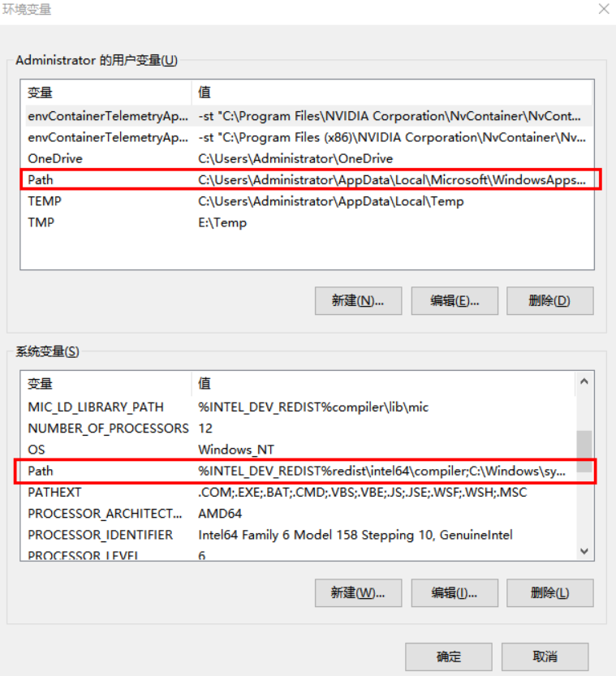
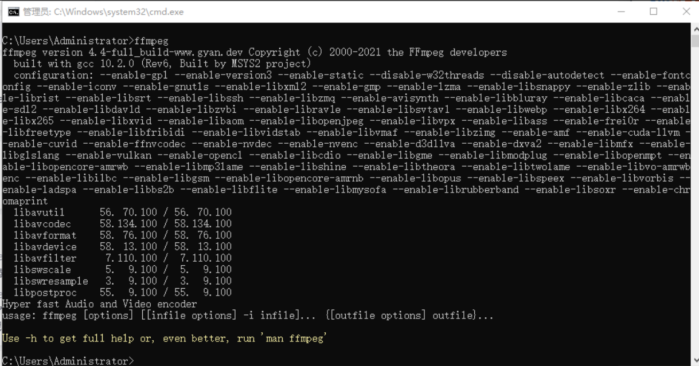

[toc]

## FFmpeg的介绍

FFmpeg是一套可以用来记录、转换数字音频、视频，并能将其转化为流的开源计算机程序。有非常强大的功能包括视频采集功能、视频格式转换、视频抓图、给视频加水印等。

## FFmpeg的安装

① 下载FFmpeg

[下载地址:https://www.gyan.dev/ffmpeg/builds/ffmpeg-release-full.7z](https://www.gyan.dev/ffmpeg/builds/ffmpeg-release-full.7z)

将下载的安装包解压，将其重命名为 ffmpeg，将 ffmpeg 文件夹放置到某个程序文件夹中，如：D:\Program Files

② 配置电脑环境变量

此电脑 > 右键-属性 > 高级系统设置 > 环境变量->双击 Path(选择用户变量和系统变量都可以，可以只操作一个，也可以都操作)



新建path变量,变量值：D:\Program Files\ffmpeg\bin

③ 测试是否安装成功

win+r，输入cmd，在DOS界面直接输入ffmpeg，如果显示这样的界面，说明配置成功。




## FFmpeg的使用场景

例如：当你在b站上一个下载视频时。实际下载下来的是一个视频m4s文件和一个音频的m4s文件。此时可以使用FFmpeg将两个m4s文件混流为一个mp4文件。

```
//在文件所在的根目录。使用命令把video.m4s 和audio.m4s 混流为mp4文件
ffmpeg -i D:/B站下载视频/s_32356/311449/80/video.m4s -i D:/B站下载视频/s_32356/311449/80/audio.m4s -c:v copy -strict experimental xxx4.mp4

// blv文件，先改为flv文件，再把flv转换为mp4文件
ffmpeg -i D:/B站下载视频/s_1586/29134/lua.flv.bb2api.80/aaa.flv -c:v copy -strict experimental FateStayNight-UBW-07.mp4

 //avi转换为mp4
ffmpeg -i F:/B站下载视频/1111/Gantz.TV.2004.DVDRip-Hi.x264.AC3.1280.EP17-nezumi.avi -c copy -map 0 aaa.mp4  

```

## FFmpeg 常用命令

转载自[https://blog.csdn.net/wenmingzheng/article/details/88373192](https://blog.csdn.net/wenmingzheng/article/details/88373192)

### 获取视频基本信息

```
//查看本地的视频信息
ffmpeg -i video.avi　
 
//查看远程视频信息
ffmpeg -i http://static.tripbe.com/videofiles/20121214/9533522808.f4v.mp4
```

### 分离视频音频流

```
//分离视频流
ffmpeg -i input_file -vcodec copy -an output_file_video　　

//分离音频流
ffmpeg -i input_file -acodec copy -vn output_file_audio　　
 
//去掉视频中的音频
ffmpeg -i input.mp4 -an output.mp4             

//去掉视频中的音频
ffmpeg -i test.avi -vcodec copy -an output.avi 
```

### 视频转码相关

```
//ts视频流转mp4
ffmpeg -i test.ts -acodec copy -vcodec copy -f mp4 output.mp4

//h264视频转ts视频流
ffmpeg -i test.h264 -vcodec copy -f mpegts output.ts

//h264视频转mp4
ffmpeg -i test.h264 -vcodec copy -f mp4 output.mp4

//mp4转flv
ffmpeg -i test.mp4 -b:v 640k output.flv 

//mp4转flv
ffmpeg -i test.mp4 -acodec copy -vcodec copy -f flv output.flv 

//flv转mp4
ffmpeg -i test.flv -b:v 640k output.mp4 

//mp4转3gp
ffmpeg -i test.mp4 -s 176x144 -vcodec h263 -r 25 -b 12200 -ab 12200 -ac 1 -ar 8000 output.3gp 

//avi转3gp
ffmpeg -i test.avi -s aqif -vcodec -acodec mp3 -ac 1 -ar 8000 -r 25 -ab 32 -y output.3gp 

//3gp转flv
ffmpeg -i test.3gp -f avi -vcodec xvid -acodec mp3 -ar 22050 output.avi 

//flv转3gp
ffmpeg -i test.flv -s 176x144 -vcodec h263 -r 25 -b 200 -ab 64 -acodec mp3 -ac 1 -ar 8000 output.3gp 

//mp4转avi
ffmpeg -i test.mp4 output.avi 

//flv转mp4
ffmpeg -i test.flv -vcodec h264 -r 25 -b 200 -ab 128 -acodec mp3 -ac 2 -ar 44100 output.mp4 

//mp4转flv
ffmpeg -i test.mp4 -c:v libx264 -ar 22050 -crf 28 output.flv 

//avi转mp4
ffmpeg -i test.avi -c copy -map 0 output.mp4 

//m3u8转mp4
ffmpeg -i  http://vfile1.grtn.cn/2018/1542/0254/3368/154202543368.ssm/154202543368.m3u8 -c copy -bsf:a aac_adtstoasc -movflags +faststart test.mp4 

//mkv转mp4
ffmpeg -i test.mkv -y -vcodec copy -acodec copy output.mp4 

//mkv转avi
ffmpeg -i test.mkv -vcodec copy -acodec copy output.avi  

```

### 图像处理相关

```
//截取指定时间的缩略图，-ss后跟的时间单位是秒
ffmpeg –i test.mp4 -y -f image2 -ss 8 -t 0.001 -s 350x240 testImage.jpg 

//添加图片水印
ffmpeg -i input.mp4 -vf "movie=logo.png [logo]; [in][logo] overlay=10:10:1 [out]" output.mp4

//添加图片水印
ffmpeg -i input.mp4 -i logo.png -filter_complex overlay test1.mp4

//添加图片水印
ffmpeg –i input.mp4 -acodec copy-vcodec copy -vf "movie=test.png[watermark];[in][watermark]overlay=10:10:1[out]" output.mp4

//添加GIF
ffmpeg -y -i test2.mp4 -ignore_loop 0 -i test.gif -filter_complex overlay=0:H-h test_out2.mp4

//添加文字水印
ffmpeg -i input.flv -vf "drawtext=fontfile=simhei.ttf: text='抖音':x=100:y=10:fontsize=24:fontcolor=yellow:shadowy=2" drawtext.mp4

```

### 视频方向处理相关

```js
//旋转90°
ffmpeg -i test.mp4 -metadata:s:v rotate="90" -codec copy out.mp4

//顺时针旋转90°
ffmpeg -i test.mp4 -vf "transpose=1" out.mp4
 
//逆时针旋转90°
ffmpeg -i test.mp4 -vf "transpose=2" out.mp4

//顺时针旋转90°后再水平翻转
ffmpeg -i test.mp4 -vf "transpose=3" out.mp4

//逆时针旋转90°后再水平翻转
ffmpeg -i test.mp4 -vf "transpose=0" out.mp4

//水平翻转视频画面
ffmpeg -i test.mp4 -vf hflip out.mp4

//垂直翻转视频画面
ffmpeg -i test.mp4 -vf vflip out.mp4

```

### 视频剪切相关

```js
//提取图片
ffmpeg –i test.avi –r 1 –f image2 image-%3d.jpeg

//-r 提取图像的频率，-ss 开始时间，-t 持续时间
ffmpeg -ss 0:1:30 -t 0:0:20 -i input.avi -vcodec copy -acodec copy output.avi    

//从10s处开始剪切，持续15秒
ffmpeg -ss 10 -t 15 -i test.mp4 -codec copy cut.mp4
```


### 倒放音视频&加速视频&减速视频

```js
//视频倒放，无音频
ffmpeg.exe -i inputfile.mp4 -filter_complex [0:v]reverse[v] -map [v] -preset superfast reversed.mp4

//视频倒放，音频不变
ffmpeg.exe -i inputfile.mp4 -vf reverse reversed.mp4
 
//音频倒放，视频不变
ffmpeg.exe -i inputfile.mp4 -map 0 -c:v copy -af "areverse" reversed_audio.mp4

//音视频同时倒放
ffmpeg.exe -i inputfile.mp4 -vf reverse -af areverse -preset superfast reversed.mp4

//视频加速，帧速率变为2倍，调整倍速范围【0.25，4】
ffmpeg -i inputfile.mp4 -vf setpts=PTS/2 -af atempo=2 output.mp4

//视频减速播放
ffmpeg -i input.mkv -an -filter:v "setpts=0.5*PTS" output.mkv
```

### 视频拼接

以mp4文件为例子，介绍两种方法，如果不是mp4文件，可以尝试先转码为mp4后再拼接起来。

方法1：将 mp4 先转码为 mpeg文件，mpeg是支持简单拼接的，然后再转回 mp4。

```js
ffmpeg -i 1.mp4 -qscale 4 1.mpg　
　
ffmpeg -i 2.mp4 -qscale 4 2.mpg　
 
cat 1.mpg 2.mpg | ffmpeg -f mpeg -i - -qscale 6 -vcodec mpeg4 output.mp4             
```

方法2：将 mp4 转化为同样编码形式的 ts 流，因为 ts流是可以拼接的，先把 mp4 封装成 ts ，然后 拼接 ts 流， 最后再把 ts 流转化为 mp4。

```js
ffmpeg -i 1.mp4 -vcodec copy -acodec copy -vbsf h264_mp4toannexb 1.ts　　
 
ffmpeg -i 2.mp4 -vcodec copy -acodec copy -vbsf h264_mp4toannexb 2.ts
 
ffmpeg -i "concat:1.ts|2.ts" -acodec copy -vcodec copy -absf aac_adtstoasc output.mp4                         
```

### 视频合并

下面通过动手实现抖音合拍功能来演示命令行的使用，首先准备好两个文件，都是用手机拍摄的。

1. 两个视频的合并（注意参数hstack代表是横向合并，也就是左右合并，横向合并的形象类比为“川”；如果是竖向合并，也就是上下合并，用参数vstack，竖向或者纵向合并的形象类比为“三”）

```js
//注意：经过此命令处理后的视频output.mp4只会保留input1的音频
ffmpeg -i input1.mp4 -i input2.mp4 -lavfi hstack output.mp4
```

2. 提取两个视频中的音频并合并音频

```js
ffmpeg -i input1.mp4 -vn -y -acodec copy audio1.m4a
 
ffmpeg -i input2.mp4 -vn -y -acodec copy audio2.m4a
 
ffmpeg -i audio1.m4a -i audio2.m4a -filter_complex amerge -ac 2 -c:a libmp3lame -q:a 4 audio3.mp3
```

3. 把audio3.mp3文件合并到output.mp4中去。

```js
//success.mp4就是合拍视频，包含了两个视频的音频。
ffmpeg -i output.mp4 -i audio3.mp3 -c:v copy -c:a aac -strict experimental success.mp4
```


如果想要三个视频合并（input=3表示希望合并的视频的个数）

```js
ffmpeg -i input1.mp4 -i input2.mp4 -i input3.mp4 -lavfi hstack=inputs=3 output.mp4
```


## FFmpeg 常用参数说明

```
命令格式：
    ffmpeg -i [输入文件名] [参数选项] -f [格式] [输出文件]
    ffmpeg [[options][`-i' input_file]]... {[options] output_file}...
    (1) h264: 表示输出的是h264的视频裸流
    (2) mp4: 表示输出的是mp4的视频
    (3)mpegts: 表示ts视频流


主要参数：
-i 设定输入流
-f 设定输出格式
-ss 开始时间

视频参数：
-b 设定视频流量，默认为200Kbit/s
-r 设定帧速率，默认为25
-s 设定画面的宽与高
-aspect 设定画面的比例
-vn 不处理视频
-vcodec 设定视频编解码器，未设定时则使用与输入流相同的编解码器，一般后面加copy表示拷贝

音频参数：
-ar 设定采样率
-ac 设定声音的Channel数
-acodec 设定声音编解码器，未设定时则使用与输入流相同的编解码器，一般后面加copy表示拷贝
-an 不处理音频

```