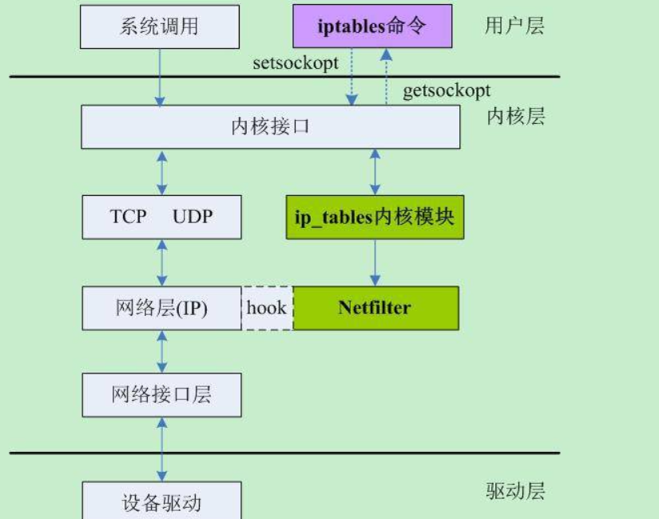
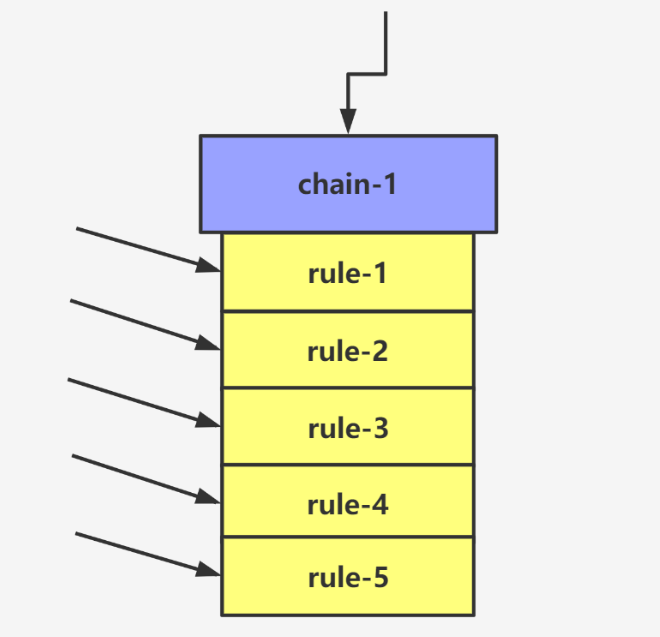
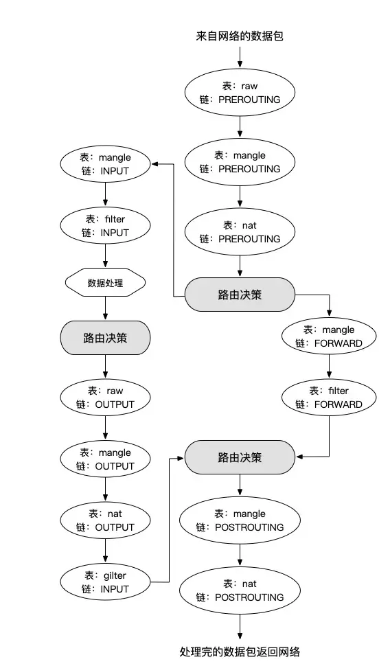
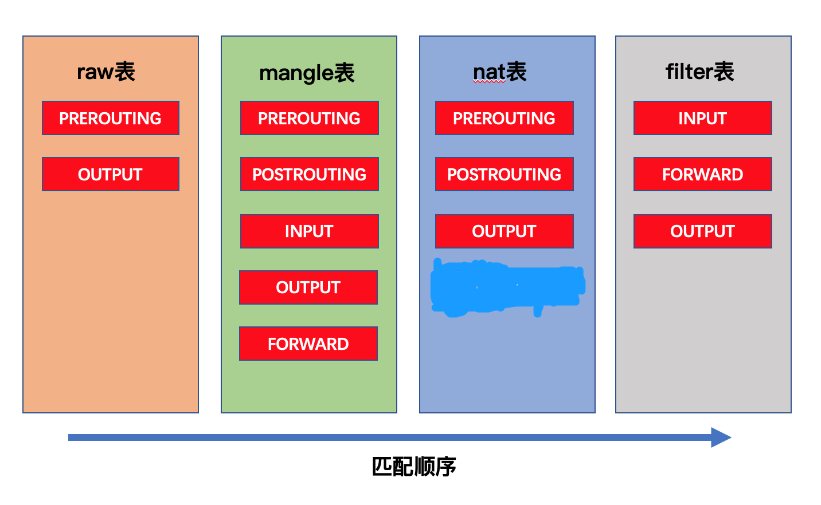

[toc]

# IPtable与NetFilter笔记

## 介绍

> 什么是NetFilter？

netfilter是一个工作在 Linux 内核的网络数据包处理框架。它作为一个通用的、抽象的框架，netfilter在整个网络流程的若干位置上放置了一些检测点（HOOK），而在每个检测点上用一些处理函数来进行处理。

netfilter也提供一整套的hook函数的管理机制，使得诸如数据包过滤、网络地址转换(NAT)和基于协议类型的连接跟踪成为了可能。


> 什么是IPtables？

IPtables 是Linux系统集成的一个 IP 信息包过滤系统。

防火墙在做数据包过滤时，有一套遵循和组成的规则，这些规则存储在 Linux 内核中的数据包过滤表中。而IPtables 可以在数据包过滤表上添加、编辑和移除规则。

简而言之，iptables的主要功能是实现对网络数据包进出设备及转发的控制。当数据包需要进入设备、从设备中流出或者经该设备转发时，都可以使用iptables进行控制。


> NetFilter与IPtables的关系

IPtable和NetFilter共同组成了一个防火墙系统，iptables只是Linux防火墙的命令行管理工具，也可以说是一个客户端，netfilter是防火墙框架，真正实现防火墙功能的是 netfilter，它是Linux内核中的一部分。这两部分共同组成了包过滤防火墙，可以实现完成封包过滤、封包重定向和网络地址转换（NAT）等功能。

简而言之，NetFilter是服务端，IPtables是客户端。二者共同组成一个防火墙系统。我们可以通过IPtables来操控NetFilter。

如图所示



## IPtables

iptables 由表（table）、链（chain）和规则（rule）组成，其中表包含链，链包含规则。


### 链

一个链由多个规则组成。当数据报文进入到链之后，首先匹配链的第一条规则，如果第一条规则通过则访问，如果不匹配，则接着向下匹配，如果链中的所有规则都不匹配，那么就按照链的默认规则处理数据报文的动作。



<font color="red">注意：规则的顺序很重要，重要的规则需要放到前面，让其先匹配。</font>

> 链的种类

Iptables有五种不同的链，如下所示。

* PREROUTING, 路由前，处理刚到达本机并在路由转发前的数据包。
* POSTROUTING, 路由后，处理即将离开本机的数据包。
* INPUT, 数据包流的入口，处理来自外部的数据。
* OUTPUT, 数据包流的出口，处理向外发送的数据。
* FORWARD, 数转发。通过路由表后发现目的地址非本机，则匹配该链中的规则。

> 数据报文在链中的流向

1. 当数据报文要流进本机的某个服务程序时，数据报文要在本机中经过的链

PREROUTING -》INPUT -》目标程序

2. 当数据报文从本机的服务程序流出时，数据报文要在本机中经过的链

源程序 -》OUTPUT -》POSTROUTING

3. 当数据报文经过本机，转发向其他主机时，数据报文要在本机中经过的链

PREROUTING -》FORWARD -》POSTROUTING

完整如图所示



### 表

在一个链中会有很多的防火墙规则，我们将具有同一种类型的规则组成一个集合，这个集合就叫做表。

iptables 具有四个表：filter, nat, mangle, raw。

* filter 表：iptables 的默认表。负责过滤功能、防火墙，也就是由 filter 表来控制数据包是否允许进出及转发。filter 表具可以管理的链路有input, forward, output。
* nat 表：nat 是 network address translation 的简称，具备网络地址转换的功能。nat 表用于控制数据包中地址转换。nat 表可以管理的链路有prerouting, output, postrouting（CentOS 7 中还包含 INPUT，但是在 CentOS 6 中没有）。
* mangle 表：用于处理数据包，具备拆解报文、修改报文以及重新封装的功能。mangle 表可以管理的链路有prerouting, input, forward, output, postrouting
* raw 表：用于处理异常。raw 表可以管理的链路有prerouting, output。

> 表与链的关系




### iptables 命令

iptables 命令格式为：
```
iptables [-t 表名] 命令选项 [链名] [匹配条件] [-j 处理动作或跳转]
```

表名：若无显示设置表名，则默认为filter表。

命令选项
```bash
-L 列出一个或所有链的规则
-v 显示详细信息，包括每条规则的匹配句数量和匹配字节数
-x 在v的基础上，禁止自动换算单位（K,M）
-n 只显示ip地址和端口号，不显示域名和服务名称
-I 插入到防火墙第一条生效
-A 添加链是添加到最后一条
-D 删除指定链中的某一条规则，按规则序号或内容确定要删除的规则
-F 清空指定链中的所有规则，默认清空表中所有链的内容
-X 删除指定表中用户自定义的规则链
```

匹配条件
```bash
-i 入站请求interface（网卡）
-o 出站请求interface（网卡）
-s 入站源地址
-d 目标地址
-p 指定规则协议，如tcp, udp,icmp等，可以使用 all 来指定所有协议
--dport 目的端口，数据包的目的（dport）地址是80，就是要访问我本地的80端口
--sport 来源端口 数据包的来源端口是（sport）80，就是对方的数据包是80端口发送过来的。
```

动作
```
ACCEPT：允许数据包通过。
DROP：直接丢弃数据包，不给任何回应信息，这时候客户端会感觉自己的请求泥牛入海了，过了超时时间才会有反应。
REJECT：拒绝数据包通过，必要时会给数据发送端一个响应的信息，客户端刚请求就会收到拒绝的信息。（一般不使用REJECT(拒绝)行为，REJECT会带来安全隐患。）
SNAT：源地址转换，解决内网用户用同一个公网地址上网的问题。
MASQUERADE：是SNAT的一种特殊形式，适用于动态的、临时会变的ip上。
DNAT：目标地址转换。
REDIRECT：在本机做端口映射。
LOG：在/var/log/messages文件中记录日志信息，然后将数据包传递给下一条规则，也就是说除了记录以外不对数据包做任何其他操作，仍然让下一条规则去匹配。
```

> 例子

```bash
## 查看 filter表的所有规则
> iptables -t filter -L
Chain INPUT (policy ACCEPT)
target     prot opt source               destination   

Chain FORWARD (policy ACCEPT)
target     prot opt source               destination   
ACCEPT     all  --  anywhere             anywhere             ctstate RELATED,ESTABLISHED

Chain OUTPUT (policy ACCEPT)
target     prot opt source               destination

## 只查看 filter 表中 INPUT 链的规则
> iptables -t filter -L INPUT
Chain INPUT (policy ACCEPT)
target     prot opt source               destination

## 只查看 filter 表中 INPUT 链的规则，-v显示出详情信息
> iptables -t filter -vL INPUT
Chain INPUT (policy ACCEPT 1509K packets, 851M bytes)
pkts bytes target     prot opt in     out     source               destination


## 拒绝 host2 上的所有报文访问本机
## 当报文的源地址为 host2 时，报文则被 DROP。命令如下
iptables -t filter -I INPUT -s host2 -j DROP
# -s 指明源地址
# -I 插入，在链的首部插入规则
# -j，指明当匹配条件满足时，所对应的动作
# DROP 丢弃数据包

## 接受来自host2的数据报文访问本机
iptables -A INPUT -s host2 -j ACCEPT
# -A 追加，在链的尾部插入规则
# ACCEPT 接受数据包
```
